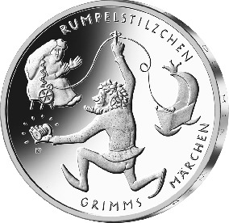
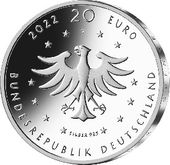

# Bekanntmachung über die Ausprägung von deutschen Euro-Gedenkmünzen im Nennwert von 20 Euro (Gedenkmünze „Rumpelstilzchen“) (Münz20EuroBek 2022-01-20/1)

Ausfertigungsdatum
:   2022-01-20

Fundstelle
:   BGBl I: 2022, 187

## (XXXX)

Gemäß den §§ 2, 4 und 5 des Münzgesetzes vom 16. Dezember 1999 (BGBl.
I S. 2402) hat die Bundesregierung beschlossen, zum Thema
„Rumpelstilzchen“ eine deutsche Euro-Gedenkmünze im Nennwert von 20
Euro prägen zu lassen. Die Münze ist die elfte Ausgabe im Rahmen der
2012 begonnenen Serie „200 Jahre Grimms Märchen“.

Die Auflage der Münze beträgt ca. 1,0 Millionen Stück, davon ca. 0,1
Millionen Stück in Spiegelglanzqualität. Die Prägung erfolgt durch die
Hamburgische Münze (Prägezeichen J).

Die Münze wird ab dem 20. Januar 2022 in den Verkehr gebracht. Sie
besteht aus einer Legierung von 925 Tausendteilen Silber und 75
Tausendteilen Kupfer, hat einen Durchmesser von 32,5 Millimetern und
eine Masse von 18 Gramm. Das Gepräge auf beiden Seiten ist erhaben und
wird von einem schützenden, glatten Randstab umgeben.

Die Bildseite zeigt die drei gegenständlichen Hauptelemente des
Märchens: die Müllerstochter, das Rumpelstilzchen und die Wiege des
erstgeborenen Kindes der Müllerstochter. Der über den Finger des
Rumpelstilzchens geschlungene Faden symbolisiert den Handlungsverlauf.

Die Wertseite zeigt einen Adler, den Schriftzug „BUNDESREPUBLIK
DEUTSCHLAND“, Wertziffer und Wertbezeichnung, das Prägezeichen „J“ der
Hamburgischen Münze, die Jahreszahl 2022 sowie die zwölf Europasterne.
Zusätzlich ist die Angabe „SILBER 925“ aufgeprägt.

Der glatte Münzrand enthält in vertiefter Prägung die Inschrift:

„WAS GIBST DU MIR; WENN ICH DIRS SPINNE? \*“

Der Entwurf stammt von der Künstlerin Katrin Pannicke aus Halle/Saale.

## Schlussformel

Der Bundesminister der Finanzen

## (XXXX)

(Fundstelle: BGBl. I 2022, 187)

*    *        
    *        

