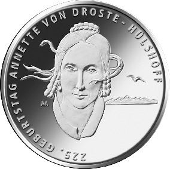
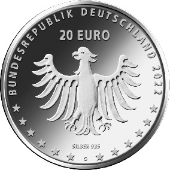

# Bekanntmachung über die Ausprägung von deutschen Euro-Gedenkmünzen im Nennwert von 20 Euro (Gedenkmünze „225. Geburtstag Annette von Droste-Hülshoff“) (Münz20EuroBek 2022-01-20/2)

Ausfertigungsdatum
:   2022-01-20

Fundstelle
:   BGBl I: 2022, 188

## (XXXX)

Gemäß den §§ 2, 4 und 5 des Münzgesetzes vom 16. Dezember 1999 (BGBl.
I S. 2402) hat die Bundesregierung beschlossen, zum Thema „225.
Geburtstag Annette von Droste-Hülshoff“ eine deutsche Euro-
Gedenkmünze              im Nennwert von 20 Euro prägen zu lassen. Die
Münze würdigt die bekannte deutsche Schriftstellerin und Komponistin,
die zu den bedeutendsten deutschsprachigen Dichterinnen und Dichtern
des 19. Jahrhunderts zählt.

Die Auflage der Münze beträgt ca. 0,9 Millionen Stück, davon ca. 0,1
Millionen Stück in Spiegelglanzqualität. Die Prägung erfolgt durch die
Staatlichen Münzen Baden-Württemberg, Prägestätte Karlsruhe
(Prägezeichen G).

Die Münze wird ab dem 24. Februar 2022 in den Verkehr gebracht. Sie
besteht aus einer Legierung von 925 Tausendteilen Silber und 75
Tausendteilen Kupfer, hat einen Durchmesser von 32,5 Millimetern und
eine Masse von 18 Gramm. Das Gepräge auf beiden Seiten ist erhaben und
wird von einem schützenden, glatten Randstab umgeben.

Die Bildseite zeigt Annette von Droste-Hülshoff. Ihr vom Wind gelöstes
Haar kann als Symbol für ihre Befreiung aus den engen Verhältnissen
ihrer Schaffenszeit gesehen werden. Der dargestellte Gesichtsausdruck
zeigt Entschlossenheit und widerspricht den damals gängigen
Erwartungen an Geschlecht und Stand. Im Hintergrund, angedeutet durch
Vogelflug und Alpensilhouette, wird die große Naturverbundenheit der
Autorin dargestellt.

Die Wertseite zeigt einen Adler, den Schriftzug „BUNDESREPUBLIK
DEUTSCHLAND“, Wertziffer und Wertbezeichnung, das Prägezeichen „G“ der
Staatlichen Münzen Baden-Württemberg, Prägestätte Karlsruhe, die
Jahreszahl 2022 sowie die zwölf Europasterne. Zusätzlich ist die
Angabe „SILBER 925“ aufgeprägt.

Der glatte Münzrand enthält in vertiefter Prägung die Inschrift:

„SO GROSSES KLEINOD,
EINMAL SEIN STATT GELTEN!“

Der Entwurf der Münze stammt von der Künstlerin Anna Auras aus
Stuttgart.

## Schlussformel

Der Bundesminister der Finanzen

## (XXXX)

(Fundstelle: BGBl. I 2022, 188)

*    *        
    *        

