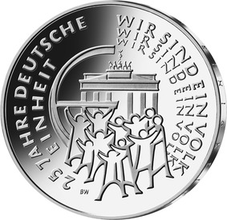
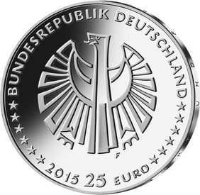

# Bekanntmachung über die Ausprägung von deutschen Euro-Gedenkmünzen im Nennwert von 25 Euro (Gedenkmünze „25 Jahre Deutsche Einheit“) (Münz25EuroBek 2016-04-04)

Ausfertigungsdatum
:   2016-04-04

Fundstelle
:   BGBl I: 2016, 749

## (XXXX)

Gemäß den §§ 2, 4 und 5 des Münzgesetzes vom 16. Dezember 1999 (BGBl.
I S. 2402) hat die Bundesregierung beschlossen, zur Würdigung des 25.
Jahrestages der deutschen Wiedervereinigung eine 25-Euro-Gedenkmünze
„25 Jahre Deutsche Einheit“ prägen zu lassen.

Die Auflage der Münze beträgt 1 750 000 Stück, davon 250 000 Stück in
Spiegelglanzqualität. Die Münze wird zu gleichen Teilen in den
Münzstätten Berlin, München, Stuttgart, Karlsruhe und Hamburg geprägt.

Die Münze wird ab dem 1. Oktober 2015 in den Verkehr gebracht. Sie
besteht aus Feinsilber (Ag 999), hat einen Durchmesser von 32,5
Millimetern und eine Masse von 18 Gramm. Das Gepräge auf beiden Seiten
ist erhaben und wird von einem schützenden, glatten Randstab umgeben.

Die Bildseite zeigt die im Vordergrund stehenden Menschen, die
Aufbruch und Neubeginn verkörpern. Sie befinden sich vor dem
Brandenburger Tor, dem Symbol der Deutschen Einheit. Die Wiederholung
der Willensbekundung der Bevölkerung „Wir sind ein Volk“ repräsentiert
den Weg zur deutschen Wiedervereinigung.

Die Wertseite zeigt einen Adler, den Schriftzug „BUNDESREPUBLIK
DEUTSCHLAND“, Wertziffer und Wertbezeichnung, die Jahreszahl 2015, die
zwölf Europasterne sowie – je nach Prägestätte – das Münzzeichen „A“
(Berlin), „D“ (München), „F“ (Stuttgart), „G“ (Karlsruhe) oder „J“
(Hamburg).

Der glatte Münzrand enthält in vertiefter Prägung die Inschrift:

„EINIGKEIT UND RECHT UND FREIHEIT*             “.

Der Entwurf stammt von dem Künstler Bernd Wendhut aus Bernkastel-Kues.

## Schlussformel

Der Bundesminister der Finanzen

## (XXXX)

(Fundstelle: BGBl. I 2016, 749)

*    *        
    *        

