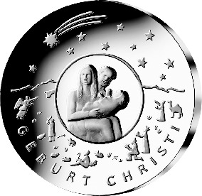
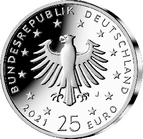

# Bekanntmachung über die Ausprägung von deutschen Euro-Gedenkmünzen im Nennwert von 25 Euro (Gedenkmünze „Weihnachten – Geburt Christi“) (Münz25EuroBek 2021-09-15)

Ausfertigungsdatum
:   2021-09-15

Fundstelle
:   BGBl I: 2021, 4630

## (XXXX)

Gemäß den §§ 2, 4 und 5 des Münzgesetzes vom 16. Dezember 1999 (BGBl.
I S. 2402) hat die Bundesregierung beschlossen, zum Thema „Weihnachten
– Geburt Christi“ eine deutsche Euro-Gedenkmünze im Nennwert von 25
Euro prägen zu lassen. Die Münze ist einem der wichtigsten Feste der
Christenheit gewidmet.

Die Auflage der Münze beträgt ca. 1,2 Millionen Stück, davon ca. 0,2
Millionen Stück in Spiegelglanzqualität. Die Prägung erfolgt durch die
Hamburgische Münze (Prägezeichen J).

Die Münze wird ab dem 18. November 2021 in den Verkehr gebracht. Sie
besteht aus Feinsilber (Ag 999), hat einen Durchmesser von 30
Millimetern und eine Masse von 22 Gramm. Die Münze wird, erstmals in
der Geschichte der Bundesrepublik Deutschland, als Tellerprägung
(hier: konkave Wölbung der Bildseite) hergestellt.

Im Zentrum der Bildseite steht das Motiv der Heiligen Familie. Die
Lebendigkeit der Familienkomposition strahlt auf das gesamte Münzbild
aus. Der Reichtum des Heilsgeschehens findet sich in den verschiedenen
Motiven im Randbereich, gekrönt durch den Stern von Bethlehem, wieder.

Die Wertseite zeigt einen Adler, den Schriftzug „BUNDESREPUBLIK
DEUTSCHLAND“, Wertziffer und Wertbezeichnung, das Prägezeichen „J“ der
Hamburgischen Münze, die Jahreszahl 2021 sowie die zwölf Europasterne.

Der Münzrand wird glatt und ohne Struktur ausgeführt.

Der Entwurf der Münze stammt von der Künstlerin Adelheid Fuss aus
Potsdam.

## Schlussformel

Der Bundesminister der Finanzen

## (XXXX)

(Fundstelle: BGBl. I 2021, 4630)

*    *        
    *        

