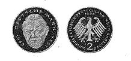

# Bekanntmachung über die Ausprägung von Bundesmünzen im Nennwert von 2 Deutschen Mark (Münz2DMBek 1988)

Ausfertigungsdatum
:   1988-05-17

Fundstelle
:   BGBl I: 1988, 631

## (XXXX)

(1) Auf Grund des § 6 des Gesetzes über die Ausprägung von
Scheidemünzen in der im Bundesgesetzblatt Teil III, Gliederungsnummer
690-1, veröffentlichten bereinigten Fassung hat die Bundesregierung
beschlossen, zum 40jährigen Bestehen der Deutschen Mark ab 1988 eine 2
DM-Umlaufmünze mit dem Bildnis des ehemaligen Bundeskanzlers und
langjährigen Bundesministers für Wirtschaft, Professor Dr. Ludwig
Erhard, prägen zu lassen. Die Höhe der Auflage richtet sich nach den
Bedürfnissen des Zahlungsverkehrs. Mit der Ausgabe wird am 20. Juni
1988 begonnen.

(2) Die Bildseite der Münze zeigt das Porträt von Professor Dr. Ludwig
Erhard und die Umschrift:

*    *   "DEUTSCHE MARK 1948 1988".

(3) Die Wertseite der Münze zeigt in der Mitte den Bundesadler. Das
Adlerbild ist von der Umschrift:

*    *   "BUNDESREPUBLIK DEUTSCHLAND 2 DEUTSCHE MARK"

umschlossen. Dabei steht die Wertziffer 2 in der Mitte unter dem
Adler. Oberhalb des Adlerkopfes ist das Jahr der Prägung, beginnend
mit dem Jahr 1988, unterhalb des rechten Adlerfanges eines der
Münzzeichen (D, F, G oder J) angebracht.

(4) Die Prägung auf beiden Seiten der Münze ist erhaben und wird von
einem schützenden glatten Randstab umgeben.

(5) Der glatte Münzrand ist mit der vertieften Inschrift:

*
    *
        *   "EINIGKEIT UND RECHT UND FREIHEIT"

versehen. Zwischen jedem der Worte ist ein Ornament, am Schluß der
Inschrift sind zwei Ornamente angebracht.

(6) Die Münze hat ein Gewicht von 7 Gramm und einen Durchmesser von
26,75 Millimetern. Sie besteht überwiegend aus einer Kupfer-Nickel-
Legierung (75 Prozent Kupfer und 25 Prozent Nickel) und hat einen
Reinnickelkern.

(7) Der Entwurf der Bildseite stammt von Franz Müller, München.

## Schlussformel

Der Bundesminister der Finanzen

## (XXXX) Abbildung der Münze

(Fundstelle: BGBl. I 1988, 631)

