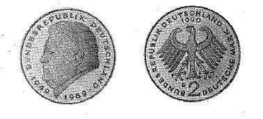

# Bekanntmachung über die Ausprägung von Bundesmünzen im Nennwert von 2 Deutschen Mark (Münz2DMBek 1990)

Ausfertigungsdatum
:   1990-09-21

Fundstelle
:   BGBl I: 1990, 2116

## (XXXX)

(1) Auf Grund des § 6 des Gesetzes über die Ausprägung von
Scheidemünzen in der im Bundesgesetzblatt Teil III, Gliederungsnummer
690-1, veröffentlichten bereinigten Fassung hat die Bundesregierung
beschlossen, zum 40jährigen Bestehen der Bundesrepublik Deutschland ab
1990 eine 2 DM-Umlaufmünze mit dem Bildnis des verstorbenen
Bayerischen Ministerpräsidenten Dr. h.c. Franz Josef Strauß prägen zu
lassen. Die Höhe der Auflage richtet sich nach den Bedürfnissen des
Zahlungsverkehrs. Mit der Ausgabe wird ab 9. Oktober 1990 begonnen.

(2) Die Bildseite der Münze zeigt das Porträt des Bayerischen
Ministerpräsidenten Dr. h.c. Franz Josef Strauß und die Umschrift:

*    *   "BUNDESREPUBLIK DEUTSCHLAND

*    *   1949

    *   1989".

(3) Die Wertseite der Münze zeigt in der Mitte den Bundesadler. Das
Adlerbild ist von der Umschrift:

*
    *   "BUNDESREPUBLIK DEUTSCHLAND

        *   2 DEUTSCHE MARK"

umschlossen. Dabei steht die Wertziffer 2 in der Mitte unter dem
Adler. Oberhalb des Adlerkopfes ist das Jahr der Prägung, beginnend
mit dem Jahr 1990, angebracht, unterhalb des rechten Adlerfanges eines
der Münzzeichen der Münzstätten der Bundesrepublik Deutschland (D, F,
G, J) oder das Münzzeichen der Münze Berlin (A), die in die Prägung
aller Stückelungen der Umlaufmünzen eingeschaltet wird.

(4) Die Prägung auf beiden Seiten der Münze ist erhaben und wird von
einem schützenden glatten Randstab umgeben.

(5) Der glatte Münzrand ist mit der vertieften Inschrift:

*
    *   "EINIGKEIT UND RECHT UND FREIHEIT"

versehen. Zwischen jedem der Worte ist ein Ornament, am Schluß der
Inschrift sind zwei Ornamente angebracht.

(6) Die Münze hat ein Gewicht von 7 Gramm und einen Durchmesser von
26,75 Millimetern. Sie besteht überwiegend aus einer Kupfer-Nickel-
Legierung (75 Prozent Kupfer und 25 Prozent Nickel) und hat einen
Reinnickelkern.

(7) Der Entwurf der Bildseite stammt von Erich Ott, München.
Der Bundesminister der Finanzen

## (XXXX)

(Fundstelle: BGBl. I 1990, 2116)

