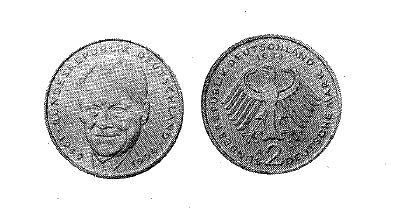

# Bekanntmachung über die Ausprägung von Bundesmünzen im Nennwert von 2 Deutschen Mark (Münz2DMBek 1994)

Ausfertigungsdatum
:   1994-04-28

Fundstelle
:   BGBl I: 1994, 1281

## (XXXX)

Auf Grund des § 6 des Gesetzes über die Ausprägung von Scheidemünzen
in der im Bundesgesetzblatt Teil III, Gliederungsnummer 690-1,
veröffentlichten bereinigten Fassung hat die Bundesregierung
beschlossen, ab 1994 eine 2 DM-Umlaufmünze mit dem Bildnis des
verstorbenen Bundeskanzlers Willy Brandt prägen zu lassen. Die Höhe
der Auflage richtet sich nach den Bedürfnissen des Zahlungsverkehrs.
Mit der Ausgabe wird ab 19. Juli 1994 begonnen.
Die Bildseite der Münze zeigt das Porträt von Willy Brandt und die
Umschrift:

*    *   "BUNDESREPUBLIK DEUTSCHLAND

*    *   1949

    *   1994".

Die Wertseite der Münze trägt in der Mitte den Bundesadler. Das
Adlerbild ist umschlossen von der Umschrift:

*    *   "BUNDESREPUBLIK DEUTSCHLAND
        2 DEUTSCHE MARK".

Dabei steht die Wertziffer 2 in der Mitte unter dem Adler. Oberhalb
des Adlerkopfes ist das Jahr der Prägung, beginnend mit dem Jahr 1994,
angebracht. Unterhalb des rechten Adlerfanges befindet sich eines der
Münzzeichen der fünf Münzstätten in der Bundesrepublik Deutschland (A,
D, F, G, J).
Die Prägung auf beiden Seiten der Münze ist erhaben und wird von einem
schützenden glatten Randstab umgeben.
Der glatte Münzrand enthält in vertiefter Prägung die Inschrift:

*
    *   "EINIGKEIT UND RECHT UND FREIHEIT".

Zwischen jedem der Worte ist ein Ornament, am Schluß der Inschrift
sind zwei Ornamente angebracht.
Die Münze hat ein Gewicht von 7 Gramm und einen Durchmesser von 26,75
Millimetern. Sie besteht überwiegend aus einer Kupfer-Nickel-Legierung
(75 Prozent Kupfer und 25 Prozent Nickel) und hat einen
Reinnickelkern.
Der Entwurf der Bildseite stammt von Hubert Klinkel, Würzburg\*,

Der Bundesminister der Finanzen

## (XXXX)

(Fundstelle: BGBl. I 1994, 1281)

