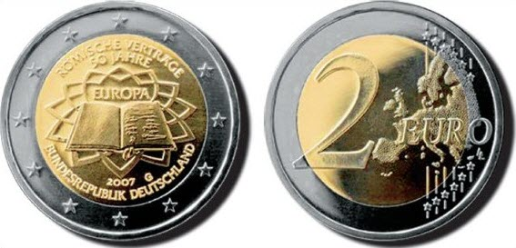

# Bekanntmachung über die Ausprägung von deutschen Euro-Gedenkmünzen im Nennwert von 2 Euro (Gedenkmünze "50 Jahre Römische Verträge") (Münz2EuroBek 2006-12)

Ausfertigungsdatum
:   2006-11-30

Fundstelle
:   BGBl I: 2006, 2827

## (XXXX)

Gemäß den §§ 2, 4 und 5 des Münzgesetzes vom 16. November 1999 (BGBl.
I S. 2402) hat die Bundesregierung beschlossen, eine 2-Euro-
Gedenkmünze "50 Jahre Römische Verträge" prägen zu lassen.
Die Auflage der Münze beträgt 30 Millionen Stück. Daneben werden für
das Sammlerprodukt deutsche Euro-Kursmünzensätze 375.000 Stück in
Spiegelglanzausführung geprägt.
Die Münze wird ab dem 25. März 2007 in den Verkehr gebracht.
Materialeinsatz und technische Parameter der 2-Euro-Gedenkmünze
entsprechen der 2-Euro-Umlaufmünze. Der Münzrand enthält in vertiefter
Prägung unverändert die Inschrift:

*
    *
        *   "EINIGKEIT UND RECHT UND FREIHEIT".

Die nationale Seite der Gedenkmünze zeigt das als Buch gebundene
Vertragswerk mit den Unterschriften der sechs Gründungsmitglieder vor
dem Hintergrund des von Michelangelo gestalteten sternförmigen
Straßenpflasters auf der Piazza del Campidoglio in Rom.
Als Inschrift ist der Ausgabeanlass "50 JAHRE RÖMISCHE VERTRÄGE",
"EUROPA", das Ausgabeland "BUNDESREPUBLIK DEUTSCHLAND" sowie die
Jahreszahl 2007 und das Münzzeichen der jeweiligen Prägestätte ("A",
"D", "F", "G" oder "J") angebracht. Das Motiv ist in Zusammenarbeit
der österreichischen, italienischen und spanischen Münzprägestätte
entstanden.

## Schlussformel

Der Bundesminister der Finanzen

## (XXXX)

(Fundstelle: BGBl. I 2006, 2827)

