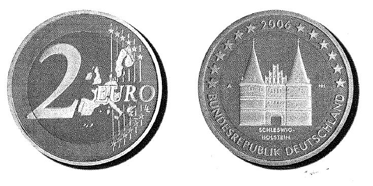

# Bekanntmachung über die Ausprägung von deutschen Euro-Gedenkmünzen im  Nennwert von 2 Euro (Gedenkmünze "Schleswig-Holstein") (Münz2EuroBek 2006)

Ausfertigungsdatum
:   2005-12-08

Fundstelle
:   BGBl I: 2006, 8

## (XXXX)

Gemäß den §§ 2, 4 und 5 des Münzgesetzes vom 16. Dezember 1999 (BGBl.
I S. 2402) hat die Bundesregierung beschlossen, eine 2-Euro-
Gedenkmünze "Schleswig-Holstein" im Rahmen einer Serie "Bundesländer"
prägen zu lassen.
Die Auflage der Münze beträgt 30 Millionen Stück. Daneben werden für
das Sammlerprodukt deutsche Euro-Kursmünzensätze 375.000 Stück in
Spiegelglanzausführung geprägt.
Die Münze wird ab dem 3. Februar 2006 in den Verkehr gebracht.
Materialeinsatz und technische Parameter der 2-Euro-Gedenkmünze
entsprechen der 2-Euro-Umlaufmünze. Der Münzrand enthält in vertiefter
Prägung unverändert die Inschrift:

*
    *
        *   "EINIGKEIT UND RECHT UND FREIHEIT".

Die nationale Seite der Gedenkmünze zeigt das Holstentor, das durch
seine filigrane Ausformung einen ästhetischen Reiz vermittelt, der
hervorragend mit dem Außenring korrespondiert. Die Länderbezeichnung
"Schleswig-Holstein" verknüpft das abgebildete Bauwerk, das
Holstentor, mit dem Bundesland. Das Münzzeichen der jeweiligen
Prägestätte und das Namenszeichen des gestaltenden Künstlers
komplettieren die Gestaltung des Münzkerns.
Auf dem Außenring sind die europäischen Sterne, das Ausgabejahr 2006
und das Ausgabeland "BUNDESREPUBLIK DEUTSCHLAND" abgebildet.
Der Entwurf der nationalen Seite der Gedenkmünze stammt von Heinz
Hoyer aus Berlin.

## Schlussformel

Der Bundesminister der Finanzen

## (XXXX)

(Fundstelle: BGBl. I 2006, 8)

