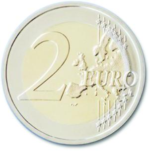
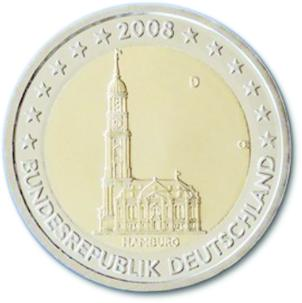

# Bekanntmachung über die Ausprägung von deutschen Euro-Gedenkmünzen im Nennwert von 2 Euro (Gedenkmünze „Hamburg“) (Münz2EuroBek 2007-12)

Ausfertigungsdatum
:   2007-12-06

Fundstelle
:   BGBl I: 2007, 2886

## (XXXX)

Gemäß den §§ 2, 4 und 5 des Münzgesetzes vom 16. Dezember 1999 (BGBl.
I S. 2402) hat die Bundesregierung beschlossen, eine 2-Euro-
Gedenkmünze „Hamburg“ im Rahmen einer Serie „Bundesländer“ prägen zu
lassen.

Die Auflage der Münze beträgt 30 Millionen Stück.

Die Münze wird ab dem 1. Februar 2008 in den Verkehr gebracht.
Materialeinsatz und technische Parameter der 2-Euro-Gedenkmünze
entsprechen der 2-Euro-Umlaufmünze. Der Münzrand enthält in vertiefter
Prägung unverändert die Inschrift:

„EINIGKEIT UND RECHT UND FREIHEIT“.

Die nationale Seite der Gedenkmünze zeigt die Hamburger
Michaeliskirche. Die Länderbezeichnung „Hamburg“ verknüpft das
abgebildete Bauwerk „Michel“ mit dem Bundesland. Auf der Randzone sind
unverändert die europäischen Sterne, das Ausgabejahr 2008 und das
Ausgabeland „BUNDESREPUBLIK DEUTSCHLAND“ zu sehen.

Das Münzzeichen der jeweiligen Prägestätte („A“, „D“, „F“, „G“, „J“)
und die Initialen des Graveurs
"OE"             befinden sich im rechten oberen Kernbereich.

Der Entwurf der nationalen Seite der Gedenkmünze stammt von Herrn
Erich Ott aus München.

## Schlussformel

Der Bundesminister der Finanzen

## (XXXX)

( Fundstelle: BGBl. I 2007, 2886 )

*    *        
    *        

