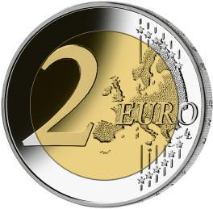
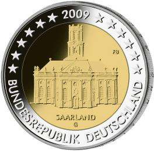

# Bekanntmachung über die Ausprägung von deutschen Euro-Gedenkmünzen im Nennwert von 2 Euro (Gedenkmünze „Saarland“) (Münz2EuroBek 2008-11)

Ausfertigungsdatum
:   2008-11-21

Fundstelle
:   BGBl I: 2008, 2341

## (XXXX)

Gemäß den §§ 2, 4 und 5 des Münzgesetzes vom 16. Dezember 1999 (BGBl.
I S. 2402) hat die Bundesregierung beschlossen, eine 2-Euro-
Gedenkmünze „Saarland“ im Rahmen einer Serie „Bundesländer“ prägen zu
lassen.
Die Auflage der Münze beträgt 30 Millionen Stück.
Die Münze wird ab dem 6. Februar 2009 in den Verkehr gebracht.
Materialeinsatz, technische Parameter und Gestaltung der europäischen
Seite der 2-Euro-Gedenkmünze entsprechen der aktuellen 2-Euro-
Umlaufmünze.
Der Münzrand enthält in vertiefter Prägung unverändert die Inschrift:
„EINIGKEIT UND RECHT UND FREIHEIT“.
Die nationale Seite zeigt die Ludwigskirche in Saarbrücken. Die
Länderbezeichnung „SAARLAND“ verknüpft das abgebildete Bauwerk,
Ludwigskirche, mit dem Bundesland. Auf der Randzone sind die
europäischen Sterne, das Ausgabejahr 2009 und das Ausgabeland
„BUNDESREPUBLIK DEUTSCHLAND“ zu sehen.
Das Münzzeichen der jeweiligen Prägestätte („A“, „D“, „F“, „G“ oder
„J“) befindet sich im unteren Kernbereich. Rechts vom Baudenkmal
befinden sich die Initialen des Münzkünstlers „FB“.
Der Entwurf der nationalen Seite der Gedenkmünze stammt von Herrn
Friedrich Brenner aus Diedorf.

## Schlussformel

Der Bundesminister der Finanzen

## (XXXX)

(Fundstelle: BGBl. I 2008, 2341)

*    *        
    *        

