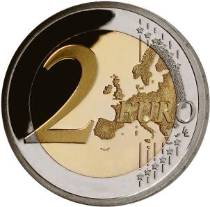
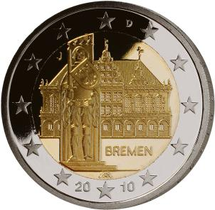

# Bekanntmachung über die Ausprägung von deutschen Euro-Gedenkmünzen im Nennwert von 2 Euro (Gedenkmünze "Bremen") (Münz2EuroBek 2009-11)

Ausfertigungsdatum
:   2009-11-26

Fundstelle
:   BGBl I: 2009, 3882

## (XXXX)

Gemäß den §§ 2, 4 und 5 des Münzgesetzes vom 16. Dezember 1999 (BGBl.
I S. 2402) hat die Bundesregierung beschlossen, eine 2-Euro-
Gedenkmünze „Bremen“ prägen zu lassen. Die Auflage der Münze beträgt
30 Millionen Stück.

Die Münze wird ab dem 29. Januar 2010 in den Verkehr gebracht.
Materialeinsatz, technische Parameter und Gestaltung der europäischen
Seite der 2-Euro-Gedenkmünze entsprechen der aktuellen 2-Euro-
Umlaufmünze.

Der Münzrand enthält in vertiefter Prägung unverändert die Inschrift:

„EINIGKEIT UND RECHT UND FREIHEIT“.

Die nationale Seite zeigt das Rathaus von Bremen mit dem Roland, die
zusammen die republikanische Geschichte und Tradition Bremens
symbolisieren. Die Weserrenaissance-Fassade des alten Rathauses ist
realitätsnah dargestellt, der Roland im Verhältnis zum Rathaus
überhöht. Die Länderbezeichnung „BREMEN“ verknüpft Rathaus und Roland
mit dem Bundesland. Auf der Randzone befinden sich die europäischen
Sterne, das Ausgabejahr 2010 und die Nationalitätenkennzeichnung „D“
für das Ausgabeland Bundesrepublik Deutschland.

Das Münzzeichen der jeweiligen Prägestätte ist im Kernbereich unter
Berücksichtigung der künstlerischen Ausgewogenheit angebracht. Die
Initialen des Künstlers befinden sich im unteren Kernbereich (unter
dem Roland).

Der Entwurf der nationalen Seite der Gedenkmünze stammt von Herrn Bodo
Broschat, Berlin.

## Schlussformel

Der Bundesminister der Finanzen

## (XXXX)

(Fundstelle: BGBl. I 2009, 3882)

*    *        
    *        

