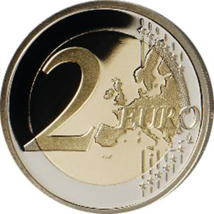
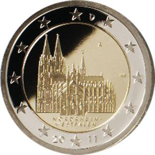

# Bekanntmachung über die Ausprägung von deutschen Euro-Gedenkmünzen im Nennwert von 2 Euro (Gedenkmünze „Nordrhein-Westfalen“) (Münz2EuroBek 2010)

Ausfertigungsdatum
:   2010-12-02

Fundstelle
:   BGBl I: 2010, 1976

## (XXXX)

Gemäß den §§ 2, 4 und 5 des Münzgesetzes vom 16. Dezember 1999 (BGBl.
I S. 2402) hat die Bundesregierung beschlossen, eine 2-Euro-
Gedenkmünze „Nordrhein-Westfalen“ prägen zu lassen. Die Auflage der
Münze beträgt 30 Millionen Stück.

Die Münze wird ab dem 28. Januar 2011 in den Verkehr gebracht.
Materialeinsatz, technische Parameter und Gestaltung der europäischen
Seite der 2-Euro-Gedenkmünze entsprechen der aktuellen 2-Euro-
Umlaufmünze.

Der Münzrand enthält in vertiefter Prägung unverändert die Inschrift:

„EINIGKEIT UND RECHT UND FREIHEIT“.

Die nationale Seite zeigt den Kölner Dom als Meisterwerk der gotischen
Baukunst. Dabei wird die Kathedrale in ihrer Gesamtheit gezeigt und
die Schönheit des Südportals hervorgehoben. Die Länderbezeichnung
„NORDRHEIN-WESTFALEN“ verknüpft das abgebildete Bauwerk „Kölner Dom“
mit dem Bundesland. Auf der Randzone sind die europäischen Sterne, das
Ausgabejahr 2011 und die Nationalitätenkennzeichnung „D“ für das
Ausgabeland Bundesrepublik Deutschland zu sehen.

Das Münzzeichen der jeweiligen Prägestätte befindet sich im rechten
oberen Kernbereich, die Initialen des Künstlers im rechten mittleren
Kernbereich.

Der Entwurf der nationalen Seite der Gedenkmünze stammt von Herrn
Heinz Hoyer, Berlin.

## Schlussformel

Der Bundesminister der Finanzen

## (XXXX)

*    *        
    *        

