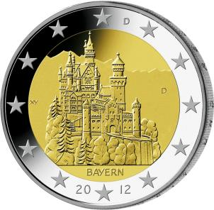

# Bekanntmachung über die Ausprägung von deutschen Euro-Gedenkmünzen im Nennwert von 2 Euro (Gedenkmünze „Bayern“) (Münz2EuroBek 2011)

Ausfertigungsdatum
:   2011-10-20

Fundstelle
:   BGBl I: 2011, 2172

## (XXXX)

Gemäß den §§ 2, 4 und 5 des Münzgesetzes vom 16. Dezember 1999 (BGBl.
I S. 2402) hat die Bundesregierung beschlossen, eine 2-Euro-
Gedenkmünze „Bayern“ im Rahmen einer Serie „Bundesländer“ prägen zu
lassen. Die Auflage der Münze beträgt 30 Millionen Stück.

Die Münze wird ab dem 3. Februar 2012 in den Verkehr gebracht.
Materialeinsatz, technische Parameter und Gestaltung der europäischen
Seite der 2-Euro-Gedenkmünze entsprechen der aktuellen 2-Euro-
Umlaufmünze.

Der Münzrand enthält in vertiefter Prägung unverändert die Inschrift:

„EINIGKEIT UND RECHT UND FREIHEIT“.

Die nationale Seite zeigt die weltweit bekannteste Ansicht von Schloss
Neuschwanstein. Die Länderbezeichnung „BAYERN“ verknüpft das
abgebildete Bauwerk mit dem Bundesland. Auf der Randzone sind die
zwölf Europasterne, das Ausgabejahr 2012 und die Kennzeichnung „D“ für
das Ausgabeland Bundesrepublik Deutschland zu sehen.

Das Münzzeichen der jeweiligen Prägestätte („A“, „D“, „F“, „G“ oder
„J“) befindet sich im Kernbereich der Bildseite rechts vom Baudenkmal.

Der Entwurf der nationalen Seite der Gedenkmünze stammt von Herrn
Erich Ott aus München.

## Schlussformel

Der Bundesminister der Finanzen

## (XXXX)

(Fundstelle: BGBl. I 2011, 2172)

*    *        
    *        

