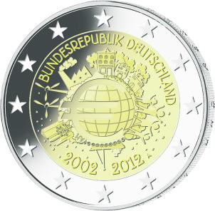

# Bekanntmachung über die Ausprägung von deutschen Euro-Gedenkmünzen im Nennwert von 2 Euro (Gedenkmünze „10 Jahre Euro-Bargeld“) (Münz2EuroBek 2012)

Ausfertigungsdatum
:   2011-12-21

Fundstelle
:   BGBl I: 2012, 36

## (XXXX)

Auf Initiative der Europäischen Kommission soll im Januar 2012
anlässlich des 10. Jahrestages der Einführung der Euro-Münzen und
Euro-Banknoten von allen Mitgliedsstaaten der Euro-Zone eine
motivgleiche
2-Euro-Gedenkmünze              ausgegeben werden. Vor diesem
Hintergrund und gemäß den §§ 2, 4 und 5 des Münzgesetzes vom 16.
Dezember 1999 (BGBl. I S. 2402) hat die Bundesregierung beschlossen,
eine 2-Euro-Gedenkmünze „10 Jahre Euro-Bargeld“ prägen zu lassen.

Die Münze wird ab dem 2. Januar 2012 in den Verkehr gebracht.

Die Wertseite der Münze, die Randschrift und die technischen Parameter
der 2-Euro-Gedenkmünze entsprechen denen der 2-Euro-Umlaufmünze. Die
nationale Seite der Münze unterscheidet sich in den einzelnen Euro-
Mitgliedsstaaten nur durch den Namen und die Schreibweise des
Ausgabelandes sowie die nationalen Münzzeichen.

Das Motiv der Bildseite wurde entsprechend dem von der Europäischen
Kommission vorgeschlagenen Verfahren von den Bürgerinnen und Bürgern
der Europäischen Union im Ergebnis einer Internet-Abstimmung als
Sieger aus fünf Vorschlägen gewählt. Es stammt von dem Künstler Helmut
Andexlinger aus Österreich und symbolisiert den Euro als Währung mit
weltweiter Bedeutung.

Es ist vorgesehen, die 2-Euro-Gedenkmünze von den fünf deutschen
Münzstätten prägen zu lassen. Die für den Umlauf bestimmte Auflage der
Münze soll 30 Millionen Stück betragen. Daneben werden ca. 0,75
Millionen Stück in der höherwertigen Prägequalität Spiegelglanz für
Sammlerzwecke produziert.

## Schlussformel

Der Bundesminister der Finanzen

## (XXXX)

(Fundstelle: BGBl. I 2012, 36)

*    *        
    *        

