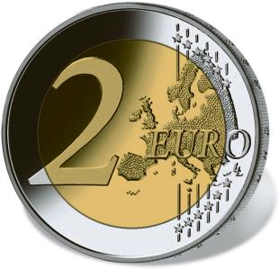

# Bekanntmachung über die Ausprägung von deutschen Euro-Gedenkmünzen im Nennwert von 2 Euro (Gedenkmünze „Baden-Württemberg“) (Münz2EuroBek 2013-01)

Ausfertigungsdatum
:   2013-01-30

Fundstelle
:   BGBl I: 2013, 260

## (XXXX)

Gemäß den §§ 2, 4 und 5 des Münzgesetzes vom 16. Dezember 1999 (BGBl.
I S. 2402) hat die Bundesregierung beschlossen, eine 2-Euro-
Gedenkmünze
„Baden-Württemberg“              im Rahmen einer Serie „Bundesländer“
prägen zu lassen.

Die Münze wird ab dem 1. Februar 2013 in den Verkehr gebracht.

Die Wertseite der Münze, die Randschrift (Schriftzug „EINIGKEIT UND
RECHT UND FREIHEIT“ sowie eine stilisierte Darstellung des
Bundesadlers) und die technischen Parameter entsprechen der 2-Euro-
Umlaufmünze.

Die nationale Seite zeigt auf dem inneren Kern die prägenden Merkmale
des Klosters Maulbronn. Die Länderbezeichnung „BADEN-WÜRTTEMBERG“
verknüpft das abgebildete Bauwerk mit dem Bundesland. Auf dem inneren
Kern befinden sich ferner das Ausgabejahr 2013, die Kennzeichnung „D“
für das Ausgabeland Bundesrepublik Deutschland, das Münzzeichen der
jeweiligen Prägestätte („A“, „D“, „F“, „G“ oder „J“) sowie die
Initialen des Künstlers.

Der äußere Ring der nationalen Seite zeigt die zwölf Europasterne.

Die für den Umlauf bestimmte Auflage der Münze soll 30 Millionen Stück
betragen.

Der Entwurf der nationalen Seite der Gedenkmünze stammt von dem
Künstler Eugen Ruhl, Pforzheim.

## Schlussformel

Der Bundesminister der Finanzen

## (XXXX)

(Fundstelle: BGBl. I 2013, 260)

*    *        
    *        

