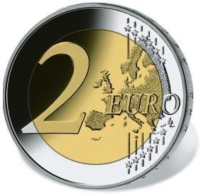
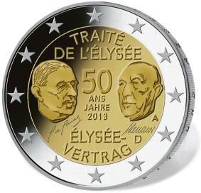

# Bekanntmachung über die Ausprägung von deutschen Euro-Gedenkmünzen im Nennwert von 2 Euro (Gedenkmünze „50 Jahre Élysée-Vertrag“) (Münz2EuroBek 2013)

Ausfertigungsdatum
:   2013-01-30

Fundstelle
:   BGBl I: 2013, 259

## (XXXX)

Gemäß den §§ 2, 4 und 5 des Münzgesetzes vom 16. Dezember 1999 (BGBl.
I S. 2402) hat die Bundesregierung beschlossen eine 2-Euro-Gedenkmünze
„50 Jahre Élysée-Vertrag“ prägen zu lassen.

Die Münze wird ab dem 22. Januar 2013 in den Verkehr gebracht.

Die Wertseite der Münze, die Randschrift (Schriftzug „EINIGKEIT UND
RECHT UND FREIHEIT“ sowie eine stilisierte Darstellung des
Bundesadlers) und die technischen Parameter entsprechen der 2-Euro-
Umlaufmünze.

Die nationale Seite zeigt stilisierte Porträts der Unterzeichner des
Élysée-Vertrages, dem damaligen Bundeskanzler der Bundesrepublik
Deutschland, Konrad Adenauer und dem früheren Präsidenten der
Französischen Republik, Charles de Gaulle, deren Unterschriften sowie
die Angabe „50 ANS JAHRE“ mit der Jahreszahl „2013“ im mittleren Teil,
den Schriftzug „TRAITÉ DE L´ÉLYSÉE“ im oberen Teil und den Schriftzug
„ÉLYSÉE-VERTRAG“ im unteren Teil. Auf der rechten Seite des inneren
Kerns befinden sich ferner das Prägezeichen („A“, „D“, „F“, „G“ oder
„J“) der jeweiligen Münzstätte sowie die Länderkennung „D“ der
Bundesrepublik Deutschland. (Die nationale Seite dieser Münze, die
motivgleich von Deutschland und Frankreich herausgegeben wird,
unterscheidet sich in den beiden Ausgabeländern nur durch die
Länderkennung und nationale Münz- beziehungsweise Graveurszeichen).

Der äußere Ring der nationalen Seite zeigt die zwölf Europasterne.

Die für den Umlauf bestimmte Auflage der Münze soll 11 Millionen Stück
betragen.

Der Entwurf der nationalen Seite wurde von Yves Sampo (Monnaie de
Paris), Stefanie Lindner (Staatliche Münze Berlin), Alina Hoyer
(Berlin) und Sneschana Russewa-Hoyer (Berlin) gestaltet.

## Schlussformel

Der Bundesminister der Finanzen

## (XXXX)

(Fundstelle: BGBl. I 2013, 259)

*    *        
    *        

*    *
    *

