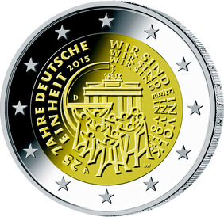

# Bekanntmachung über die Ausprägung von deutschen Euro-Gedenkmünzen im Nennwert von 2 Euro (Gedenkmünze „25 Jahre Deutsche Einheit“) (Münz2EuroBek 2015-06-23/2)

Ausfertigungsdatum
:   2015-06-23

Fundstelle
:   BGBl I: 2015, 1107

## (XXXX)

Gemäß den §§ 2, 4 und 5 des Münzgesetzes vom 16. Dezember 1999 (BGBl.
I S. 2402) hat die Bundesregierung beschlossen eine 2-Euro-Gedenkmünze
„25 Jahre Deutsche Einheit“ prägen zu lassen.

Die Münze wird ab dem 30. Januar 2015 in den Verkehr gebracht.

Die Wertseite der Münze, die Randschrift (Schriftzug „EINIGKEIT UND
RECHT UND FREIHEIT“ sowie eine stilisierte Darstellung des
Bundesadlers) und die technischen Parameter entsprechen der 2-Euro-
Umlaufmünze.

Die nationale Seite zeigt die im Vordergrund stehenden Menschen, die
Aufbruch und Neubeginn verkörpern. Sie befinden sich vor dem
Brandenburger Tor, dem Symbol der Deutschen Einheit. Die Wiederholung
der Willensbekundung der Bevölkerung „Wir sind ein Volk“ repräsentiert
den Weg zur deutschen Wiedervereinigung.

Auf dem inneren Kern befinden sich ferner das Ausgabejahr 2015, die
Kennzeichnung „D“ für das Ausgabeland Bundesrepublik Deutschland, das
Münzzeichen der jeweiligen Prägestätte („A“, „D“, „F“, „G“ oder „J“)
sowie die Initialen des Künstlers. Der äußere Ring der nationalen
Seite zeigt die zwölf Europasterne.

Die für den Umlauf bestimmte Auflage der Münze beträgt 30 Millionen
Stück.

Der Entwurf der nationalen Seite der Gedenkmünze stammt von dem
Künstler Bernd Wendhut aus Bernkastel-Kues.

## Schlussformel

Der Bundesminister der Finanzen

## (XXXX)

(Fundstelle: BGBl. I 2015, 1107)

*    *        
    *        

