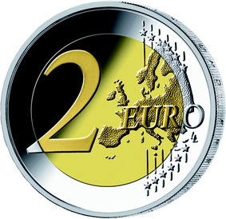
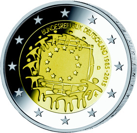

# Bekanntmachung über die Ausprägung von deutschen Euro-Gedenkmünzen im Nennwert von 2 Euro (Gedenkmünze „30 Jahre Europaflagge“) (Münz2EuroBek 2016-04-04/1)

Ausfertigungsdatum
:   2016-04-04

Fundstelle
:   BGBl I: 2016, 750

## (XXXX)

Auf Initiative der Europäischen Kommission geben die Mitgliedstaaten
der Euro-Zone im zweiten Halbjahr 2015 zur Würdigung des 30-jährigen
Bestehens der Europaflagge eine motivgleiche 2-Euro-Gedenkmünze
heraus. Gemäß den §§ 2, 4 und 5 des Münzgesetzes vom 16. Dezember 1999
(BGBl. I S. 2402) hat die Bundesregierung vor diesem Hintergrund
beschlossen, eine 2-Euro-Gedenkmünze „30 Jahre Europaflagge“ prägen zu
lassen.

Die Münze wird ab dem 5. November 2015 in den Verkehr gebracht.

Die nationale Seite der Münze unterscheidet sich in den einzelnen
Euro-Mitgliedstaaten nur durch den Namen des Ausgabelandes sowie die
nationalen Münzzeichen.

Das Motiv der Bildseite wurde entsprechend dem von der Europäischen
Kommission vorgeschlagenen Verfahren von den Bürgerinnen und Bürgern
der Europäischen Union im Ergebnis einer Internet-Abstimmung als
Sieger aus fünf Vorschlägen gewählt. Es wurde von dem griechischen
Bildhauer Georgios Stamatopoulos entworfen und zeigt zwölf Sterne, die
die Gestalt von Menschen annehmen und die Geburt eines neuen Europa
begrüßen.

Die Wertseite der Münze, die Randschrift (Schriftzug „EINIGKEIT UND
RECHT UND FREIHEIT“ sowie eine stilisierte Darstellung des
Bundesadlers) und die technischen Parameter entsprechen der 2-Euro-
Umlaufmünze.

Die Prägung der 2-Euro-Gedenkmünze erfolgt durch die fünf deutschen
Münzstätten. Die für den Umlauf bestimmte Auflage beträgt 30 Millionen
Stück. Daneben werden 125 000 Stück in der höherwertigen Prägequalität
Spiegelglanz für Sammlerzwecke produziert.

## Schlussformel

Der Bundesminister der Finanzen

## (XXXX)

(Fundstelle: BGBl. I 2016, 750)

*    *        
    *        

