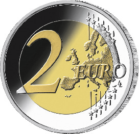
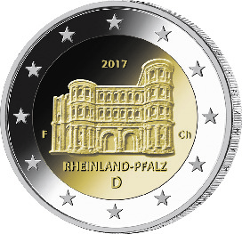

# Bekanntmachung über die Ausprägung von deutschen Euro-Gedenkmünzen im Nennwert von 2 Euro (Gedenkmünze „Rheinland-Pfalz“) (Münz2EuroBek 2017-01-13)

Ausfertigungsdatum
:   2017-01-13

Fundstelle
:   BGBl I: 2017, 135

## (XXXX)

Gemäß den §§ 2, 4 und 5 des Münzgesetzes vom 16. Dezember 1999 (BGBl.
I S. 2402) hat die Bundesregierung beschlossen, eine 2-Euro-
Gedenkmünze „Rheinland-Pfalz“ im Rahmen einer Serie „Bundesländer“
prägen zu lassen.

Die Münze wird ab dem 3. Februar 2017 in den Verkehr gebracht.

Die Wertseite der Münze, die Randschrift (Schriftzug „EINIGKEIT UND
RECHT UND FREIHEIT“ sowie eine stilisierte Darstellung des
Bundesadlers) und die technischen Parameter entsprechen der 2-Euro-
Umlaufmünze.

Die nationale Seite zeigt die Porta Nigra in einer charakteristischen
Außenansicht. Die Länderbezeichnung „RHEINLAND-PFALZ“ verknüpft das
abgebildete Bauwerk mit dem Bundesland. Auf dem inneren Kern befinden
sich ferner das Ausgabejahr 2017, die Kennzeichnung „D“ für das
Ausgabeland Bundesrepublik Deutschland, das Münzzeichen der jeweiligen
Prägestätte („A“, „D“, „F“, „G“ oder „J“) sowie die Initialen des
Künstlers. Der äußere Ring der nationalen Seite zeigt die zwölf
Europasterne.

Die für den Umlauf bestimmte Auflage der Münze beträgt 30 Millionen
Stück.

Der Entwurf der nationalen Seite der Gedenkmünze stammt von dem
Künstler Frantisek Chochola aus Hamburg.

## Schlussformel

Der Bundesminister der Finanzen

## (XXXX)

(Fundstelle: BGBl. I 2017, 135)

*    *        
    *        

