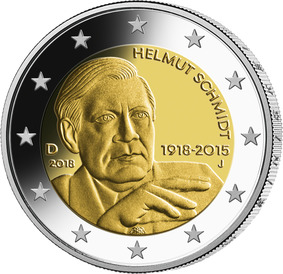

# Bekanntmachung über die Ausprägung von deutschen Euro-Gedenkmünzen im Nennwert von 2 Euro (Gedenkmünze „100. Geburtstag Helmut Schmidt“) (Münz2EuroBek 2018-07-23/2)

Ausfertigungsdatum
:   2018-07-02

Fundstelle
:   BGBl I: 2018, 1206

## (XXXX)

Gemäß den §§ 2, 4 und 5 des Münzgesetzes vom 16. Dezember 1999 (BGBl.
I S. 2402) hat die Bundesregierung beschlossen, eine 2-Euro-
Gedenkmünze „100. Geburtstag Helmut Schmidt“ prägen zu lassen.

Die Münze wird ab dem 30. Januar 2018 in den Verkehr gebracht.

Die Wertseite der Münze, die Randschrift (Schriftzug „EINIGKEIT UND
RECHT UND FREIHEIT“ sowie eine stilisierte Darstellung des
Bundesadlers) und die technischen Parameter entsprechen der 2-Euro-
Umlaufmünze.

Die Münze würdigt das politische Lebenswerk von Helmut Schmidt
anlässlich seines 100. Geburtstages. Die nationale Seite zeigt den
Politiker in einer für ihn typischen Haltung; im Dialog mit seinem
Gegenüber.

Auf dem inneren Kern befinden sich ferner der Schriftzug „HELMUT
SCHMIDT“, die Angabe „1918 – 2015“, das Ausgabejahr 2018, die
Kennzeichnung „D“ für das Ausgabeland Bundesrepublik Deutschland, das
Münzzeichen der jeweiligen Prägestätte („A“, „D“, „F“, „G“ oder „J“)
sowie die Initialen des Künstlers. Der äußere Ring der nationalen
Seite zeigt die zwölf Europasterne.

Die für den Umlauf bestimmte Auflage der Münze beträgt 30 Millionen
Stück.

Der Entwurf der nationalen Seite der Gedenkmünze stammt von dem
Künstler Bodo Broschat aus Berlin.

## Schlussformel

Der Bundesminister der Finanzen

## (XXXX)

(Fundstelle: BGBl. I 2018, 1206)

*    *        
    *        

