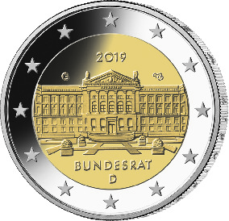
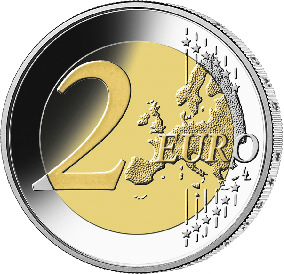

# Bekanntmachung über die Ausprägung von deutschen Euro-Gedenkmünzen im Nennwert von 2 Euro (Gedenkmünze „Bundesrat“) (Münz2EuroBek 2019-08-07)

Ausfertigungsdatum
:   2019-08-07

Fundstelle
:   BGBl I: 2019, 1379

## (XXXX)

Gemäß den §§ 2, 4 und 5 des Münzgesetzes vom 16. Dezember 1999 (BGBl.
I S. 2402) hat die Bundesregierung beschlossen, eine 2-Euro-
Gedenkmünze „Bundesrat“ im Rahmen einer Serie „Bundesländer“ prägen zu
lassen.

Die Münze wird ab dem 29. Januar 2019 in den Verkehr gebracht.

Die Wertseite der Münze, die Randschrift (Schriftzug „EINIGKEIT UND
RECHT UND FREIHEIT“ sowie eine stilisierte Darstellung des
Bundesadlers) und die technischen Parameter entsprechen der 2-Euro-
Umlaufmünze.

Die nationale Seite zeigt eine perspektivische Darstellung des Garten-
und Gebäudeensembles des Bundesrates. Auf dem inneren Kern befinden
sich ferner der Schriftzug „BUNDESRAT“, das Ausgabejahr 2019, die
Kennzeichnung „D“ für das Ausgabeland Bundesrepublik Deutschland, das
Münzzeichen der jeweiligen Prägestätte („A“, „D“, „F“, „G“ oder „J“)
sowie die Initialen des Künstlers. Der äußere Ring der nationalen
Seite zeigt die zwölf Europasterne.

Die für den Umlauf bestimmte Auflage der Münze beträgt 30 Millionen
Stück.

Der Entwurf der nationalen Seite der Gedenkmünze stammt von dem
Künstler Michael Otto aus Rodenbach.

## Schlussformel

Der Bundesminister der Finanzen

## (XXXX)

(Fundstelle: BGBl. I 2019, 1379)

*    *        
    *        

