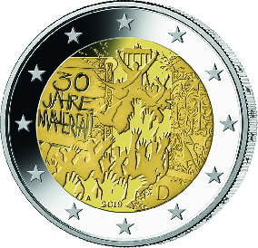

# Bekanntmachung über die Ausprägung von deutschen Euro-Gedenkmünzen im Nennwert von 2 Euro (Gedenkmünze „30 Jahre Mauerfall“) (Münz2EuroBek 2019-10-08)

Ausfertigungsdatum
:   2019-10-08

Fundstelle
:   BGBl I: 2019, 1542

## (XXXX)

Gemäß den §§ 2, 4 und 5 des Münzgesetzes vom 16. Dezember 1999 (BGBl.
I S. 2402) hat die Bundesregierung beschlossen, eine 2-Euro-
Gedenkmünze „30 Jahre Mauerfall“ prägen zu lassen. Die Münze erinnert
an die Öffnung der Berliner Mauer, die sich am 9. November 2019 zum
30\. Mal jährt.

Die Münze wird ab dem 10. Oktober 2019 in den Verkehr gebracht.

Die Wertseite der Münze, die Randschrift (Schriftzug „EINIGKEIT UND
RECHT UND FREIHEIT“ sowie eine stilisierte Darstellung des
Bundesadlers) und die technischen Parameter entsprechen der 2-Euro-
Umlaufmünze.

Das Motiv auf der nationalen Seite der Münze (Bildseite) wurde von der
französischen 2-Euro-Gedenkmünze übernommen, die Frankreich aus Anlass
des 30-jährigen Mauerfalljubiläums herausgibt. Es wurde von einem
Künstler der Monnaie de Paris (französische Münzprägestätte) gestaltet
und zeigt eine Bildcollage aus verschiedenen Elementen zum Münzsujet
sowie den Schriftzug „30 Jahre Mauerfall“. Auf dem inneren Kern
befinden sich ferner das Ausgabejahr 2019, die Länderkennung „D“ der
Bundesrepublik Deutschland sowie das Prägezeichen („A“, „D“, „F“, „G“
oder „J“) der jeweiligen Münzstätte. Der
äußere Ring              der nationalen Seite zeigt die zwölf
Europasterne.

Die für den Umlauf bestimmte Auflage der Münze soll 30 Millionen Stück
betragen.

## Schlussformel

Der Bundesminister der Finanzen

## (XXXX)

(Fundstelle: BGBl. I 2019, 1542)

*    *        
    *        

