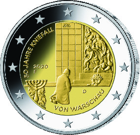
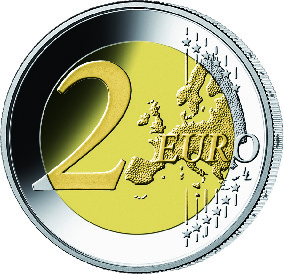

# Bekanntmachung über die Ausprägung von deutschen Euro-Gedenkmünzen im Nennwert von 2 Euro (Gedenkmünze „50 Jahre Kniefall von Warschau“) (Münz2EuroBek 2021-02-08/1)

Ausfertigungsdatum
:   2021-02-08

Fundstelle
:   BGBl I: 2021, 257

## (XXXX)

Gemäß den §§ 2, 4 und 5 des Münzgesetzes vom 16. Dezember 1999 (BGBl.
I S. 2402) hat die Bundesregierung beschlossen, eine 2-Euro-
Gedenkmünze „50 Jahre Kniefall von Warschau“ prägen zu lassen. Die
Münze erinnert an den Kniefall von Willy Brandt vor dem Ehrenmal für
die Helden des Ghettos in Warschau, der sich am 7. Dezember 2020 zum
50\. Mal jährt.

Die Münze wird ab dem 8. Oktober 2020 in den Verkehr gebracht.

Die Wertseite der Münze, die Randschrift (Schriftzug „EINIGKEIT UND
RECHT UND FREIHEIT“ sowie eine stilisierte Darstellung des
Bundesadlers) und die technischen Parameter entsprechen der 2-Euro-
Umlaufmünze.

Die nationale Seite zeigt den Moment des Kniefalls des damaligen
deutschen Bundeskanzlers als Demutsgeste vor dem Ehrenmal für die
Helden des Ghettos in Warschau. Die Komposition stellt den Bezug zum
Ghetto-Aufstand 1943 auf eindrucksvolle Weise dar.

Auf dem inneren Kern befinden sich ferner der Schriftzug „50 Jahre
Kniefall von Warschau“, das Ausgabejahr 2020, die Länderkennung „D“
der Bundesrepublik Deutschland sowie das Prägezeichen („A“, „D“, „F“,
„G“ oder „J“) der jeweiligen Münzstätte. Der äußere Ring der
nationalen Seite zeigt die zwölf Europasterne.

Die für den Umlauf bestimmte Auflage der Münze beträgt 30 Millionen
Stück.

Der Entwurf der nationalen Seite der Gedenkmünze stammt von dem
Künstler Bodo Broschat aus Berlin.

## Schlussformel

Der Bundesminister der Finanzen

## (XXXX)

(Fundstelle: BGBl. I 2021, 257)

*    *        
    *        

*    *
    *

