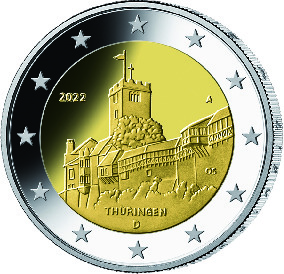
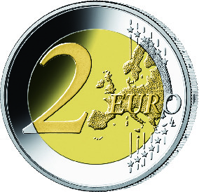

# Bekanntmachung über die Ausprägung von deutschen Euro-Gedenkmünzen im Nennwert von 2 Euro (Gedenkmünze „Thüringen“) (Münz2EuroBek 2022-01-20)

Ausfertigungsdatum
:   2022-01-20

Fundstelle
:   BGBl I: 2022, 186

## (XXXX)

Gemäß den §§ 2, 4 und 5 des Münzgesetzes vom 16. Dezember 1999 (BGBl.
I S. 2402) hat die Bundesregierung beschlossen, eine 2-Euro-
Gedenkmünze „Thüringen“ prägen zu lassen. Die Münze ist die letzte
Ausgabe der im Jahr 2006 begonnenen Serie „Bundesländer“, die aus
insgesamt 17 Münzen (16 Länder sowie eine Münze zur Würdigung des
Bundesrates als Verfassungsorgan) besteht.

Die Münze wird ab dem 25. Januar 2022 in den Verkehr gebracht.

Die Wertseite der Münze, die Randschrift (Schriftzug „EINIGKEIT UND
RECHT UND FREIHEIT“ sowie eine stilisierte Darstellung des
Bundesadlers) und die technischen Parameter entsprechen der 2-Euro-
Umlaufmünze.

Die nationale Seite zeigt die Wartburg. Die Länderbezeichnung
„Thüringen“ verknüpft das abgebildete Bauwerk mit dem Bundesland. Auf
dem inneren Kern befinden sich ferner das Ausgabejahr 2022, die
Kennzeichnung „D“ für das Ausgabeland Bundesrepublik Deutschland, das
Münzzeichen der jeweiligen Prägestätte („A“, „D“, „F“, „G“ oder „J“)
sowie die Initialen des Künstlers. Der äußere Ring der nationalen
Seite zeigt die zwölf Europasterne.

Die für den Umlauf bestimmte Auflage der Münze beträgt 30 Millionen
Stück.

Der Entwurf der nationalen Seite der Gedenkmünze stammt von dem
Künstler Olaf Stoy aus Rabenau.

## Schlussformel

Der Bundesminister der Finanzen

## (XXXX)

(Fundstelle: BGBl. I 2022, 186)

*    *        
    *        

