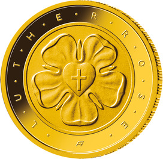

# Bekanntmachung über die Ausprägung von deutschen Euro-Gedenkmünzen im Nennwert von 50 Euro (Goldmünze „Lutherrose“) (Münz50EuroBek 2017-05-15)

Ausfertigungsdatum
:   2017-05-15

Fundstelle
:   BGBl I: 2017, 1221

## (XXXX)

Gemäß den §§ 2, 4 und 5 des Münzgesetzes vom 16. Dezember 1999 (BGBl.
I S. 2402) hat die Bundesregierung beschlossen, zur Würdigung des 500.
Reformationsjubiläums eine Gedenkmünze zu 50 Euro aus Gold prägen zu
lassen.

Die Auflage der Münze beträgt 150 000 Stück. Die Münze wird zu
gleichen Teilen in den Münzstätten Berlin (Münzzeichen „A“), München
(Münzzeichen „D“), Stuttgart (Münzzeichen „F“), Karlsruhe (Münzzeichen
„G“) und Hamburg (Münzzeichen „J“) in Stempelglanzausführung geprägt.

Die Münze wird ab dem 24. Mai 2017 in den Verkehr gebracht. Sie
besteht aus Gold mit einem Feingehalt von 999,9 Tausendteilen
(Feingold), hat einen Durchmesser von 20 Millimetern und eine Masse
von 7,78 Gramm.

Der Entwurf stammt von der Künstlerin Adelheid Fuss aus Geltow.

Die Bildseite zeigt die Lutherrose als wichtiges Symbol für Martin
Luthers Theologie und damit für die Bedeutung der Reformation. Die
Elemente der Lutherrose (Kreuz, Herz, Blüte und Ring) erscheinen in
einer außerordentlich sensibel und sorgfältig gestalteten Verbindung.

Die Wertseite zeigt einen Adler, den Schriftzug „BUNDESREPUBLIK
DEUTSCHLAND“, Wertziffer und Wertbezeichnung, die Jahreszahl 2017, die
zwölf Europasterne sowie – je nach Prägestätte – das Münzzeichen „A“
(Berlin), „D“ (München), „F“ (Stuttgart), „G“ (Karlsruhe) oder „J“
(Hamburg).

Der Münzrand wird geriffelt ausgeführt.

## Schlussformel

Der Bundesminister der Finanzen

## (XXXX)

(Fundstelle: BGBl. I 2017, 1221)

*    *        
    *        

*    *
    *

