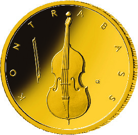
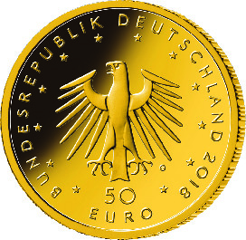

# Bekanntmachung über die Ausprägung von deutschen Euro-Gedenkmünzen im Nennwert von 50 Euro (Goldmünze „Kontrabass“) (Münz50EuroBek 2018-08-02)

Ausfertigungsdatum
:   2018-08-02

Fundstelle
:   BGBl I: 2018, 1322

## (XXXX)

Gemäß den §§ 2, 4 und 5 des Münzgesetzes vom 16. Dezember 1999 (BGBl.
I S. 2402) hat die Bundesregierung beschlossen, eine 50 Euro-Goldmünze
„Kontrabass“ prägen zu lassen. Die Münze bildet den Auftakt einer
fünfteiligen Serie „Musikinstrumente“ (2018 – 2022, eine Ausgabe pro
Jahr) zur Würdigung des deutschen Musikinstrumentenbaus, der seit dem
Mittelalter eine herausragende Stellung in Europa einnimmt.

Die Auflage der Münze beträgt maximal 105 000 Stück. Die Münze wird zu
gleichen Teilen in den Münzstätten Berlin (Münzzeichen „A“), München
(Münzzeichen „D“), Stuttgart (Münzzeichen „F“), Karlsruhe (Münzzeichen
„G“) und Hamburg (Münzzeichen „J“) in Stempelglanzausführung geprägt.

Die Münze wird ab dem 10. August 2018 in den Verkehr gebracht. Sie
besteht aus Gold mit einem Feingehalt von 999,9 Tausendteilen
(Feingold), hat einen Durchmesser von 22 Millimetern und eine Masse
von 7,78 Gramm.

Der Entwurf stammt von dem Künstler Erich Ott aus München.

Die Bildseite zeigt den Kontrabass als wichtiges Orchesterinstrument,
das repräsentativ in das Münzrund gesetzt ist.

Die Wertseite zeigt einen Adler, den Schriftzug „BUNDESREPUBLIK
DEUTSCHLAND“, Wertziffer und Wertbezeichnung, die Jahreszahl 2018, die
zwölf Europasterne sowie – je nach Prägestätte – das Münzzeichen „A“
(Berlin), „D“ (München), „F“ (Stuttgart),
„G“ (Karlsruhe)              oder „J“ (Hamburg).

Der Münzrand wird geriffelt ausgeführt.

## Schlussformel

Der Bundesminister der Finanzen

## (XXXX)

(Fundstelle: BGBl. I 2018, 1322)

*    *        
    *        

