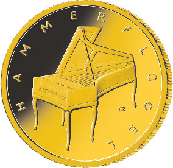
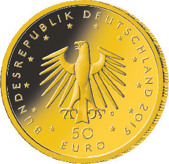

# Bekanntmachung über die Ausprägung von deutschen Euro-Gedenkmünzen im Nennwert von 50 Euro (Goldmünze „Hammerflügel“) (Münz50EuroBek 2019-08-28)

Ausfertigungsdatum
:   2019-08-28

Fundstelle
:   BGBl I: 2019, 1383

## (XXXX)

Gemäß den §§ 2, 4 und 5 des Münzgesetzes vom 16. Dezember 1999 (BGBl.
I S. 2402) hat die Bundesregierung beschlossen, in den Jahren 2018 bis
2022 eine Serie von Goldmünzen im Nennwert von 50 Euro zum Thema
„Musikinstrumente“ prägen zu lassen. Im Jahr 2019 wird die Ausgabe mit
der Münze „Hammerflügel“ fortgesetzt. Die Münze wird ab dem 20. August
2019 in den Verkehr gebracht.

Die Auflage der 50-Euro-Goldmünze „Hammerflügel“ beträgt maximal
150 000 Stück. Die Münze wird zu gleichen Teilen in den Münzstätten
Berlin (Münzzeichen „A“), München (Münzzeichen „D“), Stuttgart
(Münzzeichen „F“), Karlsruhe (Münzzeichen „G“) und Hamburg
(Münzzeichen „J“) in Stempelglanzausführung geprägt.

Sie besteht aus Gold mit einem Feingehalt von 999,9 Tausendteilen
(Feingold), hat einen Durchmesser von 22 Millimetern und eine Masse
von 7,78 Gramm.

Die Bildseite zeigt die typische Ausprägung des populären
Tasteninstruments aus der ersten Hälfte des 18. Jahrhunderts. Durch
den geöffneten Flügel spiegelt das Motiv die Aufführungssituation
wider.

Die Wertseite zeigt einen Adler, den Schriftzug „BUNDESREPUBLIK
DEUTSCHLAND“, Wertziffer und Wertbezeichnung, die Jahreszahl „2019“,
die zwölf Europasterne sowie – je nach Prägestätte – das Münzzeichen
„A“ (Berlin), „D“ (München), „F“ (Stuttgart), „G“ (Karlsruhe) oder „J“
(Hamburg).

Der Münzrand wird geriffelt ausgeführt.

Der Entwurf stammt von dem Künstler Erich Ott aus München.

## Schlussformel

Der Bundesminister der Finanzen

## (XXXX)

(Fundstelle: BGBl. I 2019, 1383)

*    *        
    *        

