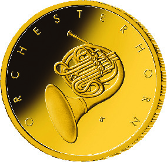
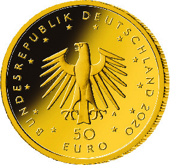

# Bekanntmachung über die Ausprägung von deutschen Euro-Gedenkmünzen im Nennwert von 50 Euro (Goldmünze „Orchesterhorn“) (Münz50EuroBek 2020-08-20)

Ausfertigungsdatum
:   2020-08-20

Fundstelle
:   BGBl I: 2020, 2013

## (XXXX)

Gemäß den §§ 2, 4 und 5 des Münzgesetzes vom 16. Dezember 1999 (BGBl.
I S. 2402) hat die Bundesregierung beschlossen, in den Jahren 2018 bis
2022 eine Serie von Goldmünzen im Nennwert von 50 Euro zum Thema
„Musikinstrumente“ prägen zu lassen. Im Jahr 2020 wird die Ausgabe mit
der Münze „Orchesterhorn“ fortgesetzt. Die Münze wird ab dem 10.
August 2020 in den Verkehr gebracht.

Die Auflage der 50-Euro-Goldmünze „Orchesterhorn“ beträgt maximal
150 000 Stück. Die Münze wird zu gleichen Teilen in den Münzstätten
Berlin (Münzzeichen „A“), München (Münzzeichen „D“), Stuttgart
(Münzzeichen „F“), Karlsruhe (Münzzeichen „G“) und Hamburg
(Münzzeichen „J“) in Stempelglanzausführung geprägt.

Sie besteht aus Gold mit einem Feingehalt von 999,9 Tausendteilen
(Feingold), hat einen Durchmesser von 22 Millimetern und eine Masse
von 7,78 Gramm.

Der Entwurf der Bildseite stammt von dem Künstler Jordi Truxa aus
Neuenhagen. Die Wertseite wurde von dem Künstler Erich Ott aus München
gestaltet.

Die Bildseite zeigt in besonders gelungener Weise das Orchesterhorn,
das als Blasinstrument seit Beginn des 19. Jahrhunderts fester
Bestandteil des Orchesters ist. Durch die Gestaltung des Instrumentes
und insbesondere des Schallstückes wird die Klanglichkeit und die
musikalische Ausdrucksstärke visualisiert.

Die Wertseite zeigt einen Adler, den Schriftzug „BUNDESREPUBLIK
DEUTSCHLAND“, Wertziffer und Wertbezeichnung, die Jahreszahl „2020“,
die zwölf Europasterne sowie – je nach Prägestätte – das Münzzeichen
„A“ (Berlin), „D“ (München), „F“ (Stuttgart), „G“ (Karlsruhe) oder „J“
(Hamburg).

Der Münzrand wird geriffelt ausgeführt.

## Schlussformel

Der Bundesminister der Finanzen

## (XXXX)

(Fundstelle: BGBl. I 2020, 2013)

*    *        
    *        

