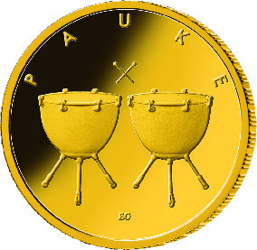
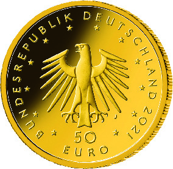

# Bekanntmachung über die Ausprägung von deutschen Euro-Gedenkmünzen im Nennwert von 50 Euro (Goldmünze „Pauke“) (Münz50EuroBek 2021-06-21)

Ausfertigungsdatum
:   2021-06-21

Fundstelle
:   BGBl I: 2021, 2266

## (XXXX)

Gemäß den §§ 2, 4 und 5 des Münzgesetzes vom 16. Dezember 1999 (BGBl.
I S. 2402) hat die Bundesregierung beschlossen, in den Jahren 2018 bis
2022 eine Serie von Goldmünzen im Nennwert von 50 Euro zum Thema
„Musikinstrumente“ prägen zu lassen. Im Jahr 2021 wird die Ausgabe mit
der Münze „Pauke“ fortgesetzt. Die Münze wird ab dem 9. August 2021 in
den Verkehr gebracht.

Die Auflage der 50-Euro-Goldmünze „Pauke“ beträgt maximal 120 000
Stück. Die Münze wird zu gleichen Teilen in den Münzstätten Berlin
(Münzzeichen „A“), München (Münzzeichen „D“), Stuttgart (Münzzeichen
„F“), Karlsruhe (Münzzeichen „G“) und Hamburg (Münzzeichen „J“) in
Stempelglanzausführung geprägt.

Sie besteht aus Gold mit einem Feingehalt von 999,9 Tausendteilen
(Feingold), hat einen Durchmesser von 22 Millimetern und eine Masse
von 7,78 Gramm.

Der Entwurf der Bildseite stammt von der Künstlerin Elena Gerber aus
Berlin. Die Wertseite wurde von dem Künstler Erich Ott aus München
gestaltet.

Die Bildseite zeigt in einer perspektivischen Anordnung zwei
gleichgroße, spannungsvoll und von starker Körperlichkeit geprägte
Pauken, die durch gekreuzte, über den Schlagflächen der Pauken
schwebende Schlägel ergänzt werden. Der tiefe Klang der großen, mit
Fell überspannten Kesselpauken scheint spürbar zu werden.

Die Wertseite zeigt einen Adler, den Schriftzug „BUNDESREPUBLIK
DEUTSCHLAND“, Wertziffer und Wertbezeichnung, die Jahreszahl „2021“,
die zwölf Europasterne sowie – je nach Prägestätte – das Münzzeichen
„A“ (Berlin), „D“ (München), „F“ (Stuttgart), „G“ (Karlsruhe) oder „J“
(Hamburg).

Der Münzrand wird geriffelt ausgeführt.

## Schlussformel

Der Bundesminister der Finanzen

## (XXXX)

(Fundstelle: BGBl. I 2021, 2266)

*    *        
    *        

