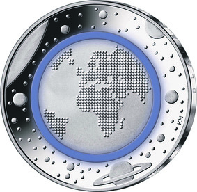
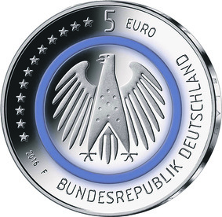

# Bekanntmachung über die Ausprägung von deutschen Euro-Gedenkmünzen im Nennwert von 5 Euro (Gedenkmünze „Planet Erde“) (Münz5EuroBek 2016-04-04)

Ausfertigungsdatum
:   2016-04-04

Fundstelle
:   BGBl I: 2016, 754

## (XXXX)

Gemäß den §§ 2, 4 und 5 des Münzgesetzes vom 16. Dezember 1999 (BGBl.
I S. 2402) hat die Bundesregierung beschlossen, zum Thema „Planet
Erde“ eine innovative deutsche Gedenkmünze im Nennwert von 5 Euro
prägen zu lassen.

Die Auflage der Münze beträgt 2 250 000 Stück, davon 250 000 Stück in
Spiegelglanzqualität. Die Münze wird zu gleichen Teilen in den
Münzstätten Berlin, München, Stuttgart, Karlsruhe und Hamburg geprägt.

Die Münze wird ab dem 14. April 2016 in den Verkehr gebracht. Sie
besteht aus drei Komponenten: Einem äußeren Ring und einem inneren
Kern (Pille) aus Metall (CuNi25/CuNi19) sowie einem prägbaren,
zwischen Ring und Pille eingefügten, Polymerring. Diese Kombination
stellt eine prägetechnische Weltneuheit im Münzbereich dar. Die Münze
hat einen Durchmesser von 27,25 Millimetern und eine Masse von 9
Gramm. Das Gepräge auf beiden Seiten ist erhaben und wird von einem
schützenden, glatten Randstab umgeben.

Im inneren Bereich der Bildseite ist der Planet Erde dargestellt.
Dessen Kontinente werden durch eine Verdichtung von Punkten
abstrahiert. Den umlaufenden blauen Ring assoziiert der Betrachter
unwillkürlich mit der Atmosphäre der Erde. Die unterschiedlich großen
Himmelskörper, die im äußeren Ring dargestellt sind, reflektieren die
Vielfalt astronomischer Objekte.

Die Wertseite zeigt einen Adler, den Schriftzug „BUNDESREPUBLIK
DEUTSCHLAND“, Wertziffer und Wertbezeichnung, die Jahreszahl 2016, die
zwölf Europasterne sowie – je nach Prägestätte – das Münzzeichen „A“
(Berlin), „D“ (München), „F“ (Stuttgart), „G“ (Karlsruhe) oder „J“
(Hamburg).

Der glatte Münzrand enthält in vertiefter Prägung die Inschrift:

„BLAUER PLANET ERDE • BLAUER PLANET ERDE •“.

Der Entwurf stammt von dem Künstler Stefan Klein aus Iserlohn. Der
Adlerentwurf basiert auf einer Vorlage der Künstlerin Alina Hoyer aus
Berlin.

## Schlussformel

Der Bundesminister der Finanzen

## (XXXX)

(Fundstelle: BGBl. I 2016, 754)

*    *        
    *        

