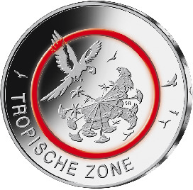
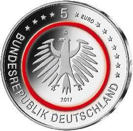

# Bekanntmachung über die Ausprägung von deutschen Euro-Gedenkmünzen im Nennwert von 5 Euro (Gedenkmünze „Tropische Zone“) (Münz5EuroBek 2017-04-04)

Ausfertigungsdatum
:   2017-04-04

Fundstelle
:   BGBl I: 2017, 862

## (XXXX)

Gemäß den §§ 2, 4 und 5 des Münzgesetzes vom 16. Dezember 1999 (BGBl.
I S. 2402) hat die Bundesregierung beschlossen, eine 5-Euro-
Sammlermünze „Tropische Zone“ mit einem roten Kunststoffring prägen zu
lassen. Die Münze bildet den Auftakt einer fünfteiligen Serie
„Klimazonen der Erde“ (2017 – 2021, eine Ausgabe pro Jahr) und
schließt damit thematisch an die innovative 5-Euro-Münze „Planet Erde“
an, die als weltweit erste Sammlermünze mit einem farbigen,
lichtdurchlässigen Kunststoffring im April 2016 vom Bund herausgegeben
wurde.

Die Auflage der Münze beträgt 2 300 000 Stück, davon 300 000 Stück in
Spiegelglanzqualität. Die Münze wird zu gleichen Teilen in den
Münzstätten Berlin, München, Stuttgart, Karlsruhe und Hamburg geprägt.

Die Münze wird ab dem 27. April 2017 in den Verkehr gebracht. Sie
besteht aus drei Komponenten: Einem äußeren Ring und einem inneren
Kern (Pille) aus Metall (CuNi25/CuNi19) sowie einem prägbaren,
zwischen Ring und Pille eingefügten, Polymerring. Die Münze hat einen
Durchmesser von 27,25 Millimetern und eine Masse von 9 Gramm. Das
Gepräge auf beiden Seiten ist erhaben und wird von einem schützenden,
glatten Randstab umgeben.

Die Bildseite zeigt – aus einer besonderen Vogelperspektive –
Baumriesen, an denen entlang der Betrachter in die tropische Zone
eintaucht sowie einen Papagei als Symbol für die Biodiversität der
Tropen. Diese realistischen Bildelemente abstrahieren die tropische
Zone mit dem immerfeuchten Regenwald. Der rote Ring definiert den
Übergang in eine luftige Freifläche, die die Ausdruckskraft des
Entwurfes besonders zur Geltung kommen lässt.

Die Wertseite zeigt einen Adler, den Schriftzug „BUNDESREPUBLIK
DEUTSCHLAND“, Wertziffer und Wertbezeichnung, die Jahreszahl 2017, die
zwölf Europasterne sowie – je nach Prägestätte – das Münzzeichen „A“
(Berlin), „D“ (München), „F“ (Stuttgart),
„G“ (Karlsruhe)              oder „J“ (Hamburg).

Der glatte Münzrand enthält in vertiefter Prägung die Inschrift:

„KLIMAZONEN DER ERDE •“.

Der Entwurf der Münze stammt von der Künstlerin Stefanie Radtke aus
Leipzig.

## Schlussformel

Der Bundesminister der Finanzen

## (XXXX)

(Fundstelle: BGBl. I 2017, 862)

*    *        
    *        

