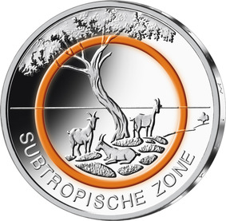
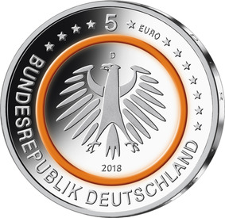

# Bekanntmachung über die Ausprägung von deutschen Euro-Gedenkmünzen im Nennwert von 5 Euro (Gedenkmünze „Subtropische Zone“) (Münz5EuroBek 2018-07-23)

Ausfertigungsdatum
:   2018-07-02

Fundstelle
:   BGBl I: 2018, 1211

## (XXXX)

Gemäß den §§ 2, 4 und 5 des Münzgesetzes vom 16. Dezember 1999 (BGBl.
I S. 2402) hat die Bundesregierung beschlossen, eine 5-Euro-
Sammlermünze „Subtropische Zone“ mit einem orangefarbenen
Kunststoffring prägen zu lassen. Die Münze ist die zweite Ausgabe
einer fünfteiligen Serie „Klimazonen der Erde“, in der von 2017 bis
2021 jeweils eine Ausgabe pro Jahr erscheint.

Die Auflage der Münze beträgt 3 400 000 Stück, davon 400 000 Stück in
Spiegelglanzqualität. Die Münze wird zu gleichen Teilen in den
Münzstätten Berlin, München, Stuttgart, Karlsruhe und Hamburg geprägt.
Sie besteht aus drei Komponenten: Einem äußeren Ring und einem inneren
Kern (Pille) aus Metall
(CuNi25/CuNi19)              sowie einem prägbaren, zwischen Ring und
Pille eingefügten, Polymerring. Die Münze hat einen Durchmesser von
27,25 Millimetern und eine Masse von 9 Gramm. Das Gepräge auf beiden
Seiten ist erhaben und wird von einem schützenden, glatten Randstab
umgeben.

Die Münze wird ab dem 19. April 2018 in den Verkehr gebracht.

Die Bildseite zeigt die für diese Klimazone typische Flora und Fauna,
wie die domestizierten Ziegen und die oft von ihnen gestaltete
macchieartige Strauchlandschaft. Der orangefarbene Ring fokussiert
dabei auf eine typische mediterrane Weideszene mit einer Verbindung
aus Küste und Meer.

Die Wertseite zeigt einen Adler, den Schriftzug „BUNDESREPUBLIK
DEUTSCHLAND“, Wertziffer und Wertbezeichnung, die Jahreszahl 2018, die
zwölf Europasterne sowie – je nach Prägestätte – das Münzzeichen „A“
(Berlin), „D“ (München), „F“ (Stuttgart), „G“ (Karlsruhe) oder „J“
(Hamburg).

Der glatte Münzrand enthält in vertiefter Prägung die Inschrift:

„KLIMAZONEN DER ERDE •“.

Der Entwurf der Bildseite stammt von dem Künstler Patrick Niesel aus
Schwaig. Die Wertseite, die für alle Münzen der Serie verwendet wird,
wurde von der Künstlerin Stefanie Radtke aus Leipzig gestaltet.

## Schlussformel

Der Bundesminister der Finanzen

## (XXXX)

(Fundstelle: BGBl. I 2018, 1211)

*    *        
    *        

