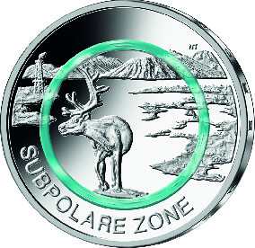
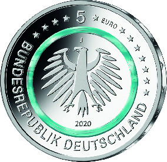

# Bekanntmachung über die Ausprägung von deutschen Euro-Gedenkmünzen im Nennwert von 5 Euro (Gedenkmünze „Subpolare Zone“) (Münz5EuroBek 2020-08-20)

Ausfertigungsdatum
:   2020-08-20

Fundstelle
:   BGBl I: 2020, 2012

## (XXXX)

Gemäß den §§ 2, 4 und 5 des Münzgesetzes vom 16. Dezember 1999 (BGBl.
I S. 2402) hat die Bundesregierung beschlossen, eine 5-Euro-
Sammlermünze „Subpolare Zone“ mit einem türkisfarbenen Kunststoffring
prägen zu lassen. Die Münze ist die vierte Ausgabe einer fünfteiligen
Serie „Klimazonen der Erde“, in der von 2017 bis 2021 jeweils eine
Ausgabe pro Jahr erscheint.

Die Auflage der Münze beträgt 3,4 Millionen Stück, davon 400 000 Stück
in Spiegelglanzqualität. Die Münze wird zu gleichen Teilen in den
Münzstätten Berlin, München, Stuttgart, Karlsruhe und Hamburg geprägt.
Sie besteht aus drei Komponenten: Einem äußeren Ring und einem inneren
Kern (Pille) aus Metall (CuNi25/CuNi19) sowie einem prägbaren,
zwischen Ring und Pille eingefügten, Polymerring. Die Münze hat einen
Durchmesser von 27,25 Millimetern und eine Masse von 9 Gramm. Das
Gepräge auf beiden Seiten ist erhaben und wird von einem schützenden,
glatten Randstab umgeben.

Die Münze wird ab dem 10. September 2020 in den Verkehr gebracht.

Die Bildseite zeigt die Weite der subpolaren Landschaft. Das ins
Zentrum gesetzte Rentier charakterisiert die Klimazone. Durch die
stärkere Textur der Landschaftselemente wird die Dreidimensionalität
hervorgehoben, ohne die relative Leere subarktischer Landschaft zu
überdecken.

Die Wertseite zeigt einen Adler, den Schriftzug „BUNDESREPUBLIK
DEUTSCHLAND“, Wertziffer und Wertbezeichnung, die Jahreszahl 2020, die
zwölf Europasterne sowie – je nach Prägestätte – das Münzzeichen „A“
(Berlin), „D“ (München), „F“ (Stuttgart), „G“ (Karlsruhe) oder „J“
(Hamburg).

Der glatte Münzrand enthält in vertiefter Prägung die Inschrift:

„KLIMAZONEN DER ERDE*             “.

Der Entwurf der Bildseite stammt von der Künstlerin Natalie Tekampe
aus Egenhofen. Die Wertseite, die für alle Münzen der Serie verwendet
wird, wurde von der Künstlerin Stefanie Radtke aus Leipzig gestaltet.

## Schlussformel

Der Bundesminister der Finanzen

## (XXXX)

(Fundstelle: BGBl. I 2020, 2012)

*    *        
    *        

