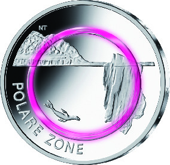
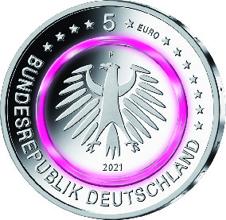

# Bekanntmachung über die Ausprägung von deutschen Euro-Gedenkmünzen im Nennwert von 5 Euro (Gedenkmünze „Polare Zone“) (Münz5EuroBek 2021-06-21)

Ausfertigungsdatum
:   2021-06-21

Fundstelle
:   BGBl I: 2021, 2265

## (XXXX)

Gemäß den §§ 2, 4 und 5 des Münzgesetzes vom 16. Dezember 1999 (BGBl.
I S. 2402) hat die Bundesregierung beschlossen, eine 5-Euro-
Sammlermünze „Polare Zone“ mit einem violettfarbenen Kunststoffring
prägen zu lassen. Diese Münze ist die fünfte und zugleich letzte
Ausgabe der im Jahr 2017 begonnenen Serie „Klimazonen der Erde“
(2017-2021, eine Ausgabe pro Jahr).

Die Auflage der Münze beträgt 3,4 Millionen Stück, davon 400 000 Stück
in Spiegelglanzqualität. Die Münze wird zu gleichen Teilen in den
Münzstätten Berlin, München, Stuttgart, Karlsruhe und Hamburg geprägt.
Sie besteht aus drei Komponenten: Einem äußeren Ring und einem inneren
Kern (Pille) aus Metall (CuNi25/CuNi19) sowie einem prägbaren,
zwischen Ring und Pille eingefügten, Polymerring. Die Münze hat einen
Durchmesser von 27,25 Millimetern und eine Masse von 9 Gramm. Das
Gepräge auf beiden Seiten ist erhaben und wird von einem schützenden,
glatten Randstab umgeben.

Die Münze wird ab dem 9. September 2021 in den Verkehr gebracht.

Die Bildseite zeigt den polaren Raum aus einer submarinen Perspektive.
Die Imaginationskraft der Komposition erzeugt die tiefblaue
Transluzenz des Ozeans, den weißen Glanz des Eisschelfs und das
stumpfe Anthrazit der Felsmassive der Polarregionen. Durch den Eisberg
im rechten Bildvordergrund wird Monumentalität erreicht. Der
Seeleopard taucht in der Stille und Weite des Ozeans. Der Eisberg
zeigt lediglich seine Spitze und verbirgt seine Masse unter der
Wasseroberfläche. Die Landmasse mit der Kalbungsfront eines
Auslassgletschers grenzt den Münzraum in der Bildtiefe ab.

Die Wertseite zeigt einen Adler, den Schriftzug „BUNDESREPUBLIK
DEUTSCHLAND“, Wertziffer und Wertbezeichnung, die Jahreszahl 2021, die
zwölf Europasterne sowie – je nach Prägestätte – das Münzzeichen „A“
(Berlin), „D“ (München), „F“ (Stuttgart), „G“ (Karlsruhe) oder „J“
(Hamburg).

Der glatte Münzrand enthält in vertiefter Prägung die Inschrift:

„KLIMAZONEN DER ERDE •“.

Der Entwurf der Bildseite stammt von der Künstlerin Natalie Tekampe
aus Egenhofen. Die Wertseite, die für alle Münzen der Serie verwendet
wird, hat die Künstlerin Stefanie Radtke aus Leipzig gestaltet.

## Schlussformel

Der Bundesminister der Finanzen

## (XXXX)

(Fundstelle: BGBl. I 2021, 2265)

*    *        
    *        

