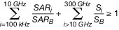
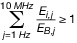
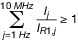
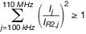

# Verordnung zum Schutz vor schädlichen Wirkungen nichtionisierender Strahlung bei der Anwendung am Menschen (NiSV)

Ausfertigungsdatum
:   2018-11-29

Fundstelle
:   BGBl I: 2018, 2034, 2187 (2021 I 5261)

Mittelbare änderung durch
:   Art. 1 V v. 8.10.2021 I 4646, 5261 (Nr. 72) textlich nachgewiesen, dokumentarisch noch nicht abschließend bearbeitet

[^f804921_34_BJNR218700018]:     Notifiziert gemäß der Richtlinie (EU) 2015/1535 des Europäischen
    Parlaments und des Rates vom 9. September 2015 über ein
    Informationsverfahren auf dem Gebiet der technischen Vorschriften und
    der Vorschriften für die Dienste der Informationsgesellschaft (ABl. L
    241 vom 17.9.2015, S. 1).

## § 1 Anwendungsbereich

(1) Diese Verordnung gilt für den Betrieb von Anlagen zur Anwendung
nichtionisierender Strahlung am Menschen, die zu kosmetischen oder
sonstigen nichtmedizinischen Zwecken gewerblich oder im Rahmen
sonstiger wirtschaftlicher Unternehmungen eingesetzt werden. Sie gilt
nicht für den Betrieb von UV-Bestrahlungsgeräten im Sinne der UV-
Schutz-Verordnung.

(2) Ist der Anwendungsbereich des Medizinprodukterechts gegeben, geht
es dieser Verordnung vor, soweit es gleiche oder weitergehende
Anforderungen enthält.

(3) Die Vorschriften des Arbeitsschutzgesetzes und die auf dieses
Gesetz gestützten Rechtsverordnungen bleiben unberührt.

## § 2 Begriffsbestimmungen

(1) Anlagen im Sinne dieser Verordnung sind:

1.  Ultraschallgeräte, die

    a)  zu Schallintensitäten von mehr als 50 Milliwatt pro Quadratzentimeter
        am Auge oder von mehr als 100 Milliwatt pro Quadratzentimeter am
        übrigen Körper führen können,

    b)  zu einem mechanischen Index größer als 0,4 oder einem thermischen
        Index größer als 0,7 führen können oder

    c)  zur Bildgebung zu nichtmedizinischen Zwecken eingesetzt werden,

2.  Lasereinrichtungen, die einen Laser der Klassen 1C, 2M, 3R, 3B oder 4
    gemäß DIN EN 60825-1:2015 enthalten,

3.  intensive Lichtquellen, die intensive gepulste oder ungepulste
    inkohärente optische Strahlung aussenden, deren Zweck es ist, einen
    Effekt auf das Zielgewebe auszuüben,

4.  Hochfrequenzgeräte, die hochfrequente elektromagnetische Felder

    a)  im Frequenzbereich von 100 Kilohertz bis 300 Gigahertz aussenden, die
        bei ihrer Anwendung am Menschen zu spezifischen Absorptionsraten oder
        Leistungsdichten führen können, die die Basisgrenzwerte der Anlage 1
        überschreiten können,

    b)  im Frequenzbereich von 100 Kilohertz bis zu 10 Megahertz aussenden,
        die bei ihrer Anwendung am Menschen im Körperinneren elektrische
        Feldstärken verursachen können, die die Basisgrenzwerte der Anlage 1
        überschreiten, oder

    c)  im Frequenzbereich von 100 Kilohertz bis zu 110 Megahertz aussenden,
        die bei ihrer Anwendung am Menschen Kontaktströme hervorrufen können,
        die die Referenzwerte der Anlage 1 überschreiten,

5.  Niederfrequenzgeräte, die im Frequenzbereich von 1 Hertz bis 100
    Kilohertz elektrische oder magnetische Felder aussenden oder Ströme im
    Körper hervorrufen, die bei ihrer Anwendung am Menschen im
    Körperinneren elektrische Feldstärken verursachen können, die die
    Basisgrenzwerte der Anlage 1 überschreiten, oder Kontaktströme
    hervorrufen können, die die Referenzwerte der Anlage 1 überschreiten,

6.  Gleichstromgeräte, die elektrischen Gleichstrom (Kontaktstrom) von
    mehr als 0,5 Milliampere und Stromdichten von mehr als 8 Milliampere
    pro Quadratmeter im Körper hervorrufen können,

7.  Magnetfeldgeräte, die statische Magnetfelder von mehr als 400
    Millitesla erzeugen, einschließlich Magnetresonanztomographen.

(2) Im Sinne dieser Verordnung ist:

1.  Anwendung zu nichtmedizinischen Zwecken: Anwendung, die nicht dem
    Zweck der Untersuchung und Behandlung einer Patientin oder eines
    Patienten, der Früherkennung von Krankheiten, der
    Schwangerschaftsvorsorge oder der medizinischen Forschung dient,

2.  transkranielle Gleichstromstimulation: die Stimulation des Gehirns
    mittels Gleichstrom durch am Kopf angebrachte Elektroden,

3.  transkranielle Wechselstromstimulation: die Stimulation des Gehirns
    mittels Wechselstrom durch am Kopf angebrachte Elektroden,

4.  transkranielle Magnetfeldstimulation: die Stimulation des Gehirns
    durch Spulen, die Magnetfelder aussenden,

5.  Anlage zur Stimulation des zentralen Nervensystems: eine Anlage zur
    transkraniellen Gleichstrom-, Wechselstrom- oder Magnetfeldstimulation
    oder eine gleichartige Anlage zur Stimulation des Rückenmarks,

6.  transkutane elektrische Nervenstimulation: die Stimulation des
    peripheren Nervensystems durch am Körper angebrachte Elektroden,

7.  elektrische Muskelstimulation: die Stimulation der Körpermuskulatur
    mit Stromimpulsen durch am Körper angebrachte Elektroden.

## § 3 Allgemeine Anforderungen an den Betrieb

(1) Der Betreiber einer Anlage muss sicherstellen, dass

1.  die Anlage gemäß Herstellerangaben ordnungsgemäß am Betriebsort
    installiert wird,

2.  die anwendende Person in die sachgerechte Handhabung der Anlage
    eingewiesen wird,

3.  die anwendende Person prüft, ob die Anlage für die jeweilige Anwendung
    geeignet ist,

4.  die anwendende Person die Anlage vor jeder Anwendung auf ihre
    Funktionsfähigkeit und ihren ordnungsgemäßen Zustand überprüft,

5.  die Anlage durch Personal, das über die erforderlichen
    gerätetechnischen Kenntnisse verfügt, insbesondere durch Inspektion
    und Wartung unter Berücksichtigung der Angaben des Herstellers sowie
    durch Einhaltung der gerätespezifischen Normen so instandgehalten
    wird, dass der sichere und ordnungsgemäße Betrieb fortwährend
    gewährleistet ist,

6.  die Person, an der nichtionisierende Strahlung angewendet wird, von
    der anwendenden Person vor der Anwendung beraten und aufgeklärt wird,
    insbesondere über

    a)  die Anwendung und ihre Wirkungen,

    b)  gesundheitliche Risiken und Nebenwirkungen der Anwendungen,

    c)  mögliche Alternativen und deren Risiken und Nebenwirkungen,

    d)  die individuelle Situation, die zur Festlegung der relevanten
        Anwendungsparameter führt, und

    e)  die mögliche Notwendigkeit einer vorherigen fachärztlichen Abklärung,

7.  die Person, an der nichtionisierende Strahlung angewendet wird, vor
    Nebenwirkungen geschützt wird, um mit der Anwendung verbundene Risiken
    zu vermeiden oder zu minimieren,

8.  Dritte vor schädlichen Wirkungen nichtionisierender Strahlung durch
    Vorkehrungen geschützt werden.

(2) Der Betreiber einer Anlage muss ferner sicherstellen, dass für die
Anlage eine Dokumentation gemäß Satz 2 erstellt wird, die im Betrieb
vorzuhalten und nach der letzten Nutzung der Anlage drei Jahre
aufzubewahren ist. Die Dokumentation muss Folgendes enthalten:

1.  Angaben zur eindeutigen Identifikation der Anlage,

2.  einen Beleg darüber, dass die ordnungsgemäße Installation der Anlage
    geprüft worden ist,

3.  einen Beleg darüber, dass die anwendende Person in die sachgerechte
    Handhabung der Anlage eingewiesen worden ist,

4.  das Datum, an dem eine Kontrolle im Rahmen einer Inspektion und
    Wartung durchgeführt worden ist, und die Ergebnisse dieser Kontrolle,

5.  das Datum, an dem eine Instandhaltungsmaßnahme durchgeführt worden
    ist, und der Name der verantwortlichen Person oder der Firma, die
    diese Maßnahme durchgeführt hat, und

6.  das Datum, an dem eine Funktionsstörung aufgetreten ist, sowie die Art
    und die Folgen der Funktionsstörung oder des Bedienungsfehlers.

Der Betreiber muss ferner sicherstellen, dass die durchgeführten
Anwendungen gemäß Anlage 2 und die nach Absatz 1 Nummer 6
durchgeführte Beratung und Aufklärung dokumentiert werden.

(3) Der Betreiber einer Anlage hat der zuständigen Behörde den Betrieb
der Anlage spätestens zwei Wochen vor Inbetriebnahme anzuzeigen. In
der Anzeige sind der Name oder die Firma des Betreibers sowie die
Anschrift der Betriebsstätte und die Angaben zur Identifikation der
jeweiligen Anlage zu nennen.
Der Anzeige ist ein Nachweis beizufügen, dass die Personen, die die
Anlage anwenden, über die erforderliche Fachkunde verfügen.
Wird eine Anlage am 31. Dezember 2020 bereits betrieben, hat die
Anzeige bis zum Ablauf des 31. März 2021 zu erfolgen.

(4) Der Betreiber einer Anlage hat der zuständigen Behörde auf
Verlangen nachzuweisen, dass die Anforderungen an den Betrieb der
Anlage und die Anforderungen an die Dokumentation der Anwendungen und
der Aufklärungsgespräche erfüllt sind.

## § 4 (zukünftig in Kraft)

## § 5 Fachkunde zur Anwendung von Lasereinrichtungen und intensiven Lichtquellen

(1) Die erforderliche Fachkunde zur Anwendung von Lasereinrichtungen
und intensiven Lichtquellen wird durch erfolgreiche Teilnahme an einer
Schulung gemäß Anlage 3 Teil A in Verbindung mit Anlage 3 Teil B und
Teil C oder von approbierten Ärztinnen und Ärzten durch entsprechende
ärztliche Weiterbildung oder Fortbildung erworben.

(2) Ablative Laseranwendungen oder Anwendungen, bei denen die
Integrität der Epidermis als Schutzbarriere verletzt wird, die
Behandlung von Gefäßveränderungen und von pigmentierten
Hautveränderungen, die Entfernung von Tätowierungen oder Permanent-
Make-up sowie Anwendungen mit optischer Strahlung, deren Auswirkungen
nicht auf die Haut und ihre Anhangsgebilde beschränkt sind, wie die
Fettgewebereduktion, dürfen nur von approbierten Ärztinnen und Ärzten
mit entsprechender ärztlicher Weiterbildung oder Fortbildung
durchgeführt werden.

## § 6 Fachkunde zur Anwendung von Hochfrequenzgeräten

(1) Die erforderliche Fachkunde zur Anwendung von Hochfrequenzgeräten
wird durch erfolgreiche Teilnahme an einer Schulung gemäß Anlage 3
Teil A in Verbindung mit Anlage 3 Teil B und Teil D oder von
approbierten Ärztinnen und Ärzten durch entsprechende ärztliche
Weiterbildung oder Fortbildung erworben.

(2) Hochfrequenzanwendungen, bei denen die Integrität der Epidermis
als Schutzbarriere verletzt wird, sowie Hochfrequenzanwendungen, die
der thermischen Fettgewebereduktion oder der Behandlung von
Gefäßveränderungen oder von pigmentierten Hautveränderungen dienen,
dürfen nur von approbierten Ärztinnen und Ärzten mit entsprechender
ärztlicher Weiterbildung oder Fortbildung durchgeführt werden.

## § 7 (zukünftig in Kraft)

## § 8 Stimulation des Zentralen Nervensystems

Anlagen zur Stimulation des zentralen Nervensystems am Menschen dürfen
nur von approbierten Ärztinnen und Ärzten angewendet werden, die
entsprechende fachliche Kenntnisse nach ärztlicher Weiterbildung oder
Fortbildung nachweisen.

## § 9 Fachkunde zur Anwendung von Ultraschall

(1) Die erforderliche Fachkunde zur Anwendung von Ultraschallgeräten
wird durch erfolgreiche Teilnahme an einer Schulung gemäß Anlage 3
Teil A in Verbindung mit Anlage 3 Teil B und Teil F oder durch die
Approbation als Ärztin oder als Arzt erworben.

(2) Ultraschallanwendungen, insbesondere Anwendungen von fokussiertem
Ultraschall, bei denen die Integrität der Epidermis als Schutzbarriere
verletzt wird, sowie Ultraschallanwendungen, die der gezielten
thermischen Gewebekoagulation oder der Fettgewebereduktion dienen,
dürfen nur von einer approbierten Ärztin oder einem approbierten Arzt
durchgeführt werden.

## § 10 Anwendung von Ultraschall an einer schwangeren Person

Bei der Anwendung von Ultraschallgeräten zu nichtmedizinischen Zwecken
darf ein Fötus nicht exponiert werden.

## § 11 Anwendung von Magnetresonanzverfahren

Magnetresonanztomographen dürfen zu nichtmedizinischen Zwecken am
Menschen nur unter Verantwortung einer Ärztin oder eines Arztes mit
einer der sachgerechten Bedienung von Magnetresonanztomographen
dienenden Fachkunde angewendet werden.

## § 12 Ordnungswidrigkeiten

Ordnungswidrig im Sinne des § 8 Absatz 1 Nummer 3 des Gesetzes zum
Schutz vor nichtionisierender Strahlung bei der Anwendung am Menschen
handelt, wer vorsätzlich oder fahrlässig

1.  entgegen § 3 Absatz 1 Nummer 1 nicht sicherstellt, dass eine Anlage
    gemäß Herstellerangaben installiert wird,

2.  entgegen § 3 Absatz 1 Nummer 2 nicht sicherstellt, dass eine
    Einweisung erfolgt,

3.  entgegen § 3 Absatz 1 Nummer 6 nicht sicherstellt, dass eine Person
    beraten und aufgeklärt wird,

4.  entgegen § 3 Absatz 1 Nummer 7 oder 8 nicht sicherstellt, dass eine
    dort genannte Person geschützt wird,

5.  entgegen § 3 Absatz 2 Satz 1 oder 3 nicht sicherstellt, dass eine
    Dokumentation erstellt wird,

6.  entgegen § 3 Absatz 3 Satz 1 eine Anzeige nicht, nicht richtig, nicht
    vollständig oder nicht rechtzeitig erstattet,

7.  entgegen § 4 Absatz 1 Satz 1 nicht sicherstellt, dass eine dort
    genannte Person über die Fachkunde verfügt,

8.  entgegen § 5 Absatz 2, § 6 Absatz 2 oder § 9 Absatz 2 eine dort
    genannte Anwendung durchführt,

9.  entgegen § 8 oder § 11 eine dort genannte Anlage oder einen
    Magnetresonanztomographen anwendet oder

10. entgegen § 10 bei der Anwendung von Ultraschallgeräten einen Fötus
    exponiert.

(zu § 2 Absatz 1 Nummer 4 und 5)

## Anlage 1 Werte für Anlagen im Sinne dieser Verordnung

(Fundstelle: BGBl. I 2018, 2191 - 2192)

1.  **Hochfrequenzgeräte**                    (§ 2 Absatz 1 Nummer 4)

    a)  Basisgrenzwerte für elektromagnetische Felder oder Ströme:

        *            *   Frequenzbereich
                f

            *   Spezifische
                Absorptionsrate
                SAR
                an Kopf und Rumpf (W/kg)

            *   Spezifische
                Absorptionsrate
                SAR
                an den Extremitäten (W/kg)

            *   Leistungsdichte
                S                                    (W/m
                2                                   )

        *            *   100 kHz – 10 GHz

            *   2

            *   4

            *

        *            *   10 GHz – 300 GHz

            *
            *
            *   10

        *            *   Hinweise

            *   Gemittelt über 6-Minuten-Intervalle und 10 g zusammenhängendes
                Körpergewebe

            *   Gemittelt über
                68/
                f
                1\.05                                   -Minuten-Intervalle und 20 cm
                2                                    exponierte Fläche (f in GHz)
                Für örtliche Maximalwerte gemittelt über 1 cm
                2                                    gelten 200 W/m
                2

    b)  Basisgrenzwerte für die innere elektrische Feldstärke:

        *            *   Frequenzbereich

            *   Innere elektrische Feldstärke in V m
                -1                                    (effektiv)

        *            *   100 kHz – 10 MHz

            *   1,35 x 10
                -4                                    x f (f in Hz)

    c)  Referenzwerte für Kontaktströme:

        *            *   Frequenzbereich

            *   Maximale Kontaktstromstärke in mA

        *            *   100 kHz – 110 MHz

            *   20

    Die Kontaktstromstärke ist über alle Elektroden zu summieren.

2.  **Niederfrequenzgeräte**                    (§ 2 Absatz 1 Nummer 5)

    a)  Basisgrenzwerte für elektrische oder magnetische Felder oder Ströme:

        *            *   Exposition

            *   Frequenzbereich

            *   Innere elektrische Feldstärke
                in V m
                -1                                    (effektiv)

        *            *   CNS-Gewebe am Kopf

            *   1 Hz – 10 Hz

            *   0,1/f (f in Hz)

        *            *
            *   10 Hz – 25 Hz

            *   0,01

        *            *
            *   25 Hz – 1 000 Hz

            *   4 x 10
                -4                                    x f (f in Hz)

        *            *
            *   1 000 Hz – 3 kHz

            *   0,4

        *            *
            *   3 kHz – 100 kHz

            *   1,35 x 10
                -4                                    x f (f in Hz)

        *            *   Gewebe am Kopf und am Körper

            *   1 Hz – 3 kHz

            *   0,4

        *            *
            *   3 kHz – 100 kHz

            *   1,35 x 10
                -4                                    x f (f in Hz)

    b)  Referenzwerte für Kontaktströme:

        *            *   Frequenzbereich

            *   Maximale Kontaktstromstärke in mA

        *            *   1 Hz – 2,5 kHz

            *   0,5

        *            *   2,5 kHz – 100 kHz

            *   0,2 x f (f in kHz)

    Die Kontaktstromstärke ist über alle Elektroden zu summieren.

3.  **Grenzwertausschöpfung von Geräten, die gleichzeitig mehrere
    Frequenzen verwenden**                    (§ 2 Absatz 1 Nummer 4 und
    5)

    a)  Summationsformeln für spezifische Absorptionsraten
        SAR                          und Leistungsdichten S

        *            *                

   mit

        SAR
        i                          = Beitrag zur SAR durch die Exposition bei
        der Frequenz i,

        SAR
        B                          = SAR-Basisgrenzwert gemäß Anhang 1 Nummer
        1 a),

        S
        i                          = Beitrag zur Leistungsdichte durch die
        Exposition bei der Frequenz i,

        S
        B                          = Basisgrenzwert für die
        Leistungsflussdichte gemäß Anhang 1 Nummer 1 a)

    b)  Summationsformeln für induzierte elektrische Felder
        E
        i

        *            *                

   mit

        E
        i, j                          = Beitrag des induzierten elektrischen
        Feldes bei der Frequenz j,

        E
        B, j                          = Basisgrenzwert des induzierten
        elektrischen Feldes bei der Frequenz j, gemäß Anhang 1 Nummer 1 a) und
        Nummer 2 a)

    c)  Summationsformeln für Kontaktströme
        I
        j

        *            *                

        *            *                

   mit

        I
        j                          = Beitrag des Kontaktstromes bei der
        Frequenz j,

        I
        R1, j                          = Referenzwert des Kontaktstromes bei
        der Frequenz j, gemäß Anhang 1 Nummer 1 c)

        I
        R2, j                          = Referenzwert des Kontaktstromes bei
        der Frequenz j, gemäß Anhang 1 Nummer 2 b)

(zu § 3 Absatz 2 Satz 3)

## Anlage 2 Dokumentation der Anwendung

(Fundstelle: BGBl. I 2018, 2193)

1.  Art der Anwendung,

2.  verwendete Anlage sowie die für die konkrete Anwendung individuell
    eingestellten technischen Parameter, zum Beispiel Wellenlänge,
    Frequenz, Pulsung, Expositionsdauer, Art und Ausmaß der Exposition,
    wenn erforderlich Laserklasse,

3.  individueller Behandlungsplan, bei Epilation zum Beispiel wie oft, in
    welchem zeitlichen Abstand mit welchen Einstellungen wird die
    Anwendung wiederholt; bei Muskelstimulation zum Beispiel
    Trainingsplan, Zahl, Dauer und Intensität der Anwendungen,

4.  wenn erforderlich Fotodokumentation,

5.  auftretende Nebenwirkungen,

6.  bei Nebenwirkungen oder Schäden: Ursachen oder Fehleranalyse,
    ergriffene Maßnahmen zur Beseitigung der Fehlerquelle; sofern erfolgt:
    Meldung von Gerätedefekten, Funktionsstörungen, Nebenwirkungen oder
    Schäden an Hersteller und Behörden und

7.  Einverständniserklärung der behandelten Person zur Anwendung.

(zu § 5 Absatz 1, § 6 Absatz 1, § 7 Absatz 1 und § 9 Absatz 1)

## Anlage 3 Fachkunde

(Fundstelle: BGBl. I 2018, 2194 - 2196)

## Teil A: Erwerb und Aktualisierung der Fachkunde

**1.** **Übersicht: Module Erwerb/Aktualisierung der Fachkunde**

    Die Lerninhalte zum Erwerb der Fachkunde und zur Aktualisierung der
    Fachkunde (Fortbildung) sind in Module unterteilt. Der jeweils
    erforderliche Schulungsumfang ist in Lerneinheiten (LE; 1 LE = 45
    Minuten) angegeben:

    *        *   Kürzel

        *   Module

        *   Mindest-
            anzahl LE

    *        *   **Erwerb der Fachkunde**

    *        *   GK

        *   Grundlagen der Haut und deren Anhangsgebilde

        *   80

    *        *   OS

        *   Optische Strahlung

        *   120

    *        *   US

        *   Ultraschall

        *   40

    *        *   EK

        *   EMF (Hochfrequenzgeräte) in der Kosmetik

        *   40

    *        *   ES

        *   EMF (Niederfrequenz-, Gleichstrom- und Magnetfeldgeräte) zur
            Stimulation

        *   24

    *        *   **Aktualisierung der Fachkunde (Fortbildung)**

    *        *   AGK

        *   Aktualisierung von GK

        *   2

    *        *   AOS

        *   Aktualisierung von OS

        *   6

    *        *   AUS

        *   Aktualisierung von US

        *   6

    *        *   AEK

        *   Aktualisierung von EK

        *   6

    *        *   AES

        *   Aktualisierung von ES

        *   6

    *        *   Fachkundegruppe

        *   Bezug

        *   Erwerb

        *   Aktualisierung

    *        *
        *
        *   erforderliche Module

        *   LE

        *   erforderliche Module

        *   LE

    *        *   Laser/Intensive Lichtquellen

        *   § 5 NiSV

        *   GK, OS

        *   200

        *   AGK, AOS

        *   8

    *        *   Ultraschall

        *   § 9 NiSV

        *   GK, US

        *   120

        *   AGK, AUS

        *   8

    *        *   EMF-Kosmetik

        *   § 6 NiSV

        *   GK, EK

        *   120

        *   AGK, AEK

        *   8

    *        *   EMF-Stimulation

        *   §§ 7, 8 NiSV

        *   ES

        *   24

        *   AGS, AES

        *   6

**2.** **Übersicht Fachkunde für spezifische Anwendungen**

    Die Anforderungen an die Fachkunde sind abhängig von der Art der
    Anwendung (Fachkundegruppen).

    *        *   Modul

        *   Fachkundegruppe

    *        *
        *   Laser/Intensive Lichtquellen

        *   Ultraschall

        *   EMF-Kosmetik

        *   EMF-Stimulation

    *        *   GK

        *   x

        *   x

        *   x

        *

    *        *   OS

        *   x

        *
        *
        *

    *        *   US

        *
        *   x

        *
        *

    *        *   EK

        *
        *
        *   x

        *

    *        *   ES

        *
        *
        *
        *   x

    Die Fachkunde für die Anwendung von Lasereinrichtungen und intensiven
    Lichtquellen wird durch die erfolgreiche Teilnahme an einer Schulung
    mit den Lerninhalten des Moduls „Grundlagen der Haut und deren
    Anhangsgebilde“ und einer Schulung mit den Lerninhalten des Moduls
    „optische Strahlung“ erworben.

    Die Fachkunde für die Anwendung von elektromagnetischen Feldern am
    Menschen durch Hochfrequenzgeräte zu kosmetischen Zwecken wird durch
    die erfolgreiche Teilnahme an einer Schulung mit den Lerninhalten des
    Moduls „Grundlagen der Haut und deren Anhangsgebilde“ und einer
    Schulung mit den Lerninhalten des Moduls „Elektromagnetische Felder in
    der Kosmetik“ erworben.

    Die Fachkunde für die Anwendung von elektromagnetischen Feldern am
    Menschen durch Niederfrequenz-, Gleichstrom- oder Magnetfeldgeräte zur
    Stimulation wird durch die erfolgreiche Teilnahme an einer Schulung
    mit den Lerninhalten des Moduls „Elektromagnetische Felder zur
    Stimulation“ erworben.

    Die Fachkunde für die Anwendung von Ultraschall wird durch die
    erfolgreiche Teilnahme an einer Schulung mit den Lerninhalten des
    Moduls „Grundlagen der Haut und deren Anhangsgebilde“ und einer
    Schulung mit den Lerninhalten des Moduls „Ultraschall“ erworben.

**3.** **Gleichwertigkeit mit Fachkunde-Modul Teil B**

    Die erfolgreiche Teilnahme an einer Schulung mit dem Lerninhalt des
    Moduls „Grundlagen der Haut und deren Anhangsgebilde“ ist nicht
    erforderlich, wenn eine Person

    1.  eine staatlich anerkannte Berufsausbildung zum Kosmetiker/zur
        Kosmetikerin erfolgreich absolviert hat,

    2.  einen Bildungsgang staatlich geprüfter Kosmetiker/staatlich geprüfte
        Kosmetikerin erfolgreich absolviert hat,

    3.  die Meisterprüfung im Kosmetikgewerbe erfolgreich absolviert hat oder

    4.  am 5. Dezember 2021 über eine berufliche Praxis im Kosmetikgewerbe von
        mindestens fünf Jahren verfügt.

## Teil B: Fachkunde-Modul „Grundlagen der Haut und deren
Anhangsgebilde“

Lerninhalte (Mindestanzahl LE 80)

1.  Anatomie

2.  Beurteilung der Haut

3.  Physiologie der Haut und ihrer Anhangsgebilde

4.  Überblick zu Anlagen zum Einsatz nichtionisierender Strahlung

5.  Kenntnisse über die Wirkung von Strahlung

6.  Aufklärung von Personen

7.  Übungen

8.  Praktikum

9.  Prüfung

## Teil C: Fachkunde-Modul „Optische Strahlung“

Lerninhalte (Mindestanzahl LE 120)

1.  Gesetzliche Grundlagen

2.  Anatomie und Physiologie der Haut und ihrer Anhangsgebilde

3.  Physikalische Grundlagen kohärenter und inkohärenter Strahlung

4.  Biologische Wirkungen optischer Strahlung

5.  Risiken

6.  Behandlungsparameter und Geräteeinstellungen

7.  Grundlagen Gerätetechnik zum Einsatz optischer Strahlung

8.  Kontraindikationen, Risiken und Nebenwirkungen

9.  Schutzbestimmungen und -maßnahmen

10. Kombinationsgeräte

11. Anwendungsplanung, Aufklärung von Personen und Dokumentation

12. Übungen

13. Selbständige Durchführung von unterschiedlichen Anwendungen unter
    fachärztlicher Aufsicht

14. Prüfung

## Teil D: Fachkunde-Modul „Elektromagnetische Felder
(Hochfrequenzgeräte) in der Kosmetik“

Lerninhalte (Mindestanzahl LE 40)

1.  Gesetzliche Grundlagen

2.  Anatomie und Physiologie

3.  Physikalische Grundlagen über hochfrequente elektromagnetische Felder

4.  Biologische Wirkungen von hochfrequenten elektromagnetischen Feldern

5.  Behandlungsparameter und Geräteeinstellungen

6.  Grundlagen Gerätetechnik zum Einsatz von elektromagnetischen Feldern

7.  Kontraindikationen, Risiken und Nebenwirkungen

8.  Schutzbestimmungen und -maßnahmen

9.  Kombinationsgeräte

10. Anwendungsplanung, Aufklärung von Personen und Dokumentation

11. Übungen

12. Selbständige Durchführung von unterschiedlichen Anwendungen unter
    fachärztlicher Aufsicht

13. Prüfung

## Teil E: Fachkunde-Modul „Elektromagnetische Felder
(Niederfrequenz-, Gleichstrom- oder Magnetfeldgeräte) zur Stimulation“

Voraussetzung für die Teilnahme an diesem Modul ist der Nachweis einer
Lizenz als Übungsleiterin/Übungsleiter mit einer Ausbildung von
mindestens 120 Lerneinheiten oder mindestens einer C-Lizenz als
Trainerin/Trainer mit einer Ausbildung von mindestens 120
Lerneinheiten oder einer vergleichbaren Ausbildung. Nachweise aus
einem anderen Mitgliedstaat der Europäischen Union oder einem anderen
Vertragsstaat des Abkommens über den Europäischen Wirtschaftsraum über
die Erfüllung der Anforderungen nach Teil E stehen inländischen
Nachweisen gleich, wenn aus ihnen hervorgeht, dass die betreffenden
Anforderungen oder die auf Grund ihrer Zielsetzung im Wesentlichen
vergleichbaren Anforderungen des Ausstellungsstaates erfüllt sind.
Unterlagen nach Satz 2 sind auf Verlangen im Original oder in Kopie
vorzulegen. Eine Beglaubigung der Kopie sowie eine beglaubigte
deutsche Übersetzung können verlangt werden.

Lerninhalte (Mindestanzahl LE 24)

1.  Gesetzliche Grundlagen

2.  Anatomie und Physiologie bei Nerven- und Muskelstimulation

3.  Physikalische Grundlagen elektrischer, magnetischer und
    elektromagnetischer Felder

4.  Biologische Wirkungen von elektrischen, magnetischen und
    elektromagnetischen Feldern

5.  Behandlungsparameter und Geräteeinstellungen

6.  Grundlagen Gerätetechnik zum Einsatz von elektromagnetischen Feldern

7.  Kontraindikationen, Risiken und Nebenwirkungen

8.  Schutzbestimmungen und -maßnahmen

9.  Anwendungsplanung, Aufklärung von Personen und Dokumentation

10. Übungen

11. Selbständige Durchführung von unterschiedlichen Anwendungen unter
    fachärztlicher Aufsicht

12. Prüfung

## Teil F: Fachkunde-Modul „Ultraschall“

Lerninhalte (Mindestanzahl LE 40)

1.  Gesetzliche Grundlagen

2.  Anatomie und Physiologie der Haut und ihrer Anhangsgebilde

3.  Physikalische Grundlagen von Ultraschall

4.  Biologische Wirkungen von Ultraschall

5.  Risiken

6.  Behandlungsparameter und Geräteeinstellungen

7.  Grundlagen Gerätetechnik zum Einsatz von Ultraschall

8.  Kontraindikationen, Risiken und Nebenwirkungen

9.  Schutzbestimmungen und -maßnahmen

10. Kombinationsgeräte

11. Anwendungsplanung, Aufklärung von Personen und Dokumentation

12. Übungen

13. Selbständige Durchführung von unterschiedlichen Anwendungen unter
    ärztlicher Aufsicht

14. Prüfung

