# Neue-psychoaktive-Stoffe-Gesetz (NpSG)

Ausfertigungsdatum
:   2016-11-21

Fundstelle
:   BGBl I: 2016, 2615

Zuletzt geändert durch
:   Art. 1 V v. 3.7.2020 I 1555

Änderung durch
:   Art. 1 V v. 28.6.2021 I 2231 (Nr. 38) textlich nachgewiesen, dokumentarisch noch nicht abschließend bearbeitet

Änderung durch
:   Art. 8 Abs. 6 G v. 27.9.2021 I 4530 (Nr. 70) textlich nachgewiesen, dokumentarisch noch nicht abschließend bearbeitet

## § 1 Anwendungsbereich

(1) Dieses Gesetz ist anzuwenden auf neue psychoaktive Stoffe im Sinne
des § 2 Nummer 1.

(2) Dieses Gesetz ist nicht anzuwenden auf

1.  Betäubungsmittel im Sinne des § 1 Absatz 1 des
    Betäubungsmittelgesetzes,

2.  Arzneimittel im Sinne des § 2 Absatz 1, 2, 3a und 4 Satz 1 des
    Arzneimittelgesetzes sowie

3.  Tierarzneimittel im Sinne des Artikels 4 Nummer 1 der Verordnung (EU)
    2019/6 des Europäischen Parlaments und des Rates vom 11. Dezember 2018
    über Tierarzneimittel und zur Aufhebung der Richtlinie 2001/82/EG
    (ABl. L 4 vom 7.1.2019, S. 43; L 163 vom 20.6.2019, S. 112; L 326 vom
    8\.10.2020, S. 15; L 241 vom 8.7.2021, S. 17).

## § 2 Begriffsbestimmungen

Im Sinne dieses Gesetzes ist

1.  neuer psychoaktiver Stoff ein Stoff oder eine Zubereitung eines
    Stoffes aus einer der in der Anlage genannten Stoffgruppen;

2.  Zubereitung ohne Rücksicht auf den Aggregatzustand ein Stoffgemisch
    oder die Lösung eines Stoffes oder mehrerer Stoffe außer den natürlich
    vorkommenden Gemischen und Lösungen;

3.  Herstellen das Gewinnen, das Anfertigen, das Zubereiten, das Be- oder
    Verarbeiten, das Reinigen, das Umwandeln, das Abpacken und das
    Umfüllen einschließlich Abfüllen;

4.  Inverkehrbringen das Vorrätighalten zum Verkauf oder zu sonstiger
    Abgabe sowie das Feilhalten, das Feilbieten, die Abgabe und das
    Überlassen zum unmittelbaren Verbrauch an andere.

## § 3 Unerlaubter Umgang mit neuen psychoaktiven Stoffen

(1) Es ist verboten, mit einem neuen psychoaktiven Stoff Handel zu
treiben, ihn in den Verkehr zu bringen, ihn herzustellen, ihn in den,
aus dem oder durch den Geltungsbereich dieses Gesetzes zu verbringen,
ihn zu erwerben, ihn zu besitzen oder ihn einem anderen zu
verabreichen.

(2) Vom Verbot ausgenommen sind

1.  nach dem jeweiligen Stand von Wissenschaft und Technik anerkannte
    Verwendungen eines neuen psychoaktiven Stoffes zu gewerblichen,
    industriellen oder wissenschaftlichen Zwecken und

2.  Verwendungen eines neuen psychoaktiven Stoffes durch Bundes- oder
    Landesbehörden für den Bereich ihrer dienstlichen Tätigkeit sowie
    durch die von ihnen mit der Untersuchung von neuen psychoaktiven
    Stoffen                    beauftragten Behörden.

(3) In den Fällen des Absatzes 1 erfolgen die Sicherstellung, die
Verwahrung und die Vernichtung von neuen psychoaktiven Stoffen nach
den §§ 47 bis 50 des Bundespolizeigesetzes und den Vorschriften der
Polizeigesetze der Länder.

(4) Unbeschadet des Absatzes 3 können die Zollbehörden im Rahmen ihrer
Aufgabenwahrnehmung nach § 1 Absatz 3 des Zollverwaltungsgesetzes
Waren, bei denen Grund zu der Annahme besteht, dass es sich um neue
psychoaktive Stoffe handelt, die entgegen Absatz 1 in den, aus dem
oder durch den Geltungsbereich dieses Gesetzes verbracht worden sind
oder verbracht werden sollen, sicherstellen. Die §§ 48 bis 50 des
Bundespolizeigesetzes gelten entsprechend. Kosten, die den
Zollbehörden durch die Sicherstellung und Verwahrung entstehen, sind
vom Verantwortlichen zu tragen; die §§ 17 und 18 des
Bundespolizeigesetzes gelten entsprechend. Mehrere Verantwortliche
haften als Gesamtschuldner. Die Kosten können im
Verwaltungsvollstreckungsverfahren beigetrieben werden.

## § 4 Strafvorschriften

(1) Mit Freiheitsstrafe bis zu drei Jahren oder mit Geldstrafe wird
bestraft, wer entgegen § 3 Absatz 1

1.  mit einem neuen psychoaktiven Stoff Handel treibt, ihn in den Verkehr
    bringt oder ihn einem anderen verabreicht oder

2.  einen neuen psychoaktiven Stoff zum Zweck des Inverkehrbringens

    a)  herstellt oder

    b)  in den Geltungsbereich dieses Gesetzes verbringt.

(2) Der Versuch ist strafbar.

(3) Mit Freiheitsstrafe von einem Jahr bis zu zehn Jahren wird
bestraft, wer

1.  in den Fällen

    a)  des Absatzes 1 gewerbsmäßig oder als Mitglied einer Bande handelt, die
        sich zur fortgesetzten Begehung solcher Taten verbunden hat, oder

    b)  des Absatzes 1 Nummer 1 als Person über
        21 Jahre                          einen neuen psychoaktiven Stoff an
        eine Person unter 18 Jahren abgibt oder ihn ihr verabreicht oder zum
        unmittelbaren Verbrauch überlässt oder

2.  durch eine in Absatz 1 genannte Handlung

    a)  die Gesundheit einer großen Zahl von Menschen gefährdet oder

    b)  einen anderen der Gefahr des Todes oder einer schweren Schädigung an
        Körper oder Gesundheit aussetzt.

(4) In minder schweren Fällen des Absatzes 3 ist die Strafe
Freiheitsstrafe von drei Monaten bis zu fünf Jahren.

(5) Handelt der Täter in den Fällen des Absatzes 3 Nummer 1 Buchstabe
b oder Nummer 2 in Verbindung mit Absatz 1 Nummer 1 fahrlässig, ist
die Strafe Freiheitsstrafe bis zu drei Jahren oder Geldstrafe.

(6) Handelt der Täter in den Fällen des Absatzes 1 Nummer 1
fahrlässig, ist die Strafe Freiheitsstrafe bis zu einem Jahr oder
Geldstrafe.

## § 5 Einziehung

Gegenstände, auf die sich eine Straftat nach § 4 bezieht, können
eingezogen werden. § 74a des Strafgesetzbuches ist anzuwenden.

## § 6 Datenübermittlung

Das Zollkriminalamt darf zu Straftaten nach § 4 Informationen,
einschließlich personenbezogener Daten nach der aufgrund des § 7
Absatz 11 des Bundeskriminalamtgesetzes erlassenen Rechtsverordnung,
dem Bundeskriminalamt zur Erfüllung von dessen Aufgaben als
Zentralstelle übermitteln, soweit Zwecke des Strafverfahrens dem nicht
entgegenstehen. Übermittlungen nach Satz 1 sind auch zulässig, sofern
sie Daten betreffen, die dem Steuergeheimnis nach § 30 der
Abgabenordnung unterliegen. Übermittlungsbefugnisse nach anderen
Rechtsvorschriften bleiben unberührt.

## § 7 Verordnungsermächtigung

Das Bundesministerium für Gesundheit wird ermächtigt, durch
Rechtsverordnung, die der Zustimmung des Bundesrates bedarf, im
Einvernehmen mit dem Bundesministerium des Innern, für Bau und Heimat,
mit dem Bundesministerium der Justiz und für Verbraucherschutz und mit
dem Bundesministerium der Finanzen und nach Anhörung von
Sachverständigen die Liste der Stoffgruppen in der Anlage zu ändern,
wenn dies nach wissenschaftlicher Erkenntnis wegen der Wirkungsweise
von psychoaktiv wirksamen Stoffen, wegen des Ausmaßes ihrer
missbräuchlichen Verwendung und wegen der unmittelbaren oder
mittelbaren Gefährdung der Gesundheit erforderlich ist.

## Anlage

(Fundstelle: BGBl. I 2021, 2232 – 2243)

Vorbemerkung

Die Stoffgruppendefinitionen der Nummern 1 bis 7 schließen alle
denkbaren geladenen Formen, Stereoisomere und Salze eines erfassten
Stoffes ein, soweit solche existieren. In den Stoffgruppendefinitionen
festgelegte Molekülmassenbegrenzungen gelten bei geladenen Formen und
Salzen nur für den Molekülteil ausschließlich des Gegen-Ions.

**1** Von 2-Phenethylamin abgeleitete Verbindungen ****

    Eine von 2-Phenethylamin abgeleitete Verbindung ist jede chemische
    Verbindung, die von einer
    2-Phenylethan-1-amin-Grundstruktur                    abgeleitet
    werden kann (ausgenommen 2-Phenethylamin selbst), eine maximale
    Molekülmasse von 500 u hat und dem nachfolgend beschriebenen modularen
    Aufbau aus Strukturelement A und Strukturelement B entspricht.

    *        *            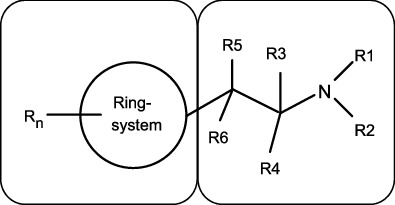

    *        *   **Strukturelement A**

        *
        *   **Strukturelement B**

    Dies schließt chemische Verbindungen mit einer Cathinon-Grundstruktur
    (2-Amino-1-phenyl-1-propanon) ein:

    *        *            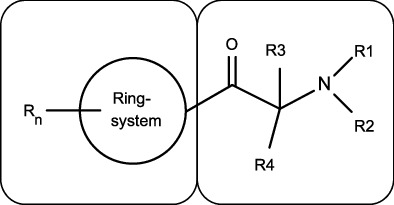

    *        *   **Strukturelement A**

        *
        *   **Strukturelement B**

**1.1** **Strukturelement A**

    Für das Strukturelement A sind die folgenden Ringsysteme
    eingeschlossen, wobei sich das Strukturelement B an jeder Position des
    Strukturelements A befinden kann: Phenyl-, Naphthyl-, Tetralinyl-,
    Methylendioxyphenyl-, Ethylendioxyphenyl-, Furyl-, Pyrrolyl-,
    Thienyl-, Pyridyl-, Benzofuranyl-, Dihydrobenzofuranyl-, Indanyl-,
    Indenyl-, Tetrahydrobenzodifuranyl-, Benzodifuranyl-,
    Tetrahydrobenzodipyranyl-, Cyclopentyl-, Cyclohexyl-.

    *        *            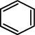
        *            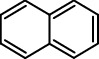

    *        *   Phenyl-

        *   Naphthyl-

    *        *            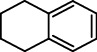
        *            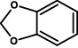

    *        *   Tetralinyl-

        *   Methylendioxyphenyl-

    *        *            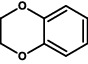
        *            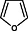

    *        *   Ethylendioxyphenyl-

        *   Furyl-

    *        *            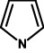
        *            
        *            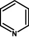

    *        *   Pyrrolyl-

        *   Thienyl-

        *   Pyridyl-

    *        *            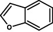
        *            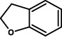

    *        *   Benzofuranyl-

        *   Dihydrobenzofuranyl-

    *        *            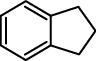
        *            

    *        *   Indanyl-

        *   Indenyl-

    *        *            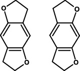
        *            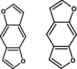

    *        *   Tetrahydrobenzodifuranyl-

        *   Benzodifuranyl-

    *        *            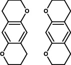
        *            
        *            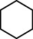

    *        *   Tetrahydrobenzodipyranyl-

        *   Cyclopentyl-

        *   Cyclohexyl-

    Diese Ringsysteme können an jeder Position mit folgenden Atomen oder
    Atomgruppen (R
    n                   ) substituiert sein:

    Wasserstoff, Fluor, Chlor, Brom, Iod, Alkyl- (bis C
    6                   ), Alkenyl- (bis C
    6                   ), Alkinyl- (bis C
    6                   ), Alkoxy- (bis C
    6                   ),
    Carboxy-, Alkylsulfanyl-                    (bis C
    6                   ) und Nitrogruppen.

    Die aufgeführten Atomgruppen können weiterhin mit beliebigen, chemisch
    möglichen Kombinationen der Elemente Kohlenstoff, Wasserstoff,
    Stickstoff, Sauerstoff, Schwefel, Fluor, Chlor, Brom und Iod
    substituiert sein. Die auf diese Weise entstehenden Substituenten
    dürfen dabei eine durchgehende Kettenlänge von maximal acht Atomen
    aufweisen (ohne Mitzählung von Wasserstoffatomen). Atome von
    Ringstrukturen werden dabei nicht in die Zählung einbezogen.

    Moleküle bei denen durch R
    n                    cyclische Systeme entstehen, die an das
    Strukturelement A anneliert sind, werden von der
    Stoffgruppendefinition nicht erfasst.

**1.2** **Strukturelement B**

    Die 2-Aminoethyl-Seitenkette des Strukturelements B kann mit folgenden
    Atomen, Atomgruppen oder Ringsystemen substituiert sein:

    a)  R
        1                          und R
        2                          am Stickstoffatom:

        Wasserstoff, Alkyl- (bis C
        6                         ), Cycloalkyl- (bis C
        6                         ), Benzyl-, Alkenyl- (bis C
        6                         ), Alkinyl- (bis C
        6                         ), Alkylcarbonyl- (bis C
        6                         ),
        Hydroxy- und                          Aminogruppen. Ferner sind Stoffe
        eingeschlossen, bei denen das Stickstoffatom Bestandteil eines
        cyclischen Systems ist (beispielsweise Pyrrolidinyl-, Piperidinyl-).
        Ein Ringschluss des Stickstoffatoms unter Einbeziehung von Teilen des
        Strukturelements B (Reste R
        3                          bis R
        6                         ) ist dabei möglich, wobei die dabei
        entstehende Molekülstruktur hinsichtlich der Substituenten auch ohne
        den erfolgten Ringschluss zum Strukturelement B konform zu Nummer 1.2
        Buchstabe a sein muss. Die dabei entstehenden Ringsysteme können die
        Elemente Kohlenstoff, Sauerstoff, Schwefel, Stickstoff und Wasserstoff
        enthalten. Diese Ringsysteme dürfen fünf bis sieben Atome umfassen.
        Eine Doppelbindung als Brücke zum Strukturelement B ist möglich. Die
        Reste R
        1                         /R
        2                          können ausschließlich in dem bei einem
        Ringschluss mit Teilen des Strukturelements B entstehenden Ringsystem
        als doppelt gebundener Rest (Iminstruktur) vorliegen.

        Ausgenommen von den erfassten Stoffen der Stoffgruppe der von
        2-Phenethylamin abgeleiteten Verbindungen sind Verbindungen, bei denen
        das Stickstoffatom direkt in ein cyclisches System integriert ist, das
        an das Strukturelement A anelliert ist.

        Die Substituenten R
        1                          und R
        2                          können weiterhin mit beliebigen, chemisch
        möglichen Kombinationen
        der Elemente                          Kohlenstoff, Wasserstoff,
        Stickstoff, Sauerstoff, Schwefel, Fluor, Chlor, Brom und Iod
        substituiert sein. Die auf diese Weise entstehenden Substituenten R
        1                         /R
        2                          dürfen dabei eine durchgehende Kettenlänge
        von maximal zehn Atomen aufweisen (ohne Mitzählung von
        Wasserstoffatomen). Atome von Ringstrukturen werden dabei nicht in die
        Zählung einbezogen.

    b)  R
        3                          und R
        4                          am C
        1                         -Atom sowie R
        5                          und R
        6                          am C
        2                         -Atom:

        Wasserstoff, Fluor, Chlor, Brom, Iod, Alkyl- (bis C
        10                         ), Cycloalkyl- (bis C
        10                         ), Benzyl-, Phenyl-, Alkenyl- (bis C
        10                         ), Alkinyl- (bis C
        10                         ), Hydroxy-, Alkoxy- (bis C
        10                         ), Alkylsulfanyl- (bis C
        10                         ), Alkyloxycarbonylgruppen (bis C
        10                         ), einschließlich der chemischen
        Verbindungen, bei denen Substitutionen zu einem Ringschluss mit dem
        Strukturelement A oder zu Ringsystemen, die die Reste R
        3                          bis R
        6                          enthalten, führen. Diese Ringsysteme dürfen
        vier bis sechs Atome umfassen.

        Die aufgeführten Atomgruppen und Ringsysteme können zudem mit
        beliebigen, chemisch möglichen Kombinationen der Elemente Kohlenstoff,
        Wasserstoff, Stickstoff, Sauerstoff, Schwefel, Fluor, Chlor, Brom und
        Iod substituiert sein. Die auf diese Weise entstehenden Substituenten
        R
        3                          bis R
        6                          dürfen dabei eine durchgehende Kettenlänge
        von maximal zwölf Atomen aufweisen (ohne Mitzählung von
        Wasserstoffatomen). Atome von Ringstrukturen werden dabei nicht in die
        Zählung einbezogen.

        Sofern die Reste R
        3                          bis R
        6                          Bestandteil eines Ringsystems sind, das das
        Stickstoffatom des Strukturelements B enthält, gelten für weitere
        Substituenten die Beschränkungen gemäß Buchstabe a.

    c)  Carbonylgruppe in beta-Stellung zum Stickstoffatom (sogenannte bk-
        Derivate, siehe Abbildung der Cathinon-Grundstruktur unter Nummer 1.:
        R
        5                          und R
        6                          am C
        2                         -Atom: Carbonylgruppe (C=O)).

**2** Cannabimimetika/synthetische Cannabinoide ****

**2.1** **Von Indol, Pyrazol und 4-Chinolon abgeleitete Verbindungen**

    Ein Cannabimimetikum bzw. ein synthetisches Cannabinoid der von Indol,
    Pyrazol und 4‑Chinolon abgeleiteten Verbindungen ist jede chemische
    Verbindung, die dem nachfolgend anhand eines Strukturbeispiels
    beschriebenen modularen Aufbau mit einer Kernstruktur entspricht, die
    an einer definierten Position über eine Brücke mit einem Brückenrest
    verknüpft ist und die an einer definierten Position der Kernstruktur
    eine Seitenkette trägt.

    Die Abbildung verdeutlicht den modularen Aufbau am Beispiel des
    1-Fluor-JWH-018:

    *        *            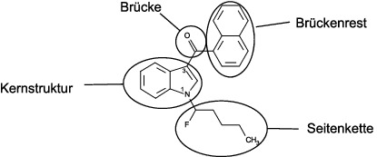

   1-Fluor-JWH-018 besitzt eine Indol-1,3-diyl-Kernstruktur, eine
    Carbonyl-Brücke in Position 3, einen
    1-Naphthyl-Brückenrest                    und eine 1-Fluorpentyl-
    Seitenkette in Position 1.

    Kernstruktur, Brücke, Brückenrest und Seitenkette werden wie folgt
    definiert:

**2.1.1** **Kernstruktur**

    Die Kernstruktur schließt die nachfolgend in den Buchstaben a bis g
    beschriebenen Ringsysteme ein. Die Ringsysteme der Buchstaben a bis f
    können an den in den nachfolgenden Abbildungen gekennzeichneten
    Positionen mit einer beliebigen Kombination der Atome Wasserstoff,
    Fluor, Chlor, Brom, Iod und Phenyl-, Methyl-, Methoxy- und
    Nitrogruppen als Atomgruppen (Reste R
    1                    bis R
    3                   ) substituiert sein.

    Der Rest R der vom 4-Chinolon abgeleiteten Verbindungen (Buchstabe g)
    kann aus den folgenden Atomen oder Atomgruppen bestehen: Wasserstoff,
    Fluor, Chlor, Brom, Iod und Phenylthiogruppe (Anbindung über den
    Schwefel an die Kernstruktur).

    Die Wellenlinie gibt den Bindungsort für die Brücke an, die
    durchbrochene Linie gibt den Bindungsort für die Seitenkette an:

    *        *   a)

        *   Indol-1,3-diyl (X = CH, C-CH
            3                             , C-F, C-Cl, C-Br und C-I) und
            Indazol-1,3-diyl (X = N)
            (Bindungsort für die Brücke in Position 3, Bindungsort für die
            Seitenkette in Position 1)

    *        *
        *            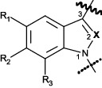
        *   X = CH, C-CH
            3                             , C-F, C-Cl, C-Br, C-I oder N

    *        *   b)

        *   4-, 5-, 6- oder 7-Azaindol-1,3-diyl (X = CH, C-CH
            3                             , C-F, C-Cl, C-Br und C-I) und 4-, 5-,
            6- oder
            7-Azaindazol-1,3-diyl (X = N)
            (Bindungsort für die Brücke in Position 3, Bindungsort für die
            Seitenkette in Position 1)

    *        *
        *            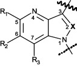
        *            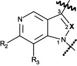
        *   jeweils:
            X = CH, C-CH
            3                             , C-F, C-Cl, C-Br, C-I oder N

    *        *
        *   4-Aza-Derivate

        *   5-Aza-Derivate

    *        *
        *            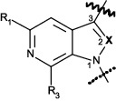
        *            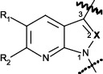

    *        *
        *   6-Aza-Derivate

        *   7-Aza-Derivate

    *        *   c)

        *   Carbazol-1,4-diyl
            (Bindungsort für die Brücke in Position 4,
            Bindungsort für die Seitenkette in Position 1)

        *            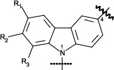

    *        *   d)

        *   Benzimidazol-1,2-diyl-Isomer I
            (Bindungsort für die Brücke in Position 2
            Bindungsort für die Seitenkette in Position 1)

        *            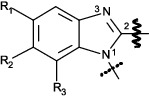

    *        *   e)

        *   Benzimidazol-1,2-diyl-Isomer II
            (Bindungsort für die Brücke in Position 1,
            Bindungsort für die Seitenkette in Position 2)

        *            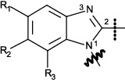

    *        *   f)

        *   Pyrazol-1,5-diyl
            (Bindungsort für die Brücke in Position 5,
            Bindungsort für die Seitenkette in Position 1)

        *            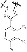
        *            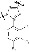

    *        *
        *   und

    *        *
        *   Pyrazol-1,3-diyl
            (Bindungsort für die Brücke in Position 3,
            Bindungsort für die Seitenkette in Position 1)

    *        *
        *
        *   Pyrazol-1,5-diyl

        *   Pyrazol-1,3-diyl

    *        *   g)

        *   4-Chinolon-1,3-diyl
            (Bindungsort für die Brücke in Position 3,
            Bindungsort für die Seitenkette in Position 1)

        *            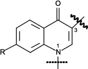

**2.1.2** **Brücke an der Kernstruktur**

    Die Brücke an der Kernstruktur schließt die folgenden Strukturelemente
    ein, die jeweils an der unter Nummer 2.1.1 bezeichneten Stelle an die
    Kernstruktur gebunden sind:

    a)  Carbonyl- und Azacarbonylgruppen,

    b)  Carboxamidogruppe (Carbonylgruppe an Kernstruktur geknüpft), unter
        Einschluss von kohlenstoff- und wasserstoffhaltigen Substituenten am
        Amidstickstoff, die mit Position 2 der Indolkernstruktur (Nummer
        2\.1.1, Buchstabe a): X = CH) einen Sechsring bilden.

    c)  Carboxylgruppe (Carbonylgruppe an Kernstruktur geknüpft),

    d)  direkt an die Kernstruktur angebundene Stickstoffheterocyclen, die
        auch weitere Stickstoff-, Sauerstoff- oder Schwefelatome enthalten
        können, mit einer Ringgröße von bis zu fünf Atomen sowie einer
        Doppelbindung zum Stickstoffatom an der Anknüpfungsstelle.

**2.1.3** **Brückenrest**

    a)  Der Brückenrest kann Kombinationen der Atome Kohlenstoff, Wasserstoff,
        Stickstoff, Sauerstoff, Schwefel, Fluor, Chlor, Brom und Iod
        enthalten, die eine maximale Molekülmasse von 400 u haben und folgende
        Strukturelemente beinhalten können:

        aa) beliebig substituierte gesättigte, ungesättigte oder aromatische
            Ringstrukturen einschließlich Polyzyklen und Heterozyklen, wobei eine
            Anbindung an die Brücke auch über einen Substituenten möglich ist,

        bb) beliebig substituierte Kettenstrukturen, die unter Einbeziehung der
            Heteroatome eine durchgehende Kettenlänge von maximal zwölf Atomen
            (ohne Mitzählung von Wasserstoffatomen) aufweisen.

    b)  Brücken mit der Möglichkeit der Anbindung von mehreren Brückenresten
        (beispielsweise Brücken zu Nummer 2.1.2 Buchstabe b und zu Nummer
        2\.1.2 Buchstabe d können auch mehrere Brückenreste gemäß den
        Definitionen zu Nummer 2.1.3 Buchstabe a Doppelbuchstabe aa und zu
        Nummer 2.1.3 Buchstabe a Doppelbuchstabe bb tragen. Die
        Molekülmassenbeschränkung von insgesamt 400 u gilt dann für die Summe
        der Brückenreste.

**2.1.4** **Seitenkette**

    Die Seitenkette kann beliebige Kombinationen der Atome Kohlenstoff,
    Wasserstoff, Stickstoff, Sauerstoff, Schwefel, Fluor, Chlor, Brom und
    Iod aufweisen, soweit sie nicht gemäß den Buchstaben a und b
    eingeschränkt werden. Die Seitenkette darf eine maximale Molekülmasse
    von 300 u aufweisen und muss jeweils an der unter Nummer 2.1.1
    bezeichneten Stelle der Kernstruktur angebunden sein und kann folgende
    Strukturelemente aufweisen:

    a)  beliebig substituierte Kettenstrukturen, die in der Kette neben
        Kohlenstoffatomen ausschließlich auch Sauerstoff- und Schwefelatome
        aufweisen können und unter Einbeziehung der Heteroatome eine
        durchgehende Kettenlänge von drei bis maximal sieben Atomen (ohne
        Mitzählung von Wasserstoffatomen) aufweisen.

    b)  direkt angebundene oder über eine Kohlenwasserstoffbrücke (gesättigt
        oder einfach ungesättigt, verzweigt oder nicht verzweigt, in Position
        2 optional oxo-substituiert) mit insgesamt ein bis vier
        Kohlenstoffatomen gekoppelte, beliebig substituierte gesättigte,
        ungesättigte oder aromatische Ringstrukturen mit drei bis sieben
        Ringatomen einschließlich Polyzyklen und Heterozyklen. Bei den
        Polyzyklen darf jeder Ring drei bis sieben Ringatome aufweisen.
        Heterozyklen dürfen neben Kohlenstoff die Atome Sauerstoff, Stickstoff
        und Schwefel im Ring aufweisen. Eine mögliche freie Valenz eines
        Stickstoffatoms im Ring kann ein Wasserstoffatom oder einen Methyl-
        oder Ethylrest tragen.

**2.2** **Von 3-Sulfonylamidobenzoesäure abgeleitete Verbindungen**

    Zu dieser eigenständigen Gruppe der Cannabimimetika/synthetischen
    Cannabinoide, die nicht nach dem unter Nummer 2.1 beschriebenen
    modularen Aufbau zusammengesetzt ist, gehören die Stoffe, die eine der
    beiden unter Nummer 2.2.1 beschriebenen Kernstrukturen besitzen, mit
    den unter Nummer 2.2.2 beschriebenen Substituenten besetzt sein können
    und eine maximale Molekülmasse von 500 u haben.

**2.2.1** **Kernstruktur**

    Die Kernstruktur schließt die nachfolgend in den Buchstaben a und b
    beschriebenen Moleküle ein. Diese können an den in den nachfolgenden
    Abbildungen gekennzeichneten Positionen mit den unter Nummer 2.2.2
    genannten Atomen und Atomgruppen (Reste R
    1                    bis R
    4                   ) substituiert sein:

    *        *   a)

        *   3-Sulfonylamidobenzoate

        *            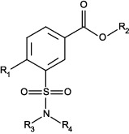

    *        *   b)

        *   3-Sulfonylamidobenzamide

        *            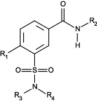

**2.2.2** Reste R
    1 **** **, R**
    2 **** **, R**
    3 **** **und R**
    4 ****

    a)  Der Rest R
        1                          kann aus den folgenden Atomen oder
        Atomgruppen bestehen: Wasserstoff, Fluor, Chlor, Brom, Iod, Methyl-,
        Ethyl- und Methoxygruppen.

    b)  Der Rest R
        2                          kann aus den folgenden Ringsystemen
        bestehen: Phenyl-, Pyridyl-, Cumyl-, 8-Chinolinyl-,
        3-Isochinolinyl-,                          1-Naphthyl- und
        Adamantylrest. Diese Ringsysteme können weiterhin mit beliebigen
        Kombinationen der folgenden Atome oder Atomgruppen substituiert sein:
        Wasserstoff, Fluor, Chlor, Brom, Iod, Methoxy-, Amino-, Hydroxy-,
        Cyano-, Methyl- und Phenylethergruppen.

    c)  Die Reste R
        3                          und R
        4                          können aus einer beliebigen Kombination der
        Atome oder Atomgruppen Wasserstoff, Methyl-, Ethyl-, Propyl- und
        Isopropylgruppen bestehen. Die Reste R
        3                          und R
        4                          können auch ein gesättigtes Ringsystem bis
        zu einer Größe von sieben Atomen einschließlich dem Stickstoffatom
        bilden. Dieses Ringsystem kann die weiteren Elemente Stickstoff,
        Sauerstoff und Schwefel enthalten und eine beliebige Kombination der
        Elemente Wasserstoff, Fluor, Chlor, Brom und Iod tragen. Für die
        Substitution des Stickstoffatoms in einem solchen Ring gelten die für
        die Reste R
        3                          und R
        4                          in Satz 1 angegebenen
        Substitutionsmöglichkeiten.

**3** Benzodiazepine ****

    Die Gruppe der Benzodiazepine umfasst 1,4- und 1,5-Benzodiazepine und
    ihre Triazolo- und Imidazolo-Derivate (Nummer 3.1 Buchstabe a und b)
    sowie einige speziell substituierte Untergruppen dieser Benzodiazepine
    (Nummer 3.1 Buchstabe c bis f). Die maximale Molekülmasse beträgt
    jeweils 600 u.

**3.1** **Kernstruktur**

    Die Kernstruktur schließt die nachfolgend in den Buchstaben a bis f
    beschriebenen Ringsysteme ein. Diese Ringsysteme können an den in den
    nachfolgenden Abbildungen gekennzeichneten Positionen mit den unter
    Nummer 3.2 genannten Atomen oder Atomgruppen (Reste R
    1                    bis R
    7                    und X) substituiert sein:

    a)  1,4-Benzodiazepine

        *            *                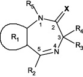
            *                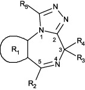
            *                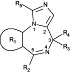

    b)  1,5-Benzodiazepine

        *            *                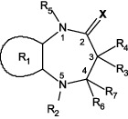
            *                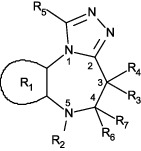
            *                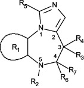

    c)  Loprazolam-Abkömmlinge

        *            *                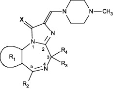

    d)  Ketazolam-Abkömmlinge

        *            *                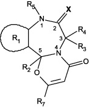
            *                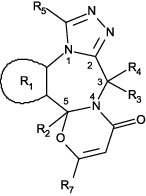
            *                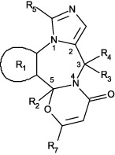

    e)  Oxazolam-Abkömmlinge

        *            *                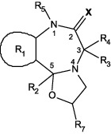
            *                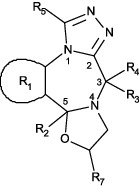
            *                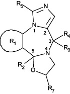

    f)  Chlordiazepoxid-Abkömmlinge

        *            *                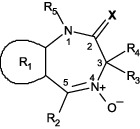
            *                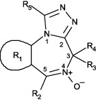
            *                

**3.2** **Reste R**
    1 **** **bis R**
    7 **** **und X**

    a)  Der Rest R
        1                          schließt die folgenden an die Siebenringe
        der Kernstrukturen anellierten Ringsysteme ein:

        Phenyl-, Thienyl-, 4,5,6,7-Tetrahydrobenzo[b]thienyl-, Furanyl- und
        Pyridylring; die Heteroatome im Thienyl-, Furanyl- und Pyridylring
        können an jeder beliebigen Position außerhalb des Siebenringes der
        Kernstruktur stehen.

        Der Rest R
        1                          kann weiterhin mit einem oder mehreren der
        folgenden Atome oder Atomgruppen in beliebiger Kombination und an
        beliebiger Position außerhalb des Siebenringes substituiert sein:
        Wasserstoff, Fluor, Chlor, Brom, Iod, Methyl-, Ethyl-, Nitro- und
        Aminogruppen.

    b)  Der Rest R
        2                          schließt folgende Ringsysteme ein:

        Phenyl-, Pyridyl- (mit Stickstoffatom an beliebiger Position im
        Pyridylring) und Cyclohexenylring (mit Doppelbindung an beliebiger
        Position im Cyclohexenylring).

        Phenyl- und Pyridylring können einen oder mehrere der folgenden
        Substituenten in beliebiger Kombination und an beliebiger Position
        tragen: Wasserstoff, Fluor, Chlor, Brom, Iod, Methyl-, Ethyl-, Nitro-
        und Aminogruppen.

    c)  Der Rest R
        3                          kann aus den folgenden Atomen oder
        Atomgruppen bestehen:

        Wasserstoff, Hydroxy-, Carboxyl-, Ethoxycarbonyl-,
        (N,N-Dimethyl)carbamoyl-, Succinyloxy- und Methylgruppen.

    d)  Der Rest R
        4                          kann aus den folgenden Atomen oder
        Atomgruppen bestehen:

        Wasserstoff, Methyl- und Ethylgruppen.

    e)  Die Reste R
        3                          und R
        4                          können auch gemeinsam eine Carbonylgruppe
        (C=O) bilden.

    f)  Der Rest R
        5                          kann aus den folgenden Atomen oder
        Atomgruppen bestehen:

        Wasserstoff, Methyl-, Ethyl-, (N,N-Dimethylamino)methyl-,
        (N,N-Diethylamino)methyl-, (N,N-Dimethylamino)ethyl-,
        (N,N-Diethylamino)ethyl-, (Cyclopropyl)methyl-,
        (Trifluormethyl)methyl- und Prop-2-in-1-yl-Gruppen.

    g)  Der Rest R
        6                          kann aus den folgenden Atomen oder
        Atomgruppen bestehen:

        Wasserstoff, Hydroxy- und Methylgruppen.

    h)  Der Rest R
        7                          kann aus den folgenden Atomen oder
        Atomgruppen bestehen:

        Wasserstoff, Methyl- und Ethylgruppen.

    i)  Die Reste R
        6                          und R
        7                          können bei den 1,5-Benzodiazepinen auch
        gemeinsam eine Carbonylgruppe (C=O) bilden.

    j)  Bei den 1,5-Benzodiazepinen kann statt R
        2                          und R
        7                          auch eine mit R
        6                          substituierte Doppelbindung zum
        5-Stickstoff-Atom                          vorliegen.

    k)  Der Rest X schließt folgende Substituenten ein:

        Sauerstoff, Schwefel, Imino- und N-Methyliminogruppen. Wenn R
        5                          aus Wasserstoff besteht, können als
        tautomere Formen auch die entsprechenden Enole, Thioenole oder Enamine
        vorliegen.

**4** Von N-(2-Aminocyclohexyl)amid abgeleitete Verbindungen ****

    Eine von N-(2-Aminocyclohexyl)amid abgeleitete Verbindung ist jede
    chemische Verbindung, die von der nachfolgend abgebildeten
    Grundstruktur abgeleitet werden kann, eine maximale Molekülmasse von
    500 u hat und mit den nachfolgend beschriebenen Substituenten besetzt
    sein kann.

    *        *            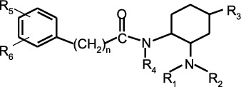

   Die Grundstruktur N-(2-Aminocyclohexyl)amid kann an den in der
    Abbildung gekennzeichneten Positionen mit einer beliebigen Kombination
    der folgenden Atome, verzweigten oder nicht verzweigten Atomgruppen
    oder Ringsystemen (Reste R
    1                    bis R
    6                   ) substituiert sein:

    a)  R
        1                          und R
        2                         :

        Wasserstoff, Alkylgruppe (bis C
        7                         ).

        Ferner sind Stoffe eingeschlossen, bei denen das Stickstoffatom
        Bestandteil eines cyclischen Systems ist (z. B. Pyrrolidinyl-).

        Der Rest R
        1                          oder R
        2                          kann auch an die Bindungsstelle der NR
        1                         R
        2                         -Gruppe am Sechsring anknüpfen (unter
        Bildung einer sogenannten Spiroverbindung). Diese stickstoffhaltigen
        Ringe dürfen eine Ringgröße von drei bis sieben Atomen aufweisen (ein
        Stickstoffatom und zwei bis sechs Kohlenstoffatome).

    b)  R
        3                         :

        Wasserstoff, Oxaspirogruppe (Ringgröße von zwei bis sieben
        Kohlenstoffatomen).

    c)  R
        4                         :

        Wasserstoff, Alkylgruppe (bis C
        5                         ).

    d)  R
        5                          und R
        6                         :

        Der Phenylring kann an den Positionen 2, 3, 4, 5 und 6 beliebige
        Kombinationen folgender Substituenten enthalten: Wasserstoff, Brom,
        Chlor, Fluor, Iod.

        Ferner sind Stoffe eingeschlossen, bei denen R
        5                          und R
        6                          gemeinsam an benachbarten C-Atomen ein
        Ringsystem (bis C
        6                         ) unter Einbeziehung von Heteroatomen
        (Sauerstoff, Schwefel, Stickstoff) bilden. Im Fall eines Stickstoffs
        in diesem Ringsystem darf dieser die Substituenten Wasserstoff und
        Methylgruppe tragen.

        Die Anzahl (n) der Methylengruppen (CH
        2                         )n zwischen dem Phenylring und der
        Carbonylgruppe in der Kernstruktur kann null oder eins betragen.

**5** Von Tryptamin abgeleitete Verbindungen ****

**5.1** **Indol-3-alkylamine**

    Eine von Indol-3-alkylamin abgeleitete Verbindung ist jede chemische
    Verbindung, die von der nachfolgend abgebildeten Grundstruktur
    abgeleitet werden kann, eine maximale Molekülmasse von 500 u hat und
    mit den nachfolgend beschriebenen Substituenten besetzt sein kann.
    Ausgenommen hiervon sind Tryptamin, die natürlich vorkommenden
    Neurotransmitter Serotonin und Melatonin sowie deren aktive
    Metaboliten (z. B.: 6-Hydroxymelatonin).

    *        *            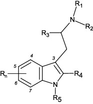

   Die Grundstruktur Indol-3-alkylamin kann an den in der Abbildung
    gekennzeichneten Positionen mit den folgenden Atomen, verzweigten oder
    nicht verzweigten Atomgruppen oder Ringsystemen (Reste R
    1                    bis R
    5                    und R
    n                   ) substituiert sein:

    a)  R
        1                          und R
        2                         :

        Wasserstoff, Alkyl- (bis C
        6                         ), Cycloalkyl- (bis C
        6                         ), Cycloalkylmethyl- (bis C
        6                         ) und Allylgruppen.

        Ferner sind Stoffe eingeschlossen, bei denen das Stickstoffatom
        Bestandteil eines Pyrrolidinyl-Ringsystems ist.

    b)  R
        3                         :

        Wasserstoff, Alkylgruppe (bis C
        3                         ).

    c)  R
        4                         :

        Wasserstoff, Alkylgruppe (bis C
        2                         ).

    d)  R
        5                         :

        Wasserstoff, Alkylgruppe (bis C
        3                         ).

    e)  R
        n                         :

        Das Indolringsystem kann an den Positionen 4, 5, 6 und 7 mit folgenden
        Atomen oder Atomgruppen substituiert sein: Wasserstoff, Fluor, Chlor,
        Brom, Iod, Alkyl- (bis C
        4                         ), Alkyloxy- (bis C
        10                         ), Benzyloxy-, Carboxamido-, Methoxy-,
        Acetoxy-, Hydroxy- und Methylthiogruppen, an Position 4 darüber hinaus
        mit Dihydrogenphosphat.

        Ferner sind Stoffe eingeschlossen, bei denen durch R
        n                          zwei benachbarte Kohlenstoffatome der
        Positionen 4, 5, 6 und 7 mit einer Methylendioxygruppe überbrückt
        werden.

**5.2** Δ
    9,10 **-Ergolene**

    Eine von Δ
    9,10                   -Ergolen abgeleitete Verbindung ist jede
    chemische Verbindung, die von der nachfolgend abgebildeten
    Grundstruktur abgeleitet werden kann, eine maximale Molekülmasse von
    500 u hat und mit den nachfolgend beschriebenen Substituenten besetzt
    sein kann.

    *        *            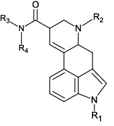

   Die Grundstruktur Δ
    9,10                   -Ergolen kann an den in der Abbildung
    gekennzeichneten Positionen mit den folgenden Atomen, verzweigten oder
    nicht verzweigten Atomgruppen oder Ringsystemen (Reste R
    1                    bis R
    4                   ) substituiert sein:

    a)  R
        1                         :

        Wasserstoff, Alkyl- (bis C
        3                         ) und Cycloalkylcarbonyl- (Ringgröße C
        3                          bis C
        6                         ), Cycloalkylmethyl- (Ringgröße C
        3                          bis C
        6                         ), Alkylcarbonyl (bis C
        4                         )-Gruppen.

    b)  R
        2                         :

        Wasserstoff, Alkyl- (bis C
        4                         ), Allyl- und Prop-2-in-1-yl-Gruppen.

    c)  R
        3                          und R
        4                         :

        Wasserstoff, Alkyl- (bis C
        5                         ), Cyclopropyl-, Allyl- und 1-Hydroxyalkyl
        (bis C
        2                         )-Gruppen.

        Ferner sind Stoffe eingeschlossen, bei denen das Amid-Stickstoffatom
        Bestandteil eines Morpholino-, Pyrrolidino- oder Dimethylazetidid-
        Ringsystems ist.

**6** Von Arylcyclohexylamin abgeleitete Verbindung ****

    Eine von Arylcyclohexylamin abgeleitete Verbindung ist jede chemische
    Verbindung, die von der nachfolgend abgebildeten Grundstruktur
    abgeleitet werden kann, eine maximale Molekülmasse von 500 u hat und
    mit den nachfolgend beschriebenen Substituenten besetzt sein kann.

    *        *            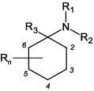

   Die Grundstruktur Arylcyclohexylamin kann an den in der Abbildung
    gekennzeichneten Positionen mit den folgenden Atomen, verzweigten oder
    nicht verzweigten Atomgruppen oder Ringsystemen (Reste R
    1                    bis R
    3                    und R
    n                   ) substituiert sein:

    a)  R
        1                         /R
        2                         :

        Wasserstoff, Alkyl- (bis C
        6                         ), Cycloalkyl- (bis C
        6                         ), Alkenyl- (bis C
        6                         ), Alkinylgruppen (bis C
        6                         ).

        Die aufgeführten Atomgruppen können weiterhin mit beliebigen chemisch
        möglichen Kombinationen der Elemente Kohlenstoff, Wasserstoff,
        Stickstoff und Sauerstoff substituiert sein. Die auf diese Weise
        entstehenden Substituenten R
        1                         /R
        2                          dürfen dabei eine durchgehende Kettenlänge
        von maximal neun Atomen (ohne Mitzählung von Wasserstoffatomen)
        aufweisen. Atome von Ringstrukturen werden dabei nicht in die Zählung
        einbezogen.

        Zudem gehören Stoffe dazu, bei denen das Stickstoffatom Bestandteil
        eines cyclischen Systems ist (beispielsweise Pyrrolyl-, Pyrrolidinyl-,
        Piperidinyl-, Morpholino-Reste). Diese Ringsysteme dürfen im Ring die
        Elemente Kohlenstoff, Sauerstoff, Schwefel und Stickstoff aufweisen
        und eine Ringgröße bis zu sieben Atomen aufweisen. Die Ringsysteme
        können an jeder Position mit folgenden Atomen oder Atomgruppen
        substituiert sein: Wasserstoff, Fluor, Chlor, Brom, Iod, Hydroxy-,
        Alkyl- (bis C
        6                         ) und Phenylgruppen.

    b)  R
        3                         :

        Alkyl- (bis C
        6                         ), Alkinylgruppen (bis C
        6                         ) oder folgende Ringsysteme: Phenyl-,
        Pyrrolyl-, Pyridyl-, Thienyl-, Furanyl-, Methylendioxyphenyl-,
        Ethylendioxyphenyl-, Dihydrobenzofuranyl-, Benzothiophenyl-Reste.

        Die Ringsysteme können an jeder chemisch möglichen Position als R
        3                          an die Kernstruktur angebunden sein und an
        beliebiger Position mit folgenden Atomen oder Atomgruppen substituiert
        sein: Wasserstoff, Fluor, Chlor, Brom, Iod, Hydroxy-, Alkyl- (bis C
        6                         ), Alkoxy- (bis C
        6                         ), Alkylsulfanyl- (bis C
        6                         ), Aminogruppen, einschließlich der
        chemischen Verbindungen, bei denen Substitutionen zu Ringsystemen oder
        einem Ringschluss mit dem Cyclohexylring führen. Diese Ringsysteme
        dürfen eine Ringgröße von vier bis sechs Atomen aufweisen.

    c)  R
        n                         :

        Das Cyclohexylringsystem kann an den Positionen zwei bis sechs mit
        folgenden Atomen oder Atomgruppen substituiert sein: Wasserstoff,
        Alkyl- (bis C
        6                         ), Alkoxy- (bis C
        6                         ), Hydroxy-, Phenylalkylgruppen (in der
        Alkylkette C
        1                          bis C
        4                         ) und Oxo (=O, doppelt gebundenes
        Sauerstoffatom am Ring).

**7** Von Benzimidazol abgeleitete Verbindung ****

    Eine von Benzimidazol abgeleitete Verbindung ist jede chemische
    Verbindung, die von der nachfolgend abgebildeten Grundstruktur
    abgeleitet werden kann, eine maximale Molekülmasse von 500 u hat und
    mit den nachfolgend beschriebenen Substituenten besetzt sein kann:

    *        *            

   Die Grundstruktur kann an den in der Abbildung gekennzeichneten
    Positionen mit den folgenden Atomen, verzweigten oder nicht
    verzweigten Atomgruppen oder Ringsystemen (Reste R
    1                    bis R
    4                    und R
    n                   ) substituiert sein:

    a)  R
        1                          und R
        2                         :

        Wasserstoff, Alkylgruppen (bis C
        3                         ),

        Ferner sind Stoffe eingeschlossen, bei denen das Amin-Stickstoffatom
        Bestandteil eines Morpholino-, Pyrrolidino- oder Piperidinyl-
        Ringsystems ist.

    b)  R
        3                          und R
        4                         :

        Wasserstoff, Nitro-, Trifluormethyl-, Methoxy-, Trifluormethoxy-,
        Cyanogruppen, Fluor, Chlor, Brom und Iod.

    c)  R
        n                         :

        Der Phenylring kann an den Positionen zwei bis sechs mit folgenden
        Atomen oder Atomgruppen substituiert sein: Wasserstoff, Alkyl- (bis C
        4                         ), Alkoxy- (bis C
        4                         ), Trifluormethoxy-, Acetoxy-,
        Alkylsulfanyl- (bis C
        4                         ), Trifluormethyl-, Hydroxy-, Cyanogruppen,
        Fluor, Chlor, Brom und Iod.

    Notifiziert gemäß der Richtlinie (EU) 2015/1535 des Europäischen
    Parlaments und des Rates vom 9. September 2015 über ein
    Informationsverfahren auf dem Gebiet der technischen Vorschriften und
    der Vorschriften für die Dienste der Informationsgesellschaft (ABl. L
    241 vom 17.9.2015, S. 1).
[^F817073_01_BJNR261510016BJNE000803116]: 
