# Verordnung über das Befahren der Bundeswasserstraßen in bestimmten Naturschutzgebieten (NSGBefV)

Ausfertigungsdatum
:   1987-12-08

Fundstelle
:   BGBl I: 1987, 2538

Zuletzt geändert durch
:   Art. 12 V v. 31.10.2019 I 1518

## Eingangsformel

Auf Grund des § 5 Satz 3 des Bundeswasserstraßengesetzes vom 2. April
1968 (BGBl. II S. 173), der durch § 36 Nr. 1 des Gesetzes vom 20.
Dezember 1976 (BGBl. I S. 3574) eingefügt worden ist, wird im
Einvernehmen mit dem Bundesminister für Umwelt, Naturschutz und
Reaktorsicherheit verordnet:

## § 1

Zur Sicherung des jeweiligen Schutzzwecks der in § 2 aufgeführten
Naturschutzgebiete wird das Befahren der darin gelegenen
Bundeswasserstraßen nach Maßgabe dieser Verordnung geregelt.

## § 2

(1) Es ist untersagt, die Bundeswasserstraße Rhein in der Zeit vom 15.
Oktober bis zum 31. März in folgenden Bereichen zu befahren:

1.  im Naturschutzgebiet "Kisselwörth und Sändchen":

    die Wasserflächen innerhalb der Parallelwerke an der Südspitze der
    Insel Kisselwörth von Rhein-km 484,82 bis Rhein-km 485,50 (Lageplan
    1);

2.  (weggefallen)

3.  im Naturschutzgebiet "Fulder-Aue/Ilmen-Aue":

    die Wasserfläche zwischen den Inseln Fulder-Aue und Ilmen-Aue, den
    anschließenden Parallelwerken und dem linken Rheinufer von Rhein-km
    520,50 bis Rhein-km 525,30 (Lageplan 3);

4.  im Naturschutzgebiet "Rüdesheimer Aue":

    die Wasserflächen zwischen den Parallelwerken und der Insel
    Rüdesheimer Aue von Rhein-km 525,00 bis Rhein-km 526,85 und der Linie,
    die in einem Abstand von 60 m zum oberstromigen Parallelwerksende bei
    Rhein-km 525,00 beginnend zur nördlichen Seite der Insel Rüdesheimer
    Aue bei Rhein-km 525,65 führt und in einem Abstand von 190 m zum
    unterstromigen Parallelwerksende bei Rhein-km 526,85 endet (Lageplan
    3);

5.  im Naturschutzgebiet "Insel Graswerth":

    den Vallendarer Stromarm, ohne Rothe Nahrung, von Rhein-km 597,20 bis
    zur Autobahnbrücke bei Rhein-km 598,40 und von dieser in Stromarmmitte
    zur Insel Ketsch und weiter zum Ende des unterstrom an die Insel
    Graswerth anschließenden Parallelwerks bei Rhein-km 598,70 (Lageplan
    4);

6.  im Naturschutzgebiet „Urmitzer Werth“:

    die Wasserfläche zwischen der Linie, die ab Rhein-km 602,15 in einem
    Abstand von 150 m vom rechten Rheinufer verläuft, entlang dem
    südlichen Ufer der Insel Urmitzer Werth einschließlich der ober- und
    unterhalb daran anschließenden Parallelwerke führt und weiter in einem
    Abstand von 100 m vom rechten Rheinufer bis Rhein-km 604,65 verläuft,
    und dem rechten Rheinufer von Rhein-km 602,15 bis Rhein-km 604,65
    (Lageplan 5).

Satz 1 Nummer 6 gilt nicht für Kleinfahrzeuge ohne Antriebsmaschine,
sofern sie die Wasserfläche lediglich zur zügigen Durchfahrt benutzen.

(1a) Es ist untersagt, die Bundeswasserstraße Rhein in folgendem
Bereich zu befahren:
im Naturschutzgebiet „Mariannenaue“:
die Wasserflächen innerhalb der die Insel Mariannenaue umgebenden
Parallelwerke von Rhein-km 512,04 bis Rhein-km 517,35. Ausgenommen
hiervon bleibt das Befahren in der Zeit vom 1. April bis zum 20.
September im westlichen Abschnitt, der durch die südliche Grenze der
Befahrensregelung und eine ausgetonnte Linie begrenzt wird, die von
Rhein-km 515,0 bis zur westlichen Spitze der Insel Mariannenaue in
einem Abstand von jeweils 40 m zum Ufer und von dort in gerader Linie
bis zum nördlichen Parallelwerk verläuft (Lageplan 2).

(2) Es ist untersagt, die Bundeswasserstraße Lahn in folgendem Bereich
zu befahren:
im Naturschutzgebiet "Nieverner Wehr":
den Wehrarm von Lahn-km 128,55 bis Lahn-km 129,35 (Lageplan 6).

(3) Es ist untersagt, die Bundeswasserstraße Mosel in folgenden
Bereichen zu befahren:

1.  im Naturschutzgebiet "Insel Taubengrün":

    die Wasserfläche zwischen der Insel Taubengrün und dem rechten
    Moselufer von Mosel-km 69,99 bis Mosel-km 70,64 (Lageplan 7);

2.  im Naturschutzgebiet "Pommerheld":

    in der Zeit vom 15. Oktober bis zum 31. März die Wasserfläche in einer
    Breite von 40 m entlang dem rechten Moselufer von Mosel-km 43,50 bis
    Mosel-km 47,00 sowie zwischen dem Parallelwerk bei Mosel-km 45,00 und
    dem rechten Moselufer (Lageplan 8).

Es ist ferner in dem in Satz 1 Nummer 2 bezeichneten Bereich
untersagt, an der – in Fließrichtung der Mosel gesehen – linken Seite
des Parallelwerks anzuhalten oder stillzuliegen.

(4) Es ist untersagt, die Bundeswasserstraße Fulda in folgendem
Bereich zu befahren:
im Naturschutzgebiet "Kragenhof bei Fuldatal":
die Wasserfläche zwischen der Ralleninsel, der geraden Linie von ihrem
unterstromigen Ende zur Enteninsel und einem anschließenden Bogen zum
rechten Fuldaufer bei Fulda-km 92,47 und dem rechten Fuldaufer von
Fulda-km 91,54 bis Fulda-km 92,47 (Lageplan 9).

(5) Es ist untersagt, die Bundeswasserstraße Weser im
Naturschutzgebiet „Staustufe Schlüsselburg“ zwischen Weser-km 232,06
und dem Wehr bei Weser-km 236,60 zu befahren (Lageplan 10). Satz 1
gilt nicht in der Zeit vom 16. April bis zum 30. September für
Segelfahrzeuge mit Antriebsmaschine und sonstige Kleinfahrzeuge ohne
Antriebsmaschine. In der Zeit vom 1. Oktober bis zum 15. April dürfen
Kleinfahrzeuge ohne Antriebsmaschine nach Einstellung des Betriebes
der Schleuse Schlüsselburg bis ½ Stunde nach Sonnenuntergang die in
Satz 1 bezeichnete Wasserfläche zügig durchfahren. Wasserfahrzeuge,
die die in Satz 1 genannte Wasserfläche befahren dürfen, müssen, außer
im Bereich der Bootsumtragestelle und der genehmigten Steganlagen,
einen Mindestabstand von 15 m zu den Ufern einhalten.

(6) Es ist untersagt, die Bundeswasserstraße Müritz-Elde-Wasserstraße
in folgenden Bereichen zu befahren:

1.  im Kölpinsee die Wasserfläche des Naturschutzgebietes „Damerower
    Werder“ nach Maßgabe des Lageplans 11;

2.  im Kölpinsee die Wasserfläche des Naturschutzgebietes „Blüchersches
    Bruch und Mittelplan“ nach Maßgabe des Lageplans 12;

3.  im Plauer See die Wasserfläche des Naturschutzgebietes „Nordufer
    Plauer See“ nach Maßgabe des Lageplans 13;

4.  die Wasserfläche der Alten Elde im Bereich des Naturschutzgebietes
    „Alte Elde bei Kuppentin“ zwischen der Mündung in die Müritz-Elde-
    Wasserstraße bei km 103,52 und dem Beginn bei Forsthof an der Müritz-
    Elde-Wasserstraße km 110,80 nach Maßgabe des Lageplans 14;

5.  in der Müritz die Wasserfläche im Westteil des Naturschutzgebietes
    „Großer Schwerin mit Steinhorn“ und den Bereich des Seearms Zähnerlank
    nach Maßgabe des Lageplans 15;

6.  in der Müritz die gesamte Wasserfläche des Naturschutzgebietes
    „Müritzsteilufer bei Rechlin“ nach Maßgabe des Lageplans 16.

Satz 1 Nummer 1 gilt nicht für die Durchfahrt zum Fleesensee und die
Ausfahrt zum Jabelschen See.

(7) Es ist untersagt, die Bundeswasserstraße Störwasserstraße als Teil
der Müritz-Elde-Wasserstraße im Bereich der Schweriner Seen in
folgenden Bereichen zu befahren:

1.  die Wasserfläche des Naturschutzgebietes „Döpe“ nach Maßgabe des
    Lageplans 17;

2.  die Wasserfläche des Naturschutzgebietes „Kaninchenwerder und Großer
    Stein im Großen Schweriner See“ nach Maßgabe des Lageplans 18;

3.  die Wasserfläche des Naturschutzgebietes „Ziegelwerder“ nach Maßgabe
    des Lageplans 19;

4.  die Wasserfläche des Naturschutzgebietes „Ramper Moor“ nach Maßgabe
    des Lageplans 20.

Satz 1 Nummer 2 gilt nicht für die Zufahrt zum Anleger und zur
Hafenanlage am Südufer der Insel sowie in der Zeit vom 15. April bis
15\. Oktober für das Ankern und Liegen in den im Ost- und Westteil der
Insel gelegenen, im Lageplan 18 gekennzeichneten Buchten. Satz 1
Nummer 3 gilt nicht für das Ankern und Liegen in dem im Westteil der
Insel gelegenen, im Lageplan 19 gekennzeichneten Bereich.

## § 3

Die nach § 2 für das Befahren mit Wasserfahrzeugen gesperrten
Wasserflächen werden, soweit erforderlich, von dem örtlich zuständigen
Wasserstraßen- und Schifffahrtsamt durch gelbe Tonnen oder durch
Hinweistafeln gekennzeichnet.

## § 4

Soweit das Befahren der in § 2 genannten Wasserflächen mit
Wasserfahrzeugen mit Maschinenantrieb zulässig ist, dürfen diese eine
Höchstgeschwindigkeit gegenüber dem Ufer von 6 km je Stunde nicht
überschreiten. Satz 1 gilt nicht, soweit in der Talfahrt zur Erhaltung
der Steuerungsfähigkeit eine höhere Geschwindigkeit erforderlich ist.

## § 5

Das örtlich zuständige Wasserstraßen- und Schifffahrtsamt kann von den
Verboten der §§ 2 und 4 allgemein und im Einzelfall, zeitlich begrenzt
oder auf Dauer Befreiungen gewähren, wenn

1.  die Einhaltung der Verbote zu einer nicht beabsichtigten Härte führen
    würde oder

2.  überwiegende Gründe des Wohls der Allgemeinheit die Befreiung
    erfordern.

Befreiungen nach Nummer 1 müssen mit dem Schutzzweck dieser Verordnung
zu vereinbaren sein. Befreiungen von den Verboten nach § 2 sind zu
gewähren, soweit sie erforderlich sind, um eine nach Maßgabe der
jeweiligen Schutzgebietsverordnung zulässige Tätigkeit in einem
Naturschutzgebiet auszuüben.

## § 6

(1) Bei unmittelbar drohender Gefahr kann von den Vorschriften dieser
Verordnung abgewichen werden.

(2) Die Befahrensverbote nach § 2 gelten nicht für

1.  Wasserfahrzeuge des Bundes und der Länder bei notwendigen
    Dienstfahrten,

2.  Wasserfahrzeuge im dienstlichen Auftrag des Bundes oder der Länder bei
    notwendigen Dienstfahrten und

3.  Wasserfahrzeuge bei Ausübung der gewerblichen Fischerei, soweit diese
    auf den jeweiligen Wasserflächen zulässig ist.

## § 6a (weggefallen)

## § 7

Ordnungswidrig im Sinne des § 50 Absatz 1 Nummer 2 des
Bundeswasserstraßengesetzes handelt, wer vorsätzlich oder fahrlässig

1.  entgegen § 2 Absatz 1 Satz 1 Nummer 1, 3 bis 5 oder 6, Absatz 1a Satz
    1, Absatz 2, 3 Satz 1 Nummer 1 oder 2, auch in Verbindung mit Satz 2,
    Absatz 4, 5 Satz 1, Absatz 6 Satz 1 oder Absatz 7 Satz 1 einen dort
    genannten Bereich befährt,

2.  entgegen § 2 Absatz 3 Satz 2 an dem dort bezeichneten Parallelwerk
    anhält oder stillliegt,

3.  entgegen § 2 Absatz 5 Satz 4 den vorgeschriebenen Mindestabstand nicht
    einhält oder

4.  entgegen § 4 Satz 1 die zulässige Höchstgeschwindigkeit überschreitet.

## § 8

Diese Verordnung tritt am 1. Januar 1988 in Kraft.

## Schlußformel

Der Bundesminister für Verkehr

## Anlage Lagepläne 1 bis 20

(Fundstellen:
Lageplan 1 — BGBl I 1987, 2540,
Lageplan 2 — BGBl I 2018, 887,
Lageplan 3 — BGBl I 1987, 2542,
Lageplan 4 — BGBl I 1987, 2543,
Lageplan 5 — BGBl I 1987, 2544,
Lageplan 6 — BGBl I 1987, 2545,
Lageplan 7 — BGBl I 1987, 2546,
Lageplan 8 — BGBl I 1987, 2547,
Lageplan 9 — BGBl I 1987, 2548,
Lageplan 10 — BGBl I 1987, 2549
Lageplan 11 — BGBl. I 2015, 1809,
Lageplan 12 — BGBl. I 2015, 1810,
Lageplan 13 — BGBl. I 2015, 1811,
Lageplan 14 — BGBl. I 2015, 1812
Lageplan 15 — BGBl. I 2015, 1813
Lageplan 16 — BGBl. I 2015, 1814
Lageplan 17 — BGBl. I 2015, 1815
Lageplan 18 — BGBl. I 2017, 3776
Lageplan 19 — BGBl. I 2017, 3777
Lageplan 20 — BGBl. I 2015, 1818;
bzgl. der einzelnen Änderungen vgl. Fußnote)

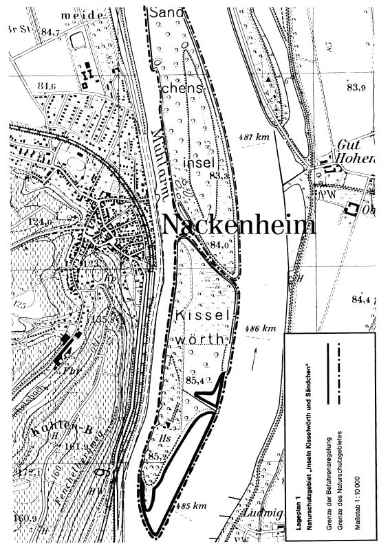
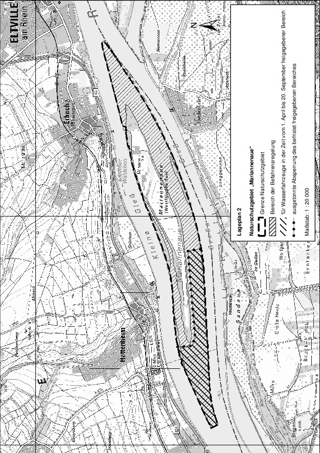
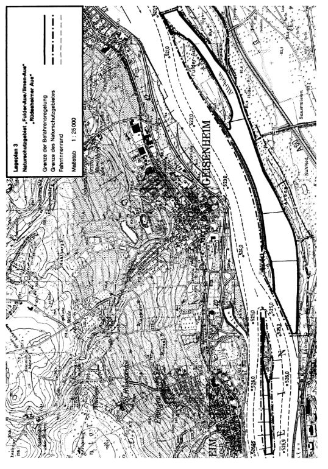
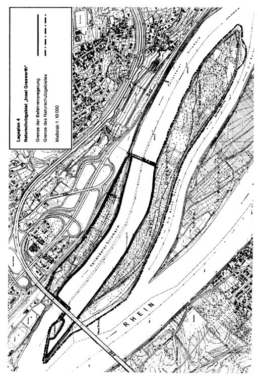
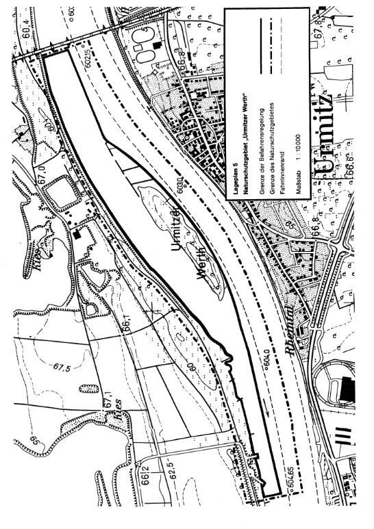
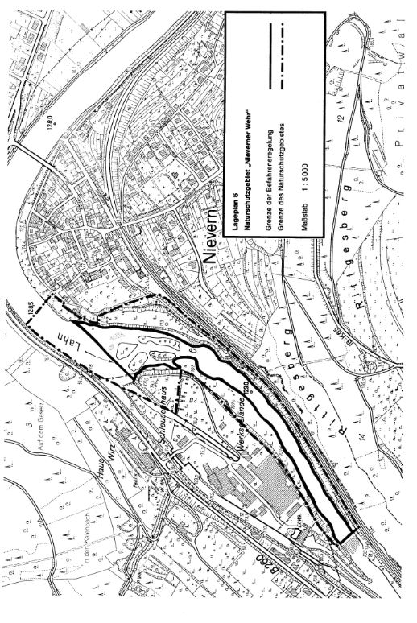
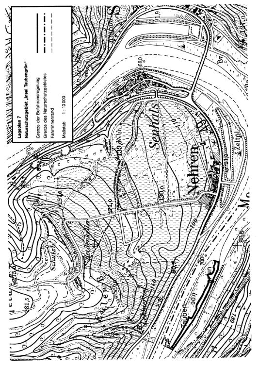
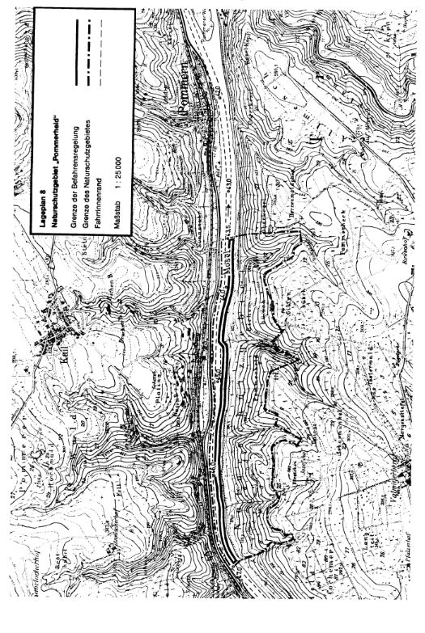
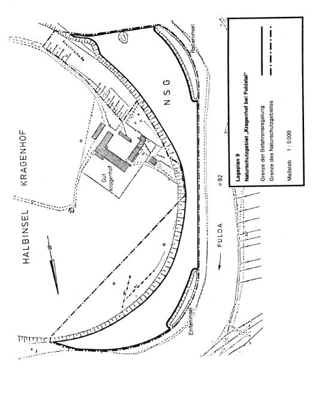
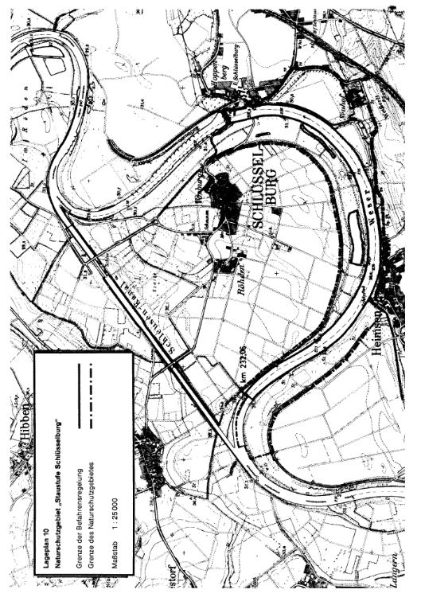

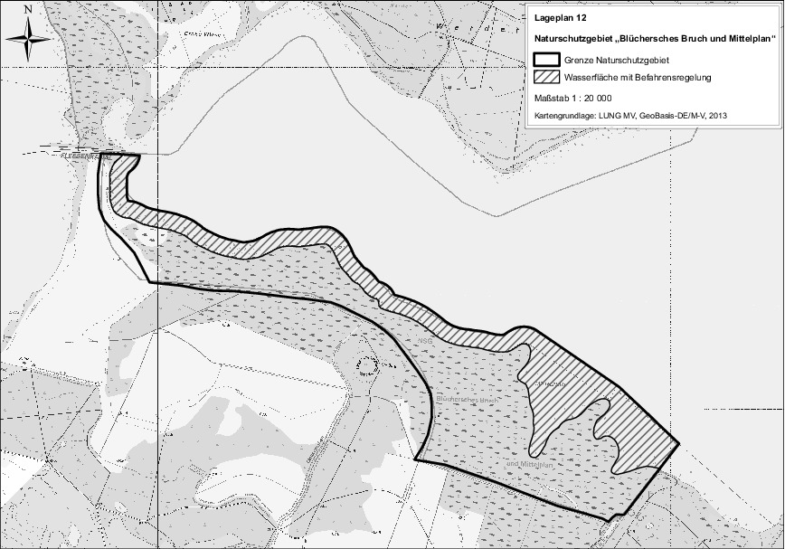
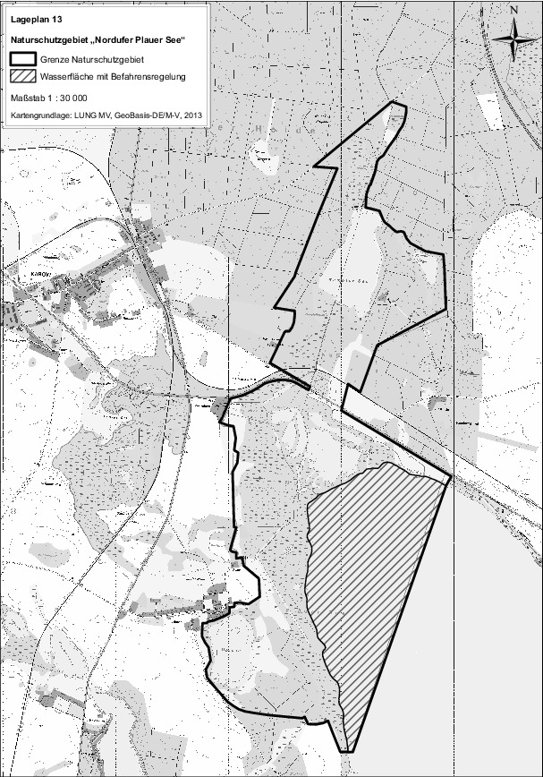
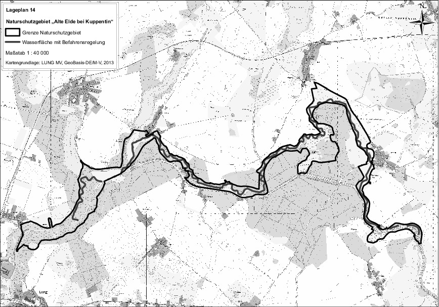
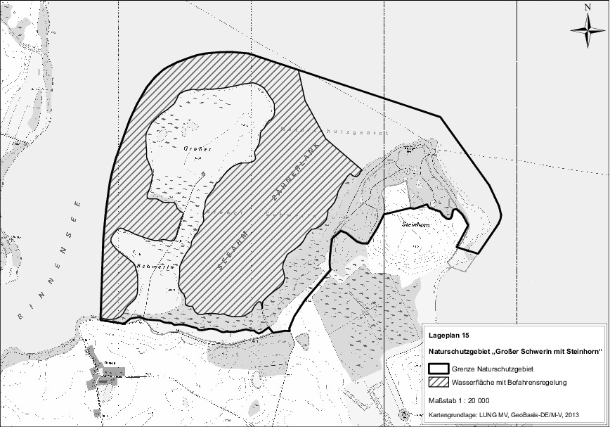
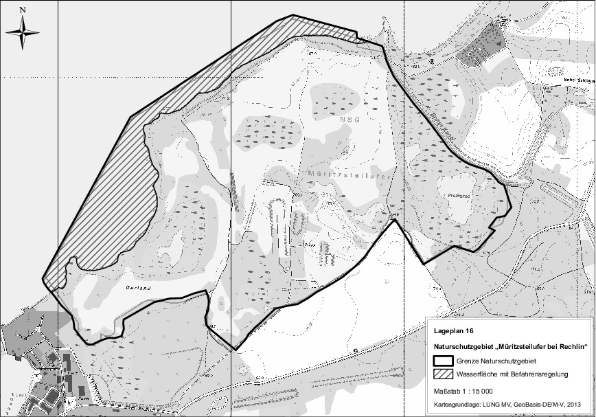
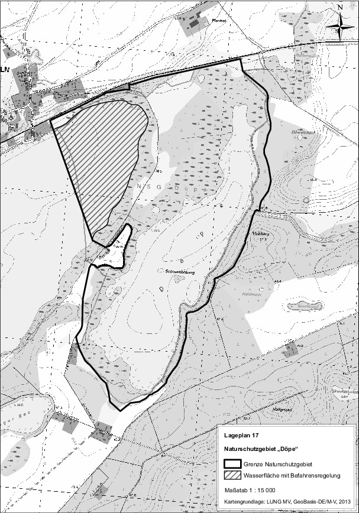
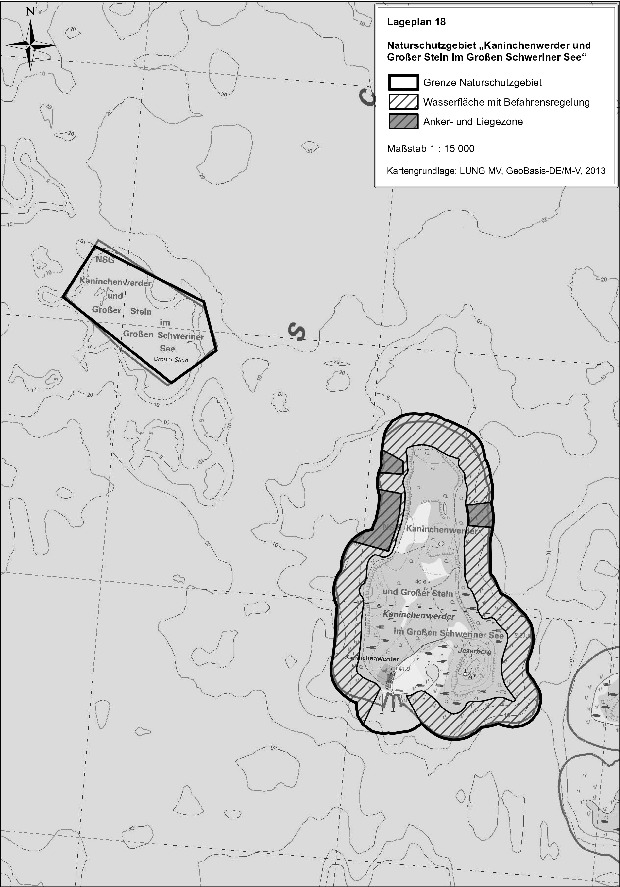
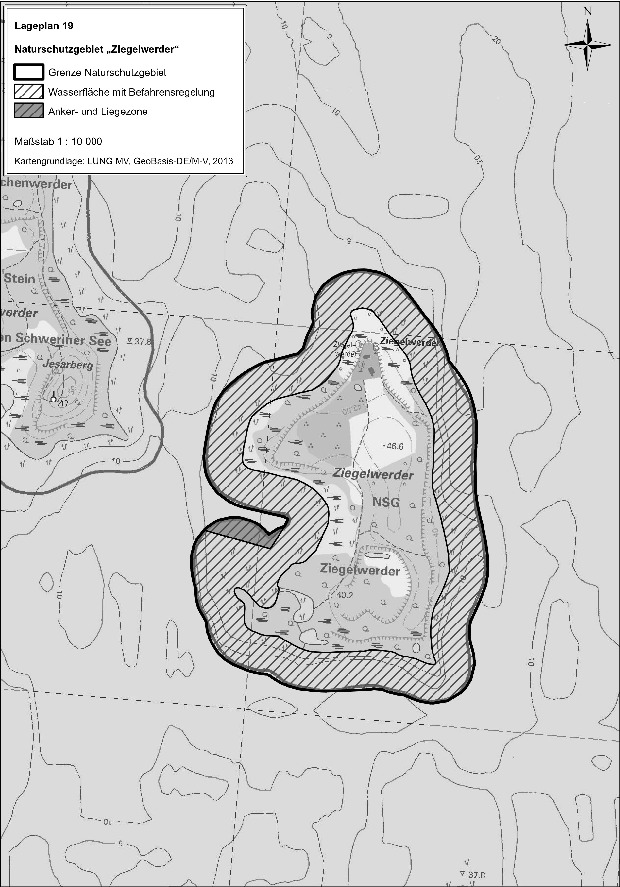

