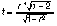

[^f775454_01_BJNR142900011]
Verordnung zum Schutz der Oberflächengewässer
---
Title: ''
jurabk: OGewV
layout: default
origslug: ogewv
slug: ogewv

---

#  (OGewV)

Ausfertigungsdatum
:   2011-07-20

Fundstelle
:   BGBl I: 2011, 1429

[^f775454_01_BJNR142900011]:     Diese Verordnung dient der Umsetzung der
    –                                                         Richtlinie
    2000/60/EG des Europäischen Parlaments und des Rates vom 23. Oktober
    2000 zur Schaffung eines Ordnungsrahmens für Maßnahmen der
    Gemeinschaft im Bereich der Wasserpolitik (ABl. L 327 vom 22.12.2000,
    S. 1), die zuletzt durch die Richtlinie 2009/31/EG (ABl. L 140 vom
    5\.6.2009, S. 114) geändert worden ist,

    –                                                         Richtlinie
    2008/105/EG des Europäischen Parlaments und des Rates vom 16. Dezember
    2008 über Umweltqualitätsnormen im Bereich der Wasserpolitik und zur
    Änderung und anschließenden Aufhebung der Richtlinien des Rates
    82/176/EWG, 83/513/EWG, 84/156/EWG, 84/491/EWG und 86/280/EWG sowie
    zur Änderung der Richtlinie 2000/60/EG (ABl. L 348 vom 24.12.2008, S.
    84),

    –                                                         Richtlinie
    2009/90/EG der Kommission vom 31. Juli 2009 zur Festlegung technischer
    Spezifikationen für die chemische Analyse und die Überwachung des
    Gewässerzustands gemäß der Richtlinie 2000/60/EG des Europäischen
    Parlaments und des Rates (ABl. L 201 vom 1.8.2009, S. 36),

    –                                                         Entscheidung
    2008/915/EG der Kommission vom 30. Oktober 2008 zur Festlegung der
    Werte für die Einstufungen des Überwachungssystems des jeweiligen
    Mitgliedstaats als Ergebnis der Interkalibrierung gemäß der Richtlinie
    2000/60/EG des Europäischen Parlaments und des Rates (ABl. L 332 vom
    10\.12.2008, S. 20).

## Eingangsformel

Auf Grund des § 23 Absatz 1 Nummer 1 bis 3 und 8 bis 12 des
Wasserhaushaltsgesetzes vom 31. Juli 2009 (BGBl. I S. 2585), Absatz 1
geändert durch Artikel 12 Nummer 0a des Gesetzes vom 11. August 2010
(BGBl. I S. 1163), in Verbindung mit § 23 Absatz 2 des
Wasserhaushaltsgesetzes verordnet die Bundesregierung nach Anhörung
der beteiligten Kreise:

## § 1 Zweck

Diese Verordnung dient dem Schutz der Oberflächengewässer und der
wirtschaftlichen Analyse der Nutzungen ihres Wassers.

## § 2 Begriffsbestimmungen

Für diese Verordnung gelten folgende Begriffsbestimmungen:

1.  Oberflächengewässer
    Oberirdische Gewässer nach § 3 Nummer 1 des Wasserhaushaltsgesetzes,
    einschließlich der Übergangsgewässer nach Nummer 2 sowie
    Küstengewässer nach § 7 Absatz 5 Satz 2 des Wasserhaushaltsgesetzes;
    bei Anforderungen an den chemischen Zustand von Küstengewässern gilt
    die Begriffsbestimmung des § 3 Nummer 2 des Wasserhaushaltsgesetzes;

2.  Übergangsgewässer
    Die Oberflächenwasserkörper in der Nähe von Flussmündungen, die auf
    Grund ihrer Nähe zu den Küstengewässern einen gewissen Salzgehalt
    aufweisen, aber im Wesentlichen von Süßwasserströmungen beeinflusst
    werden;

3.  Umweltqualitätsnorm (UQN)
    Die Konzentration eines bestimmten Schadstoffs oder einer bestimmten
    Schadstoffgruppe, die in Wasser, Sedimenten oder Biota aus Gründen des
    Gesundheits- und Umweltschutzes nicht überschritten werden darf;

4.  Prioritäre Stoffe
    Stoffe, die in Anlage 7 Tabelle 1 aufgeführt sind;

5.  Bestimmte andere Schadstoffe
    Stoffe, die in Anlage 7 Tabelle 2 aufgeführt sind;

6.  Flussgebietsspezifische Schadstoffe
    Spezifische synthetische und spezifische nichtsynthetische
    Schadstoffe, die in Anlage 5 aufgeführt sind;

7.  Natürliche Hintergrundkonzentration
    Konzentration eines Stoffes in einem Oberflächenwasserkörper, die
    nicht oder nur sehr gering durch menschliche Tätigkeiten beeinflusst
    ist.

## § 3 Lage, Grenzen und Zuordnung der Oberflächenwasserkörper; typspezifische Referenzbedingungen

Nach Maßgabe der Anlage 1 werden folgende Bestimmungen, die auf Grund
landesrechtlicher Vorschriften vor dem 26. Juli 2011 vorgenommen
worden sind, durch die zuständige Behörde zum 22. Dezember 2013
überprüft und gegebenenfalls aktualisiert:

1.  die Festlegung von Lage und Grenzen der Oberflächenwasserkörper,

2.  die Einteilung von Oberflächenwasserkörpern innerhalb einer
    Flussgebietseinheit in Kategorien,

3.  die Unterscheidung der Kategorien von Oberflächenwasserkörpern nach
    Typen,

4.  die Einstufung von Oberflächenwasserkörpern als künstlich oder als
    erheblich verändert und

5.  die Festlegung von typspezifischen Referenzbedingungen.

Die Bestimmungen werden danach alle sechs Jahre überprüft und
gegebenenfalls aktualisiert.

## § 4 Zusammenstellung der Gewässerbelastungen und Beurteilung ihrer Auswirkungen; Bestandsaufnahme der Emissionen, Einleitungen und Verluste

(1) Nach Maßgabe der Anlage 2 werden

1.  die Zusammenstellungen von Daten zu Art und Ausmaß der durch
    menschliche Tätigkeit verursachten (anthropogenen) signifikanten
    Belastungen der Oberflächenwasserkörper,

2.  die Beurteilungen auf Grund der Zusammenstellungen nach Nummer 1, wie
    empfindlich die Oberflächenwasserkörper auf die Belastungen reagieren,
    und

3.  die Ermittlungen und Beschreibungen von Oberflächenwasserkörpern, die
    die für die Gewässer festgelegten Bewirtschaftungsziele nach den §§ 27
    und 44 des Wasserhaushaltsgesetzes nicht erreichen,

die auf Grund landesrechtlicher Vorschriften vor dem 26. Juli 2011
vorgenommen worden sind, durch die zuständige Behörde zum 22. Dezember
2013 überprüft und gegebenenfalls aktualisiert. Danach erfolgt alle
sechs Jahre eine Überprüfung und gegebenenfalls eine Aktualisierung.

(2) Für jede Flussgebietseinheit erstellen die zuständigen Behörden
zum 22. Dezember 2013 eine Bestandsaufnahme der Emissionen,
Einleitungen und Verluste aller prioritären Stoffe und bestimmter
anderer Schadstoffe einschließlich der Konzentrationen der in § 11
Absatz 1 genannten Stoffe in Biota, Schwebstoffen oder Sedimenten. Die
Bestandsaufnahme wird auf der Grundlage folgender Informationen und
Bestimmungen erstellt:

1.  der Informationen nach Absatz 1,

2.  der Bestimmungen nach § 3,

3.  der im Rahmen der Überwachung nach § 9 gewonnenen Informationen,

4.  der Informationen nach § 2 Absatz 2 des Gesetzes zur Ausführung des
    Protokolls über Schadstofffreisetzungs- und -verbringungsregister vom
    21\. Mai 2003 sowie zur Durchführung der Verordnung (EG) Nr. 166/2006
    vom 6. Juni 2007 (BGBl. I S. 1002) sowie

5.  anderer verfügbarer Daten und Karten.

(3) Der Referenzzeitraum für die in der Bestandsaufnahme nach Absatz 2
zu erfassenden Werte ist das Jahr 2010. Für prioritäre Stoffe oder
bestimmte andere Schadstoffe, die jeweils Wirkstoffe im Sinne des § 2
Nummer 9a des Pflanzenschutzgesetzes sind, kann auch der
Durchschnittswert der Jahre 2008, 2009 und 2010 verwendet werden.

(4) Die zuständige Behörde aktualisiert die Bestandsaufnahme nach
Absatz 2 im Rahmen der Überprüfungen nach Absatz 1. Der
Referenzzeitraum für die Erfassung der Werte in den aktualisierten
Bestandsaufnahmen ist das Jahr, vor dem die Aktualisierung
abzuschließen ist. Für prioritäre Stoffe oder bestimmte andere
Schadstoffe, die jeweils Wirkstoffe im Sinne des § 2 Nummer 9a des
Pflanzenschutzgesetzes sind, kann auch der Durchschnittswert der
letzten drei Jahre vor Abschluss der Aktualisierung verwendet werden.

(5) Die aktualisierten Bestandsaufnahmen und Karten sind in die
aktualisierten Bewirtschaftungspläne nach § 84 Absatz 1 des
Wasserhaushaltsgesetzes aufzunehmen.

## § 5 Einstufung des ökologischen Zustands und des ökologischen Potenzials

(1) Die Einstufung des ökologischen Zustands eines
Oberflächenwasserkörpers richtet sich nach den in Anlage 3
aufgeführten Qualitätskomponenten. Die zuständige Behörde stuft den
ökologischen Zustand eines Oberflächenwasserkörpers nach Maßgabe der
Tabellen 1 bis 5 der Anlage 4 in die Klassen sehr guter, guter,
mäßiger, unbefriedigender oder schlechter Zustand ein.

(2) Die Einstufung des ökologischen Potenzials eines künstlichen oder
erheblich veränderten Oberflächenwasserkörpers richtet sich nach den
in Anlage 3 aufgeführten Qualitätskomponenten, die für diejenige
Gewässerkategorie nach Anlage 1 Nummer 1 gelten, die dem betreffenden
Wasserkörper am ähnlichsten ist. Die zuständige Behörde stuft das
ökologische Potenzial nach Maßgabe der Tabellen 1 und 6 der Anlage 4
in die Klassen höchstes, gutes, mäßiges, unbefriedigendes oder
schlechtes Potenzial ein.

(3) Bei der Einstufung nach Absatz 1 oder Absatz 2 sind die Werte zu
verwenden, die im Anhang der Entscheidung 2008/915/EG der Kommission
vom 30. Oktober 2008 zur Festlegung der Werte für die Einstufung des
Überwachungssystems des jeweiligen Mitgliedstaats als Ergebnis der
Interkalibrierung gemäß der Richtlinie 2000/60/EG des Europäischen
Parlaments und des Rates (ABl. L 332 vom 10.12.2008, S. 20) im
Hinblick auf die dort bezeichneten Qualitätskomponenten für
Deutschland aufgeführt sind.

(4) Maßgebend für die Einstufung des ökologischen Zustands oder des
ökologischen Potenzials ist die jeweils schlechteste Bewertung einer
der biologischen Qualitätskomponenten nach Anlage 3 Nummer 1 in
Verbindung mit Anlage 4. Wird eine Umweltqualitätsnorm oder werden
mehrere Umweltqualitätsnormen nach Anlage 3 Nummer 3.1 in Verbindung
mit Anlage 5 nicht eingehalten, ist der ökologische Zustand oder das
ökologische Potenzial höchstens als mäßig einzustufen. Bei der
Bewertung der biologischen Qualitätskomponenten sind die
hydromorphologischen Qualitätskomponenten nach Anlage 3 Nummer 2 sowie
die entsprechenden allgemeinen physikalisch-chemischen
Qualitätskomponenten nach Anlage 3 Nummer 3.2 in Verbindung mit Anlage
6 zur Einstufung unterstützend heranzuziehen.

## § 6 Einstufung des chemischen Zustands

Die Einstufung des chemischen Zustands eines Oberflächenwasserkörpers
richtet sich nach den in Anlage 7 aufgeführten Umweltqualitätsnormen.
Erfüllt der Oberflächenwasserkörper diese Umweltqualitätsnormen, stuft
die zuständige Behörde den chemischen Zustand als gut ein. Andernfalls
ist der chemische Zustand als nicht gut einzustufen.

## § 7 Oberflächenwasserkörper, die der Trinkwassergewinnung dienen

(1) Unabhängig von den Bestimmungen der §§ 5 und 6 sind die
Oberflächenwasserkörper, die für die Trinkwassergewinnung genutzt
werden, mit dem Ziel zu bewirtschaften, eine Verschlechterung ihrer
Qualität zu verhindern und so den für die Gewinnung von Trinkwasser
erforderlichen Umfang der Aufbereitung zu verringern.

(2) Die zuständige Behörde kennzeichnet die Oberflächenwasserkörper,
die der Trinkwassergewinnung dienen, auf den Karten nach den Nummern 1
und 2 in Verbindung mit Nummer 3.1 der Anlage 10.

## § 8 Anforderungen an die Beurteilung der Überwachungsergebnisse, an Analysenmethoden und an Laboratorien

(1) Die zuständige Behörde überprüft die Einhaltung der
Umweltqualitätsnormen nach Maßgabe von Anlage 8 Nummer 3. Die hierbei
anzuwendenden Analysenmethoden müssen die Anforderungen nach Anlage 8
Nummer 1 erfüllen.

(2) Laboratorien, die an der Überwachung biologischer, chemischer oder
physikalisch-chemischer Qualitätskomponenten mitwirken, haben die
erforderlichen qualitätssichernden Maßnahmen zu ergreifen, um eine
hinreichende Zuverlässigkeit und Genauigkeit der
Überwachungsergebnisse sicherzustellen. Die Laboratorien haben
insbesondere die Anforderungen nach Anlage 8 Nummer 2 zu erfüllen.

## § 9 Überwachung des ökologischen Zustands, des ökologischen Potenzials und des chemischen Zustands; Überwachungsnetz

(1) Die Überwachung der Oberflächenwasserkörper hinsichtlich ihres
ökologischen Zustands oder ihres ökologischen Potenzials, ihres
chemischen Zustands sowie die Überwachung der Oberflächenwasserkörper,
die der Trinkwassergewinnung dienen, richten sich nach Anlage 9. Die
auf Grund landesrechtlicher Vorschriften vor dem 26. Juli 2011
aufgestellten Überwachungsprogramme werden von der zuständigen Behörde
regelmäßig überprüft und gegebenenfalls aktualisiert.

(2) Die zuständige Behörde überwacht die Erfüllung der Anforderungen
an die biologischen Qualitätskomponenten nach Anlage 4 sowie die
Einhaltung der Umweltqualitätsnormen für flussgebietsspezifische
Schadstoffe nach Anlage 5 im Rahmen der überblicksweisen Überwachung
nach Anlage 9 Nummer 1 und, soweit nach Anlage 9 Nummer 2
erforderlich, im Rahmen der operativen Überwachung an für den
Oberflächenwasserkörper repräsentativen Messstellen. Satz 1 gilt
entsprechend für Umweltqualitätsnormen zur Beurteilung des chemischen
Zustands nach Anlage 7.

(3) Das Netz zur Überwachung des ökologischen und des chemischen
Zustands sowie des ökologischen Potenzials ist im Bewirtschaftungsplan
auf Karten darzustellen.

## § 10 Darstellung des ökologischen Zustands, des ökologischen Potenzials und des chemischen Zustands

(1) Die zuständige Behörde stellt den ökologischen Zustand oder das
ökologische Potenzial eines Oberflächenwasserkörpers auf einer
gesonderten Karte nach Maßgabe von Anlage 10 Nummer 1 dar. Der
chemische Zustand ist auf einer gesonderten Karte nach Maßgabe von
Anlage 10 Nummer 2 darzustellen. Wird der ökologische Zustand oder das
ökologische Potenzial eines Oberflächenwasserkörpers schlechter als
gut eingestuft, sind die für die Einstufung maßgebenden biologischen
Qualitätskomponenten und flussgebietsspezifischen Schadstoffe nach
Maßgabe von Anlage 10 Nummer 1.3 und 1.4 zu kennzeichnen. Wird der
chemische Zustand als nicht gut eingestuft, sind die maßgebenden
Stoffe nach Maßgabe von Anlage 10 Nummer 2 zu kennzeichnen.

(2) Die zuständige Behörde kennzeichnet nach Maßgabe von Anlage 10
Nummer 3.2 Oberflächenwasserkörper, bei denen die Einhaltung der
Umweltqualitätsnormen von Schadstoffen unter Berücksichtigung der
natürlichen Hintergrundkonzentrationen festgestellt wurde.

## § 11 Ermittlung langfristiger Trends

(1) Im Rahmen der Überwachung nach § 9 ermittelt die zuständige
Behörde nach Maßgabe von Anlage 11 Nummer 1 bis 4 den langfristigen
Trend der Konzentrationen derjenigen in Anlage 7 aufgeführten
Schadstoffe, die dazu neigen, sich in Biota, Schwebstoffen oder
Sedimenten anzusammeln. Dies betrifft insbesondere die Schadstoffe der
Nummern 2, 5, 6, 7, 12, 15, 16, 17, 18, 20, 21, 26, 28 und 30 der
Tabelle 1 in Anlage 7. Diese Schadstoffe sind im Regelfall mindestens
alle drei Jahre in Biota, Schwebstoffen oder Sedimenten zu überwachen,
es sei denn, die zuständige Behörde legt auf Grund des aktuellen
Wissensstands ein anderes Intervall fest.

(2) Im Rahmen der Aktualisierung des Maßnahmenprogramms nach § 84
Absatz 1 des Wasserhaushaltsgesetzes sind Maßnahmen vorzusehen, mit
denen sichergestellt wird, dass die in Absatz 1 genannten
Konzentrationen in den betreffenden Biota, Schwebstoffen oder
Sedimenten nicht signifikant ansteigen. Ein signifikanter Anstieg
liegt vor, wenn die Voraussetzungen nach Anlage 11 Nummer 5 erfüllt
sind.

## § 12 Wirtschaftliche Analyse der Wassernutzungen

(1) Bis zum 22. Dezember 2013 und danach alle sechs Jahre sind die vor
dem 26. Juli 2011 durchgeführten wirtschaftlichen Analysen der
Wassernutzungen nach Artikel 5 Absatz 1 dritter Gedankenstrich der
Richtlinie 2000/60/EG des Europäischen Parlaments und des Rates vom
23\. Oktober 2000 zur Schaffung eines Ordnungsrahmens für Maßnahmen der
Gemeinschaft im Bereich der Wasserpolitik (ABl. L 327 vom 22.12.2000,
S. 1), die zuletzt durch die Richtlinie
2009/31/EG              (ABl. L 140 vom 5.6.2009, S. 114) geändert
worden ist, die signifikante Auswirkungen auf den Zustand der
Oberflächengewässer haben, zu überprüfen und, soweit erforderlich, zu
aktualisieren.

(2) Die wirtschaftliche Analyse muss die erforderlichen Informationen
enthalten, damit

1.  Berechnungen durchgeführt werden können, um dem Grundsatz der Deckung
    der Kosten der Wasserdienstleistungen nach Artikel 9 der Richtlinie
    2000/60/EG unter Berücksichtigung der langfristigen Voraussagen für
    das Angebot und die Nachfrage von Wasser in der Flussgebietseinheit
    Rechnung zu tragen, und

2.  die in Bezug auf die Wassernutzung kosteneffizientesten
    Maßnahmenkombinationen für das Maßnahmenprogramm beurteilt werden
    können.

(3) Bei unverhältnismäßigem Aufwand, insbesondere unter
Berücksichtigung der Kosten für die Erhebung der betreffenden Daten,
können dabei auch Schätzungen der Menge, der Preise und der Kosten im
Zusammenhang mit den Wasserdienstleistungen, Schätzungen der
einschlägigen Investitionen einschließlich der entsprechenden
Vorausplanungen sowie Schätzungen der potenziellen Kosten der
Maßnahmen für das Maßnahmenprogramm zugrunde gelegt werden.

## § 13 Inkrafttreten

Diese Verordnung tritt am 26. Juli 2011 in Kraft.

## Schlussformel

Der Bundesrat hat zugestimmt.

(zu § 3 Satz 1)

## Anlage 1 Lage, Grenzen und Zuordnung der Oberflächenwasserkörper; typspezifische Referenzbedingungen

(Fundstelle: BGBl. I 2011, 1433 - 1435)

Die Oberflächenwasserkörper innerhalb einer Flussgebietseinheit sind
nach Maßgabe der Nummer 1 in Kategorien einzuteilen und ihre Lage und
Grenzen sind festzulegen. Sie sind in jeder Kategorie nach Maßgabe der
Nummer 2 nach Typen zu unterscheiden. Die Oberflächenwasserkörper, die
für eine Einstufung als künstlich oder erheblich verändert in Betracht
kommen, sind den Typen jener Gewässerkategorie zuzuordnen, der sie am
ähnlichsten sind. Für jeden Gewässertyp sind nach Maßgabe der Nummer 3
die typspezifischen Referenzbedingungen festzulegen, die dem sehr
guten ökologischen Zustand entsprechen. Das höchste ökologische
Potenzial ist im Einzelfall aus den Referenzbedingungen des
Gewässertyps abzuleiten, dem der künstliche oder erheblich veränderte
Oberflächenwasserkörper am ähnlichsten ist.

1.**** Kategorien von Oberflächengewässern ****

    Die Oberflächengewässer sind in folgende Kategorien einzuteilen:

    1.1 Flüsse

    1.2 Seen

    1.3 Übergangsgewässer

    1.4 Küstengewässer

        a)  nach § 7 Absatz 5 Satz 2 des Wasserhaushaltsgesetzes, soweit der
            ökologische Zustand einzustufen ist

        b)  nach § 3 Nummer 2 des Wasserhaushaltsgesetzes, soweit der chemische
            Zustand einzustufen ist

2.**** Gewässertypen ****

    2.1 **Fließgewässertypen**                          (mit einem
        Einzugsgebiet von 10 Quadratkilometer oder größer)

        Die nachfolgenden Größenangaben werden als Größen der Einzugsgebiete
        der jeweiligen Gewässer angegeben. Die Angaben dienen der
        Orientierung:

        a)  klein (10 bis 100 Quadratkilometer)

        b)  mittelgroß (größer als 100 bis 1 000 Quadratkilometer)

        c)  groß (größer als 1 000 bis 10 000 Quadratkilometer)

        d)  sehr groß (größer als 10 000 Quadratkilometer)

        Ökoregion 4
        Alpen, Höhe über 800 Meter

        Typ 1 Fließgewässer der Alpen

            Subtyp 1.1 Bäche der Kalkalpen

            Subtyp 1.2 Kleine Flüsse der Kalkalpen

        Ökoregionen 8 und 9
        Mittelgebirge und Alpenvorland, Höhe 200 bis 800 Meter

        Typ 2 Fließgewässer des Alpenvorlandes

            Subtyp 2.1 Bäche des Alpenvorlandes

            Subtyp 2.2 Kleine Flüsse des Alpenvorlandes

        Typ 3 Fließgewässer der Jungmoräne des Alpenvorlandes

            Subtyp 3.1 Bäche der Jungmoräne des Alpenvorlandes

            Subtyp 3.2 Kleine Flüsse der Jungmoräne des Alpenvorlandes

        Typ 4 Große Flüsse des Alpenvorlandes

        Typ 5 Grobmaterialreiche, silikatische Mittelgebirgsbäche

        Typ 5.1 Feinmaterialreiche, silikatische Mittelgebirgsbäche

        Typ 6 Feinmaterialreiche, karbonatische Mittelgebirgsbäche

            Subtyp 6 K Feinmaterialreiche, karbonatische Mittelgebirgsbäche (Keuper)

        Typ 7 Grobmaterialreiche, karbonatische Mittelgebirgsbäche

        Typ 9 Silikatische, fein- bis grobmaterialreiche Mittelgebirgsflüsse

        Typ 9.1 Karbonatische, fein- bis grobmaterialreiche Mittelgebirgsflüsse

            Subtyp 9.1 K Karbonatische, fein- bis grobmaterialreiche Mittelgebirgsflüsse
                (Keuper)

        Typ 9.2 Große Flüsse des Mittelgebirges

        Typ 10 Kiesgeprägte Ströme

        Ökoregionen 13 und 14
        Norddeutsches Flachland, Höhe unter 200 Meter

        Typ 14 Sandgeprägte Tieflandbäche

        Typ 15 Sand- und lehmgeprägte Tieflandflüsse

            Subtyp 15 g Große sand- und lehmgeprägte Tieflandflüsse

        Typ 16 Kiesgeprägte Tieflandbäche

        Typ 17 Kiesgeprägte Tieflandflüsse

        Typ 18 Lösslehmgeprägte Tieflandbäche

        Typ 20 Sandgeprägte Ströme

        Typ 22 Marschengewässer

            Subtyp 22.1 Gewässer der Marschen

            Subtyp 22.2 Flüsse der Marschen

            Subtyp 22.3 Ströme der Marschen

        Typ 23 Rückstau- bzw. brackwasserbeeinflusste Ostseezuflüsse

        Ökoregionunabhängige Typen

        Typ 11 Organisch geprägte Bäche

        Typ 12 Organisch geprägte Flüsse

        Typ 19 Kleine Niederungsfließgewässer in Fluss- und Stromtälern

        Typ 21 Seeausflussgeprägte Fließgewässer

            Subtyp 21 N Seeausflussgeprägte Fließgewässer des Norddeutschen
                Tieflandes (Nord)

            Subtyp 21 S Seeausflussgeprägte Fließgewässer des Alpenvorlandes (Süd)

    2.2 **Seentypen**                          (mit einer Oberfläche von 0,5
        Quadratkilometer oder größer)

        Ökoregionen 4 und 9
        Alpen und Alpenvorland

        Typ 1[^f775454_02_BJNR142900011BJNE001700000]
 Voralpensee: kalkreich
[^f775454_03_BJNR142900011BJNE001700000]
            , relativ großes Einzugsgebiet
            , ungeschichtet

        Typ 2[^f775454_04_BJNR142900011BJNE001700000]
 Voralpensee: kalkreich, relativ großes Einzugsgebiet, geschichtet

        Typ 3 Voralpensee: kalkreich, relativ kleines Einzugsgebiet, geschichtet

        Typ 4 Alpensee: kalkreich, relativ kleines oder großes Einzugsgebiet,
            geschichtet

        Ökoregionen 8 und 9
        Mittelgebirge

        Typ 5 Mittelgebirgsregion: kalkreich, relativ großes Einzugsgebiet,
            geschichtet

        Typ 6 Mittelgebirgsregion: kalkreich, relativ großes Einzugsgebiet,
            ungeschichtet

            Subtyp 6.1 Phytoplanktontyp, kalkreich

            Subtyp 6.2 Phytoplanktontyp, kalkarm

        Typ 7 Mittelgebirgsregion: kalkreich, relativ kleines Einzugsgebiet,
            geschichtet

        Typ 8 Mittelgebirgsregion: kalkarm, relativ großes Einzugsgebiet,
            geschichtet

        Typ 9 Mittelgebirgsregion: kalkarm, relativ kleines Einzugsgebiet,
            geschichtet

        Ökoregionen 13 und 14
        Norddeutsches Flachland

        Typ 10 Tieflandregion: kalkreich, relativ großes Einzugsgebiet, geschichtet

            Subtyp 10.1 Phytoplanktontyp, relativ großes Einzugsgebiet, Verweilzeit 1 bis 10
                Jahre

            Subtyp 10.2 Phytoplanktontyp, sehr großes Einzugsgebiet, Verweilzeit bis 1 Jahr

        Typ 11 Tieflandregion: kalkreich, relativ großes Einzugsgebiet,
            ungeschichtet, Verweilzeit länger als 30 Tage

            Subtyp 11.1 Phytoplanktontyp, Verweilzeit 1 bis 10 Jahre

            Subtyp 11.2 Phytoplanktontyp, Verweilzeit bis 1 Jahr, sehr flach, mittlere Tiefe
                bis 3 Meter

        Typ 12 Tieflandregion: kalkreich, relativ großes Einzugsgebiet,
            ungeschichtet,
            Verweilzeit länger als 30 Tage

        Typ 13 Tieflandregion: kalkreich, relativ kleines Einzugsgebiet, geschichtet

        Typ 14 Tieflandregion: kalkreich, relativ kleines Einzugsgebiet,
            ungeschichtet

        Sondertypen (alle Ökoregionen)

        Typ S1 natürliche Seen, z. B. Moorseen, Strandseen

        Typ S2 Sondertyp künstlicher Seen, z. B. Abgrabungsseen (Baggerseen,
            Tagebaurestseen)

    2.3 **Übergangsgewässertypen (Ästuare mit einem Einzugsgebiet von 10
        Quadratkilometer oder größer)**

        Typ T1 Übergangsgewässer Elbe-Weser-Ems

        Typ T2 Übergangsgewässer Eider

    2.4 **Küstengewässer**

        Typen der Küstengewässer der Nordsee

        Typ N1 euhalines offenes Küstengewässer

        Typ N2 euhalines Wattenmeer

        Typ N3 polyhalines offenes Küstengewässer

        Typ N4 polyhalines Wattenmeer

        Typ N5 euhalines felsgeprägtes Küstengewässer um Helgoland

        Typen der Küstengewässer der Ostsee

        Typ B1 oligohalines inneres Küstengewässer

        Typ B2 mesohalines inneres Küstengewässer

        Typ B3 mesohalines offenes Küstengewässer

        Typ B4 meso-polyhalines offenes Küstengewässer, saisonal geschichtet

3.**** Festlegung von Referenzbedingungen für Typen von
    Oberflächenwasserkörpern ****

    3.1 Für jeden Typ von Oberflächenwasserkörpern nach Nummer 2 sind
        typspezifische hydromorphologische und physikalisch-chemische
        Bedingungen festzulegen, die denjenigen hydromorphologischen und
        physikalisch-chemischen Qualitätskomponenten entsprechen, die in
        Anlage 3 Nummer 2 und 3 für diesen Typ von Oberflächenwasserkörper für
        den sehr guten ökologischen Zustand gemäß der entsprechenden Tabelle
        in Anlage 4 angegeben sind. Außerdem sind typspezifische biologische
        Referenzbedingungen festzulegen, die die biologischen
        Qualitätskomponenten abbilden, die in Anlage 3 Nummer 1 für diesen Typ
        von Oberflächenwasserkörper bei sehr gutem ökologischen Zustand gemäß
        der entsprechenden Tabelle in Anlage 4 angegeben sind.

    3.2 Werden die in diesem Abschnitt beschriebenen Verfahren auf künstliche
        oder erheblich veränderte Oberflächenwasserkörper angewendet, sind
        Bezugnahmen auf den sehr guten ökologischen Zustand als Bezugnahmen
        auf das höchste ökologische Potenzial gemäß Anlage 4 Tabelle 6 zu
        verstehen. Die Werte für das höchste ökologische Potenzial eines
        Oberflächenwasserkörpers sind alle sechs Jahre zu überprüfen.

    3.3 Die typspezifischen Referenzbedingungen nach den Nummern 3.1 und 3.2
        sollen entweder raumbezogen oder modellbasiert sein oder durch
        Kombination beider Verfahren abgeleitet werden. Bei der Definition des
        sehr guten ökologischen Zustands im Hinblick auf die Konzentration
        bestimmter synthetischer Schadstoffe gelten als Nachweisgrenze die
        Werte, die mit den besten Techniken ermittelt werden können, die zum
        Zeitpunkt der Festlegung der Referenzbedingungen verfügbar sind.

    3.4 Für raumbezogene typspezifische biologische Referenzbedingungen ist
        ein Bezugsnetz für jeden Typ von Oberflächenwasserkörper zu
        entwickeln. Das Netz muss eine ausreichende Anzahl von Stellen mit
        sehr gutem Zustand umfassen.

    3.5 Modellbasierte typspezifische biologische Referenzbedingungen können
        entweder aus Vorhersagemodellen oder durch Rückberechnungsverfahren
        abgeleitet werden. Für die Verfahren sind historische, paläologische
        und andere verfügbare Daten zu verwenden. Die Werte für die
        Referenzbedingungen müssen hinreichend zuverlässig sein.

    3.6 Ist es auf Grund eines hohen Maßes an natürlicher Veränderlichkeit
        einer Qualitätskomponente nicht möglich, zuverlässige typspezifische
        Referenzbedingungen für diese Komponente eines
        Oberflächenwasserkörpers festzulegen, kann diese Komponente von der
        Beurteilung des ökologischen Zustands dieses Typs von
        Oberflächengewässer ausgenommen werden. In diesem Fall sind die Gründe
        hierfür im Bewirtschaftungsplan für die Einzugsgebiete anzugeben.

[^f775454_02_BJNR142900011BJNE001700000]:     **              15 mg/l.
[^f775454_03_BJNR142900011BJNE001700000]:     *              1,5 m                            2             /m
    3*              1,5 m                            2             /m
    3             .
    Ein See wird als geschichtet eingeordnet, wenn die thermische
    Schichtung an der tiefsten Stelle des Sees über mindestens 3 Monate
    stabil bleibt.
[^f775454_04_BJNR142900011BJNE001700000]: 
(zu § 4 Absatz 1)

## Anlage 2 Zusammenstellung der Gewässerbelastungen und Beurteilung ihrer Auswirkungen

(Fundstelle: BGBl. I 2011, 1436)

**1.** **Umfang der Datenzusammenstellung**

    Die Zusammenstellung von Daten zur Art und zum Ausmaß der
    signifikanten anthropogenen Belastungen der Oberflächenwasserkörper
    umfasst insbesondere folgende Angaben:

    1.1 Signifikante Punktquellen und diffuse Quellen

        Einschätzung und Zusammenstellung der von kommunalen, industriellen,
        landwirtschaftlichen und anderen Anlagen und Tätigkeiten ausgehenden
        signifikanten Verschmutzungen durch Punktquellen oder durch diffuse
        Quellen, vor allem in Bezug auf folgende Stoffe:

        a)  Organische Halogenverbindungen und Stoffe, die im Wasser derartige
            Verbindungen bilden können

        b)  Organische Phosphorverbindungen

        c)  Organische Zinnverbindungen

        d)  Stoffe und Zubereitungen oder ihre Abbauprodukte, von denen erwiesen
            ist, dass sie im oder durch das Wasser

            aa) karzinogene oder mutagene Eigenschaften haben oder

            bb) Eigenschaften haben, die steroidogene, thyreoide, reproduktive oder
                andere Funktionen des endokrinen Systems beeinträchtigen

        e)  Persistente Kohlenwasserstoffe sowie persistente und bioakkumulierende
            organische toxische Stoffe

        f)  Zyanide

        g)  Metalle und Metallverbindungen

        h)  Arsen und Arsenverbindungen

        i)  Biozid- und Pflanzenschutzmittelwirkstoffe

        j)  Schwebstoffe

        k)  Stoffe, die zur Eutrophierung beitragen, insbesondere Nitrate und
            Phosphate

        l)  Stoffe mit nachhaltigem Einfluss auf die Sauerstoffbilanz, die anhand
            von Parametern wie Biochemischer Sauerstoffbedarf (BSB), Chemischer
            Sauerstoffbedarf (CSB) oder gesamter organisch gebundener Kohlenstoff
            (TOC) gemessen werden können.

    1.2 Einschätzung und Zusammenstellung signifikanter Wasserentnahmen für
        kommunale, industrielle, landwirtschaftliche und andere Zwecke,
        einschließlich saisonaler Schwankungen, des jährlichen Gesamtbedarfs
        und der Wasserverluste in Versorgungssystemen

    1.3 Einschätzung und Zusammenstellung signifikanter Abflussregulierungen,
        einschließlich der Wasserüber- und -umleitungen, im Hinblick auf die
        Fließeigenschaften und die Wasserbilanzen

    1.4 Zusammenstellung signifikanter morphologischer Veränderungen

    1.5 Einschätzung und Zusammenstellung anderer signifikanter anthropogener
        Belastungen der Gewässer

    1.6 Einschätzung von Bodennutzungsstrukturen, einschließlich der größten
        städtischen, industriellen und landwirtschaftlichen Gebiete,
        Fischereigebiete und Wälder.

**2.** **Beurteilung der Auswirkungen**

    Es ist zu beurteilen, bei welchen Oberflächenwasserkörpern auf Grund
    der in Nummer 1 zusammengestellten Belastungen das Risiko besteht,
    dass sie die Bewirtschaftungsziele nach Maßgabe der §§ 27 bis 31 des
    Wasserhaushaltsgesetzes nicht erreichen, die für sie festgelegt worden
    sind. Dieser Beurteilung sind die nach Nummer 1 gesammelten Daten
    sowie andere einschlägige Informationen einschließlich vorhandener
    Daten aus der Umweltüberwachung zugrunde zu legen. Die Beurteilung
    kann durch Modellierungstechniken unterstützt werden. Für
    Oberflächenwasserkörper nach Satz 1 ist, soweit erforderlich, eine
    zusätzliche Beschreibung vorzunehmen, um die Überwachungsprogramme
    nach Anlage 9 und die Maßnahmenprogramme nach § 82 des
    Wasserhaushaltsgesetzes weiterzuentwickeln.

(zu § 5 Absatz 1 Satz 1, Absatz 2 Satz 1, Absatz 4)

## Anlage 3 Qualitätskomponenten zur Einstufung des ökologischen Zustands und des ökologischen Potenzials

(Fundstelle: BGBl. I 2011, 1437 - 1438)

**1.** **Biologische Qualitätskomponenten**

    Die biologischen Qualitätskomponenten umfassen die aquatische Flora,
    die Wirbellosenfauna und die Fischfauna nach Maßgabe der nachstehenden
    Tabelle
    (F = Flüsse, S = Seen, Ü = Übergangsgewässer, K = Küstengewässer):

    *        *   Qualitäts-
            komponentengruppe

        *   Qualitätskomponente

        *   Parameter

        *   Kategorie

    *        *   F

        *   S

        *   Ü

        *   K

    *        *   Gewässerflora

        *   Phytoplankton

        *   Artenzusammensetzung, Biomasse

        *[^f775454_05_BJNR142900011BJNE001900000]
   X

        *   X

        *   X

        *   X

    *        *   Großalgen oder Angiospermen

        *   Artenzusammensetzung,
            Artenhäufigkeit

        *
        *
        *[^f775454_06_BJNR142900011BJNE001900000]
   X

        *   X

    *        *   Makrophyten/Phytobenthos

        *   Artenzusammensetzung,
            Artenhäufigkeit

        *   X

        *   X

        *   X

        *   X

    *        *   Gewässerfauna

        *   Benthische wirbellose Fauna

        *   Artenzusammensetzung,
            Artenhäufigkeit,

        *   X

        *   X

        *   X

        *   X

    *        *   Fischfauna

        *   Artenzusammensetzung,
            Artenhäufigkeit, Altersstruktur

        *   X

        *   X

        *[^f775454_07_BJNR142900011BJNE001900000]
   X

        *

**2.** **Hydromorphologische Qualitätskomponenten**

    Die hydromorphologischen Qualitätskomponenten ergeben sich aus der
    nachstehenden Tabelle
    (F = Flüsse, S = Seen, Ü = Übergangsgewässer, K = Küstengewässer):

    *        *   Qualitäts-
            komponentengruppe

        *   Parameter

        *   Kategorie

    *        *   F

        *   S

        *   Ü

        *   K

    *        *   Wasserhaushalt

        *   Abfluss und Abflussdynamik

        *   X

        *
        *
        *

    *        *   Verbindung zu Grundwasserkörpern

        *   X

        *   X

        *
        *

    *        *   Wasserstandsdynamik

        *
        *   X

        *
        *

    *        *   Wassererneuerungszeit

        *
        *   X

        *
        *

    *        *   Durchgängigkeit

        *
        *   X

        *
        *
        *

    *        *   Morphologie

        *   Tiefen- und Breitenvariation

        *   X

        *
        *
        *

    *        *   Tiefenvariation

        *
        *   X

        *   X

        *   X

    *        *   Struktur und Substrat des Bodens

        *   X

        *
        *
        *   X

    *        *   Menge, Struktur und Substrat des Bodens

        *
        *   X

        *   X

        *

    *        *   Struktur der Uferzone

        *   X

        *   X

        *
        *

    *        *   Struktur der Gezeitenzone

        *
        *
        *   X

        *   X

    *        *   Tidenregime

        *   Süßwasserzustrom

        *
        *
        *   X

        *

    *        *   Seegangsbelastung

        *
        *
        *   X

        *   X

    *        *   Richtung vorherrschender Strömungen

        *
        *
        *
        *   X

**3.** **Chemische und allgemeine physikalisch-chemische
    Qualitätskomponenten**

    Die chemischen und allgemeinen physikalisch-chemischen
    Qualitätskomponenten ergeben sich aus den nachstehenden Tabellen
    (F = Flüsse, S = Seen, Ü = Übergangsgewässer, K = Küstengewässer):

    3.1 Chemische Qualitätskomponenten

        *            *   Qualitäts-
                komponentengruppe

            *   Qualitätskomponente

            *   Parameter

            *   Kategorie

        *            *   F

            *   S

            *   Ü

            *   K

        *            *   Flussgebiets-
                spezifische
                Schadstoffe

            *   synthetische und nicht-
                synthetische Schadstoffe
                (bei Eintrag in signifikanten Mengen) in Wasser, Sedimenten,
                Schwebstoffen oder Biota

            *   Schadstoffe nach Anlage 5

            *   X

            *   X

            *   X

            *   X

    3.2 Allgemeine physikalisch-chemische Qualitätskomponenten

        *            *   Qualitäts-
                komponentengruppe

            *   Qualitätskomponente

            *   Mögliche Parameter

            *   F

            *   S

            *   Ü

            *   K

        *            *   Allgemeine
                physikalisch-
                chemische
                Komponenten

            *   Sichttiefe

            *   Sichttiefe

            *
            *   X

            *   X

            *   X

        *            *   Temperaturverhältnisse

            *   Wassertemperatur

            *   X

            *   X

            *   X

            *   X

        *            *   Sauerstoffhaushalt

            *   Sauerstoffgehalt

            *   X

            *   X

            *   X

            *   X

        *            *   Sauerstoffsättigung

            *   X

            *   X

            *   X

            *   X

        *            *   TOC

            *   X

            *
            *
            *

        *            *   BSB

            *   X

            *
            *
            *

        *            *   Salzgehalt

            *   Chlorid

            *   X

            *   X

            *   X

            *   X

        *            *   Leitfähigkeit bei 25°C

            *   X

            *
            *   X

            *   X

        *            *   Sulfat

            *   X

            *
            *
            *

        *            *   Salinität

            *
            *
            *   X

            *   X

        *            *   Versauerungszustand

            *   pH-Wert

            *   X

            *   X

            *
            *

        *            *   Säurekapazität Ks
                (bei versauerungsgefährdeten
                Gewässern)

            *   X

            *   X

            *
            *

        *            *   Nährstoffverhältnisse

            *   Gesamtphosphor

            *   X

            *   X

            *   X

            *   X

        *            *   ortho-Phosphat-Phosphor

            *   X

            *   X

            *   X

            *   X

        *            *   Gesamtstickstoff

            *   X

            *   X

            *   X

            *   X

        *            *   Nitrat-Stickstoff

            *   X

            *   X

            *   X

            *   X

        *            *   Ammonium-Stickstoff

            *   X

            *   X

            *   X

            *   X

    Bei planktondominierten Fließgewässern zu bestimmen.
[^f775454_05_BJNR142900011BJNE001900000]:     Zusätzlich zu Phytoplankton ist die jeweils geeignete Teilkomponente
    zu bestimmen.
[^f775454_06_BJNR142900011BJNE001900000]:     Altersstruktur fakultativ.
[^f775454_07_BJNR142900011BJNE001900000]: 
(zu § 5 Absatz 1 Satz 2, Absatz 2 Satz 2, § 9 Absatz 2 Satz 1)

## Anlage 4 Einstufung des ökologischen Zustands und des ökologischen Potenzials

(Fundstelle: BGBl. I 2011, 1439 - 1447)

Die Einstufung richtet sich nach den in Tabelle 1 bezeichneten
Bewertungskriterien für den ökologischen Zustand oder das ökologische
Potenzial nach näherer Maßgabe der Qualitätskomponenten, die in den
Tabellen 2 bis 6 für die jeweilige Kategorie von
Oberflächenwasserkörpern aufgeführt sind.

Tabelle 1
Allgemeine Einstufungskriterien
**für den Zustand von Flüssen, Seen, Übergangsgewässern und
Küstengewässern**

*    *   Sehr guter Zustand

    *   Guter Zustand

    *   Mäßiger Zustand

    *   Unbefriedigender
        Zustand

    *   Schlechter Zustand

*    *   Es sind bei dem jeweiligen Oberflächengewässertyp keine oder nur sehr
        geringfügige anthropogene Änderungen der Werte für die physikalisch-
        chemischen und hydromorphologischen Qualitätskomponenten gegenüber den
        Werten zu verzeichnen, die normalerweise bei Abwesenheit störender
        Einflüsse mit diesem Typ einhergehen (Referenzbedingungen).
        Die Werte für die biologischen Qualitätskomponenten des
        Oberflächengewässers entsprechen denen, die normalerweise bei
        Abwesenheit störender Einflüsse mit dem betreffenden Typ einhergehen
        und zeigen keine oder nur sehr geringfügige Abweichungen an
        (Referenzbedingungen).
        Die typspezifischen Referenzbedingungen sind erfüllt und die
        typspezifischen Gemeinschaften sind vorhanden.

    *   Die Werte für die biologischen Qualitätskomponenten des
        Oberflächengewässertyps oberirdischer Gewässer zeigen geringe
        anthropogene Abweichungen an, weichen aber nur in geringem Maß von den
        Werten ab, die normalerweise bei Abwesenheit störender Einflüsse mit
        dem betreffenden Oberflächengewässertyp einhergehen
        (Referenzbedingungen).

    *   Die Werte für die biologischen Qualitätskomponenten des
        Oberflächengewässertyps weichen mäßig von den Werten ab, die
        normalerweise bei Abwesenheit störender Einflüsse mit dem betreffenden
        Oberflächengewässertyp einhergehen (Referenzbedingungen). Die Werte
        geben Hinweise auf mäßige anthropogene Abweichungen und weisen
        signifikant stärkere Störungen auf, als dies unter den Bedingungen des
        guten Zustands der Fall ist.

    *   Die Werte für die biologischen Qualitätskomponenten des betreffenden
        Typs oberirdischer Gewässer weisen stärkere Veränderungen auf und die
        Biozönosen weichen erheblich von denen ab, die normalerweise bei
        Abwesenheit störender Einflüsse mit dem betreffenden
        Oberflächengewässertyp einhergehen (Referenzbedingungen).

    *   Die Werte für die biologischen Qualitätskomponenten des betreffenden
        Typs oberirdischer Gewässer weisen erhebliche Veränderungen auf und
        große Teile der Biozönosen, die normalerweise bei Abwesenheit
        störender Einflüsse mit dem betreffenden Oberflächengewässertyp
        einhergehen (Referenzbedingungen), fehlen.

Tabelle 2
**Bestimmungen für den sehr guten, guten und mäßigen ökologischen
Zustand von Flüssen**

Biologische Qualitätskomponenten

*    *   Komponente

    *   Sehr guter Zustand

    *   Guter Zustand

    *   Mäßiger Zustand

*    *   Phytoplankton

    *   Die taxonomische Zusammensetzung des Phytoplanktons entspricht
        vollständig oder nahezu vollständig den Referenzbedingungen.
        Die durchschnittliche Abundanz des Phytoplanktons entspricht den
        typspezifischen physikalisch-chemischen Bedingungen und ist nicht so
        beschaffen, dass dadurch die typspezifischen Bedingungen für die
        Sichttiefe signifikant verändert werden.
        Planktonblüten treten mit einer Häufigkeit und Intensität auf, die den
        typspezifischen physikalisch-chemischen Bedingungen entspricht.

    *   Die planktonischen Taxa weichen in ihrer Zusammensetzung und Abundanz
        geringfügig von den typspezifischen Gemeinschaften ab. Diese
        Abweichungen deuten nicht auf ein beschleunigtes Wachstum von Algen
        hin, das das Gleichgewicht der in dem Gewässer vorhandenen Organismen
        oder die physikalisch-chemische Qualität des Wassers oder Sediments in
        unerwünschter Weise stören würde.
        Es kann zu einem leichten Anstieg der Häufigkeit und Intensität der
        Planktonblüten kommen.

    *   Die Zusammensetzung der planktonischen Taxa weicht mäßig von der der
        typspezifischen Gemeinschaften ab.
        Bei der Abundanz sind mäßige Störungen zu verzeichnen, was dazu führen
        kann, dass bei den Werten für andere biologische und physikalisch-
        chemische Qualitätskomponenten signifikante unerwünschte Störungen
        auftreten.
        Es kann zu einem mäßigen Anstieg der Häufigkeit und Intensität der
        Planktonblüten kommen. In den Sommermonaten können anhaltende Blüten
        auftreten.

*    *   Makrophyten
        und Phytobenthos

    *   Die taxonomische Zusammensetzung entspricht vollständig oder nahezu
        vollständig den Referenzbedingungen.
        Es gibt keine erkennbaren Änderungen der durchschnittlichen
        makrophytischen und der durchschnittlichen phytobenthischen Abundanz.

    *   Die makrophytischen und phytobenthischen Taxa weichen in ihrer
        Zusammensetzung und Abundanz geringfügig von den typspezifischen
        Gemeinschaften ab. Diese Abweichungen deuten nicht auf ein
        beschleunigtes Wachstum von Algen oder höheren Pflanzen hin, das das
        Gleichgewicht der in dem Gewässer vorhandenen Organismen oder die
        physikalisch-chemische Qualität des Wassers oder Sediments in
        unerwünschter Weise stören würde.
        Die phytobenthische Lebensgemeinschaft wird nicht durch anthropogene
        Bakterienzotten und anthropogene Bakterienbeläge beeinträchtigt.

    *   Die Zusammensetzung der makrophytischen und phytobenthischen Taxa
        weicht mäßig von der der typspezifischen Gemeinschaft ab und ist in
        signifikanter Weise stärker gestört, als dies bei gutem Zustand der
        Fall ist.
        Es sind mäßige Änderungen der durchschnittlichen makrophytischen und
        der durchschnittlichen phytobenthischen Abundanz erkennbar.
        Die phytobenthische Lebensgemeinschaft kann durch anthropogene
        Bakterienzotten und anthropogene Bakterienbeläge beeinträchtigt und in
        bestimmten Gebieten verdrängt werden.

*    *   Benthische wirbellose Fauna

    *   Die taxonomische Zusammensetzung und die Abundanz entsprechen
        vollständig oder nahezu vollständig den Referenzbedingungen.
        Der Anteil störungsempfindlicher Taxa im Verhältnis zu den robusten
        Taxa zeigt keine Anzeichen für eine Abweichung von den Werten, die bei
        Vorliegen der Referenzbedingungen zu verzeichnen sind.
        Der Grad der Vielfalt der wirbellosen Taxa zeigt keine Anzeichen für
        Abweichungen von den Werten, die bei Vorliegen der Referenzbedingungen
        zu verzeichnen sind.

    *   Die wirbellosen Taxa weichen in ihrer Zusammensetzung und Abundanz
        geringfügig von den typspezifischen Gemeinschaften ab.
        Der Anteil der störungsempfindlichen Taxa im Verhältnis zu den
        robusten Taxa zeigt geringfügige Anzeichen für Abweichungen von den
        typspezifischen Werten.
        Der Grad der Vielfalt der wirbellosen Taxa zeigt geringfügige
        Anzeichen für Abweichungen von den typspezifischen Werten.

    *   Die wirbellosen Taxa weichen in ihrer Zusammensetzung und Abundanz
        mäßig von den typspezifischen Gemeinschaften ab.
        Wichtige taxonomische Gruppen der typspezifischen Gemeinschaft fehlen.
        Der Anteil der störungsempfindlichen Taxa im Verhältnis zu den
        robusten Taxa und der Grad der Vielfalt liegen beträchtlich unter dem
        typspezifischen Wert und in signifikanter Weise unter den Werten, die
        für einen guten Zustand gelten.

*    *   Fischfauna

    *   Zusammensetzung und Abundanz der Arten entsprechen vollständig oder
        nahezu vollständig den Referenzbedingungen.
        Alle typspezifischen störungsempfindlichen Arten sind vorhanden.
        Die Altersstrukturen der Fischgemeinschaften zeigen kaum Anzeichen
        anthropogener Störungen und deuten nicht auf Störungen bei der
        Fortpflanzung oder Entwicklung irgendeiner besonderen Art hin.

    *   Auf Grund anthropogener Einflüsse auf die physikalisch-chemischen und
        hydromorphologischen Qualitätskomponenten weichen die Arten in
        Zusammensetzung und Abundanz geringfügig von den typspezifischen
        Gemeinschaften ab.
        Die Altersstrukturen der Fischgemeinschaften zeigen Anzeichen für
        Störungen auf Grund anthropogener Einflüsse auf die physikalisch-
        chemischen oder hydromorphologischen Qualitätskomponenten und deuten
        in wenigen Fällen auf Störungen bei der Fortpflanzung oder Entwicklung
        einer bestimmten Art hin, so dass einige Altersstufen fehlen können.

    *   Auf Grund anthropogener Einflüsse auf die physikalisch-chemischen oder
        hydromorphologischen Qualitätskomponenten weichen die Arten in
        Zusammensetzung und Abundanz mäßig von den typspezifischen
        Gemeinschaften ab.
        Die Altersstrukturen der Fischgemeinschaften zeigen größere Anzeichen
        anthropogener Störungen, so dass ein mäßiger Teil der typspezifischen
        Arten fehlt oder sehr selten ist.

Hydromorphologische Qualitätskomponenten

*    *   Komponente

    *   Sehr guter Zustand

    *   Guter Zustand

    *   Mäßiger Zustand

*    *   Wasser-
        haushalt

    *   Menge und Dynamik der Strömung und die sich daraus ergebende
        Verbindung zum Grundwasser entsprechen vollständig oder nahezu
        vollständig den Referenzbedingungen.

    *   Bedingungen, unter denen die oben für die biologischen
        Qualitätskomponenten beschriebenen Werte erreicht werden können.

    *   Bedingungen, unter denen die oben für die biologischen
        Qualitätskomponenten beschriebenen Werte erreicht werden können.

*    *   Durch-
        gängigkeit
        des Flusses

    *   Die Durchgängigkeit des Flusses wird nicht durch menschliche
        Tätigkeiten gestört und ermöglicht eine ungestörte Migration
        aquatischer Organismen und den Transport von Sedimenten.

    *   Bedingungen, unter denen die oben für die biologischen
        Qualitätskomponenten beschriebenen Werte erreicht werden können.

    *   Bedingungen, unter denen die oben für die biologischen
        Qualitätskomponenten beschriebenen Werte erreicht werden können.

*    *   Morphologie

    *   Laufentwicklung, Variationen von Breite und Tiefe,
        Strömungsgeschwindigkeiten, Substratbedingungen sowie Struktur und
        Bedingungen der Uferbereiche entsprechen vollständig oder nahezu
        vollständig den Referenzbedingungen.

    *   Bedingungen, unter denen die oben für die biologischen
        Qualitätskomponenten beschriebenen Werte erreicht werden können.

    *   Bedingungen, unter denen die oben für die biologischen
        Qualitätskomponenten beschriebenen Werte erreicht werden können.

Physikalisch-chemische und chemische Qualitätskomponenten

*    *   Komponente

    *   Sehr guter Zustand

    *   Guter Zustand

    *   Mäßiger Zustand

*    *   Allgemeine Bedingungen

    *   Die Werte für die physikalisch-chemischen Komponenten entsprechen
        vollständig oder nahezu vollständig den Werten, die bei Vorliegen der
        Referenzbedingungen zu verzeichnen sind.
        Die Nährstoffkonzentrationen bleiben in dem Bereich, der normalerweise
        bei Vorliegen der Referenzbedingungen festzustellen ist.
        Salzgehalt, pH-Wert, Säureneutralisierungsvermögen und Temperatur
        zeigen keine Anzeichen anthropogener Störungen und bleiben in dem
        Bereich, der normalerweise bei Vorliegen der Referenzbedingungen
        festzustellen ist.

    *   Die Werte für die Temperatur, die Sauerstoffbilanz, den pH-Wert, das
        Säureneutralisierungsvermögen und den Salzgehalt gehen nicht über den
        Bereich hinaus, innerhalb dessen die Funktionsfähigkeit des
        typspezifischen Ökosystems und die Einhaltung der oben beschriebenen
        Werte für die biologischen Qualitätskomponenten gewährleistet sind.
        Die Nährstoffkonzentrationen liegen nicht über den Werten, bei denen
        die Funktionsfähigkeit des typspezifischen Ökosystems und die
        Einhaltung der oben beschriebenen Werte für die biologischen
        Qualitätskomponenten gewährleistet sind.

    *   Bedingungen, unter denen die oben für die biologischen
        Qualitätskomponenten beschriebenen Werte erreicht werden können.

*    *   Spezifische synthetische Schadstoffe

    *   Die Konzentrationen liegen bei nahe null oder zumindest unter der
        Nachweisgrenze der allgemein gebräuchlichen fortschrittlichsten
        Analysetechniken.

    *   Die Konzentrationen sind nicht höher als die Umweltqualitätsnormen
        nach Anlage 5.

    *   Bedingungen, unter denen die oben für die biologischen
        Qualitätskomponenten beschriebenen Werte erreicht werden können.

*    *   Spezifische nichtsynthe-
        tische Schadstoffe

    *   Die Konzentrationen bleiben in dem Bereich, der normalerweise bei
        Vorliegen der Referenzbedingungen festzustellen ist
        (Hintergrundwerte).

    *   Die Konzentrationen sind nicht höher als die Umweltqualitätsnormen
        nach Anlage 5.

    *   Bedingungen, unter denen die oben für die biologischen
        Qualitätskomponenten beschriebenen Werte erreicht werden können.

Tabelle 3
**Bestimmungen für den sehr guten, guten und mäßigen ökologischen
Zustand von Seen**

Biologische Qualitätskomponenten

*    *   Komponente

    *   Sehr guter Zustand

    *   Guter Zustand

    *   Mäßiger Zustand

*    *   Phytoplankton

    *   Die taxonomische Zusammensetzung und die Abundanz des Phytoplanktons
        entsprechen vollständig oder nahezu vollständig den
        Referenzbedingungen.
        Die durchschnittliche Biomasse des Phytoplanktons entspricht den
        typspezifischen physikalisch-chemischen Bedingungen und ist nicht so
        beschaffen, dass dadurch die typspezifischen Bedingungen für die
        Sichttiefe signifikant verändert werden.
        Planktonblüten treten mit einer Häufigkeit und Intensität auf, die den
        typspezifischen physikalisch-chemischen Bedingungen entspricht.

    *   Die planktonischen Taxa weichen in ihrer Zusammensetzung und Abundanz
        geringfügig von den typspezifischen Gemeinschaften ab. Diese
        Abweichungen deuten nicht auf ein beschleunigtes Wachstum von Algen
        hin, das das Gleichgewicht der in dem Gewässer vorhandenen Organismen
        oder die physikalisch-chemische Qualität des Wassers oder Sediments in
        unerwünschter Weise stören würde.
        Es kann zu einem leichten Anstieg der Häufigkeit und Intensität der
        typspezifischen Planktonblüten kommen.

    *   Zusammensetzung und Abundanz der planktonischen Taxa weichen mäßig von
        denen der typspezifischen Gemeinschaften ab.
        Bei der Biomasse sind mäßige Störungen zu verzeichnen, was zu
        signifikanten unerwünschten Störungen bei anderen biologischen
        Qualitätskomponenten und bei der physikalisch-chemischen Qualität des
        Wassers oder Sediments führen kann.
        Es kann zu einem mäßigen Anstieg der Häufigkeit und Intensität der
        Planktonblüten kommen. In den Sommermonaten können anhaltende Blüten
        auftreten.

*    *   Makrophyten und Phytobenthos

    *   Die taxonomische Zusammensetzung entspricht vollständig oder nahezu
        vollständig den Referenzbedingungen.
        Es gibt keine erkennbaren Änderungen der durchschnittlichen
        makrophytischen und der durchschnittlichen phytobenthischen Abundanz.

    *   Die makrophytischen und phytobenthischen Taxa weichen in ihrer
        Zusammensetzung und Abundanz geringfügig von den typspezifischen
        Gemeinschaften ab. Diese Abweichungen deuten nicht auf ein
        beschleunigtes Wachstum von Algen oder höheren Pflanzen hin, das das
        Gleichgewicht der in dem Gewässer vorhandenen Organismen oder die
        physikalisch-chemische Qualität des Wassers in unerwünschter Weise
        stören würde.
        Die phytobenthische Lebensgemeinschaft wird nicht durch anthropogene
        Bakterienanhäufung und anthropogenen Bakterienbesatz beeinträchtigt.

    *   Die Zusammensetzung der makrophytischen und phytobenthischen Taxa
        weicht mäßig von der der typspezifischen Gemeinschaft ab und ist in
        signifikanter Weise stärker gestört, als dies bei gutem Zustand der
        Fall ist.
        Es sind mäßige Änderungen der durchschnittlichen makrophytischen und
        der durchschnittlichen phytobenthischen Abundanz erkennbar.
        Die phytobenthische Lebensgemeinschaft kann durch anthropogene
        Bakterienanhäufung und anthropogenen Bakterienbesatz beeinträchtigt
        und in bestimmten Gebieten verdrängt werden.

*    *   Benthische wirbellose Fauna

    *   Die taxonomische Zusammensetzung und die Abundanz entsprechen
        vollständig oder nahezu vollständig den Referenzbedingungen.
        Der Anteil störungsempfindlicher Taxa im Verhältnis zu robusten Taxa
        zeigt keine Anzeichen für eine Abweichung von den Werten, die bei
        Vorliegen der Referenzbedingungen zu verzeichnen sind.
        Der Grad der Vielfalt der wirbellosen Taxa zeigt keine Anzeichen für
        Abweichungen von den Werten, die bei Vorliegen der Referenzbedingungen
        zu verzeichnen sind.

    *   Die wirbellosen Taxa weichen in ihrer Zusammensetzung und Abundanz
        geringfügig von den typspezifischen Gemeinschaften ab.
        Der Anteil der störungsempfindlichen Taxa im Verhältnis zu den
        robusten Taxa zeigt geringfügige Anzeichen für Abweichungen von den
        Werten, die bei Vorliegen der Referenzbedingungen zu verzeichnen sind.
        Der Grad der Vielfalt der wirbellosen Taxa zeigt geringfügige
        Anzeichen für Abweichungen von den Werten, die bei Vorliegen der
        Referenzbedingungen zu verzeichnen sind.

    *   Die wirbellosen Taxa weichen in ihrer Zusammensetzung und Abundanz
        mäßig von den typspezifischen Gemeinschaften ab.
        Wichtige taxonomische Gruppen der typspezifischen Gemeinschaft fehlen.
        Der Anteil der störungsempfindlichen Taxa im Verhältnis zu den
        robusten Taxa und der Grad der Vielfalt liegen beträchtlich unter dem
        Wert, der bei Vorliegen der Referenzbedingungen zu verzeichnen ist,
        und in signifikanter Weise unter den Werten, die für einen guten
        Zustand gelten.

*    *   Fischfauna

    *   Zusammensetzung und Abundanz der Arten entsprechen vollständig oder
        nahezu vollständig den Referenzbedingungen.
        Alle typspezifischen störungsempfindlichen Arten sind vorhanden.
        Die Altersstrukturen der Fischgemeinschaften zeigen kaum Anzeichen
        anthropogener Störungen und deuten nicht auf Störungen bei der
        Fortpflanzung oder Entwicklung irgendeiner besonderen Art hin.

    *   Auf Grund anthropogener Einflüsse auf die physikalisch-chemischen und
        hydromorphologischen Qualitätskomponenten weichen die Arten in
        Zusammensetzung und Abundanz geringfügig von den typspezifischen
        Gemeinschaften ab.
        Die Altersstrukturen der Fischgemeinschaften zeigen Anzeichen für
        Störungen auf Grund anthropogener Einflüsse auf die physikalisch-
        chemischen oder hydromorphologischen Qualitätskomponenten und deuten
        in wenigen Fällen auf Störungen bei der Fortpflanzung oder Entwicklung
        einer bestimmten Art hin, so dass einige Altersstufen fehlen können.

    *   Auf Grund anthropogener Einflüsse auf die physikalisch-chemischen oder
        hydromorphologischen Qualitätskomponenten weichen die Arten in
        Zusammensetzung und Abundanz mäßig von den typspezifischen
        Gemeinschaften ab.
        Auf Grund anthropogener Einflüsse auf die physkalisch-chemischen oder
        hydromorphologischen Qualitätskomponenten zeigt die Altersstruktur der
        Fischgemeinschaften größere Anzeichen von Störungen, so dass ein
        mäßiger Teil der typspezifischen Arten fehlt oder sehr selten ist.

Hydromorphologische Qualitätskomponenten

*    *   Komponente

    *   Sehr guter Zustand

    *   Guter Zustand

    *   Mäßiger Zustand

*    *   Wasser-
        haushalt

    *   Menge und Dynamik der Strömung, Wasserstandsniveau, Verweildauer und
        die sich daraus ergebende Verbindung zum Grundwasser entsprechen
        vollständig oder nahezu vollständig den Referenzbedingungen.

    *   Bedingungen, unter denen die oben für die biologischen
        Qualitätskomponenten beschriebenen Werte erreicht werden können.

    *   Bedingungen, unter denen die oben für die biologischen
        Qualitätskomponenten beschriebenen Werte erreicht werden können.

*    *   Morphologie

    *   Variationen der Tiefe des Sees, Quantität und Struktur des Substrats
        sowie Struktur und Bedingungen des Uferbereichs entsprechen
        vollständig oder nahezu vollständig den Referenzbedingungen.

    *   Bedingungen, unter denen die oben für die biologischen
        Qualitätskomponenten beschriebenen Werte erreicht werden können.

    *   Bedingungen, unter denen die oben für die biologischen
        Qualitätskomponenten beschriebenen Werte erreicht werden können.

Physikalisch-chemische und chemische Qualitätskomponenten

*    *   Komponente

    *   Sehr guter Zustand

    *   Guter Zustand

    *   Mäßiger Zustand

*    *   Allgemeine
        Bedingungen

    *   Die Werte für die physikalisch-chemischen Komponenten entsprechen
        vollständig oder nahezu vollständig den Werten, die bei Vorliegen der
        Referenzbedingungen zu verzeichnen sind.
        Die Nährstoffkonzentrationen bleiben innerhalb des Wertespektrums, das
        normalerweise bei Vorliegen der Referenzbedingungen vorzufinden ist.
        Salzgehalt, pH-Wert, Säureneutralisierungsvermögen, Sichttiefe und
        Temperatur zeigen keine Anzeichen anthropogener Störungen und bleiben
        in dem Bereich, der normalerweise bei Vorliegen der
        Referenzbedingungen festzustellen ist.

    *   Die Werte für die Temperatur, die Sauerstoffbilanz, den pH-Wert, das
        Säureneutralisierungsvermögen, die Sichttiefe und den Salzgehalt gehen
        nicht über den Bereich hinaus, innerhalb dessen die Funktionsfähigkeit
        des Ökosystems und die Einhaltung der oben beschriebenen Werte für die
        biologischen Qualitätskomponenten gewährleistet sind.
        Die Nährstoffkonzentrationen liegen nicht über den Werten, bei denen
        die Funktionsfähigkeit des Ökosystems und die Einhaltung der oben
        beschriebenen Werte für die biologischen Qualitätskomponenten
        gewährleistet sind.

    *   Bedingungen, unter denen die oben für die biologischen
        Qualitätskomponenten beschriebenen Werte erreicht werden können.

*    *   Spezifische synthetische Schadstoffe

    *   Die Konzentrationen liegen bei nahe null oder zumindest unter der
        Nachweisgrenze der allgemein gebräuchlichen fortschrittlichsten
        Analysetechniken.

    *   Die Konzentrationen sind nicht höher als die Umweltqualitätsnormen
        nach Anlage 5.

    *   Bedingungen, unter denen die oben für die biologischen
        Qualitätskomponenten beschriebenen Werte erreicht werden können.

*    *   Spezifische nichtsynthetische Schadstoffe

    *   Die Konzentrationen bleiben in dem Bereich, der normalerweise bei
        Vorliegen der Referenzbedingungen festzustellen ist
        (Hintergrundwerte).

    *   Die Konzentrationen sind nicht höher als die Umweltqualitätsnormen
        nach Anlage 5.

    *   Bedingungen, unter denen die oben für die biologischen
        Qualitätskomponenten beschriebenen Werte erreicht werden können.

Tabelle 4
**Bestimmungen für den sehr guten, guten und mäßigen ökologischen
Zustand von Übergangsgewässern**

Biologische Qualitätskomponenten

*    *   Komponente

    *   Sehr guter Zustand

    *   Guter Zustand

    *   Mäßiger Zustand

*    *   Phytoplankton

    *   Zusammensetzung und Abundanz der phytoplanktonischen Taxa entsprechen
        den Referenzbedingungen.
        Die durchschnittliche Biomasse des Phytoplanktons entspricht den
        typspezifischen physikalisch-chemischen Bedingungen und ist nicht so
        beschaffen, dass dadurch die typspezifischen Transparenzbedingungen
        signifikant verändert werden.
        Planktonblüten treten mit einer Häufigkeit und Intensität auf, die den
        typspezifischen physikalisch-chemischen Bedingungen entsprechen.

    *   Es gibt geringfügige Abweichungen bei Zusammensetzung und Abundanz der
        phytoplanktonischen Taxa.
        Die Biomasse weicht geringfügig von den typspezifischen Bedingungen
        ab. Diese Abweichungen deuten nicht auf ein beschleunigtes Wachstum
        von Algen hin, das das Gleichgewicht der in dem Gewässer vorhandenen
        Organismen oder die physikalisch-chemische Qualität des Wassers in
        unerwünschter Weise stören würde.
        Es kann zu einem leichten Anstieg der Häufigkeit und Intensität der
        typspezifischen Planktonblüten kommen.

    *   Zusammensetzung und Abundanz der phytoplanktonischen Taxa weichen
        mäßig von den typspezifischen Bedingungen ab.
        Bei der Biomasse sind mäßige Störungen zu verzeichnen, was zu
        signifikanten unerwünschten Störungen bei anderen biologischen
        Qualitätskomponenten führen kann.
        Es kann zu einem mäßigen Anstieg der Häufigkeit und Intensität der
        typspezifischen Planktonblüten kommen. In den Sommermonaten können
        anhaltende Blüten auftreten.

*    *   Großalgen

    *   Die Zusammensetzung der Großalgentaxa entspricht den
        Referenzbedingungen.
        Es gibt keine erkennbaren Änderungen der Mächtigkeit der Großalgen auf
        Grund menschlicher Tätigkeiten.

    *   Die Großalgentaxa weichen in ihrer Zusammensetzung und Abundanz
        geringfügig von den typspezifischen Gemeinschaften ab. Diese
        Abweichungen deuten nicht auf ein beschleunigtes Wachstum von
        Phytobenthos oder höheren Pflanzen hin, das das Gleichgewicht der in
        dem Gewässer vorhandenen Organismen oder die physikalisch-chemische
        Qualität des Wassers in unerwünschter Weise stören würde.

    *   Die Zusammensetzung der Großalgentaxa weicht mäßig von den
        typspezifischen Bedingungen ab und ist in signifikanter Weise stärker
        gestört, als dies bei gutem Zustand der Fall ist.
        Es sind mäßige Änderungen der durchschnittlichen Großalgenabundanz
        erkennbar, die dazu führen können, dass das Gleichgewicht der in dem
        Gewässer verbundenen Organismen in unerwünschter Weise gestört wird.

*    *   Angiospermen

    *   Die taxonomische Zusammensetzung entspricht vollständig oder nahezu
        vollständig den Referenzbedingungen.
        Es gibt keine erkennbaren Änderungen der Abundanz der Angiospermen auf
        Grund menschlicher Tätigkeiten.

    *   Die Angiospermentaxa weichen in ihrer Zusammensetzung geringfügig von
        den typspezifischen Gemeinschaften ab.
        Die Abundanz der Angiospermen zeigt geringfügige Anzeichen für
        Störungen.

    *   Die Zusammensetzung der Angiospermentaxa weicht mäßig von der der
        typspezifischen Gemeinschaften ab und ist in signifikanter Weise
        stärker gestört, als dies bei gutem Zustand der Fall ist.
        Bei der Abundanz der Angiospermen sind mäßige Störungen festzustellen.

*    *   Benthische wirbellose Fauna

    *   Der Grad der Vielfalt und der Abundanz der wirbellosen Taxa liegt in
        dem Bereich, der normalerweise bei Vorliegen der Referenzbedingungen
        festzustellen ist.
        Alle störungsempfindlichen Taxa, die bei Vorliegen der
        Referenzbedingungen gegeben sind, sind vorhanden.

    *   Der Grad der Vielfalt und der Abundanz der wirbellosen Taxa liegt
        geringfügig außerhalb des Bereichs, der den typspezifischen
        Bedingungen entspricht.
        Die meisten empfindlichen Taxa der typspezifischen Gemeinschaften sind
        vorhanden.

    *   Der Grad der Vielfalt und der Abundanz der wirbellosen Taxa liegt
        mäßig außerhalb des Bereichs, der den typspezifischen Bedingungen
        entspricht.
        Es sind Taxa vorhanden, die auf Verschmutzung hindeuten.
        Viele empfindliche Taxa der typspezifischen Gemeinschaften fehlen.

*    *   Fischfauna

    *   Zusammensetzung und Abundanz der Arten entsprechen den
        Referenzbedingungen.

    *   Die Abundanz der störungsempfindlichen Arten zeigt geringfügige
        Anzeichen für Abweichungen von den typspezifischen Bedingungen auf
        Grund anthropogener Einflüsse auf die physikalisch-chemischen oder
        hydromorphologischen Qualitätskomponenten.

    *   Ein mäßiger Teil der typspezifischen störungsempfindlichen Arten fehlt
        auf Grund anthropogener Einflüsse auf die physikalisch-chemischen oder
        hydromorphologischen Qualitätskomponenten.

Hydromorphologische Qualitätskomponenten

*    *   Komponente

    *   Sehr guter Zustand

    *   Guter Zustand

    *   Mäßiger Zustand

*    *   Gezeiten

    *   Der Süßwasserzustrom sowie die Richtung und Geschwindigkeit der
        vorherrschenden Strömungen entsprechen vollständig oder nahezu
        vollständig den Referenzbedingungen.

    *   Bedingungen, unter denen die oben für die biologischen
        Qualitätskomponenten beschriebenen Werte erreicht werden können.

    *   Bedingungen, unter denen die oben für die biologischen
        Qualitätskomponenten beschriebenen Werte erreicht werden können.

*    *   Morphologie

    *   Tiefenvariationen, Quantität und Struktur des Substrats sowie Struktur
        und Bedingungen der Gezeitenzonen entsprechen vollständig oder nahezu
        vollständig den Referenzbedingungen.

    *   Bedingungen, unter denen die oben für die biologischen
        Qualitätskomponenten beschriebenen Werte erreicht werden können.

    *   Bedingungen, unter denen die oben für die biologischen
        Qualitätskomponenten beschriebenen Werte erreicht werden können.

Physikalisch-chemische und chemische Qualitätskomponenten

*    *   Komponente

    *   Sehr guter Zustand

    *   Guter Zustand

    *   Mäßiger Zustand

*    *   Allgemeine
        Bedingungen

    *   Die Werte für die physikalisch-chemischen Komponenten entsprechen
        vollständig oder nahezu vollständig den Werten, die bei Vorliegen der
        Referenzbedingungen zu verzeichnen sind.
        Die Nährstoffkonzentrationen bleiben in dem Bereich, der normalerweise
        bei Vorliegen der Referenzbedingungen festzustellen ist.
        Temperatur, Sauerstoffbilanz und Sichttiefe zeigen keine Anzeichen
        anthropogener Störungen und bleiben in dem Bereich, der normalerweise
        bei Vorliegen der Referenzbedingungen festzustellen ist.

    *   Die Werte für die Temperatur, den Sauerstoffhaushalt und die
        Sichttiefe gehen nicht über den Bereich hinaus, innerhalb dessen die
        Funktionsfähigkeit des Ökosystems und die Einhaltung der oben
        beschriebenen Werte für die biologischen Qualitätskomponenten
        gewährleistet sind.
        Die Nährstoffkonzentrationen liegen nicht über den Werten, bei denen
        die Funktionsfähigkeit des Ökosystems und die Einhaltung der oben
        beschriebenen Werte für die biologischen Qualitätskomponenten
        gewährleistet sind.

    *   Bedingungen, unter denen die oben für die biologischen
        Qualitätskomponenten beschriebenen Werte erreicht werden können.

*    *   Spezifische synthetische Schadstoffe

    *   Die Konzentrationen liegen bei nahe null oder zumindest unter der
        Nachweisgrenze der allgemein gebräuchlichen fortschrittlichsten
        Analysetechniken.

    *   Die Konzentrationen sind nicht höher als die Umweltqualitätsnormen
        nach Anlage 5.

    *   Bedingungen, unter denen die oben für die biologischen
        Qualitätskomponenten beschriebenen Werte erreicht werden können.

*    *   Spezifische nichtsynthetische Schadstoffe

    *   Die Konzentrationen bleiben in dem Bereich, der normalerweise bei
        Vorliegen der Referenzbedingungen festzustellen ist
        (Hintergrundwerte).

    *   Die Konzentrationen sind nicht höher als die Umweltqualitätsnormen
        nach Anlage 5.

    *   Bedingungen, unter denen die oben für die biologischen
        Qualitätskomponenten beschriebenen Werte erreicht werden können.

Tabelle 5
**Bestimmungen für den sehr guten, guten und mäßigen ökologischen
Zustand von Küstengewässern**

Biologische Qualitätskomponenten

*    *   Komponente

    *   Sehr guter Zustand

    *   Guter Zustand

    *   Mäßiger Zustand

*    *   Phytoplankton

    *   Zusammensetzung und Abundanz des Phytoplanktons entsprechen den
        Referenzbedingungen.
        Die durchschnittliche Biomasse des Phytoplanktons entspricht den
        typspezifischen physikalisch-chemischen Bedingungen und ist nicht so
        beschaffen, dass dadurch die typspezifischen Transparenzbedingungen
        signifikant verändert werden.
        Planktonblüten treten mit einer Häufigkeit und Intensität auf, die den
        typspezifischen physikalisch-chemischen Bedingungen entspricht.

    *   Zusammensetzung und Abundanz der phytoplanktonischen Taxa zeigen
        Anzeichen geringfügiger Störungen.
        Die Biomasse des Phytoplanktons weicht geringfügig von den
        typspezifischen Bedingungen ab. Diese Abweichungen deuten nicht auf
        ein beschleunigtes Wachstum von Algen hin, das das Gleichgewicht der
        in dem Gewässer vorhandenen Organismen oder die physikalisch-chemische
        Qualität des Wassers in unerwünschter Weise stören würde.
        Es kann zu einem leichten Anstieg der Häufigkeit und Intensität der
        typspezifischen Planktonblüten kommen.

    *   Zusammensetzung und Abundanz der planktonischen Taxa zeigen Anzeichen
        mäßiger Störungen.
        Die Biomasse des Phytoplanktons liegt deutlich außerhalb des Bereichs,
        der typspezifischen Bedingungen entspricht, was Auswirkungen auf die
        anderen biologischen Qualitätskomponenten hat.
        Es kann zu einem mäßigen Anstieg der Häufigkeit und Intensität der
        Planktonblüten kommen. In den Sommermonaten können anhaltende Blüten
        auftreten.

*    *   Großalgen und Angiospermen

    *   Alle störungsempfindlichen Großalgen- und Angiospermentaxa, die bei
        Vorliegen der Referenzbedingungen vorzufinden sind, sind vorhanden.
        Die Werte für die Großalgenmächtigkeit und für die Abundanz der
        Angiospermen entsprechen den Referenzbedingungen.

    *   Die meisten störungsempfindlichen Großalgen- und Angiospermentaxa, die
        bei Abwesenheit störender Einflüsse vorzufinden sind, sind vorhanden.
        Die Werte für die Großalgenbedeckung und für die Abundanz der
        Angiospermen zeigen Anzeichen geringfügiger Störungen.

    *   Es fehlt eine mäßige Zahl störungsempfindlicher Großalgen- und
        Angiospermentaxa, die bei Abwesenheit störender Einflüsse vorzufinden
        sind.
        Der Bedeckungsgrad der Großalgen und die Abundanz der Angiospermen
        sind mäßig gestört, was dazu führen kann, dass das Gleichgewicht der
        in dem Gewässer vorhandenen Organismen in unerwünschter Weise gestört
        wird.

*    *   Benthische wirbellose Fauna

    *   Der Grad der Vielfalt und der Abundanz der wirbellosen Taxa liegt in
        dem Bereich, der normalerweise bei Vorliegen der Referenzbedingungen
        festzustellen ist.
        Alle störungsempfindlichen Taxa, die bei Vorliegen der
        Referenzbedingungen gegeben sind, sind vorhanden.

    *   Der Grad der Vielfalt und der Abundanz der wirbellosen Taxa liegt
        geringfügig außerhalb des Bereichs, der den typspezifischen
        Bedingungen entspricht.
        Die meisten empfindlichen Taxa der typspezifischen Gemeinschaften sind
        vorhanden.

    *   Der Grad der Vielfalt und der Abundanz der wirbellosen Taxa liegt
        mäßig außerhalb des Bereichs, der typspezifischen Bedingungen
        entspricht.
        Es sind Taxa vorhanden, die auf Verschmutzung hindeuten.
        Viele empfindliche Taxa der typspezifischen Gemeinschaften fehlen.

Hydromorphologische Qualitätskomponenten

*    *   Komponente

    *   Sehr guter Zustand

    *   Guter Zustand

    *   Mäßiger Zustand

*    *   Gezeiten

    *   Der Süßwasserzustrom sowie Richtung und Geschwindigkeit der
        vorherrschenden Strömungen entsprechen vollständig oder nahezu
        vollständig den Referenzbedingungen.

    *   Bedingungen, unter denen die oben für die biologischen
        Qualitätskomponenten beschriebenen Werte erreicht werden können.

    *   Bedingungen, unter denen die oben für die biologischen
        Qualitätskomponenten beschriebenen Werte erreicht werden können.

*    *   Morphologie

    *   Tiefenvariation, Struktur und Substrat des Sediments der
        Küstengewässer sowie Struktur und Bedingungen der Gezeitenzonen
        entsprechen vollständig oder nahezu vollständig den
        Referenzbedingungen.

    *   Bedingungen, unter denen die oben für die biologischen
        Qualitätskomponenten beschriebenen Werte erreicht werden können.

    *   Bedingungen, unter denen die oben für die biologischen
        Qualitätskomponenten beschriebenen Werte erreicht werden können.

Physikalisch-chemische und chemische Qualitätskomponenten

*    *   Komponente

    *   Sehr guter Zustand

    *   Guter Zustand

    *   Mäßiger Zustand

*    *   Allgemeine Bedingungen

    *   Die physikalisch-chemischen Komponenten entsprechen vollständig oder
        nahezu vollständig den Werten, die bei Vorliegen der
        Referenzbedingungen zu verzeichnen sind.
        Die Nährstoffkonzentrationen bleiben in dem Bereich, der normalerweise
        bei Vorliegen der Referenzbedingungen festzustellen ist.
        Temperatur, Sauerstoffbilanz und Sichttiefe zeigen keine Anzeichen
        anthropogener Störungen und bleiben in dem Bereich, der normalerweise
        bei Vorliegen der Referenzbedingungen festzustellen ist.

    *   Die Werte für die Temperatur, den Sauerstoffhaushalt und die
        Sichttiefe gehen nicht über den Bereich hinaus, innerhalb dessen die
        Funktionsfähigkeit des Ökosystems und die Einhaltung der oben
        beschriebenen Werte für die biologischen Qualitätskomponenten
        gewährleistet sind.
        Die Nährstoffkonzentrationen liegen nicht über den Werten, bei denen
        die Funktionsfähigkeit des Ökosystems und die Einhaltung der oben
        beschriebenen Werte für die biologischen Qualitätskomponenten
        gewährleistet sind.

    *   Bedingungen, unter denen die oben für die biologischen
        Qualitätskomponenten beschriebenen Werte erreicht werden können.

*    *   Spezifische synthetische Schadstoffe

    *   Die Konzentrationen liegen bei nahe null oder zumindest unter der
        Nachweisgrenze der allgemein gebräuchlichen fortschrittlichsten
        Analysetechniken.

    *   Die Konzentrationen sind nicht höher als die Umweltqualitätsnormen
        nach Anlage 5.

    *   Bedingungen, unter denen die oben für die biologischen
        Qualitätskomponenten beschriebenen Werte erreicht werden können.

*    *   Spezifische nichtsynthetische Schadstoffe

    *   Die Konzentrationen bleiben in dem Bereich, der normalerweise bei
        Vorliegen der Referenzbedingungen festzustellen ist
        (Hintergrundwerte).

    *   Die Konzentrationen sind nicht höher als die Umweltqualitätsnormen
        nach Anlage 5.

    *   Bedingungen, unter denen die oben für die biologischen
        Qualitätskomponenten beschriebenen Werte erreicht werden können.

Tabelle 6
Bestimmungen für das höchste,
**das gute und das mäßige ökologische Potenzial von künstlichen oder
erheblich veränderten Gewässern**

*    *   Komponente

    *   Höchstes ökologisches Potenzial

    *   Gutes ökologisches Potenzial

    *   Mäßiges ökologisches Potenzial

*    *   Biologische Qualitäts-
        komponenten

    *   Die Werte für die einschlägigen biologischen Qualitätskomponenten
        entsprechen unter Berücksichtigung der physikalischen Bedingungen, die
        sich aus den künstlichen oder erheblich veränderten Eigenschaften des
        Gewässers ergeben, weitestgehend den Werten für den
        Oberflächengewässertyp, der am ehesten mit dem betreffenden Gewässer
        vergleichbar ist.

    *   Die Werte für die einschlägigen biologischen Qualitätskomponenten
        weichen geringfügig von den Werten ab, die für das höchste ökologische
        Potenzial gelten.

    *   Die Werte für die einschlägigen biologischen Qualitätskomponenten
        weichen mäßig von den Werten ab, die für das höchste ökologische
        Potenzial gelten.
        Diese Werte sind in signifikanter Weise stärker gestört, als dies bei
        einem guten ökologischen Potenzial der Fall ist.

*    *   Hydromor-
        phologische Qualitäts-
        komponenten

    *   Die hydromorphologischen Bedingungen sind so beschaffen, dass sich die
        Einwirkungen auf das Oberflächengewässer auf die Einwirkungen
        beschränken, die von den künstlichen oder erheblich veränderten
        Eigenschaften des Gewässers herrühren, nachdem alle Gegenmaßnahmen
        getroffen worden sind, um die beste Annäherung an die ökologische
        Durchgängigkeit sicherzustellen, insbesondere hinsichtlich der
        Wanderungsbewegungen der Fauna und angemessener Laich- und
        Aufzuchtgründe.

    *   Bedingungen, unter denen die oben für die biologischen
        Qualitätskomponenten beschriebenen Werte erreicht werden können.

    *   Bedingungen, unter denen die oben für die biologischen
        Qualitätskomponenten beschriebenen Werte erreicht werden können.

Physikalisch-chemische und chemische Qualitätskomponenten

*    *   Komponente

    *   Höchstes ökologisches Potenzial

    *   Gutes ökologisches Potenzial

    *   Mäßiges ökologisches Potenzial

*    *   Allgemeine Bedingungen

    *   Die physikalisch-chemischen Komponenten entsprechen vollständig oder
        nahezu vollständig den Referenzbedingungen des
        Oberflächengewässertyps, der mit dem betreffenden künstlichen oder
        erheblich veränderten Gewässer am ehesten vergleichbar ist.

    *   Die Werte für die physikalisch-chemischen Komponenten liegen in dem
        Bereich, innerhalb dessen die Funktionsfähigkeit des Ökosystems und
        die Einhaltung der oben beschriebenen Werte für die biologischen
        Qualitätskomponenten gewährleistet sind.

    *   Bedingungen, unter denen die oben für die biologischen
        Qualitätskomponenten beschriebenen Werte erreicht werden können.

*    *
    *   Die Nährstoffkonzentrationen bleiben in dem Bereich, der normalerweise
        bei Vorliegen der Referenzbedingungen festzustellen ist.
        Die Werte für die Temperatur und die Sauerstoffbilanz sowie der pH-
        Wert entsprechen den Werten, die bei Vorliegen der Referenzbedingungen
        in dem Oberflächengewässertyp vorzufinden sind, der dem betreffenden
        Gewässer am ehesten vergleichbar ist.

    *   Die Werte für die Temperatur und der pH-Wert gehen nicht über den
        Bereich hinaus, innerhalb dessen die Funktionsfähigkeit des Ökosystems
        und die Einhaltung der oben beschriebenen Werte für die biologischen
        Qualitätskomponenten gewährleistet sind.
        Die Nährstoffkonzentrationen gehen nicht über die Werte hinaus, bei
        denen die Funktionsfähigkeit des Ökosystems und die Einhaltung der
        oben beschriebenen Werte für die biologischen Qualitätskomponenten
        gewährleistet sind.

    *

*    *   Spezifische synthetische Schadstoffe

    *   Die Konzentrationen liegen bei nahe null oder zumindest unter der
        Nachweisgrenze der allgemein gebräuchlichen fortschrittlichsten
        Analysetechniken.

    *   Die Konzentrationen sind nicht höher als die Umweltqualitätsnormen
        nach Anlage 5.

    *   Bedingungen, unter denen die oben für die biologischen
        Qualitätskomponenten beschriebenen Werte erreicht werden können.

*    *   Spezifische nichtsynthetische Schadstoffe

    *   Die Konzentrationen bleiben in dem Bereich, der normalerweise bei
        Vorliegen der Referenzbedingungen mit dem Oberflächengewässertyp
        einhergeht, der am ehesten mit dem betreffenden künstlichen oder
        erheblich veränderten Gewässer vergleichbar ist (Hintergrundwerte).

    *   Die Konzentrationen sind nicht höher als die Umweltqualitätsnormen
        nach Anlage 5.

    *   Bedingungen, unter denen die oben für die biologischen
        Qualitätskomponenten beschriebenen Werte erreicht werden können.

(zu § 2 Nummer 6, § 5 Absatz 4 Satz 2 und 3, § 9 Absatz 2 Satz 1)

## Anlage 5 Umweltqualitätsnormen für flussgebietsspezifische Schadstoffe zur Beurteilung des ökologischen Zustands und des ökologischen Potenzials

(Fundstelle: BGBl. I 2011, 1448 - 1452)

1.  Die Umweltqualitätsnormen für flussgebietsspezifische Schadstoffe
    ergeben sich aus nachstehender Tabelle.

2.  Die Einhaltung der Umweltqualitätsnormen ist nur im Hinblick auf
    solche Schadstoffe zu überwachen, die in signifikanten Mengen in das
    Einzugsgebiet der für den Oberflächenwasserkörper repräsentativen
    Messstelle eingeleitet oder eingetragen werden. Mengen sind
    signifikant, wenn zu erwarten ist, dass die Hälfte der
    Umweltqualitätsnorm überschritten wird.

3.  Die Einhaltung der Umweltqualitätsnorm für flussgebietsspezifische
    Schadstoffe wird anhand des Jahresdurchschnittswertes nach näherer
    Maßgabe von Anlage 8 Nummer 3 überprüft.

4.  Bei der Überwachung von in signifikanten Mengen eingetragenen
    Schadstoffen ist eine Probenahme mindestens alle drei Monate
    vorzusehen, soweit sich aus Nummer 4 der Anlage 9 keine höheren
    Messfrequenzen ergeben.

*    *   Nr.

    *[^f775454_08_BJNR142900011BJNE002100000]
   CAS-Nr.

    *   Stoffname

    *   UQN oberirdische Gewässer
        einschließlich Übergangsgewässer
        sowie Küstengewässer
        nach § 7 Absatz 5 Satz 2
        des Wasserhaushaltsgesetzes

*    *
    *
    *
    *   Wasserphase
[^f775454_09_BJNR142900011BJNE002100000]
        µg/l

    *   Schwebstoff
        oder
        Sediment
[^f775454_10_BJNR142900011BJNE002100000]
        mg/kg

*    *   1

    *   95-85-2

    *   2-Amino-4-Chlorphenol

    *   10

    *

*    *   2

    *   7440-38-2

    *   Arsen

    *
    *   40

*    *   3

    *   2642-71-9

    *   Azinphos-ethyl

    *   0,01

    *

*    *   4

    *   86-50-0

    *   Azinphos-methyl

    *   0,01

    *

*    *   5

    *   92-87-5

    *   Benzidin

    *   0,1

    *

*    *   6

    *   100-44-7

    *   Benzylchlorid (a-Chlortoluol)

    *   10

    *

*    *   7

    *   98-87-3

    *   Benzylidenchlorid (a,a-Dichlortoluol)

    *   10

    *

*    *   8

    *   92-52-4

    *   Biphenyl

    *   1

    *

*    *   9

    *   302-17-0

    *   Chloralhydrat

    *   10

    *

*    *   10

    *   57-74-9

    *   Chlordan (cis und trans)

    *   0,003

    *

*    *   11

    *   79-11-8

    *   Chloressigsäure

    *   10

    *

*    *   12

    *   95-51-2

    *   2-Chloranilin

    *   3

    *

*    *   13

    *   108-42-9

    *   3-Chloranilin

    *   1

    *

*    *   14

    *   106-47-8

    *   4-Chloranilin

    *   0,05

    *

*    *   15

    *   108-90-7

    *   Chlorbenzol

    *   1

    *

*    *   16

    *   97-00-7

    *   1-Chlor-2,4-dinitrobenzol

    *   5

    *

*    *   17

    *   107-07-3

    *   2-Chlorethanol

    *   10

    *

*    *   18

    *   59-50-7

    *   4-Chlor-3-Methylphenol

    *   10

    *

*    *   19

    *   90-13-1

    *   1-Chlornaphthalin

    *   1

    *

*    *   20

    *
    *   Chlornaphthaline (techn. Mischung)

    *   0,01

    *

*    *   21

    *   89-63-4

    *   4-Chlor-2-nitroanilin

    *   3

    *

*    *   22

    *   88-73-3

    *   1-Chlor-2-nitrobenzol

    *   10

    *

*    *   23

    *   121-73-3

    *   1-Chlor-3-nitrobenzol

    *   1

    *

*    *   24

    *   100-00-5

    *   1-Chlor-4-nitrobenzol

    *   10

    *

*    *   25

    *   89-59-8

    *   4-Chlor-2-nitrotoluol

    *   10

    *

*    *   26

    *   121-86-8

    *   2-Chlor-4-nitrotoluol

    *   1

    *

*    *   27

    *   83-42-1

    *   2-Chlor-6-nitrotoluol

    *   1

    *

*    *   28

    *   38939-88-7

    *   3-Chlor-4-nitrotoluol

    *   1

    *

*    *   29

    *   89-60-1

    *   4-Chlor-3-nitrotoluol

    *   1

    *

*    *   30

    *   5367-28-2

    *   5-Chlor-2-nitrotoluol

    *   1

    *

*    *   31

    *   95-57-8

    *   2-Chlorphenol

    *   10

    *

*    *   32

    *   108-43-0

    *   3-Chlorphenol

    *   10

    *

*    *   33

    *   106-48-9

    *   4-Chlorphenol

    *   10

    *

*    *   34

    *   126-99-8

    *   Chloropren

    *   10

    *

*    *   35

    *   107-05-1

    *   3-Chlorpropen (Allylchlorid)

    *   10

    *

*    *   36

    *   95-49-8

    *   2-Chlortoluol

    *   1

    *

*    *   37

    *   108-41-8

    *   3-Chlortoluol

    *   10

    *

*    *   38

    *   106-43-4

    *   4-Chlortoluol

    *   1

    *

*    *   39

    *   615-65-6

    *   2-Chlor-p-toluidin

    *   10

    *

*    *   40

    *   87-60-5

    *   3-Chlor-o-toluidin

    *   10

    *

*    *   41

    *   95-74-9

    *   3-Chlor-p-toluidin

    *   10

    *

*    *   42

    *   95-79-4

    *   5-Chlor-o-toluidin

    *   10

    *

*    *   43

    *   56-72-4

    *   Coumaphos

    *   0,07

    *

*    *   44

    *   108-77-0

    *   Cyanurchlorid (2,4,6-Trichlor-1,3,5-triazin)

    *   0,1

    *

*    *   45

    *   94-75-7

    *   2,4-D

    *   0,1

    *

*    *   46

    *   8065-48-3

    *   Demeton (Summe von Demeton-o und -s)

    *   0,1

    *

*    *   47

    *   298-03-3

    *   Demeton-o

    *   0,1

    *

*    *   48

    *   126-75-0

    *   Demeton-s

    *   0,1

    *

*    *   49

    *   919-86-8

    *   Demeton-s-methyl

    *   0,1

    *

*    *   50

    *   17040-19-6

    *   Demeton-s-methyl-sulphon

    *   0,1

    *

*    *   51

    *   106-93-4

    *   1,2-Dibromethan

    *   2

    *

*    *   52

    *   14488-53-0

    *   Dibutylzinn-Kation

    *[^f775454_11_BJNR142900011BJNE002100000]
   0,01

    *   0,1

*    *   53

    *
    *   2,4/2,5-Dichloranilin

    *   2

    *

*    *   54

    *   608-27-5

    *   2,3-Dichloranilin

    *   1

    *

*    *   55

    *   554-00-7

    *   2,4-Dichloranilin

    *   1

    *

*    *   56

    *   95-82-9

    *   2,5-Dichloranilin

    *   1

    *

*    *   57

    *   608-31-1

    *   2,6-Dichloranilin

    *   1

    *

*    *   58

    *   95-76-1

    *   3,4-Dichloranilin

    *   0,5

    *

*    *   59

    *   626-43-7

    *   3,5-Dichloranilin

    *   1

    *

*    *   60

    *   95-50-1

    *   1,2-Dichlorbenzol

    *   10

    *

*    *   61

    *   541-73-1

    *   1,3-Dichlorbenzol

    *   10

    *

*    *   62

    *   106-46-7

    *   1,4-Dichlorbenzol

    *   10

    *

*    *   63

    *   91-94-1

    *   3,3-Dichlorbenzidin

    *   10

    *

*    *   64

    *   108-60-1

    *   Dichlordiisopropylether

    *   10

    *

*    *   65

    *   75-34-3

    *   1,1-Dichlorethan

    *   10

    *

*    *   66

    *   75-35-4

    *   1,1-Dichlorethen (Vinylidenchlorid)

    *   10

    *

*    *   67

    *   540-59-0

    *   1,2-Dichlorethen

    *   10

    *

*    *   68

    *   3209-22-1

    *   1,2-Dichlor-3-nitrobenzol

    *   10

    *

*    *   69

    *   99-54-7

    *   1,2-Dichlor-4-nitrobenzol

    *   10

    *

*    *   70

    *   611-06-3

    *   1,3-Dichlor-4-nitrobenzol

    *   10

    *

*    *   71

    *   89-61-2

    *   1,4-Dichlor-2-nitrobenzol

    *   10

    *

*    *   72

    *   120-83-2

    *   2,4-Dichlorphenol

    *   10

    *

*    *   73

    *   78-87-5

    *   1,2-Dichlorpropan

    *   10

    *

*    *   74

    *   96-23-1

    *   1,3-Dichlorpropan-2-ol

    *   10

    *

*    *   75

    *   542-75-6

    *   1,3-Dichlorpropen

    *   10

    *

*    *   76

    *   78-88-6

    *   2,3-Dichlorpropen

    *   10

    *

*    *   77

    *   120-36-5

    *   Dichlorprop

    *   0,1

    *

*    *   78

    *   62-73-7

    *   Dichlorvos

    *   0,0006

    *

*    *   79

    *   109-89-7

    *   Diethylamin

    *   10

    *

*    *   80

    *   60-51-5

    *   Dimethoat

    *   0,1

    *

*    *   81

    *   124-40-3

    *   Dimethylamin

    *   10

    *

*    *   82

    *   298-04-4

    *   Disulfoton

    *   0,004

    *

*    *   83

    *   106-89-8

    *   Epichlorhydrin

    *   10

    *

*    *   84

    *   100-41-4

    *   Ethylbenzol

    *   10

    *

*    *   85

    *   122-14-5

    *   Fenitrothion

    *   0,009

    *

*    *   86

    *   55-38-9

    *   Fenthion

    *   0,004

    *

*    *   87

    *   76-44-8

    *   Heptachlor

    *   0,1

    *

*    *   88

    *   1024-57-3

    *   Heptachlorepoxid

    *   0,1

    *

*    *   89

    *   67-72-1

    *   Hexachlorethan

    *   10

    *

*    *   90

    *   98-82-8

    *   Isopropylbenzol (Cumol)

    *   10

    *

*    *   91

    *   330-55-2

    *   Linuron

    *   0,1

    *

*    *   92

    *   121-75-5

    *   Malathion

    *   0,02

    *

*    *   93

    *   94-74-6

    *   MCPA

    *   0,1

    *

*    *   94

    *   7085-19-0

    *   Mecoprop

    *   0,1

    *

*    *   95

    *   10265-92-6

    *   Methamidophos

    *   0,1

    *

*    *   96

    *   7786-34-7

    *   Mevinphos

    *   0,0002

    *

*    *   97

    *   1746-81-2

    *   Monolinuron

    *   0,1

    *

*    *   98

    *   1113-02-6

    *   Omethoat

    *   0,1

    *

*    *   99

    *   301-12-2

    *   Oxydemeton-methyl

    *   0,1

    *

*    *   100

    *   56-38-2

    *   Parathion-ethyl

    *   0,005

    *

*    *   101

    *   298-00-0

    *   Parathion-methyl

    *   0,02

    *

*    *   102

    *   7012-37-5

    *   PCB-28

    *   0,0005

    *   0,02

*    *   103

    *   35693-99-3

    *   PCB-52

    *   0,0005

    *   0,02

*    *   104

    *   37680-73-2

    *   PCB-101

    *   0,0005

    *   0,02

*    *   105

    *   31508-00-6

    *   PCB-118

    *   0,0005

    *   0,02

*    *   106

    *   35065-28-2

    *   PCB-138

    *   0,0005

    *   0,02

*    *   107

    *   35065-27-1

    *   PCB-153

    *   0,0005

    *   0,02

*    *   108

    *   28655-71-2

    *   PCB-180

    *   0,0005

    *   0,02

*    *   109

    *   14816-18-3

    *   Phoxim

    *   0,008

    *

*    *   110

    *   709-98-8

    *   Propanil

    *   0,1

    *

*    *   111

    *   1698-60-8

    *   Pyrazon (Chloridazon)

    *   0,1

    *

*    *   112

    *   93-76-5

    *   2,4,5-T

    *   0,1

    *

*    *   113

    *   1461-25-2

    *   Tetrabutylzinn

    *   0,001

    *   0,04

*    *   114

    *   95-94-3

    *   1,2,4,5-Tetrachlorbenzol

    *   1

    *

*    *   115

    *   79-34-5

    *   1,1,2,2-Tetrachlorethan

    *   10

    *

*    *   116

    *   108-88-3

    *   Toluol

    *   10

    *

*    *   117

    *   24017-47-8

    *   Triazophos

    *   0,03

    *

*    *   118

    *   126-73-8

    *   Tributylphosphat (Phosphorsäuretributylester)

    *   10

    *

*    *   119

    *   52-68-6

    *   Trichlorfon

    *   0,002

    *

*    *   120

    *   71-55-6

    *   1,1,1-Trichlorethan

    *   10

    *

*    *   121

    *   79-00-5

    *   1,1,2-Trichlorethan

    *   10

    *

*    *   122

    *   95-95-4

    *   2,4,5-Trichlorphenol

    *   1

    *

*    *   123

    *   88-06-2

    *   2,4,6-Trichlorphenol

    *   1

    *

*    *   124

    *   15950-66-0

    *   2,3,4-Trichlorphenol

    *   1

    *

*    *   125

    *   933-78-8

    *   2,3,5-Trichlorphenol

    *   1

    *

*    *   126

    *   933-75-5

    *   2,3,6-Trichlorphenol

    *   1

    *

*    *   127

    *   609-19-8

    *   3,4,5-Trichlorphenol

    *   1

    *

*    *   128

    *   76-13-1

    *   1,1,2-Trichlortrifluorethan

    *   10

    *

*    *   129

    *   668-34-8

    *   Triphenylzinn-Kation

    *   0,0005

    *   0,02

*    *   130

    *   75-01-4

    *   Vinylchlorid (Chlorethylen)

    *   2

    *

*    *   131

    *   95-47-6

    *   1,2-Dimethylbenzol (o-Xylol)

    *   10

    *

*    *   132

    *   108-38-3

    *   1,3-Dimethylbenzol (m-Xylol)

    *   10

    *

*    *   133

    *   106-42-3

    *   1,4-Dimethylbenzol (p-Xylol)

    *   10

    *

*    *   134

    *   25057-89-0

    *   Bentazon

    *   0,1

    *

*    *   135

    *   834-12-8

    *   Ametryn

    *   0,5

    *

*    *   136

    *   314-40-9

    *   Bromacil

    *   0,6

    *

*    *   137

    *   15545-48-9

    *   Chlortoluron

    *   0,4

    *

*    *   138

    *   7440-47-3

    *   Chrom

    *
    *   640

*    *   139

    *   57-12-5

    *   Cyanid

    *   10

    *

*    *   140

    *   38260-54-7

    *   Etrimphos

    *   0,004

    *

*    *   141

    *   51235-04-2

    *   Hexazinon

    *   0,07

    *

*    *   142

    *   7440-50-8

    *   Kupfer

    *
    *   160

*    *   143

    *   67129-08-2

    *   Metazachlor

    *   0,4

    *

*    *   144

    *   18691-97-9

    *   Methabenzthiazuron

    *   2

    *

*    *   145

    *   51218-45-2

    *   Metolachlor

    *   0,2

    *

*    *   146

    *   98-95-3

    *   Nitrobenzol

    *   0,1

    *

*    *   147

    *   7287-19-6

    *   Prometryn

    *   0,5

    *

*    *   148

    *   5915-41-3

    *   Terbuthylazin

    *   0,5

    *

*    *   149

    *   7440-66-6

    *   Zink

    *
    *   800

*    *   150

    *   62-53-3

    *   Anilin

    *   0,8

    *

*    *   151

    *   1689-84-5

    *   Bromoxynil

    *   0,5

    *

*    *   152

    *   333-41-5

    *   Diazinon

    *   0,01

    *

*    *   153

    *   83164-33-4

    *   Diflufenican

    *   0,009

    *

*    *   154

    *   133855-98-8

    *   Epoxiconazol

    *   0,2

    *

*    *   155

    *   21087-64-9

    *   Metribuzin

    *   0,2

    *

*    *   156

    *   85-01-8

    *   Phenanthren

    *   0,5

    *

*    *   157

    *   137641-05-5

    *   Picolinafen

    *   0,007

    *

*    *   158

    *   23103-98-2

    *   Pirimicarb

    *   0,09

    *

*    *   159

    *   60207-90-1

    *   Propiconazol

    *   1

    *

*    *   160

    *   7782-49-2

    *[^f775454_12_BJNR142900011BJNE002100000]
   Selen

    *   3

    *

*    *   161

    *   7440-22-4

    *   Silber

    *   0,02

    *

*    *   162

    *   7440-28-0

    *   Thallium

    *   0,2

    *

   CAS (CAS = Chemical Abstracts Service), internationale
    Registriernummer für chemische Stoffe.
[^f775454_08_BJNR142900011BJNE002100000]:     Umweltqualitätsnormen für die Wasserphase sind, wenn nicht
    ausdrücklich anders bestimmt, als Gesamtkonzentrationen in der
    gesamten Wasserprobe ausgedrückt.
[^f775454_09_BJNR142900011BJNE002100000]: [^f775454_10_BJNR142900011BJNE002100000]:     Umweltqualitätsnormen für Schwebstoffe und Sedimente beziehen sich auf
    die Trockensubstanz. Umweltqualitätsnormen für Sedimente beziehen sich
    auf eine Fraktion kleiner 63 µm. Umweltqualitätsnormen für
    Schwebstoffe beziehen sich
    1\.                                                   bei Entnahme
    mittels Durchlaufzentrifuge auf die Gesamtprobe;

    2\.                                                   bei Entnahme
    mittels Absetzbecken oder Sammelkästen auf eine Fraktion kleiner 63
    µm.

Ersatzweise für fehlende Schwebstoff- oder Sedimentdaten.
[^f775454_11_BJNR142900011BJNE002100000]: Die Umweltqualitätsnorm bezieht sich auf die gelöste Konzentration, d.
h. die gelöste Phase einer Wasserprobe, die durch Filtration durch
einen 0,45 µm-Filter oder eine gleichwertige Vorbehandlung gewonnen
wird.
[^f775454_12_BJNR142900011BJNE002100000]: 
(zu § 5 Absatz 4 Satz 2 und Absatz 5)

## Anlage 6 Allgemeine physikalisch-chemische Qualitätskomponenten

(Fundstelle: BGBl. I 2011, 1453 - 1456)

**1.** **Anforderungen an den sehr guten ökologischen Zustand und das höchste
    ökologische Potenzial**

    **1.1** **Fließgewässer**

        1.1.1 Kenngrößen für Gewässertypen und Typengruppen

            *                *   Kenngröße

                *   Sauerstoff

                *   Gesamter organisch gebun-
                    dener
                    Kohlenstoff (TOC)

                *   Biochemischer
                    Sauerstoff-
                    bedarf in
                    5 Tagen (BSB
                    5                                         ),
                    ungehemmt

                *[^f775454_60_BJNR142900011BJNE002200000]
   Chlorid

                *   Gesamtphosphor (Gesamt-P)

                *   Ortho-
                    phosphat-
                    Phosphor(o-PO
                    4                                         -P)

                *   Ammo-
                    nium-
                    Stickstoff
                    (NH
                    4                                         -N)

            *                *   Einheit

                *   mg/l

                *   mg/l

                *   mg/l

                *   mg/l

                *   mg/l

                *   mg/l

                *   mg/l

            *                *   Statistische Kenngröße

                *   Minimum

                *   Mittelwert

                *   Mittelwert

                *   Mittelwert

                *   Mittelwert

                *   Mittelwert

                *   Mittelwert

            *                *   **Gewässertypen/Typengruppen:**

            *                *   Bäche und Flüsse der Kalkalpen – Typ 1

                *   *                                          9

                *   –

                *   1,5

                *   50

                *[^f775454_61_BJNR142900011BJNE002200000]
   0,05

                *   0,01

                *   0,02

            *                *   Bäche und kleine Flüsse des Alpenvorlandes – Typen 2, 3

                *   *                                          8

                *   –

                *   3

                *   50

                *   0,05

                *   0,02

                *   0,04

            *                *   Große Flüsse des Alpenvorlandes, Donau und Seenausflüsse – Typ 4,
                    Subtyp 21 S

                *   *                                          9

                *   –

                *   2

                *   50

                *   0,05

                *   0,02

                *   0,04

            *                *   Bäche und Flüsse
                    des Mittelgebirges – Typen 5, 5.1, 6, 7, 9, 9.1

                *   *                                          9

                *   5

                *   2

                *   50

                *   0,05

                *   0,02

                *   0,04

            *                *   Große Flüsse
                    und Ströme des Mittelgebirges – Typen 9.2, 10

                *   *                                          8

                *   5

                *   3

                *   50

                *   0,05

                *   0,02

                *   0,04

            *                *   Bäche des Tief-
                    landes – Typen 14, 16, 18

                *   *                                          9

                *   5

                *   2

                *   50

                *   0,05

                *   0,02

                *   0,04

            *                *   Kleine Flüsse des Tieflandes – Typen 15, 17, Subtyp 21 N

                *   *                                          8

                *   5

                *   3

                *   50

                *   0,05

                *   0,02

                *   0,04

            *                *   Große Flüsse und Ströme des Tieflandes – Typen 15 g, 20

                *   *                                          8

                *   5

                *   3

                *   50

                *   0,05

                *   0,02

                *   0,04

            *                *   Organische Fließgewässer und Fließgewässer der Niederungen – Typen 11,
                    12, 19

                *   *                                          8

                *   7

                *   3

                *   50

                *   0,05

                *   0,02

                *   0,04

            *                *   Marschengewässer – Typ 22

                *   *                                          7

                *   10

                *   3

                *   –

                *   0,10

                *   0,02

                *   0,04

            *                *   Ostseezuflüsse – Typ 23

                *   *                                          7

                *   10

                *   4

                *   –

                *   0,05

                *   0,02

                *   0,04

        1.1.2 Temperatur und Temperaturerhöhung mit Zuordnung der
            Fischgemeinschaften zu den Gewässertypen

            *                *
                *   Fischgemeinschaft

            *                *   Gewässertypen nach
                    Anlage 1 Nummer 2.1

                *   ff/tempff

                *   Sa-ER

                *   Sa-MR

                *   Sa-HR

                *   Cyp-R

                *   EP

                *   MP

                *   HP

            *                *   Subtyp 1.1

                *   X

                *   X

                *   X

                *   X

                *
                *
                *
                *

            *                *   Subtyp 1.2

                *
                *
                *
                *   X

                *
                *   X

                *
                *

            *                *   Subtyp 2.1

                *
                *
                *   X

                *   X

                *   X

                *   X

                *
                *

            *                *   Subtyp 2.2

                *
                *
                *
                *   X

                *   X

                *   X

                *
                *

            *                *   Subtyp 3.1

                *   X

                *   X

                *   X

                *   X

                *   X

                *   X

                *
                *

            *                *   Subtyp 3.2

                *
                *
                *
                *   X

                *   X

                *   X

                *
                *

            *                *   Typ 4

                *
                *
                *
                *   X

                *
                *   X

                *
                *

            *                *   Typ 5

                *
                *   X

                *   X

                *   X

                *   X

                *
                *
                *

            *                *   Typ 5.1

                *
                *   X

                *   X

                *   X

                *   X

                *
                *
                *

            *                *   Typ 6

                *
                *
                *   X

                *   X

                *   X

                *   X

                *
                *

            *                *   Subtyp 6 K

                *
                *
                *   X

                *   X

                *   X

                *   X

                *
                *

            *                *   Typ 7

                *   X

                *   X

                *   X

                *   X

                *   X

                *
                *
                *

            *                *   Typ 9

                *
                *
                *   X

                *   X

                *   X

                *   X

                *
                *

            *                *   Typ 9.1

                *
                *
                *
                *   X

                *   X

                *   X

                *   X

                *

            *                *   Subtyp 9.1 K

                *
                *
                *
                *   X

                *   X

                *   X

                *   X

                *

            *                *   Typ 9.2

                *
                *
                *
                *   X

                *   X

                *   X

                *   X

                *

            *                *   Typ 10

                *
                *
                *
                *
                *   X

                *   X

                *   X

                *

            *                *   Typ 14

                *
                *   X

                *   X

                *   X

                *   X

                *
                *
                *

            *                *   Typ 15

                *
                *   X

                *   X

                *   X

                *   X

                *   X

                *   X

                *

            *                *   Typ 15 groß

                *
                *
                *
                *   X

                *   X

                *   X

                *   X

                *

            *                *   Typ 16

                *
                *   X

                *   X

                *   X

                *   X

                *
                *
                *

            *                *   Typ 17

                *
                *
                *
                *   X

                *   X

                *   X

                *
                *

            *                *   Typ 18

                *
                *   X

                *   X

                *   X

                *   X

                *
                *
                *

            *                *   Typ 20

                *
                *
                *
                *
                *
                *   X

                *   X

                *   X

            *                *   Typ 22

                *
                *
                *
                *
                *
                *
                *   X

                *   X

            *                *   Typ 23

                *
                *
                *
                *
                *
                *
                *
                *   X

            *                *   Typ 11

                *
                *   X

                *   X

                *   X

                *   X

                *   X

                *   X

                *

            *                *   Typ 12

                *
                *   X

                *   X

                *   X

                *   X

                *   X

                *   X

                *

            *                *   Typ 19

                *
                *
                *   X

                *   X

                *   X

                *   X

                *
                *

            *                *   Subtyp 21 Nord

                *
                *
                *   X

                *   X

                *   X

                *   X

                *   X

                *

            *                *   Subtyp 21 Süd

                *
                *
                *
                *   X

                *   X

                *   x

                *
                *

            *                *   Anforderungen

            *                *   Temperatur [*                                         C]

                *   *                                          18

                *   *                                          18

                *   *                                          18

                *   *                                          18

                *   *                                          20

                *   *                                          20

                *   *                                          25

                *   *                                          25

            *                *   Temperaturerhöhung [K]

                *   0

                *   0

                *   0

                *   0

                *   0

                *   0

                *   0

                *   0

            *                *   Legende

            *                *   ff/tempff = Gewässer sind fischfrei oder temporär fischfrei.

            *                *   Sa-ER = salmonidengeprägte Gewässer des Epirhithrals.

            *                *   Sa-MR = salmonidengeprägte Gewässer des Metarhithrals.

            *                *   Sa-HR = salmonidengeprägte Gewässer des Hyporhithrals.

            *                *   Cyp-R = cyprinidengeprägte Gewässer des Rhithrals.

            *                *   EP = Gewässer des Epipotamals.

            *                *   MP = Gewässer des Metapotamals.

            *                *   HP = Gewässer des Hypopotamals.

    **1.2** **Seen**

[^f775454_62_BJNR142900011BJNE002200000]
        Grenzbereiche für den Parameter Gesamtphosphor als Mittelwert der
        Vegetationsperiode vom 1. April bis 31. Oktober
        .

        *            *   Gewässertyp gemäß
                Anlage 1 Nummer 2.2

            *   Phytoplanktonsubtyp

            *   sehr gut/gut-Grenze
                für Phosphor (Gesamt P) in mg/l

        *            *   1

            *
            *   0,010 bis 0,015

        *            *   2, 3

            *
            *   0,010 bis 0,015

        *            *   4

            *
            *   0,006 bis 0,008

        *            *   5, 7

            *
            *   0,009 bis 0,012

        *            *   6

            *   6.1

            *   0,025 bis 0,035

        *            *   6.2

            *   0,020 bis 0,035

        *            *[^f775454_63_BJNR142900011BJNE002200000]
   8, 9

            *
            *   0,008 bis 0,010

        *            *   10

            *   10.1

            *   0,020 bis 0,035

        *            *   10.2

            *   0,025 bis 0,040

        *            *   11

            *   11.1

            *   0,025 bis 0,045

        *            *[^f775454_64_BJNR142900011BJNE002200000]
   11.2

            *   0,030 bis 0,045

        *            *[^f775454_65_BJNR142900011BJNE002200000]
   12

            *
            *   0,040 bis 0,060

        *            *   13

            *
            *   0,015 bis 0,025

        *            *   14

            *
            *   0,020 bis 0,035

    **1.3** **Übergangs- und Küstengewässer**

        Die Konzentrationsbereiche sind jeweils so angegeben, dass der erste
        Wert den niedrigen und der zweite Wert den hohen Salzgehalten im
        Gewässertyp zugeordnet sind.

        *            *
            *   Salinität

            *   Gesamt-N

            *   Anorganisch-N

            *   Nitrat-N

            *   Gesamt-P

            *   o-PO
                4                                   -P

        *            *   Einheit

            *   –

            *   mg/l

            *   mg/l

            *   mg/l

            *   mg/l

            *   mg/l

        *            *   Bezugs-
                zeitraum

            *
            *   1.1. bis 31.12.

            *   1.11. bis 28.2.

            *   1.11. bis 28.2.

            *   1.1. bis 31.12.

            *   1.11. bis 28.2.

        *            *   **Gewässertyp nach Anlage 1 Nummer 2.4**

        *            *   Ostsee

        *            *   B1

            *   1,8 bis 3,5

            *   0,14

            *   0,10

            *   0,07

            *   0,016 bis 0,009

            *   0,007 bis 0,004

        *            *   B2

            *   5 bis 18

            *   0,18 bis 0,11

            *   0,11 bis 0,08

            *   0,07 bis 0,04

            *   0,019 bis 0,009

            *   0,008 bis 0,004

        *            *   B3

            *   6,5 bis 15

            *   0,17 bis 0,13

            *   0,10

            *   0,07

            *   0,019 bis 0,012

            *   0,008 bis 0,005

        *            *   B4

            *   10,5 bis 20

            *   0,14

            *   0,10

            *   0,07

            *   0,019 bis 0,016

            *   0,007 bis 0,006

        *            *   Arkonasee

            *   7 bis 9

            *   0,14

            *   0,035 bis 0,030

            *   0,035 bis 0,030

            *   0,014

            *   0,009 bis 0,008

        *            *   Nordsee

        *            *   N1

            *   29,6 bis 31,5

            *   0,17

            *   0,13

            *   0,10

            *   0,02

            *   0,0078

        *            *   N2

            *   29,0 bis 29,7

            *   0,17

            *   0,13

            *   0,10

            *   0,02

            *   0,0078

        *            *   N3

            *   23,4 bis 30,5

            *   0,20

            *   0,15

            *   0,12

            *   0,02

            *   0,0078

        *            *   N4

            *   16,4 bis 27,1

            *   0,22

            *   0,18

            *   0,14

            *   0,02

            *   0,0080

        *            *   N5

            *   32,0

            *   0,15

            *   0,13

            *   0,10

            *   0,02

            *   0,0078

        *            *   T1, T2

            *   3,6 bis 23,4

            *   0,30 bis 0,18

            *   0,24 bis 0,14

            *   0,18 bis 0,10

            *   0,025 bis 0,01

            *   0,008 bis 0,004

        *            *   Deutsche Bucht (küstennah)

            *   29,8 bis 31,5

            *   0,17

            *   0,13

            *   0,09

            *   0,02

            *   0,0078

**2.** **Anforderungen an den guten ökologischen Zustand und das gute
    ökologische Potenzial für Fließgewässer im Hinblick auf Temperatur und
    Temperaturänderung T**

    *        *
        *   Fischgemeinschaft

    *        *
        *   ff/tempff

        *   Sa-ER

        *   Sa-MR

        *   Sa-HR

        *   Cyp-R

        *   EP

        *   MP

        *   HP

    *        *   Anforderungen

    *        *   Temperatur [*                             C]

        *   *                              20

        *   *                              20

        *   *                              20

        *   *                              21,5

        *   *                              21,5

        *   *                              25

        *   *                              28

        *   *                              28

    *        *   Temperaturerhöhung [K]

        *   1,5

        *   1,5

        *   1,5

        *   1,5

        *   1,5

        *   3

        *   3

        *   3

    Für die Zuordnung der Fischgemeinschaften zu den Gewässertypen nach
    Anlage 1 Nummer 2.1 und für die Bezeichnung der Fischgemeinschaften
    gilt Anlage 6 Nummer 1.1.2.

    Gilt nicht bei Meereseinfluss.
[^f775454_60_BJNR142900011BJNE002200000]: [^f775454_61_BJNR142900011BJNE002200000]:     *             m-Filter oder eine gleichwertige Vorbehandlung gewonnen
    wird.
    Je nach Witterung kann der Zeitraum auf die Monate März und November
    ausgedehnt werden.
[^f775454_62_BJNR142900011BJNE002200000]:     Soweit in Seen, die stark durch Huminstoffe geprägt sind, höhere
    Gesamt-P-Werte auf Grund degradierter Moore im Einzugsgebiet
    auftreten, bleiben diese außer Betracht.
[^f775454_63_BJNR142900011BJNE002200000]:     Soweit im Referenzzustand Phosphorrücklösungsprozesse zu wesentlich
    höheren Konzentrationen führen, bleiben diese außer Betracht.
[^f775454_64_BJNR142900011BJNE002200000]:     In Flussseen mit hoher Retentionsleistung (z. B. am Beginn einer
    Seenkette) können die Gesamtphosphorkonzentrationen bis zu 0,1 mg/l im
    Sommermittel betragen.
[^f775454_65_BJNR142900011BJNE002200000]: 
(zu § 2 Nummer 4 und 5, § 6 Satz 1, § 9 Absatz 2 Satz 2, § 11 Absatz 1
Satz 1 und 2)

## Anlage 7 Umweltqualitätsnormen zur Beurteilung des chemischen Zustands

(Fundstelle: BGBl. I 2011, 1457 - 1460)

1.[^f775454_170_BJNR142900011BJNE002300000]
  Die zur Einstufung des chemischen Zustands zugrunde zu legenden Stoffe
    und deren Umweltqualitätsnormen
    ergeben sich aus den Tabellen 1, 2 und 3. Sofern nicht anders
    angegeben, gelten die Umweltqualitätsnormen für die
    Gesamtkonzentration aller Isomere. Die Nummerierung folgt der Tabelle
    in Anhang I der Richtlinie
    2008/105/EG.

2.  Die Einhaltung der Umweltqualitätsnormen ist für die in der Tabelle 1
    aufgeführten Schadstoffe zu überwachen, für die es Einleitungen oder
    Einträge im Einzugsgebiet der für den Oberflächenwasserkörper
    repräsentativen Messstelle gibt. Die Einhaltung der
    Umweltqualitätsnormen ist für die in den Tabellen 2 und 3 aufgeführten
    Schadstoffe zu überwachen, für die es signifikante Einleitungen oder
    Einträge im Einzugsgebiet der für den Oberflächenwasserkörper
    repräsentativen Messstelle gibt. Einleitungen oder Einträge sind
    signifikant, wenn zu erwarten ist, dass die halbe Umweltqualitätsnorm
    überschritten ist.

3.  Die Einhaltung der Umweltqualitätsnormen, gekennzeichnet als JD-UQN,
    ist anhand des Jahresdurchschnittswertes nach Maßgabe der Anlage 8
    Nummer 3.2.2 zu überprüfen. Die Umweltqualitätsnormen, gekennzeichnet
    als ZHK-UQN, sind anhand der zulässigen Höchstkonzentration nach
    Maßgabe der Anlage 8 Nummer 3.2.1 zu überprüfen.

Tabelle 1
**Umweltqualitätsnormen für prioritäre Stoffe**

*    *   Nr.

    *   Stoffname

    *   CAS-Nummer

    *   JD-UQN
        in*                       g/l

    *   JD-UQN
        in*                       g/l

    *   ZHK-UQN
        in*                       g/l

    *   ZHK-UQN
        in*                       g/l

    *   Biota-UQN
        in*                       g/kg
        Nassgewicht

*    *   Oberirdische Gewässer ohne Übergangsgewässer

    *   Übergangsgewässer und Küstengewässer nach § 3 Nummer 2 des
        Wasserhaushaltsgesetzes

    *   Oberirdische Gewässer ohne Übergangsgewässer

    *   Übergangsgewässer und Küstengewässer nach § 3 Nummer 2 des
        Wasserhaushaltsgesetzes

    *   Oberflächengewässer

*    *   1

    *   Alachlor

    *   15972-60-8

    *   0,3

    *   0,3

    *   0,7

    *   0,7

    *

*    *   2

    *[^f775454_171_BJNR142900011BJNE002300000]
   Anthracen

    *   120-12-7

    *   0,1

    *   0,1

    *   0,4

    *   0,4

    *

*    *   3

    *   Atrazin

    *   1912-24-9

    *   0,6

    *   0,6

    *   2

    *   2

    *

*    *   4

    *   Benzol

    *   71-43-2

    *   10

    *   8

    *   50

    *   50

    *

*    *   5

    *   Bromierte Diphenylether
[^f775454_172_BJNR142900011BJNE002300000]
        ,
[^f775454_173_BJNR142900011BJNE002300000]
        ,

    *   32534-81-9

    *   0,0005

    *   0,0002

    *   nicht anwendbar

    *   nicht anwendbar

    *

*    *   6

    *   Cadmium und Cadmiumverbindungen
[^f775454_174_BJNR142900011BJNE002300000]
        (je nach Wasserhärteklasse)

    *   7440-43-9

    *   *                        0,08
        (Klasse 1)
        0,08
        (Klasse 2)
        0,09
        (Klasse 3)
        0,15
        (Klasse 4)
        0,25
        (Klasse 5)

    *   0,2

    *   *                        0,45 (Klasse 1)
        0,45
        (Klasse 2)
        0,6
        (Klasse 3)
        0,9
        (Klasse 4)
        1,5
        (Klasse 5)

    *   *                        0,45 (Klasse 1)
        0,45
        (Klasse 2)
        0,6
        (Klasse 3)
        0,9
        (Klasse 4)
        1,5
        (Klasse 5)

    *

*    *   7

    *   C10-13 Chloralkane

    *   85535-84-8

    *   0,4

    *   0,4

    *   1,4

    *   1,4

    *

*    *   8

    *   Chlorfenvinphos

    *   470-90-6

    *   0,1

    *   0,1

    *   0,3

    *   0,3

    *

*    *   9

    *   Chlorpyrifos (Chlorpyrifos-Ethyl)

    *   2921-88-2

    *   0,03

    *   0,03

    *   0,1

    *   0,1

    *

*    *   10

    *   1,2-Dichlorethan

    *   107-06-2

    *   10

    *   10

    *   nicht anwendbar

    *   nicht anwendbar

    *

*    *   11

    *   Dichlormethan

    *   75-09-2

    *   20

    *   20

    *   nicht anwendbar

    *   nicht anwendbar

    *

*    *   12

    *   Bis(2-ethyl-hexyl)phthalat (DEHP)

    *   117-81-7

    *   1,3

    *   1,3

    *   nicht anwendbar

    *   nicht anwendbar

    *

*    *   13

    *   Diuron

    *   330-54-1

    *   0,2

    *   0,2

    *   1,8

    *   1,8

    *

*    *   14

    *   Endosulfan
[^f775454_175_BJNR142900011BJNE002300000]
        ,

    *   115-29-7

    *   0,005

    *   0,0005

    *   0,01

    *   0,004

    *

*    *   15

    *   Fluoranthen

    *   206-44-0

    *   0,1

    *   0,1

    *   1

    *   1

    *

*    *   16

    *   Hexachlorbenzol
        ,

    *   118-74-1

    *   0,01

    *   0,01

    *   0,05

    *   0,05

    *[^f775454_176_BJNR142900011BJNE002300000]
   10

*    *   17

    *   Hexachlorbutadien

    *   87-68-3

    *   0,1

    *   0,1

    *   0,6

    *   0,6

    *[^f775454_177_BJNR142900011BJNE002300000]
   55

*    *   18

    *   Hexachlorcyclohexan
[^f775454_178_BJNR142900011BJNE002300000]
        ,

    *   608-73-1

    *   0,02

    *   0,002

    *   0,04

    *   0,02

    *

*    *   19

    *   Isoproturon

    *   34123-59-6

    *   0,3

    *   0,3

    *   1

    *   1

    *

*    *   20

    *   Blei und Bleiverbindungen

    *   7439-92-1

    *   7,2

    *   7,2

    *   nicht
        anwendbar

    *   nicht
        anwendbar

    *

*    *   21

    *   Quecksilber und Quecksilberverbindungen

    *   7439-97-6

    *   0,05

    *   0,05

    *   0,07

    *   0,07

    *   20

*    *   22

    *   Naphthalin

    *   91-20-3

    *   2,4

    *   1,2

    *   nicht anwendbar

    *   nicht anwendbar

    *

*    *   23

    *   Nickel und Nickelverbindungen

    *   7440-02-0

    *   20

    *   20

    *   nicht anwendbar

    *   nicht anwendbar

    *

*    *   24

    *   Nonylphenol
        (4-Nonylphenol)

    *[^f775454_179_BJNR142900011BJNE002300000]
   84852-15-3

    *   0,3

    *   0,3

    *   2

    *   2

    *

*    *   25

    *   Octylphenol ((4-(1,1',3,3'-Tetramethylbutyl)-phenol)

    *   140-66-9

    *   0,1

    *   0,01

    *   nicht anwendbar

    *   nicht anwendbar

    *

*    *   26

    *   Pentachlorbenzol
        ,

    *   608-93-5

    *   0,007

    *   0,0007

    *   nicht anwendbar

    *   nicht anwendbar

    *

*    *   27

    *   Pentachlorphenol

    *   87-86-5

    *   0,4

    *   0,4

    *   1

    *   1

    *

*    *   28

    *   Polycyclische aromatische Kohlenwasserstoffe (PAK)
[^f775454_180_BJNR142900011BJNE002300000]
        ,

    *   nicht anwendbar

    *   nicht anwendbar

    *   nicht anwendbar

    *   nicht anwendbar

    *   nicht anwendbar

    *

*    *   Benzo[a]pyren
        ,

    *   50-32-8

    *   0,05

    *   0,05

    *   0,1

    *   0,1

    *

*    *   Benzo(b)fluor-
        anthen
        ,

    *   205-99-2

    *   *                        = 0,03

    *   *                        = 0,03

    *   nicht anwendbar

    *   nicht anwendbar

    *

*    *   Benzo(k)fluor-
        anthen
        ,

    *   207-08-9

*    *   Benzo(g,h,i)-
        perylen
        ,

    *   191-24-2

    *   *                        = 0,002

    *   *                        = 0,002

    *   nicht anwendbar

    *   nicht anwendbar

    *

*    *   Indeno(1,2,3-cd)-
        pyren
        ,

    *   193-39-5

*    *   29

    *   Simazin

    *   122-34-9

    *   1

    *   1

    *   4

    *   4

    *

*    *   30

    *   Tributylzinn-
        verbindungen
        (Tributylzinn-
        Kation)
        ,

    *   36643-28-4

    *   0,0002

    *   0,0002

    *   0,0015

    *   0,0015

    *

*    *   31

    *[^f775454_181_BJNR142900011BJNE002300000]
   Trichlorbenzole

    *   12002-48-1

    *   0,4

    *   0,4

    *   nicht anwendbar

    *   nicht anwendbar

    *

*    *   32

    *   Trichlormethan

    *   67-66-3

    *   2,5

    *   2,5

    *   nicht anwendbar

    *   nicht anwendbar

    *

*    *   33

    *   Trifluralin

    *   1582-09-8

    *   0,03

    *   0,03

    *   nicht anwendbar

    *   nicht anwendbar

    *

   Tabelle 2
**Umweltqualitätsnormen für bestimmte andere Schadstoffe**

*    *   Nr.

    *   Stoffname

    *   CAS-Nummer

    *   JD-UQN in*                       g/l

    *   JD-UQN in*                       g/l

*    *   Oberirdische
        Gewässer ohne
        Übergangsgewässer

    *   Übergangsgewässer
        und Küstengewässer
        nach § 3 Nummer 2
        des Wasserhaushalts-
        gesetzes

*    *   6a

    *   Tetrachlorkohlenstoff

    *   56-23-5

    *   12

    *   12

*    *   9a

    *   Cyclodien Pestizide:

    *
    *   *                        = 0,01

    *   *                        = 0,005

*    *   Aldrin

    *   309-00-2

*    *   Dieldrin

    *   60-57-1

*    *   Endrin

    *   72-20-8

*    *   Isodrin

    *   465-73-6

*    *   9b

    *[^f775454_182_BJNR142900011BJNE002300000]
   DDT insgesamt

    *   nicht anwendbar

    *   0,025

    *   0,025

*    *   Para-para-DDT

    *   50-29-3

    *   0,01

    *   0,01

*    *   29a

    *   Tetrachlorethylen

    *   127-18-4

    *   10

    *   10

*    *   29b

    *   Trichlorethylen

    *   79-01-6

    *   10

    *   10

Tabelle 3
**Umweltqualitätsnormen für Nitrat**

*    *   Nr.

    *   Stoffname

    *   CAS-Nummer

    *   JD-UQN in mg/l

    *   JD-UQN in mg/l

    *   ZHK-UQN in mg/l

    *   ZHK-UQN in mg/l

*    *   Oberirdische Gewässer ohne Übergangsgewässer

    *   Übergangs-
        gewässer und Küstengewässer nach § 3 Nummer 2 des
        Wasserhaushaltsgesetzes

    *   Oberirdische Gewässer ohne Übergangsgewässer

    *   Übergangs-
        gewässer und Küstengewässer nach § 3 Nummer 2 des
        Wasserhaushaltsgesetzes

*    *   34

    *   Nitrat

    *
    *   50

    *
    *
    *

   Mit Ausnahme von Cadmium, Blei, Quecksilber und Nickel (Metalle) sind
    die Umweltqualitätsnormen als Gesamtkonzentrationen in der gesamten
    Wasserprobe ausgedrückt. Bei Metallen bezieht sich die
    Umweltqualitätsnorm auf die gelöste Konzentration, d. h. die gelöste
    Phase einer Wasserprobe, die durch Filtration durch ein 0,45-μm-Filter
    oder eine gleichwertige Vorbehandlung gewonnen wird.
[^f775454_170_BJNR142900011BJNE002300000]:     Hinweis: Stoff ist nach Anhang X der Richtlinie 2000/60/EG als
    prioritärer gefährlicher Stoff eingestuft. Innerhalb der Stoffgruppe
    zu Nummer 5 gilt das nur für Pentabrombiphenylether (CAS-Nummer
    32534-81-9).
[^f775454_171_BJNR142900011BJNE002300000]: [^f775454_172_BJNR142900011BJNE002300000]:     Der Gesamtgehalt kann auch aus Messungen des am Schwebstoff
    adsorbierten Anteils ermittelt werden. Der Gesamtgehalt bezieht sich
    in diesem Fall                                              1.
    bei Entnahme mittels Durchlaufzentrifuge auf die Gesamtprobe;

    2\.                                                   bei Entnahme
    mittels Absetzbecken oder Sammelkästen auf eine Fraktion kleiner 63
    µm.

[^f775454_173_BJNR142900011BJNE002300000]: Für die unter bromierte Diphenylether fallende Gruppe prioritärer
Stoffe, die in der Entscheidung Nr. 2455/2001/EG des Europäischen
Parlaments und des Rates vom 20. November 2001 zur Festlegung der
Liste prioritärer Stoffe im Bereich der Wasserpolitik und zur Änderung
der Richtlinie 2000/60/EG (ABl. L 331 vom 15.12.2001, S. 1) aufgeführt
sind, gilt die Umweltqualitätsnorm für die Summe der Kongenere der
Nummer 28                             (CAS-Nr. 41318-75-6),
47 (CAS-Nr. 5436-43-1), 99 (CAS-Nr. 60348-60-9), 100 (CAS-Nr.
68631-49-2), 153 (CAS-Nr. 68631-49-2) und 154 (CAS-Nr. 207122-15-4).
[^f775454_174_BJNR142900011BJNE002300000]: *              40 mg CaCO                            3             /l,
Klasse 2: 40 bis < 50 mg CaCO                            3
/l, Klasse 3: 50 bis < 100 mg CaCO                            3
/l, Klasse 4: 100 bis < 200 mg CaCO                            3*
200 mg CaCO                            3             /l). Zur
Beurteilung der Jahresdurchschnittskonzentration an Cadmium und
Cadmiumverbindnungen              wird die Umweltqualitätsnorm der
Härteklasse verwendet, die sich aus dem fünfzigsten Perzentil der
parallel zu den Cadmiumkonzentrationen ermittelten CaCO
3             -Konzentrationen ergibt.
Die Umweltqualitätsnorm bezieht sich auf die Summe der zwei
(Stereo-)Isomere alpha-Endosulfan (CAS-Nr. 959-98-8) und beta-
Endosulfan (CAS-Nr. 33213-65-9).
[^f775454_175_BJNR142900011BJNE002300000]: Anstelle der Umweltqualitätsnorm für Biota kann eine JD-UQN von 0,0004
µg/l überwacht werden.
[^f775454_176_BJNR142900011BJNE002300000]: Anstelle der Umweltqualitätsnorm für Biota kann eine JD-UQN von 0,003
µg/l überwacht werden.
[^f775454_177_BJNR142900011BJNE002300000]: Die Umweltqualitätsnorm bezieht sich auf die Summe der Isomere alpha-,
beta-, gamma- und delta-HCH.
[^f775454_178_BJNR142900011BJNE002300000]: 4-Nonylphenol (branched), Synonyme: 4-Nonylphenol, branched,
Nonylphenol, technische Mischung.
[^f775454_179_BJNR142900011BJNE002300000]: Bei der Gruppe der polycyclischen aromatischen Kohlenwasserstoffe
(PAK) gilt jede einzelne Umweltqualitätsnorm, d. h. die
Umweltqualitätsnorm für Benzo(a)pyren, die Umweltqualitätsnorm für die
Summe von Benzo(b)fluoranthen und Benzo(k)fluoranthen und die
Umweltqualitätsnorm für die Summe von Benzo(g,h,i)perylen und
Indeno(1,2,3-cd)pyren müssen eingehalten werden. S. o. (fortlaufende
Nummerierung).
[^f775454_180_BJNR142900011BJNE002300000]: Die Umweltqualitätsnorm bezieht sich auf die Summe von 1,2,3-TCB,
1,2,4-TCB und 1,3,5-TCB.
[^f775454_181_BJNR142900011BJNE002300000]: [^f775454_182_BJNR142900011BJNE002300000]: DDT insgesamt umfasst die Summe der Isomere
1,1,1-Trichlor-2,2-bis-(p-chlorphenyl)ethan (CAS-Nr. 50-29-3; EU-Nr.
200-024-3),
1,1,1-Trichlor-2(o-chlorphenyl)-2-(p-chlorphenyl)ethan
(CAS-Nr. 789-02-6; EU-Nr. 212-332-5),
1,1-Dichlor-2,2-bis-(p-chlorphenyl)-ethylen (CAS-Nr. 72-55-9; EU-Nr.
200-784-6) und 1,1-Dichlor-2,2-bis-(p-chlorphenyl)ethan (CAS-Nr.
72-54-8; EU-Nr. 200-783-0).

(zu § 8 Absatz 1 und 2 Satz 2)

## Anlage 8 Anforderungen an die Beurteilung der Überwachungsergebnisse, an Analysenmethoden und an Laboratorien

(Fundstelle: BGBl. I 2011, 1461 - 1462)

**1.** **Anforderungen an Analysenmethoden**

    Für die Überwachung der Einhaltung von Umweltqualitätsnormen für
    Stoffe in Gewässern sind nur solche Analysenmethoden anzuwenden, die
    folgende Anforderungen erfüllen:

    1.1[^f775454_80_BJNR142900011BJNE002400000]
 Die Analysenmethoden, einschließlich der Labor-, Feld- und
        Onlinemethoden, sind im Einklang mit der Norm DIN EN ISO/IEC 17025
        validiert und dokumentiert.

    1.2 Die erweiterte Messunsicherheit (mit k = 2) der Analysenmethoden
        beträgt höchstens 50 Prozent, ermittelt bei einer Konzentration im
        Bereich der jeweiligen Umweltqualitätsnorm.

    1.3 Die Bestimmungsgrenzen der Analysenmethoden betragen höchstens 30
        Prozent der jeweiligen Umweltqualitätsnorm.

    1.4 Gibt es für einen Parameter keine Analysenmethode, die den
        Anforderungen gemäß den Nummern 1.2 und 1.3 genügt, erfolgt die
        Überwachung mithilfe der besten verfügbaren Technik, die keine
        übermäßigen Kosten verursacht. Bei der Analyse von Parametern, die
        operational über ihre Analysenvorschrift definiert werden, gelten die
        in den Analysenmethoden festgelegten Anforderungen.

**2.** **Anforderungen an Laboratorien**

    2.1 Die Laboratorien, die chemische oder physikalisch-chemische
        Qualitätskomponenten überwachen, haben ein Qualitätsmanagementsystem
        im Einklang mit der Norm DIN EN ISO/IEC 17025 anzuwenden. Sie haben
        ihre Befähigung für die Durchführung der erforderlichen Analysen
        nachzuweisen durch:

        2.1.1[^f775454_81_BJNR142900011BJNE002400000]
 die Teilnahme an Ringversuchen zur Laboreignungsprüfung mit Proben,
            die repräsentativ für den untersuchten Konzentrationsbereich sind und
            die von Organisationen durchgeführt werden, welche die Anforderungen
            nach DIN EN ISO/IEC 17043
            erfüllen, und

        2.1.2 die Analyse verfügbarer Referenzmaterialien, die bezüglich
            Konzentration und Matrix repräsentativ für die zu analysierenden
            Proben sind.

    2.2 Die Laboratorien, die biologische Qualitätskomponenten überwachen,
        haben die Befähigung für die Durchführung der erforderlichen
        Untersuchungen nachzuweisen und qualitätssichernde Maßnahmen
        durchzuführen, wie z. B. die Teilnahme an Schulungen,
        Vergleichsuntersuchungen sowie das Sammeln und Archivieren von
        Belegexemplaren der untersuchten Organismen.

**3.** **Anforderungen an die Beurteilung der Überwachungsergebnisse**

    3.1 Berechnung des Jahresdurchschnitts

        3.1.1 Liegen die Werte physikalisch-chemischer oder chemischer Messgrößen in
            einer bestimmten Probe unter der Bestimmungsgrenze, so werden die
            Messergebnisse für die Berechnung des Jahresdurchschnitts durch die
            Hälfte des Werts der Bestimmungsgrenze ersetzt. Dies gilt nicht für
            Parameter, die Summen von Stoffen darstellen. In diesen Fällen werden
            unter der Bestimmungsgrenze liegende Ergebnisse für einzelne Stoffe
            vor der Summenbildung gleich null gesetzt.

        3.1.2 Liegt ein gemäß Nummer 3.1.1 berechneter Jahresdurchschnitt unter der
            Bestimmungsgrenze, so wird dieser Wert als „kleiner Bestimmungsgrenze“
            bezeichnet.

    3.2 Einhaltung von Umweltqualitätsnormen

        3.2.1 Umweltqualitätsnormen für die Stoffe der Anlage 7, ausgedrückt als
            zulässige Höchstkonzentrationen (ZHK-UQN), gelten als eingehalten,
            wenn die Konzentration bei jeder Einzelmessung an jeder
            repräsentativen Überwachungsstelle in dem Oberflächenwasserkörper
            kleiner oder gleich der ZHK-UQN ist. Liegt in den Fällen von Nummer
            1\.4 die Bestimmungsgrenze über der Umweltqualitätsnorm und der
            Messwert unter der Bestimmungsgrenze, gilt die Umweltqualitätsnorm als
            eingehalten.

        3.2.2 Umweltqualitätsnormen für die Stoffe der Anlage 7, ausgedrückt als
            Jahresdurchschnittswerte (JD-UQN), und der Anlage 5 gelten als
            eingehalten, wenn das arithmetische Mittel der zu unterschiedlichen
            Zeiten im Zeitraum von einem Jahr an jeder repräsentativen
            Überwachungsstelle in dem Oberflächenwasserkörper gemessenen
            Konzentrationen kleiner oder gleich der Umweltqualitätsnorm ist. Im
            Fall von Nummer 3.1.2 gilt die Umweltqualitätsnorm als eingehalten.

    3.3 Berücksichtigung von natürlichen Hintergrundkonzentrationen

        Ist für einen Schadstoff nach Anlage 5 oder 7 die natürliche
        Hintergrundkonzentration im zu beurteilenden Oberflächenwasserkörper
        größer als die Umweltqualitätsnorm, so legt die zuständige Behörde
        eine abweichende Umweltqualitätsnorm unter Berücksichtigung der
        Hintergrundkonzentration für diesen Oberflächenwasserkörper fest.

    Ausgabe August 2005, erschienen im Beuth-Verlag GmbH, Berlin, und beim
    Deutschen Patent- und Markenamt in München archivmäßig gesichert
    niedergelegt.
[^f775454_80_BJNR142900011BJNE002400000]:     Ausgabe Mai 2010, erschienen im Beuth-Verlag GmbH, Berlin, und beim
    Deutschen Patent- und Markenamt in München archivmäßig gesichert
    niedergelegt.
[^f775454_81_BJNR142900011BJNE002400000]: 
(zu § 9 Absatz 1 Satz 1 und Absatz 2 Satz 1)

## Anlage 9 Überwachung des ökologischen Zustands, des ökologischen Potenzials und des chemischen Zustands; Überwachungsnetz; zusätzliche Überwachungsanforderungen

(Fundstelle: BGBl. I 2011, 1463 - 1466)

Es sind die Parameter zu überwachen, die für jede nach Maßgabe von
Anlage 3 für die jeweilige Gewässerkategorie relevante
Qualitätskomponente kennzeichnend sind. Die Parameter, Messstellen und
Überwachungsfrequenzen sind so auszuwählen, dass eine angemessene
Zuverlässigkeit und Genauigkeit bei der Bewertung des ökologischen
oder chemischen Zustands oder des ökologischen Potenzials erreicht
wird. Im Bewirtschaftungsplan nach § 83 des Wasserhaushaltsgesetzes
sind Angaben über die Einschätzung des Grades der Zuverlässigkeit und
Genauigkeit zu machen, die mit den Überwachungsprogrammen erreicht
wurden.

**1.** **Überblicksweise Überwachung**

    1.1 Mit den Programmen zur überblicksweisen Überwachung werden folgende
        Ziele verfolgt:

        a)  Ergänzung und Validierung des in Anlage 2 Nummer 2 beschriebenen
            Verfahrens zur Beurteilung der Auswirkungen von signifikanten
            anthropogenen Belastungen der Oberflächenwasserkörper,

        b)  wirksame und effiziente Gestaltung künftiger Überwachungsprogramme,

        c)  Bewertung der langfristigen Veränderungen der natürlichen
            Gegebenheiten und

        d)  Bewertung der langfristigen Veränderungen auf Grund ausgedehnter
            menschlicher Tätigkeiten.

        Die Ergebnisse der überblicksweisen Überwachung sind in Verbindung mit
        dem in Anlage 2 beschriebenen Verfahren zur Zusammenstellung der
        Gewässerbelastungen und zur Beurteilung ihrer Auswirkungen zu
        überprüfen. Anhand dieser Ergebnisse sind die Maßnahmenprogramme nach
        § 82 des Wasserhaushaltsgesetzes zu überwachen.

    1.2 Die überblicksweise Überwachung ist an einer ausreichenden Zahl von
        Oberflächenwasserkörpern durchzuführen, um eine Bewertung des
        Gesamtzustands der Oberflächengewässer in jedem Einzugsgebiet zu
        gewährleisten. Bei der Auswahl der Wasserkörper ist dafür zu sorgen,
        dass eine Überwachung, soweit erforderlich, an Stellen durchgeführt
        wird, an denen

        a)  der Abfluss bezogen auf die gesamte Flussgebietseinheit bedeutend ist,
            einschließlich Stellen an großen Flüssen, an denen das Einzugsgebiet
            größer als 2 500 Quadratkilometer ist,

        b)  sich bedeutende Oberflächenwasserkörper über die Grenzen der
            Bundesrepublik Deutschland hinaus erstrecken und

        c)  sich größere Seen oder Sammelbecken mit einer Oberfläche von mehr als
            10 Quadratkilometern befinden,

        und an anderen Stellen, die zur Schätzung der Schadstoffbelastung
        benötigt werden, die die Grenzen der Bundesrepublik Deutschland
        überschreitet und in die Meeresumwelt gelangt.

    1.3 An jeder Überwachungsstelle sind folgende Parameter zu überwachen:

        a)  Parameter, die für alle biologischen Qualitätskomponenten nach Anlage
            3 Nummer 1 kennzeichnend sind,

        b)  Parameter, die für alle hydromorphologischen Qualitätskomponenten nach
            Anlage 3 Nummer 2 kennzeichnend sind,

        c)  Parameter, die für alle allgemeinen physikalisch-chemischen
            Qualitätskomponenten nach Anlage 3 Nummer 3.2 kennzeichnend sind,

        d)  die prioritären Stoffe der Anlage 7, für die es Einleitungen oder
            Einträge im Einzugsgebiet der Messstelle gibt und

        e)  bestimmte andere Schadstoffe der Anlage 7 und flussgebietsspezifische
            Schadstoffe gemäß Anlage 3 Nummer 3.1 in Verbindung mit Anlage 5, die
            in signifikanten Mengen im Sinne von Anlage 5 Nummer 2 Satz 2 in den
            Oberflächenwasserkörper eingeleitet oder eingetragen werden.

**2.** **Operative Überwachung**

    2.1 Die Programme zur operativen Überwachung sind mit dem Ziel
        durchzuführen,

        a)  den Zustand der Oberflächenwasserkörper, die voraussichtlich die
            Bewirtschaftungsziele nicht erreichen, zu bestimmen und

        b)  alle auf die Maßnahmenprogramme zurückgehenden Veränderungen am
            Zustand dieser Oberflächenwasserkörper zu bewerten.

    2.2 Die operative Überwachung ist an allen Oberflächenwasserkörpern
        durchzuführen, die voraussichtlich die Bewirtschaftungsziele nicht
        erreichen, sowie an allen Oberflächenwasserkörpern, in die prioritäre
        Stoffe oder bestimmte andere Schadstoffe eingeleitet oder eingetragen
        werden. Dies gilt auch für Oberflächenwasserkörpergruppen, die zur
        erstmaligen Beschreibung der Gewässer gebildet wurden. Die
        Überwachungsstellen sind nach folgenden Maßgaben festzulegen:

        2.2.1 Die Messstellen und die Zusammenstellung der Überwachungsparameter
            werden in Abhängigkeit von der jeweiligen Belastungssituation
            festgelegt. Die Messstellen für die Überwachung relevanter
            biologischer Parameter oder relevanter chemischer Parameter können an
            unterschiedlichen Stellen eines Wasserkörpers oder einer
            Wasserkörpergruppe liegen.

        2.2.2 Bei Wasserkörpern oder Wasserkörpergruppen, die wegen einer
            signifikanten Belastung aus Punktquellen voraussichtlich die
            Bewirtschaftungsziele nicht erreichen, ist eine ausreichende Zahl von
            Überwachungsstellen festzulegen, um das Ausmaß und die Auswirkungen
            der Belastung aus Punktquellen bewerten zu können. Dazu sind in dem
            unmittelbar betroffenen Wasserkörper oder der unmittelbar betroffenen
            Wasserkörpergruppe Lage und Zahl von Überwachungsstellen so
            festzulegen, dass für den gesamten Wasserkörper oder die gesamte
            Wasserkörpergruppe eine repräsentative Aussage erhalten wird.
            Unterliegen die Wasserkörper oder Wasserkörpergruppen mehreren
            Belastungen aus Punktquellen, so können die Überwachungsstellen so
            festgelegt werden, dass das Ausmaß und die Auswirkungen der Belastung
            aus Punktquellen insgesamt bewertet werden können.

        2.2.3 Bei Wasserkörpern oder Wasserkörpergruppen, die wegen einer
            signifikanten Belastung aus diffusen Quellen voraussichtlich die
            Bewirtschaftungsziele nicht erreichen, ist für eine Auswahl aus den
            betreffenden Wasserkörpern eine ausreichende Zahl von
            Überwachungsstellen festzulegen, um das Ausmaß und die Auswirkungen
            der Belastung aus diffusen Quellen bewerten zu können. Diese
            Wasserkörper sind so festzulegen, dass sie für die relative Gefahr von
            Belastungen aus diffusen Quellen und für die relative Gefahr des
            Nichterreichens eines guten Zustands des Oberflächengewässers
            repräsentativ sind.

        2.2.4 Bei Wasserkörpern oder Wasserkörpergruppen, die wegen einer
            signifikanten hydromorphologischen Belastung voraussichtlich die
            Bewirtschaftungsziele nicht erreichen, sind für eine Auswahl aus den
            betreffenden Wasserkörpern Überwachungsstellen festzulegen, um das
            Ausmaß und die Auswirkungen der hydromorphologischen Belastung
            bewerten zu können. Die Auswahl dieser Wasserkörper muss für die
            Gesamtauswirkungen der hydromorphologischen Belastung auf alle
            betreffenden Wasserkörper kennzeichnend sein.

    2.3 Um das Ausmaß der Belastungen der Oberflächenwasserkörper zu bewerten,
        sind diejenigen Qualitätskomponenten nach Anlage 3 zu überwachen, die
        für die Belastung des Oberflächenwasserkörpers kennzeichnend sind. Zur
        Beurteilung der Auswirkungen dieser Belastungen sind zu überwachen:

        a)  die Parameter, die Indikatoren für die biologischen
            Qualitätskomponenten sind, die auf Belastungen der Wasserkörper oder
            Wasserkörpergruppen am empfindlichsten reagieren,

        b)  prioritäre Stoffe der Anlage 7, für die es Einleitungen oder Einträge
            im Einzugsgebiet der für den Oberflächenwasserkörper repräsentativen
            Messstelle gibt,

        c)  bestimmte andere Schadstoffe der Anlage 7 und flussgebietsspezifische
            Schadstoffe der Anlage 5, die in signifikanten Mengen im Sinne von
            Anlage 5 Nummer 2 Satz 2 in das Einzugsgebiet der für den
            Oberflächenwasserkörper repräsentativen Messstelle eingeleitet oder
            eingetragen werden und

        d)  Parameter, die Indikatoren für die hydromorphologischen
            Qualitätskomponenten sind, die auf die ermittelten Belastungen der
            Wasserkörper oder Wasserkörpergruppen am empfindlichsten reagieren.

**3.** **Überwachung zu Ermittlungszwecken**

    Die Überwachung zu Ermittlungszwecken ist durchzuführen,

    a)  wenn die Gründe für Überschreitungen von Umweltqualitätsnormen
        unbekannt sind,

    b)  wenn aus der überblicksweisen Überwachung hervorgeht, dass die
        Bewirtschaftungsziele für den Oberflächenwasserkörper voraussichtlich
        nicht erreicht werden können und noch keine operative Überwachung
        festgelegt worden ist, oder

    c)  um das Ausmaß und die Auswirkungen unbeabsichtigter Verschmutzungen
        festzustellen.

    In den Fällen des Satzes 1 Buchstabe b dient die Überwachung zu
    Ermittlungszwecken dazu, festzustellen, warum die
    Bewirtschaftungsziele voraussichtlich nicht erreicht werden.

**4.** **Überwachungsfrequenzen und -intervalle**

    Die Überwachungsfrequenzen und -intervalle sollen so gewählt werden,
    dass ein hinreichender Grad der Zuverlässigkeit und Genauigkeit der
    Bewertung des Zustands sowie der langfristigen Veränderungen erreicht
    wird.

    Die Überwachungsfrequenzen sind so zu wählen, dass der
    Schwankungsbreite bei den Parametern, die auf natürliche und auf
    anthropogene Ursachen zurückgeht, Rechnung getragen wird. Die
    Zeitpunkte der Überwachung sind so festzulegen, dass sich die
    jahreszeitlich bedingten Schwankungen auf die Ergebnisse so gering wie
    möglich auswirken. Somit soll sichergestellt werden, dass die
    Veränderungen des Wasserkörpers als Auswirkungen anthropogener
    Belastungen ausgewiesen werden. Erforderlichenfalls sind in
    verschiedenen Jahreszeiten desselben Jahres zusätzliche Überwachungen
    durchzuführen.

    Die in nachstehender Tabelle aufgeführten Überwachungsfrequenzen und
    -intervalle für die Überwachung nach den Nummern 1 und 2 sind
    einzuhalten, sofern die zuständige Behörde auf Grund des aktuellen
    Wissensstands nichts Anderes festlegt. Insbesondere können die
    Überwachungsfrequenzen und -intervalle der operativen Überwachung nach
    Nummer 2 reduziert werden, wenn der Zustand der
    Oberflächenwasserkörper durch eine ausreichende Datenbasis zuverlässig
    und genau bewertet werden kann. Die Bewertung richtet sich nach den
    für die Belastungen kennzeichnenden Parameter der nachstehenden
    Tabelle. Eine zuverlässige und genaue Bewertung ist insbesondere dann
    möglich, wenn es sich nicht um eine signifikante Auswirkung handelt
    oder die ursächliche Belastung nicht mehr besteht oder kein Trend
    festzustellen ist.

    Für die Überwachung nach Nummer 3 sind die Überwachungsfrequenzen im
    Einzelfall festzulegen.

    **Tabelle 1**

    **Überwachungsfrequenzen und -intervalle**

    *        *   Qualitäts-
            komponente

        *   Überwachungsfrequenzen

        *   Überwachungsintervalle

    *        *
        *   Flüsse

        *   Seen

        *   Übergangs-
            gewässer

        *   Küsten-
            gewässer

        *   Überblicks-
            überwachung

        *   operative
            Überwachung

    *        *   Biologische Qualitätskomponenten

    *        *   Phytoplankton

        *   6-mal pro Jahr (relevante Vegetationsperiode)

        *   6-mal pro Jahr (relevante Vegetationsperiode)

        *   6-mal pro Jahr (relevante Vegetationsperiode)

        *   6-mal pro Jahr (relevante Vegetationsperiode)

        *   alle 1 bis 3 Jahre einzelfallbezogen

        *   alle 3 Jahre
            für die die Belastung kennzeichnenden Parameter der empfindlichsten
            Qualitätskomponente

    *        *   Andere aquatische Flora

        *   1- bis 2-mal pro Jahr

        *   1- bis 2-mal pro Jahr

        *   1 mal pro Jahr

        *   1- bis 2-mal pro Jahr

        *   alle 1 bis 3 Jahre einzelfallbezogen

    *        *   Makrozoobenthos

        *   1- bis 2-mal pro Jahr

        *   1-mal pro Jahr

        *   1-mal pro Jahr

        *   1-mal pro Jahr

        *   alle 1 bis 3 Jahre einzelfallbezogen

    *        *   Fische

        *   1- bis 2-mal pro Jahr

        *   1- bis 2-mal pro Jahr

        *   1- bis 2-mal pro Jahr

        *
        *   alle 1 bis 3 Jahre einzelfallbezogen

    *        *   Hydromorphologische unterstützende Komponenten

    *        *   Durchgängigkeit

        *   einmalige bedarfsgerechte Erhebung, fortlaufende Fortschreibung

        *
        *
        *
        *   alle 6 Jahre Aktualisierung

        *   alle 6 Jahre Aktualisierung

    *        *   Hydrologie

        *   kontinuierlich fortlaufend

        *   1-mal pro Monat

        *
        *
        *
        *

    *        *   Morphologie

        *   einmalige bedarfsgerechte Erhebung, fortlaufende Fortschreibung

        *   einmalige bedarfsgerechte Erhebung, fortlaufende Fortschreibung

        *   einmalige bedarfsgerechte Erhebung, fortlaufende Fortschreibung

        *   einmalige bedarfsgerechte Erhebung, fortlaufende Fortschreibung

        *   alle 6 Jahre Aktualisierung

        *   alle 6 Jahre Aktualisierung

    *        *   Allgemeine physikalisch-chemische unterstützende Komponenten nach
            Anlage 3 Nummer 3.2

    *        *   Wärmebedingungen

        *   4- bis 13-mal pro Jahr

        *   4- bis 13-mal pro Jahr

        *   4- bis 13-mal pro Jahr

        *   4- bis 13-mal pro Jahr

        *   mindestens
            einmal in
            6 Jahren

        *   mindestens
            einmal in
            3 Jahren

    *        *   Sauerstoffgehalt

        *   4- bis 13-mal pro Jahr

        *   4- bis 13-mal pro Jahr

        *   4- bis 13-mal pro Jahr

        *   4- bis 13-mal pro Jahr

    *        *   Salzgehalt

        *   4- bis 13-mal pro Jahr

        *   4- bis 13-mal pro Jahr

        *   4- bis 13-mal pro Jahr

        *

    *        *   Nährstoffzustand

        *   4- bis 13-mal pro Jahr

        *   4- bis 13-mal pro Jahr

        *   4- bis 13-mal pro Jahr

        *   4- bis 13-mal pro Jahr

    *        *   Versauerungszustand

        *   4- bis 13-mal pro Jahr

        *   4- bis 13-mal pro Jahr

        *
        *

    *        *   Prioritäre, bestimmte andere und flussgebietsspezifische Schadstoffe,
            Biota

    *        *   Flussgebiets-spezifische Schadstoffe und bestimmte andere Schadstoffe
            nach Anlage 7

        *   4- bis 13-mal pro Jahr

        *   4- bis 13-mal pro Jahr

        *   4- bis 13-mal pro Jahr

        *   4- bis 13-mal pro Jahr

        *   mindestens
            einmal in
            6 Jahren

        *   mindestens
            einmal in
            3 Jahren

    *        *   Prioritäre Stoffe der Anlage 7 bei Einleitung oder Eintrag

        *   12-mal pro Jahr

        *   12-mal pro Jahr

        *   12-mal pro Jahr

        *   12-mal pro Jahr

        *   mindestens
            einmal in
            6 Jahren

        *   mindestens
            einmal in
            3 Jahren

    *        *   Biota (nach Anlage 7 Tabelle 1)

        *   1- bis 2-mal pro Jahr

        *   1- bis 2-mal pro Jahr

        *   1- bis 2-mal pro Jahr

        *   1- bis 2-mal pro Jahr

        *   mindestens
            einmal in
            3 Jahren

        *

**5.** **Zusätzliche Überwachungsanforderungen für Entnahmestellen zur
    Trinkwassergewinnung und Schutzgebiete**

    5.1 Entnahmestellen zur Trinkwassergewinnung

        Stellen in Oberflächenwasserkörpern, denen pro Tag durchschnittlich
        mehr als 100 Kubikmeter Wasser zur Trinkwassergewinnung entnommen
        werden, sind als Überwachungsstellen auszuweisen und insoweit zu
        überwachen. Diese Oberflächenwasserkörper sind in Bezug auf alle
        eingeleiteten prioritären Stoffe und auf alle anderen in signifikanten
        Mengen eingeleiteten Stoffe, die sich auf den Zustand des
        Oberflächenwasserkörpers auswirken könnten und nach Anlage 2 und
        Anlage 3 Nummer 2, 3 oder 16 der Trinkwasserverordnung überwacht
        werden, zu überwachen. Anlage 5 Nummer 2 gilt entsprechend. Die
        Entnahmestellen zur Trinkwassergewinnung sind in der in nachstehender
        Tabelle angegebenen Frequenz zu überwachen.

        **Tabelle 2**

        **Überwachungsfrequenzen**

        *            *   Versorgte Bevölkerung

            *   Frequenz

        *            *   *                                    10 000

            *   viermal im Jahr

        *            *   10 000 bis 30 000

            *   achtmal im Jahr

        *            *   *                                    30 000

            *   zwölfmal im Jahr

    5.2 Überwachungsanforderungen für Habitat- und Artenschutzgebiete nach § 7
        Absatz 1 Nummer 6, 7 und 8 des Bundesnaturschutzgesetzes vom 29. Juli
        2009 (BGBl. I S. 2542)

        Oberflächenwasserkörper, die Habitat- oder Artenschutzgebiete nach § 7
        Absatz 1 Nummer 6, 7 oder Nummer 8 des Bundesnaturschutzgesetzes sind,
        sind in das operative Überwachungsprogramm einzubeziehen, sofern die
        Abschätzung der Auswirkungen anthropogener Belastungen und die
        überblicksweise Überwachung ergeben, dass diese Gebiete die
        festgelegten Bewirtschaftungsziele möglicherweise nicht erfüllen.

        Die Überwachung wird durchgeführt, um das Ausmaß und die Auswirkungen
        aller relevanten signifikanten Belastungen und erforderlichenfalls die
        Veränderungen des Zustands infolge der Maßnahmenprogramme zu
        beurteilen. Die Überwachung ist so lange fortzuführen, bis die Gebiete
        die wasserbezogenen Anforderungen der Rechtsvorschriften erfüllen,
        nach denen sie ausgewiesen worden sind, und bis sie die für sie
        geltenden Bewirtschaftungsziele erreichen.

(zu § 7 Absatz 2 Satz 1, § 10 )

## Anlage 10 Darstellung des ökologischen Zustands, des ökologischen Potenzials und des chemischen Zustands; Kennzeichnung von Oberflächenwasserkörpern

(Fundstelle: BGBl. I 2011, 1467 - 1468)

**1.** **Darstellung des ökologischen Zustands und des ökologischen
    Potenzials**

    1.1 Für jede Flussgebietseinheit ist eine Karte zu erstellen, auf der die
        Einstufung des ökologischen Zustands für jeden Oberflächenwasserkörper
        gemäß der Farbkennung in der zweiten Spalte der Tabelle 1 dargestellt
        wird:

        **Tabelle 1**

        **Darstellung des ökologischen Zustands**

        *            *   Ökologischer Zustand

            *   Farbkennung

        *            *   sehr gut

            *   blau

        *            *   gut

            *   grün

        *            *   mäßig

            *   gelb

        *            *   unbefriedigend

            *   orange

        *            *   schlecht

            *   rot

    1.2 Für jede Flussgebietseinheit ist eine Karte zu erstellen, auf der die
        Einstufung des ökologischen Potenzials für jeden
        Oberflächenwasserkörper mit einer Farbkennung dargestellt wird, und
        zwar für künstliche Oberflächenwasserkörper gemäß der zweiten Spalte
        und für erheblich veränderte Oberflächenwasserkörper gemäß der dritten
        Spalte der Tabelle 2:

        **Tabelle 2**

        **Darstellung des ökologischen Potenzials**

        *            *   Ökologisches Potenzial

            *   Farbkennung

        *            *   Künstliche
                Oberflächenwasserkörper

            *   Erheblich veränderte
                Oberflächenwasserkörper

        *            *   gut und besser

            *   gleich große grüne und hellgraue
                Streifen

            *   gleich große grüne und dunkelgraue Streifen

        *            *   mäßig

            *   gleich große gelbe und hellgraue
                Streifen

            *   gleich große gelbe und dunkelgraue Streifen

        *            *   unbefriedigend

            *   gleich große orangefarbene und hellgraue Streifen

            *   gleich große orangefarbene und dunkelgraue Streifen

        *            *   schlecht

            *   gleich große rote und hellgraue
                Streifen

            *   gleich große rote und dunkelgraue Streifen

    1.3 Durch schwarze Punkte auf der Karte sind die Oberflächenwasserkörper
        kenntlich zu machen, bei denen das Nichterreichen eines guten
        ökologischen Zustands oder eines guten ökologischen Potenzials auch
        darauf zurückzuführen ist, dass eine oder mehrere der für die
        betreffenden Oberflächenwasserkörper festgelegten
        Umweltqualitätsnormen für flussgebietsspezifische synthetische und
        nichtsynthetische Schadstoffe gemäß Anlage 5 (entsprechend der
        festgelegten Regelung der Einhaltung nach Anlage 8) nicht eingehalten
        worden sind.

    1.4 Im Fall von § 10 Absatz 1 Satz 3 sind die für die Einstufung
        maßgebenden biologischen Qualitätskomponenten wie folgt zu
        kennzeichnen:

        a)  P – Phytoplankton,

        b)  M – Makrophyten und Phytobenthos,

        c)  B – Benthische wirbellose Fauna,

        d)  F – Fischfauna.

        Die für die Einstufung maßgebenden flussgebietsspezifischen
        Schadstoffe sind durch Nennung der Nummern nach Anlage 5 zu
        kennzeichnen.

**2.** **Darstellung des chemischen Zustands**

    Um den chemischen Zustand der Oberflächenwasserkörper einzustufen,
    sind für die Flussgebietseinheiten Karten mit den in der nachstehenden
    Tabelle angegebenen Farbkennungen zu erstellen:

    **Tabelle 3**

    **Darstellung des chemischen Zustands**

    *        *   Chemischer Zustand

        *   Farbkennung

    *        *   gut

        *   blau

    *        *   nicht gut

        *   rot

    Im Fall von § 10 Absatz 1 Satz 4 sind die für die Einstufung
    maßgebenden Stoffe durch Nennung der Nummern nach Anlage 7 zu
    kennzeichnen.

**3.** **Kennzeichnung von Oberflächenwasserkörpern**

    3.1 Oberflächenwasserkörper, die der Trinkwassergewinnung dienen, werden
        auf den Karten nach den Nummern 1 und 2 mit einem T und der Legende
        „Trinkwasserrelevanz“ gekennzeichnet.

    3.2 Oberflächenwasserkörper, für deren Einstufung eine natürliche
        Hintergrundkonzentration maßgebend war, werden auf den Karten nach
        Nummer 1 oder Nummer 2 mit einem H und der Legende „Einstufung unter
        Berücksichtigung natürlicher Hintergrundkonzentrationen“
        gekennzeichnet.

(zu § 11 Absatz 1 Satz 1 und Absatz 2 Satz 2)

## Anlage 11 Ermittlung langfristiger Trends

(Fundstelle: BGBl. I 2011, 1469)

**1.** **Grundsätze**

    Die Trendermittlungen sind auf der Grundlage des fünfzigsten
    Perzentils der Messwerte eines Jahres an ausgewählten Messstellen
    durchzuführen.

    Es ist zu gewährleisten, dass die zur Untersuchung eingesetzten
    Matrices, Methoden und Verfahren (Probenahme, Aufschluss, Analytik)
    über den gesamten Beobachtungszeitraum konstant oder vergleichbar
    sind.

    Der langfristige Trend wird in Biota, Sedimenten oder Schwebstoffen
    ermittelt.

**2.** **Biota**

    Für Trenduntersuchungen mittels Biota sind Fische, Weichtiere oder
    weitere Wirbellose zu verwenden. Die Organismen können direkt dem zu
    untersuchenden Gewässer entnommen werden (passives Monitoring) oder
    künstlich eingebracht und über einen definierten Zeitraum exponiert
    werden (aktives Monitoring). Die Probenahme von Fischen sollte
    außerhalb der Laichzeiten erfolgen. Muscheln sind vor der Analyse zwei
    Tage zu hältern.

    Bei Fischen sind je Fischart mindestens zehn Individuen einer
    definierten Größenklasse (möglichst drei Jahre alt) für Messungen in
    der Muskulatur und/oder der Leber zu verwenden. Die Untersuchung von
    Poolproben ist ebenfalls zulässig.

**3.** **Sedimente**

    In einem definierten Streckenabschnitt einer Messstelle sind bevorzugt
    in strömungsberuhigten Zonen jeweils vier bis fünf Einzelproben zu
    entnehmen, die zu einer Mischprobe vereinigt werden.

    Die Sedimentuntersuchungen sind in einer Fraktion kleiner 63 µm
    durchzuführen.

    Die Sedimentproben werden zu Niedrigwasserzeiten entnommen. Im
    tidebeeinflussten Küstenbereich werden sie bei Tideniedrigwasser
    entnommen.

**4.** **Schwebstoffe**

    Schadstoffe in Schwebstoffen sind mindestens viermal pro Jahr wie
    folgt zu untersuchen:

    a)  bei Entnahme mittels Durchlaufzentrifuge in der Gesamtprobe,

    b)  bei Entnahme mittels Absetzbecken oder Sammelkästen in einer Fraktion
        kleiner 63*                         .

**5.** **Statistische Methode**

    Ein Trend ist signifikant, wenn die statistische Wahrscheinlichkeit
    mindestens 95 % beträgt (Signifikanzniveau*                    =
    0,05).

    Für eine Trendanalyse sind Werte aus mindestens fünf Jahren
    erforderlich.

    Der Trend wird anhand folgender statistischer Verfahren ausgewertet:

    5.1 Liegt eine Normalverteilung der Messergebnisse vor, wird der Trend
        mittels linearer Regression ermittelt. Die Signifikanz wird mithilfe
        eines
        t                         -Tests ermittelt, mit dem die Nullhypothese,
        d. h., dass die Steigung der Regressionsgeraden null ist, getestet
        wird. Trifft die Nullhypothese zu bzw. ist sie nicht mit der
        geforderten Sicherheit widerlegbar, liegt kein signifikanter Trend
        vor.

        *            *                
            *   mit t
                krit                                    (
                n                                    – 2; 1 –*
                ),*                                    = Signifikanzniveau

        r                          = Korrelationskoeffizient
        n                          = Anzahl der Messwerte

    5.2 Liegt keine Normalverteilung der Messergebnisse vor, wird der Trend
        mittels des Mann-Kendall-Trendtests ermittelt.

