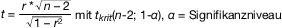

# Verordnung zum Schutz der Oberflächengewässer (OGewV 2016)

Ausfertigungsdatum
:   2016-06-20

Fundstelle
:   BGBl I: 2016, 1373

Zuletzt geändert durch
:   Art. 2 Abs. 4 G v. 9.12.2020 I 2873

Stand: Ersetzt V 753-13-3 v. 20.7.2011 I 1429 (OGewV)
[^f793919_01_BJNR137310016]:     Diese Verordnung dient der Umsetzung der
    –                                    Richtlinie 2000/60/EG des
    Europäischen Parlaments und des Rates vom 23. Oktober 2000 zur
    Schaffung eines Ordnungsrahmens für Maßnahmen der Gemeinschaft im
    Bereich der Wasserpolitik (ABl. L 327 vom 22.12.2000, S. 1), die
    zuletzt durch die Richtlinie 2014/101/EU (ABl. L 311 vom 31.10.2014,
    S. 32) geändert worden ist,

    –                                    Richtlinie 2008/105/EG des
    Europäischen Parlaments und des Rates vom 16. Dezember 2008 über
    Umweltqualitätsnormen im Bereich der Wasserpolitik und zur Änderung
    und anschließenden Aufhebung der Richtlinien des Rates 82/176/EWG,
    83/513/EWG, 84/156/EWG, 84/491/EWG und 86/280/EWG sowie zur Änderung
    der Richtlinie 2000/60/EG (ABl. L 348 vom 24.12.2008, S. 84), die
    zuletzt durch die Richtlinie 2013/39/EU (ABl. L 226 vom 24.8.2013, S.
    1) geändert worden ist,

    –                                    Richtlinie 2009/90/EG der
    Kommission vom 31. Juli 2009 zur Festlegung technischer
    Spezifikationen für die chemische Analyse und die Überwachung des
    Gewässerzustands gemäß der Richtlinie 2000/60/EG des Europäischen
    Parlaments und des Rates (ABl. L 201 vom 1.8.2009, S. 36),

    –                                    Richtlinie 2014/101/EU der
    Kommission vom 30. Oktober 2014 zur Änderung der Richtlinie 2000/60/EG
    des Europäischen Parlaments und des Rates zur Schaffung eines
    Ordnungsrahmens für Maßnahmen der Gemeinschaft im Bereich der
    Wasserpolitik (ABl. L 311 vom 31.10.2014, S. 32),

    –                                    Beschluss 2013/480/EU der
    Kommission vom 20. September 2013 zur Festlegung der Werte für die
    Einstufungen des Überwachungssystems des jeweiligen Mitgliedstaats als
    Ergebnis der Interkalibrierung gemäß der Richtlinie 2000/60/EG des
    Europäischen Parlaments und des Rates und zur Aufhebung der
    Entscheidung 2008/915/EG (ABl. L 266 vom 8.10.2013, S. 1, L 102 vom
    5\.4.2014, S. 22).

## § 1 Zweck

Diese Verordnung dient dem Schutz der Oberflächengewässer und der
wirtschaftlichen Analyse der Nutzungen ihres Wassers.

## § 2 Begriffsbestimmungen

Für diese Verordnung gelten folgende Begriffsbestimmungen:

1.  Oberflächengewässer

    Oberirdische Gewässer nach § 3 Nummer 1 des Wasserhaushaltsgesetzes,
    einschließlich der Übergangsgewässer nach Nummer 2 sowie
    Küstengewässer nach § 7 Absatz 5 Satz 2 des Wasserhaushaltsgesetzes;
    bei Anforderungen an den chemischen Zustand von Küstengewässern gilt
    die Begriffsbestimmung des § 3 Nummer 2 des Wasserhaushaltsgesetzes;

2.  Übergangsgewässer

    Die Oberflächenwasserkörper in der Nähe von Flussmündungen, die auf
    Grund ihrer Nähe zu den Küstengewässern einen gewissen Salzgehalt
    aufweisen, aber im Wesentlichen von Süßwasserströmungen beeinflusst
    werden;

3.  Umweltqualitätsnorm (UQN)

    Die Konzentration eines bestimmten Schadstoffs oder einer bestimmten
    Schadstoffgruppe, die in Wasser, Schwebstoffen, Sedimenten oder Biota
    aus Gründen des Gesundheits- und Umweltschutzes nicht überschritten
    werden darf;

4.  Prioritäre Stoffe

    Stoffe, die in Anlage 8 Tabelle 1 Spalte 8 aufgeführt sind;

5.  Bestimmte andere Schadstoffe

    Stoffe, die in Anlage 8 Tabelle 1 Spalte 9 aufgeführt sind;

6.  Flussgebietsspezifische Schadstoffe

    Spezifische synthetische und spezifische nichtsynthetische
    Schadstoffe, die in Anlage 6 aufgeführt sind;

7.  Natürliche Hintergrundkonzentration

    Konzentration eines Stoffes in einem Oberflächenwasserkörper, die
    nicht oder nur sehr gering durch menschliche Tätigkeiten beeinflusst
    ist.

## § 3 Lage, Grenzen und Zuordnung der Oberflächenwasserkörper; typspezifische Referenzbedingungen

Nach Maßgabe der Anlage 1 werden folgende Bestimmungen zum 22.
Dezember 2019 durch die zuständige Behörde überprüft und
gegebenenfalls aktualisiert:

1.  die Festlegung von Lage und Grenzen der Oberflächenwasserkörper,

2.  die Einteilung von Oberflächenwasserkörpern innerhalb einer
    Flussgebietseinheit in Kategorien,

3.  die Unterscheidung der Kategorien von Oberflächenwasserkörpern nach
    Typen,

4.  die Einstufung von Oberflächenwasserkörpern als künstlich oder als
    erheblich verändert und

5.  die Festlegung von typspezifischen Referenzbedingungen.

Die Bestimmungen werden danach alle sechs Jahre überprüft und
gegebenenfalls aktualisiert.

## § 4 Zusammenstellung der Gewässerbelastungen und Beurteilung ihrer Auswirkungen; Bestandsaufnahme der Emissionen, Einleitungen und Verluste

(1) Nach Maßgabe der Anlage 2 wird Folgendes zum 22. Dezember 2019
durch die zuständige Behörde überprüft und gegebenenfalls
aktualisiert:

1.  die Zusammenstellungen von Daten zu Art und Ausmaß der durch
    menschliche Tätigkeit verursachten (anthropogenen) signifikanten
    Belastungen der Oberflächenwasserkörper,

2.  die Beurteilungen auf Grund der Zusammenstellungen nach Nummer 1, wie
    empfindlich die Oberflächenwasserkörper auf die Belastungen reagieren,
    und

3.  die Ermittlungen und Beschreibungen von Oberflächenwasserkörpern, die
    die für die Gewässer festgelegten Bewirtschaftungsziele nach den §§ 27
    und 44 des Wasserhaushaltsgesetzes nicht erreichen.

Danach erfolgen alle sechs Jahre eine Überprüfung und gegebenenfalls
eine Aktualisierung.

(2) Die zuständige Behörde aktualisiert die für jede
Flussgebietseinheit zum 22. Dezember 2013 erstellte Bestandsaufnahme
der Emissionen, Einleitungen und Verluste aller prioritären Stoffe und
bestimmter anderer Schadstoffe einschließlich der Konzentrationen der
in Anlage 8 Tabelle 1 genannten Stoffe in Biota, Schwebstoffen oder
Sedimenten im Rahmen der Überprüfung nach Absatz 1 auf der Grundlage
folgender Informationen und Bestimmungen:

1.  der Informationen nach Absatz 1,

2.  der Bestimmungen nach § 3,

3.  der im Rahmen der Überwachung nach § 10 gewonnenen Informationen,

4.  der Informationen nach § 2 Absatz 2 Satz 1 des Gesetzes zur Ausführung
    des Protokolls über Schadstofffreisetzungs- und -verbringungsregister
    vom 21. Mai 2003 sowie zur Durchführung der Verordnung (EG) Nr.
    166/2006 vom 6. Juni 2007 (BGBl. I S. 1002), das durch Artikel 1 des
    Gesetzes vom 9. Dezember 2020 (BGBl. I S. 2873) geändert worden ist,
    sowie

5.  anderer verfügbarer Daten, Karten und Modelluntersuchungen.

(3) Der Referenzzeitraum für die Erfassung der Werte in den
aktualisierten Bestandsaufnahmen ist das Jahr, vor dem die
Aktualisierung abzuschließen ist. Für prioritäre Stoffe oder bestimmte
andere Schadstoffe, die jeweils Wirkstoffe im Sinne des Artikels 2
Absatz 2 der Verordnung (EG) Nr. 1107/2009 des Europäischen Parlaments
und des Rates vom 21. Oktober 2009 über das Inverkehrbringen von
Pflanzenschutzmitteln und zur Aufhebung der Richtlinien 79/117/EWG und
91/414/EWG              des Rates (ABl. L 309 vom 24.11.2009, S. 1),
die zuletzt durch die Verordnung (EU) Nr.
652/2014              (ABl. L 189 vom 27.6.2014, S. 1) geändert worden
ist, sind, kann auch der Durchschnittswert der letzten drei Jahre vor
Abschluss der Aktualisierung verwendet werden.

## § 5 Einstufung des ökologischen Zustands und des ökologischen Potenzials

(1) Die Einstufung des ökologischen Zustands eines
Oberflächenwasserkörpers richtet sich nach den in Anlage 3
aufgeführten Qualitätskomponenten. Die zuständige Behörde stuft den
ökologischen Zustand eines Oberflächenwasserkörpers nach Maßgabe von
Anlage 4 Tabellen 1 bis 5 in die Klassen sehr guter, guter, mäßiger,
unbefriedigender oder schlechter Zustand ein.

(2) Die Einstufung des ökologischen Potenzials eines künstlichen oder
erheblich veränderten Oberflächenwasserkörpers richtet sich nach den
in Anlage 3 aufgeführten Qualitätskomponenten, die für diejenige
Gewässerkategorie nach Anlage 1 Nummer 1 gelten, die dem betreffenden
Wasserkörper am ähnlichsten ist. Die zuständige Behörde stuft das
ökologische Potenzial nach Maßgabe von Anlage 4 Tabellen 1 und 6 in
die Klassen höchstes, gutes, mäßiges, unbefriedigendes oder schlechtes
Potenzial ein.

(3) Bei der Einstufung nach Absatz 1 oder Absatz 2 sind die in Anlage
5 aufgeführten Verfahren und Werte zu verwenden.

(4) Maßgebend für die Einstufung des ökologischen Zustands oder des
ökologischen Potenzials ist die jeweils schlechteste Bewertung einer
der biologischen Qualitätskomponenten nach Anlage 3 Nummer 1 in
Verbindung mit Anlage 4. Bei der Bewertung der biologischen
Qualitätskomponenten sind die hydromorphologischen
Qualitätskomponenten nach Anlage 3 Nummer 2 sowie die entsprechenden
allgemeinen physikalisch-chemischen Qualitätskomponenten nach Anlage 3
Nummer 3.2 in Verbindung mit Anlage 7 zur Einstufung unterstützend
heranzuziehen.

(5) Wird eine Umweltqualitätsnorm oder werden mehrere
Umweltqualitätsnormen nach Anlage 3 Nummer 3.1 in Verbindung mit
Anlage 6 nicht eingehalten, ist der ökologische Zustand oder das
ökologische Potenzial höchstens als mäßig einzustufen. Hierbei gilt
für Stoffe mit überarbeiteten Umweltqualitätsnormen und für neu
geregelte Stoffe Folgendes:

1.  Für die zum 22. Dezember 2021 zu aktualisierenden Maßnahmenprogramme
    und Bewirtschaftungspläne nach § 84 Absatz 1 des
    Wasserhaushaltsgesetzes sind die Umweltqualitätsnormen für die Stoffe
    mit den Nummern 2, 3, 6, 12, 14, 21, 22, 26, 28, 29, 31, 35, 41, 42,
    44, 62 und 65 nach Anlage 6 zugrunde zu legen; diese müssen für die
    Erreichung des guten ökologischen Zustands spätestens ab dem 22.
    Dezember 2027 eingehalten werden.

2.  Für die zum 22. Dezember 2015 zu aktualisierenden Maßnahmenprogramme
    und Bewirtschaftungspläne nach § 84 Absatz 1 des
    Wasserhaushaltsgesetzes sind abweichend von Satz 1 für die in Nummer 1
    genannten Stoffe mit den Nummern 2, 3, 6, 14, 21, 35, 41 und 44 die
    Umweltqualitätsnormen nach Anlage 5 der Oberflächengewässerverordnung
    vom 20. Juli 2011 (BGBl. I S. 1429) zugrunde zu legen; diese sind für
    die Erreichung des guten ökologischen Zustands bis zum 22. Dezember
    2021 maßgeblich.

## § 6 Einstufung des chemischen Zustands

Die Einstufung des chemischen Zustands eines Oberflächenwasserkörpers
richtet sich nach den in Anlage 8 Tabelle 2 aufgeführten
Umweltqualitätsnormen. Erfüllt der Oberflächenwasserkörper diese
Umweltqualitätsnormen, stuft die zuständige Behörde den chemischen
Zustand als gut ein. Andernfalls ist der chemische Zustand als nicht
gut einzustufen. Abweichend von Satz 1 werden die Stoffe Nummer 34 bis
Nummer 45 der Anlage 8 Tabelle 2 und deren Umweltqualitätsnormen erst
ab dem 22. Dezember 2018 berücksichtigt.

## § 7 Anforderungen bei überarbeiteten Umweltqualitätsnormen und bei Umweltqualitätsnormen für neue Stoffe

(1) Abweichend von § 29 Absatz 1 Satz 1 des Wasserhaushaltsgesetzes
ist der gute chemische Zustand zu erreichen

1.  bis zum 22. Dezember 2021 für die in Anlage 8
    Tabelle 1                    Spalte 4 aufgeführten Stoffe, für die
    überarbeitete Umweltqualitätsnormen gelten und

2.  bis zum 22. Dezember 2027 für die in Anlage 8
    Tabelle 1                    Spalte 5 aufgeführten Stoffe, die neu
    geregelt worden sind.

Bis zum 22. Dezember 2021 gelten für die in Anlage 8 Tabelle 1 Spalte
4 aufgeführten Stoffe die Umweltqualitätsnormen nach Anlage 7 der
Oberflächengewässerverordnung vom 20. Juli 2011. Im Übrigen bleiben
die §§ 27 bis 31 des Wasserhaushaltsgesetzes unberührt.

(2) Stoffe nach Absatz 1 Satz 1 Nummer 1 sind mit ihren überarbeiteten
Umweltqualitätsnormen erstmalig in den aktualisierten
Maßnahmenprogrammen und aktualisierten Bewirtschaftungsplänen nach §
84 Absatz 1 des Wasserhaushaltsgesetzes, die bis zum 22. Dezember 2015
zu erstellen sind, zu berücksichtigen.

(3) Für Stoffe nach Absatz 1 Satz 1 Nummer 2 erstellt die zuständige
Behörde bis zum 22. Dezember 2018 ein zusätzliches
Überwachungsprogramm nach Maßgabe des § 10 sowie ein vorläufiges
Maßnahmenprogramm. In den aktualisierten Maßnahmenprogrammen und
Bewirtschaftungsplänen nach § 84 Absatz 1 des Wasserhaushaltsgesetzes,
die bis zum 22. Dezember 2021 zu erstellen sind, sind die Stoffe nach
Absatz 1 Satz 1 Nummer 2 zu berücksichtigen.

## § 8 Oberflächenwasserkörper, die der Trinkwassergewinnung dienen

(1) Unabhängig von den Bestimmungen der §§ 5 und 6 sind die
Oberflächenwasserkörper, die für die Trinkwassergewinnung genutzt
werden, mit dem Ziel zu bewirtschaften, eine Verschlechterung ihrer
Qualität zu verhindern und so den für die Gewinnung von Trinkwasser
erforderlichen Umfang der Aufbereitung zu verringern.

(2) Die Oberflächenwasserkörper, die der Trinkwassergewinnung dienen,
sind im Bewirtschaftungsplan auf Karten darzustellen.

## § 9 Normen für die Überwachung der Qualitätskomponenten; Anforderungen an die Beurteilung der Überwachungsergebnisse, an Analysenmethoden und an Laboratorien

(1) Die Methoden, die zur Überwachung der biologischen,
hydromorphologischen und allgemeinen physikalisch-chemischen
Qualitätskomponenten verwendet werden, müssen den Normen entsprechen,
die in Anhang V Nummer 1.3.6 der Richtlinie 2000/60/EG des
Europäischen Parlaments und des Rates vom 23. Oktober 2000 zur
Schaffung eines Ordnungsrahmens für Maßnahmen der Gemeinschaft im
Bereich der Wasserpolitik (ABl. L 327 vom 22.12.2000, S. 1), die
zuletzt durch die Richtlinie 2014/101/EU (ABl. L 311 vom 31.10.2014,
S. 32) geändert worden ist, genannt sind.

(2) Die zuständige Behörde überprüft die Einhaltung der
Umweltqualitätsnormen nach Maßgabe von Anlage 9 Nummer 3. Die hierbei
anzuwendenden Analysenmethoden müssen die Anforderungen nach Anlage 9
Nummer 1 erfüllen.

(3) Laboratorien, die an der Überwachung biologischer, chemischer oder
physikalisch-chemischer Qualitätskomponenten mitwirken, haben die
erforderlichen qualitätssichernden Maßnahmen zu ergreifen, um eine
hinreichende Zuverlässigkeit und Genauigkeit der
Überwachungsergebnisse sicherzustellen. Die Laboratorien haben
insbesondere die Anforderungen nach Anlage 9 Nummer 2 zu erfüllen.

## § 10 Überwachung des ökologischen Zustands, des ökologischen Potenzials und des chemischen Zustands; Überwachungsnetz

(1) Die Überwachung der Oberflächenwasserkörper hinsichtlich ihres
ökologischen Zustands oder ihres ökologischen Potenzials, ihres
chemischen Zustands sowie die Überwachung der Oberflächenwasserkörper,
die der Trinkwassergewinnung dienen, richten sich nach Anlage 10. Die
Überwachungsprogramme werden von der zuständigen Behörde regelmäßig
überprüft und gegebenenfalls aktualisiert.

(2) Die zuständige Behörde überwacht die Erfüllung der Anforderungen
an die biologischen Qualitätskomponenten nach Anlage 4 sowie die
Einhaltung der Umweltqualitätsnormen für flussgebietsspezifische
Schadstoffe nach Anlage 6 im Rahmen der überblicksweisen Überwachung
nach Anlage 10 Nummer 1 und, soweit nach Anlage 10 Nummer 2
erforderlich, im Rahmen der operativen Überwachung an für den
Oberflächenwasserkörper repräsentativen Messstellen. Satz 1 gilt
entsprechend für Umweltqualitätsnormen zur Beurteilung des chemischen
Zustands nach Anlage 8 Tabelle 2.

(3) Das Netz zur Überwachung des ökologischen und des chemischen
Zustands sowie des ökologischen Potenzials ist im Bewirtschaftungsplan
auf Karten darzustellen.

## § 11 Überwachung von Stoffen der Beobachtungsliste

(1) Die zuständigen Behörden überwachen die Stoffe der von der
Europäischen Kommission erstellten Beobachtungsliste nach Artikel 8b
der Richtlinie 2008/105/EG des Europäischen Parlaments und des Rates
vom 16. Dezember 2008 über Umweltqualitätsnormen im Bereich der
Wasserpolitik und zur Änderung und anschließenden Aufhebung der
Richtlinien des Rates 82/176/EWG, 83/513/EWG, 84/156/EWG, 84/491/EWG
und 86/280/EWG sowie zur Änderung der Richtlinie 2000/60/EG (ABl. L
348 vom 24.12.2008, S. 84), die zuletzt durch die Richtlinie
2013/39/EU des Europäischen Parlaments und des Rates vom 12. August
2013 (ABl. L 226 vom 24.8.2013, S. 1) geändert worden ist, an
Überwachungsstellen, die für den jeweiligen Stoff repräsentativ sind.
Hierbei sind die Überwachungsmatrizes maßgeblich und die
Analysenmethoden zu verwenden, die in der Beobachtungsliste festgelegt
sind. Die Laboratorien, die an der Überwachung der Stoffe der
Beobachtungsliste mitwirken, haben mit geeigneten qualitätssichernden
Maßnahmen eine hinreichende Zuverlässigkeit und Genauigkeit der
Überwachungsergebnisse sicherzustellen und insbesondere die
Anforderungen nach Anlage 9 Nummer 2 zu erfüllen. Bei der Bestimmung
der Überwachungsfrequenz und bei der zeitlichen Planung der
Überwachung eines jeden Stoffes berücksichtigt die zuständige Behörde
die typischen Arten der Verwendung und das Vorkommen des jeweiligen
Stoffes. Die repräsentativen Überwachungsstellen nach Satz 1 sind nach
Maßgabe von Anlage 11 festzulegen.

(2) Die Stoffe nach Absatz 1 Satz 1 sind über einen Zeitraum von
mindestens einem Jahr bis zu höchstens vier Jahren zu überwachen. Das
Erfordernis der Überwachung entfällt, sobald ein Stoff nicht mehr in
der Beobachtungsliste aufgeführt ist. Für die erste Beobachtungsliste
beginnt der Überwachungszeitraum nach Satz 1 am 24. September 2015.
Für jeden neuen Stoff beginnt der Überwachungszeitraum nach Satz 1
spätestens sechs Monate nach Aufnahme des Stoffes in die
Beobachtungsliste. Die Stoffe sind innerhalb der zwölf Monate, die auf
den Beginn des Überwachungszeitraums nach Satz 3 oder Satz 4 folgen,
sowie innerhalb der folgenden Zwölfmonatszeiträume jeweils mindestens
einmal zu überwachen.

(3) Liegen für einen Stoff ausreichende, vergleichbare, repräsentative
und aktuelle Überwachungsdaten aus bestehenden Überwachungsprogrammen
vor, so kann von einer zusätzlichen Überwachung des Stoffes nach den
Absätzen 1 und 2 abgesehen werden, wenn der Stoff mittels einer
Methode überwacht wurde, die den Anforderungen der technischen
Leitlinien entspricht, die von der Europäischen Kommission nach
Artikel 8b Absatz 5 Satz 4 der Richtlinie 2008/105/EG erarbeitet
werden.

(4) Die zuständige Behörde übermittelt dem Bundesministerium für
Umwelt, Naturschutz und nukleare Sicherheit die Ergebnisse der
Überwachung, die sich auf die jeweiligen Zwölfmonatszeiträume nach
Absatz 2 Satz 5 beziehen, für das jeweilige Land sowie Informationen
über die Repräsentativität der Überwachungsstellen und die
Überwachungsstrategie. Die Informationen nach Satz 1 sind erstmalig zu
übermitteln:

1.  für Stoffe, die in der ersten Beobachtungsliste aufgeführt sind, bis
    zum 24. Oktober 2016,

2.  für jeden Stoff, der neu in die Beobachtungsliste aufgenommen wird,
    innerhalb von 19 Monaten nach dem Zeitpunkt der Aufnahme.

Danach sind die Informationen nach Satz 1 dem Bundesministerium für
Umwelt, Naturschutz und nukleare Sicherheit alle zwölf Monate zu
übermitteln, solange der Stoff in der Beobachtungsliste aufgeführt
ist.

## § 12 Darstellung des ökologischen Zustands, des ökologischen Potenzials und des chemischen Zustands

(1) Die zuständige Behörde stellt den ökologischen Zustand oder das
ökologische Potenzial eines Oberflächenwasserkörpers auf einer
gesonderten Karte nach Maßgabe von Anlage 12 Nummer 1 dar. Der
chemische Zustand ist auf einer gesonderten Karte nach Maßgabe von
Anlage 12 Nummer 2 darzustellen. Wird der ökologische Zustand oder das
ökologische Potenzial eines Oberflächenwasserkörpers schlechter als
gut eingestuft, sind die für die Einstufung maßgebenden biologischen
Qualitätskomponenten und flussgebietsspezifischen Schadstoffe nach
Maßgabe von
Anlage 12              Nummer 1.3 und 1.4 zu kennzeichnen oder in
geeigneter anderer Weise darzustellen. Wird der chemische Zustand als
nicht gut eingestuft, sind die maßgebenden Stoffe nach Maßgabe von
Anlage 12 Nummer 2 zu kennzeichnen oder in geeigneter anderer Weise
darzustellen.

(2) Die zuständige Behörde kann die Informationen über den chemischen
Zustand beispielsweise im Hinblick auf einen oder mehrere Stoffe der
Anlage 8 Tabelle 1, Spalten 4, 5 und 7 gesondert von den Informationen
über den chemischen Zustand im Hinblick auf die übrigen in Anlage 8
Tabelle 1 aufgeführten Stoffe in weiteren Karten nach Maßgabe von
Anlage 12 Nummer 2 darstellen. Für einzelne Stoffe der Anlage 8
Tabelle 1 kann das Ausmaß der Abweichung von der Umweltqualitätsnorm
in weiteren Karten dargestellt werden; hierfür sind Kategorien zu
verwenden, die das Ausmaß der Abweichung näherungsweise im Wege einer
ein- oder mehrmaligen Multiplikation der Umweltqualitätsnorm mit dem
Faktor 2 oder 4 beschreiben.

(3) Die zuständige Behörde kennzeichnet nach Maßgabe von Anlage 12
Nummer 3 Oberflächenwasserkörper, bei denen die Einhaltung der
Umweltqualitätsnormen von Schadstoffen unter Berücksichtigung der
natürlichen Hintergrundkonzentrationen festgestellt wurde.

## § 13 Zusätzliche Inhalte der Bewirtschaftungspläne; elektronisch zugängliches Portal

(1) In die aktualisierten Bewirtschaftungspläne nach § 84 Absatz 1 des
Wasserhaushaltsgesetzes sind zusätzlich zu den Informationen nach § 83
Absatz 2 des Wasserhaushaltsgesetzes folgende Informationen
aufzunehmen:

1.  die aktualisierten Bestandsaufnahmen und Karten nach § 4 Absatz 1 und
    2,

2.  eine Tabelle, in der Folgendes aufgeführt ist:

    a)  die Bestimmungsgrenzen der Analysenmethoden nach Anlage 9 Nummer 1,
        die bei der Überwachung von Umweltqualitätsnormen nach Anlage 8
        Tabelle 2 verwendet worden sind, sowie

    b)  Informationen über die Leistung dieser Analysenmethoden in Bezug auf
        die in Anlage 9 Nummern 1.3, 1.4 und 1.5 festgelegten
        Mindestleistungskriterien,

3.  eine Begründung für die nach Anlage 10 Nummer 4 angewandte
    Überwachungsfrequenz von prioritären Stoffen der Anlage 8, für die
    eine Umweltqualitätsnorm für Sedimente oder Biota angewandt wird,
    falls die Überwachungsintervalle länger als ein Jahr sind.

(2) Die Bundesanstalt für Gewässerkunde macht die aktualisierten
Bewirtschaftungspläne und den Zwischenbericht nach Artikel 15 Absatz 3
der Richtlinie 2000/60/EG über ein zentrales Portal im Internet der
Öffentlichkeit zugänglich.

## § 14 Bewirtschaftungsziele für Stickstoff

(1) Die Bewirtschaftungspläne und Maßnahmenprogramme in den
Flussgebietseinheiten richten sich zum Schutz der Meeresgewässer an
dem Ziel aus, dass folgende Jahresmittelwerte für Gesamtstickstoff
nicht überschritten werden:

1.  bei in die Nordsee mündenden Flüssen 2,8 Milligramm pro Liter

    a)  an den jeweiligen Süßwassermessstellen am Grenzscheitel limnisch/marin
        zum Zeitpunkt Kenterpunkt Ebbe,

    b)  bei Flüssen, deren Mündungsbereich sich außerhalb des Bundesgebiets
        befindet, an den Punkten, an denen diese Flüsse das Bundesgebiet
        endgültig verlassen,

2.  bei in die Ostsee mündenden Flüssen 2,6 Milligramm pro Liter

    a)  an den jeweiligen Süßwassermessstellen am Grenzscheitel
        limnisch/marin,

    b)  bei Flüssen, deren Mündungsbereich sich außerhalb des Bundesgebiets
        befindet, an den Punkten, an denen diese Flüsse das Bundesgebiet
        endgültig verlassen.

(2) Die zuständige Behörde des Landes, in dem sich die Messstellen und
Punkte nach Absatz 1 befinden, überwacht die Einhaltung der
Anforderungen nach Absatz 1 nach Maßgabe von Anlage 10 Nummer 4
Tabelle 1.

## § 15 Ermittlung langfristiger Trends

(1) Im Rahmen der Überwachung nach § 10 ermittelt die zuständige
Behörde nach Maßgabe von Anlage 13 Nummer 1 bis 4 den langfristigen
Trend der Konzentrationen derjenigen in Anlage 8 Tabelle 1
aufgeführten Stoffe, die dazu neigen, sich in Biota, Schwebstoffen
oder Sedimenten anzureichern. Dies betrifft insbesondere die Stoffe
nach Anlage 8 Tabelle 1 Spalte 6. Diese Stoffe sind im Regelfall
mindestens alle drei Jahre in Biota, Schwebstoffen oder Sedimenten zu
überwachen, es sei denn, die zuständige Behörde legt auf Grund des
aktuellen Wissensstands ein anderes Intervall fest.

(2) Im Rahmen der Aktualisierung des Maßnahmenprogramms nach § 84
Absatz 1 des Wasserhaushaltsgesetzes sind Maßnahmen vorzusehen, mit
denen sichergestellt wird, dass die in Absatz 1 genannten
Konzentrationen in den betreffenden Biota, Schwebstoffen oder
Sedimenten nicht signifikant ansteigen. Ein signifikanter Anstieg
liegt vor, wenn die Voraussetzungen nach Anlage 13 Nummer 5 erfüllt
sind.

## § 16 Wirtschaftliche Analyse der Wassernutzungen

(1) Die wirtschaftlichen Analysen der Wassernutzungen nach Artikel 5
Absatz 1 dritter Gedankenstrich der Richtlinie 2000/60/EG, die
signifikante Auswirkungen auf den Zustand der Oberflächengewässer
haben, sind zum 22. Dezember 2019 und danach alle sechs Jahre zu
überprüfen und gegebenenfalls zu aktualisieren.

(2) Die wirtschaftliche Analyse muss die erforderlichen Informationen
enthalten, damit

1.  Berechnungen durchgeführt werden können, um dem Grundsatz der Deckung
    der Kosten der Wasserdienstleistungen nach Artikel 9 der Richtlinie
    2000/60/EG                    unter Berücksichtigung der langfristigen
    Voraussagen für das Angebot und die Nachfrage von Wasser in der
    Flussgebietseinheit Rechnung zu tragen, und

2.  die in Bezug auf die Wassernutzung kosteneffizientesten
    Maßnahmenkombinationen für das Maßnahmenprogramm beurteilt werden
    können.

(3) Bei unverhältnismäßigem Aufwand, insbesondere unter
Berücksichtigung der Kosten für die Erhebung der betreffenden Daten,
können dabei auch Schätzungen der Menge, der Preise und der Kosten im
Zusammenhang mit den Wasserdienstleistungen, Schätzungen der
einschlägigen Investitionen einschließlich der entsprechenden
Vorausplanungen sowie Schätzungen der potenziellen Kosten der
Maßnahmen für das Maßnahmenprogramm zugrunde gelegt werden.

(zu § 3 Satz 1, § 5 Absatz 2 Satz 1)

## Anlage 1 Lage, Grenzen und Zuordnung der Oberflächenwasserkörper; typspezifische Referenzbedingungen

(Fundstelle: BGBl. I 2016,1379 - 1381)

Die Oberflächenwasserkörper innerhalb einer Flussgebietseinheit sind
nach Maßgabe der Nummer 1 in Kategorien einzuteilen und ihre Lage und
Grenzen sind festzulegen. Sie sind in jeder Kategorie nach Maßgabe der
Nummer 2 nach Typen zu unterscheiden. Die Oberflächenwasserkörper, die
für eine Einstufung als künstlich oder erheblich verändert in Betracht
kommen, sind den Typen jener Gewässerkategorie zuzuordnen, der sie am
ähnlichsten sind. Für jeden Gewässertyp sind nach Maßgabe der Nummer 3
die typspezifischen Referenzbedingungen festzulegen, die dem sehr
guten ökologischen Zustand entsprechen. Das höchste ökologische
Potenzial ist aus den Referenzbedingungen des Gewässertyps abzuleiten,
dem der künstliche oder erheblich veränderte Oberflächenwasserkörper
am ähnlichsten ist.

1.  **Kategorien von Oberflächengewässern**

    Die Oberflächengewässer sind in folgende Kategorien einzuteilen:

    **1.1** Flüsse

    **1.2** Seen

    **1.3** Übergangsgewässer

    **1.4** Küstengewässer

        a)  nach § 7 Absatz 5 Satz 2 des Wasserhaushaltsgesetzes, soweit der
            ökologische Zustand einzustufen ist

        b)  nach § 3 Nummer 2 des Wasserhaushaltsgesetzes, soweit der chemische
            Zustand einzustufen ist

2.  Typen von Oberflächengewässern

    **2.1** **Fließgewässer**                          (mit einem Einzugsgebiet
        von 10 Quadratkilometern oder größer)

        Die nachfolgenden Größenangaben werden als Größen der Einzugsgebiete
        der jeweiligen Gewässer angegeben. Die Angaben dienen der
        Orientierung:

        a)  klein (10 bis 100 Quadratkilometer)

        b)  mittelgroß (größer als 100 bis 1 000 Quadratkilometer)

        c)  groß (größer als 1 000 bis 10 000 Quadratkilometer)

        d)  sehr groß (größer als 10 000 Quadratkilometer)

        *            *   **Ökoregion 4: Alpen, Höhe über 800 Meter**

        *            *   **Typ 1**

            *   Fließgewässer der Alpen

        *            *   Subtyp 1.1

            *   Bäche der Kalkalpen

        *            *   Subtyp 1.2

            *   Kleine Flüsse der Kalkalpen

        *            *   **Ökoregionen 8 und 9: Mittelgebirge und Alpenvorland, Höhe 200 bis
                800 Meter**

        *            *   **Typ 2**

            *   Fließgewässer des Alpenvorlandes

        *            *   Subtyp 2.1

            *   Bäche des Alpenvorlandes

        *            *   Subtyp 2.2

            *   Kleine Flüsse des Alpenvorlandes

        *            *   **Typ 3**

            *   Fließgewässer der Jungmoräne des Alpenvorlandes

        *            *   Subtyp 3.1

            *   Bäche der Jungmoräne des Alpenvorlandes

        *            *   Subtyp 3.2

            *   Kleine Flüsse der Jungmoräne des Alpenvorlandes

        *            *   **Typ 4**

            *   Große Flüsse des Alpenvorlandes

        *            *   **Typ 5**

            *   Grobmaterialreiche silikatische Mittelgebirgsbäche

        *            *   **Typ 5.1**

            *   Feinmaterialreiche silikatische Mittelgebirgsbäche

        *            *   Subtyp 5.2

            *   **(PHYLIB)**                                    Feinmaterialreiche
                silikatische Mittelgebirgsbäche in Vulkangebieten

        *            *   **Typ 6**

            *   Feinmaterialreiche karbonatische Mittelgebirgsbäche

        *            *   Subtyp 6 K

            *   Feinmaterialreiche karbonatische Mittelgebirgsbäche (Keuper)

        *            *   **Typ 7**

            *   Grobmaterialreiche karbonatische Mittelgebirgsbäche

        *            *   **Typ 9**

            *   Silikatische fein- bis grobmaterialreiche Mittelgebirgsflüsse

        *            *   **Typ 9.1**

            *   Karbonatische fein- bis grobmaterialreiche Mittelgebirgsflüsse

        *            *   Subtyp 9.1 K

            *   Karbonatische fein- bis grobmaterialreiche Mittelgebirgsflüsse
                (Keuper)

        *            *   **Typ 9.2**

            *   Große Flüsse des Mittelgebirges

        *            *   **Typ 10**

            *   Kiesgeprägte Ströme

        *            *   **Ökoregionen 13 und 14: Norddeutsches Tiefland, Höhe unter 200
                Meter**

        *            *   **Typ 14**

            *   Sandgeprägte Tieflandbäche

        *            *   **Typ 15**

            *   Sand- und lehmgeprägte Tieflandflüsse

        *            *   **Typ 15 g**

            *   Große sand- und lehmgeprägte Tieflandflüsse

        *            *   **Typ 16**

            *   Kiesgeprägte Tieflandbäche

        *            *   **Typ 17**

            *   Kiesgeprägte Tieflandflüsse

        *            *   **Typ 18**

            *   Lösslehmgeprägte Tieflandbäche

        *            *   **Typ 20**

            *   Sandgeprägte Ströme

        *            *   **Typ 22**

            *   Marschengewässer

        *            *   Subtyp 22.1

            *   Kleine und mittelgroße Gewässer der Marschen

        *            *   Subtyp 22.2

            *   Große Gewässer der Marschen (meist mit Einzugsgebieten innerhalb der
                Geestgebiete des Norddeutschen Tieflandes)

        *            *   Subtyp 22.3

            *   Ströme der Marschen (Unterläufe von Elbe und Weser oberhalb der
                Übergangsgewässer)

        *            *   **Typ 23**

            *   Rückstau- bzw. brackwasserbeeinflusste Ostseezuflüsse

        *            *   **Ökoregionunabhängige Typen**

        *            *   **Typ 11**

            *   Organisch geprägte Bäche

        *            *   **Typ 12**

            *   Organisch geprägte Flüsse

        *            *   **Typ 19**

            *   Kleine Niederungsfließgewässer in Fluss- und Stromtälern

        *            *   **Typ 21**

            *   Seeausflussgeprägte Fließgewässer

        *            *   Subtyp 21 N

            *   Seeausflussgeprägte Fließgewässer des Norddeutschen Tieflandes (Nord)

        *            *   Subtyp 21 S

            *   Seeausflussgeprägte Fließgewässer des Alpenvorlandes (Süd)

    **2.2** **Seen**                          (mit einer Oberfläche von 0,5
        Quadratkilometern oder größer)

        **Ökoregionen 4 und 9: Alpen und Alpenvorland**

        Typ 1: Polymiktischer Alpenvorlandsee

[^f793919_02_BJNR137310016BJNE001800000]
        Typ 2: Geschichteter Alpenvorlandsee mit relativ großem Einzugsgebiet

        Typ 3: Geschichteter Alpenvorlandsee mit relativ kleinem Einzugsgebiet

        Typ 4: Geschichteter Alpensee

        **Ökoregionen 8 und 9: Mittelgebirge**

        Typ 5: Geschichteter kalziumreicher Mittelgebirgssee mit relativ
        großem Einzugsgebiet

        Typ 6: Polymiktischer kalziumreicher Mittelgebirgssee

        Typ 7: Geschichteter kalziumreicher Mittelgebirgssee mit relativ
        kleinem Einzugsgebiet

        Typ 8: Geschichteter kalziumarmer Mittelgebirgssee mit relativ großem
        Einzugsgebiet

        Typ 9: Geschichteter kalziumarmer Mittelgebirgssee mit relativ kleinem
        Einzugsgebiet

        **Ökoregionen 13 und 14: Norddeutsches Tiefland**

        Typ 10: Geschichteter Tieflandsee mit relativ großem Einzugsgebiet

        Typ 11: Polymiktischer Tieflandsee mit relativ großem Einzugsgebiet

        Typ 12: Flusssee im Tiefland

        Typ 13: Geschichteter Tieflandsee mit relativ kleinem Einzugsgebiet

        Typ 14: Polymiktischer Tieflandsee mit relativ kleinem Einzugsgebiet

        **Sondertypen (alle Ökoregionen)**

        Typ 88: Sondertyp natürlicher See (
        z. B.                          Moorsee, Strandsee, Altarm oder
        Altwasser)

        Typ 99: Sondertyp künstlicher See (z. B. Abgrabungssee)

    **2.3** **Übergangsgewässer (Ästuare mit einem Einzugsgebiet von 10
        Quadratkilometern oder größer)**

        Typ T1: Übergangsgewässer Elbe-Weser-Ems

        Typ T2: Übergangsgewässer Eider

    **2.4** **Küstengewässer**

        **Typen der Küstengewässer der Nordsee**

        Typ N1: euhalines offenes Küstengewässer

        Typ N2: euhalines Wattenmeer

        Typ N3: polyhalines offenes Küstengewässer

        Typ N4: polyhalines Wattenmeer

        Typ N5: euhalines felsgeprägtes Küstengewässer um Helgoland

        **Typen der Küstengewässer der Ostsee**

        **Typ B1**                         : oligohalines inneres
        Küstengewässer

[^f793919_03_BJNR137310016BJNE001800000]
        Subtyp B1a: Salzgehalt 0,5 – 3 PSU

        Subtyp B1b: Salzgehalt 3 – 5 PSU

        **Typ B2**                         : mesohalines inneres
        Küstengewässer

        Subtyp B2a: Salzgehalt 5 – 10 PSU

        Subtyp B2b: Salzgehalt 10 – 18 PSU

        **Typ B3**                         : mesohalines offenes
        Küstengewässer

        Subtyp B3a: Salzgehalt 5 – 10 PSU

        Subtyp B3b: Salzgehalt 10 – 18 PSU

        **Typ B4**                         : meso-polyhalines offenes
        Küstengewässer, saisonal geschichtet (Salzgehalt 10 – 30 PSU)

3.  Festlegung von Referenzbedingungen für Typen von
    Oberflächenwasserkörpern

    3.1 Für jeden Typ von Oberflächenwasserkörpern nach Nummer 2 sind
        typspezifische hydromorphologische und physikalisch-chemische
        Bedingungen festzulegen, die denjenigen hydromorphologischen und
        physikalisch-chemischen Qualitätskomponenten entsprechen, die in
        Anlage 3 Nummer 2 und 3 für diesen Typ von Oberflächenwasserkörper für
        den sehr guten ökologischen Zustand gemäß der entsprechenden Tabelle
        in Anlage 4 angegeben sind. Außerdem sind typspezifische biologische
        Referenzbedingungen festzulegen, die die biologischen
        Qualitätskomponenten abbilden, die in Anlage 3 Nummer 1 für diesen Typ
        von Oberflächenwasserkörper bei sehr gutem ökologischen Zustand gemäß
        der entsprechenden Tabelle in Anlage 4 angegeben sind.

    3.2 Werden die in diesem Abschnitt beschriebenen Verfahren auf künstliche
        oder erheblich veränderte Oberflächenwasserkörper angewendet, sind
        Bezugnahmen auf den sehr guten ökologischen Zustand als Bezugnahmen
        auf das höchste ökologische Potenzial gemäß Anlage 4 Tabelle 6 zu
        verstehen. Die Werte für das höchste ökologische Potenzial eines
        Oberflächenwasserkörpers sind alle sechs Jahre zu überprüfen.

    3.3 Die typspezifischen Referenzbedingungen nach den Nummern 3.1 und 3.2
        sollen entweder raumbezogen oder modellbasiert sein oder durch
        Kombination beider Verfahren abgeleitet werden. Bei der Definition des
        sehr guten ökologischen Zustands im Hinblick auf die Konzentration
        bestimmter synthetischer Schadstoffe gelten als Nachweisgrenze die
        Werte, die mit den besten Techniken ermittelt werden können, die zum
        Zeitpunkt der Festlegung der Referenzbedingungen verfügbar sind.

    3.4 Für raumbezogene typspezifische biologische Referenzbedingungen ist
        ein Bezugsnetz für jeden Typ von Oberflächenwasserkörper zu
        entwickeln. Das Netz muss eine ausreichende Anzahl von Stellen mit
        sehr gutem Zustand umfassen.

    3.5 Modellbasierte typspezifische biologische Referenzbedingungen können
        entweder aus Vorhersagemodellen oder durch Rückberechnungsverfahren
        abgeleitet werden. Für die Verfahren sind historische, paläologische
        und andere verfügbare Daten zu verwenden. Die Werte für die
        Referenzbedingungen müssen hinreichend zuverlässig sein.

    3.6 Ist es auf Grund eines hohen Maßes an natürlicher Veränderlichkeit
        einer Qualitätskomponente nicht möglich, zuverlässige typspezifische
        Referenzbedingungen für diese Komponente eines
        Oberflächenwasserkörpers festzulegen, kann diese Komponente von der
        Beurteilung des ökologischen Zustands dieses Typs von
        Oberflächengewässer ausgenommen werden. In diesem Fall sind die Gründe
        hierfür im Bewirtschaftungsplan für die Einzugsgebiete anzugeben.

    Ein See wird als geschichtet eingeordnet, wenn die thermische
    Schichtung an der tiefsten Stelle des Sees über mindestens drei Monate
    stabil bleibt.
[^f793919_02_BJNR137310016BJNE001800000]:     PSU (Practical Salinity Units) ist die Maßeinheit für die Salinität.
[^f793919_03_BJNR137310016BJNE001800000]: 
(zu § 4 Absatz 1)

## Anlage 2 Zusammenstellung der Gewässerbelastungen und Beurteilung ihrer Auswirkungen

(Fundstelle: BGBl. I 2016,1382)

1.  **Umfang der Datenzusammenstellung**

    Die Zusammenstellung von Daten zur Art und zum Ausmaß der
    signifikanten anthropogenen Belastungen der Oberflächenwasserkörper
    umfasst insbesondere folgende Angaben:

    1.1 Signifikante Punktquellen und diffuse Quellen

        Einschätzung und Zusammenstellung der von kommunalen, industriellen,
        landwirtschaftlichen und anderen Anlagen und Tätigkeiten ausgehenden
        signifikanten Verschmutzungen durch Punktquellen oder durch diffuse
        Quellen, vor allem in Bezug auf folgende Stoffe:

        a)  Organische Halogenverbindungen und Stoffe, die im Wasser derartige
            Verbindungen bilden können

        b)  Organische Phosphorverbindungen

        c)  Organische Zinnverbindungen

        d)  Stoffe und Zubereitungen oder ihre Abbauprodukte, von denen erwiesen
            ist, dass sie im oder durch das Wasser

            aa) karzinogene oder mutagene Eigenschaften haben oder

            bb) Eigenschaften haben, die steroidogene, thyreoide, reproduktive oder
                andere Funktionen des endokrinen Systems beeinträchtigen

        e)  Persistente Kohlenwasserstoffe sowie persistente und bioakkumulierende
            organische toxische Stoffe

        f)  Zyanide

        g)  Metalle und Metallverbindungen

        h)  Arsen und Arsenverbindungen

        i)  Biozid- und Pflanzenschutzmittelwirkstoffe

        j)  Schwebstoffe

        k)  Stoffe, die zur Eutrophierung beitragen, insbesondere Nitrate und
            Phosphate

        l)  Stoffe mit nachhaltigem Einfluss auf die Sauerstoffbilanz, die anhand
            von Parametern wie Biochemischer Sauerstoffbedarf (BSB), Chemischer
            Sauerstoffbedarf (CSB) oder Gesamter Organisch gebundener Kohlenstoff
            (TOC) gemessen werden können.

    1.2 Einschätzung und Zusammenstellung signifikanter Wasserentnahmen für
        kommunale, industrielle, landwirtschaftliche und andere Zwecke,
        einschließlich saisonaler Schwankungen, des jährlichen Gesamtbedarfs
        und der Wasserverluste in Versorgungssystemen

    1.3 Einschätzung und Zusammenstellung signifikanter Abflussregulierungen,
        einschließlich der Wasserüber- und -umleitungen, im Hinblick auf die
        Fließeigenschaften und die Wasserbilanzen

    1.4 Zusammenstellung signifikanter morphologischer Veränderungen

    1.5 Einschätzung und Zusammenstellung anderer signifikanter anthropogener
        Belastungen der Gewässer

    1.6 Einschätzung von Bodennutzungsstrukturen, einschließlich der größten
        städtischen, industriellen und landwirtschaftlichen Gebiete,
        Fischereigebiete und Wälder.

2.  **Beurteilung der Auswirkungen**

    Es ist zu beurteilen, bei welchen Oberflächenwasserkörpern auf Grund
    der in Nummer 1 zusammengestellten Belastungen das Risiko besteht,
    dass sie die Bewirtschaftungsziele nach Maßgabe der §§ 27 bis 31 des
    Wasserhaushaltsgesetzes nicht erreichen, die für sie festgelegt worden
    sind. Dieser Beurteilung sind die nach Nummer 1 gesammelten Daten
    sowie andere einschlägige Informationen einschließlich vorhandener
    Daten aus der Umweltüberwachung zugrunde zu legen. Die Beurteilung
    kann durch Modellierungstechniken unterstützt werden. Für
    Oberflächenwasserkörper nach Satz 1 ist, soweit erforderlich, eine
    zusätzliche Beschreibung vorzunehmen, um die Überwachungsprogramme
    nach Anlage 10 und die Maßnahmenprogramme nach § 82 des
    Wasserhaushaltsgesetzes weiterzuentwickeln.

(zu § 5 Absatz 1 Satz 1, Absatz 2 Satz 1, Absatz 4 und Absatz 5 Satz
1)

## Anlage 3 Qualitätskomponenten zur Einstufung des ökologischen Zustands und des ökologischen Potenzials

(Fundstelle: BGBl. I 2016,1383 - 1384)

1.  **Biologische Qualitätskomponenten**

    Die biologischen Qualitätskomponenten umfassen die aquatische Flora,
    die Wirbellosenfauna und die Fischfauna nach Maßgabe der nachstehenden
    Tabelle

    (F = Flüsse, S = Seen, Ü = Übergangsgewässer, K = Küstengewässer):

    *        *   Qualitäts-
            komponentengruppe

        *   Qualitätskomponente

        *   Parameter

        *   Kategorie

    *        *   F

        *   S

        *   Ü

        *   K

    *        *   Gewässerflora

        *   Phytoplankton

        *   Artenzusammensetzung,
            Biomasse

        *[^f793919_04_BJNR137310016BJNE002000000]
   X

        *   X

        *   X

        *   X

    *        *   Großalgen oder Angiospermen

        *   Artenzusammensetzung,
            Artenhäufigkeit

        *
        *
        *[^f793919_05_BJNR137310016BJNE002000000]
   X

        *   X

    *        *   Makrophyten/Phytobenthos

        *   Artenzusammensetzung,
            Artenhäufigkeit

        *   X

        *   X

        *   X

        *

    *        *   Gewässerfauna

        *   Benthische wirbellose Fauna

        *   Artenzusammensetzung,
            Artenhäufigkeit

        *   X

        *   X

        *   X

        *   X

    *        *   Fischfauna

        *   Artenzusammensetzung,
            Artenhäufigkeit,
            Altersstruktur

        *   X

        *   X

        *[^f793919_06_BJNR137310016BJNE002000000]
   X

        *

2.  **Hydromorphologische Qualitätskomponenten**

    Die hydromorphologischen Qualitätskomponenten ergeben sich aus der
    nachstehenden Tabelle

    (F = Flüsse, S = Seen, Ü = Übergangsgewässer, K = Küstengewässer):

    *        *   Qualitätskomponente

        *   Parameter

        *   Kategorie

    *        *   F

        *   S

        *   Ü

        *   K

    *        *   Wasserhaushalt

        *   Abfluss und Abflussdynamik

        *   X

        *
        *
        *

    *        *   Verbindung zu Grundwasserkörpern

        *   X

        *   X

        *
        *

    *        *   Wasserstandsdynamik

        *
        *   X

        *
        *

    *        *   Wassererneuerungszeit

        *
        *   X

        *
        *

    *        *   Durchgängigkeit

        *
        *   X

        *
        *
        *

    *        *   Morphologie

        *   Tiefen- und Breitenvariation

        *   X

        *
        *
        *

    *        *   Tiefenvariation

        *
        *   X

        *   X

        *   X

    *        *   Struktur und Substrat des Bodens

        *   X

        *
        *
        *   X

    *        *   Menge, Struktur und Substrat des Bodens

        *
        *   X

        *   X

        *

    *        *   Struktur der Uferzone

        *   X

        *   X

        *
        *

    *        *   Struktur der Gezeitenzone

        *
        *
        *   X

        *   X

    *        *   Tidenregime

        *   Süßwasserzustrom

        *
        *
        *   X

        *

    *        *   Seegangsbelastung

        *
        *
        *   X

        *   X

    *        *   Richtung vorherrschender Strömungen

        *
        *
        *
        *   X

3.  **Chemische und allgemeine physikalisch-chemische
    Qualitätskomponenten**

    Die chemischen und allgemeinen physikalisch-chemischen
    Qualitätskomponenten ergeben sich aus den nachstehenden Tabellen

    (F = Flüsse, S = Seen, Ü = Übergangsgewässer, K = Küstengewässer):

    3.1 Chemische Qualitätskomponenten

        *            *   Qualitäts-
                komponentengruppe

            *   Qualitätskomponente

            *   Parameter

            *   Kategorie

        *            *   F

            *   S

            *   Ü

            *   K

        *            *   Flussgebietsspezifische
                Schadstoffe

            *   synthetische und nichtsynthetische Schadstoffe
                in Wasser, Sedimenten oder Schwebstoffen

            *   Schadstoffe nach
                Anlage 6

            *   X

            *   X

            *   X

            *   X

    3.2 Allgemeine physikalisch-chemische Qualitätskomponenten

        *            *   Qualitäts-
                komponentengruppe

            *   Qualitätskomponente

            *   Mögliche Parameter

            *   F

            *   S

            *   Ü

            *   K

        *            *   Allgemeine
                physikalisch-
                chemische
                Komponenten

            *   Sichttiefe

            *   Sichttiefe

            *
            *   X

            *   X

            *   X

        *            *   Temperaturverhältnisse

            *   Wassertemperatur

            *   X

            *   X

            *   X

            *   X

        *            *   Sauerstoffhaushalt

            *   Sauerstoffgehalt

            *   X

            *   X

            *   X

            *   X

        *            *
            *   Sauerstoffsättigung

            *   X

            *   X

            *   X

            *   X

        *            *
            *   TOC

            *   X

            *
            *
            *

        *            *
            *   BSB

            *   X

            *
            *
            *

        *            *
            *   Eisen

            *   X

            *
            *
            *

        *            *   Salzgehalt

            *   Chlorid

            *   X

            *   X

            *   X

            *   X

        *            *
            *   Leitfähigkeit bei 25 °C

            *   X

            *
            *   X

            *   X

        *            *
            *   Sulfat

            *   X

            *
            *
            *

        *            *
            *   Salinität

            *
            *
            *   X

            *   X

        *            *   Versauerungszustand

            *   pH-Wert

            *   X

            *   X

            *
            *

        *            *
            *   Säurekapazität Ks (bei versauerungsgefährdeten Gewässern)

            *   X

            *   X

            *
            *

        *            *   Nährstoffverhältnisse

            *   Gesamtphosphor

            *   X

            *   X

            *   X

            *   X

        *            *
            *   ortho-Phosphat-
                Phosphor

            *   X

            *   X

            *   X

            *   X

        *            *
            *   Gesamtstickstoff

            *   X

            *   X

            *   X

            *   X

        *            *
            *   Nitrat-Stickstoff

            *   X

            *   X

            *   X

            *   X

        *            *
            *   Ammonium-Stickstoff

            *   X

            *   X

            *   X

            *   X

        *            *
            *   Ammoniak-Stickstoff

            *   X

            *
            *
            *

        *            *
            *   Nitrit-Stickstoff

            *   X

            *
            *
            *

   Bei planktondominierten Fließgewässern zu bestimmen.
[^f793919_04_BJNR137310016BJNE002000000]:     Zusätzlich zu Phytoplankton ist die jeweils geeignete Teilkomponente
    zu bestimmen.
[^f793919_05_BJNR137310016BJNE002000000]:     Altersstruktur fakultativ.
[^f793919_06_BJNR137310016BJNE002000000]: 
(zu § 5 Absatz 1 Satz 2, Absatz 2 Satz 2, § 10 Absatz 2 Satz 1)

## Anlage 4 Einstufung des ökologischen Zustands und des ökologischen Potenzials

(Fundstelle: BGBl. I 2016,1385 - 1396)

Die Einstufung richtet sich nach den in Tabelle 1 bezeichneten
Bewertungskriterien für den ökologischen Zustand oder das ökologische
Potenzial nach näherer Maßgabe der Qualitätskomponenten, die in den
Tabellen 2 bis 6 für die jeweilige Kategorie von
Oberflächenwasserkörpern aufgeführt sind.

Tabelle 1
**Allgemeine Einstufungskriterien für den Zustand von Flüssen, Seen,
Übergangsgewässern und Küstengewässern**

*    *   Sehr guter Zustand

    *   Guter Zustand

    *   Mäßiger Zustand

    *   Unbefriedigender
        Zustand

    *   Schlechter Zustand

*    *   Es sind bei dem jeweiligen Oberflächengewässertyp keine oder nur sehr
        geringfügige anthropogene Änderungen der Werte für die physikalisch-
        chemischen und hydromorphologischen Qualitätskomponenten gegenüber den
        Werten zu verzeichnen, die normalerweise bei Abwesenheit störender
        Einflüsse mit diesem Typ einhergehen (Referenzbedingungen).
        Die Werte für die biologischen Qualitätskomponenten des
        Oberflächengewässers entsprechen denen, die normalerweise bei
        Abwesenheit störender Einflüsse mit dem betreffenden Typ einhergehen,
        und zeigen keine oder nur sehr geringfügige Abweichungen an
        (Referenzbedingungen).
        Die typspezifischen Referenzbedingungen sind erfüllt und die
        typspezifischen Gemeinschaften sind vorhanden.

    *   Die Werte für die biologischen Qualitätskomponenten des
        Oberflächengewässertyps oberirdischer Gewässer zeigen geringe
        anthropogene Abweichungen an, weichen aber nur in geringem Maß von den
        Werten ab, die normalerweise bei Abwesenheit störender Einflüsse mit
        dem betreffenden Oberflächengewässertyp einhergehen
        (Referenzbedingungen).

    *   Die Werte für die biologischen Qualitätskomponenten des
        Oberflächengewässertyps weichen mäßig von den Werten ab, die
        normalerweise bei Abwesenheit störender Einflüsse mit dem betreffenden
        Oberflächengewässertyp einhergehen (Referenzbedingungen). Die Werte
        geben Hinweise auf mäßige anthropogene Abweichungen und weisen
        signifikant stärkere Störungen auf, als dies unter den Bedingungen des
        guten Zustands der Fall ist.

    *   Die Werte für die biologischen Qualitätskomponenten des betreffenden
        Typs oberirdischer Gewässer weisen stärkere Veränderungen auf und die
        Biozönosen weichen erheblich von denen ab, die normalerweise bei
        Abwesenheit störender Einflüsse mit dem betreffenden
        Oberflächengewässertyp einhergehen (Referenzbedingungen).

    *   Die Werte für die biologischen Qualitätskomponenten des betreffenden
        Typs oberirdischer Gewässer weisen erhebliche Veränderungen auf und
        große Teile der Biozönosen, die normalerweise bei Abwesenheit
        störender Einflüsse mit dem betreffenden Oberflächengewässertyp
        einhergehen (Referenzbedingungen), fehlen.

Tabelle 2
**Bestimmungen für den sehr guten, guten und mäßigen ökologischen
Zustand von Flüssen**

Biologische Qualitätskomponenten

*    *   Komponente

    *   Sehr guter Zustand

    *   Guter Zustand

    *   Mäßiger Zustand

*    *   Phytoplankton

    *   Die taxonomische Zusammensetzung des Phytoplanktons entspricht
        vollständig oder nahezu vollständig den Referenzbedingungen.
        Die durchschnittliche Abundanz des Phytoplanktons entspricht den
        typspezifischen physikalisch-chemischen Bedingungen und ist nicht so
        beschaffen, dass dadurch die typspezifischen Bedingungen für die
        Sichttiefe signifikant verändert werden.
        Planktonblüten treten mit einer Häufigkeit und Intensität auf, die den
        typspezifischen physikalisch-chemischen Bedingungen entsprechen.

    *   Die planktonischen Taxa weichen in ihrer Zusammensetzung und Abundanz
        geringfügig von den typspezifischen Gemeinschaften ab. Diese
        Abweichungen deuten nicht auf ein beschleunigtes Wachstum von Algen
        hin, das das Gleichgewicht der in dem Gewässer vorhandenen Organismen
        oder die physikalisch-chemische Qualität des Wassers oder Sediments in
        unerwünschter Weise stören würde.
        Es kann zu einem leichten Anstieg der Häufigkeit und Intensität der
        Planktonblüten kommen.

    *   Die Zusammensetzung der planktonischen Taxa weicht mäßig von der der
        typspezifischen Gemeinschaften ab.
        Bei der Abundanz sind mäßige Störungen zu verzeichnen, was dazu führen
        kann, dass bei den Werten für andere biologische und physikalisch-
        chemische Qualitätskomponenten signifikante unerwünschte Störungen
        auftreten.
        Es kann zu einem mäßigen Anstieg der Häufigkeit und Intensität der
        Planktonblüten kommen. In den Sommermonaten können anhaltende Blüten
        auftreten.

*    *   Makrophyten und
        Phytobenthos

    *   Die taxonomische Zusammensetzung entspricht vollständig oder nahezu
        vollständig den Referenzbedingungen.
        Es gibt keine erkennbaren Änderungen der durchschnittlichen
        makrophytischen und der durchschnittlichen phytobenthischen Abundanz.

    *   Die makrophytischen und phytobenthischen Taxa weichen in ihrer
        Zusammensetzung und Abundanz geringfügig von den typspezifischen
        Gemeinschaften ab. Diese Abweichungen deuten nicht auf ein
        beschleunigtes Wachstum von Algen oder höheren Pflanzen hin, das das
        Gleichgewicht der in dem Gewässer vorhandenen Organismen oder die
        physikalisch-chemische Qualität des Wassers oder Sediments in
        unerwünschter Weise stören würde.
        Die phytobenthische Lebensgemeinschaft wird nicht durch anthropogene
        Bakterienzotten und anthropogene Bakterienbeläge beeinträchtigt.

    *   Die Zusammensetzung der makrophytischen und phytobenthischen Taxa
        weicht mäßig von der der typspezifischen Gemeinschaft ab und ist in
        signifikanter Weise stärker gestört, als dies bei gutem Zustand der
        Fall ist.
        Es sind mäßige Änderungen der durchschnittlichen makrophytischen und
        der durchschnittlichen phytobenthischen Abundanz erkennbar.
        Die phytobenthische Lebensgemeinschaft kann durch anthropogene
        Bakterienzotten und anthropogene Bakterienbeläge beeinträchtigt und in
        bestimmten Gebieten verdrängt werden.

*    *   Benthische
        wirbellose Fauna

    *   Die taxonomische Zusammensetzung und die Abundanz entsprechen
        vollständig oder nahezu vollständig den Referenzbedingungen.
        Der Anteil störungsempfindlicher Taxa im Verhältnis zu den robusten
        Taxa zeigt keine Anzeichen für eine Abweichung von den Werten, die bei
        Vorliegen der Referenzbedingungen zu verzeichnen sind.
        Der Grad der Vielfalt der wirbellosen Taxa zeigt keine Anzeichen für
        Abweichungen von den Werten, die bei Vorliegen der Referenzbedingungen
        zu verzeichnen sind.

    *   Die wirbellosen Taxa weichen in ihrer Zusammensetzung und Abundanz
        geringfügig von den typspezifischen Gemeinschaften ab.
        Der Anteil der störungsempfindlichen Taxa im Verhältnis zu den
        robusten Taxa zeigt geringfügige Anzeichen für Abweichungen von den
        typspezifischen Werten.
        Der Grad der Vielfalt der wirbellosen Taxa zeigt geringfügige
        Anzeichen für Abweichungen von den typspezifischen Werten.

    *   Die wirbellosen Taxa weichen in Zusammensetzung und Abundanz mäßig von
        den typspezifischen Gemeinschaften ab.
        Wichtige taxonomische Gruppen der typspezifischen Gemeinschaft fehlen.
        Der Anteil der störungsempfindlichen Taxa im Verhältnis zu den
        robusten Taxa und der Grad der Vielfalt liegen beträchtlich unter dem
        typspezifischen Wert und in signifikanter Weise unter den Werten, die
        für einen guten Zustand gelten.

*    *   Fischfauna

    *   Zusammensetzung und Abundanz der Arten entsprechen vollständig oder
        nahezu vollständig den Referenzbedingungen.
        Alle typspezifischen störungsempfindlichen Arten sind vorhanden.
        Die Altersstrukturen der Fischgemeinschaften zeigen kaum Anzeichen
        anthropogener Störungen und deuten nicht auf Störungen bei der
        Fortpflanzung oder Entwicklung irgendeiner besonderen Art hin.

    *   Auf Grund anthropogener Einflüsse auf die physikalisch-chemischen und
        hydromorphologischen Qualitätskomponenten weichen die Arten in
        Zusammensetzung und Abundanz geringfügig von den typspezifischen
        Gemeinschaften ab.
        Die Altersstrukturen der Fischgemeinschaften zeigen Anzeichen für
        Störungen auf Grund anthropogener Einflüsse auf die physikalisch-
        chemischen oder hydromorphologischen Qualitätskomponenten und deuten
        in wenigen Fällen auf Störungen bei der Fortpflanzung oder Entwicklung
        einer bestimmten Art hin, sodass einige Altersstufen fehlen können.

    *   Auf Grund anthropogener Einflüsse auf die physikalisch-chemischen oder
        hydromorphologischen Qualitätskomponenten weichen die Arten in
        Zusammensetzung und Abundanz mäßig von den typspezifischen
        Gemeinschaften ab.
        Die Altersstrukturen der Fischgemeinschaften zeigen größere Anzeichen
        anthropogener Störungen, sodass ein mäßiger Teil der typspezifischen
        Arten fehlt oder sehr selten ist.

Hydromorphologische Qualitätskomponenten

*    *   Komponente

    *   Sehr guter Zustand

    *   Guter Zustand

    *   Mäßiger Zustand

*    *   Wasserhaushalt

    *   Menge und Dynamik der Strömung und die sich daraus ergebende
        Verbindung zum Grundwasser entsprechen vollständig oder nahezu
        vollständig den Referenzbedingungen.

    *   Bedingungen, unter denen die oben für die biologischen
        Qualitätskomponenten beschriebenen Werte erreicht werden können.

    *   Bedingungen, unter denen die oben für die biologischen
        Qualitätskomponenten beschriebenen Werte erreicht werden können.

*    *   Durchgängigkeit des
        Flusses

    *   Die Durchgängigkeit des Flusses wird nicht durch menschliche
        Tätigkeiten gestört und ermöglicht eine ungestörte Migration
        aquatischer Organismen und den Transport von Sedimenten.

    *   Bedingungen, unter denen die oben für die biologischen
        Qualitätskomponenten beschriebenen Werte erreicht werden können.

    *   Bedingungen, unter denen die oben für die biologischen
        Qualitätskomponenten beschriebenen Werte erreicht werden können.

*    *   Morphologie

    *   Laufentwicklung, Variationen von Breite und Tiefe,
        Strömungsgeschwindigkeiten, Substratbedingungen sowie Struktur und
        Bedingungen der Uferbereiche entsprechen vollständig oder nahezu
        vollständig den Referenzbedingungen.

    *   Bedingungen, unter denen die oben für die biologischen
        Qualitätskomponenten beschriebenen Werte erreicht werden können.

    *   Bedingungen, unter denen die oben für die biologischen
        Qualitätskomponenten beschriebenen Werte erreicht werden können.

Physikalisch-chemische und chemische Qualitätskomponenten

*    *   Komponente

    *   Sehr guter Zustand

    *   Guter Zustand

    *   Mäßiger Zustand

*    *   Allgemeine Bedingungen

    *   Die Werte für die physikalisch-chemischen Komponenten entsprechen
        vollständig oder nahezu vollständig den Werten, die bei Vorliegen der
        Referenzbedingungen zu verzeichnen sind.

    *   Die Werte für die Temperatur, die Sauerstoffbilanz, den pH-Wert, das
        Säureneutralisierungsvermögen und den Salzgehalt gehen nicht über den
        Bereich hinaus, innerhalb dessen die Funktionsfähigkeit des
        typspezifischen Ökosystems

    *   Bedingungen, unter denen die oben für die biologischen
        Qualitätskomponenten beschriebenen Werte erreicht werden können.

*    *
    *   Die Nährstoffkonzentrationen bleiben in dem Bereich, der normalerweise
        bei Vorliegen der Referenzbedingungen festzustellen ist.
        Salzgehalt, pH-Wert, Säureneutralisierungsvermögen und Temperatur
        zeigen keine Anzeichen anthropogener Störungen und bleiben in dem
        Bereich, der normalerweise bei Vorliegen der Referenzbedingungen
        festzustellen ist.

    *   und die Einhaltung der oben beschriebenen Werte für die biologischen
        Qualitätskomponenten gewährleistet sind.
        Die Nährstoffkonzentrationen liegen nicht über den Werten, bei denen
        die Funktionsfähigkeit des typspezifischen Ökosystems und die
        Einhaltung der oben beschriebenen Werte für die biologischen
        Qualitätskomponenten gewährleistet sind.

    *

*    *   Spezifische synthetische Schadstoffe

    *   Die Konzentrationen liegen bei nahe null oder zumindest unter der
        Nachweisgrenze der
        allgemein                        gebräuchlichen fortschrittlichsten
        Analysetechniken.

    *   Die Konzentrationen sind nicht höher als die Umweltqualitätsnormen
        nach Anlage 6.

    *   Bedingungen, unter denen die oben für die biologischen
        Qualitätskomponenten beschriebenen Werte erreicht werden können.

*    *   Spezifische nicht
        synthetische Schadstoffe

    *   Die Konzentrationen bleiben in dem Bereich, der normalerweise bei
        Vorliegen der Referenzbedingungen festzustellen ist
        (Hintergrundwerte).

    *   Die Konzentrationen sind nicht höher als die Umweltqualitätsnormen
        nach Anlage 6.

    *   Bedingungen, unter denen die oben für die biologischen
        Qualitätskomponenten beschriebenen Werte erreicht werden können.

Tabelle 3
**Bestimmungen für den sehr guten, guten und mäßigen ökologischen
Zustand von Seen**

Biologische Qualitätskomponenten

*    *   Komponente

    *   Sehr guter Zustand

    *   Guter Zustand

    *   Mäßiger Zustand

*    *   Phytoplankton

    *   Die taxonomische Zusammensetzung und die Abundanz des Phytoplanktons
        entsprechen vollständig oder nahezu vollständig den
        Referenzbedingungen.
        Die durchschnittliche Biomasse des Phytoplanktons entspricht den
        typspezifischen physikalisch-chemischen Bedingungen und ist nicht so
        beschaffen, dass dadurch die typspezifischen Bedingungen für die
        Sichttiefe signifikant verändert werden.
        Planktonblüten treten mit einer Häufigkeit und Intensität auf, die den
        typspezifischen physikalisch-chemischen Bedingungen entspricht.

    *   Die planktonischen Taxa weichen in ihrer Zusammensetzung und Abundanz
        geringfügig von den typspezifischen Gemeinschaften ab. Diese
        Abweichungen deuten nicht auf ein beschleunigtes Wachstum von Algen
        hin, das das Gleichgewicht der in dem Gewässer vorhandenen Organismen
        oder die physikalisch-chemische Qualität des Wassers oder Sediments in
        unerwünschter Weise stören würde.
        Es kann zu einem leichten Anstieg der Häufigkeit und Intensität der
        typspezifischen Planktonblüten kommen.

    *   Zusammensetzung und Abundanz der planktonischen Taxa weichen mäßig von
        denen der typspezifischen Gemeinschaften ab.
        Bei der Biomasse sind mäßige Störungen zu verzeichnen, was zu
        signifikanten unerwünschten Störungen bei anderen biologischen
        Qualitätskomponenten und bei der physikalisch-chemischen Qualität des
        Wassers oder Sediments führen kann.
        Es kann zu einem mäßigen Anstieg der Häufigkeit und Intensität der
        Planktonblüten kommen. In den Sommermonaten können anhaltende Blüten
        auftreten.

*    *   Makrophyten und
        Phytobenthos

    *   Die taxonomische Zusammensetzung entspricht vollständig oder nahezu
        vollständig den Referenzbedingungen.
        Es gibt keine erkennbaren Änderungen der durchschnittlichen
        makrophytischen und der durchschnittlichen phytobenthischen Abundanz.

    *   Die makrophytischen und phytobenthischen Taxa weichen in ihrer
        Zusammensetzung und Abundanz geringfügig von den typspezifischen
        Gemeinschaften ab. Diese Abweichungen deuten nicht auf ein
        beschleunigtes Wachstum von Algen oder höheren Pflanzen hin, das das
        Gleichgewicht der in dem Gewässer vorhandenen Organismen oder die
        physikalisch-chemische Qualität des Wassers in unerwünschter Weise
        stören würde.
        Die phytobenthische Lebensgemeinschaft wird nicht durch anthropogene
        Bakterienanhäufung und anthropogenen Bakterienbesatz beeinträchtigt.

    *   Die Zusammensetzung der makrophytischen und phytobenthischen Taxa
        weicht mäßig von der der typspezifischen Gemeinschaft ab und ist in
        signifikanter Weise stärker gestört, als dies bei gutem Zustand der
        Fall ist.
        Es sind mäßige Änderungen der durchschnittlichen makrophytischen und
        der durchschnittlichen phytobenthischen Abundanz erkennbar.
        Die phytobenthische Lebensgemeinschaft kann durch anthropogene
        Bakterienanhäufung und anthropogenen Bakterienbesatz beeinträchtigt
        und in bestimmten Gebieten verdrängt werden.

*    *   Benthische wirbellose Fauna

    *   Die taxonomische Zusammensetzung und die Abundanz entsprechen
        vollständig oder nahezu vollständig den Referenzbedingungen.
        Der Anteil störungsempfindlicher Taxa im Verhältnis zu robusten Taxa
        zeigt keine Anzeichen für eine Abweichung von den Werten, die bei
        Vorliegen der Referenzbedingungen zu verzeichnen sind.
        Der Grad der Vielfalt der wirbellosen Taxa zeigt keine Anzeichen für
        Abweichungen von den Werten, die bei Vorliegen der Referenzbedingungen
        zu verzeichnen sind.

    *   Die wirbellosen Taxa weichen in ihrer Zusammensetzung und Abundanz
        geringfügig von den typspezifischen Gemeinschaften ab.
        Der Anteil der störungsempfindlichen Taxa im Verhältnis zu den
        robusten Taxa zeigt geringfügige Anzeichen für Abweichungen von den
        Werten, die bei Vorliegen der Referenzbedingungen zu verzeichnen sind.
        Der Grad der Vielfalt der wirbellosen Taxa zeigt geringfügige
        Anzeichen für Abweichungen von den Werten, die bei Vorliegen der
        Referenzbedingungen zu verzeichnen sind.

    *   Die wirbellosen Taxa weichen in Zusammensetzung und Abundanz mäßig von
        den typspezifischen Gemeinschaften ab.
        Wichtige taxonomische Gruppen der typspezifischen Gemeinschaft fehlen.
        Der Anteil der störungsempfindlichen Taxa im Verhältnis zu den
        robusten Taxa und der Grad der Vielfalt liegen beträchtlich unter dem
        Wert, der bei Vorliegen der Referenzbedingungen zu verzeichnen ist,
        und in signifikanter Weise unter den Werten, die für einen guten
        Zustand gelten.

*    *   Fischfauna

    *   Zusammensetzung und Abundanz der Arten entsprechen vollständig oder
        nahezu vollständig den Referenzbedingungen.
        Alle typspezifischen störungsempfindlichen Arten sind vorhanden.
        Die Altersstrukturen der Fischgemeinschaften zeigen kaum Anzeichen
        anthropogener Störungen und deuten nicht auf Störungen bei der
        Fortpflanzung oder Entwicklung irgendeiner besonderen Art hin.

    *   Auf Grund anthropogener Einflüsse auf die physikalisch-chemischen und
        hydromorphologischen Qualitätskomponenten weichen die Arten in
        Zusammensetzung und Abundanz geringfügig von den typspezifischen
        Gemeinschaften ab.
        Die Altersstrukturen der Fischgemeinschaften zeigen Anzeichen für
        Störungen auf Grund anthropogener Einflüsse auf die physikalisch-
        chemischen oder hydromorphologischen Qualitätskomponenten und deuten
        in wenigen Fällen auf Störungen bei der Fortpflanzung oder Entwicklung
        einer bestimmten Art hin, sodass einige Altersstufen fehlen können.

    *   Auf Grund anthropogener Einflüsse auf die physikalisch-chemischen oder
        hydromorphologischen Qualitätskomponenten weichen die Arten in
        Zusammensetzung und Abundanz mäßig von den typspezifischen
        Gemeinschaften ab.
        Auf Grund anthropogener Einflüsse auf die physkalisch-chemischen oder
        hydromorphologischen Qualitätskomponenten zeigt die Altersstruktur der
        Fischgemeinschaften größere Anzeichen von Störungen, sodass ein
        mäßiger Teil der typspezifischen Arten fehlt oder sehr selten ist.

Hydromorphologische Qualitätskomponenten

*    *   Komponente

    *   Sehr guter Zustand

    *   Guter Zustand

    *   Mäßiger Zustand

*    *   Wasserhaushalt

    *   Menge und Dynamik der Strömung, Wasserstandsniveau, Verweildauer und
        die sich daraus ergebende Verbindung zum Grundwasser entsprechen
        vollständig oder nahezu vollständig den Referenzbedingungen.

    *   Bedingungen, unter denen die oben für die biologischen
        Qualitätskomponenten beschriebenen Werte erreicht werden können.

    *   Bedingungen, unter denen die oben für die biologischen
        Qualitätskomponenten beschriebenen Werte erreicht werden können.

*    *   Morphologie

    *   Variationen der Tiefe des Sees, Quantität und Struktur des Substrats
        sowie Struktur und Bedingungen des Uferbereichs entsprechen
        vollständig oder nahezu vollständig den Referenzbedingungen.

    *   Bedingungen, unter denen die oben für die biologischen
        Qualitätskomponenten beschriebenen Werte erreicht werden können.

    *   Bedingungen, unter denen die oben für die biologischen
        Qualitätskomponenten beschriebenen Werte erreicht werden können.

Physikalisch-chemische und chemische Qualitätskomponenten

*    *   Komponente

    *   Sehr guter Zustand

    *   Guter Zustand

    *   Mäßiger Zustand

*    *   Allgemeine Bedingungen

    *   Die Werte für die physikalisch-chemischen Komponenten entsprechen
        vollständig oder nahezu vollständig den Werten, die bei Vorliegen der
        Referenzbedingungen zu verzeichnen sind.
        Die Nährstoffkonzentrationen bleiben innerhalb des Wertespektrums, das
        normalerweise bei Vorliegen der Referenzbedingungen vorzufinden ist.
        Salzgehalt, pH-Wert, Säureneutralisierungsvermögen, Sichttiefe und
        Temperatur zeigen keine Anzeichen anthropogener Störungen und bleiben
        in dem Bereich, der normalerweise bei Vorliegen der
        Referenzbedingungen festzustellen ist.

    *   Die Werte für die Temperatur, die Sauerstoffbilanz, den pH-Wert, das
        Säureneutralisierungsvermögen, die Sichttiefe und den Salzgehalt gehen
        nicht über den Bereich hinaus, innerhalb dessen die Funktionsfähigkeit
        des Ökosystems und die Einhaltung der oben beschriebenen Werte für die
        biologischen Qualitätskomponenten gewährleistet sind.
        Die Nährstoffkonzentrationen liegen nicht über den Werten, bei denen
        die Funktionsfähigkeit des Ökosystems und die Einhaltung der oben
        beschriebenen Werte für die biologischen Qualitätskomponenten
        gewährleistet sind.

    *   Bedingungen, unter denen die oben für die biologischen
        Qualitätskomponenten beschriebenen Werte erreicht werden können.

*    *   Spezifische synthetische Schadstoffe

    *   Die Konzentrationen liegen bei nahe null oder zumindest unter der
        Nachweisgrenze der allgemein gebräuchlichen fortschrittlichsten
        Analysenmethoden.

    *   Die Konzentrationen sind nicht höher als die Umweltqualitätsnormen
        nach Anlage 6.

    *   Bedingungen, unter denen die oben für die biologischen
        Qualitätskomponenten beschriebenen Werte erreicht werden können.

*    *   Spezifische nicht
        synthetische Schadstoffe

    *   Die Konzentrationen bleiben in dem Bereich, der normalerweise bei
        Vorliegen der Referenzbedingungen festzustellen ist
        (Hintergrundwerte).

    *   Die Konzentrationen sind nicht höher als die Umweltqualitätsnormen
        nach Anlage 6.

    *   Bedingungen, unter denen die oben für die biologischen
        Qualitätskomponenten beschriebenen Werte erreicht werden können.

Tabelle 4
**Bestimmungen für den sehr guten, guten und mäßigen ökologischen
Zustand von Übergangsgewässern**

Biologische Qualitätskomponenten

*    *   Komponente

    *   Sehr guter Zustand

    *   Guter Zustand

    *   Mäßiger Zustand

*    *   Phytoplankton

    *   Zusammensetzung und Abundanz der phytoplanktonischen Taxa entsprechen
        den Referenzbedingungen.
        Die durchschnittliche Biomasse des Phytoplanktons entspricht den
        typspezifischen physikalisch-chemischen Bedingungen und ist nicht so
        beschaffen, dass dadurch die typspezifischen Transparenzbedingungen
        signifikant verändert werden.
        Planktonblüten treten mit einer Häufigkeit und Intensität auf, die den
        typspezifischen physikalisch-chemischen Bedingungen entsprechen.

    *   Es gibt geringfügige Abweichungen bei Zusammensetzung und Abundanz der
        phytoplanktonischen Taxa.
        Die Biomasse weicht geringfügig von den typspezifischen Bedingungen
        ab. Diese Abweichungen deuten nicht auf ein beschleunigtes Wachstum
        von Algen hin, das das Gleichgewicht der in dem Gewässer vorhandenen
        Organismen oder die physikalisch-chemische Qualität des Wassers in
        unerwünschter Weise stören würde.
        Es kann zu einem leichten Anstieg der Häufigkeit und Intensität der
        typspezifischen Planktonblüten kommen.

    *   Zusammensetzung und Abundanz der phytoplanktonischen Taxa weichen
        mäßig von den typspezifischen Bedingungen ab.
        Bei der Biomasse sind mäßige Störungen zu verzeichnen, was zu
        signifikanten unerwünschten Störungen bei anderen biologischen
        Qualitätskomponenten führen kann.
        Es kann zu einem mäßigen Anstieg der Häufigkeit und Intensität der
        typspezifischen Planktonblüten kommen. In den Sommermonaten können
        anhaltende Blüten auftreten.

*    *   Großalgen

    *   Die Zusammensetzung der Großalgentaxa entspricht den
        Referenzbedingungen.
        Es gibt keine erkennbaren Änderungen der Mächtigkeit der Großalgen auf
        Grund menschlicher Tätigkeiten.

    *   Die Großalgentaxa weichen in ihrer Zusammensetzung und Abundanz
        geringfügig von den typspezifischen Gemeinschaften ab. Diese
        Abweichungen deuten nicht auf ein beschleunigtes Wachstum von
        Phytobenthos oder höheren Pflanzen hin, das das Gleichgewicht der in
        dem Gewässer vorhandenen Organismen oder die physikalisch-chemische
        Qualität des Wassers in unerwünschter Weise stören würde.

    *   Die Zusammensetzung der Großalgentaxa weicht mäßig von den
        typspezifischen Bedingungen ab und ist in signifikanter Weise stärker
        gestört, als dies bei gutem Zustand der Fall ist.
        Es sind mäßige Änderungen der durchschnittlichen Großalgenabundanz
        erkennbar, die dazu führen können, dass das Gleichgewicht der in dem
        Gewässer verbundenen Organismen in unerwünschter Weise gestört wird.

*    *   Angiospermen

    *   Die taxonomische Zusammensetzung entspricht vollständig oder nahezu
        vollständig den Referenzbedingungen.
        Es gibt keine erkennbaren Änderungen der Abundanz der Angiospermen auf
        Grund menschlicher Tätigkeiten.

    *   Die Angiospermentaxa weichen in ihrer Zusammensetzung geringfügig von
        den typspezifischen Gemeinschaften ab.
        Die Abundanz der Angiospermen zeigt geringfügige Anzeichen für
        Störungen.

    *   Die Zusammensetzung der Angiospermentaxa weicht mäßig von der der
        typspezifischen Gemeinschaften ab und ist in signifikanter Weise
        stärker gestört, als dies bei gutem Zustand der Fall ist.
        Bei der Abundanz der Angiospermen sind mäßige Störungen festzustellen.

*    *   Benthische wirbellose Fauna

    *   Der Grad der Vielfalt und der Abundanz der wirbellosen Taxa liegt in
        dem Bereich, der normalerweise bei Vorliegen der Referenzbedingungen
        festzustellen ist.

    *   Der Grad der Vielfalt und der Abundanz der wirbellosen Taxa liegt
        geringfügig außerhalb des Bereichs, der den typspezifischen
        Bedingungen entspricht.

    *   Der Grad der Vielfalt und der Abundanz der wirbellosen Taxa liegt
        mäßig außerhalb des Bereichs, der den typspezifischen Bedingungen
        entspricht.

*    *
    *   Alle störungsempfindlichen Taxa, die bei Vorliegen der
        Referenzbedingungen gegeben sind, sind vorhanden.

    *   Die meisten empfindlichen Taxa der typspezifischen Gemeinschaften sind
        vorhanden.

    *   Es sind Taxa vorhanden, die auf Verschmutzung hindeuten.
        Viele empfindliche Taxa der typspezifischen Gemeinschaften fehlen.

*    *   Fischfauna

    *   Zusammensetzung und Abundanz der Arten entsprechen den
        Referenzbedingungen.

    *   Die Abundanz der störungsempfindlichen Arten zeigt geringfügige
        Anzeichen für Abweichungen von den typspezifischen Bedingungen auf
        Grund anthropogener Einflüsse auf die physikalisch-chemischen oder
        hydromorphologischen Qualitätskomponenten.

    *   Ein mäßiger Teil der typspezifischen störungsempfindlichen Arten fehlt
        auf Grund anthropogener Einflüsse auf die physikalisch-chemischen oder
        hydromorphologischen Qualitätskomponenten.

Hydromorphologische Qualitätskomponenten

*    *   Komponente

    *   Sehr guter Zustand

    *   Guter Zustand

    *   Mäßiger Zustand

*    *   Gezeiten

    *   Der Süßwasserzustrom sowie die Richtung und Geschwindigkeit der
        vorherrschenden Strömungen entsprechen vollständig oder nahezu
        vollständig den Referenzbedingungen.

    *   Bedingungen, unter denen die oben für die biologischen
        Qualitätskomponenten beschriebenen Werte erreicht werden können.

    *   Bedingungen, unter denen die oben für die biologischen
        Qualitätskomponenten beschriebenen Werte erreicht werden können.

*    *   Morphologie

    *   Tiefenvariationen, Quantität und Struktur des Substrats sowie Struktur
        und Bedingungen der Gezeitenzonen entsprechen vollständig oder nahezu
        vollständig den Referenzbedingungen.

    *   Bedingungen, unter denen die oben für die biologischen
        Qualitätskomponenten beschriebenen Werte erreicht werden können.

    *   Bedingungen, unter denen die oben für die biologischen
        Qualitätskomponenten beschriebenen Werte erreicht werden können.

Physikalisch-chemische und chemische Qualitätskomponenten

*    *   Komponente

    *   Sehr guter Zustand

    *   Guter Zustand

    *   Mäßiger Zustand

*    *   Allgemeine Bedingungen

    *   Die Werte für die physikalisch-chemischen Komponenten entsprechen
        vollständig oder nahezu vollständig den Werten, die bei Vorliegen der
        Referenzbedingungen zu verzeichnen sind.
        Die Nährstoffkonzentrationen bleiben in dem Bereich, der normalerweise
        bei Vorliegen der Referenzbedingungen festzustellen ist.
        Temperatur, Sauerstoffbilanz und Sichttiefe zeigen keine Anzeichen
        anthropogener Störungen und bleiben in dem Bereich, der normalerweise
        bei Vorliegen der Referenzbedingungen festzustellen ist.

    *   Die Werte für die Temperatur, den Sauerstoffhaushalt und die
        Sichttiefe gehen nicht über den Bereich hinaus, innerhalb dessen die
        Funktionsfähigkeit des Ökosystems und die Einhaltung der oben
        beschriebenen Werte für die biologischen Qualitätskomponenten
        gewährleistet sind.
        Die Nährstoffkonzentrationen liegen nicht über den Werten, bei denen
        die Funktionsfähigkeit des Ökosystems und die Einhaltung der oben
        beschriebenen Werte für die biologischen Qualitätskomponenten
        gewährleistet sind.

    *   Bedingungen, unter denen die oben für die biologischen
        Qualitätskomponenten beschriebenen Werte erreicht werden können.

*    *   Spezifische synthetische Schadstoffe

    *   Die Konzentrationen liegen bei nahe null oder zumindest unter der
        Nachweisgrenze der allgemein gebräuchlichen fortschrittlichsten
        Analysetechniken.

    *   Die Konzentrationen sind nicht höher als die Umweltqualitätsnormen
        nach Anlage 6.

    *   Bedingungen, unter denen die oben für die biologischen
        Qualitätskomponenten beschriebenen Werte erreicht werden können.

*    *   Spezifische
        nichtsynthetische
        Schadstoffe

    *   Die Konzentrationen bleiben in dem Bereich, der normalerweise bei
        Vorliegen der Referenzbedingungen festzustellen ist
        (Hintergrundwerte).

    *   Die Konzentrationen sind nicht höher als die Umweltqualitätsnormen
        nach Anlage 6.

    *   Bedingungen, unter denen die oben für die biologischen
        Qualitätskomponenten beschriebenen Werte erreicht werden können.

Tabelle 5
**Bestimmungen für den sehr guten, guten und mäßigen ökologischen
Zustand von Küstengewässern**

Biologische Qualitätskomponenten

*    *   Komponente

    *   Sehr guter Zustand

    *   Guter Zustand

    *   Mäßiger Zustand

*    *   Phytoplankton

    *   Zusammensetzung und Abundanz des Phytoplanktons entsprechen den
        Referenzbedingungen.
        Die durchschnittliche Biomasse des Phytoplanktons entspricht den
        typspezifischen physikalisch-chemischen Bedingungen und ist nicht so
        beschaffen, dass dadurch die typspezifischen Transparenzbedingungen
        signifikant verändert werden.
        Planktonblüten treten mit einer Häufigkeit und Intensität auf, die den
        typspezifischen physikalisch-chemischen Bedingungen entspricht.

    *   Zusammensetzung und Abundanz der phytoplanktonischen Taxa zeigen
        Anzeichen geringfügiger Störungen.
        Die Biomasse des Phytoplanktons weicht geringfügig von den
        typspezifischen Bedingungen ab. Diese Abweichungen deuten nicht auf
        ein beschleunigtes Wachstum von Algen hin, das das Gleichgewicht der
        in dem Gewässer vorhandenen Organismen oder die physikalisch-chemische
        Qualität des Wassers in unerwünschter Weise stören würde.
        Es kann zu einem leichten Anstieg der Häufigkeit und Intensität der
        typspezifischen Planktonblüten kommen.

    *   Zusammensetzung und Abundanz der planktonischen Taxa zeigen Anzeichen
        mäßiger Störungen.
        Die Biomasse des Phytoplanktons liegt deutlich außerhalb des Bereichs,
        der typspezifischen Bedingungen entspricht, was Auswirkungen auf die
        anderen biologischen Qualitätskomponenten hat.
        Es kann zu einem mäßigen Anstieg der Häufigkeit und Intensität der
        Planktonblüten kommen. In den Sommermonaten können anhaltende Blüten
        auftreten.

*    *   Großalgen und
        Angiospermen

    *   Alle störungsempfindlichen Großalgen- und Angiospermentaxa, die bei
        Vorliegen der Referenzbedingungen vorzufinden sind, sind vorhanden.
        Die Werte für die Großalgenmächtigkeit und für die Abundanz der
        Angiospermen entsprechen den Referenzbedingungen.

    *   Die meisten störungsempfindlichen Großalgen- und Angiospermentaxa, die
        bei Abwesenheit störender Einflüsse vorzufinden sind, sind vorhanden.
        Die Werte für die Großalgenbedeckung und für die Abundanz der
        Angiospermen zeigen Anzeichen geringfügiger Störungen.

    *   Es fehlt eine mäßige Zahl störungsempfindlicher Großalgen- und
        Angiospermentaxa, die bei Abwesenheit störender Einflüsse vorzufinden
        sind.
        Der Bedeckungsgrad der Großalgen und die Abundanz der Angiospermen
        sind mäßig gestört, was dazu führen kann, dass das Gleichgewicht der
        in dem Gewässer vorhandenen Organismen in unerwünschter Weise gestört
        wird.

*    *   Benthische wirbellose Fauna

    *   Der Grad der Vielfalt und der Abundanz der wirbellosen Taxa liegt in
        dem Bereich, der normalerweise bei Vorliegen der Referenzbedingungen
        festzustellen ist.
        Alle störungsempfindlichen Taxa, die bei Vorliegen der
        Referenzbedingungen gegeben sind, sind vorhanden.

    *   Der Grad der Vielfalt und der Abundanz der wirbellosen Taxa liegt
        geringfügig außerhalb des Bereichs, der den typspezifischen
        Bedingungen entspricht.
        Die meisten empfindlichen Taxa der typspezifischen Gemeinschaften sind
        vorhanden.

    *   Der Grad der Vielfalt und der Abundanz der wirbellosen Taxa liegt
        mäßig außerhalb des Bereichs, der typspezifischen Bedingungen
        entspricht.
        Es sind Taxa vorhanden, die auf Verschmutzung hindeuten.
        Viele empfindliche Taxa der typspezifischen Gemeinschaften fehlen.

Hydromorphologische Qualitätskomponenten

*    *   Komponente

    *   Sehr guter Zustand

    *   Guter Zustand

    *   Mäßiger Zustand

*    *   Gezeiten

    *   Der Süßwasserzustrom sowie Richtung und Geschwindigkeit der
        vorherrschenden Strömungen entsprechen vollständig oder nahezu
        vollständig den Referenzbedingungen.

    *   Bedingungen, unter denen die oben für die biologischen
        Qualitätskomponenten beschriebenen Werte erreicht werden können.

    *   Bedingungen, unter denen die oben für die biologischen
        Qualitätskomponenten beschriebenen Werte erreicht werden können.

*    *   Morphologie

    *   Tiefenvariation, Struktur und Substrat des Sediments der
        Küstengewässer sowie Struktur und Bedingungen der Gezeitenzonen
        entsprechen vollständig oder nahezu vollständig den
        Referenzbedingungen.

    *   Bedingungen, unter denen die oben für die biologischen
        Qualitätskomponenten beschriebenen Werte erreicht werden können.

    *   Bedingungen, unter denen die oben für die biologischen
        Qualitätskomponenten beschriebenen Werte erreicht werden können.

Physikalisch-chemische und chemische Qualitätskomponenten

*    *   Komponente

    *   Sehr guter Zustand

    *   Guter Zustand

    *   Mäßiger Zustand

*    *   Allgemeine Bedingungen

    *   Die physikalisch-chemischen Komponenten entsprechen vollständig oder
        nahezu vollständig den Werten, die bei Vorliegen der
        Referenzbedingungen zu verzeichnen sind.
        Die Nährstoffkonzentrationen bleiben in dem Bereich, der normalerweise
        bei Vorliegen der Referenzbedingungen festzustellen ist.
        Temperatur, Sauerstoffbilanz und Sichttiefe zeigen keine Anzeichen
        anthropogener Störungen und bleiben in dem Bereich, der normalerweise
        bei Vorliegen der Referenzbedingungen festzustellen ist.

    *   Die Werte für die Temperatur, den Sauerstoffhaushalt und die
        Sichttiefe gehen nicht über den Bereich hinaus, innerhalb dessen die
        Funktionsfähigkeit des Ökosystems und die Einhaltung der oben
        beschriebenen Werte für die biologischen Qualitätskomponenten
        gewährleistet sind.
        Die Nährstoffkonzentrationen liegen nicht über den Werten, bei denen
        die Funktionsfähigkeit des Ökosystems und die Einhaltung der oben
        beschriebenen Werte für die biologischen Qualitätskomponenten
        gewährleistet sind.

    *   Bedingungen, unter denen die oben für die biologischen
        Qualitätskomponenten beschriebenen Werte erreicht werden können.

*    *   Spezifische synthetische Schadstoffe

    *   Die Konzentrationen liegen bei nahe null oder zumindest unter der
        Nachweisgrenze der allgemein gebräuchlichen fortschrittlichsten
        Analysenmethoden.

    *   Die Konzentrationen sind nicht höher als die Umweltqualitätsnormen
        nach Anlage 6.

    *   Bedingungen, unter denen die oben für die biologischen
        Qualitätskomponenten beschriebenen Werte erreicht werden können.

*    *   Spezifische nicht
        synthetische Schadstoffe

    *   Die Konzentrationen bleiben in dem Bereich, der normalerweise bei
        Vorliegen der Referenzbedingungen festzustellen ist
        (Hintergrundwerte).

    *   Die Konzentrationen sind nicht höher als die Umweltqualitätsnormen
        nach Anlage 6.

    *   Bedingungen, unter denen die oben für die biologischen
        Qualitätskomponenten beschriebenen Werte erreicht werden können.

Tabelle 6
**Bestimmungen für das höchste, das gute und das mäßige ökologische
Potenzial von künstlichen oder erheblich veränderten Gewässern**

*    *   Komponente

    *   Höchstes ökologisches Potenzial

    *   Gutes ökologisches Potenzial

    *   Mäßiges ökologisches Potenzial

*    *   Biologische
        Qualitätskomponenten

    *   Die Werte für die einschlägigen biologischen Qualitätskomponenten
        entsprechen unter Berücksichtigung der physikalischen Bedingungen, die
        sich aus den künstlichen oder erheblich veränderten Eigenschaften des
        Gewässers ergeben, weitestgehend den Werten für den
        Oberflächengewässertyp, der am ehesten mit dem betreffenden Gewässer
        vergleichbar ist.

    *   Die Werte für die einschlägigen biologischen Qualitätskomponenten
        weichen geringfügig von den Werten ab, die für das höchste ökologische
        Potenzial gelten.

    *   Die Werte für die einschlägigen biologischen Qualitätskomponenten
        weichen mäßig von den Werten ab, die für das höchste ökologische
        Potenzial gelten.
        Diese Werte sind in signifikanter Weise stärker gestört, als dies bei
        einem guten ökologischen Potenzial der Fall ist.

*    *   Hydromorphologische Qualitätskomponenten

    *   Die hydromorphologischen Bedingungen sind so beschaffen, dass sich die
        Einwirkungen auf das Oberflächengewässer auf die Einwirkungen
        beschränken, die von den künstlichen oder erheblich veränderten
        Eigenschaften des Gewässers herrühren, nachdem alle Gegenmaßnahmen
        getroffen worden sind, um die beste Annäherung an die ökologische
        Durchgängigkeit sicherzustellen, insbesondere hinsichtlich der
        Wanderungsbewegungen der Fauna und angemessener Laich- und
        Aufzuchtgründe.

    *   Bedingungen, unter denen die oben für die biologischen
        Qualitätskomponenten beschriebenen Werte erreicht werden können.

    *   Bedingungen, unter denen die oben für die biologischen
        Qualitätskomponenten beschriebenen Werte erreicht werden können.

Physikalisch-chemische und chemische Qualitätskomponenten

*    *   Komponente

    *   Höchstes ökologisches Potenzial

    *   Gutes ökologisches Potenzial

    *   Mäßiges ökologisches Potenzial

*    *   Allgemeine Bedingungen

    *   Die physikalisch-chemischen Komponenten entsprechen vollständig oder
        nahezu vollständig den Referenzbedingungen des
        Oberflächengewässertyps, der mit dem betreffenden künstlichen oder
        erheblich veränderten Gewässer am ehesten vergleichbar ist.
        Die Nährstoffkonzentrationen bleiben in dem Bereich, der normalerweise
        bei Vorliegen der Referenzbedingungen festzustellen ist.

    *   Die Werte für die physikalisch-chemischen Komponenten liegen in dem
        Bereich, innerhalb dessen die Funktionsfähigkeit des Ökosystems und
        die Einhaltung der oben beschriebenen Werte für die biologischen
        Qualitätskomponenten gewährleistet sind.
        Die Werte für die Temperatur und der pH-Wert gehen nicht über den
        Bereich hinaus, innerhalb dessen die Funktionsfähigkeit des Ökosystems

    *   Bedingungen, unter denen die oben für die biologischen
        Qualitätskomponenten beschriebenen Werte erreicht werden können.

*    *
    *   Die Werte für die Temperatur und die Sauerstoffbilanz sowie der pH-
        Wert entsprechen den Werten, die bei Vorliegen der Referenzbedingungen
        in dem Oberflächengewässertyp vorzufinden sind, der dem betreffenden
        Gewässer am ehesten vergleichbar ist.

    *   und die Einhaltung der oben beschriebenen Werte für die biologischen
        Qualitätskomponenten gewährleistet sind.
        Die Nährstoffkonzentrationen gehen nicht über die Werte hinaus, bei
        denen die Funktionsfähigkeit des Ökosystems und die Einhaltung der
        oben beschriebenen Werte für die biologischen Qualitätskomponenten
        gewährleistet sind.

    *

*    *   Spezifische synthetische Schadstoffe

    *   Die Konzentrationen liegen bei nahe null oder zumindest unter der
        Nachweisgrenze der allgemein gebräuchlichen fortschrittlichsten
        Analysenmethoden.

    *   Die Konzentrationen sind nicht höher als die Umweltqualitätsnormen
        nach Anlage 6.

    *   Bedingungen, unter denen die oben für die biologischen
        Qualitätskomponenten beschriebenen Werte erreicht werden können.

*    *   Spezifische nicht
        synthetische Schadstoffe

    *   Die Konzentrationen bleiben in dem Bereich, der normalerweise bei
        Vorliegen der Referenzbedingungen mit dem Oberflächengewässertyp
        einhergeht, der am ehesten mit dem betreffenden künstlichen oder
        erheblich veränderten Gewässer vergleichbar ist (Hintergrundwerte).

    *   Die Konzentrationen sind nicht höher als die Umweltqualitätsnormen
        nach Anlage 6.

    *   Bedingungen, unter denen die oben für die biologischen
        Qualitätskomponenten beschriebenen Werte erreicht werden können.

(zu § 5 Absatz 3)

## Anlage 5 Bewertungsverfahren und Grenzwerte der ökologischen Qualitätsquotienten für die verschiedenen Gewässertypen

(Fundstelle: BGBl. I 2016,1397 - 1409)

**1.** **Fließgewässer**

    1.[^f793919_07_BJNR137310016BJNE002200000]
  Für die biologische Qualitätskomponente Makrophyten/Phytobenthos ist
        das Bewertungsverfahren PHYLIB
[^f793919_08_BJNR137310016BJNE002200000]
        (Verfahrensanleitung für die ökologische Bewertung von Fließgewässern
        zur Umsetzung der EG-Wasserrahmenrichtlinie: Makrophyten und
        Phytobenthos) anzuwenden. Das Bewertungsverfahren umfasst die Module
        „Makrophyten“, „Diatomeen“ und „Phytobenthos (ohne Diatomeen)“.
        Module, die zu ungesicherten Ergebnissen führen, sind nicht
        anzuwenden. Alternativ kann für die Bewertung der Fließgewässer mit
        Makrophyten auch das NRW-VERFAHREN
        angewendet werden.

    2.[^f793919_09_BJNR137310016BJNE002200000]
  Für die biologische Qualitätskomponente benthische wirbellose Fauna
        ist das Bewertungsverfahren PERLODES
        (Bewertungsverfahren von Fließgewässern auf Basis des Makrozoobenthos)
        anzuwenden.

    3.[^f793919_10_BJNR137310016BJNE002200000]
  Für die biologische Qualitätskomponente Fischfauna ist das
        Bewertungsverfahren FIBS
        (fischbasiertes Bewertungssystem für Fließgewässer zur Umsetzung der
        EG-Wasserrahmenrichtlinie in Deutschland) anzuwenden.

    *        *   Biologische
            Qualitätskomponente
            (Bewertungsverfahren)

        *   Typ gemäß Anlage 1 Nummer 2.1
[^f793919_11_BJNR137310016BJNE002200000]
            sowie sonstige Gewässertypen

        *   Ökologische Qualitätsquotienten

    *        *   Grenzwert
            sehr guter/guter
            Zustand

        *   Grenzwert
            guter/mäßiger
            Zustand

    *        *   **Makrophyten/**

        *   Subtyp 1.1

        *   MRK

        *   0,70

        *   0,48

    *        *   **Phytobenthos**

        *   MP

        *   0,72

        *   0,43

    *        *   **(PHYLIB)**

        *   MPG

        *   0,75

        *   0,48

    *        *   Bewertung mit den Modulen „Makrophyten“, „Diatomeen“ und „Phytobenthos
            (ohne Diatomeen)“

        *   Subtyp 1.2

        *   MRK

        *   0,69

        *   0,44

    *        *   MP

        *   0,71

        *   0,39

    *        *   MPG

        *   0,74

        *   0,44

    *        *   Typ 2

        *   MRK

        *   0,76

        *   0,52

    *        *   MP

        *   0,78

        *   0,47

    *        *   MPG

        *   0,81

        *   0,52

    *        *   MRS

        *   0,79

        *   0,54

    *        *   Typen
            3,
[^f793919_12_BJNR137310016BJNE002200000]
            11
            ,
            19

        *   MRK

        *   0,72

        *   0,49

    *        *   MP

        *   0,74

        *   0,44

    *        *   MPG

        *   0,77

        *   0,49

    *        *   MRS

        *   0,76

        *   0,51

    *        *   Typ 4

        *   MRK

        *   0,74

        *   0,50

    *        *   MP

        *   0,76

        *   0,45

    *        *   MPG

        *   0,79

        *   0,50

    *        *   MRS

        *   0,78

        *   0,51

    *        *   Typen
[^f793919_13_BJNR137310016BJNE002200000]
            5
            ,
            5\.1,
[^f793919_14_BJNR137310016BJNE002200000]
            11

        *   MRK

        *   0,72

        *   0,49

    *        *   MP

        *   0,74

        *   0,44

    *        *   MPG

        *   0,77

        *   0,49

    *        *   MRS

        *   0,76

        *   0,51

    *        *[^f793919_15_BJNR137310016BJNE002200000]
   Subtyp 5.2

        *   MRK

        *   0,70

        *   0,48

    *        *   MP

        *   0,72

        *   0,43

    *        *   MPG

        *   0,75

        *   0,48

    *        *   MRS

        *   0,74

        *   0,50

    *        *
        *   Typ 9

        *   MRK

        *   0,70

        *   0,48

    *        *   MP

        *   0,72

        *   0,43

    *        *   MPG

        *   0,75

        *   0,48

    *        *   MRS

        *   0,74

        *   0,50

    *        *   Typen
            6,
            19
            Subtypen
            6 K,
            9\.1 K

        *   MRK

        *   0,71

        *   0,54

    *        *   MP

        *   0,73

        *   0,49

    *        *   MPG

        *   0,76

        *   0,54

    *        *   MRS

        *   0,74

        *   0,56

    *        *   Typ 7

        *   MRK

        *   0,77

        *   0,53

    *        *   MP

        *   0,78

        *   0,48

    *        *   MPG

        *   0,82

        *   0,53

    *        *   MRS

        *   0,80

        *   0,55

    *        *[^f793919_16_BJNR137310016BJNE002200000]
   Typ 9.1

        *   MRK

        *   0,74

        *   0,54

    *        *   MP

        *   0,75

        *   0,49

    *        *   MPG

        *   0,79

        *   0,54

    *        *   MRS

        *   0,77

        *   0,55

    *        *   Typ 9.2

        *   MRK

        *   0,70

        *   0,51

    *        *   MP

        *   0,72

        *   0,46

    *        *   MPG

        *   0,75

        *   0,51

    *        *   MRS

        *   0,74

        *   0,52

    *        *   Typ 10

        *   MRK

        *   0,70

        *   0,50

    *        *   MP

        *   0,72

        *   0,45

    *        *   MPG

        *   0,75

        *   0,50

    *        *   MRS

        *   0,73

        *   0,52

    *        *   Typen
[^f793919_17_BJNR137310016BJNE002200000]
            11
[^f793919_18_BJNR137310016BJNE002200000]
            ,
            ,
            12
            ,
[^f793919_24_BJNR137310016BJNE002200000]
            ,
            ,
            14
            ,
            16

        *   TRk

        *   0,73

        *   0,52

    *        *   TRm

        *   0,70

        *   0,49

    *        *   TRg

        *   0,66

        *   0,45

    *        *   TNk

        *   0,69

        *   0,52

    *        *   TNm

        *   0,67

        *   0,49

    *        *   TNg

        *   0,68

        *   0,47

    *        *   Typen
            11
[^f793919_19_BJNR137310016BJNE002200000]
            ,
            ,
            12
            ,
            ,
            ,
[^f793919_20_BJNR137310016BJNE002200000]
            14
            ,
[^f793919_21_BJNR137310016BJNE002200000]
            15
            ,
            19

        *   TRk

        *   0,70

        *   0,51

    *        *   TRm

        *   0,67

        *   0,48

    *        *   TRg

        *   0,64

        *   0,44

    *        *   TNk

        *   0,66

        *   0,51

    *        *   TNm

        *   0,65

        *   0,48

    *        *   TNg

        *   0,65

        *   0,46

    *        *
        *   Typen
            15 g
            ,
            12
            ,
[^f793919_22_BJNR137310016BJNE002200000]
            ,

        *   TRk

        *   0,76

        *   0,57

    *        *   TRm

        *   0,73

        *   0,54

    *        *   TRg

        *   0,69

        *   0,50

    *        *   TNk

        *   0,72

        *   0,57

    *        *   TNm

        *   0,70

        *   0,54

    *        *   TNg

        *   0,71

        *   0,52

    *        *   Typen
[^f793919_23_BJNR137310016BJNE002200000]
            15
            ,
            18

        *   TRk

        *   0,69

        *   0,50

    *        *   TRm

        *   0,65

        *   0,46

    *        *   TRg

        *   0,62

        *   0,43

    *        *   TNk

        *   0,65

        *   0,50

    *        *   TNm

        *   0,63

        *   0,46

    *        *   TNg

        *   0,64

        *   0,45

    *        *   Typen
            16
            ,
            17

        *   TRk

        *   0,70

        *   0,51

    *        *   TRm

        *   0,67

        *   0,48

    *        *   TRg

        *   0,64

        *   0,44

    *        *   TNk

        *   0,66

        *   0,51

    *        *   TNm

        *   0,65

        *   0,48

    *        *   TNg

        *   0,65

        *   0,46

    *        *   Typ 17

        *   TRk

        *   0,76

        *   0,57

    *        *   TRm

        *   0,73

        *   0,54

    *        *   TRg

        *   0,69

        *   0,50

    *        *   TNk

        *   0,72

        *   0,57

    *        *   TNm

        *   0,70

        *   0,54

    *        *   TNg

        *   0,71

        *   0,52

    *        *   Typ 20

        *   TRk

        *   0,76

        *   0,57

    *        *   TRm

        *   0,73

        *   0,54

    *        *   TRg

        *   0,69

        *   0,50

    *        *   TNk

        *   0,72

        *   0,57

    *        *   TNm

        *   0,70

        *   0,54

    *        *   TNg

        *   0,71

        *   0,52

    *        *   **Makrophyten/**

        *   Subtyp 1.1

        *   MRK

        *   0,70

        *   0,50

    *        *   **Phytobenthos**

        *   MP

        *   0,73

        *   0,42

    *        *   **(PHYLIB)**

        *   MPG

        *   0,78

        *   0,50

    *        *   Bewertung mit den Modulen „Makrophyten“ und „Diatomeen“

        *   Subtyp 1.2

        *   MRK

        *   0,69

        *   0,45

    *        *   MP

        *   0,71

        *   0,37

    *        *   MPG

        *   0,76

        *   0,45

    *        *   Typ 2

        *   MRK

        *   0,74

        *   0,51

    *        *   MP

        *   0,77

        *   0,44

    *        *   MPG

        *   0,82

        *   0,51

    *        *   MRS

        *   0,79

        *   0,54

    *        *   Typen
            3,
            11
            ,
            19

        *   MRK

        *   0,69

        *   0,47

    *        *   MP

        *   0,71

        *   0,39

    *        *   MPG

        *   0,76

        *   0,47

    *        *   MRS

        *   0,74

        *   0,49

    *        *   Typ 4

        *   MRK

        *   0,72

        *   0,47

    *        *   MP

        *   0,74

        *   0,40

    *        *   MPG

        *   0,79

        *   0,47

    *        *   MRS

        *   0,77

        *   0,50

    *        *   Typen
            5
            ,
            5\.1,
            11

        *   MRK

        *   0,69

        *   0,47

    *        *   MP

        *   0,71

        *   0,39

    *        *   MPG

        *   0,76

        *   0,47

    *        *   MRS

        *   0,74

        *   0,49

    *        *   Typ 5,
            Subtyp 5.2

        *   MRK

        *   0,66

        *   0,45

    *        *   MP

        *   0,68

        *   0,38

    *        *   MPG

        *   0,73

        *   0,45

    *        *   MRS

        *   0,71

        *   0,48

    *        *   Typ 9

        *   MRK

        *   0,66

        *   0,45

    *        *   MP

        *   0,68

        *   0,38

    *        *   MPG

        *   0,73

        *   0,45

    *        *   MRS

        *   0,71

        *   0,48

    *        *   Typen
            6,
            19
            Subtypen
            6 K,
            9\.1 K

        *   MRK

        *   0,63

        *   0,45

    *        *   MP

        *   0,66

        *   0,37

    *        *   MPG

        *   0,71

        *   0,45

    *        *   MRS

        *   0,68

        *   0,47

    *        *   Typ 7

        *   MRK

        *   0,75

        *   0,53

    *        *   MP

        *   0,78

        *   0,45

    *        *   MPG

        *   0,83

        *   0,53

    *        *   MRS

        *   0,80

        *   0,55

    *        *   Typ 9.1

        *   MRK

        *   0,71

        *   0,51

    *        *   MP

        *   0,73

        *   0,43

    *        *   MPG

        *   0,78

        *   0,51

    *        *   MRS

        *   0,76

        *   0,53

    *        *   Typ 9.2

        *   MRK

        *   0,66

        *   0,46

    *        *   MP

        *   0,68

        *   0,39

    *        *   MPG

        *   0,73

        *   0,46

    *        *   MRS

        *   0,71

        *   0,49

    *        *
        *   Typ 10

        *   MRK

        *   0,65

        *   0,45

    *        *   MP

        *   0,68

        *   0,38

    *        *   MPG

        *   0,73

        *   0,45

    *        *   MRS

        *   0,70

        *   0,48

    *        *   Typen
            11
            ,
            ,
            12
            ,
            ,
            ,
            14
            ,
            16

        *   TRk

        *   0,72

        *   0,48

    *        *   TRm

        *   0,67

        *   0,43

    *        *   TRg

        *   0,62

        *   0,38

    *        *   TNk

        *   0,66

        *   0,48

    *        *   TNm

        *   0,64

        *   0,43

    *        *   TNg

        *   0,65

        *   0,41

    *        *   Typen
            11
            ,
            ,
            12
            ,
            ,
            ,
            14
            ,
            15
            ,
            16
            ,
            17
            ,
            19

        *   TRk

        *   0,68

        *   0,47

    *        *   TRm

        *   0,63

        *   0,42

    *        *   TRg

        *   0,58

        *   0,37

    *        *   TNk

        *   0,62

        *   0,47

    *        *   TNm

        *   0,60

        *   0,42

    *        *   TNg

        *   0,61

        *   0,39

    *        *   Typen
            12
            ,
            ,
            ,
            15 g
            ,
            17
            ,
            20

        *   TRk

        *   0,77

        *   0,56

    *        *   TRm

        *   0,72

        *   0,51

    *        *   TRg

        *   0,67

        *   0,46

    *        *   TNk

        *   0,71

        *   0,56

    *        *   TNm

        *   0,68

        *   0,51

    *        *   TNg

        *   0,69

        *   0,48

    *        *   Typen
            15
            ,
            18

        *   TRk

        *   0,66

        *   0,45

    *        *   TRm

        *   0,61

        *   0,40

    *        *   TRg

        *   0,56

        *   0,35

    *        *   TNk

        *   0,60

        *   0,45

    *        *   TNm

        *   0,57

        *   0,40

    *        *   TNg

        *   0,58

        *   0,37

    *        *   **Makrophyten/**

        *   Subtypen
            1\.1,
            1\.2

        *   MRK

        *   0,70

        *   0,47

    *        *   **(PHYLIB)**

        *   MP

        *   0,73

        *   0,40

    *        *   **Phytobenthos**

        *   MPG

        *   0,78

        *   0,47

    *        *   Bewertung mit den Modulen „Makrophyten“ und „Phytobenthos (ohne
            Diatomeen)“

        *   Typen
            2,
            3,
            4,
            11
            ,
            19

        *   MRK

        *   0,75

        *   0,53

    *        *   MP

        *   0,78

        *   0,45

    *        *   MPG

        *   0,83

        *   0,53

    *        *   MRS

        *   0,80

        *   0,55

    *        *   Typen
            5
            ,
            5\.1,
            9,
            11
            ,
            Subtyp 5.2

        *   MRK

        *   0,75

        *   0,53

    *        *   MP

        *   0,78

        *   0,45

    *        *   MPG

        *   0,83

        *   0,53

    *        *   MRS

        *   0,80

        *   0,55

    *        *
        *   Subtypen
            6,
            6 K,
            9\.1 K,
            Typ 19

        *   MRK

        *   0,79

        *   0,62

    *        *   MP

        *   0,81

        *   0,54

    *        *   MPG

        *   0,86

        *   0,62

    *        *   MRS

        *   0,84

        *   0,64

    *        *   Typ 7

        *   MRK

        *   0,75

        *   0,53

    *        *   MP

        *   0,78

        *   0,45

    *        *   MPG

        *   0,83

        *   0,53

    *        *   MRS

        *   0,80

        *   0,55

    *        *   Typen
            9\.1,
            9\.2,
            10

        *   MRK

        *   0,75

        *   0,55

    *        *   MP

        *   0,78

        *   0,48

    *        *   MPG

        *   0,83

        *   0,55

    *        *   MRS

        *   0,80

        *   0,58

    *        *   Typen
            11
            ,
            ,
            12
            ,
            ,
            ,
            14
            ,
            16

        *   TRk

        *   0,75

        *   0,55

    *        *   TRm

        *   0,70

        *   0,50

    *        *   TRg

        *   0,65

        *   0,45

    *        *   TNk

        *   0,69

        *   0,55

    *        *   TNm

        *   0,67

        *   0,50

    *        *   TNg

        *   0,68

        *   0,48

    *        *   Typen
            11
            ,
            ,
            12
            ,
            ,
            14
            ,
            15,
            18,
            19

        *   TRk

        *   0,75

        *   0,55

    *        *   TRm

        *   0,70

        *   0,50

    *        *   TRg

        *   0,65

        *   0,45

    *        *   TNk

        *   0,69

        *   0,55

    *        *   TNm

        *   0,67

        *   0,50

    *        *   TNg

        *   0,68

        *   0,48

    *        *   Typen
            16
            ,
            17

        *   TRk

        *   0,75

        *   0,55

    *        *   TRm

        *   0,70

        *   0,50

    *        *   TRg

        *   0,65

        *   0,45

    *        *   TNk

        *   0,69

        *   0,55

    *        *   TNm

        *   0,67

        *   0,50

    *        *   TNg

        *   0,68

        *   0,48

    *        *   Typ 20

        *   TRk

        *   0,75

        *   0,55

    *        *   TRm

        *   0,70

        *   0,50

    *        *   TRg

        *   0,65

        *   0,45

    *        *   TNk

        *   0,69

        *   0,55

    *        *   TNm

        *   0,67

        *   0,50

    *        *   TNg

        *   0,68

        *   0,48

    *        *   **Makrophyten/**

        *   Subtyp 1.1

        *   0,70

        *   0,47

    *        *   **Phytobenthos**

        *   Subtyp 1.2

        *   0,69

        *   0,42

    *        *   **(PHYLIB)**

        *   Typ 2

        *   0,79

        *   0,54

    *        *   Bewertung mit den Modulen „Diatomeen“ und „Phytobenthos (ohne
            Diatomeen)“

        *   Typen 3, 11
            , 19

        *   0,74

        *   0,49

    *        *   Typ 4

        *   0,77

        *   0,50

    *        *   Typen 5
            , 5.1, 11

        *   0,74

        *   0,49

    *        *   Subtyp 5.2

        *   0,71

        *   0,48

    *        *   Typ 9

        *   0,71

        *   0,48

    *        *   Typen 6, 19
            Subtypen 6 K, 9.1 K

        *   0,72

        *   0,56

    *        *   Typ 7

        *   0,80

        *   0,55

    *        *   Typ 9.1

        *   0,76

        *   0,56

    *        *   Typ 9.2

        *   0,71

        *   0,51

    *        *   Typ 10

        *   0,70

        *   0,50

    *        *   Typen
            11
            ,
            , 12
            ,
            ,
            , 14
            , 16

        *   0,72

        *   0,53

    *        *   Typen 11
            ,
            , 12
            ,
            ,
            , 14
            ,
            15
            , 19

        *   0,68

        *   0,52

    *        *   Typen 12
            ,
            ,
            , 15 g

        *   0,77

        *   0,61

    *        *   Typen 15
            , 18

        *   0,66

        *   0,50

    *        *   Typen 16
            , 17

        *   0,68

        *   0,52

    *        *   Typen 17
            , 20

        *   0,77

        *   0,61

    *        *   **Makrophyten/**

        *   Typ 1

        *   0,735

        *   0,540

    *        *   **Phytobenthos**

        *   Subtyp 1.1

        *   0,70

        *   0,49

    *        *   **(PHYLIB)**

        *   Subtyp 1.2

        *   0,67

        *   0,39

    *        *   Bewertung mit dem Modul „Diatomeen“

        *   Typ 2

        *   0,78

        *   0,52

    *        *   Typen 3, 11
            , 19

        *   0,67

        *   0,43

    *        *   Typ 4

        *   0,73

        *   0,44

    *        *   Typen 5
            , 5.1, 11

        *   0,67

        *   0,43

    *        *   Subtyp 5.2
            , Typ 9

        *   0,61

        *   0,40

    *        *   Typen 6, 19
            Subtypen 6 K, 9.1 K

        *   0,56

        *   0,39

    *        *   Typ 7

        *   0,80

        *   0,55

    *        *   Typ 9.1

        *   0,71

        *   0,51

    *        *   Typ 9.2

        *   0,61

        *   0,42

    *        *   Typ 10

        *   0,60

        *   0,40

    *        *   Typen 15
            , 18

        *   0,56

        *   0,39

    *        *   Typen 11
            ,
            , 12
            ,
            ,
            , 14
            , 16

        *   0,69

        *   0,46

    *        *   Typen 11
            ,
            , 12
            ,
            ,
            , 14
            , 15
            , 16
            , 17
            , 19

        *   0,61

        *   0,43

    *        *   Typen 12
            ,
            ,
            , 15 g
            , 17
            , 20

        *   0,78

        *   0,61

    *        *   **Makrophyten/**

        *   Subtypen
            1\.1,
            1\.2

        *   MRK

        *   0,70

        *   0,50

    *        *   **Phytobenthos**

        *   MP

        *   0,75

        *   0,35

    *        *   **(PHYLIB)**

        *   MPG

        *   0,85

        *   0,50

    *        *   Bewertung mit dem Modul „Makrophyten“

        *   Typen
            2, 3, 4,
            11
            ,
            19

        *   MRK

        *   0,70

        *   0,50

    *        *   MP

        *   0,75

        *   0,35

    *        *   MPG

        *   0,85

        *   0,50

    *        *   MRS

        *   0,80

        *   0,55

    *        *   Typen
            5, 5.1, 6, 7,
            9, 9.1, 9.2, 10,
            11
            , 19

        *   MRK

        *   0,70

        *   0,50

    *        *   MP

        *   0,75

        *   0,35

    *        *   MPG

        *   0,85

        *   0,50

    *        *   MRS

        *   0,80

        *   0,55

    *        *   Typen
            11
            , 12
            , 14,
            15, 15 g, 16, 17, 19
            , 20

        *   TRk

        *   0,745

        *   0,495

    *        *   TRm

        *   0,65

        *   0,40

    *        *   TRg

        *   0,55

        *   0,30

    *        *   TNk

        *   0,63

        *   0,50

    *        *   TNm

        *   0,575

        *   0,395

    *        *   TNg

        *   0,60

        *   0,35

    *        *   **Makrophyten/**

        *   Subtypen 1.1, 1.2

        *   0,70

        *   0,44

    *        *   **Phytobenthos**

        *   Typen 2, 3, 4, 5, 5.1, 7, 9, 11
            , 19

        *   0,80

        *   0,55

    *        *   **(PHYLIB)**

        *   Typen 6, 19
            Subtypen 6 K, 9.1 K

        *   0,87

        *   0,73

    *        *   Bewertung mit dem Modul „Phytobenthos (ohne Diatomeen)“

        *   Typen 9.1
            , 9.2, 10

        *   0,80

        *   0,60

    *        *   Typen 11
            , 12
            , 14, 15, 15 g, 16, 17, 18, 19
            , 20

        *   0,75

        *   0,60

    *        *   NRW-Verfahren
            zur Bewertung von
            Fließgewässern
            mit Makrophyten
            ****

        *[^f793919_25_BJNR137310016BJNE002200000]
   Typen 5, 5.1, 6, 7, 9, 9.1, 9.2
            , 11, 12, 14
            , 15
            , 16, 17
            , 18
            , 19

        *   0,995

        *   0,695

    *        *   Benthische
            wirbellose Fauna
            **(PERLODES)**

        *   Typen 1, 2, 3, 4, 5, 5.1, 6, 7, 9, 9.1, 9.2, 10, 11, 12, 14, 15, 15 g,
            16, 17, 18, 19, 20, 21, 22, 23

        *   0,80

        *   0,60

    *        *   Fischfauna
[^f793919_26_BJNR137310016BJNE002200000]
            **(FIBS)**

        *   alle Typen

        *   1,086

        *   0,592

    Legende:

    MRK: karbonatisch-rhithral geprägte Fließgewässer der Mittelgebirge,
        Voralpen und Alpen

    MP: potamal geprägte Fließgewässer der Mittelgebirge, Voralpen und Alpen

    MPG: potamal geprägte Fließgewässer der Mittelgebirge, Voralpen und Alpen
        (Grundwasser beeinflusst)

    MRS: silikatisch-rhithral geprägte Fließgewässer der Mittelgebirge,
        Voralpen und Alpen

    TRk: kleine rhithral-geprägte Fließgewässer des Norddeutschen Tieflandes

    TRm: mittelgroße rhithrale Fließgewässer des Norddeutschen Tieflandes

    TRg: große rhithral-geprägte Fließgewässer des Norddeutschen Tieflandes

    TNk: kleine potamale Fließgewässer des Norddeutschen Tieflandes

    TNm: mittelgroße potamale Fließgewässer des Norddeutschen Tieflandes

    TNg: große Niederungsfließgewässer des Norddeutschen Tieflandes

**2.** **Seen**

    1.[^f793919_27_BJNR137310016BJNE002200000]
  Für die biologische Qualitätskomponente Phytoplankton ist das
        Bewertungsverfahren PSI
[^f793919_28_BJNR137310016BJNE002200000]
        ,
        (Phyto-Seen-Index – Bewertungsverfahren für Seen mittels Phytoplankton
        zur Umsetzung der EG-Wasserrahmenrichtlinie in Deutschland Teile 1 und
        2) anzuwenden. Durch das Bewertungsverfahren werden ökologische
        Qualitätsquotienten für die Metrices Biomasse mit den Parametern
        Gesamtbiovolumen und Chlorophyll a, Algenklassen und den Artenindex
        berechnet.

    2.[^f793919_29_BJNR137310016BJNE002200000]
  Für die biologische Qualitätskomponente Makrophyten/Phytobenthos ist
        das Bewertungsverfahren PHYLIB
        (Bewertung von Seen mit Makrophyten & Phytobenthos für künstliche und
        natürliche Gewässer sowie Unterstützung der Interkalibrierung)
        anzuwenden. Das Bewertungsverfahren umfasst die Module „Makrophyten“
        und „Phytobenthos – Diatomeen“. Nach PHYLIB sind jeweils alle zwei
        Module anzuwenden, sofern sie zu gesicherten Ergebnissen führen.
        Module, die zu ungesicherten Ergebnissen führen, sind nicht
        anzuwenden.

    3.[^f793919_30_BJNR137310016BJNE002200000]
  Für die biologische Qualitätskomponente benthische wirbellose Fauna
        ist das Bewertungsverfahren AESHNA
        (Bewertungsverfahren für das eulitorale Makrozoobenthos in Seen zur
        Umsetzung der EG-Wasserrahmenrichtlinie in Deutschland) anzuwenden.

    4.[^f793919_31_BJNR137310016BJNE002200000]
  Für die biologische Qualitätskomponente Fischfauna ist das
        Bewertungsverfahren DeLFI-SITE
        (Deutsches probennahmestandortspezifisches Bewertungsverfahren für
        Fische in Seen zur Umsetzung der EG-Wasserrahmenrichtlinie)
        anzuwenden.

    *        *   Biologische
            Qualitätskomponente
            (Bewertungsverfahren)

        *   Typ gemäß Anlage 1 Nummer 2.2
[^f793919_32_BJNR137310016BJNE002200000]
            sowie sonstige Gewässertypen

        *   Ökologische Qualitätsquotienten

    *        *   Grenzwert
            sehr guter/guter
            Zustand

        *   Grenzwert
            guter/mäßiger
            Zustand

    *        *   **Phytoplankton**
            (PSI)

        *   alle Typen gemäß Anlage 1
            Nummer 2.2

        *   0,80

        *   0,60

    *        *   Phyto-Seen-Index, gesamt

    *        *   **Phytoplankton**
            (PSI)

        *   alle Typen gemäß Anlage 1
            Nummer 2.2

        *   0,80

        *   0,60

    *        *[^f793919_33_BJNR137310016BJNE002200000]
   Metric: Artenindex

    *        *   **Phytoplankton**

        *   Typen 2, 3

        *   0,64

        *   0,31

    *        *   (PSI)

        *   Typ 4

        *   0,60

        *   0,24

    *        *   Metric: Biomasse
            Parameter: Gesamtbiovolumen

        *   Typen 5, 7, 8, 9

        *   0,56

        *   0,31

    *        *   Typ PP 6.1

        *   0,64

        *   0,35

    *        *   Typ PP 6.2

        *   0,64

        *   0,37

    *        *   Typ PP 6.3

        *   0,65

        *   0,37

    *        *   Typ 10

        *   0,58

        *   0,25

    *        *   Typ PP 11.1

        *   0,63

        *   0,31

    *        *   Typ PP 11.2

        *   0,62

        *   0,29

    *        *   Typ 12

        *   0,81

        *   0,58

    *        *   Typ 13

        *   0,65

        *   0,27

    *        *   Typ 14

        *   0,62

        *   0,30

    *        *   **Phytoplankton**

        *   Typen 2, 3

        *   0,70

        *   0,38

    *        *   (PSI)

        *   Typ 4

        *   0,76

        *   0,40

    *        *   Metric: Biomasse
            Parameter: Chlorophyll a

        *   Typen 5, 7, 8, 9

        *   0,56

        *   0,31

    *        *   Typ PP 6.1

        *   0,64

        *   0,35

    *        *   Typ PP 6.2

        *   0,64

        *   0,37

    *        *   Typ PP 6.3

        *   0,65

        *   0,37

    *        *   Typen 10, 13

        *   0,55

        *   0,31

    *        *   Typ PP 11.1

        *   0,66

        *   0,36

    *        *   Typ PP 11.2

        *   0,63

        *   0,30

    *        *   Typ 12

        *   0,80

        *   0,58

    *        *   Typ 14

        *   0,67

        *   0,37

    *        *   **Makrophyten/**

        *   Typ 1

        *   AKp

        *   0,69

        *   0,48

    *        *   **Phytobenthos**

        *[^f793919_35_BJNR137310016BJNE002200000]
   Typen 2
            , 3
            , 4

        *   AK

        *   0,80

        *   0,55

    *        *   (PHYLIB)

        *[^f793919_34_BJNR137310016BJNE002200000]
   Typen 2
            , 3
            , 4

        *   AK

        *   0,74

        *   0,48

    *        *   Bewertung mit den Modulen „Makrophyten“ und „Phytobenthos – Diatomeen“

        *[^f793919_36_BJNR137310016BJNE002200000]
   Typen 5
            , 7 (DS 7.1)

        *   MKg

        *   0,73

        *   0,53

    *        *   Typ 6

        *   MKp

        *   0,77

        *   0,53

    *        *   Typ 7 (DS 7)

        *   MKg

        *   0,76

        *   0,53

    *        *   Typen 8, 9

        *   MTS

        *   0,80

        *   0,53

    *        *   Typ 10

        *   TKg 10

        *   0,74

        *   0,53

    *        *   Typen 11, 12

        *   TKp

        *   0,84

        *   0,53

    *        *[^f793919_37_BJNR137310016BJNE002200000]
   Typ 13

        *   TKg 13

        *   0,76

        *   0,53

    *        *[^f793919_38_BJNR137310016BJNE002200000]
   Typ 13

        *   TKg 13

        *   0,78

        *   0,53

    *        *   Typ 14

        *   TKp

        *   0,82

        *   0,53

    *        *   alle Typen gemäß Anlage 1 Nummer 2.2

        *   MTSs

        *   0,80

        *   0,53

    *        *   **Makrophyten/**

        *   Typen 1,
            5
            , 7
            ,
            10

        *   Akp

        *   0,68

        *   0,51

    *        *   **Phytobenthos**

        *   MKg

    *        *   (PHYLIB)

        *   TKg10

    *        *   Modul „Makrophyten“

        *   Typen 2, 3, 4,
            6
            ,
            8, 9

        *   Ak

        *   0,76

        *   0,51

    *        *   MKp

    *        *   MTS

    *        *   Typ 13

        *   TKg 13

        *   0,71

        *   0,51

    *        *   Typen 11, 12, 14

        *   TKp

        *   0,87

        *   0,51

    *        *   alle Typen gemäß Anlage 1 Nummer 2.2

        *   MTSs

        *   0,76

        *   0,51

    *        *   **Makrophyten/**

        *   Typen 1, 2
            , 3
            , 4

        *   0,69

        *   0,44

    *        *   **Phytobenthos**

        *   Typen 2
            , 3
            , 4

        *   0,83

        *   0,58

    *        *   (PHYLIB)

        *   Typen 5
            , 6
            , 7
            (DS 7.1), 14

        *   0,78

        *   0,55

    *        *   Bewertung mit dem Modul „Phytobenthos – Diatomeen“

        *   Typen 7 (DS 7), 13

        *   0,84

        *   0,55

    *        *   Typ 8, 9

        *   0,83

        *   0,55

    *        *   Typen 10, 11, 12, 13

        *   0,80

        *   0,55

    *        *   alle Typen gemäß Anlage 1
[^f793919_39_BJNR137310016BJNE002200000]
            Nummer 2.2

        *   0,83

        *   0,55

    *        *   **Benthische wirbellose Fauna**
            (AESHNA)

        *   Typen 2, 3, 4, 10, 11, 13

        *   0,80

        *   0,60

    *        *   **Fischfauna**
            (DeLFI-SITE)

        *   Typen 2, 3, 4

        *   0,85

        *   0,69

    Legende:

    AKp: karbonatische, polymiktische Wasserkörper der Alpen und des
        Alpenvorlandes

    AK: karbonatische, geschichtete Wasserkörper der Alpen und des
        Alpenvorlandes, inkl. extrem steile Stellen der karbonatischen
        Alpenseen (AKs)

    TKg 10: karbonatische geschichtete Wasserkörper des Norddeutschen Tieflandes
        mit großem Einzugsgebiet

    TKg 13: karbonatische geschichtete Wasserkörper des Norddeutschen Tieflandes
        mit kleinem Einzugsgebiet

    TKp : karbonatische ungeschichtete Wasserkörper des Norddeutschen Tieflandes
        mit großem Einzugsgebiet

    MTS: silikatisch geprägte Wasserkörper der Mittelgebirge und des Tieflandes

    MTSs: saure und versauerte Wasserkörper der Alpen, des Alpenvorlandes, der
        Mittelgebirge und des Tieflandes

    MKg: karbonatische geschichtete Wasserkörper des Mittelgebirges mit großem
        Einzugsgebiet

    MKp: karbonatische ungeschichtete Wasserkörper des Mittelgebirges mit
        großem Einzugsgebiet

**3.** **Übergangs- und Küstengewässer**

    1.[^f793919_40_BJNR137310016BJNE002200000]
  Für die biologische Qualitätskomponente Phytoplankton sind im Bereich
        der Nordsee das Bewertungsverfahren „Deutsches Phytoplanktonverfahren
        für Küstengewässer der Nordsee“
[^f793919_41_BJNR137310016BJNE002200000]
        und für die Ostsee das Bewertungsverfahren
        „Phytoplanktonbewertungsverfahren für deutsche Ostsee-Küstengewässer“
        anzuwenden. Durch das Bewertungsverfahren für die Nordsee wird der
        Parameter Biomasse anhand von Chlorophyll a bestimmt. Durch das
        Bewertungsverfahren für die Ostsee wird der Parameter Biomasse anhand
        von Chlorophyll a und des Gesamtbiovolumens oder anhand von
        Chlorophyll a, des Gesamtbiovolumens, des Biovolumens Cyanophyceen und
        des Biovolumens Chlorophyceen bestimmt.

    2.  Für die biologische Qualitätskomponente Großalgen und Angiospermen
        sind für den Bereich der Nordsee die Bewertungsverfahren SG
[^f793919_42_BJNR137310016BJNE002200000]
        1                          (Bewertungssystem für Seegräser der Küsten-
        und Übergangsgewässer zur Umsetzung der EG-Wasserrahmenrichtlinie in
        Deutschland) und HPI
[^f793919_43_BJNR137310016BJNE002200000]
        (Helgoland Phytobenthic Index) anzuwenden. In der Ostsee sind für
        diese Qualitätskomponente die Bewertungsverfahren PHYBIBCO
        (PHYtoBenthic Index for Baltic inner COastal waters – Verfahren zur
        Bewertung des ökologischen Zustandes der Makrophyten in den inneren
        Küstengewässern der Ostsee nach den Vorgaben der EU-
        Wasserrahmenrichtlinie)
[^f793919_44_BJNR137310016BJNE002200000]
        und BALCOSIS (Baltic ALgae Community analySIs System – Verfahren zur
        Erfassung der Angiospermen- und Makroalgenbeständen in den äußeren
        Küstengewässern der deutschen Ostseeküste)
        anzuwenden.

    3.[^f793919_45_BJNR137310016BJNE002200000]
  Für die biologische Qualitätskomponente benthische wirbellose Fauna
        ist das Bewertungsverfahren MarBIT (Marine Biotic Index Tool)
        anzuwenden.

    4.[^f793919_46_BJNR137310016BJNE002200000]
  Für die biologische Qualitätskomponente Fischfauna ist das
        Bewertungsverfahren FAT – TW (Fish-based Assessment Tool –
        Transitional Water bodies – Fischbasiertes Bewertungswerkzeug für
        Übergangsgewässer der norddeutschen Ästuare)
        anzuwenden.

    *        *   Biologische Qualitätskomponente
            (Bewertungsverfahren)

        *   Typ gemäß
            Anlage 1
            Nummer 2.3 oder 2.4

        *   Ökologische Qualitätsquotienten

    *        *   Grenzwert
            sehr guter/guter
            Zustand

        *   Grenzwert
            guter/mäßiger
            Zustand

    *        *   **Phytoplankton**
            (Deutsches Phytoplanktonverfahren für Küstengewässer der Nordsee)

        *   Typen N1, N2

        *   0,67

        *   0,44

    *        *   Bewertung mit dem Biomasse-Parameter
            „Chlorophyll a“

    *        *   **Phytoplankton**
            (Phytoplanktonbewertungsverfahren für deutsche Ostsee-Küstengewässer)

        *[^f793919_47_BJNR137310016BJNE002200000]
   Typen B3
            , B4

        *   0,80

        *   0,60

    *        *   Bewertung mit den Biomasse-Parametern
            „Chlorophyll a“, „Gesamtbiovolumen“

    *        *   **Phytoplankton**
            (Phytoplanktonindex für deutsche
            Ostsee-Küstengewässer)

        *[^f793919_48_BJNR137310016BJNE002200000]
   Typen B1, B2, B3

        *   0,80

        *   0,60

    *        *   Bewertung mit den Biomasse-Parametern „Chlorophyll a“,
            „Gesamtbiovolumen“, „Biovolumen Cyanophyceen“, „Biovolumen
            Chlorophyceen“

    *        *   **Großalgen und Angiospermen**
            (SG)

        *   Typen N3, N4

        *   0,80

        *   0,60

    *        *   **Phytobenthos**
            (HPI)

        *   Typ N5

        *   0,80

        *   0,60

    *        *   **Großalgen oder Angiospermen**
            (PHYBIBCO)

        *   Typen B1 und B2

        *   0,80

        *   0,60

    *        *   **Großalgen oder Angiospermen**
            (BALCOSIS)

        *   Typen B3, B4

        *   0,80

        *   0,60

    *        *   **Benthische wirbellose Fauna**
            (MarBIT)

        *   Typen B1, B2, B3, B4

        *   0,80

        *   0,60

    *        *   Typ N5

        *   0,80

        *   0,60

    *        *   **Fischfauna**
            (FAT – TW)

        *   Typen T1, T2

        *   0,90

        *   0,68

    nach näherer Maßgabe von Schaumburg/Schranz/Stelzer/Vogel/Gutowski,
    Weiterentwicklung biologischer Untersuchungsverfahren zur kohärenten
    Umsetzung der EG-Wasserrahmenrichtlinie, Teilvorhaben Makrophyten &
    Phytobenthos, Endbericht im Auftrag des Umweltbundesamts (FKZ
    3707 28 201), Hrsg. Bayerisches Landesamt für Umwelt,
    Augsburg/Wielenbach 2012, archivmäßig gesichert niedergelegt bei der
    Deutschen Nationalbibliothek und einsehbar in der Bibliothek des
    Umweltbundesamtes
[^f793919_07_BJNR137310016BJNE002200000]:     nach näherer Maßgabe von Birk/van de Weyer, NRW-Verfahren zur
    Bewertung von Fließgewässern mit Makrophyten, (LANUV Arbeitsblatt 30),
    Hrsg. Landesamt für Natur, Umwelt und Verbraucherschutz NRW,
    Recklinghausen 2015
[^f793919_08_BJNR137310016BJNE002200000]:     nach näherer Maßgabe von
    Meier/Haase/Rolauffs/Schindehütte/Schöll/Sundermann/Hering,
    Methodisches Handbuch Fließgewässerbewertung zur Untersuchung und
    Bewertung von Fließgewässern auf der Basis des Makrozoobenthos vor dem
    Hintergrund der EG-Wasserrahmenrichtlinie, Hrsg. Universität Duisburg
    Essen, Essen 2006 (Stand Mai 2011), archivmäßig gesichert niedergelegt
    bei der Deutschen Nationalbibliothek und einsehbar in der Bibliothek
    des Umweltbundesamtes
[^f793919_09_BJNR137310016BJNE002200000]:     nach näherer Maßgabe von Dußling, Handbuch zu fiBS, Schriftenreihe des
    Verbandes Deutscher Fischereiverwaltungsbeamter und
    Fischereiwissenschaftler e.V., Heft 15, Offenbach 2009 und Dußling,
    fiBS 8.0 – Softwareanwendung, Version 8.0.6a zum Bewertungsverfahren
    aus dem Verbundprojekt: Erforderliche Probenahmen und Entwicklung
    eines Bewertungsschemas zur fischbasierten Klassifizierung von
    Fließgewässern gemäß EG-WRRL, Hrsg. Fischereiforschungsstelle Baden-
    Württemberg, Langenargen 2010, aktualisiert durch Dußling, fiBS
    Version 8.1.1 – Software zur fischbasierten ökologischen Bewertung von
    Fließgewässern gemäß EG-Wasserrahmenrichtlinie in Deutschland, 2014,
    jeweils archivmäßig gesichert niedergelegt bei der Deutschen
    Nationalbibliothek und einsehbar in der Bibliothek des
    Umweltbundesamtes
[^f793919_10_BJNR137310016BJNE002200000]:     Gewässersubtyp 5.2 nach näherer Maßgabe von
    Schaumburg/Schranz/Stelzer/Vogel/Gutowski 2012 (Fußnote 1)
[^f793919_11_BJNR137310016BJNE002200000]:     im Alpenvorland
[^f793919_12_BJNR137310016BJNE002200000]:     ausgenommen im Vulkanit
[^f793919_13_BJNR137310016BJNE002200000]:     im Mittelgebirge
[^f793919_14_BJNR137310016BJNE002200000]:     im Vulkanit
[^f793919_15_BJNR137310016BJNE002200000]:     in Muschelkalk-, Jura-, Malm-, Lias-, Dogger- und anderen
    Kalkregionen, ausgenommen in Löss-, Keuper- und Kreideregionen
[^f793919_16_BJNR137310016BJNE002200000]:     im Norddeutschen Tiefland
[^f793919_17_BJNR137310016BJNE002200000]:     in der basenarmen bzw. silikatischen Ausprägung
[^f793919_18_BJNR137310016BJNE002200000]:     in der basenreichen Ausprägung
[^f793919_19_BJNR137310016BJNE002200000]:     in der karbonatischen Ausprägung
[^f793919_20_BJNR137310016BJNE002200000]:     ausgenommen in Lössregionen
[^f793919_21_BJNR137310016BJNE002200000]: [^f793919_22_BJNR137310016BJNE002200000]:     mit einem Einzugsgebiet größer als 1 000 km             2
    in Lössregionen
[^f793919_23_BJNR137310016BJNE002200000]: [^f793919_24_BJNR137310016BJNE002200000]:     mit einem Einzugsgebiet kleiner als oder gleich 1 000 km             2
    in rhithraler und potamaler Ausprägung gemäß Birk/van de Weyer 2015
    (Fußnote 2)
[^f793919_25_BJNR137310016BJNE002200000]:     die Werte bezeichnen die im Rahmen der Interkalibrierung ermittelten
    EQR-Werte (siehe Beschluss der Europäischen Kommission 2013/480/EU vom
    20\. September 2013 zur Festlegung der Werte für die Einstufungen des
    Überwachungssystems des jeweiligen Mitgliedstaats als Ergebnis der
    Interkalibrierung gemäß der Richtlinie 2000/60/EG des Europäischen
    Parlaments und des Rates und zur Aufhebung der Entscheidung
    2008/915/EG (ABl. L 266 vom 8.10.2013, S. 1)). Sie entsprechen den im
    fiBS verwendeten Klassengrenzen von 3,75 und 2,5
[^f793919_26_BJNR137310016BJNE002200000]:     nach näherer Maßgabe von Mischke/Riedmüller/Hoehn/Nixdorf, Praxistest
    Phytoplankton in Seen, Endbericht zum LAWA–Projekt Nummer O 5.05,
    Hrsg. Länderarbeitsgemeinschaft Wasser, Berlin, Freiburg, Bad Saarow
    2007, archivmäßig gesichert niedergelegt bei der Deutschen
    Nationalbibliothek und einsehbar in der Bibliothek des
    Umweltbundesamtes
[^f793919_27_BJNR137310016BJNE002200000]:     nach näherer Maßgabe von Riedmüller/Hoehn, Praxistest und
    Verfahrensanpassung: Bewertungsverfahren Phytoplankton in natürlichen
    Mittelgebirgsseen, Talsperren, Baggerseen und pH-neutralen Tagebauseen
    zur Umsetzung der EG-Wasserrahmenrichtlinie, Abschlussbericht für das
    LAWA-Projekt Nummer O 7.08, Hrsg. Länderarbeitsgemeinschaft Wasser,
    Freiburg 2011, archivmäßig gesichert niedergelegt bei der Deutschen
    Nationalbibliothek und einsehbar in der Bibliothek des
    Umweltbundesamtes
[^f793919_28_BJNR137310016BJNE002200000]:     nach näherer Maßgabe von Schaumburg/Schranz/Stelzer, Bewertung von
    Seen mit Makrophyten & Phytobenthos für künstliche und natürliche
    Gewässer sowie Unterstützung der Interkalibrierung, Endbericht im
    Auftrag der LAWA (Projekt Nummer O 10.10), Hrsg.
    Länderarbeitsgemeinschaft Wasser, Augsburg/ Wielenbach 2014,
    archivmäßig gesichert niedergelegt bei der Deutschen
    Nationalbibliothek und einsehbar in der Bibliothek des
    Umweltbundesamtes
[^f793919_29_BJNR137310016BJNE002200000]:     nach näherer Maßgabe von Brauns/Böhmer/Pusch, Entwicklung einer
    validierbaren und interkalibrierbaren Methode zur Bewertung von Seen
    mittels Makrozoobenthos, Hrsg. Länderarbeitsgemeinschaft Wasser
    (Projekt-Nummer O 8.09.), Berlin 2010, Miler/Brauns/Böhmer/Pusch,
    Praxistest des Verfahrens zur Bewertung von Seen mittels
    Makrozoobenthos, Hrsg. Länderarbeitsgemeinschaft Wasser (Projekt-
    Nummer O 5.10), Berlin 2011 und Miler/Brauns/Böhmer/Pusch,
    Feinabstimmung des Bewertungsverfahrens von Seen mittels
    Makrozoobenthos, Hrsg. Länderarbeitsgemeinschaft Wasser (Projekt-
    Nummer O 5.10/2011), Berlin 2013, jeweils archivmäßig gesichert
    niedergelegt bei der Deutschen Nationalbibliothek und einsehbar in der
    Bibliothek des Umweltbundesamtes
[^f793919_30_BJNR137310016BJNE002200000]:     nach näherer Maßgabe von Ritterbusch/Brämick, Praxistest Seenbewertung
    sowie Interkalibrierung Seenbewertung für Fische, Hrsg.
    Länderarbeitsgemeinschaft Wasser (Projekt-Nummer O 2.09.), Schwerin
    2010, archivmäßig gesichert niedergelegt bei der Deutschen
    Nationalbibliothek und einsehbar in der Bibliothek des
    Umweltbundesamtes
[^f793919_31_BJNR137310016BJNE002200000]:     Gewässertypen PP 6.1, PP 6.2, PP 6.3, PP 11.1, PP 11.2, 7 (DS 7), 7
    (DS 7.1) nach näherer Maßgabe der in Fußnote 1, 2 und 3 genannten
    Endberichte
[^f793919_32_BJNR137310016BJNE002200000]:     Artenindex: PTSI (Parameter für die taxonomische Zusammensetzung im
    Phyto-See-Index)
[^f793919_33_BJNR137310016BJNE002200000]: [^f793919_34_BJNR137310016BJNE002200000]:     *              0,4
[^f793919_35_BJNR137310016BJNE002200000]:     *              0,4
    dazu zählen Altrheine, die diesem Typ zugeordnet werden
[^f793919_36_BJNR137310016BJNE002200000]:     ausgenommen Seen im Nordwesten Deutschlands mit einer Verweilzeit von
    über 10 Jahren
[^f793919_37_BJNR137310016BJNE002200000]:     Seen im Nordwesten Deutschlands mit einer Verweilzeit von über 10
    Jahren
[^f793919_38_BJNR137310016BJNE002200000]:     nur saure und versauerte Wasserkörper der Alpen, des Alpenvorlandes,
    der Mittelgebirge und des Tieflandes
[^f793919_39_BJNR137310016BJNE002200000]:     nach näherer Maßgabe von Niedersächsischer Landesbetrieb für
    Wasserwirtschaft, Küsten- und Naturschutz (NLWKN), Umsetzung der EG-
    WRRL – Bewertung des ökologischen Zustands der niedersächsischen
    Übergangs- und Küstengewässer (Stand: Bewirtschaftungsplan 2009),
    Küstengewässer und Ästuare, Brake-Oldenburg 2010, archivmäßig
    gesichert niedergelegt bei der Deutschen Nationalbibliothek und
    einsehbar in der Bibliothek des Umweltbundesamtes
[^f793919_40_BJNR137310016BJNE002200000]:     nach näherer Maßgabe von Sagert/Selig/Schubert,
    Phytoplanktonindikatoren zur ökologischen Klassifizierung der
    deutschen Küstengewässer der Ostsee, Hrsg. Rost, Meeresbiologische
    Beiträge, Heft 20, Rostock 2008, archivmäßig gesichert niedergelegt
    bei der Deutschen Nationalbibliothek und einsehbar in der Bibliothek
    des Umweltbundesamtes, und nach BLANO (2014): Harmonisierte
    Hintergrund- und Orientierungswerte für Nährstoffe und Chlorophyll-a
    in den deutschen Küstengewässern der Ostsee sowie Zielfrachten und
    Zielkonzentrationen für die Einträge über die Gewässer. Hrsg.
    Bund/Länder-Ausschuss Nord- und Ostsee (BLANO), Bundesministerium für
    Umwelt, Naturschutz, Bau und Reaktorsicherheit. Verabschiedet auf der
    8\. Sitzung des Koordinierungsrates Meeresschutz am 13.10.2014 und der
    6\. Sitzung des BLANO am 19.11.2014, Hamburg 2014, mit Korrektur vom
    16\.4.2015, archivmäßig gesichert niedergelegt bei der Deutschen
    Nationalbibliothek und einsehbar in der Bibliothek des
    Umweltbundesamtes, veröffentlicht unter
    http://www.meeresschutz.info/sonstige-berichte.html
[^f793919_41_BJNR137310016BJNE002200000]:     nach näherer Maßgabe von Kuhlenkamp/Schubert/Bartsch, Marines
    Monitoring Helgoland – Benthosuntersuchungen gemäß
    Wasserrahmenrichtlinie: Handlungsanweisung Makrophytobenthos, Hrsg.
    Landesamt für Natur und Umwelt des Landes Schleswig-Holstein (LANU-
    SH), Flintbek, 2009, archivmäßig gesichert niedergelegt bei der
    Deutschen Nationalbibliothek und einsehbar in der Bibliothek des
    Umweltbundesamtes
[^f793919_42_BJNR137310016BJNE002200000]: [^f793919_43_BJNR137310016BJNE002200000]:     nach näherer Maßgabe von Fürhaupter/Meyer, Handlungsanweisung zum
    Bewertungsverfahren PHYBIBCO – Bewertung des ökologischen Zustandes
    der Makrophyten in den inneren Küstengewässern der Ostsee nach den
    Vorgaben der EU-Wasserrahmenrichtlinie, Qualitätskomponente
    Makrophyten – PHYBIBCO-Verfahren, Hrsg. Landesamt für Umwelt,
    Naturschutz und Geologie, Mecklenburg-Vorpommern              (LUNG
    M-V)             , Güstrow 2015, archivmäßig gesichert niedergelegt
    bei der Deutschen Nationalbibliothek und einsehbar in der Bibliothek
    des Umweltbundesamtes
[^f793919_44_BJNR137310016BJNE002200000]:     nach näherer Maßgabe von Fürhaupter/Meyer, Handlungsanweisung zum
    Bewertungsverfahren BALCOSIS – Bewertung des ökologischen Zustandes
    der Makrophyten in den äußeren Küstengewässern der Ostsee nach den
    Vorgaben der EU-Wasserrahmenrichtlinie, Qualitätskomponente
    Makrophyten – BALCOSIS-Verfahren,              MariLim, Hrsg. LANU-SH,
    Flintbek und LUNG-MV, Güstrow 2009, aktualisiert durch
    Fürhaupter/Meyer, Handlungsanweisung zum Bewertungsverfahren BALCOSIS
    – Bewertung des ökologischen Zustandes der Makrophyten in den äußeren
    Küstengewässern der Ostsee nach den Vorgaben der EU-
    Wasserrahmenrichtlinie, Qualitätskomponente Makrophyten - BALCOSIS-
    Verfahren, MariLim, Hrsg. Landesamt für Landwirtschaft, Umwelt und
    ländliche Räume Schleswig-Holstein (LLUR), Flintbek 2015, jeweils
    archivmäßig gesichert niedergelegt bei der Deutschen
    Nationalbibliothek und einsehbar in der Bibliothek des
    Umweltbundesamtes
[^f793919_45_BJNR137310016BJNE002200000]:     nach näherer Maßgabe von Boos/Beermann/Reichert/Franke,
    Zeigereigenschaften Makrozoobenthos (MZB) – Helgoland, Entwicklung
    eines Bewertungsverfahrens nach WRRL: Helgoland-MarBIT-Modul, Hrsg.
    LANU-SH, Flintbek 2009 und Berg/Fürhaupter/Meyer, Handlungsanweisung
    zum Bewertungsverfahren MarBIT – Bewertung des ökologischen Zustandes
    des Makrozoobenthos in den inneren und äußeren Küstengewässern der
    Ostsee nach den Vorgaben der Wasserrahmenrichtlinie,
    Qualitätskomponente Makrozoobenthos – MarBIT-Verfahren,
    MariLim, Hrsg. LUNG MV,              Güstrow 2015, jeweils archivmäßig
    gesichert niedergelegt bei der Deutschen Nationalbibliothek und
    einsehbar in der Bibliothek des Umweltbundesamtes
    nach näherer Maßgabe von NLWKN ( Fußnote 1) und von
    Schuchardt/Scholle, Fischbasiertes Bewertungswerkzeug für
    Übergangsgewässer der norddeutschen Ästuare, Bericht im Auftrag der
    Länder Niedersachsen, Schleswig-Holstein und Bremen, Bremen 2006
[^f793919_46_BJNR137310016BJNE002200000]:     die ökologischen Qualitätsquotienten gelten für diesen Gewässertyp in
    Schleswig-Holstein von der dänischen Grenze bis Dahmeshöved
[^f793919_47_BJNR137310016BJNE002200000]:     die ökologischen Qualitätsquotienten gelten für diesen Gewässertyp von
    Darsser Schwelle bis zur polnischen Grenze
[^f793919_48_BJNR137310016BJNE002200000]: 
(zu § 2 Nummer 6, § 5 Absatz 5 Satz 1 und 2, § 10 Absatz 2 Satz 1)

## Anlage 6 Umweltqualitätsnormen für flussgebietsspezifische Schadstoffe zur Beurteilung des ökologischen Zustands und des ökologischen Potenzials

(Fundstelle: BGBl. I 2016,1410 - 1413)

1.  Die Umweltqualitätsnormen für flussgebietsspezifische Schadstoffe
    ergeben sich aus nachstehender Tabelle.

2.  Die Einhaltung der Umweltqualitätsnormen ist nur im Hinblick auf
    solche Schadstoffe zu überwachen, die in signifikanten Mengen in das
    Einzugsgebiet der für den Oberflächenwasserkörper repräsentativen
    Messstelle eingeleitet oder eingetragen werden. Mengen sind
    signifikant, wenn zu erwarten ist, dass die Hälfte der
    Umweltqualitätsnorm überschritten wird.

3.  Die Einhaltung der Umweltqualitätsnormen, gekennzeichnet als JD-UQN,
    ist anhand des Jahresdurchschnittswertes nach Maßgabe der Anlage 9
    Nummer 3.2.2 zu überprüfen. Die Umweltqualitätsnormen, gekennzeichnet
    als ZHK-UQN, sind anhand der zulässigen Höchstkonzentration nach
    Maßgabe der Anlage 9 Nummer 3.2.1 zu überprüfen. Im Übrigen gilt
    Anlage 9 Nummer 3.1 und 3.3.

*    *   Nr.

    *[^f793919_49_BJNR137310016BJNE002300000]
   CAS-Nr.

    *   Stoffname

    *   JD-UQN
        oberirdische Gewässer
        ohne Übergangsgewässer

    *   ZHK-UQN
        oberirdische Gewässer
        ohne Übergangsgewässer

    *   JD-UQN
        Übergangsgewässer
        und Küstengewässer nach
        § 7 Absatz 5 Satz 2 des
        Wasserhaushaltsgesetzes

    *   ZHK-UQN
        Übergangsgewässer
        und Küstengewässer nach
        § 7 Absatz 5 Satz 2 des
        Wasserhaushaltsgesetzes

*    *   Wasser
[^f793919_50_BJNR137310016BJNE002300000]
        µg/l

    *   Schwebstoff
        oder Sediment
[^f793919_51_BJNR137310016BJNE002300000]
        mg/kg

    *   Wasser
        µg/l

    *   Wasser
        µg/l

    *   Schwebstoff
        oder Sediment
        mg/kg

    *   Wasser
        µg/l

*    *   1

    *   88-73-3

    *   1-Chlor-2-nitrobenzol

    *   10

    *
    *
    *   10

    *
    *

*    *   2

    *   100-00-5

    *   1-Chlor-4-nitrobenzol

    *   30

    *
    *
    *   30

    *
    *

*    *   3

    *   94-75-7

    *   2,4-D

    *   0,2

    *
    *   1

    *   0,02

    *
    *   0,2

*    *   4

    *   834-12-8

    *   Ametryn

    *   0,5

    *
    *
    *   0,5

    *
    *

*    *   5

    *   62-53-3

    *   Anilin

    *   0,8

    *
    *
    *   0,8

    *
    *

*    *   6

    *   7440-38-2

    *   Arsen

    *
    *   40

    *
    *
    *   40

    *

*    *   7

    *   2642-71-9

    *   Azinphos-ethyl

    *   0,01

    *
    *
    *   0,01

    *
    *

*    *   8

    *   86-50-0

    *   Azinphos-methyl

    *   0,01

    *
    *
    *   0,01

    *
    *

*    *   9

    *   25057-89-0

    *   Bentazon

    *   0,1

    *
    *
    *   0,1

    *
    *

*    *   10

    *   314-40-9

    *   Bromacil

    *   0,6

    *
    *
    *   0,6

    *
    *

*    *   11

    *   1689-84-5

    *   Bromoxynil

    *   0,5

    *
    *
    *   0,5

    *
    *

*    *   12

    *   10605-21-7

    *   Carbendazim

    *   0,2

    *
    *   0,7

    *   0,02

    *
    *   0,1

*    *   13

    *   108-90-7

    *   Chlorbenzol

    *   1

    *
    *
    *   1

    *
    *

*    *   14

    *   79-11-8

    *   Chloressigsäure

    *   0,6

    *
    *   8

    *   0,06

    *
    *   2

*    *   15

    *   15545-48-9

    *   Chlortoluron

    *   0,4

    *
    *
    *   0,4

    *
    *

*    *   16

    *   7440-47-3

    *   Chrom

    *
    *   640

    *
    *
    *   640

    *

*    *   17

    *   57-12-5

    *   Cyanid

    *   10

    *
    *
    *   10

    *
    *

*    *   18

    *   333-41-5

    *   Diazinon

    *   0,01

    *
    *
    *   0,01

    *
    *

*    *   19

    *   120-36-5

    *   Dichlorprop

    *   0,1

    *
    *
    *   0,1

    *
    *

*    *   20

    *   83164-33-4

    *   Diflufenican

    *   0,009

    *
    *
    *   0,009

    *
    *

*    *   21

    *   60-51-5

    *   Dimethoat

    *   0,07

    *
    *   1

    *   0,007

    *
    *   0,1

*    *   22

    *   149961-52-4

    *   Dimoxystrobin

    *   0,03

    *
    *   2

    *   0,003

    *
    *   0,2

*    *   23

    *   133855-98-8

    *   Epoxiconazol

    *   0,2

    *
    *
    *   0,2

    *
    *

*    *   24

    *   38260-54-7

    *   Etrimphos

    *   0,004

    *
    *
    *   0,004

    *
    *

*    *   25

    *   122-14-5

    *   Fenitrothion

    *   0,009

    *
    *
    *   0,009

    *
    *

*    *   26

    *   67564-91-4

    *   Fenpropimorph

    *   0,02

    *
    *   20

    *   0,002

    *
    *   20

*    *   27

    *   55-38-9

    *   Fenthion

    *   0,004

    *
    *
    *   0,004

    *
    *

*    *   28

    *   142459-58-3

    *   Flufenacet

    *   0,04

    *
    *   0,2

    *   0,004

    *
    *   0,02

*    *   29

    *   96525-23-4

    *   Flurtamone

    *   0,2

    *
    *   1

    *   0,02

    *
    *   0,1

*    *   30

    *   51235-04-2

    *   Hexazinon

    *   0,07

    *
    *
    *   0,07

    *
    *

*    *   31

    *   105827-78-9
        138261-41-3

    *   Imidacloprid

    *   0,002

    *
    *   0,1

    *   0,0002

    *
    *   0,01

*    *   32

    *   7440-50-8

    *   Kupfer

    *
    *   160

    *
    *
    *   160

    *

*    *   33

    *   330-55-2

    *   Linuron

    *   0,1

    *
    *
    *   0,1

    *
    *

*    *   34

    *   121-75-5

    *   Malathion

    *   0,02

    *
    *
    *   0,02

    *
    *

*    *   35

    *   94-74-6

    *   MCPA

    *   2

    *
    *
    *   2

    *
    *

*    *   36

    *   7085-19-0

    *   Mecoprop

    *   0,1

    *
    *
    *   0,1

    *
    *

*    *   37

    *   67129-08-2

    *   Metazachlor

    *   0,4

    *
    *
    *   0,4

    *
    *

*    *   38

    *   18691-97-9

    *   Methabenzthiazuron

    *   2

    *
    *
    *   2

    *
    *

*    *   39

    *   51218-45-2

    *   Metolachlor

    *   0,2

    *
    *
    *   0,2

    *
    *

*    *   40

    *   21087-64-9

    *   Metribuzin

    *   0,2

    *
    *
    *   0,2

    *
    *

*    *   41

    *   1746-81-2

    *   Monolinuron

    *   0,2

    *
    *   20

    *   0,02

    *
    *   2

*    *   42

    *   111991-09-4

    *   Nicosulfuron

    *   0,009

    *
    *   0,09

    *   0,0009

    *
    *   0,009

*    *   43

    *   98-95-3

    *   Nitrobenzol

    *   0,1

    *
    *
    *   0,1

    *
    *

*    *   44

    *   1113-02-6

    *   Omethoat

    *   0,004

    *
    *   2

    *   0,0004

    *
    *   0,2

*    *   45

    *   56-38-2

    *   Parathion-ethyl

    *   0,005

    *
    *
    *   0,005

    *
    *

*    *   46

    *   298-00-0

    *   Parathion-methyl

    *   0,02

    *
    *
    *   0,02

    *
    *

*    *   47

    *   7012-37-5

    *   PCB-28

    *[^f793919_53_BJNR137310016BJNE002300000]
   0,0005

    *   0,02

    *
    *   0,0005

    *   0,02

    *

*    *   48

    *   35693-99-3

    *   PCB-52

    *   0,0005

    *   0,02

    *
    *   0,0005

    *   0,02

    *

*    *   49

    *   37680-73-2

    *   PCB-101

    *   0,0005

    *   0,02

    *
    *   0,0005

    *   0,02

    *

*    *   50

    *   35065-28-2

    *   PCB-138

    *   0,0005

    *   0,02

    *
    *   0,0005

    *   0,02

    *

*    *   51

    *   35065-27-1

    *   PCB-153

    *   0,0005

    *   0,02

    *
    *   0,0005

    *   0,02

    *

*    *   52

    *   35065-29-3

    *   PCB-180

    *   0,0005

    *   0,02

    *
    *   0,0005

    *   0,02

    *

*    *   53

    *   85-01-8

    *   Phenanthren

    *   0,5

    *
    *
    *   0,5

    *
    *

*    *   54

    *   14816-18-3

    *   Phoxim

    *   0,008

    *
    *
    *   0,008

    *
    *

*    *   55

    *   137641-05-5

    *   Picolinafen

    *   0,007

    *
    *
    *   0,007

    *
    *

*    *   56

    *   23103-98-2

    *   Pirimicarb

    *   0,09

    *
    *
    *   0,09

    *
    *

*    *   57

    *   7287-19-6

    *   Prometryn

    *   0,5

    *
    *
    *   0,5

    *
    *

*    *   58

    *   60207-90-1

    *   Propiconazol

    *   1

    *
    *
    *   1

    *
    *

*    *   59

    *   1698-60-8

    *   Pyrazon (Chloridazon)

    *   0,1

    *
    *
    *   0,1

    *
    *

*    *   60

    *   7782-49-2

    *[^f793919_52_BJNR137310016BJNE002300000]
   Selen

    *   3

    *
    *
    *   3

    *
    *

*    *   61

    *   7440-22-4

    *   Silber

    *   0,02

    *
    *
    *   0,02

    *
    *

*    *   62

    *   99105-77-8

    *   Sulcotrion

    *   0,1

    *
    *   5

    *   0,01

    *
    *   1

*    *   63

    *   5915-41-3

    *   Terbuthylazin

    *   0,5

    *
    *
    *   0,5

    *
    *

*    *   64

    *   7440-28-0

    *   Thallium

    *   0,2

    *
    *
    *   0,2

    *
    *

*    *   65

    *   3380-34-5

    *   Triclosan

    *   0,02

    *
    *   0,2

    *   0,002

    *
    *   0,02

*    *   66

    *   668-34-8

    *   Triphenylzinn-Kation

    *   0,0005

    *   0,02

    *
    *   0,0005

    *   0,02

    *

*    *   67

    *   7440-66-6

    *   Zink

    *
    *   800

    *
    *
    *   800

    *

   CAS = Chemical Abstracts Service, internationale Registriernummer für
    chemische Stoffe
[^f793919_49_BJNR137310016BJNE002300000]:     Umweltqualitätsnormen für Wasser sind, wenn nicht ausdrücklich anders
    bestimmt, als Gesamtkonzentrationen in der gesamten Wasserprobe
    ausgedrückt.
[^f793919_50_BJNR137310016BJNE002300000]: [^f793919_51_BJNR137310016BJNE002300000]:     Werden Schwebstoffe mittels Durchlaufzentrifuge entnommen, beziehen
    sich die Umweltqualitätsnormen auf die Gesamtprobe.
    Werden Sedimente und Schwebstoffe mittels Absetzbecken oder
    Sammelkästen entnommen, beziehen sich die Umweltqualitätsnormen
    1\.                                bei Metallen auf die Fraktion
    kleiner als 63 µm

    2\.                                bei organischen Stoffen auf die
    Fraktion kleiner als 2 mm. Die Befunde von Sedimentproben können
    hinsichtlich der organischen Stoffe nur dann zur Bewertung
    herangezogen werden, wenn die Sedimentproben einen Feinkornanteil
    kleiner als 63 µm von größer als 50 % aufweisen.

Im Übrigen beziehen sich Umweltqualitätsnormen für Schwebstoffe und
Sedimente auf die Trockensubstanz.
Die Umweltqualitätsnorm bezieht sich auf die gelöste Konzentration, d.
h. die gelöste Phase einer Wasserprobe, die durch Filtration durch
einen 0,45 µm-Filter oder eine gleichwertige Vorbehandlung gewonnen
wird.
[^f793919_52_BJNR137310016BJNE002300000]: Nur soweit die Erhebung von Schwebstoff- oder Sedimentdaten nicht
möglich ist.
[^f793919_53_BJNR137310016BJNE002300000]: 
(zu § 5 Absatz 4 Satz 2)

## Anlage 7 Allgemeine physikalisch-chemische Qualitätskomponenten

(Fundstelle: BGBl. I 2016,1414 - 1423)

**1.** **Anforderungen an den sehr guten ökologischen Zustand und das höchste
    ökologische Potenzial**

**1.1** **Fließgewässer**

1.1.1 Werte für Temperatur und Temperaturerhöhung mit Zuordnung der
    Fischgemeinschaften zu den Gewässertypen

    *        *
        *   Fischgemeinschaft

    *        *   Gewässertypen nach
            Anlage 1 Nummer 2.1

        *   ff/tempff

        *   Sa-ER

        *   Sa-MR

        *   Sa-HR

        *   Cyp-R

        *   EP

        *   MP

        *   HP

    *        *   Alpen und Alpenvorland

    *        *   Subtyp 1.1

        *   X

        *   X

        *   X

        *   X

        *
        *
        *
        *

    *        *   Subtyp 1.2

        *
        *
        *   X

        *   X

        *   X

        *   X

        *
        *

    *        *   Subtyp 2.1

        *
        *   X

        *   X

        *   X

        *   X

        *   X

        *
        *

    *        *   Subtyp 2.2

        *
        *
        *   X

        *   X

        *   X

        *   X

        *
        *

    *        *   Subtyp 3.1

        *   X

        *   X

        *   X

        *   X

        *   X

        *   X

        *
        *

    *        *   Subtyp 3.2

        *
        *
        *   X

        *   X

        *   X

        *   X

        *
        *

    *        *   Typ 4

        *
        *
        *
        *   X

        *   X

        *   X

        *
        *

    *        *   Mittelgebirge

    *        *   Typ 5

        *
        *   X

        *   X

        *   X

        *   X

        *   X

        *
        *

    *        *   Typ 5.1

        *
        *   X

        *   X

        *   X

        *   X

        *   X

        *
        *

    *        *   Typ 6

        *
        *   X

        *   X

        *   X

        *   X

        *   X

        *   X

        *

    *        *   Subtyp 6 K

        *
        *   X

        *   X

        *   X

        *   X

        *   X

        *   X

        *

    *        *   Typ 7

        *   X

        *   X

        *   X

        *   X

        *   X

        *   X

        *
        *

    *        *   Typ 9

        *
        *   X

        *   X

        *   X

        *   X

        *   X

        *
        *

    *        *   Typ 9.1

        *
        *   X

        *   X

        *   X

        *   X

        *   X

        *   X

        *

    *        *   Subtyp 9.1 K

        *
        *
        *   X

        *   X

        *   X

        *   X

        *   X

        *

    *        *   Typ 9.2

        *
        *
        *
        *   X

        *   X

        *   X

        *   X

        *

    *        *   Typ 10

        *
        *
        *
        *
        *   X

        *   X

        *   X

        *

    *        *   Norddeutsches Tiefland

    *        *   Typ 14

        *
        *   X

        *   X

        *   X

        *   X

        *
        *
        *

    *        *   Typ 15

        *
        *   X

        *   X

        *   X

        *   X

        *   X

        *   X

        *

    *        *   Typ 15 groß

        *
        *
        *
        *   X

        *   X

        *   X

        *   X

        *

    *        *   Typ 16

        *
        *   X

        *   X

        *   X

        *   X

        *
        *
        *

    *        *   Typ 17

        *
        *
        *
        *   X

        *   X

        *   X

        *
        *

    *        *   Typ 18

        *
        *   X

        *   X

        *   X

        *   X

        *
        *
        *

    *        *   Typ 20

        *
        *
        *
        *
        *
        *   X

        *   X

        *   X

    *        *   Typ 22

        *
        *
        *
        *
        *
        *
        *   X

        *   X

    *        *   Typ 23

        *
        *
        *
        *
        *
        *
        *
        *   X

    *        *   Ökoregion unabhängig

    *        *   Typ 11

        *
        *   X

        *   X

        *   X

        *   X

        *   X

        *   X

        *

    *        *   Typ 12

        *
        *   X

        *   X

        *   X

        *   X

        *   X

        *   X

        *

    *        *   Typ 19

        *
        *
        *   X

        *   X

        *   X

        *   X

        *
        *

    *        *   Subtyp 21 Nord

        *
        *
        *   X

        *   X

        *   X

        *   X

        *   X

        *

    *        *   Subtyp 21 Süd

        *
        *
        *   X

        *   X

        *   X

        *   X

        *
        *

    *        *   Anforderungen

    *        *   T
            max                              [°C] Sommer
            (April bis November)

        *   *                              18

        *   *                              18

        *   *                              18

        *   *                              18

        *   *                              20

        *   *                              20

        *   *                              25

        *   *                              25

    *        *   Temperaturerhöhung Sommer [*                             T in K]

        *   0

        *   0

        *   0

        *   0

        *   0

        *   0

        *   0

        *   0

    *        *   T
            max                              Winter
            (Dezember bis März) [°C]

        *
        *   *                              8

        *   *                              10

        *   *                              10

        *   *                              10

        *   *                              10

        *   *                              10

        *   *                              10

    *        *   Temperaturerhöhung Winter [*                             T in K]

        *
        *   *                              1

        *   *                              1,5

        *   *                              1,5

        *   *                              2

        *   *                              3

        *   *                              3

        *   *                              3

    Die Werte für Temperaturerhöhung bezeichnen die maximal zulässige
    Differenz zwischen den Temperaturen oberhalb und unterhalb einer
    Einleitungsstelle für Abwärme.

    Legende:

    ff/tempff: Gewässer sind *f*                         isch *f*
        rei oder *temp*                         orär *f*
        isch *f*                         rei

    Sa-ER: *sa*                         lmonidengeprägte Gewässer des *E*
        pi *r*                         hithrals

    Sa-MR: *sa*                         lmonidengeprägte Gewässer des *M*
        eta *r*                         hithrals

    Sa-HR: *sa*                         lmonidengeprägte Gewässer des *H*
        ypo *r*                         hithrals

    Cyp-R: *cyp*                         rinidengeprägte Gewässer des *R*
        hithrals

    EP: Gewässer des *E*                         pi *p*
        otamals

    MP: Gewässer des *M*                         eta *p*
        otamals

    HP: Gewässer des *H*                         ypo *p*
        otamals

1.1.2 Werte für weitere Parameter nach Anlage 3 Nummer 3.2 für verschiedene
    Gewässertypen und Typengruppen

    *        *   Parameter

        *   Sauerstoff
            (O
            2                             )

        *   Bio-
            chemischer
            Sauerstoff-
            bedarf
            in 5 Tagen
            (BSB
[^f793919_54_BJNR137310016BJNE002400000]
            5                             )

        *   Gesamter
            organischer
            Kohlenstoff
            (TOC)

        *   Chlorid
            (Cl
            -                             )

        *   Sulfat
            (SO
            2-
            4                             )

        *   Eisen
            (Fe)

        *   Ortho-
            phosphat-
            Phosphor
            (o-PO
            4                             -P)

        *   Gesamt-
            Phosphor
            (Gesamt-P)

        *   Ammonium-
            Stickstoff (NH
            4                             -N)

        *   Ammoniak-
            Stickstoff (NH
            3                             -N)

        *   Nitrit-
            Stickstoff
            (NO
            2                             -N)

    *        *   Einheit

        *   mg/l

        *   mg/l

        *   mg/l

        *   mg/l

        *   mg/l

        *   mg/l

        *   mg/l

        *   mg/l

        *   mg/l

        *   µg/l

        *   µg/l

    *        *   Statistische Kenngröße

        *[^f793919_55_BJNR137310016BJNE002400000]
   MIN/a

        *[^f793919_56_BJNR137310016BJNE002400000]
   MW/a

        *   MW/a

        *   MW/a

        *   90 Perzentil/
[^f793919_57_BJNR137310016BJNE002400000]
            a

        *   MW/a

        *   MW/a

        *   MW/a

        *   MW/a

        *   MW/a

        *   MW/a

    *        *   Typen nach Anlage 1 Nummer 2.1

        *
        *
        *
        *
        *
        *
        *
        *
        *
        *
        *

    *        *[^f793919_58_BJNR137310016BJNE002400000]
   2.1, 3.1, 2.2, 3.2, 4, 11

        *   *                              8

        *   *                              3

        *   –

        *   *                              50

        *   –

        *   –

        *   *                              0,02

        *   *                              0,05

        *   *                              0,04

        *   *                              2

        *   *                              10

    *        *   5, 5.1

        *   *                              9

        *   *                              3

        *   *                              7

        *   *                              50

        *   *                              25

        *   –

        *   *                              0,02

        *   *                              0,05

        *   *                              0,04

        *   *                              1

        *   *                              10

    *        *[^f793919_59_BJNR137310016BJNE002400000]
   6, 6 K, 7, 19

        *   *                              9

        *   *                              3

        *   *                              7

        *   *                              50

        *   *                              25

        *   –

        *   *                              0,02

        *   *                              0,05

        *   *                              0,04

        *   *                              2

        *   *                              10

    *        *   9

        *   *                              9

        *   *                              3

        *   *                              7

        *   *                              50

        *   *                              25

        *   –

        *   *                              0,02

        *   *                              0,05

        *   *                              0,04

        *   *                              1

        *   *                              10

    *        *   9.1, 9.1 K

        *   *                              9

        *   *                              3

        *   *                              7

        *   *                              50

        *   *                              25

        *   –

        *   *                              0,02

        *   *                              0,05

        *   *                              0,04

        *   *                              2

        *   *                              10

    *        *   9.2, 10

        *   *                              8

        *   *                              3

        *   *                              7

        *   *                              50

        *   *                              25

        *   –

        *   *                              0,02

        *   *                              0,05

        *   *                              0,04

        *   *                              2

        *   *                              10

    *        *   11
[^f793919_60_BJNR137310016BJNE002400000]
            ,
            , 12
            ,

        *   *                              9

        *   *                              3

        *   *                              7

        *   *                              50

        *   *                              25

        *   –

        *   *                              0,02

        *   *                              0,05

        *   *                              0,04

        *   *                              1

        *   *                              10

    *        *   11
[^f793919_61_BJNR137310016BJNE002400000]
            ,
            , 12
            ,

        *   *                              9

        *   *                              3

        *   *                              7

        *   *                              50

        *   *                              25

        *   –

        *   *                              0,02

        *   *                              0,05

        *   *                              0,04

        *   *                              2

        *   *                              10

    *        *[^f793919_62_BJNR137310016BJNE002400000]
   14
            , 16

        *   *                              9

        *   *                              4

        *   *                              7

        *   *                              50

        *   *                              25

        *   –

        *   *                              0,02

        *   *                              0,05

        *   *                              0,04

        *   *                              1

        *   *                              10

    *        *[^f793919_63_BJNR137310016BJNE002400000]
   14
            , 16
[^f793919_64_BJNR137310016BJNE002400000]
            , 18, 19

        *   *                              9

        *   *                              4

        *   *                              7

        *   *                              50

        *   *                              25

        *   –

        *   *                              0,02

        *   *                              0,05

        *   *                              0,04

        *   *                              2

        *   *                              10

    *        *   11
            ,
            , 12
            ,

        *   *                              8

        *   *                              4

        *   *                              10

        *   *                              50

        *   *                              25

        *   –

        *   *                              0,02

        *   *                              0,05

        *   *                              0,04

        *   *                              1

        *   *                              10

    *        *   11
            ,
            , 12
            ,

        *   *                              8

        *   *                              4

        *   *                              10

        *   *                              50

        *   *                              25

        *   –

        *   *                              0,02

        *   *                              0,05

        *   *                              0,04

        *   *                              2

        *   *                              10

    *        *   15, 15 g, 17, 20

        *   *                              8

        *   *                              4

        *   *                              7

        *   *                              50

        *   *                              25

        *   –

        *   *                              0,02

        *   *                              0,05

        *   *                              0,04

        *   *                              2

        *   *                              10

    *        *   22

        *   *                              7

        *   3

        *   *                              15

        *   –

        *   –

        *   –

        *   *                              0,02

        *   *                              0,10

        *   –

        *   –

        *   –

    *        *   23

        *[^f793919_65_BJNR137310016BJNE002400000]
   *                              7

        *   *                              6

        *   *                              15

        *   –

        *   –

        *   –

        *   *                              0,02

        *   *                              0,05

        *   *                              0,04

        *   *                              2

        *   *                              10

    *        *   Subtyp 21 N

        *   *                              7

        *   6

        *   *                              7

        *   *                              50

        *   –

        *   –

        *   *                              0,02

        *   *                              0,05

        *   *                              0,04

        *   *                              2

        *   *                              10

**1.2** **Seen**

    Werte für Gesamtphosphor und Sichttiefe
    ## **für verschiedene Gewässertypen und Typengruppen**

    *        *   Typen nach
            Anlage 1
            Nummer 2.2

        *   Phytoplankton-
            Seen-Subtypen
            oder Typgruppen

        *   Maximaler
[^f793919_66_BJNR137310016BJNE002400000]
            Trophiestatus

        *   Gesamtphosphor
[^f793919_67_BJNR137310016BJNE002400000]
            (Gesamt-P) Saisonmittel
            (µg/l)

        *   Sichttiefe
            Saisonmittel
            (m)

    *        *   Grenzbereich
            sehr gut/gut

        *   Grenzbereich
            sehr gut/gut

    *        *   1

        *   1

        *   mesotroph 1 (1,75)

        *   10 – 15

        *   5,0 – 3,0

    *        *   2, 3

        *   2 + 3

        *   mesotroph 1 (1,75)

        *   10 – 15

        *   5,0 – 3,0

    *        *   4

        *   4

        *   (sehr) oligotroph (1,25)

        *   6 – 8

        *   7,0 – 4,5

    *        *   5, 7, 8, 9

        *   7 + 9

        *   mesotroph 1 (1,5)

        *[^f793919_68_BJNR137310016BJNE002400000]
   8 – 12

        *   6,0 – 4,5

    *        *   6

        *   6.1

        *   mesotroph 2 (2,25)

        *   18 – 25

        *   3,5 – 2,3

    *        *   6

        *   6.2

        *   mesotroph 2 (2,5)

        *   25 – 35

        *   3,0 – 2,0

    *        *   6

        *   6.3

        *   eutroph 1 (2,75)

        *   30 – 40

        *   2,5 – 1,6

    *        *   5, 7, 8, 9

        *   5 + 8

        *   oligotroph (1,75)

        *   9 – 14

        *   5,5 – 4,0

    *        *   10

        *   10.1

        *   mesotroph 1 (2,0)

        *   17 – 25

        *   5,0 – 3,5

    *        *   10

        *   10.2

        *   mesotroph 2 (2,25)

        *   20 – 30

        *   4,0 – 3,0

    *        *   11

        *   11.1

        *   mesotroph 2 (2,5)

        *   25 – 35

        *   3,0 – 2,3

    *        *   11

        *   11.2

        *   eutroph 1 (2,75)

        *[^f793919_69_BJNR137310016BJNE002400000]
   28 – 35

        *   3,0 – 2,0

    *        *   12

        *   12

        *   eutroph 1 (3,50)

        *[^f793919_70_BJNR137310016BJNE002400000]
   40 – 50

        *   2,5 – 1,5

    *        *   13

        *   13

        *   mesotroph 1 (1,75)

        *   15 – 22

        *   5,5 – 3,5

    *        *   14

        *   14

        *   mesotroph 2 (2,25)

        *   20 – 30

        *   4,0 – 2,5

**1.3** **Übergangs- und Küstengewässer**

    Werte für Stickstoff- und Phosphorparameter für
    **verschiedene Gewässertypen der Ostsee und der Nordsee einschließlich
    Übergangsgewässer**
    ## **Ostsee:**

    *        *   Typ nach Anlage 1 Nr. 2.4

        *   Salinität in PSU
            (Durchschnittswert)

        *   Gesamt-Stickstoff
            (TN) in mg/l
            (Jahresdurchschnitt)

        *   Gesamt-Phosphor
            (TP) in mg/l
            (Jahresdurchschnitt)

    *        *   Küstengewässertypen in Mecklenburg-Vorpommern

    *        *   B1

        *   *                              2,8

        *   *                              0,36

        *   *                              0,029

    *        *   B2a

        *   *                              7,7

        *   *                              0,17

        *   *                              0,012

    *        *   B2b

        *   *                              12,9

        *   *                              0,21

        *   *                              0,015

    *        *   B3a

        *   *                              7,2

        *   *                              0,17

        *   *                              0,013

    *        *   B3b

        *   *                              11,7

        *   *                              0,18

        *   *                              0,014

    *        *   Küstengewässertypen in Schleswig-Holstein

    *        *   B2a

        *   *                              8,6

        *   *                              0,35

        *   *                              0,023

    *        *   B2b

        *   *                              14,8

        *   *                              0,18

        *   *                              0,011

    *        *   B3b

        *   *                              14,3

        *   *                              0,13

        *   *                              0,009

    *        *   B4

        *   *                              16,7

        *   *                              0,14

        *   *                              0,01

    ## **Nordsee:**

    *        *   Typ nach
            Anlage 1
            Nummer 2.4

        *   Salinität
            (Durchschnittswert
            in PSU)

        *   Gesamt-Stickstoff
            (TN) in mg/l
            (Jahresdurchschnitt)

        *   Gelöster anorganischer Stickstoff (DIN) in mg/l
[^f793919_71_BJNR137310016BJNE002400000]
            (Winterdurchschnitt)

        *   Gesamt Phosphor
            (Gesamt-P) in mg/l
            (Jahresdurchschnitt)

    *        *   N1/N2

        *   29,0 – 31,5 (30)

        *   *                              0,21

        *   *                              0,17

        *   *                              0,021

    *        *   N3/N4

        *   16,4 – 30,5 (24)

        *   *                              0,37

        *   *                              0,29

        *   *                              0,024

    *        *   N5

        *   *                              32,0

        *   *                              0,16

        *   *                              0,13

        *   *                              0,020

    *        *   T1/T2

        *   3,6 – 23,4

        *   *                              0,67

        *   *                              0,53

        *   *                              0,030

    Sind bei den einzelnen Parametern Konzentrationsbereiche angegeben,
    ist jeweils der erste Wert dem niedrigen und der zweite Wert dem hohen
    Salinitätswert für den Gewässertyp zuzuordnen.

**2.** Anforderungen an den guten ökologischen Zustand und das gute
    ökologische Potenzial ****

**2.1** **Fließgewässer**

2.1.1 Werte für Temperatur und Temperaturerhöhung mit Zuordnung der
    Fischgemeinschaften zu den Gewässertypen

    *        *
        *   Fischgemeinschaft

    *        *   ff/tempff

        *   Sa-ER

        *   Sa-MR

        *   Sa-HR

        *   Cyp-R

        *   EP

        *   MP

        *   HP

    *        *   Anforderungen

    *        *   T
            max                              Sommer
            (April bis November) [°C]

        *
        *   *                              20

        *   *                              20

        *   *                              21,5

        *   *                              23

        *   *                              25

        *   *                              28

        *   *                              28

    *        *   Temperaturerhöhung Sommer [*                             T in K]

        *
        *   *                              1,5

        *   *                              1,5

        *   *                              1,5

        *   *                              2

        *   *                              3

        *   *                              3

        *   *                              3

    *        *   T
            max                              Winter
            (Dezember bis März) [°C]

        *
        *   *                              8

        *   *                              10

        *   *                              10

        *   *                              10

        *   *                              10

        *   *                              10

        *   *                              10

    *        *   Temperaturerhöhung Winter [*                             T in K]

        *
        *   *                              1

        *   *                              1,5

        *   *                              1,5

        *   *                              2

        *   *                              3

        *   *                              3

        *   *                              3

    Die Werte für Temperaturerhöhung bezeichnen die maximal zulässige
    Differenz zwischen den Temperaturen oberhalb und unterhalb einer
    Einleitungsstelle für Abwärme.

    Für die Zuordnung der Fischgemeinschaften zu den Gewässertypen nach
    Anlage 1 Nummer 2.1 gilt Nummer 1.1.1 entsprechend.

2.1.2 Werte für weitere Parameter nach Anlage 3 Nummer 3.2 für verschiedene
    Gewässertypen

    *        *   Parameter

        *   Sauerstoff
            (O
            2                             )

        *   Bio-
            chemischer
            Sauerstoff-
            bedarf
            in 5 Tagen (BSB
[^f793919_72_BJNR137310016BJNE002400000]
            5                             )

        *   Gesamter
            organischer
            Kohlenstoff (TOC)

        *   Chlorid
            (Cl
[^f793919_73_BJNR137310016BJNE002400000]
            -                             )

        *   Sulfat
            (SO
            2-
            4                             )

        *   pH-Wert

        *   Eisen
            (Fe)

        *   Ortho-
            phosphat-
            Phosphor
            (o-PO
            4                             -P)

        *   Gesamt-
            Phosphor
            (Gesamt-P)

        *   Ammonium-
            Stickstoff
            (NH
            4                             -N)

        *   Ammoniak-
            Stickstoff
            (NH
            3                             -N)

        *   Nitrit-
            Stickstoff
            (NO
            2                             -N)

    *        *   Einheit

        *   mg/l

        *   mg/l

        *   mg/l

        *   mg/l

        *   mg/l

        *   –

        *   mg/l

        *   mg/l

        *   mg/l

        *   mg/l

        *   µg/l

        *   µg/l

    *        *   Statistische
            Kenngröße

        *[^f793919_74_BJNR137310016BJNE002400000]
   MIN/a

        *[^f793919_75_BJNR137310016BJNE002400000]
   MW/a

        *   MW/a

        *   MW/a

        *   MW/a

        *[^f793919_76_BJNR137310016BJNE002400000]
   MIN/a-MAX/a
            ,

        *   MW/a

        *   MW/a

        *   MW/a

        *   MW/a

        *   MW/a

        *   MW/a

    *        *   Typen nach
            Anlage 1
            Nummer 2.1

        *
        *
        *
        *
        *
        *
        *
        *
        *
        *
        *
        *

    *        *[^f793919_77_BJNR137310016BJNE002400000]
   2.1, 3.1, 2.2, 3.2, 4, 11

        *   *                              8

        *   *                              3

        *   –

        *   *                              200

        *   –

        *   7,0 – 8,5

        *   –

        *   *                              0,05

        *   *                              0,10

        *   *                              0,1

        *   *                              2

        *   *                              30

    *        *   5, 5.1

        *   *                              8

        *   *                              3

        *   *                              7

        *   *                              200

        *   *                              75

        *   6,5 – 8,5

        *   *                              0,7

        *   *                              0,07

        *   *                              0,10

        *   *                              0,1

        *   *                              1

        *   *                              30

    *        *   6, 6 K, 7

        *   *                              7

        *   *                              3

        *   *                              7

        *   *                              200

        *   *                              220

        *   7,0 – 8,5

        *   *                              0,7

        *   *                              0,07

        *   *                              0,10

        *   *                              0,1

        *   *                              2

        *   *                              50

    *        *[^f793919_78_BJNR137310016BJNE002400000]
   19

        *   *                              7

        *   *                              3

        *   *                              7

        *   *                              200

        *   *                              220

        *   7,0 – 8,5

        *   *                              0,7

        *   *                              0,10

        *   *                              0,15

        *   *                              0,1

        *   *                              2

        *   *                              50

    *        *   9

        *   *                              7

        *   *                              3

        *   *                              7

        *   *                              200

        *   *                              75

        *   7,0 – 8,5

        *   *                              0,7

        *   *                              0,07

        *   *                              0,10

        *   *                              0,1

        *   *                              1

        *   *                              30

    *        *   9.1, 9.1 K

        *   *                              7

        *   *                              3

        *   *                              7

        *   *                              200

        *   *                              220

        *   7,0 – 8,5

        *   *                              0,7

        *   *                              0,07

        *   *                              0,10

        *   *                              0,1

        *   *                              2

        *   *                              50

    *        *   9.2, 10

        *   *                              7

        *   *                              3

        *   *                              7

        *   *                              200

        *   *                              220

        *   7,0 – 8,5

        *   *                              0,7

        *   *                              0,07

        *   *                              0,10

        *   *                              0,1

        *   *                              2

        *   *                              50

    *        *   11
[^f793919_79_BJNR137310016BJNE002400000]
            ,
            , 12
            ,

        *   *                              8

        *   *                              3

        *   *                              7

        *   *                              200

        *   *                              75

        *   5,5 – 8,0

        *   *                              0,7

        *   *                              0,10

        *   *                              0,15

        *   *                              0,1

        *   *                              1

        *   *                              30

    *        *   11
[^f793919_80_BJNR137310016BJNE002400000]
            ,
            , 12
            ,

        *   *                              8

        *   *                              3

        *   *                              7

        *   *                              200

        *   *                              220

        *   7,0 – 8,5

        *   *                              0,7

        *   *                              0,10

        *   *                              0,15

        *   *                              0,1

        *   *                              2

        *   *                              50

    *        *[^f793919_81_BJNR137310016BJNE002400000]
   14
            , 16

        *   *                              7

        *   *                              4

        *   *                              7

        *   *                              200

        *   *                              140

        *   6,5 – 8,5

        *   *                              1,8

        *   *                              0,07

        *   *                              0,10

        *   *                              0,1

        *   *                              1

        *   *                              30

    *        *[^f793919_82_BJNR137310016BJNE002400000]
   14
            , 16
            , 18

        *   *                              7

        *   *                              4

        *   *                              7

        *   *                              200

        *   *                              200

        *   7,0 – 8,5

        *   *                              1,8

        *   *                              0,07

        *   *                              0,10

        *   *                              0,2

        *   *                              2

        *   *                              50

    *        *[^f793919_83_BJNR137310016BJNE002400000]
   19

        *   *                              7

        *   *                              4

        *   *                              7

        *   *                              200

        *   *                              200

        *   7,0 – 8,5

        *   *                              1,8

        *   *                              0,10

        *   *                              0,15

        *   *                              0,2

        *   *                              2

        *   *                              50

    *        *   11
            ,
            , 12
            ,

        *   *                              6

        *   *                              4

        *   *                              10

        *   *                              200

        *   *                              75

        *   5,5 – 8,0

        *   *                              1,8

        *   *                              0,10

        *   *                              0,15

        *   *                              0,1

        *   *                              1

        *   *                              30

    *        *   11
            ,
            , 12
            ,

        *   *                              6

        *   *                              4

        *   *                              10

        *   *                              200

        *   *                              140

        *   7,0 – 8,5

        *   *                              1,8

        *   *                              0,10

        *   *                              0,15

        *   *                              0,2

        *   *                              2

        *   *                              50

    *        *   15, 15 g, 17, 20

        *   *                              7

        *   *                              4

        *   *                              7

        *   *                              200

        *   *                              200

        *   7,0 – 8,5

        *   *                              1,8

        *   *                              0,07

        *   *                              0,10

        *   *                              0,2

        *   *                              2

        *   *                              50

    *        *   22

        *   *                              4

        *   *                              6

        *   *                              15

        *   –

        *   –

        *   6,5 – 8,5

        *   –

        *   *                              0,20

        *   *                              0,30

        *   *                              0,3

        *   –

        *   –

    *        *   23

        *[^f793919_84_BJNR137310016BJNE002400000]
   *                              4

        *   *                              6

        *   *                              15

        *   –

        *   –

        *   7,0 – 8,5

        *   –

        *   *                              0,07

        *   *                              0,10

        *   *                              0,2

        *   *                              2

        *   *                              50

    *        *   Subtyp 21 N

        *   *                              4

        *   *                              6

        *   *                              7

        *   *                              200

        *   –

        *   7,0 – 8,5

        *   –

        *   *                              0,07

        *   *                              0,10

        *   *                              0,2

        *   *                              2

        *   *                              50

**2.2** **Seen**

    Werte für Gesamtphosphor und Sichttiefe
    ## **für verschiedene Gewässertypen und Typengruppen**

    *        *   Typ nach
            Anlage 1
            Nummer 2.2

        *   Phytoplankton-
            See-Subtypen
            oder Typgruppen

        *   Maximaler
[^f793919_85_BJNR137310016BJNE002400000]
            Trophiestatus

        *   Gesamtphosphor
[^f793919_86_BJNR137310016BJNE002400000]
            (Gesamt-P) Saisonmittel
            (µg/l)

        *   Sichttiefe
            Saisonmittel
            (m)

    *        *   Grenzbereich
            gut/mäßig

        *   Grenzbereich
            gut/mäßig

    *        *   1

        *   1

        *   mesotroph 1 (1,75)

        *   20 – 26

        *   3,0 – 2,0

    *        *   2, 3

        *   2 + 3

        *   mesotroph 1 (1,75)

        *   20 – 26

        *   3,0 – 2,0

    *        *   4

        *   4

        *   (sehr) oligotroph (1,25)

        *   9 – 12

        *   4,5 – 3,0

    *        *   5, 7, 8, 9

        *   7 + 9

        *   mesotroph 1 (1,5)

        *[^f793919_87_BJNR137310016BJNE002400000]
   14 – 20

        *   4,5 – 3,0

    *        *   6

        *   6.1

        *   mesotroph 2 (2,25)

        *   30 – 45

        *   2,3 – 1,6

    *        *   6

        *   6.2

        *   mesotroph 2 (2,5)

        *   35 – 50

        *   2,0 – 1,5

    *        *   6

        *   6.3

        *   eutroph 1 (2,75)

        *   45 – 70

        *   1,6 – 1,2

    *        *   5, 7, 8, 9

        *   5 + 8

        *   oligotroph (1,75)

        *   18 – 25

        *   4,0 – 3,0

    *        *   10

        *   10.1

        *   mesotroph 1 (2,0)

        *   25 – 40

        *   3,5 – 2,0

    *        *   10

        *   10.2

        *   mesotroph 2 (2,25)

        *   30 – 45

        *   3,0 – 2,0

    *        *   11

        *   11.1

        *   mesotroph 2 (2,5)

        *   35 – 45

        *   2,3 – 1,5

    *        *   11

        *   11.2

        *   eutroph 1 (2,75)

        *[^f793919_88_BJNR137310016BJNE002400000]
   35 – 55

        *   2,0 – 1,3

    *        *   12

        *   12

        *   eutroph 1 (3,50)

        *[^f793919_89_BJNR137310016BJNE002400000]
   60 – 90

        *   1,2 – 0,8

    *        *   13

        *   13

        *   mesotroph 1 (1,75)

        *   25 – 35

        *   3,5 – 2,5

    *        *   14

        *   14

        *   mesotroph 2 (2,25)

        *   30 – 45

        *   2,5 – 1,5

**2.3** **Übergangs- und Küstengewässer**

    Werte für Stickstoff- und Phosphorparameter für
    **verschiedene Gewässertypen der Ostsee und der Nordsee einschließlich
    Übergangsgewässer**
    ## **Ostsee:**

    *        *   Typ nach
            Anlage 1 Nr. 2.4

        *   Salinität in PSU
            (Durchschnittswert)

        *   Gesamt-Stickstoff
            (TN) in mg/l
            (Jahresdurchschnitt)

        *   Gesamt-Phosphor
            (TP) in mg/l
            (Jahresdurchschnitt)

    *        *   Küstengewässertypen in Mecklenburg-Vorpommern

    *        *   B1

        *   *                              2,8

        *   *                              0,53

        *   *                              0,044

    *        *   B2a

        *   *                              7,7

        *   *                              0,25

        *   *                              0,018

    *        *   B2b

        *   *                              12,9

        *   *                              0,32

        *   *                              0,023

    *        *   B3a

        *   *                              7,2

        *   *                              0,25

        *   *                              0,019

    *        *   B3b

        *   *                              11,7

        *   *                              0,27

        *   *                              0,020

    *        *   Küstengewässertypen in Schleswig-Holstein

    *        *   B2a

        *   *                              8,6

        *   *                              0,52

        *   *                              0,034

    *        *   B2b

        *   *                              14,8

        *   *                              0,276

        *   *                              0,016

    *        *   B3b

        *   *                             14,3

        *   *                              0,2

        *   *                              0,0136

    *        *   B4

        *   *                              16,7

        *   *                              0,21

        *   *                              0,0155

    ## **Nordsee:**

    *        *   Typ nach
            Anlage 1 Nr. 2.4

        *   Salinität
            (Durchschnittswert
            in PSU)

        *   Gesamt-Stickstoff
            (TN) in mg/l
            (Jahresdurchschnitt)

        *   Gelöster
            anorganischer
            Stickstoff (DIN)
            in mg/l
[^f793919_90_BJNR137310016BJNE002400000]
            (Winterdurchschnitt)

        *   Gesamt Phosphor
            (Gesamt-P) in mg/l
            (Jahresdurchschnitt)

    *        *   N1/N2

        *   29,0 – 31,5 (30)

        *   *                              0,32

        *   *                              0,26

        *   *                              0,031

    *        *   N3/N4

        *   16,4 – 30,5 (24)

        *   *                              0,56

        *   *                              0,44

        *   *                              0,036

    *        *   N5

        *   *                              32,0

        *   *                              0,24

        *   *                              0,19

        *   *                              0,030

    *        *   T1/T2

        *   3,6 – 23,4

        *   *                              1,00

        *   *                              0,80

        *   *                              0,045

    Sind bei den einzelnen Parametern Konzentrationsbereiche angegeben,
    ist jeweils der erste Wert dem niedrigen und der zweite Wert dem hohen
    Salinitätswert für den Gewässertyp zuzuordnen.

[^f793919_54_BJNR137310016BJNE002400000]:     BSB             5              ungehemmt
    Minimalwert als arithmetisches Mittel aus den Jahresminimalwerten von
    maximal drei aufeinander folgenden Kalenderjahren
[^f793919_55_BJNR137310016BJNE002400000]:     Mittelwert als arithmetisches Mittel aus den Jahresmittelwerten von
    maximal drei aufeinander folgenden Kalenderjahren
[^f793919_56_BJNR137310016BJNE002400000]:     90 Perzentil bezogen auf die Messwerte eines Kalenderjahres
[^f793919_57_BJNR137310016BJNE002400000]:     im Alpenvorland
[^f793919_58_BJNR137310016BJNE002400000]:     im Mittelgebirge
[^f793919_59_BJNR137310016BJNE002400000]:     basenarm
[^f793919_60_BJNR137310016BJNE002400000]:     basenreich
[^f793919_61_BJNR137310016BJNE002400000]:     silikatisch
[^f793919_62_BJNR137310016BJNE002400000]:     karbonatisch
[^f793919_63_BJNR137310016BJNE002400000]:     im Norddeutschen Tiefland
[^f793919_64_BJNR137310016BJNE002400000]:     Der Wert für Sauerstoff bezieht sich bei Typ 23 und Subtyp 21 N auf
    das 10-Perzentil.
[^f793919_65_BJNR137310016BJNE002400000]:     Maß für die Menge des Nährstoffangebotes im Referenzzustand.
[^f793919_66_BJNR137310016BJNE002400000]:     Werte für den Parameter Gesamtphosphor als Mittelwert der
    Vegetationsperiode vom 1. April bis 31. Oktober. Je nach Witterung
    kann der Zeitraum auf die Monate März und November ausgedehnt werden.
[^f793919_67_BJNR137310016BJNE002400000]:     In stark durch Huminstoffe geprägten Seen können höhere Gesamt-P-Werte
    insbesondere durch degradierte Moore im Einzugsgebiet auftreten.
[^f793919_68_BJNR137310016BJNE002400000]:     Im sehr flachen Seentyp 11.2 können Phosphorrücklösungsprozesse zu
    deutlich höheren Konzentrationen führen.
[^f793919_69_BJNR137310016BJNE002400000]:     Flussseen mit hoher Retentionsleistung (z. B Seen am Beginn einer
    Seenkette) können sehr hohe Trophiezustände im Referenzzustand
    aufweisen, welche zum Teil weit in den eutrophen Status hineinreichen.
    Die Gesamtphosphorkonzentrationen können in diesen Seen zwischen 40
    und rund 100 µg/l im Saisonmittel liegen.
[^f793919_70_BJNR137310016BJNE002400000]:     Winterdurchschnitt im Zeitraum vom 01.11. bis 28.2.
[^f793919_71_BJNR137310016BJNE002400000]: [^f793919_72_BJNR137310016BJNE002400000]:     BSB             5              ungehemmt
    Die Werte für Sulfat und Chlorid gelten ausschließlich dort, wo höhere
    Sulfat- und Chloridgehalte anthropogen, z. B. durch Einleitungen,
    bedingt sind.
[^f793919_73_BJNR137310016BJNE002400000]:     Minimalwert als arithmetisches Mittel aus den Jahresminimalwerten von
    maximal drei aufeinander folgenden Kalenderjahren
[^f793919_74_BJNR137310016BJNE002400000]:     Mittelwert als arithmetisches Mittel aus den Jahresmittelwerten von
    maximal drei aufeinander folgenden Kalenderjahren
[^f793919_75_BJNR137310016BJNE002400000]:     Maximalwert als arithmetisches Mittel aus den Jahresmaximalwerten von
    maximal drei aufeinander folgenden Kalenderjahren
[^f793919_76_BJNR137310016BJNE002400000]:     im Alpenvorland
[^f793919_77_BJNR137310016BJNE002400000]:     im Mittelgebirge
[^f793919_78_BJNR137310016BJNE002400000]:     basenarm
[^f793919_79_BJNR137310016BJNE002400000]:     basenreich
[^f793919_80_BJNR137310016BJNE002400000]:     silikatisch
[^f793919_81_BJNR137310016BJNE002400000]:     karbonatisch
[^f793919_82_BJNR137310016BJNE002400000]:     im Norddeutschen Tiefland
[^f793919_83_BJNR137310016BJNE002400000]:     Der Hintergrundwert für Sauerstoff bezieht sich bei Typ 23 und Subtyp
    21\_Nord auf das 10-Perzentil.
[^f793919_84_BJNR137310016BJNE002400000]:     Maß für die Menge des Nährstoffangebotes im Referenzzustand.
[^f793919_85_BJNR137310016BJNE002400000]:     Werte für den Parameter Gesamtphosphor als Mittelwert der
    Vegetationsperiode von 1. April bis 31. Oktober. Je nach Witterung
    kann der Zeitraum auf die Monate März und November ausgedehnt werden.
[^f793919_86_BJNR137310016BJNE002400000]:     In stark durch Huminstoffe geprägten Seen können höhere Gesamt-P-Werte
    insbesondere durch degradierte Moore im Einzugsgebiet auftreten.
[^f793919_87_BJNR137310016BJNE002400000]:     Im sehr flachen Seentyp 11.2 können Phosphorrücklösungsprozesse zu
    deutlich höheren Konzentrationen führen.
[^f793919_88_BJNR137310016BJNE002400000]: [^f793919_89_BJNR137310016BJNE002400000]:     Flussseen mit hoher Retentionsleistung (             z. B.
    Seen am Beginn einer Seenkette) können sehr hohe Trophiezustände im
    Referenzzustand aufweisen, welche zum Teil weit in den eutrophen
    Status hineinreichen. Die Gesamtphosphorkonzentrationen können in
    diesen Seen zwischen 40 und rund 100 µg/l im Saisonmittel liegen.
    Winterdurchschnitt im Zeitraum von 1.11. bis 28.02.
[^f793919_90_BJNR137310016BJNE002400000]: 
(zu § 2 Nummer 4 und 5, § 6 Satz 1,
§ 7 Absatz 1 Nummer 1 und 2, § 10 Absatz 2 Satz 2,
§ 13 Absatz 1 Nummer 2a, § 15 Absatz 1 Satz 1 und 2)

## Anlage 8 Umweltqualitätsnormen zur Beurteilung des chemischen Zustands

(Fundstelle: BGBl. I 2016,1424 - 1431)

1.  Die zur Einstufung des chemischen Zustands zugrunde zu legenden Stoffe
    und deren Umweltqualitätsnormen ergeben sich aus den Tabellen 1 und 2.
    Sofern nicht anders angegeben, gelten die Umweltqualitätsnormen der
    Tabelle 2 für die Gesamtkonzentration aller Isomere. Die Nummerierung
    der Tabellen 1 und 2 folgt der Tabelle in Anhang II der Richtlinie
    2013/39/EU.

2.  Die Einhaltung der Umweltqualitätsnormen ist für die in der Tabelle 2
    aufgeführten Stoffe mit Ausnahme der Stoffe, die der Spalte 9 der
    Tabelle 1 zuzuordnen sind, zu überwachen, sofern es Einleitungen oder
    Einträge dieser Stoffe im Einzugsgebiet der für den
    Oberflächenwasserkörper repräsentativen Messstelle gibt. Die
    Einhaltung der Umweltqualitätsnormen ist für die in der Tabelle 2
    aufgeführten Stoffe, die der Spalte 9 der Tabelle 1 zuzuordnen sind,
    zu überwachen, sofern es signifikante Einleitungen oder Einträge
    dieser Stoffe im Einzugsgebiet der für den Oberflächenwasserkörper
    repräsentativen Messstelle gibt. Einleitungen oder Einträge sind
    signifikant, wenn zu erwarten ist, dass die halbe Umweltqualitätsnorm
    überschritten ist. Für Stoffe der Spalte 7 der Tabelle 1 ist eine
    weniger intensive Überwachung nach Anlage 10 Nummer 4 möglich.

3.  Die Einhaltung der Umweltqualitätsnormen, in Tabelle 2 gekennzeichnet
    als JD-UQN, ist anhand des Jahresdurchschnittswertes nach Maßgabe der
    Anlage 9 Nummer 3.2.2 zu überprüfen. Die Umweltqualitätsnormen, in
    Tabelle 2 gekennzeichnet als ZHK-UQN, sind anhand der zulässigen
    Höchstkonzentration nach Maßgabe der Anlage 9 Nummer 3.2.1 zu
    überprüfen. Die Umweltqualitätsnormen, in Tabelle 2 gekennzeichnet als
    Biota-UQN, sind nach Maßgabe der Anlage 9 Nummer 3.2.3 zu überprüfen.
    Im Übrigen gilt Anlage 9 Nummer 3.1 und 3.3.

Tabelle 1
## **Stoffe des chemischen Zustands**

*    *   Nr.

    *   Spalte 1
        Stoffname

    *   Spalte 2
        CAS-Nummer

    *   Spalte 3
        EU-Nummer

    *   Spalte 4
        Stoff mit
        überarbeiteter
        UQN nach
        § 7 Absatz 1 Satz 1
        Nummer 1

    *   Spalte 5
        neu geregelter Stoff nach
        § 7 Absatz 1 Satz 1
        Nummer 2

    *   Spalte 6
        Trendermittlung nach
        § 15 Absatz 1 erforderlich

    *   Spalte 7
        ubiquitärer Stoff, (weniger intensive
        Überwachung nach Anlage 10
        Nummer 4
        möglich)

    *   Spalte 8
        prioritärer
        Stoff nach
        § 2 Nummer 4

    *   Spalte 9
        bestimmter
        anderer
        Schadstoff nach
        § 2 Nummer 5

    *   Spalte 10
        prioritärer
        gefährlicher Stoff

*    *   1

    *   Alachlor

    *   15972-60-8

    *   240-110-8

    *
    *
    *
    *
    *   X

    *
    *

*    *   2

    *   Anthracen

    *   120-12-7

    *   204-371-1

    *   X

    *
    *   X

    *
    *   X

    *
    *   X

*    *   3

    *   Atrazin

    *   1912-24-9

    *   217-617-8

    *
    *
    *
    *
    *   X

    *
    *

*    *   4

    *   Benzol

    *   71-43-2

    *   200-753-7

    *
    *
    *
    *
    *   X

    *
    *

*    *   5

    *[^f793919_91_BJNR137310016BJNE002500000]
   Bromierte Diphenylether

    *
    *
    *   X

    *
    *   X

    *   X

    *   X

    *
    *   X

*    *   6

    *   Cadmium und
        Cadmiumverbindungen

    *   7440-43-9

    *   231-152-8

    *
    *
    *   X

    *
    *   X

    *
    *   X

*    *   6a

    *   Tetrachlorkohlenstoff

    *   56-23-5

    *
    *
    *
    *
    *
    *
    *   X

    *

*    *   7

    *[^f793919_92_BJNR137310016BJNE002500000]
   C10-13 Chloralkane

    *   85535-84-8

    *   287-476-5

    *
    *
    *   X

    *
    *   X

    *
    *   X

*    *   8

    *   Chlorfenvinphos

    *   470-90-6

    *   207-432-0

    *
    *
    *
    *
    *   X

    *
    *

*    *   9

    *   Chlorpyrifos (Chlorpyrifos-Ethyl)

    *   2921-88-2

    *   220-864-4

    *
    *
    *
    *
    *   X

    *
    *

*    *   9a

    *   Cyclodien Pestizide:

    *
    *
    *
    *
    *
    *
    *
    *
    *

*    *   Aldrin

    *   309-00-2

    *
    *
    *
    *
    *
    *
    *   X

    *

*    *   Dieldrin

    *   60-57-1

    *
    *
    *
    *
    *
    *
    *   X

    *

*    *   Endrin

    *   72-20-8

    *
    *
    *
    *
    *
    *
    *   X

    *

*    *   Isodrin

    *   465-73-6

    *
    *
    *
    *
    *
    *
    *   X

    *

*    *   9b

    *[^f793919_93_BJNR137310016BJNE002500000]
   DDT insgesamt

    *   nicht
        anwendbar

    *
    *
    *
    *
    *
    *
    *   X

    *

*    *   4,4-DDT

    *   50-29-3

    *
    *
    *
    *
    *
    *
    *   X

    *

*    *   10

    *   1,2-Dichlorethan

    *   107-06-2

    *   203-458-1

    *
    *
    *
    *
    *   X

    *
    *

*    *   11

    *   Dichlormethan

    *   75-09-2

    *   200-838-9

    *
    *
    *
    *
    *   X

    *
    *

*    *   12

    *   Bis(2-ethyl-hexyl)phthalat (DEHP)

    *   117-81-7

    *   204-211-0

    *
    *
    *   X

    *
    *   X

    *
    *   X

*    *   13

    *   Diuron

    *   330-54-1

    *   206-354-4

    *
    *
    *
    *
    *   X

    *
    *

*    *   14

    *[^f793919_94_BJNR137310016BJNE002500000]
   Endosulfan

    *   115-29-7

    *   204-079-4

    *
    *
    *
    *
    *   X

    *
    *   X

*    *   15

    *   Fluoranthen

    *   206-44-0

    *   205-912-4

    *   X

    *
    *   X

    *
    *   X

    *
    *

*    *   16

    *   Hexachlorbenzol

    *   118-74-1

    *   204-273-9

    *
    *
    *   X

    *
    *   X

    *
    *   X

*    *   17

    *   Hexachlorbutadien

    *   87-68-3

    *   201-765-5

    *
    *
    *   X

    *
    *   X

    *
    *   X

*    *   18

    *[^f793919_95_BJNR137310016BJNE002500000]
   Hexachlorcyclohexan

    *   608-73-1

    *   210-168-9

    *
    *
    *   X

    *
    *   X

    *
    *   X

*    *   19

    *   Isoproturon

    *   34123-59-6

    *   251-835-4

    *
    *
    *
    *
    *   X

    *
    *

*    *   20

    *   Blei und Bleiverbindungen

    *   7439-92-1

    *   231-100-4

    *   X

    *
    *   X

    *
    *   X

    *
    *

*    *   21

    *   Quecksilber und
        Quecksilberverbindungen

    *   7439-97-6

    *   231-106-7

    *
    *
    *   X

    *   X

    *   X

    *
    *   X

*    *   22

    *   Naphthalin

    *   91-20-3

    *   202-049-5

    *   X

    *
    *
    *
    *   X

    *
    *

*    *   23

    *   Nickel und Nickelverbindungen

    *   7440-02-0

    *   231-111-4

    *   X

    *
    *
    *
    *   X

    *
    *

*    *   24

    *   Nonylphenol (4-Nonylphenol)

    *[^f793919_96_BJNR137310016BJNE002500000]
   84852-15-3

    *
    *
    *
    *
    *
    *   X

    *
    *   X

*    *   25

    *[^f793919_97_BJNR137310016BJNE002500000]
   Octylphenol

    *   nicht
        anwendbar

    *
    *
    *
    *
    *
    *   X

    *
    *

*    *   26

    *   Pentachlorbenzol

    *   608-93-5

    *   210-172-0

    *
    *
    *   X

    *
    *   X

    *
    *   X

*    *   27

    *   Pentachlorphenol

    *   87-86-5

    *   201-778-6

    *
    *
    *
    *
    *   X

    *
    *

*    *   28

    *   Polycyclische aromatische
        Kohlenwasserstoffe (PAK)

    *   nicht
        anwendbar

    *
    *   X

    *
    *   X

    *   X

    *   X

    *
    *   X

*    *   Benzo[a]pyren

    *   50-32-8

    *   200-028-5

    *
    *
    *
    *
    *
    *
    *

*    *   Benzo[b]fluoranthen

    *   205-99-2

    *   205-911-9

    *
    *
    *
    *
    *
    *
    *

*    *   Benzo[k]fluoranthen

    *   207-08-9

    *   205-916-6

    *
    *
    *
    *
    *
    *
    *

*    *   Benzo[g,h,i]-perylen

    *   191-24-2

    *   205-883-8

    *
    *
    *
    *
    *
    *
    *

*    *   Indeno[1,2,3-cd]-pyren

    *   193-39-5

    *   205-893-2

    *
    *
    *
    *
    *
    *
    *

*    *   29

    *   Simazin

    *   122-34-9

    *   204-535-2

    *
    *
    *
    *
    *   X

    *
    *

*    *   29a

    *   Tetrachlorethylen

    *   127-18-4

    *
    *
    *
    *
    *
    *
    *   X

    *

*    *   29b

    *   Trichlorethylen

    *   79-01-6

    *
    *
    *
    *
    *
    *
    *   X

    *

*    *   30

    *   Tributylzinnverbindungen
        (Tributylzinn-Kation)

    *   (36643-28-4)

    *
    *
    *
    *   X

    *   X

    *   X

    *
    *   X

*    *   31

    *[^f793919_98_BJNR137310016BJNE002500000]
   Trichlorbenzol

    *   12002-48-1

    *   234-413-4

    *
    *
    *
    *
    *   X

    *
    *

*    *   32

    *   Trichlormethan

    *   67-66-3

    *   200-663-8

    *
    *
    *
    *
    *   X

    *
    *

*    *   33

    *   Trifluralin

    *   1582-09-8

    *   216-428-8

    *
    *
    *
    *
    *   X

    *
    *   X

*    *   34

    *   Dicofol

    *   115-32-2

    *   204-082-0

    *
    *   X

    *   X

    *
    *   X

    *
    *   X

*    *   35

    *   Perfluoroktansulfansäure und
        ihre Derivate (PFOS)

    *   1763-23-1

    *   217-179-8

    *
    *   X

    *   X

    *   X

    *   X

    *
    *   X

*    *   36

    *   Quinoxyfen

    *   124495-18-7

    *
    *
    *   X

    *   X

    *
    *   X

    *
    *   X

*    *   37

    *   Dioxine und dioxinähnliche
[^f793919_99_BJNR137310016BJNE002500000]
        Verbindungen

    *
    *
    *
    *   X

    *   X

    *   X

    *   X

    *
    *   X

*    *   38

    *   Aclonifen

    *   74070-46-5

    *   277-704-1

    *
    *   X

    *
    *
    *   X

    *
    *

*    *   39

    *   Bifenox

    *   42576-02-3

    *   255-894-7

    *
    *   X

    *
    *
    *   X

    *
    *

*    *   40

    *   Cybutryn

    *   28159-98-0

    *   248-872-3

    *
    *   X

    *
    *
    *   X

    *
    *

*    *   41

    *[^f793919_100_BJNR137310016BJNE002500000]
   Cypermethrin

    *   52315-07-8

    *   257-842-9

    *
    *   X

    *
    *
    *   X

    *
    *

*    *   42

    *   Dichlorvos

    *   62-73-7

    *   200-547-7

    *
    *   X

    *
    *
    *   X

    *
    *

*    *   43

    *[^f793919_101_BJNR137310016BJNE002500000]
   Hexabromcyclododecan (HBCDD)

    *
    *
    *
    *   X

    *   X

    *   X

    *   X

    *
    *   X

*    *   44

    *   Heptachlor und
        Heptachlorepoxid

    *   76-44-8/
        1024-57-3

    *   200-962-3/
        213-831-0

    *
    *   X

    *   X

    *   X

    *   X

    *
    *   X

*    *   45

    *   Terbutryn

    *   886-50-0

    *   212-950-5

    *
    *   X

    *
    *
    *   X

    *
    *

*    *   46

    *   Nitrat

    *
    *
    *
    *
    *
    *
    *
    *
    *

   Tabelle 2
## **Umweltqualitätsnormen**

*    *   Nr.

    *   Stoffname

    *   CAS-
        Nummer

    *[^f793919_102_BJNR137310016BJNE002500000]
   JD-UQN
        in µg/l

    *   JD-UQN
        in µg/l

    *   ZHK-UQN
        in µg/l

    *   ZHK-UQN
        in µg/l

    *[^f793919_103_BJNR137310016BJNE002500000]
   Biota-UQN
        in μg/kg
        Nassgewicht

*    *   oberirdische
        Gewässer ohne
        Übergangs-
        gewässer

    *   Übergangs-
        gewässer und
        Küstenge-
        wässer nach § 3
        Nummer 2 des
        Wasserhaus-
        haltsgesetzes

    *   oberirdische
        Gewässer ohne
        Übergangs-
        gewässer

    *   Übergangs-
        gewässer und Küstenge-
        wässer nach § 3
        Nummer 2 des Wasserhaus-
        haltsgesetzes

    *   Oberflächen-
        gewässer

*    *   1

    *   Alachlor

    *   15972-60-8

    *   0,3

    *   0,3

    *   0,7

    *   0,7

    *

*    *   2

    *   Anthracen

    *   120-12-7

    *   0,1

    *   0,1

    *   0,1

    *   0,1

    *

*    *   3

    *   Atrazin

    *   1912-24-9

    *   0,6

    *   0,6

    *   2

    *   2

    *

*    *   4

    *   Benzol

    *   71-43-2

    *   10

    *   8

    *   50

    *   50

    *

*    *   5

    *   Bromierte
[^f793919_104_BJNR137310016BJNE002500000]
        Diphenylether

    *
    *
    *
    *   0,14

    *   0,014

    *   0,0085

*    *   6

    *   Cadmium
        und Cadmiumverbindungen
[^f793919_105_BJNR137310016BJNE002500000]
        (je nach Wasserhärteklasse)

    *   7440-43-9

    *   *                        0,08 (Klasse 1)
        0,08 (Klasse 2)
        0,09 (Klasse 3)
        0,15 (Klasse 4)
        0,25 (Klasse 5)

    *   0,2

    *   *                        0,45 (Klasse 1)
        0,45 (Klasse 2)
        0,6 (Klasse 3)
        0,9 (Klasse 4)
        1,5 (Klasse 5)

    *   *                        0,45 (Klasse 1)
        0,45 (Klasse 2)
        0,6 (Klasse 3)
        0,9 (Klasse 4)
        1,5 (Klasse 5)

    *

*    *   6a

    *   Tetrachlor-
        kohlenstoff

    *   56-23-5

    *   12

    *   12

    *   nicht
        anwendbar

    *   nicht
        anwendbar

    *

*    *   7

    *   C10-13
        Chloralkane

    *   85535-84-8

    *   0,4

    *   0,4

    *   1,4

    *   1,4

    *

*    *   8

    *   Chlorfenvinphos

    *   470-90-6

    *   0,1

    *   0,1

    *   0,3

    *   0,3

    *

*    *   9

    *   Chlorpyrifos (Chlorpyrifos-Ethyl)

    *   2921-88-2

    *   0,03

    *   0,03

    *   0,1

    *   0,1

    *

*    *   9a

    *   Cyclodien
        Pestizide
        :

    *
    *   *                        = 0,01

    *   *                        = 0,005

    *   nicht
        anwendbar

    *   nicht
        anwendbar

    *

*    *   Aldrin

    *   309-00-2

    *
    *
    *
    *
    *

*    *   Dieldrin

    *   60-57-1

    *
    *
    *
    *
    *

*    *   Endrin

    *   72-20-8

    *
    *
    *
    *
    *

*    *   Isodrin

    *   465-73-6

    *
    *
    *
    *
    *

*    *   9b

    *   DDT insgesamt

    *   nicht
        anwendbar

    *   0,025

    *   0,025

    *   nicht
        anwendbar

    *   nicht
        anwendbar

    *

*    *   4,4-DDT

    *   50-29-3

    *   0,01

    *   0,01

    *   nicht
        anwendbar

    *   nicht
        anwendbar

    *

*    *   10

    *   1,2-Dichlorethan

    *   107-06-2

    *   10

    *   10

    *   nicht
        anwendbar

    *   nicht
        anwendbar

    *

*    *   11

    *   Dichlormethan

    *   75-09-2

    *   20

    *   20

    *   nicht
        anwendbar

    *   nicht
        anwendbar

    *

*    *   12

    *   Bis(2-ethyl-hexyl) phthalat (DEHP)

    *   117-81-7

    *   1,3

    *   1,3

    *   nicht
        anwendbar

    *   nicht
        anwendbar

    *

*    *   13

    *   Diuron

    *   330-54-1

    *   0,2

    *   0,2

    *   1,8

    *   1,8

    *

*    *   14

    *   Endosulfan

    *   115-29-7

    *   0,005

    *   0,0005

    *   0,01

    *   0,004

    *

*    *   15

    *   Fluoranthen

    *   206-44-0

    *   0,0063

    *   0,0063

    *   0,12

    *   0,12

    *   30

*    *   16

    *   Hexachlorbenzol

    *   118-74-1

    *
    *
    *   0,05

    *   0,05

    *   10

*    *   17

    *   Hexachlorbutadien

    *   87-68-3

    *
    *
    *   0,6

    *   0,6

    *   55

*    *   18

    *   Hexachlorcyclohexan

    *   608-73-1

    *   0,02

    *   0,002

    *   0,04

    *   0,02

    *

*    *   19

    *   Isoproturon

    *   34123-59-6

    *   0,3

    *   0,3

    *   1

    *   1

    *

*    *   20

    *   Blei und
        Bleiverbindungen

    *   7439-92-1

    *[^f793919_106_BJNR137310016BJNE002500000]
   1,2

    *   1,3

    *   14

    *   14

    *

*    *   21

    *   Quecksilber
        und Quecksilberverbindungen

    *   7439-97-6

    *
    *
    *   0,07

    *   0,07

    *   20

*    *   22

    *   Naphthalin

    *   91-20-3

    *   2

    *   2

    *   130

    *   130

    *

*    *   23

    *   Nickel und Nickel-verbindungen

    *   7440-02-0

    *   4

    *   8,6

    *   34

    *   34

    *

*    *   24

    *   Nonylphenol
        (4-Nonylphenol)

    *   84852-15-3

    *   0,3

    *   0,3

    *   2

    *   2

    *

*    *   25

    *   Octylphenol
        ((4-(1,1',3,3'-
        Tetramethylbutyl)-phenol)

    *   140-66-9

    *   0,1

    *   0,01

    *   nicht
        anwendbar

    *   nicht
        anwendbar

    *

*    *   26

    *   Pentachlorbenzol

    *   608-93-5

    *   0,007

    *   0,0007

    *   nicht
        anwendbar

    *   nicht
        anwendbar

    *

*    *   27

    *   Pentachlorphenol

    *   87-86-5

    *   0,4

    *   0,4

    *   1

    *   1

    *

*    *   28

    *[^f793919_107_BJNR137310016BJNE002500000]
   Polycyclische aromatische Kohlenwasserstoffe (PAK)
        :

    *   nicht
        anwendbar

    *   nicht
        anwendbar

    *   nicht
        anwendbar

    *   nicht
        anwendbar

    *   nicht
        anwendbar

    *

*    *   Benzo[a]pyren

    *   50-32-8

    *   0,00017

    *   0,00017

    *   0,27

    *   0,027

    *   5

*    *   Benzo[b]fluoranthen

    *   205-99-2

    *
    *
    *   0,017

    *   0,017

    *

*    *   Benzo[k]fluoranthen

    *   207-08-9

    *   0,017

    *   0,017

    *

*    *   Benzo[g,h,i]-
        perylen

    *   191-24-2

    *
    *
    *   0,0082

    *   0,00082

    *

*    *   Indeno[1,2,3-cd]-pyren

    *   193-39-5

    *   nicht
        anwendbar

    *   nicht
        anwendbar

    *

*    *   29

    *   Simazin

    *   122-34-9

    *   1

    *   1

    *   4

    *   4

    *

*    *   29a

    *   Tetrachlorethylen

    *   127-18-4

    *   10

    *   10

    *   nicht
        anwendbar

    *   nicht
        anwendbar

    *

*    *   29b

    *   Trichlorethylen

    *   79-01-6

    *   10

    *   10

    *   nicht
        anwendbar

    *   nicht
        anwendbar

    *

*    *   30

    *   Tributylzinn-
        Verbindungen
        (Tributylzinn-
        Kation)

    *   36643-28-4

    *   0,0002

    *   0,0002

    *   0,0015

    *   0,0015

    *

*    *   31

    *   Trichlorbenzole

    *   12002-48-1

    *   0,4

    *   0,4

    *   nicht
        anwendbar

    *   nicht
        anwendbar

    *

*    *   32

    *   Trichlormethan

    *   67-66-3

    *   2,5

    *   2,5

    *   nicht
        anwendbar

    *   nicht
        anwendbar

    *

*    *   33

    *   Trifluralin

    *   1582-09-8

    *   0,03

    *   0,03

    *   nicht
        anwendbar

    *   nicht
        anwendbar

    *

*    *   34

    *   Dicofol

    *   115-32-2

    *   0,0013

    *   0,000032

    *   nicht
        anwendbar

    *   nicht
        anwendbar

    *   33

*    *   35

    *   Perfluoroktansulfansäure und ihre Derivate (PFOS)

    *   1763-23-1

    *   0,00065

    *   0,00013

    *   36

    *   7,2

    *   9,1

*    *   36

    *   Quinoxyfen

    *   124495-18-7

    *   0,15

    *   0,015

    *   2,7

    *   0,54

    *

*    *   37

    *   Dioxine und dioxinähnliche
        Verbindungen

    *
    *
    *
    *   nicht
        anwendbar

    *   nicht
        anwendbar

    *   Summe PCDD+PCDF+PCDL 0,0065
[^f793919_108_BJNR137310016BJNE002500000]
        µg/kg TEQ

*    *   38

    *   Aclinofen

    *   74070-46-5

    *   0,12

    *   0,012

    *   0,12

    *   0,012

    *

*    *   39

    *   Bifenox

    *   42576-02-3

    *   0,012

    *   0,0012

    *   0,04

    *   0,004

    *

*    *   40

    *   Cybutryn

    *   28159-98-0

    *   0,0025

    *   0,0025

    *   0,016

    *   0,016

    *

*    *   41

    *   Cypermethrin

    *   52315-07-8

    *   0,00008

    *   0,000008

    *   0,0006

    *   0,00006

    *

*    *   42

    *   Dichlorvos

    *   62-73-7

    *   0,0006

    *   0,00006

    *   0,0007

    *   0,00007

    *

*    *   43

    *   Hexabromcyclododecan (HBCDD)

    *
    *   0,0016

    *   0,0008

    *   0,5

    *   0,05

    *   167

*    *   44

    *   Heptachlor und Heptachlorepoxid

    *   76-44-8/ 1024-57-3

    *   0,0000002

    *   0,00000001

    *   0,0003

    *   0,00003

    *   0,0067

*    *   45

    *   Terbutryn

    *   886-50-0

    *   0,065

    *   0,0065

    *   0,34

    *   0,034

    *

*    *   46

    *   Nitrat

    *
    *   50 x 10

    *
    *
    *
    *

   Für die unter bromierte Diphenylether (Nummer 5) fallende Gruppe
    prioritärer Stoffe beziehen sich alle Angaben auf die Summe der
    Konzentrationen von Kongeneren der Nummern BDE28 (CAS-Nr. 41318-75-6),
    BDE47 (CAS-Nr. 5436-43-1), BDE99 (CAS-Nr. 60348-60-9), BDE100 (CAS-Nr.
    189084-64-8), BDE153 (CAS-Nr. 68631-49-2) und BDE154 (CAS-Nr.
    207122-15-4). Als prioritärer gefährlicher Stoff eingestuft sind nur
    Tetrabromdiphenylether (CAS-Nr. 40088-47-9), Pentabromdiphenylether
    (CAS-Nr. 32534-81-9), Hexabromdiphenylether (CAS-Nr. 36483-60-0 und
    Heptabromdiphenylether (CAS-Nr. 68928-80-3).
[^f793919_91_BJNR137310016BJNE002500000]:     Für diese Stoffgruppe ist kein Indikatorparameter verfügbar. Der bzw.
    die Indikatorparameter müssen durch die Analysenmethode definiert
    werden.
[^f793919_92_BJNR137310016BJNE002500000]:     DDT insgesamt umfasst die Summe der Isomere 4,4-DDT (CAS-Nr. 50-29-3;
    EU-Nr. 200-024-3), 2,4-DDT (CAS-Nr. 789-02-6; EU-Nr. 212-332-5),
    4,4-DDE (CAS-Nr. 72-55-9; EU-Nr. 200-784-6) und 4,4-DDD (CAS-Nr.
    72-54-8; EU-Nr. 200-783-0).
[^f793919_93_BJNR137310016BJNE002500000]: [^f793919_94_BJNR137310016BJNE002500000]:     **             -Endosulfan (CAS-Nr 33213-65-9).
[^f793919_95_BJNR137310016BJNE002500000]:     **             -HCH.
    Nonylphenol (CAS-Nr. 25154-52-3, EU-Nr. 246-672-0) einschließlich der
    Isomere 4-Nonylphenol (CAS-Nr. 104-40-5, EU-Nr. 203-199-4) und
    4-Nonylphenol (verzweigt) (CAS-Nr. 84852-15-3, EU-Nr. 284-325-5).
[^f793919_96_BJNR137310016BJNE002500000]:     Octylphenol (CAS-Nr. 1806-26-4, EU-Nr. 217-302-5) einschließlich des
    Isomers (4-(1,1',3,3'-Tetramethylbutyl)-phenol) (CAS-Nr. 140-66-9, EU-
    Nr. 205-426-2).
[^f793919_97_BJNR137310016BJNE002500000]:     Summe von 1,2,3-Trichlorbenzol (TCB), 1,2,4-TCB und 1,3,5-TCB.
[^f793919_98_BJNR137310016BJNE002500000]: [^f793919_99_BJNR137310016BJNE002500000]:     Die Angaben beziehen sich auf folgende Verbindungen:               7
    polychlorierte Dibenzoparadioxine (PCDD): 2,3,7,8-T4CDD (CAS-Nr.
    1746-01-6), 1,2,3,7,8-P5CDD (CAS-Nr. 40321-76-4), 1,2,3,4,7,8-H6CDD
    (CAS-Nr. 39227-28-6), 1,2,3,6,7,8-H6CDD (CAS-Nr. 57653-85-7),
    1,2,3,7,8,9-H6CDD (CAS-Nr. 19408-74-3), 1,2,3,4,6,7,8-H7CDD (CAS-Nr.
    35822-46-9), 1,2,3,4,6,7,8,9-O8CDD (CAS-Nr. 3268-87-9)
    10 polychlorierte Dibenzofurane (PCDF): 2,3,7,8-T4CDF (CAS-Nr.
    51207-31-9), 1,2,3,7,8,-P5CDF (CAS-Nr. 57117-41-6), 2,3,4,7,8,-P5CDF
    (CAS-Nr. 57117-31-4), 1,2,3,4,7,8-H6CDF (CAS-Nr. 70648-26-9),
    1,2,3,6,7,8,-H6CDF (CAS-Nr. 57117-44-9), 1,2,3,7,8,9-H6CDF (CAS-Nr.
    72918-21-9), 2,3,4,6,7,8-H6CDF (CAS-Nr. 60851-34-5),
    1,2,3,4,6,7,8-H7CDF (CAS-Nr. 67562-39-4), 1,2,3,4,7,8,9-H7CDF (CAS-Nr.
    55673-89-7), 1,2,3,4,6,7,8,9-O8CDF (CAS-Nr. 39001-02-0).
    12 dioxinähnliche polychlorierte Biphenyle (PCB-DL): 3,3',4,4'-T4CB
    (PCB 77, CAS-Nr. 32598-13-3), 3,3',4',5-T4CB (PCB 81, CAS-Nr.
    70362-50-4), 2,3,3',4,4'-P5CB (PCB 105, CAS-Nr. 32598-14-4),
    2,3,4,4',5-P5CB (PCB 114, CAS-Nr. 74472-37-0), 2,3',4,4',5-P5CB (PCB
    118, CAS-Nr. 31508-00-6), 2,3',4,4',5'-P5CB (PCB 123, CAS-Nr.
    65510-44-3), 3,3',4,4',5-P5CB (PCB 126, CAS-Nr. 57465-28-8),
    2,3,3',4,4',5-H6CB (PCB 156, CAS-Nr. 38380-08-4), 2,3,3',4,4',5'-H6CB
    (PCB 157, CAS-Nr. 69782-90-7), 2,3',4,4',5,5'-H6CB (PCB 167, CAS-Nr.
    52663-72-6), 3,3',4,4',5,5'-H6CB (PCB 169, CAS-Nr. 32774-16-6),
    2,3,3',4,4',5,5',-H7CB (PCB 189, CAS-Nr. 39635-31-9).
[^f793919_100_BJNR137310016BJNE002500000]:     ****             -Cypermethrin (CAS-Nr. 52315-07-8).
[^f793919_101_BJNR137310016BJNE002500000]:     ***             -HBCDD (CAS-Nr. 134237-52-8)
    Mit Ausnahme von Cadmium, Blei, Quecksilber und Nickel (Metalle) sind
    die Umweltqualitätsnormen als Gesamtkonzentrationen in der gesamten
    Wasserprobe ausgedrückt. Bei Metallen bezieht sich die
    Umweltqualitätsnorm auf die gelöste Konzentration, d. h. die gelöste
    Phase einer Wasserprobe, die durch Filtration durch ein 0,45-μm-Filter
    oder eine gleichwertige Vorbehandlung gewonnen wird.
[^f793919_102_BJNR137310016BJNE002500000]:     Sofern nicht anders vermerkt, bezieht sich die Biota-UQN auf Fische.
    Für Stoffe mit den Nummern 15 (Fluoranthen) und 28 (PAK) bezieht sich
    die Biota-UQN auf Krebstiere und Weichtiere. Für den Stoff mit der
    Nummer 37 (Dioxine und dioxinähnliche Verbindungen) bezieht sich die
    Biota-UQN auf Fische, Krebstiere und Weichtiere. Sind für einen Stoff
    Biota-UQN und JD-UQN für die Gesamtwasserphase vorgesehen, darf die
    JD-UQN der Einstufung nur zugrunde gelegt werden, wenn die Erhebung
    von Biotadaten nicht möglich ist.
[^f793919_103_BJNR137310016BJNE002500000]: [^f793919_104_BJNR137310016BJNE002500000]:     Der Gesamtgehalt kann auch aus Messungen des am Schwebstoff
    adsorbierten Anteils ermittelt werden. Der Gesamtgehalt bezieht sich
    in diesem Fall                             1.
    bei Entnahme mittels Durchlaufzentrifuge auf die Gesamtprobe;

    2\.                                bei Entnahme mittels Absetzbecken
    oder Sammelkästen auf die Fraktion kleiner 2 mm. Hierbei ist über den
    Sammelzeitraum ein repräsentativer Schwebstoffgehalt zu ermitteln.

[^f793919_105_BJNR137310016BJNE002500000]: Bei Cadmium und Cadmiumverbindungen hängt die Umweltqualitätsnorm von
der Wasserhärte ab, die in fünf Klassenkategorien abgebildet wird
(Klasse 1: < 40 mg CaCO             3*              50 mg CaCO
3*              100 mg CaCO             3*              200 mg CaCO
3*              200 mg CaCO             3             /l). Zur
Beurteilung der Jahresdurchschnittskonzentration an Cadmium und
Cadmiumverbindungen wird die Umweltqualitätsnorm der Härteklasse
verwendet, die sich aus dem fünfzigsten Perzentil der parallel zu den
Cadmiumkonzentrationen ermittelten CaCO             3
-Konzentrationen ergibt.
Diese UQN bezieht sich auf bioverfügbare Konzentrationen.
[^f793919_106_BJNR137310016BJNE002500000]: Bei der Gruppe der polycyclischen aromatischen Kohlenwasserstoffe
(Nummer 28) beziehen sich die Biota-UQN und die entsprechende JD-UQN
in Wasser auf die Konzentration von Benzo[a]pyren, auf dessen
Toxizität diese beruhen. Benzo[a]pyren kann als Marker für die anderen
PAK betrachtet werden; daher ist nur Benzo[a]pyren zum Vergleich der
Biota-UQN und der entsprechenden JD-UQN in Wasser zu überwachen.
[^f793919_107_BJNR137310016BJNE002500000]: PCDD: polychlorierte Dibenzoparadioxine; PCDF: polychlorierte
Dibenzofurane; PCB-DL: dioxinähnliche polychlorierte Biphenyle; TEQ:
Toxizitätsäquivalente nach den Toxizitätsäquivalenzfaktoren der
Weltgesundheitsorganisation von 2005; (van den Berg, M. (2006) et.
al.: the 2005 World Health Reevalution of Human and Mammalian Toxic
Equivalency Factors for Dioxins and Dioxin-like Compounds
veröffentlicht in toxicological sciences 93(2), 223-241 (2006).
[^f793919_108_BJNR137310016BJNE002500000]: 
(zu § 9 Absatz 2 und 3 Satz 2, § 11 Absatz 1 Satz 3,
§ 13 Absatz 1 Nummer 2 Buchstabe a und b)

## Anlage 9 Anforderungen an Analysenmethoden, an Laboratorien und an die Beurteilung der Überwachungsergebnisse

(Fundstelle: BGBl. I 2016,1432 - 1433)

**1.** Anforderungen an Analysenmethoden für die Überwachung der Einhaltung
    von Umweltqualitätsnormen
    ****                   Für die Überwachung der Einhaltung von
    Umweltqualitätsnormen für Stoffe in Gewässern sind nur solche
    Analysenmethoden anzuwenden, die folgende Anforderungen erfüllen:

    1.1[^f793919_109_BJNR137310016BJNE002600000]
 Die Analysenmethoden, einschließlich der Labor-, Feld- und
        Onlinemethoden, sind im Einklang mit der Norm DIN EN ISO/IEC 17025
        validiert und dokumentiert.

    1.2 Die erweiterte Messunsicherheit (mit k = 2) der Analysenmethoden
        beträgt höchstens 50 Prozent, ermittelt bei einer Konzentration im
        Bereich der jeweiligen Umweltqualitätsnorm.

    1.3 Die Bestimmungsgrenzen der Analysenmethoden betragen höchstens 30
        Prozent der jeweiligen Umweltqualitätsnorm.

    1.4 Gibt es für einen Parameter keine Analysenmethode, die den
        Anforderungen gemäß den Nummern 1.2 und 1.3 genügt, erfolgt die
        Überwachung mithilfe der besten verfügbaren Technik, die keine
        übermäßigen Kosten verursacht. Bei der Analyse von Parametern, die
        operational über ihre Analysenvorschrift definiert werden, gelten die
        in den Analysenmethoden festgelegten Anforderungen.

    1.5 Wird für einen Stoff nach Anlage 8 Tabelle 2 Nummer 5, 15, 16, 17, 21,
        28, 34, 35, 37, 43 oder 44 der Tabelle 2 in Anlage 8 von der
        Möglichkeit Gebrauch gemacht, anstelle von Biota andere Matrizes zu
        untersuchen, muss die für die gewählte Matrix verwendete
        Analysenmethode die Mindestleistungskriterien nach den Nummern 1.2 und
        1\.3 erfüllen. Werden diese Kriterien für keine der Matrizes erfüllt,
        erfolgt die Überwachung mithilfe der besten verfügbaren Technik, die
        keine übermäßigen Kosten verursacht. Die Analysenmethode muss dann
        mindestens so leistungsfähig sein wie die Analysenmethode, die für den
        betreffenden Stoff in Biota verwendet wird.

**2.** **Anforderungen an Laboratorien**

    2.1 Die Laboratorien, die chemische oder physikalisch-chemische
        Qualitätskomponenten überwachen, haben ein Qualitätsmanagementsystem
        im Einklang mit der Norm DIN EN ISO/IEC 17025 anzuwenden. Sie haben
        ihre Befähigung für die Durchführung der erforderlichen Analysen
        nachzuweisen durch:

        2.1.1[^f793919_110_BJNR137310016BJNE002600000]
 die Teilnahme an Ringversuchen zur Laboreignungsprüfung mit Proben,
            die repräsentativ für den untersuchten Konzentrationsbereich sind, und
            die von Organisationen durchgeführt werden, welche die Anforderungen
            nach DIN EN ISO/IEC 17043
            erfüllen und

        2.1.2 die Analyse verfügbarer Referenzmaterialien, die bezüglich
            Konzentration und Matrix repräsentativ für die zu analysierenden
            Proben sind.

    2.2 Die Laboratorien, die biologische Qualitätskomponenten überwachen,
        haben die Befähigung für die Durchführung der erforderlichen
        Untersuchungen nachzuweisen und qualitätssichernde Maßnahmen
        durchzuführen, wie z. B. die Teilnahme an Schulungen,
        Vergleichsuntersuchungen sowie das Sammeln und Archivieren von
        Belegexemplaren der untersuchten Organismen.

**3.** **Anforderungen an die Beurteilung der Überwachungsergebnisse**

    3.1 Berechnung des Jahresdurchschnitts

        3.1.1 Liegen die Werte physikalisch-chemischer oder chemischer Messgrößen in
            einer bestimmten Probe unter der Bestimmungsgrenze, so werden die
            Messergebnisse für die Berechnung des Jahresdurchschnitts durch die
            Hälfte des Werts der Bestimmungsgrenze ersetzt. Dies gilt nicht für
            Parameter, die Summen von Stoffen darstellen. In diesen Fällen werden
            unter der Bestimmungsgrenze liegende Ergebnisse für einzelne Stoffe
            vor der Summenbildung gleich null gesetzt.

        3.1.2 Liegt ein gemäß Nummer 3.1.1 berechneter Jahresdurchschnitt unter der
            Bestimmungsgrenze, so wird dieser Wert als „kleiner Bestimmungsgrenze“
            bezeichnet.

    3.2 Einhaltung von Umweltqualitätsnormen

        3.2.1 Umweltqualitätsnormen für die Stoffe der Anlagen 6 und 8, jeweils
            ausgedrückt als zulässige Höchstkonzentrationen (ZHK-UQN), gelten als
            eingehalten, wenn die Konzentration bei jeder Einzelmessung an jeder
            repräsentativen Überwachungsstelle in dem Oberflächenwasserkörper
            kleiner oder gleich der ZHK-UQN ist. Liegt in den Fällen von Nummer
            1\.4 die Bestimmungsgrenze über der Umweltqualitätsnorm und alle
            Messwerte unter der Bestimmungsgrenze, so wird das Ergebnis für den
            gemessenen Stoff für die Zwecke der Einstufung des chemischen
            Gesamtzustands des betreffenden Wasserkörpers nicht berücksichtigt.

        3.2.2 Umweltqualitätsnormen für die Stoffe der Anlagen 6 und 8, jeweils
            ausgedrückt als Jahresdurchschnittswerte (JD-UQN), gelten als
            eingehalten, wenn das arithmetische Mittel der zu unterschiedlichen
            Zeiten im Zeitraum von einem Jahr an jeder repräsentativen
            Überwachungsstelle in dem Oberflächenwasserkörper gemessenen
            Konzentrationen kleiner oder gleich der Umweltqualitätsnorm ist. Im
            Fall von Nummer 3.1.2 gilt die Umweltqualitätsnorm als eingehalten,
            wenn die Bestimmungsgrenze unterhalb der UQN liegt. Liegt im Fall von
            Nummer 1.4 die Bestimmungsgrenze über der Umweltqualitätsnorm und das
            arithmetische Mittel unter der Bestimmungsgrenze, so wird das Ergebnis
            für den gemessenen Stoff für die Zwecke der Einstufung des chemischen
            Gesamtzustands des betreffenden Wasserkörpers nicht berücksichtigt.

        3.2.3 Umweltqualitätsnormen für die Stoffe nach Anlage 8 Tabelle 2,
            ausgedrückt als Biota-UQN, gelten als eingehalten, wenn der
            entlogarithmierte Wert des arithmetischen Mittelwerts der
            logarithmierten Konzentrationen in den einzelnen Individuen kleiner
            oder gleich der Umweltqualitätsnorm ist. Die Untersuchung von
            Poolproben ist ebenfalls zulässig; in diesen Fällen gilt die Biota-UQN
            als eingehalten, wenn die Konzentration in der Poolprobe kleiner oder
            gleich der Umweltqualitätsnorm ist. Bei der Untersuchung von mehreren
            Poolproben wird der arithmetische Mittelwert der gemessenen
            Konzentrationen gebildet und mit der Biota-UQN verglichen.

    3.3 Berücksichtigung von natürlichen Hintergrundkonzentrationen und der
        Bioverfügbarkeit von Nickel und Blei

        3.3.1 Ist für einen Stoff nach Anlage 6 oder 8 die natürliche
            Hintergrundkonzentration im zu beurteilenden Oberflächenwasserkörper
            größer als die Umweltqualitätsnorm, so legt die zuständige Behörde
            eine abweichende Umweltqualitätsnorm unter Berücksichtigung der
            Hintergrundkonzentration für diesen Oberflächenwasserkörper fest.

        3.3.2 Ist der für Nickel oder Blei ermittelte Jahresdurchschnitt größer oder
            gleich der JD-UQN, kann bei dessen Beurteilung die Bioverfügbarkeit
            berücksichtigt werden, wobei die bioverfügbare
            Jahresdurchschnittskonzentration für den weiteren Vergleich mit der
            JD-UQN zu berechnen ist. Bioverfügbare Konzentrationen sind für jeden
            einzelnen Messwert mithilfe geeigneter Modelle zu ermitteln. Dafür
            sind die gelösten Konzentrationen von Nickel und Blei und die
            standortspezifischen Wasserqualitätsparameter pH-Wert, Calcium-Gehalt
            (Wasserhärte) und gelöster organischer Kohlenstoff zu verwenden. Aus
            den erhaltenen bioverfügbaren Konzentrationen wird die bioverfügbare
            Jahresdurchschnittskonzentration als arithmetisches Mittel berechnet.
            Es ist zu gewährleisten, dass die gelösten Konzentrationen von Nickel
            und Blei und die Wasserqualitätsparameter in derselben Wasserprobe
            überwacht werden.

    Ausgabe August 2005, erschienen im Beuth-Verlag GmbH, Berlin, und beim
    Deutschen Patent- und Markenamt in München archivmäßig gesichert
    niedergelegt.
[^f793919_109_BJNR137310016BJNE002600000]:     Ausgabe Mai 2010, erschienen im Beuth-Verlag GmbH, Berlin, und beim
    Deutschen Patent- und Markenamt in München archivmäßig gesichert
    niedergelegt.
[^f793919_110_BJNR137310016BJNE002600000]: 
(zu § 10 Absatz 1 Satz 1 und Absatz 2 Satz 1,
§ 13 Absatz 1 Nummer 3, § 14 Absatz 2)

## Anlage 10 Überwachung des ökologischen Zustands, des ökologischen Potenzials und des chemischen Zustands; Überwachungsnetz; zusätzliche Überwachungsanforderungen

(Fundstelle: BGBl. I 2016,1434 - 1438)

Es sind die Parameter zu überwachen, die für jede nach Maßgabe von
Anlage 3 für die jeweilige Gewässerkategorie relevante
Qualitätskomponente kennzeichnend sind. Die Parameter, Messstellen und
Überwachungsfrequenzen sind so auszuwählen, dass eine hinreichende
Zuverlässigkeit und Genauigkeit bei der Bewertung des ökologischen
oder chemischen Zustands oder des ökologischen Potenzials erreicht
wird. Im Bewirtschaftungsplan nach § 83 des Wasserhaushaltsgesetzes
sind Angaben über die Einschätzung des Grades der Zuverlässigkeit und
Genauigkeit zu machen, die mit den Überwachungsprogrammen erreicht
wurden.

Die Einhaltung der Umweltqualitätsnorm ist für prioritäre und
bestimmte andere Schadstoffe in der nach Anlage 8 Tabelle 2
maßgeblichen Matrix, für die flussgebietsspezifischen Schadstoffe in
der nach Anlage 6 maßgeblichen Matrix zu überwachen. Wird eine Biota-
UQN überwacht, so ist die ZHK-UQN dann zusätzlich zu überwachen, wenn
aufgrund von gemessenen oder geschätzten Konzentrationen in der Umwelt
oder aufgrund von Emissionen eine potentielle Gefahr für oder durch
die aquatische Umwelt aufgrund einer akuten Exposition ermittelt wird.

**1.** **Überblicksweise Überwachung:**

    1.1 Mit den Programmen zur überblicksweisen Überwachung werden folgende
        Ziele verfolgt:

        a)  Ergänzung und Validierung des in Anlage 2 Nummer 2 beschriebenen
            Verfahrens zur Beurteilung der Auswirkungen von signifikanten
            anthropogenen Belastungen der Oberflächenwasserkörper,

        b)  wirksame und effiziente Gestaltung künftiger Überwachungsprogramme,

        c)  Bewertung der langfristigen Veränderungen der natürlichen
            Gegebenheiten und

        d)  Bewertung der langfristigen Veränderungen auf Grund ausgedehnter
            menschlicher Tätigkeiten.

        Die Ergebnisse der überblicksweisen Überwachung sind in Verbindung mit
        dem in Anlage 2 beschriebenen Verfahren zur Zusammenstellung der
        Gewässerbelastungen und zur Beurteilung ihrer Auswirkungen zu
        überprüfen. Anhand dieser Ergebnisse sind die Maßnahmenprogramme nach
        § 82 des Wasserhaushaltsgesetzes zu überwachen.

    1.2 Die überblicksweise Überwachung ist an einer ausreichenden Zahl von
        Oberflächenwasserkörpern durchzuführen, um eine Bewertung des
        Gesamtzustands der Oberflächengewässer in jedem Einzugsgebiet zu
        gewährleisten. Bei der Auswahl der Wasserkörper ist dafür zu sorgen,
        dass eine Überwachung, soweit erforderlich, an Stellen durchgeführt
        wird, an denen

        a)  der Abfluss bezogen auf die gesamte Flussgebietseinheit bedeutend ist,
            einschließlich Stellen an großen Flüssen, an denen das Einzugsgebiet
            größer als 2 500 Quadratkilometer ist,

        b)  sich bedeutende Oberflächenwasserkörper über die Grenzen der
            Bundesrepublik Deutschland hinaus erstrecken und

        c)  sich größere Seen oder Sammelbecken mit einer Oberfläche von mehr als
            zehn Quadratkilometern befinden,

        und an anderen Stellen, die zur Schätzung der Schadstoffbelastung
        benötigt werden, die die Grenzen der Bundesrepublik Deutschland
        überschreitet oder in die Meeresumwelt gelangt.

    1.3 An jeder Überwachungsstelle sind folgende Parameter zu überwachen:

        a)  Parameter, die für alle biologischen Qualitätskomponenten nach Anlage
            3 Nummer 1 kennzeichnend sind,

        b)  Parameter, die für alle hydromorphologischen Qualitätskomponenten nach
            Anlage 3 Nummer 2 kennzeichnend sind,

        c)  Parameter, die für alle allgemeinen physikalisch-chemischen
            Qualitätskomponenten nach Anlage 3 Nummer 3.2 kennzeichnend sind,

        d)  die prioritären Stoffe nach Anlage 8 Tabelle 1 Spalte 8, für die es
            Einleitungen oder Einträge im Einzugsgebiet der Messstelle gibt,

        e)  bestimmte andere Schadstoffe nach Anlage 8 Tabelle 1 Spalte 9 und
            flussgebietsspezifische Schadstoffe gemäß Anlage 3 Nummer 3.1 in
            Verbindung mit Anlage 6, die in signifikanten Mengen im Sinne von
            Anlage 6 Nummer 2 Satz 2 in den Oberflächenwasserkörper eingeleitet
            oder eingetragen werden und

        f)  Nitrat.

**2.** **Operative Überwachung**

    2.1 Die Programme zur operativen Überwachung sind mit dem Ziel
        durchzuführen,

        a)  den Zustand der Oberflächenwasserkörper, die voraussichtlich die
            Bewirtschaftungsziele nicht erreichen, zu bestimmen und

        b)  alle auf die Maßnahmenprogramme zurückgehenden Veränderungen am
            Zustand dieser Oberflächenwasserkörper zu bewerten.

    2.2 Die operative Überwachung ist an allen Oberflächenwasserkörpern
        durchzuführen, die voraussichtlich die Bewirtschaftungsziele nicht
        erreichen, sowie an allen Oberflächenwasserkörpern, in die prioritäre
        Stoffe oder bestimmte andere Schadstoffe eingeleitet oder eingetragen
        werden. Dies gilt auch für Oberflächenwasserkörpergruppen, die zur
        erstmaligen Beschreibung der Gewässer gebildet wurden. Die
        Überwachungsstellen sind nach folgenden Maßgaben festzulegen:

        2.2.1 Die Messstellen und die Zusammenstellung der Überwachungsparameter
            werden in Abhängigkeit von der jeweiligen Belastungssituation
            festgelegt. Die Messstellen für die Überwachung relevanter
            biologischer Parameter oder relevanter chemischer Parameter können an
            unterschiedlichen Stellen eines Wasserkörpers oder einer
            Wasserkörpergruppe liegen.

        2.2.2 Bei Wasserkörpern oder Wasserkörpergruppen, die wegen einer
            signifikanten Belastung aus Punktquellen voraussichtlich die
            Bewirtschaftungsziele nicht erreichen, ist eine ausreichende Zahl von
            Überwachungsstellen festzulegen, um das Ausmaß und die Auswirkungen
            der Belastung aus Punktquellen bewerten zu können. Dazu sind in dem
            unmittelbar betroffenen Wasserkörper oder der unmittelbar betroffenen
            Wasserkörpergruppe Lage und Zahl von Überwachungsstellen so
            festzulegen, dass für den gesamten Wasserkörper oder die gesamte
            Wasserkörpergruppe eine repräsentative Aussage erhalten wird.
            Unterliegen die Wasserkörper oder Wasserkörpergruppen mehreren
            Belastungen aus Punktquellen, so können die Überwachungsstellen so
            festgelegt werden, dass das Ausmaß und die Auswirkungen der Belastung
            aus Punktquellen insgesamt bewertet werden können.

        2.2.3 Bei Wasserkörpern oder Wasserkörpergruppen, die wegen einer
            signifikanten Belastung aus diffusen Quellen voraussichtlich die
            Bewirtschaftungsziele nicht erreichen, ist für eine Auswahl aus den
            betreffenden Wasserkörpern eine ausreichende Zahl von
            Überwachungsstellen festzulegen, um das Ausmaß und die Auswirkungen
            der Belastung aus diffusen Quellen bewerten zu können. Diese
            Wasserkörper sind so festzulegen, dass sie für die relative Gefahr von
            Belastungen aus diffusen Quellen und für die relative Gefahr des
            Nichterreichens eines guten Zustands des Oberflächengewässers
            repräsentativ sind.

        2.2.4 Bei Wasserkörpern oder Wasserkörpergruppen, die wegen einer
            signifikanten hydromorphologischen Belastung voraussichtlich die
            Bewirtschaftungsziele nicht erreichen, sind für eine Auswahl aus den
            betreffenden Wasserkörpern Überwachungsstellen festzulegen, um das
            Ausmaß und die Auswirkungen der hydromorphologischen Belastung
            bewerten zu können. Die Auswahl dieser Wasserkörper muss für die
            Gesamtauswirkungen der hydromorphologischen Belastung auf alle
            betreffenden Wasserkörper kennzeichnend sein.

    2.3 Um das Ausmaß der Belastungen der Oberflächenwasserkörper zu bewerten,
        sind diejenigen Qualitätskomponenten nach Anlage 3 zu überwachen, die
        für die Belastung des Oberflächenwasserkörpers kennzeichnend sind. Zur
        Beurteilung der Auswirkungen dieser Belastungen sind zu überwachen:

        a)  die Parameter, die Indikatoren für die biologischen
            Qualitätskomponenten sind, die auf Belastungen der Wasserkörper oder
            Wasserkörpergruppen am empfindlichsten reagieren,

        b)  prioritäre Stoffe, für die es Einleitungen oder Einträge im
            Einzugsgebiet der für den Oberflächenwasserkörper repräsentativen
            Messstelle gibt,

        c)  bestimmte andere Schadstoffe, Nitrat und flussgebietsspezifische
            Schadstoffe, die in signifikanten Mengen im Sinne von Anlage 6 Nummer
            2 Satz 2 in das Einzugsgebiet der für den Oberflächenwasserkörper
            repräsentativen Messstelle eingeleitet oder eingetragen werden, und

        d)  Parameter, die Indikatoren für die hydromorphologischen
            Qualitätskomponenten sind, die auf die ermittelten Belastungen der
            Wasserkörper oder Wasserkörpergruppen am empfindlichsten reagieren.

**3.** **Überwachung zu Ermittlungszwecken**

    Die Überwachung zu Ermittlungszwecken ist durchzuführen,

    a)  wenn die Gründe für Überschreitungen von Umweltqualitätsnormen
        unbekannt sind,

    b)  wenn aus der überblicksweisen Überwachung hervorgeht, dass die
        Bewirtschaftungsziele für den Oberflächenwasserkörper voraussichtlich
        nicht erreicht werden können und noch keine operative Überwachung
        festgelegt worden ist, oder

    c)  um das Ausmaß und die Auswirkungen unbeabsichtigter Verschmutzungen
        festzustellen.

    In den Fällen des Satzes 1 Buchstabe b dient die Überwachung zu
    Ermittlungszwecken dazu, festzustellen, warum die
    Bewirtschaftungsziele voraussichtlich nicht erreicht werden.

**4.** **Überwachungsfrequenzen und Überwachungsintervalle**

    Die Überwachungsfrequenzen und -intervalle sollen so gewählt werden,
    dass ein hinreichender Grad der Zuverlässigkeit und Genauigkeit der
    Bewertung des Zustandes sowie der langfristigen Veränderungen erreicht
    wird.

    Die Überwachungsfrequenzen sind so zu wählen, dass der
    Schwankungsbreite bei den Parametern, die auf natürliche und auf
    anthropogene Ursachen zurückgeht, Rechnung getragen wird. Die
    Zeitpunkte der Überwachung sind so festzulegen, dass sich die
    jahreszeitlich bedingten Schwankungen auf die Ergebnisse so gering wie
    möglich auswirken und die Veränderungen des Wasserkörpers als
    Auswirkungen anthropogener Belastungen so sicher wie möglich
    ausgewiesen werden. Erforderlichenfalls sind in verschiedenen
    Jahreszeiten desselben Jahres zusätzliche Überwachungen durchzuführen.

    Die in nachstehender Tabelle aufgeführten Überwachungsfrequenzen und
    -intervalle für die Überwachung nach den Nummern 1 und 2 sind
    einzuhalten, sofern die zuständige Behörde auf Grund des aktuellen
    Wissensstands nichts Anderes festlegt. Insbesondere können die
    Überwachungsfrequenzen und -intervalle der operativen Überwachung nach
    Nummer 2 reduziert werden, wenn der Zustand der
    Oberflächenwasserkörper durch eine ausreichende Datenbasis zuverlässig
    und genau bewertet werden kann. Die Bewertung richtet sich nach den
    für die Belastungen kennzeichnenden Parametern der nachstehenden
    Tabelle. Eine zuverlässige und genaue Bewertung ist insbesondere dann
    möglich, wenn es sich nicht um eine signifikante Auswirkung handelt
    oder die ursächliche Belastung nicht mehr besteht oder kein Trend
    festzustellen ist.

    Für die Überwachung nach Nummer 3 sind die Überwachungsfrequenzen im
    Einzelfall festzulegen.

    Tabelle
    ## **Überwachungsfrequenzen und Überwachungsintervalle**

    *        *   Qualitätskomponente

        *   Überwachungsfrequenzen

        *   Überwachungsintervalle

    *        *
        *   Flüsse

        *   Seen

        *   Übergangs-
            gewässer

        *   Küsten-
            gewässer

        *   Überblicks-
            überwachung

        *   operative
            Überwachung

    *        *   **Gesamtstickstoff nach § 14**

    *        *   Gesamtstickstoff

        *   13-mal pro Jahr

        *   jährlich

    *        *   **Biologische Qualitätskomponenten nach Anlage 3 Nummer 1**

    *        *   Phytoplankton

        *   6-mal
            pro Jahr (relevante Vegetations-
            periode)

        *   6-mal
            pro Jahr
            (relevante Vegetations-
            periode)

        *
        *   6-mal
            pro Jahr (relevante Vegetations-
            periode)

        *   alle 1 bis 3 Jahre

        *   alle 3 Jahre für die die Belastung kennzeichnenden Parameter
            der empfindlichsten
            Qualitäts-
            komponente

    *        *   Andere aquatische Flora

        *   1- bis 2-mal pro Jahr

        *   1- bis 2-mal pro Jahr

        *   1-mal
            pro Jahr

        *   1- bis 2-mal pro Jahr

        *   alle 1 bis 3 Jahre

    *        *   Makrozoobenthos

        *   1- bis 2-mal pro Jahr

        *   1-mal
            pro Jahr

        *   1-mal
            pro Jahr

        *   1-mal
            pro Jahr

        *   alle 1 bis 3 Jahre

    *        *   Fische

        *   1- bis 2-mal pro Jahr

        *   1- bis 2-mal pro Jahr

        *   1- bis 2-mal pro Jahr

        *   –

        *   alle 1 bis 3 Jahre einzelfallbezogen

    *        *   **Hydromorphologische Qualitätskomponenten nach Anlage 3 Nummer 2**

    *        *   Durchgängigkeit

        *   einmalige bedarfsgerechte Erhebung, fortlaufende Fortschreibung

        *   –

        *   –

        *   –

        *   alle 6 Jahre Aktualisierung

        *   alle 6 Jahre Aktualisierung

    *        *   Hydrologie

        *   Kontinuierlich fortlaufend

        *   1-mal
            pro Monat

        *   –

        *   –

        *
        *

    *        *   Morphologie

        *   einmalige bedarfsgerechte Erhebung, fortlaufende Fortschreibung

        *   einmalige bedarfsgerechte Erhebung, fortlaufende Fortschreibung

        *   einmalige bedarfsgerechte Erhebung, fortlaufende Fortschreibung

        *   einmalige bedarfsgerechte Erhebung, fortlaufende Fortschreibung

        *   alle 6 Jahre Aktualisierung

        *   alle 6 Jahre Aktualisierung

    *        *   **Chemische Qualitätskomponenten nach Anlage 3 Nummer 3.1 in
            Verbindung mit Anlage 6**

    *        *   Flussgebietsspezifische Schadstoffe

        *   4- bis 13-mal pro Jahr

        *   4- bis 13-mal pro Jahr

        *   4- bis 13-mal pro Jahr

        *   4- bis 13-mal pro Jahr

        *   mindestens einmal in sechs Jahren

        *   mindestens einmal in drei Jahren

    *        *   Allgemeine physikalisch-chemische Qualitätskomponenten
            **nach Anlage 3 Nummer 3.2 in Verbindung mit Anlage 7**

    *        *   Wärmebe-
            dingungen

        *   4- bis 13-mal
            pro Jahr

        *   4- bis 13-mal
            pro Jahr

        *   4- bis 13-mal pro Jahr

        *   4- bis 13-mal pro Jahr

        *   mindestens einmal in sechs Jahren

        *   mindestens einmal in
            drei Jahren

    *        *   Sauerstoffgehalt

        *   4- bis 13-mal pro Jahr

        *   4- bis 13-mal pro Jahr

        *   4- bis 13-mal pro Jahr

        *   4- bis 13-mal pro Jahr

    *        *   Salzgehalt

        *   4- bis 13-mal pro Jahr

        *   4- bis 13-mal pro Jahr

        *   4- bis 13-mal pro Jahr

        *   –

    *        *   Nährstoffzustand

        *   4- bis 13-mal pro Jahr

        *   4- bis 13-mal pro Jahr

        *   4- bis 13-mal pro Jahr

        *   4- bis 13-mal pro Jahr

    *        *   Versauerungszustand

        *   4- bis 13-mal pro Jahr

        *   4- bis 13-mal pro Jahr

        *   –

        *   –

    *        *   **Prioritäre Stoffe, Nitrat und bestimmte andere Schadstoffe nach
            Anlage 8**

    *        *   Prioritäre Stoffe nach Anlage 8
            Tabelle 1 Spalte 8 in der Wasserphase

        *   12-mal
            pro Jahr

        *   12-mal
            pro Jahr

        *   12-mal
            pro Jahr

        *   12-mal
            pro Jahr

        *   mindestens einmal in sechs Jahren

        *   mindestens einmal in
            drei Jahren

    *        *   Prioritäre Stoffe nach Anlage 8
            Tabelle 1 Spalte 8 in Biota

        *   1- bis 2-mal pro Jahr

        *   1- bis 2-mal pro Jahr

        *   1- bis 2-mal pro Jahr

        *   1- bis 2-mal pro Jahr

        *   mindestens einmal in sechs Jahren

        *   mindestens einmal in
            drei Jahren

    *        *   Ubiquitäre Stoffe nach Anlage 8
            Tabelle 1 Spalte 7

        *   Für diese Stoffe ist eine weniger intensive Überwachung als für andere
            prioritäre Stoffe möglich, sofern die Überwachung repräsentativ ist
            und bereits statistisch gesicherte Erkenntnisse hinsichtlich des
            Vorkommens dieser Stoffe in der aquatischen Umwelt zur Verfügung
            stehen. Der Mindestumfang der Überwachung entspricht der
            Trendüberwachung für Stoffe nach Anlage 8 Tabelle 1 Spalte 6 in Biota,
            Schwebstoffen oder Sedimenten.

    *        *   Stoffe nach
            Anlage 8 Tabelle 1 Spalte 6 in Biota, Schwebstoffen oder Sedimenten

        *   1- bis 2-mal pro Jahr

        *   1- bis 2-mal pro Jahr

        *   1- bis 2-mal pro Jahr

        *   1- bis 2-mal pro Jahr

        *   Nur an
            Messstellen für die Trendüberwachung mindestens einmal in
            drei Jahren

        *

    *        *   Bestimmte andere Schadstoffe nach Anlage 8 Tabelle 1 Spalte 9

        *   4- bis 13-mal pro Jahr

        *   4- bis 13-mal pro Jahr

        *   4- bis 13-mal pro Jahr

        *   4- bis 13-mal pro Jahr

        *   mindestens einmal in sechs Jahren

        *   mindestens einmal in
            drei Jahren

**5.** **Zusätzliche Überwachungsanforderungen für Entnahmestellen zur
    Trinkwassergewinnung und Schutzgebiete**

    5.1 Entnahmestellen zur Trinkwassergewinnung

        Stellen in Oberflächenwasserkörpern, denen pro Tag durchschnittlich
        mehr als 100 Kubikmeter Wasser zur Trinkwassergewinnung entnommen
        werden, sind als Überwachungsstellen auszuweisen und insoweit
        zusätzlich zu überwachen, als dies für die Erfüllung der Anforderungen
        notwendig ist. Diese Oberflächenwasserkörper sind in Bezug auf alle
        eingeleiteten prioritären Stoffe, Nitrat und auf alle anderen in
        signifikanten Mengen eingeleiteten Stoffe, die sich auf den Zustand
        des Oberflächenwasserkörpers auswirken könnten und nach Anlage 2 und
        Anlage 3 Teil I Nummer 2, 3 oder 17 der Trinkwasserverordnung
        überwacht werden, zu überwachen. Anlage 6 Nummer 2 gilt entsprechend.
        Die Entnahmestellen zur Trinkwassergewinnung sind in der in
        nachstehender Tabelle angegebenen Frequenz zu überwachen.

        Tabelle
        ## **Überwachungsfrequenzen**

        *            *   Versorgte Bevölkerung

            *   Frequenz

        *            *   < 10 000

            *   viermal im Jahr

        *            *   10 000 bis 30 000

            *   achtmal im Jahr

        *            *   *                                    30 000

            *   zwölfmal im Jahr

    5.2 Überwachungsanforderungen für Habitat- und Artenschutzgebiete nach § 7
        Absatz 1 Nummer 6, 7 und 8 des Bundesnaturschutzgesetzes

        Oberflächenwasserkörper, die Habitat- oder Artenschutzgebiete nach § 7
        Absatz 1 Nummer 6, 7 oder Nummer 8 des Bundesnaturschutzgesetzes sind,
        sind in das operative Überwachungsprogramm einzubeziehen, sofern die
        Abschätzung der Auswirkungen anthropogener Belastungen und die
        überblicksweise Überwachung ergeben, dass diese Gebiete die
        festgelegten Bewirtschaftungsziele möglicherweise nicht erfüllen.

        Die Überwachung wird durchgeführt, um das Ausmaß und die Auswirkungen
        aller relevanten signifikanten Belastungen und erforderlichenfalls die
        Veränderungen des Zustands infolge der Maßnahmenprogramme zu
        beurteilen. Die Überwachung ist so lange fortzuführen, bis die Gebiete
        die wasserbezogenen Anforderungen der Rechtsvorschriften erfüllen,
        nach denen sie ausgewiesen worden sind, und bis sie die für sie
        geltenden Bewirtschaftungsziele erreichen.

(zu § 11 Absatz 1 Satz 5)

## Anlage 11 Anforderungen an die Festlegung der repräsentativen Überwachungsstellen für Stoffe der Beobachtungsliste

(Fundstelle: BGBl. I 2016,1439)

Für jeden Stoff der Beobachtungsliste sind im gesamten Bundesgebiet 24
repräsentative Überwachungsstellen einzurichten. Die Anzahl der
Überwachungsstellen für die Flussgebietseinheiten ergibt sich aus
nachstehender Tabelle:

## ****

*    *   Flussgebietseinheit

    *   Anzahl der
        Überwachungsstellen

*    *   Donau

    *   3

*    *   Rhein

    *   6

*    *   Maas

    *   1

*    *   Ems

    *   1

*    *   Weser

    *   3

*    *   Elbe

    *   6

*    *   Eider

    *   1

*    *   Oder

    *   1

*    *   Schlei/Trave

    *   1

*    *   Warnow/Peene

    *   1

In den Flussgebietseinheiten können unter Beachtung von Satz 1 von
Satz 2 abweichende Festlegungen getroffen werden unter
Berücksichtigung

1.  des Vorhandenseins oder Fehlens relevanter Einleitungen oder Einträge
    aus diffusen Quellen oder signifikanten Punktquellen in den jeweiligen
    Flussgebietseinheiten sowie

2.  der typischen Arten der Verwendung des jeweiligen Stoffes.

Innerhalb der Flussgebietseinheiten koordinieren die zuständigen
Behörden der Länder untereinander die Festlegung der
Überwachungsstellen unter Berücksichtigung der in Satz 3 Nummer 1 und
2 genannten Kriterien.

(zu § 8 Absatz 2,
§ 12 Absatz 1, Absatz 2 Satz 1 und Absatz 3)

## Anlage 12 Darstellung des ökologischen Zustands, des ökologischen Potenzials und des chemischen Zustands; Kennzeichnung von Oberflächenwasserkörpern

(Fundstelle: BGBl. I 2016,1440 - 1441)

**1.** **Darstellung des ökologischen Zustands und des ökologischen
    Potenzials**

    1.1 Für jede Flussgebietseinheit ist eine Karte zu erstellen, auf der die
        Einstufung des ökologischen Zustands für jeden Oberflächenwasserkörper
        gemäß der Farbkennung in der zweiten Spalte der Tabelle 1 dargestellt
        wird:

        Tabelle 1
        ## **Darstellung des ökologischen Zustands**

        *            *   Ökologischer Zustand

            *   Farbkennung

        *            *   sehr gut

            *   blau

        *            *   gut

            *   grün

        *            *   mäßig

            *   gelb

        *            *   unbefriedigend

            *   orange

        *            *   schlecht

            *   rot

    1.2 Für jede Flussgebietseinheit ist eine Karte zu erstellen, auf der die
        Einstufung des ökologischen Potenzials für jeden
        Oberflächenwasserkörper mit einer Farbkennung dargestellt wird, und
        zwar für künstliche Oberflächenwasserkörper gemäß der zweiten Spalte
        und für erheblich veränderte Oberflächenwasserkörper gemäß der Tabelle
        2 Spalte 3:

        Tabelle 2
        ## **Darstellung des ökologischen Potenzials**

        *            *   Ökologisches Potenzial

            *   Farbkennung

        *            *   Künstliche
                Oberflächenwasserkörper

            *   Erheblich veränderte
                Oberflächenwasserkörper

        *            *   gut und besser

            *   gleich große grüne und hellgraue Streifen

            *   gleich große grüne und dunkelgraue Streifen

        *            *   mäßig

            *   gleich große gelbe und hellgraue Streifen

            *   gleich große gelbe und dunkelgraue Streifen

        *            *   unbefriedigend

            *   gleich große orangefarbene und hellgraue Streifen

            *   gleich große orangefarbene
                und dunkelgraue Streifen

        *            *   schlecht

            *   gleich große rote und hellgraue Streifen

            *   gleich große rote und
                dunkelgraue Streifen

    1.3 Durch schwarze Punkte auf der Karte sind die Oberflächenwasserkörper
        kenntlich zu machen, bei denen das Nichterreichen eines guten
        ökologischen Zustands oder eines guten ökologischen Potenzials darauf
        zurückzuführen ist, dass eine oder mehrere der für die betreffenden
        Oberflächenwasserkörper festgelegten Umweltqualitätsnormen für
        flussgebietsspezifische Schadstoffe gemäß Anlage 6 nach Maßgabe von
        Anlage 9 Nummer 3 nicht eingehalten worden sind.

    1.4 Im Fall von § 12 Absatz 1 Satz 3 sind die für die Einstufung
        maßgebenden biologischen Qualitätskomponenten wie folgt zu
        kennzeichnen:

        a)  P – Phytoplankton,

        b)  M – Makrophyten und Phytobenthos,

        c)  B – Benthische wirbellose Fauna,

        d)  F – Fischfauna.

        Die für die Einstufung maßgebenden flussgebietsspezifischen
        Schadstoffe sind durch Nennung der Nummern nach Anlage 6 zu
        kennzeichnen.

**2.** **Darstellung des chemischen Zustands**

    Um den chemischen Zustand der Oberflächenwasserkörper einzustufen,
    sind für die Flussgebietseinheiten Karten mit den in der nachstehenden
    Tabelle angegebenen Farbkennungen zu erstellen:

    Tabelle 3
    ## **Darstellung des chemischen Zustands**

    *        *   Chemischer Zustand

        *   Farbkennung

    *        *   gut

        *   blau

    *        *   nicht gut

        *   rot

    Im Fall von § 12 Absatz 1 Satz 4 sind die für die Einstufung
    maßgebenden Stoffe durch Nennung der Nummern nach Anlage 8 Tabelle 1
    zu kennzeichnen.

**3.** **Kennzeichnung von Oberflächenwasserkörpern**

    Oberflächenwasserkörper, für deren Einstufung eine natürliche
    Hintergrundkonzentration maßgebend war, werden auf den Karten nach
    Nummer 1 oder Nummer 2 mit einem H und der Legende „Einstufung unter
    Berücksichtigung natürlicher Hintergrundkonzentrationen“
    gekennzeichnet.

(zu § 15 Absatz 1 Satz 1 und Absatz 2 Satz 2)

## Anlage 13 Ermittlung langfristiger Trends

(Fundstelle: BGBl. I 2016,1442)

**1.** **Grundsätze**

    Die Trendermittlungen sind auf der Grundlage des fünfzigsten
    Perzentils der Messwerte eines Jahres an ausgewählten Messstellen
    durchzuführen.

    Es ist zu gewährleisten, dass die zur Untersuchung eingesetzten
    Matrizes, Methoden und Verfahren (Probenahme, Aufschluss, Analytik)
    über den gesamten Beobachtungszeitraum konstant oder vergleichbar
    sind.

    Der langfristige Trend wird in Biota, Sedimenten oder Schwebstoffen
    ermittelt.

**2.** **Biota**

    Für Trenduntersuchungen mittels Biota sind Fische, Weichtiere oder
    weitere Wirbellose zu verwenden. Die Organismen können direkt dem zu
    untersuchenden Gewässer entnommen werden (passives Monitoring) oder
    künstlich eingebracht und über einen definierten Zeitraum exponiert
    werden (aktives Monitoring). Die Probenahme von Fischen sollte
    außerhalb der Laichzeiten erfolgen. Muscheln sind vor der Analyse zwei
    Tage zu hältern.

    Bei Fischen sind je Fischart mindestens zehn Individuen einer
    definierten Größenklasse, möglichst drei Jahre alt, für Messungen in
    der Muskulatur und/oder der Leber zu verwenden. Die Untersuchung von
    Poolproben ist ebenfalls zulässig.

**3.** **Sedimente**

    In einem definierten Streckenabschnitt einer Messstelle sind, um
    möglichst feinkörnige Sedimentproben zu erhalten, bevorzugt in
    strömungsberuhigten Zonen jeweils vier bis fünf Einzelproben zu
    entnehmen, die zu einer Mischprobe vereinigt werden.

    Die Sedimentuntersuchungen auf Metalle sind in der Fraktion kleiner
    als 63 µm und auf organische Stoffe in der Fraktion kleiner als 2 mm
    durchzuführen.

    Die Befunde von Sedimentproben können hinsichtlich der organischen
    Stoffe nur dann verwendet werden, wenn der Anteil der Fraktion kleiner
    als 63 µm bestimmt und dokumentiert wird und dieser bei den einzelnen
    Proben innerhalb des betrachteten Zeitraums jeweils eine vergleichbare
    Größenordnung aufweist.

    Die Sedimentproben werden zu Niedrigwasserzeiten entnommen. Im
    tidebeeinflussten Küstenbereich werden sie bei Tideniedrigwasser
    entnommen.

**4.** **Schwebstoffe**

    Schadstoffe in Schwebstoffen sind mindestens viermal pro Jahr wie
    folgt zu untersuchen:

    a)  bei Entnahme mittels Durchlaufzentrifuge in der Gesamtprobe,

    b)  bei Entnahme mittels Absetzbecken oder Sammelkästen: bei Metallen in
        der Fraktion kleiner als 63 µm und bei organischen Stoffen in der
        Fraktion kleiner als 2 mm.

**5.** **Statistische Methode**

    Ein Trend ist signifikant, wenn die statistische Wahrscheinlichkeit
    mindestens 95 % beträgt (Signifikanzniveau*                    =
    0,05).

    Für eine Trendanalyse sind Werte aus mindestens fünf Jahren
    erforderlich.

    Der Trend wird anhand folgender statistischer Verfahren ausgewertet:

    5.1 Liegt eine Normalverteilung der Messergebnisse vor, wird der Trend
        mittels linearer Regression ermittelt. Die Signifikanz wird mit Hilfe
        eines
        t                         -Tests ermittelt, mit dem die Nullhypothese,
        d. h. dass die Steigung der Regressionsgeraden null ist, getestet
        wird. Trifft die Nullhypothese zu bzw. ist sie nicht mit der
        geforderten Sicherheit widerlegbar, liegt kein signifikanter Trend
        vor.

        

        r = Korrelationskoeffizient

        n = Anzahl der Messwerte

    5.2 Liegt keine Normalverteilung der Messergebnisse vor, wird der Trend
        mittels des Mann-Kendall-Trendtests ermittelt.

