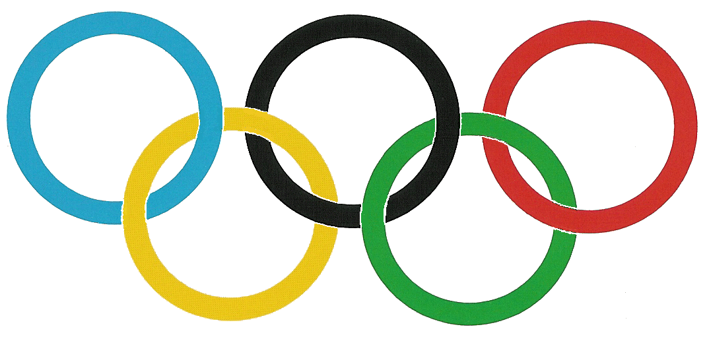

# Gesetz zum Schutz des olympischen Emblems und der olympischen Bezeichnungen (OlympSchG)

Ausfertigungsdatum
:   2004-03-31

Fundstelle
:   BGBl I: 2004, 479

Geändert durch
:   Art. 5 Abs. 8 G v. 10.10.2013 I 3799

## § 1 Gegenstand des Gesetzes

(1) Gegenstand dieses Gesetzes ist der Schutz des olympischen Emblems
und der olympischen Bezeichnungen.

(2) Das olympische Emblem ist das Symbol des Internationalen
Olympischen Komitees bestehend aus fünf ineinander verschlungenen
Ringen nach dem Muster der Anlage 1 (Olympische Ringe).

(3) Die olympischen Bezeichnungen sind die Wörter "Olympiade",
"Olympia", "olympisch", alle diese Wörter allein oder in
Zusammensetzung sowie die entsprechenden Wörter oder Wortgruppen in
einer anderen Sprache.

## § 2 Inhaber des Schutzrechts

Das ausschließliche Recht auf die Verwendung und Verwertung des
olympischen Emblems und der olympischen Bezeichnungen steht dem
Nationalen Olympischen Komitee für Deutschland und dem Internationalen
Olympischen Komitee zu.

## § 3 Rechtsverletzungen

(1) Dritten ist es untersagt, ohne Zustimmung der Inhaber des
Schutzrechts im geschäftlichen Verkehr das olympische Emblem

1.  zur Kennzeichnung von Waren oder Dienstleistungen,

2.  in der Werbung für Waren oder Dienstleistungen,

3.  als Firma, Geschäftsbezeichnung oder zur Bezeichnung einer
    Veranstaltung oder

4.  für Vereinsabzeichen oder Vereinsfahnen

zu verwenden. Satz 1 findet entsprechende Anwendung für Embleme, die
dem olympischen Emblem ähnlich sind, wenn wegen der Ähnlichkeit die
Gefahr von Verwechslungen besteht, einschließlich der Gefahr, dass das
Emblem mit den Olympischen Spielen oder der Olympischen Bewegung
gedanklich in Verbindung gebracht wird oder dass hierdurch die
Wertschätzung der Olympischen Spiele oder der Olympischen Bewegung
ohne rechtfertigenden Grund in unlauterer Weise ausgenutzt oder
beeinträchtigt wird.

(2) Dritten ist es untersagt, ohne Zustimmung der Inhaber des
Schutzrechts im geschäftlichen Verkehr die olympischen Bezeichnungen

1.  zur Kennzeichnung von Waren oder Dienstleistungen,

2.  in der Werbung für Waren oder Dienstleistungen oder

3.  als Firma, Geschäftsbezeichnung oder zur Bezeichnung einer
    gewerbsmäßigen Veranstaltung

zu verwenden, wenn hierdurch die Gefahr von Verwechslungen besteht,
einschließlich der Gefahr, dass die Bezeichnung mit den Olympischen
Spielen oder der Olympischen Bewegung gedanklich in Verbindung
gebracht wird oder wenn hierdurch die Wertschätzung der Olympischen
Spiele oder der Olympischen Bewegung ohne rechtfertigenden Grund in
unlauterer Weise ausgenutzt oder beeinträchtigt wird. Satz 1 findet
entsprechende Anwendung für Bezeichnungen, die den in § 1 Abs. 3
genannten ähnlich sind.

(3) Die Absätze 1 und 2 gelten nicht für die Kennzeichnung eines nach
§ 2 des Urheberrechtsgesetzes geschützten Werkes sowie für die Werbung
hierfür, wenn das Werk sich mit den Olympischen Spielen oder der
Olympischen Bewegung im weitesten Sinne befasst.

## § 4 Benutzung von Namen und beschreibenden Angaben

Die Inhaber des Schutzrechts haben nicht das Recht, einem Dritten zu
untersagen, im geschäftlichen Verkehr

1.  dessen Namen oder Anschrift zu benutzen oder

2.  die olympischen Bezeichnungen oder ähnliche Bezeichnungen als Angabe
    über Merkmale oder Eigenschaften von Waren, Dienstleistungen oder
    Personen zu benutzen,

sofern die Benutzung nicht unlauter ist.

## § 5 Unterlassungsanspruch; Schadensersatzanspruch

(1) Wer das olympische Emblem oder die olympischen Bezeichnungen
entgegen § 3 benutzt, kann von dem Nationalen Olympischen Komitee für
Deutschland oder dem Internationalen Olympischen Komitee auf
Unterlassung in Anspruch genommen werden.

(2) Wer die Verletzungshandlung vorsätzlich oder fahrlässig begeht,
ist dem Nationalen Olympischen Komitee für Deutschland und dem
Internationalen Olympischen Komitee zum Ersatz des diesen durch die
Verletzungshandlung entstandenen Schadens verpflichtet.

## § 6 Vernichtungsanspruch

Das Nationale Olympische Komitee für Deutschland und das
Internationale Olympische Komitee können in Fällen des § 3 verlangen,
dass die im Besitz oder Eigentum des Verletzers befindlichen,
widerrechtlich gekennzeichneten Gegenstände vernichtet werden, es sei
denn, dass der durch die Rechtsverletzung verursachte Zustand der
Gegenstände auf andere Weise beseitigt werden kann und die Vernichtung
für den Verletzer oder den Eigentümer im Einzelfall unverhältnismäßig
ist. Weitergehende Ansprüche auf Beseitigung bleiben unberührt.

## § 7 Verjährung

Auf die Verjährung der in den §§ 5 und 6 genannten Ansprüche finden
die Vorschriften des Abschnitts 5 des Ersten Buches Bürgerliches
Gesetzbuch entsprechende Anwendung.

## § 8 Fortgeltung bestehender Rechte

Rechte Dritter, die auf Grund gesetzlicher Bestimmungen, auf Grund
vertraglicher Vereinbarungen auf dem Gebiet des Vereins-, Marken-,
Design- und Handelsrechts oder auf Grund sonstiger vertraglicher
Vereinbarungen mit den Rechtsinhabern am 13. August 2003 bereits
bestehen, bleiben unberührt.

## § 9 Sachliche Zuständigkeit

(1) Für alle Klagen, durch die ein Anspruch auf Grund dieses Gesetzes
geltend gemacht wird, sind die Landgerichte ausschließlich zuständig.

(2) Die Landesregierungen werden ermächtigt, durch Rechtsverordnung
die Streitsachen im Sinne von Absatz 1 insgesamt oder teilweise für
die Bezirke mehrerer Landgerichte einem von ihnen zuzuweisen, sofern
dies der sachlichen Förderung oder der schnelleren Erledigung der
Verfahren dient. Die Landesregierungen können diese Ermächtigung auf
die Landesjustizverwaltungen übertragen.

## § 10 Inkrafttreten

§ 9 Abs. 2 tritt am Tag nach der Verkündung in Kraft; im Übrigen tritt
dieses Gesetz am ersten Tag des dritten auf die Verkündung folgenden
Kalendermonats in Kraft.

## Anlage 1

Das olympische Symbol besteht aus fünf ineinander verschlungenen
Ringen: blau, gelb, schwarz, grün und rot, die in dieser Reihenfolge
von links nach rechts angeordnet sind. Es besteht aus den olympischen
Ringen allein, unabhängig davon, ob sie einfarbig oder mehrfarbig
dargestellt werden.

