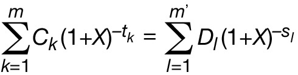
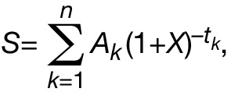

# Preisangabenverordnung (PAngV)

Ausfertigungsdatum
:   1985-03-14

Fundstelle
:   BGBl I: 1985, 580

Neugefasst durch
:   Bek. v. 18.10.2002 I 4197;

Zuletzt geändert durch
:   Art. 5 G v. 17.7.2017 I 2394

V aufgeh. durch
:   Art. 3 Satz 2 V v. 12.11.2021 BGBl I 2021, 4921 mWv 28.5.2022

Ersetzt durch
:   V 720-17-3 v. 12.11.2021 BGBl I 2021, 4921 (PAngV 2022)

Die Verordnung wurde als Art. 1 V v. 14.3.1985 I 580 auf Grund des
Art. 1 § 1 des Gesetzes zur Regelung der Preisangaben vom 3.12.1984 I
1429 u. auf Grund des § 34c Abs. 3 Satz 1 Nr. 6 der Gewerbeordnung vom
1\.1.1978 I 97 vom Bundesminister für Wirtschaft mit Zustimmung des
Bundesrates erlassen. Sie ist gem. Art. 4 V v. 14.3.1985 I 580 am
1\.5.1985 in Kraft getreten, § 4 u. § 7 Abs. 1 Nr. 1 Halbsatz 2 sind am
1\.9.1985 bzw. am 1.7.1985 in Kraft getreten.

## § 1 Grundvorschriften

(1) Wer Verbrauchern gemäß § 13 des Bürgerlichen Gesetzbuchs gewerbs-
oder geschäftsmäßig oder wer ihnen regelmäßig in sonstiger Weise Waren
oder Leistungen anbietet oder als Anbieter von Waren oder Leistungen
gegenüber Verbrauchern unter Angabe von Preisen wirbt, hat die Preise
anzugeben, die einschließlich der Umsatzsteuer und sonstiger
Preisbestandteile zu zahlen sind (Gesamtpreise). Soweit es der
allgemeinen Verkehrsauffassung entspricht, sind auch die Verkaufs-
oder Leistungseinheit und die Gütebezeichnung anzugeben, auf die sich
die Preise beziehen. Auf die Bereitschaft, über den angegebenen Preis
zu verhandeln, kann hingewiesen werden, soweit es der allgemeinen
Verkehrsauffassung entspricht und Rechtsvorschriften nicht
entgegenstehen.

(2) Wer Verbrauchern gewerbs- oder geschäftsmäßig oder wer ihnen
regelmäßig in sonstiger Weise Waren oder Leistungen zum Abschluss
eines Fernabsatzvertrages anbietet, hat zusätzlich zu Absatz 1 und § 2
Absatz 2 anzugeben,

1.  dass die für Waren oder Leistungen geforderten Preise die Umsatzsteuer
    und sonstige Preisbestandteile enthalten und

2.  ob zusätzlich Fracht-, Liefer- oder Versandkosten oder sonstige Kosten
    anfallen.

Fallen zusätzliche Fracht-, Liefer- oder Versandkosten oder sonstige
Kosten an, so ist deren Höhe anzugeben, soweit diese Kosten
vernünftigerweise im Voraus berechnet werden können.

(3) Bei Leistungen können, soweit es üblich ist, abweichend von Absatz
1 Satz 1 Stundensätze, Kilometersätze und andere Verrechnungssätze
angegeben werden, die alle Leistungselemente einschließlich der
anteiligen Umsatzsteuer enthalten. Die Materialkosten können in die
Verrechnungssätze einbezogen werden.

(4) Wird außer dem Entgelt für eine Ware oder Leistung eine
rückerstattbare Sicherheit gefordert, so ist deren Höhe neben dem
Preis für die Ware oder Leistung anzugeben und kein Gesamtbetrag zu
bilden.

(5) Die Angabe von Preisen mit einem Änderungsvorbehalt ist abweichend
von Absatz 1 Satz 1 nur zulässig

1.  bei Waren oder Leistungen, für die Liefer- oder Leistungsfristen von
    mehr als vier Monaten bestehen, soweit zugleich die voraussichtlichen
    Liefer- und Leistungsfristen angegeben werden, oder

2.  bei Waren oder Leistungen, die im Rahmen von Dauerschuldverhältnissen
    erbracht werden.

(6) Der in der Werbung, auf der Webseite oder in Prospekten eines
Reiseveranstalters angegebene Reisepreis kann abweichend von Absatz 1
Satz 1 nach Maßgabe des § 651d Absatz 3 Satz 1 des Bürgerlichen
Gesetzbuchs und des Artikels 250 § 1 Absatz 2 des Einführungsgesetzes
zum Bürgerlichen Gesetzbuche geändert werden.

(7) Die Angaben nach dieser Verordnung müssen der allgemeinen
Verkehrsauffassung und den Grundsätzen von Preisklarheit und
Preiswahrheit entsprechen. Wer zu Angaben nach dieser Verordnung
verpflichtet ist, hat diese dem Angebot oder der Werbung eindeutig
zuzuordnen sowie leicht erkennbar und deutlich lesbar oder sonst gut
wahrnehmbar zu machen. Bei der Aufgliederung von Preisen sind die
Gesamtpreise hervorzuheben.

## § 2 Grundpreis

(1) Wer Verbrauchern gewerbs- oder geschäftsmäßig oder wer ihnen
regelmäßig in sonstiger Weise Waren in Fertigpackungen, offenen
Packungen oder als Verkaufseinheiten ohne Umhüllung nach Gewicht,
Volumen, Länge oder Fläche anbietet, hat neben dem Gesamtpreis auch
den Preis je Mengeneinheit einschließlich der Umsatzsteuer und
sonstiger Preisbestandteile (Grundpreis) in unmittelbarer Nähe des
Gesamtpreises gemäß Absatz 3 Satz 1, 2, 4 oder 5 anzugeben. Dies gilt
auch für denjenigen, der als Anbieter dieser Waren gegenüber
Verbrauchern unter Angabe von Preisen wirbt. Auf die Angabe des
Grundpreises kann verzichtet werden, wenn dieser mit dem Gesamtpreis
identisch ist.

(2) Wer Verbrauchern gewerbs- oder geschäftsmäßig oder wer ihnen
regelmäßig in sonstiger Weise unverpackte Waren, die in deren
Anwesenheit oder auf deren Veranlassung abgemessen werden (lose Ware),
nach Gewicht, Volumen, Länge oder Fläche anbietet oder als Anbieter
dieser Waren gegenüber Verbrauchern unter Angabe von Preisen wirbt,
hat lediglich den Grundpreis gemäß Absatz 3 anzugeben.

(3) Die Mengeneinheit für den Grundpreis ist jeweils 1 Kilogramm, 1
Liter, 1 Kubikmeter, 1 Meter oder 1 Quadratmeter der Ware. Bei Waren,
deren Nenngewicht oder Nennvolumen üblicherweise 250 Gramm oder
Milliliter nicht übersteigt, dürfen als Mengeneinheit für den
Grundpreis 100 Gramm oder Milliliter verwendet werden. Bei nach
Gewicht oder nach Volumen angebotener loser Ware ist als Mengeneinheit
für den Grundpreis entsprechend der allgemeinen Verkehrsauffassung
entweder 1 Kilogramm oder 100 Gramm oder 1 Liter oder 100 Milliliter
zu verwenden. Bei Waren, die üblicherweise in Mengen von 100 Liter und
mehr, 50 Kilogramm und mehr oder 100 Meter und mehr abgegeben werden,
ist für den Grundpreis die Mengeneinheit zu verwenden, die der
allgemeinen Verkehrsauffassung entspricht. Bei Waren, bei denen das
Abtropfgewicht anzugeben ist, ist der Grundpreis auf das angegebene
Abtropfgewicht zu beziehen.

(4) Bei Haushaltswaschmitteln kann als Mengeneinheit für den
Grundpreis eine übliche Anwendung verwendet werden. Dies gilt auch für
Wasch- und Reinigungsmittel, sofern sie einzeln portioniert sind und
die Zahl der Portionen zusätzlich zur Gesamtfüllmenge angegeben ist.

## § 3 Elektrizität, Gas, Fernwärme und Wasser

Wer Verbrauchern gewerbs- oder geschäftsmäßig oder wer ihnen
regelmäßig in sonstiger Weise Elektrizität, Gas, Fernwärme oder Wasser
leitungsgebunden anbietet oder als Anbieter dieser Waren gegenüber
Verbrauchern unter Angabe von Preisen wirbt, hat den
verbrauchsabhängigen Preis je Mengeneinheit einschließlich der
Umsatzsteuer und aller spezifischen Verbrauchssteuern (Arbeits- oder
Mengenpreis) gemäß Satz 2 im Angebot oder in der Werbung anzugeben.
Als Mengeneinheit für den Arbeitspreis bei Elektrizität, Gas und
Fernwärme ist 1 Kilowattstunde und für den Mengenpreis bei Wasser 1
Kubikmeter zu verwenden. Wer neben dem Arbeits- oder Mengenpreis
leistungsabhängige Preise fordert, hat diese vollständig in
unmittelbarer Nähe des Arbeits- oder Mengenpreises anzugeben. Satz 3
gilt entsprechend für die Forderungen nicht verbrauchsabhängiger
Preise.

## § 4 Handel

(1) Waren, die in Schaufenstern, Schaukästen, innerhalb oder außerhalb
des Verkaufsraumes auf Verkaufsständen oder in sonstiger Weise
sichtbar ausgestellt werden, und Waren, die vom Verbraucher
unmittelbar entnommen werden können, sind durch Preisschilder oder
Beschriftung der Ware auszuzeichnen.

(2) Waren, die nicht unter den Voraussetzungen des Absatzes 1 im
Verkaufsraum zum Verkauf bereitgehalten werden, sind entweder nach
Absatz 1 auszuzeichnen oder dadurch, dass die Behältnisse oder Regale,
in denen sich die Waren befinden, beschriftet werden oder dass
Preisverzeichnisse angebracht oder zur Einsichtnahme aufgelegt werden.

(3) Waren, die nach Musterbüchern angeboten werden, sind dadurch
auszuzeichnen, dass die Preise für die Verkaufseinheit auf den Mustern
oder damit verbundenen Preisschildern oder Preisverzeichnissen
angegeben werden.

(4) Waren, die nach Katalogen oder Warenlisten oder auf Bildschirmen
angeboten werden, sind dadurch auszuzeichnen, dass die Preise
unmittelbar bei den Abbildungen oder Beschreibungen der Waren oder in
mit den Katalogen oder Warenlisten im Zusammenhang stehenden
Preisverzeichnissen angegeben werden.

(5) Auf Angebote von Waren, deren Preise üblicherweise auf Grund von
Tarifen oder Gebührenregelungen bemessen werden, ist § 5 Abs. 1 und 2
entsprechend anzuwenden.

## § 5 Leistungen

(1) Wer Leistungen anbietet, hat ein Preisverzeichnis mit den Preisen
für seine wesentlichen Leistungen oder in den Fällen des § 1 Abs. 3
mit seinen Verrechnungssätzen aufzustellen. Dieses ist im
Geschäftslokal oder am sonstigen Ort des Leistungsangebots und, sofern
vorhanden, zusätzlich im Schaufenster oder Schaukasten anzubringen.
Ort des Leistungsangebots ist auch die Bildschirmanzeige. Wird eine
Leistung über Bildschirmanzeige erbracht und nach Einheiten berechnet,
ist eine gesonderte Anzeige über den Preis der fortlaufenden Nutzung
unentgeltlich anzubieten.

(2) Werden entsprechend der allgemeinen Verkehrsauffassung die Preise
und Verrechnungssätze für sämtliche angebotenen Leistungen in
Preisverzeichnisse aufgenommen, so sind diese zur Einsichtnahme am Ort
des Leistungsangebots bereitzuhalten, wenn das Anbringen der
Preisverzeichnisse wegen ihres Umfangs nicht zumutbar ist.

(3) Werden die Leistungen in Fachabteilungen von Handelsbetrieben
angeboten, so genügt das Anbringen der Preisverzeichnisse in den
Fachabteilungen.

## § 6 Verbraucherdarlehen

(1) Wer Verbrauchern gewerbs- oder geschäftsmäßig oder wer ihnen
regelmäßig in sonstiger Weise den Abschluss von Verbraucherdarlehen im
Sinne des § 491 des Bürgerlichen Gesetzbuchs anbietet, hat als Preis
die nach den Absätzen 2 bis 6 und 8 berechneten Gesamtkosten des
Verbraucherdarlehens für den Verbraucher, ausgedrückt als jährlicher
Prozentsatz des Nettodarlehensbetrags, soweit zutreffend,
einschließlich der Kosten gemäß Absatz 3 Satz 2 Nummer 1, anzugeben
und als effektiven Jahreszins zu bezeichnen.

(2) Der anzugebende effektive Jahreszins gemäß Absatz 1 ist mit der in
der Anlage angegebenen mathematischen Formel und nach den in der
Anlage zugrunde gelegten Vorgehensweisen zu berechnen. Bei der
Berechnung des effektiven Jahreszinses wird von der Annahme
ausgegangen, dass der Verbraucherdarlehensvertrag für den vereinbarten
Zeitraum gilt und dass Darlehensgeber und Verbraucher ihren
Verpflichtungen zu den im Verbraucherdarlehensvertrag niedergelegten
Bedingungen und Terminen nachkommen.

(3) In die Berechnung des anzugebenden effektiven Jahreszinses sind
als Gesamtkosten die vom Verbraucher zu entrichtenden Zinsen und alle
sonstigen Kosten einschließlich etwaiger Vermittlungskosten
einzubeziehen, die der Verbraucher im Zusammenhang mit dem
Verbraucherdarlehensvertrag zu entrichten hat und die dem
Darlehensgeber bekannt sind. Zu den sonstigen Kosten gehören:

1.  Kosten für die Eröffnung und Führung eines spezifischen Kontos, Kosten
    für die Verwendung eines Zahlungsmittels, mit dem sowohl Geschäfte auf
    diesem Konto getätigt als auch Verbraucherdarlehensbeträge in Anspruch
    genommen werden können, sowie sonstige Kosten für Zahlungsgeschäfte,
    wenn die Eröffnung oder Führung eines Kontos Voraussetzung dafür ist,
    dass das Verbraucherdarlehen überhaupt oder nach den vorgesehenen
    Vertragsbedingungen gewährt wird;

2.  Kosten für die Immobilienbewertung, sofern eine solche Bewertung für
    die Gewährung des Verbraucherdarlehens erforderlich ist.

(4) Nicht in die Berechnung der Gesamtkosten einzubeziehen sind,
soweit zutreffend:

1.  Kosten, die vom Verbraucher bei Nichterfüllung seiner Verpflichtungen
    aus dem Verbraucherdarlehensvertrag zu tragen sind;

2.  Kosten für solche Versicherungen und für solche anderen
    Zusatzleistungen, die keine Voraussetzung für die
    Verbraucherdarlehensvergabe oder für die Verbraucherdarlehensvergabe
    zu den vorgesehenen Vertragsbedingungen sind;

3.  Kosten mit Ausnahme des Kaufpreises, die vom Verbraucher beim Erwerb
    von Waren oder Dienstleistungen unabhängig davon zu tragen sind, ob es
    sich um ein Bar- oder Verbraucherdarlehensgeschäft handelt;

4.  Gebühren für die Eintragung der Eigentumsübertragung oder der
    Übertragung eines grundstücksgleichen Rechts in das Grundbuch;

5.  Notarkosten.

(5) Ist eine Änderung des Zinssatzes oder sonstiger in die Berechnung
des anzugebenden effektiven Jahreszinses einzubeziehender Kosten
vorbehalten und ist ihre zahlenmäßige Bestimmung im Zeitpunkt der
Berechnung des anzugebenden effektiven Jahreszinses nicht möglich, so
wird bei der Berechnung von der Annahme ausgegangen, dass der
Sollzinssatz und die sonstigen Kosten gemessen an der ursprünglichen
Höhe fest bleiben und bis zum Ende des Verbraucherdarlehensvertrags
gelten.

(6) Erforderlichenfalls ist bei der Berechnung des anzugebenden
effektiven Jahreszinses von den in der Anlage niedergelegten Annahmen
auszugehen.

(7) Ist der Abschluss eines Vertrags über die Inanspruchnahme einer
Nebenleistung, insbesondere eines Versicherungsvertrags oder allgemein
einer Mitgliedschaft, zwingende Voraussetzung dafür, dass das
Verbraucherdarlehen überhaupt oder nach den vorgesehenen
Vertragsbedingungen gewährt wird, und können die Kosten der
Nebenleistung nicht im Voraus bestimmt werden, so ist in klarer,
eindeutiger und auffallender Art und Weise darauf hinzuweisen,

1.  dass eine Verpflichtung zum Abschluss des Vertrages über die
    Nebenleistung besteht und

2.  wie hoch der effektive Jahreszins des Verbraucherdarlehens ist.

(8) Bei Bauspardarlehen ist bei der Berechnung des anzugebenden
effektiven Jahreszinses davon auszugehen, dass im Zeitpunkt der
Verbraucherdarlehensauszahlung das vertragliche Mindestsparguthaben
angespart ist. Von der Abschlussgebühr ist im Zweifel lediglich der
Teil zu berücksichtigen, der auf den Verbraucherdarlehensanteil der
Bausparvertragssumme entfällt. Bei Verbraucherdarlehen, die der Vor-
oder Zwischenfinanzierung von Leistungen einer Bausparkasse aus
Bausparverträgen dienen und deren preisbestimmende Faktoren bis zur
Zuteilung unveränderbar sind, ist als Laufzeit von den
Zuteilungsfristen auszugehen, die sich aus der Zielbewertungszahl für
Bausparverträge gleicher Art ergeben. Bei vor- oder
zwischenfinanzierten Bausparverträgen gemäß Satz 3 ist für das
Gesamtprodukt aus Vor- oder Zwischenfinanzierungsdarlehen und
Bausparvertrag der effektive Jahreszins für die Gesamtlaufzeit
anzugeben.

## § 6a Werbung für Verbraucherdarlehen

(1) Jegliche Kommunikation für Werbe- und Marketingzwecke, die
Verbraucherdarlehen betrifft, hat den Kriterien der Redlichkeit und
Eindeutigkeit zu genügen und darf nicht irreführend sein. Insbesondere
sind Formulierungen unzulässig, die beim Verbraucher falsche
Erwartungen in Bezug auf die Möglichkeit, ein Verbraucherdarlehen zu
erhalten oder in Bezug auf die Kosten eines Verbraucherdarlehens
wecken.

(2) Wer gegenüber Verbrauchern für den Abschluss eines
Verbraucherdarlehensvertrags mit Zinssätzen oder sonstigen Zahlen, die
die Kosten betreffen, wirbt, hat in klarer, eindeutiger und
auffallender Art und Weise anzugeben:

1.  die Identität und Anschrift des Darlehensgebers oder gegebenenfalls
    des Darlehensvermittlers,

2.  den Nettodarlehensbetrag,

3.  den Sollzinssatz und die Auskunft, ob es sich um einen festen oder
    einen variablen Zinssatz oder um eine Kombination aus beiden handelt,
    sowie Einzelheiten aller für den Verbraucher anfallenden, in die
    Gesamtkosten einbezogenen Kosten,

4.  den effektiven Jahreszins.

In der Werbung ist der effektive Jahreszins mindestens genauso
hervorzuheben wie jeder andere Zinssatz.

(3) In der Werbung gemäß Absatz 2 sind zusätzlich, soweit zutreffend,
folgende Angaben zu machen:

1.  der vom Verbraucher zu zahlende Gesamtbetrag,

2.  die Laufzeit des Verbraucherdarlehensvertrags,

3.  die Höhe der Raten,

4.  die Anzahl der Raten,

5.  bei Immobiliar-Verbraucherdarlehen der Hinweis, dass der
    Verbraucherdarlehensvertrag durch ein Grundpfandrecht oder eine
    Reallast besichert wird,

6.  bei Immobiliar-Verbraucherdarlehen in Fremdwährung ein Warnhinweis,
    dass sich mögliche Wechselkursschwankungen auf die Höhe des vom
    Verbraucher zu zahlenden Gesamtbetrags auswirken könnten.

(4) Die in den Absätzen 2 und 3 genannten Angaben sind mit Ausnahme
der Angaben nach Absatz 2 Satz 1 Nummer 1 und Absatz 3 Nummer 5 und 6
mit einem Beispiel zu versehen. Bei der Auswahl des Beispiels muss der
Werbende von einem effektiven Jahreszins ausgehen, von dem er erwarten
darf, dass er mindestens zwei Drittel der auf Grund der Werbung
zustande kommenden Verträge zu dem angegebenen oder einem niedrigeren
effektiven Jahreszins abschließen wird.

(5) Verlangt der Werbende den Abschluss eines Versicherungsvertrags
oder eines Vertrags über andere Zusatzleistungen und können die Kosten
für diesen Vertrag nicht im Voraus bestimmt werden, ist auf die
Verpflichtung zum Abschluss dieses Vertrags klar und verständlich an
gestalterisch hervorgehobener Stelle zusammen mit dem effektiven
Jahreszins hinzuweisen.

(6) Die Informationen nach den Absätzen 2, 3 und 5 müssen in
Abhängigkeit vom Medium, das für die Werbung gewählt wird, akustisch
gut verständlich oder deutlich lesbar sein.

(7) Auf Immobiliar-Verbraucherdarlehensverträge gemäß § 491 Absatz 2
Satz 2 Nummer 5 des Bürgerlichen Gesetzbuchs ist nur Absatz 1
anwendbar.

## § 6b Überziehungsmöglichkeiten

Bei Überziehungsmöglichkeiten im Sinne des § 504 Abs. 2 des
Bürgerlichen Gesetzbuchs hat der Darlehensgeber statt des effektiven
Jahreszinses den Sollzinssatz pro Jahr und die Zinsbelastungsperiode
anzugeben, wenn diese nicht kürzer als drei Monate ist und der
Darlehensgeber außer den Sollzinsen keine weiteren Kosten verlangt.

## § 6c Entgeltliche Finanzierungshilfen

Die §§ 6 und 6a sind auf Verträge entsprechend anzuwenden, durch die
ein Unternehmer einem Verbraucher einen entgeltlichen Zahlungsaufschub
oder eine sonstige entgeltliche Finanzierungshilfe im Sinne des § 506
des Bürgerlichen Gesetzbuchs gewährt.

## § 7 Gaststätten, Beherbergungsbetriebe

(1) In Gaststätten und ähnlichen Betrieben, in denen Speisen oder
Getränke angeboten werden, sind die Preise in Preisverzeichnissen
anzugeben. Die Preisverzeichnisse sind entweder auf Tischen aufzulegen
oder jedem Gast vor Entgegennahme von Bestellungen und auf Verlangen
bei Abrechnung vorzulegen oder gut lesbar anzubringen. Werden Speisen
und Getränke gemäß § 4 Abs. 1 angeboten, so muss die Preisangabe
dieser Vorschrift entsprechen.

(2) Neben dem Eingang der Gaststätte ist ein Preisverzeichnis
anzubringen, aus dem die Preise für die wesentlichen angebotenen
Speisen und Getränke ersichtlich sind. Ist der Gaststättenbetrieb Teil
eines Handelsbetriebes, so genügt das Anbringen des
Preisverzeichnisses am Eingang des Gaststättenteils.

(3) In Beherbergungsbetrieben ist beim Eingang oder bei der
Anmeldestelle des Betriebes an gut sichtbarer Stelle ein Verzeichnis
anzubringen oder auszulegen, aus dem die Preise der im Wesentlichen
angebotenen Zimmer und gegebenenfalls der Frühstückspreis ersichtlich
sind.

(4) Kann in Gaststätten- und Beherbergungsbetrieben eine
Telekommunikationsanlage benutzt werden, so ist der bei Benutzung
geforderte Preis je Minute oder je Benutzung in der Nähe der
Telekommunikationsanlage anzugeben.

(5) Die in den Preisverzeichnissen aufgeführten Preise müssen das
Bedienungsgeld und sonstige Zuschläge einschließen.

## § 8 Tankstellen, Parkplätze

(1) An Tankstellen sind die Kraftstoffpreise so auszuzeichnen, dass
sie

1.  für den auf der Straße heranfahrenden Kraftfahrer,

2.  auf Bundesautobahnen für den in den Tankstellenbereich einfahrenden
    Kraftfahrer

deutlich lesbar sind. Dies gilt nicht für Kraftstoffmischungen, die
erst in der Tankstelle hergestellt werden.

(2) Wer für weniger als einen Monat Garagen, Einstellplätze oder
Parkplätze vermietet oder bewacht oder Kraftfahrzeuge verwahrt, hat am
Anfang der Zufahrt ein Preisverzeichnis anzubringen, aus dem die von
ihm geforderten Preise ersichtlich sind.

## § 9 Ausnahmen

(1) Die Vorschriften dieser Verordnung sind nicht anzuwenden

1.  auf Angebote oder Werbung gegenüber Verbrauchern, die die Ware oder
    Leistung in ihrer selbständigen beruflichen oder gewerblichen oder in
    ihrer behördlichen oder dienstlichen Tätigkeit verwenden; für
    Handelsbetriebe gilt dies nur, wenn sie sicherstellen, dass als
    Verbraucher ausschließlich die in Halbsatz 1 genannten Personen
    Zutritt haben, und wenn sie durch geeignete Maßnahmen dafür Sorge
    tragen, dass diese Personen nur die in ihrer jeweiligen Tätigkeit
    verwendbaren Waren kaufen;

2.  auf Leistungen von Gebietskörperschaften des öffentlichen Rechts,
    soweit es sich nicht um Leistungen handelt, für die Benutzungsgebühren
    oder privat-rechtliche Entgelte zu entrichten sind;

3.  auf Waren und Leistungen, soweit für sie auf Grund von
    Rechtsvorschriften eine Werbung untersagt ist;

4.  auf mündliche Angebote, die ohne Angabe von Preisen abgegeben werden;

5.  auf Warenangebote bei Versteigerungen.

(2) § 1 Abs. 1 und § 2 Abs. 1 sind nicht anzuwenden auf individuelle
Preisnachlässe sowie auf nach Kalendertagen zeitlich begrenzte und
durch Werbung bekannt gemachte generelle Preisnachlässe.

(3) § 1 Abs. 2 ist nicht anzuwenden auf die in § 312 Absatz 2 Nummer
2, 3, 6, 9 und 10 und Absatz 6 des Bürgerlichen Gesetzbuchs genannten
Verträge.

(4) § 2 Abs. 1 ist nicht anzuwenden auf Waren, die

1.  über ein Nenngewicht oder Nennvolumen von weniger als 10 Gramm oder
    Milliliter verfügen;

2.  verschiedenartige Erzeugnisse enthalten, die nicht miteinander
    vermischt oder vermengt sind;

3.  von kleinen Direktvermarktern sowie kleinen Einzelhandelsgeschäften
    angeboten werden, bei denen die Warenausgabe überwiegend im Wege der
    Bedienung erfolgt, es sei denn, dass das Warensortiment im Rahmen
    eines Vertriebssystems bezogen wird;

4.  im Rahmen einer Dienstleistung angeboten werden;

5.  in Getränke- und Verpflegungsautomaten angeboten werden.

(5) § 2 Abs. 1 ist ferner nicht anzuwenden bei

1.  Kau- und Schnupftabak mit einem Nenngewicht bis 25 Gramm;

2.  kosmetischen Mitteln, die ausschließlich der Färbung oder
    Verschönerung der Haut, des Haares oder der Nägel dienen;

3.  Parfüms und parfümierten Duftwässern, die mindestens 3 Volumenprozent
    Duftöl und mindestens 70 Volumenprozent reinen Äthylalkohol enthalten.

(6) Die Angabe eines neuen Grundpreises nach § 2 Abs. 1 ist nicht
erforderlich bei

1.  Waren ungleichen Nenngewichts oder -volumens oder ungleicher Nennlänge
    oder -fläche mit gleichem Grundpreis, wenn der geforderte Gesamtpreis
    um einen einheitlichen Betrag herabgesetzt wird;

2.  leicht verderblichen Lebensmitteln, wenn der geforderte Gesamtpreis
    wegen einer drohenden Gefahr des Verderbs herabgesetzt wird.

(7) § 4 ist nicht anzuwenden

1.  auf Kunstgegenstände, Sammlungsstücke und Antiquitäten im Sinne des
    Kapitels 97 des Gemeinsamen Zolltarifs;

2.  auf Waren, die in Werbevorführungen angeboten werden, sofern der Preis
    der jeweiligen Ware bei deren Vorführung und unmittelbar vor Abschluss
    des Kaufvertrags genannt wird;

3.  auf Blumen und Pflanzen, die unmittelbar vom Freiland, Treibbeet oder
    Treibhaus verkauft werden.

(8) § 5 ist nicht anzuwenden

1.  auf Leistungen, die üblicherweise aufgrund von schriftlichen Angeboten
    oder schriftlichen Voranschlägen erbracht werden, die auf den
    Einzelfall abgestellt sind;

2.  auf künstlerische, wissenschaftliche und pädagogische Leistungen; dies
    gilt nicht, wenn die Leistungen in Konzertsälen, Theatern,
    Filmtheatern, Schulen, Instituten oder dergleichen erbracht werden;

3.  auf Leistungen, bei denen in Gesetzen oder Rechtsverordnungen die
    Angabe von Preisen besonders geregelt ist.

## § 10 Ordnungswidrigkeiten

(1) Ordnungswidrig im Sinne des § 3 Abs. 1 Nr. 2 des
Wirtschaftsstrafgesetzes 1954 handelt, wer vorsätzlich oder fahrlässig

1.  entgegen § 1 Abs. 1 Satz 1 Preise nicht, nicht richtig oder nicht
    vollständig angibt,

2.  entgegen § 1 Abs. 1 Satz 2 die Verkaufs- oder Leistungseinheit oder
    Gütebezeichnung nicht oder nicht richtig angibt, auf die sich die
    Preise beziehen,

3.  entgegen § 1 Abs. 2 Satz 1 Nr. 1 eine Angabe nicht, nicht richtig oder
    nicht vollständig macht,

4.  entgegen § 1 Abs. 3 Satz 1 Stundensätze, Kilometersätze oder andere
    Verrechnungssätze nicht richtig angibt,

5.  entgegen § 1 Abs. 4 oder 7 Satz 2 Angaben nicht in der dort
    vorgeschriebenen Form macht,

6.  entgegen § 1 Absatz 7 Satz 3 den Gesamtpreis nicht hervorhebt oder

7.  entgegen § 2 Abs. 1 Satz 1, auch in Verbindung mit Satz 2, oder § 2
    Abs. 2 oder § 3 Satz 1 oder 3, auch in Verbindung mit Satz 4, eine
    Angabe nicht, nicht richtig oder nicht vollständig macht.

(2) Ordnungswidrig im Sinne des § 3 Abs. 1 Nr. 2 des
Wirtschaftsstrafgesetzes 1954 handelt auch, wer vorsätzlich oder
fahrlässig einer Vorschrift

1.  des § 4 Abs. 1 bis 4 über das Auszeichnen von Waren,

2.  des § 5 Abs. 1 Satz 1, 2 oder 4 oder Abs. 2, jeweils auch in
    Verbindung mit § 4 Abs. 5, über das Aufstellen, das Anbringen oder das
    Bereithalten von Preisverzeichnissen oder über das Anbieten einer
    Anzeige des Preises,

3.  des § 6 Absatz 1 über die Angabe oder die Bezeichnung des Preises bei
    Verbraucherdarlehen,

4.  des § 6 Absatz 7 oder § 6b über die Angabe von Voraussetzungen für die
    Verbraucherdarlehensgewährung oder des Zinssatzes oder der
    Zinsbelastungsperiode,

5.  des § 6a Absatz 2 Satz 1 oder Absatz 3 über die Pflichtangaben in der
    Werbung,

6.  des § 7 Abs. 1 Satz 1 oder 2, Abs. 2 Satz 1, Abs. 3 oder 4 über die
    Angabe von Preisen oder über das Auflegen, das Vorlegen, das Anbringen
    oder das Auslegen eines dort genannten Verzeichnisses,

7.  des § 8 Abs. 1 Satz 1 über das Auszeichnen von Kraftstoffpreisen oder

8.  des § 8 Abs. 2 über das Anbringen eines Preisverzeichnisses

zuwiderhandelt.

(3) Ordnungswidrig im Sinne des § 3 Abs. 1 Satz 1 Nr. 3 des
Wirtschaftsstrafgesetzes 1954 handelt, wer vorsätzlich oder fahrlässig
entgegen § 1 Abs. 2 Satz 1 Nr. 2 oder Satz 2 eine Angabe nicht, nicht
richtig oder nicht vollständig macht.

## § 11

(weggefallen)

## Anlage (zu § 6)

(Fundstelle: BGBl. I 2016, 439 — 441)

## Berechnung des effektiven Jahreszinses

1.  Grundgleichung zur Darstellung der Gleichheit zwischen
    Verbraucherdarlehens-Auszahlungsbeträgen einerseits und Rückzahlungen
    (Tilgung, Zinsen und Verbraucherdarlehenskosten) andererseits.

    Die nachstehende Gleichung zur Ermittlung des effektiven Jahreszinses
    drückt auf jährlicher Basis die rechnerische Gleichheit zwischen der
    Summe der Gegenwartswerte der in Anspruch genommenen
    Verbraucherdarlehens-Auszahlungsbeträge einerseits und der Summe der
    Gegenwartswerte der Rückzahlungen (Tilgung, Zinsen und
    Verbraucherdarlehenskosten) andererseits aus:

    *        *            

   Hierbei ist

    –   X der effektive Jahreszins;

    –   m die laufende Nummer des letzten Verbraucherdarlehens-
        Auszahlungsbetrags;

    –   k die laufende Nummer eines Verbraucherdarlehens-Auszahlungsbetrags,
        wobei 1*                          k*                          m;

    –   C
        k                          die Höhe des Verbraucherdarlehens-
        Auszahlungsbetrags mit der Nummer k;

    –   t
        k                          der in Jahren oder Jahresbruchteilen
        ausgedrückte Zeitraum zwischen der ersten Verbraucherdarlehensvergabe
        und dem Zeitpunkt der einzelnen nachfolgenden in Anspruch genommenen
        Verbraucherdarlehens-Auszahlungsbeträge, wobei t
        1                          = 0;

    –   m´ die laufende Nummer der letzten Tilgungs-, Zins- oder
        Kostenzahlung;

    –   l die laufende Nummer einer Tilgungs-, Zins- oder Kostenzahlung;

    –   D
        l                          der Betrag einer Tilgungs-, Zins- oder
        Kostenzahlung;

    –   s
        l                          der in Jahren oder Jahresbruchteilen
        ausgedrückte Zeitraum zwischen dem Zeitpunkt der Inanspruchnahme des
        ersten Verbraucherdarlehens-Auszahlungsbetrags und dem Zeitpunkt jeder
        einzelnen Tilgungs-, Zins- oder Kostenzahlung.

    Anmerkungen:

    a)  Die von beiden Seiten zu unterschiedlichen Zeitpunkten gezahlten
        Beträge sind nicht notwendigerweise gleich groß und werden nicht
        notwendigerweise in gleichen Zeitabständen entrichtet.

    b)  Anfangszeitpunkt ist der Tag der Auszahlung des ersten
        Verbraucherdarlehensbetrags.

    c)  Der Zeitraum zwischen diesen Zeitpunkten wird in Jahren oder
        Jahresbruchteilen ausgedrückt. Zugrunde gelegt werden für ein Jahr 365
        Tage (bzw. für ein Schaltjahr 366 Tage), 52 Wochen oder zwölf
        Standardmonate. Ein Standardmonat hat 30,41666 Tage (d. h. 365/12),
        unabhängig davon, ob es sich um ein Schaltjahr handelt oder nicht.

        Können die Zeiträume zwischen den in den Berechnungen verwendeten
        Zeitpunkten nicht als ganze Zahl von Wochen, Monaten oder Jahren
        ausgedrückt werden, so sind sie als ganze Zahl eines dieser
        Zeitabschnitte in Kombination mit einer Anzahl von Tagen auszudrücken.
        Bei der Verwendung von Tagen

        aa) werden alle Tage einschließlich Wochenenden und Feiertagen gezählt;

        bb) werden gleich lange Zeitabschnitte und dann Tage bis zur
            Inanspruchnahme des ersten Verbraucherdarlehensbetrags zurückgezählt;

        cc) wird die Länge des in Tagen bemessenen Zeitabschnitts ohne den ersten
            und einschließlich des letzten Tages berechnet und in Jahren
            ausgedrückt, indem dieser Zeitabschnitt durch die Anzahl von Tagen des
            gesamten Jahres (365 oder 366 Tage), zurückgezählt ab dem letzten Tag
            bis zum gleichen Tag des Vorjahres, geteilt wird.

    d)  Das Rechenergebnis wird auf zwei Dezimalstellen genau angegeben. Ist
        die Ziffer der dritten Dezimalstelle größer als oder gleich 5, so
        erhöht sich die Ziffer der zweiten Dezimalstelle um den Wert 1.

    e)  Mathematisch darstellen lässt sich diese Gleichung durch eine einzige
        Summation unter Verwendung des Faktors „Ströme“ (A
        k                         ), die entweder positiv oder negativ sind,
        je nachdem, ob sie für Auszahlungen oder für Rückzahlungen innerhalb
        der Perioden 1 bis n, ausgedrückt in Jahren, stehen:

        *            *                

   dabei ist S der Saldo der Gegenwartswerte aller „Ströme“, deren Wert
        gleich null sein muss, damit die Gleichheit zwischen den „Strömen“
        gewahrt bleibt.

2.  Es gelten die folgenden zusätzlichen Annahmen für die Berechnung des
    effektiven Jahreszinses:

    a)  Ist dem Verbraucher nach dem Verbraucherdarlehensvertrag freigestellt,
        wann er das Verbraucherdarlehen in Anspruch nehmen will, so gilt das
        gesamte Verbraucherdarlehen als sofort in voller Höhe in Anspruch
        genommen.

    b)  Ist dem Verbraucher nach dem Verbraucherdarlehensvertrag generell
        freigestellt, wann er das Verbraucherdarlehen in Anspruch nehmen will,
        sind jedoch je nach Art der Inanspruchnahme Beschränkungen in Bezug
        auf Verbraucherdarlehensbetrag und Zeitraum vorgesehen, so gilt das
        gesamte Verbraucherdarlehen als zu dem im Verbraucherdarlehensvertrag
        vorgesehenen frühestmöglichen Zeitpunkt mit den entsprechenden
        Beschränkungen in Anspruch genommen.

    c)  Sieht der Verbraucherdarlehensvertrag verschiedene Arten der
        Inanspruchnahme mit unterschiedlichen Kosten oder Sollzinssätzen vor,
        so gilt das gesamte Verbraucherdarlehen als zu den höchsten Kosten und
        zum höchsten Sollzinssatz in Anspruch genommen, wie sie für die
        Kategorie von Geschäften gelten, die bei dieser Art von
        Verbraucherdarlehensverträgen am häufigsten vorkommt.

    d)  Bei einer Überziehungsmöglichkeit gilt das gesamte Verbraucherdarlehen
        als in voller Höhe und für die gesamte Laufzeit des
        Verbraucherdarlehensvertrags in Anspruch genommen. Ist die Dauer der
        Überziehungsmöglichkeit nicht bekannt, so ist bei der Berechnung des
        effektiven Jahreszinses von der Annahme auszugehen, dass die Laufzeit
        des Verbraucherdarlehensvertrags drei Monate beträgt.

    e)  Bei einem Überbrückungsdarlehen gilt das gesamte Verbraucherdarlehen
        als in voller Höhe und für die gesamte Laufzeit des
        Verbraucherdarlehensvertrags in Anspruch genommen. Ist die Laufzeit
        des Verbraucherdarlehensvertrags nicht bekannt, so wird bei der
        Berechnung des effektiven Jahreszinses von der Annahme ausgegangen,
        dass sie zwölf Monate beträgt.

    f)  Bei einem unbefristeten Verbraucherdarlehensvertrag, der weder eine
        Überziehungsmöglichkeit noch ein Überbrückungsdarlehen beinhaltet,
        wird angenommen, dass

        aa) das Verbraucherdarlehen bei Immobiliar-Verbraucherdarlehensverträgen
            für einen Zeitraum von 20 Jahren ab der ersten Inanspruchnahme gewährt
            wird und dass mit der letzten Zahlung des Verbrauchers der Saldo, die
            Zinsen und etwaige sonstige Kosten ausgeglichen sind; bei Allgemein-
            Verbraucherdarlehensverträgen, die nicht für den Erwerb oder die
            Erhaltung von Rechten an Immobilien bestimmt sind oder bei denen das
            Verbraucherdarlehen im Rahmen von Debit-Karten mit Zahlungsaufschub
            oder Kreditkarten in Anspruch genommen wird, dieser Zeitraum ein Jahr
            beträgt und dass mit der letzten Zahlung des Verbrauchers der Saldo,
            die Zinsen und etwaige sonstige Kosten ausgeglichen sind;

        bb) der Verbraucherdarlehensbetrag in gleich hohen monatlichen Zahlungen,
            beginnend einen Monat nach dem Zeitpunkt der ersten Inanspruchnahme,
            zurückgezahlt wird; muss der Verbraucherdarlehensbetrag jedoch
            vollständig, in Form einer einmaligen Zahlung, innerhalb jedes
            Zahlungszeitraums zurückgezahlt werden, so ist anzunehmen, dass
            spätere Inanspruchnahmen und Rückzahlungen des gesamten
            Verbraucherdarlehensbetrags durch den Verbraucher innerhalb eines
            Jahres stattfinden; Zinsen und sonstige Kosten werden entsprechend
            diesen Inanspruchnahmen und Tilgungszahlungen und nach den
            Bestimmungen des Verbraucherdarlehensvertrags festgelegt.

        Als unbefristete Verbraucherdarlehensverträge gelten für die Zwecke
        dieses Buchstabens Verbraucherdarlehensverträge ohne feste Laufzeit,
        einschließlich solcher Verbraucherdarlehen, bei denen der
        Verbraucherdarlehensbetrag innerhalb oder nach Ablauf eines Zeitraums
        vollständig zurückgezahlt werden muss, dann aber erneut in Anspruch
        genommen werden kann.

    g)  Bei Verbraucherdarlehensverträgen, die weder Überziehungsmöglichkeiten
        beinhalten noch Überbrückungsdarlehen, Verbraucherdarlehensverträge
        mit Wertbeteiligung, Eventualverpflichtungen oder Garantien sind, und
        bei unbefristeten Verbraucherdarlehensverträgen (siehe die Annahmen
        unter den Buchstaben d, e, f, l und m) gilt Folgendes:

        aa) Lassen sich der Zeitpunkt oder die Höhe einer vom Verbraucher zu
            leistenden Tilgungszahlung nicht feststellen, so ist anzunehmen, dass
            die Rückzahlung zu dem im Verbraucherdarlehensvertrag genannten
            frühestmöglichen Zeitpunkt und in der darin festgelegten geringsten
            Höhe erfolgt.

        bb) Lässt sich der Zeitraum zwischen der ersten Inanspruchnahme und der
            ersten vom Verbraucher zu leistenden Zahlung nicht feststellen, so
            wird der kürzestmögliche Zeitraum angenommen.

        cc) Ist der Zeitpunkt des Abschlusses des Verbraucherdarlehensvertrags
            nicht bekannt, so ist anzunehmen, dass das Verbraucherdarlehen
            erstmals zu dem Zeitpunkt in Anspruch genommen wurde, der sich aus dem
            kürzesten zeitlichen Abstand zwischen diesem Zeitpunkt und der
            Fälligkeit der ersten vom Verbraucher zu leistenden Zahlung ergibt.

    h)  Lassen sich der Zeitpunkt oder die Höhe einer vom Verbraucher zu
        leistenden Zahlung nicht anhand des Verbraucherdarlehensvertrags oder
        der Annahmen nach den Buchstaben d, e, f, g, l oder m feststellen, so
        ist anzunehmen, dass die Zahlung in Übereinstimmung mit den vom
        Darlehensgeber bestimmten Fristen und Bedingungen erfolgt und dass,
        falls diese nicht bekannt sind,

        aa) die Zinszahlungen zusammen mit den Tilgungszahlungen erfolgen,

        bb) Zahlungen für Kosten, die keine Zinsen sind und die als Einmalbetrag
            ausgedrückt sind, bei Abschluss des Verbraucherdarlehensvertrags
            erfolgen,

        cc) Zahlungen für Kosten, die keine Zinsen sind und die als
            Mehrfachzahlungen ausgedrückt sind, beginnend mit der ersten
            Tilgungszahlung in regelmäßigen Abständen erfolgen und es sich, falls
            die Höhe dieser Zahlungen nicht bekannt ist, um jeweils gleich hohe
            Beträge handelt,

        dd) mit der letzten Zahlung der Saldo, die Zinsen und etwaige sonstige
            Kosten ausgeglichen sind.

    i)  Ist keine Verbraucherdarlehensobergrenze vereinbart, ist anzunehmen,
        dass die Obergrenze des gewährten Verbraucherdarlehens 170 000 Euro
        beträgt. Bei Verbraucherdarlehensverträgen, die weder
        Eventualverpflichtungen noch Garantien sind und die nicht für den
        Erwerb oder die Erhaltung eines Rechts an Wohnimmobilien oder
        Grundstücken bestimmt sind, sowie bei Überziehungsmöglichkeiten,
        Debit-Karten mit Zahlungsaufschub oder Kreditkarten ist anzunehmen,
        dass die Obergrenze des gewährten Verbraucherdarlehens 1 500 Euro
        beträgt.

    j)  Werden für einen begrenzten Zeitraum oder Betrag verschiedene
        Sollzinssätze und Kosten angeboten, so sind während der gesamten
        Laufzeit des Verbraucherdarlehensvertrags der höchste Sollzinssatz und
        die höchsten Kosten anzunehmen.

    k)  Bei Verbraucherdarlehensverträgen, bei denen für den Anfangszeitraum
        ein fester Sollzinssatz vereinbart wurde, nach dessen Ablauf ein neuer
        Sollzinssatz festgelegt wird, der anschließend in regelmäßigen
        Abständen nach einem vereinbarten Indikator oder einem internen
        Referenzzinssatz angepasst wird, wird bei der Berechnung des
        effektiven Jahreszinses von der Annahme ausgegangen, dass der
        Sollzinssatz ab dem Ende der Festzinsperiode dem Sollzinssatz
        entspricht, der sich aus dem Wert des vereinbarten Indikators oder des
        internen Referenzzinssatzes zum Zeitpunkt der Berechnung des
        effektiven Jahreszinses ergibt, die Höhe des festen Sollzinssatzes
        jedoch nicht unterschreitet.

    l)  Bei Eventualverpflichtungen oder Garantien wird angenommen, dass das
        gesamte Verbraucherdarlehen zum früheren der beiden folgenden
        Zeitpunkte als einmaliger Betrag vollständig in Anspruch genommen
        wird:

        aa) zum letztzulässigen Zeitpunkt nach dem Verbraucherdarlehensvertrag,
            welcher die potenzielle Quelle der Eventualverbindlichkeit oder
            Garantie ist, oder

        bb) bei einem Roll-over-Verbraucherdarlehensvertrag am Ende der ersten
            Zinsperiode vor der Erneuerung der Vereinbarung.

    m)  Bei Verbraucherdarlehensverträgen mit Wertbeteiligung wird angenommen,
        dass

        aa) die Zahlungen der Verbraucher zu den letzten nach dem
            Verbraucherdarlehensvertrag möglichen Zeitpunkten geleistet werden;

        bb) die prozentuale Wertsteigerung der Immobilie, die die Sicherheit für
            den Vertrag darstellt, und ein in dem Vertrag genannter
            Inflationsindex ein Prozentsatz ist, der – je nachdem, welcher Satz
            höher ist – dem aktuellen Inflationsziel der Zentralbank oder der Höhe
            der Inflation in dem Mitgliedstaat, in dem die Immobilie belegen ist,
            zum Zeitpunkt des Abschlusses des Verbraucherdarlehensvertrags oder
            dem Wert 0 %, falls diese Prozentsätze negativ sind, entspricht.

