# Verordnung zur Durchführung des Passgesetzes (PassV 2007)

Ausfertigungsdatum
:   2007-10-19

Fundstelle
:   BGBl I: 2007, 2386

Stand: Zuletzt geändert Art. 1 V v. 15.10.2020 I 2199
Änderung durch
:   Art. 2 V v. 20.8.2021 I 3682 (Nr. 56) textlich nachgewiesen, dokumentarisch noch nicht abschließend bearbeitet

## Kapitel 1 - Passmuster

### § 1 Muster des Reisepasses; Änderung von Daten

(1) Der Reisepass der Bundesrepublik Deutschland ist nach dem in der
Anlage 1 oder Anlage 1a abgedruckten Muster auszustellen. Für die
einzutragenden Daten gelten die formalen Anforderungen der Anlage 11.

(2) Zur Änderung des Wohnortes kann ein Änderungsaufkleber nach dem in
der Anlage 1b abgedruckten Muster verwendet werden.

(3) Hat der Passinhaber eine elektronische Anmeldung nach § 23a des
Bundesmeldegesetzes durchgeführt, wird ein Aufkleber nach Anlage 1c
mit dem neuen Wohnort durch die Passbehörde auf dem Postweg an die
Zuzugsanschrift der antragstellenden Person versendet. Der Passinhaber
hat den Aufkleber unverzüglich nach Erhalt auf dem Pass auf dem für
den Wohnort vorgesehenen Feld anzubringen.

(4) Zur Eintragung amtlicher Vermerke kann ein Änderungsaufkleber nach
dem in der Anlage 1d abgedruckten Muster verwendet werden.

### § 2 Muster des Kinderreisepasses; Änderung von Daten

(1) Der Kinderreisepass der Bundesrepublik Deutschland ist nach dem in
der Anlage 2 abgedruckten Muster auszustellen. Für die einzutragenden
Daten gelten die formalen Anforderungen der Anlage 11.

(2) Zur Eintragung amtlicher Vermerke kann ein Änderungsaufkleber nach
dem in der Anlage 1d abgedruckten Muster verwendet werden.

### § 3 Muster des vorläufigen Reisepasses; Änderung von Daten

(1) Der vorläufige Reisepass der Bundesrepublik Deutschland ist nach
dem in der Anlage 3 abgedruckten Muster auszustellen. Für die
einzutragenden Daten gelten die formalen Anforderungen der Anlage 11.

(2) Zur Eintragung amtlicher Vermerke kann ein Änderungsaufkleber nach
dem in der Anlage 1d abgedruckten Muster verwendet werden.

### § 4 Muster des amtlichen Passes; Änderung von Daten

(1) Der Dienstpass der Bundesrepublik Deutschland ist nach dem in der
Anlage 4 abgedruckten Muster auszustellen.

(2) Der Diplomatenpass der Bundesrepublik Deutschland ist nach dem in
der Anlage 5 abgedruckten Muster auszustellen.

(3) Der vorläufige Dienstpass der Bundesrepublik Deutschland ist nach
dem in der Anlage 6 abgedruckten Muster auszustellen.

(4) Der vorläufige Diplomatenpass der Bundesrepublik Deutschland ist
nach dem in der Anlage 7 abgedruckten Muster auszustellen.

(5) Für die einzutragenden Daten gelten die formalen Anforderungen der
Anlage 11. Für die Änderung des Dienstortes und der Dienstbezeichnung
kann ein Änderungsaufkleber nach dem in der Anlage 7a abgedruckten
Muster verwendet werden.

### § 5 Lichtbild

Bei der Beantragung eines Passes ist vom Passbewerber ein aktuelles
Lichtbild in der Größe von 45 Millimeter x 35 Millimeter im Hochformat
und ohne Rand vorzulegen. Das Lichtbild muss die Person in einer
Frontalaufnahme, ohne Kopfbedeckung und ohne Bedeckung der Augen
zeigen. Im Übrigen muss das Lichtbild den Anforderungen der Anlage 8
entsprechen. Die Passbehörde kann vom Gebot der fehlenden
Kopfbedeckung insbesondere aus religiösen Gründen, von den übrigen
Anforderungen aus medizinischen Gründen, die nicht nur vorübergehender
Art sind, Ausnahmen zulassen. Weitere zulässige Abweichungen bei
Lichtbildern von Kindern regelt Anlage 8.

## Kapitel 2 - Befreiung von der Passpflicht und Passersatzpapiere

### § 6 Befreiung von der Passpflicht

Von der Passpflicht sind befreit:

1.  Deutsche als Besatzungsmitglieder und Reisende auf Schiffen der See-
    und Küstenschifffahrt, auf Fischerei-, Sport- und anderen
    Wasserfahrzeugen, wenn weder ein ausländischer Hafen angelaufen noch
    auf andere Weise Landverbindung mit dem Ausland aufgenommen wird;

2.  deutsche Seelotsen im Sinne des § 1 des Seelotsengesetzes in Ausübung
    ihres Berufes, die sich durch amtliche Papiere über ihre Person und
    ihre Eigenschaft als Seelotse ausweisen;

3.  Deutsche, die auf Grund zwischenstaatlicher Vereinbarungen von der
    Passpflicht befreit sind;

4.  Deutsche, die bei Unglücks- oder Katastrophenfällen Hilfe leisten oder
    in Anspruch nehmen wollen;

5.  Deutsche, die zum Flug- oder Begleitpersonal von Rettungsflügen
    gehören.

### § 7 Passersatz

(1) Als Passersatz für Deutsche sind zugelassen:

1.  Personalausweise und vorläufige Personalausweise;

2.  Ausweise für Binnenschiffer und deren Familienangehörige für die
    Flussschifffahrt auf der Donau;

3.  (weggefallen)

4.  Ausweise, die auf Grund des Europäischen Übereinkommens über die
    Regelung des Personenverkehrs zwischen den Mitgliedstaaten des
    Europarates vom 13. Dezember 1957 (BGBl. 1959 II S. 389) in der
    Fassung der Bekanntmachung vom 5. Dezember 2000 (BGBl. 2000 II S.
    1571) zum Grenzübertritt berechtigen;

5.  Ausweise für Abgeordnete der Parlamentarischen Versammlung des
    Europarates und Ausweise für Mitglieder und Bedienstete der Organe der
    Europäischen Gemeinschaften;

6.  Ausweise, die auf Grund zwischenstaatlicher Vereinbarungen zum
    Grenzübertritt berechtigen;

7.  Ausweise, die von den Behörden und Dienststellen ausgestellt werden,
    die für die polizeiliche Kontrolle des grenzüberschreitenden Verkehrs
    zuständig sind;

8.  Ausweise, die ausschließlich zur Einreise in die Bundesrepublik
    Deutschland berechtigen;

9.  Rückkehrausweise, die im Falle des Verlustes von Pässen zum Zwecke der
    Wiedereinreise in das Gebiet der Europäischen Union von einer
    Auslandsvertretung eines anderen Mitgliedstaates der Europäischen
    Union ausgestellt werden, wenn keine deutsche Auslandsvertretung vor
    Ort existiert.

(2) Ein nach Absatz 1 zugelassener Passersatz gilt für alle Länder,
sofern sich aus dem Passersatz, aus Rechtsvorschriften oder aus
zwischenstaatlichen Vereinbarungen keine Beschränkung des
Geltungsbereichs ergibt.

(3) Wer mit einem nach Absatz 1 zugelassenen Passersatz über eine
Auslandsgrenze aus dem Geltungsbereich dieser Verordnung ausreist oder
in ihn einreist, ist verpflichtet, den Passersatz mitzuführen und sich
damit auszuweisen.

(4) Für Deutsche, die aus dem Ausland in das Gebiet der Bundesrepublik
Deutschland ausgewiesen, abgeschoben, zurückgewiesen oder übernommen
werden, gelten – sofern dies nach den bestehenden zwischenstaatlichen
Vereinbarungen nicht formlos zu geschehen hat – die für diesen Zweck
ausgestellten Bescheinigungen als Passersatz.

### § 8 Muster der amtlichen Ausweise als Passersatz

(1) Der Ausweis, der von den für die polizeiliche Kontrolle des
grenzüberschreitenden Verkehrs zuständigen Behörden und Dienststellen
ausgestellt wird (§ 7 Abs. 1 Nr. 7), ist nach dem in der Anlage 9
abgedruckten Muster auszustellen.

(2) Der Ausweis, der ausschließlich zur Einreise in die Bundesrepublik
Deutschland berechtigt (§ 7 Abs. 1 Nr. 8), ist nach dem in der Anlage
10 abgedruckten Muster auszustellen.

### § 9 Lichtbilder für den Passersatz

Sofern auf einem Passersatz die Anbringung eines Lichtbildes
vorgesehen ist, gilt § 5 entsprechend.

### § 10 Gültigkeitsdauer des Passersatzes

Die Gültigkeitsdauer

1.  eines Ausweises, der von den für die polizeiliche Kontrolle des
    grenzüberschreitenden Verkehrs zuständigen Behörden und Dienststellen
    ausgestellt wird (§ 7 Abs. 1 Nr. 7), oder

2.  eines Ausweises, der ausschließlich zur Einreise in die Bundesrepublik
    Deutschland berechtigt (§ 7 Abs. 1 Nr. 8),

ist nach der Dauer der beabsichtigten Reise zu bemessen. Ein Ausweis
nach Nummer 1 darf nicht länger als drei Monate, ein Ausweis nach
Nummer 2 nicht länger als einen Monat gültig sein.

### § 11 Andere Regelungen für einen Passersatz

Die in anderen Rechtsvorschriften oder in zwischenstaatlichen
Vereinbarungen festgelegten Muster amtlicher Ausweise als Passersatz
sowie die dort getroffenen Regelungen über Lichtbilder und
Gültigkeitsdauer bleiben von dieser Rechtsverordnung unberührt.

## Kapitel 3 - Amtliche Pässe

### § 12 Ausstellung

(1) Ein amtlicher Pass wird vom Auswärtigen Amt zur Wahrnehmung
dienstlicher Aufgaben oder in den Fällen des § 1 Abs. 4 des
Passgesetzes ausgestellt. Ein Anspruch auf Ausstellung eines amtlichen
Passes besteht nicht. Eine Änderung des amtlichen Passes durch eine
andere Behörde ist nicht zulässig.

(2) Das Auswärtige Amt kann das persönliche Erscheinen des
Passbewerbers verlangen. Von diesem Verlangen kann Abstand genommen
werden, wenn die Behörde, in deren Auftrag die dienstliche Aufgabe
wahrgenommen wird, die für die Passausstellung erforderlichen
Unterlagen einschließlich des Lichtbildes und der Fingerabdrücke
übermittelt.

### § 13 Gültigkeitsdauer

(1) Die Gültigkeitsdauer eines amtlichen Passes ist nach der Dauer der
dienstlichen Aufgabe oder des amtlichen Auftrags im Sinne des § 1 Abs.
4 des Passgesetzes zu bemessen. Dabei darf eine Gültigkeitsdauer von
zehn Jahren nicht überschritten werden.

(2) Ein vorläufiger Dienstpass oder ein vorläufiger Diplomatenpass
wird für eine Gültigkeitsdauer von bis zu einem Jahr ausgestellt.

(3) Eine Verlängerung der Gültigkeitsdauer ist nicht zulässig.

### § 14 Rückgabe

(1) Ein amtlicher Pass ist dem Auswärtigen Amt unverzüglich
zurückzugeben, wenn

1.  der Pass ungültig ist,

2.  die dienstliche Aufgabe oder der amtliche Auftrag, für die er
    ausgestellt ist, erledigt ist,

3.  der Passinhaber aus dem Dienst ausscheidet oder

4.  das Auswärtige Amt oder die Behörde, in deren Auftrag die dienstliche
    Aufgabe wahrgenommen wird, den Passinhaber dazu auffordert.

(2) Das Auswärtige Amt kann abweichend von Absatz 1 Ausnahmen
zulassen, wenn ein besonderes Interesse der Bundesrepublik Deutschland
an der Belassung des amtlichen Passes vorliegt.

## Kapitel 4 - Gebühren

### § 15 Gebühren

(1) An Gebühren sind zu erheben

*    *   1.

    *   für die Ausstellung

    *

*    *
    *   a)

    *   eines Reisepasses nach Anlage 1 an Personen, die das 24. Lebensjahr
        vollendet haben,

    *   60 Euro,

*    *
    *   b)

    *   eines Reisepasses nach Anlage 1 an Personen, die das 24. Lebensjahr
        noch nicht vollendet haben,

    *   37,50 Euro,

*    *
    *   c)

    *   eines Reisepasses mit 48 Seiten nach Anlage 1a zusätzlich zu der in
        Nummer 1a und 1b bestimmten Gebühr

    *   22 Euro,

*    *
    *   d)

    *   eines Reisepasses nach Nummer 1a bis 1c im Expressverfahren zusätzlich
        zu den dort bestimmten Gebühren

    *   32 Euro,

*    *
    *   e)

    *   eines vorläufigen Reisepasses

    *   26 Euro,

*    *
    *   f)

    *   eines Kinderreisepasses

    *   13 Euro,

*    *
    *   g)

    *   eines Ausweises für Binnenschiffer und deren Familienangehörige für
        die Flussschifffahrt auf der Donau (§ 7 Abs. 1 Nr. 2)

    *   16 Euro,

*    *
    *   h)

    *   eines Ausweises, der von den Behörden und Dienststellen ausgestellt
        wird, die für die polizeiliche Kontrolle des grenzüberschreitenden
        Verkehrs zuständig sind (§ 7 Abs. 1 Nr. 7)

    *   8 Euro,

*    *
    *   i)

    *   eines Ausweises, der ausschließlich zur Einreise in die Bundesrepublik
        Deutschland berechtigt (§ 7 Abs. 1 Nr. 8)

    *   8 Euro,

*    *   2.

    *   für die Änderung eines Reisepasses oder vorläufigen Reisepasses und
        für die Verlängerung oder Änderung eines Kinderreisepasses oder eines
        anderen unter Nummer 1 genannten Ausweises

    *   6 Euro.

(2) Die Gebühr ist zu verdoppeln

1.  für eine der in Absatz 1 Nr. 1 Buchstabe e bis i und Nr. 2 genannten
    Amtshandlungen, wenn sie auf Veranlassung des Antragstellers außerhalb
    der behördlichen Dienstzeit vorgenommen werden;

2.  für eine der in Absatz 1 Nr. 1 Buchstabe a, b, e und f und Nr. 2
    genannten Amtshandlungen, wenn sie auf Veranlassung des Antragstellers
    von einer nicht zuständigen Behörde vorgenommen werden.

(3) Wird die Amtshandlung bei einer konsularischen oder diplomatischen
Vertretung der Bundesrepublik Deutschland im Ausland vorgenommen, sind
die Gebühren nach Absatz 1 Nummer 1 Buchstabe a und b um 21 Euro, die
Gebühren nach Absatz 1 Nummer 1 Buchstabe e, f und i um 13 Euro und
die Gebühren nach Absatz 1 Nummer 2 um 12 Euro anzuheben.

(4) Gebühren sind nicht zu erheben

1.  für die Ausstellung oder Änderung eines amtlichen Passes;

2.  für die Ausstellung oder Änderung eines Reisepasses, eines vorläufigen
    Reisepasses oder eines anderen in Absatz 1 Nr. 1 genannten Ausweises,
    wenn die Ausstellung von Amts wegen erfolgt oder die Änderung von Amts
    wegen eingetragen wird;

3.  für die Berichtigung der Wohnortangabe im Reisepass, im vorläufigen
    Reisepass, im Kinderreisepass oder in einem anderen in Absatz 1 Nr. 1
    genannten Ausweis.

### § 16 Erstattung von Auslagen

Als Auslagen erhebt die Passbehörde von der die Gebühren schuldenden
Person die in § 10 Abs. 1 Nr. 1 des Verwaltungskostengesetzes in der
bis zum 14. August 2013 geltenden Fassung bezeichneten Aufwendungen.

### § 17 Ermäßigung und Befreiung von Gebühren

Die Gebühr kann ermäßigt oder von ihrer Erhebung kann abgesehen
werden, wenn die Person, die die Gebühren schuldet, bedürftig ist.

## Kapitel 5 - Schlussvorschrift

### § 18 Übergangsregelung

(1) Kinderreisepässe ohne Lichtbild und Kinderausweise, die vor
Inkrafttreten dieser Verordnung ausgestellt wurden, behalten für den
jeweiligen Gültigkeitszeitraum ihre Geltung als Passersatz.
Kinderreisepässe, die maschinenlesbar und mit einem digitalen
Lichtbild versehen sind und vor Inkrafttreten dieser Verordnung
ausgestellt wurden, behalten für den jeweiligen Gültigkeitszeitraum
ihre Geltung und sind Pässe im Sinne des § 1 des Passgesetzes.

(2) Vordrucke für Reisepässe, vorläufige Reisepässe, Kinderreisepässe,
Dienstpässe, vorläufige Dienstpässe, Diplomatenpässe und vorläufige
Diplomatenpässe der in den Anlagen 1 bis 7 in der bis zum 31. Oktober
2014 geltenden Fassung können bis zum 31. Oktober 2015 weiterverwendet
werden.

(3) Geht ein Antrag auf Ausstellung eines Passes vor dem 1. März 2017
beim Passhersteller ein, kann der Pass auf Grundlage der bis zum 28.
Februar 2017 geltenden Fassung dieser Verordnung ausgestellt werden.

(4) Abweichend von § 1 Absatz 3 Satz 1 können die Passbehörden der
Länder, die nach § 23a des Bundesmeldegesetzes ein Verfahren zur
elektronischen Anmeldung erproben, bis zum 30. April 2022 auch
Änderungsaufkleber nach dem in der Anlage 1b abgedruckten Muster
verwenden.

### Anlage 1 Passmuster Reisepass (32 Seiten)

(Fundstelle: BGBl. I 2017, 163 — 172)

*    *   Reisepass (32 Seiten)

    *   Einband

*    *        
    *        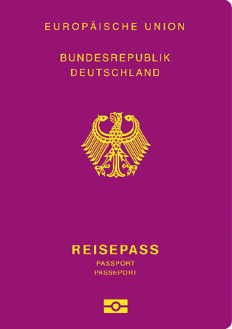

*    *   Reisepass (32 Seiten)

    *   Vorsatz und Passkartentitelseite

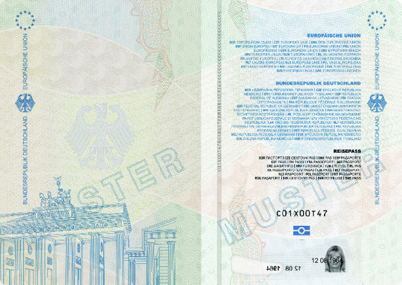

*    *   Reisepass (32 Seiten)

    *   Passkartendatenseite und Passbuchinnenseite 1

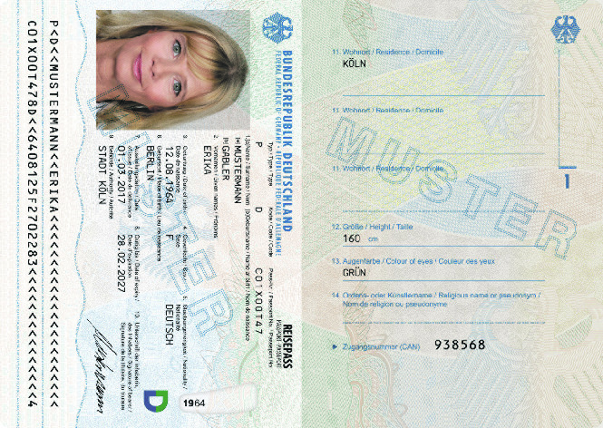
Die Seiten 1 bis 32 sowie der hintere Einband
werden am unteren Rand mit der Seriennummer perforiert.

*    *   Reisepass (32 Seiten)

    *   Passbuchinnenseiten 2 und 3

*    *   Reisepass (32 Seiten)

    *   Passbuchinnenseiten 4 und 5

*    *   Reisepass (32 Seiten)

    *   Passbuchinnenseiten 6 und 7

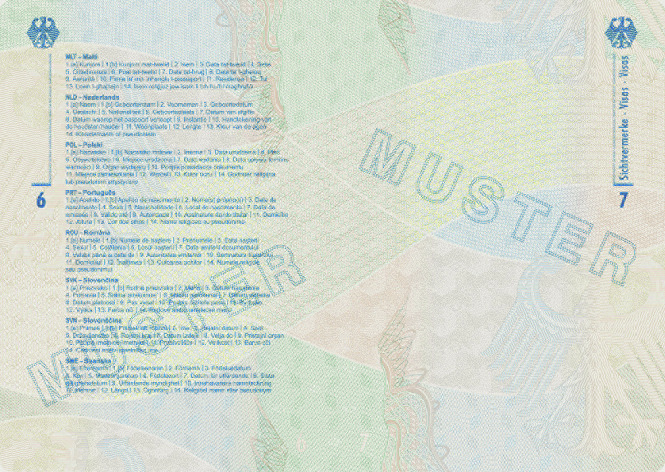

*    *   Reisepass (32 Seiten)

    *   Passbuchinnenseiten 8 und 9

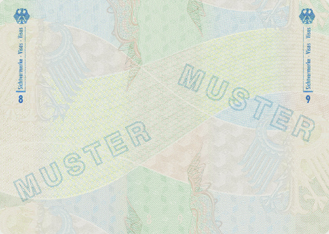

*    *   Reisepass (32 Seiten)

    *   Passbuchinnenseiten 10 und 11

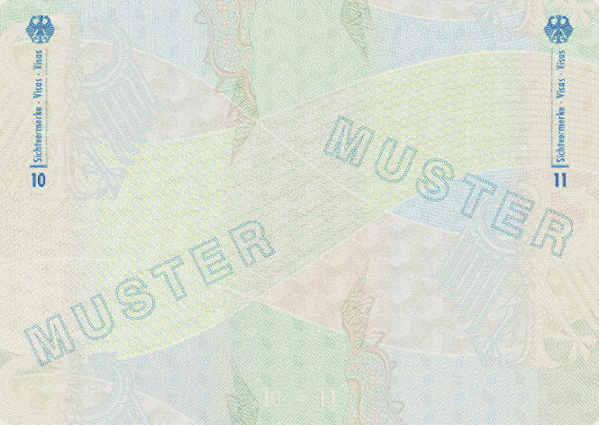

*    *   Reisepass (32 Seiten)

    *   Passbuchinnenseiten 12 und 13

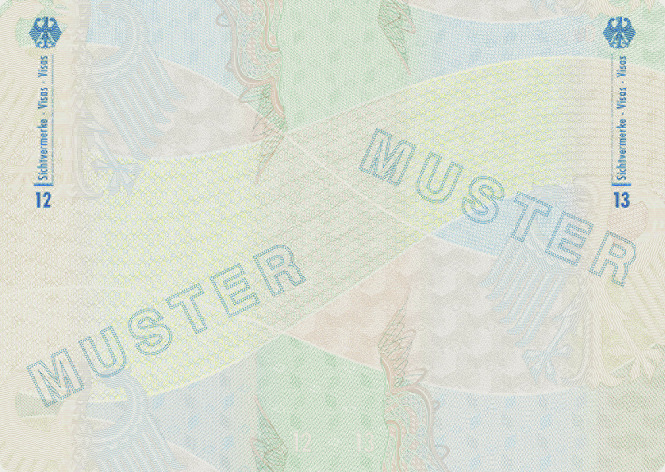

*    *   Reisepass (32 Seiten)

    *   Passbuchinnenseiten 14 und 15

*    *   Reisepass (32 Seiten)

    *   Passbuchinnenseiten 16 und 17

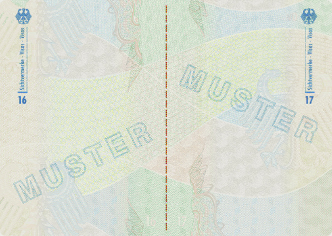

*    *   Reisepass (32 Seiten)

    *   Passbuchinnenseiten 18 und 19

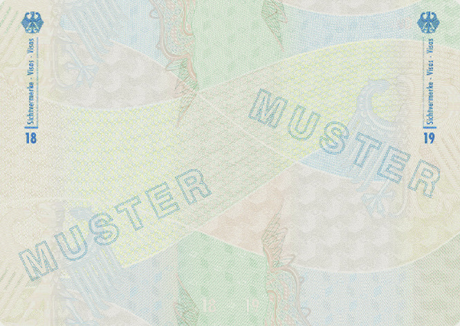

*    *   Reisepass (32 Seiten)

    *   Passbuchinnenseiten 20 und 21

*    *   Reisepass (32 Seiten)

    *   Passbuchinnenseiten 22 und 23

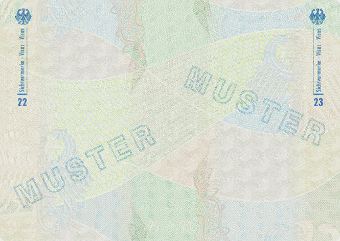

*    *   Reisepass (32 Seiten)

    *   Passbuchinnenseiten 24 und 25

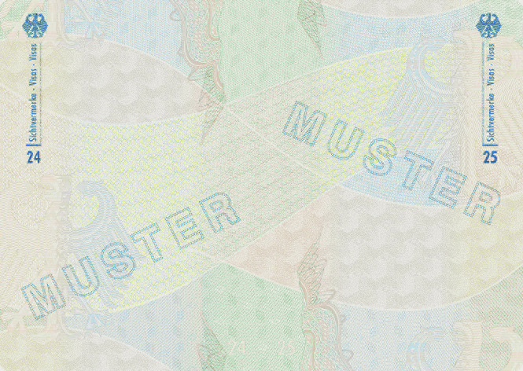

*    *   Reisepass (32 Seiten)

    *   Passbuchinnenseiten 26 und 27

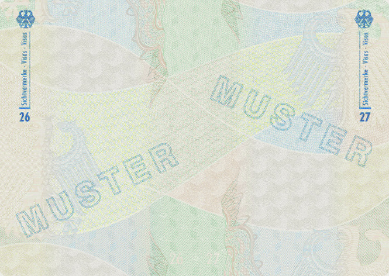

*    *   Reisepass (32 Seiten)

    *   Passbuchinnenseiten 28 und 29

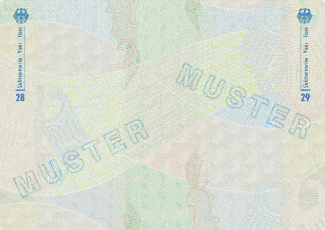

*    *   Reisepass (32 Seiten)

    *   Passbuchinnenseiten 30 und 31

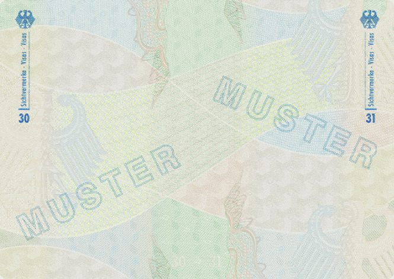

*    *   Reisepass (32 Seiten)

    *   Passbuchinnenseite 32 und Vorsatz des hinteren Einbandes

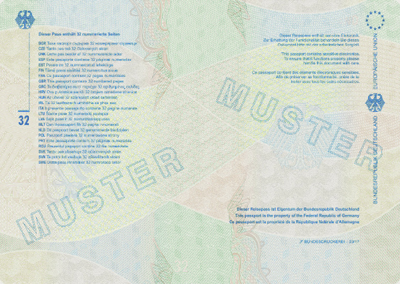

### Anlage 1a Passmuster Reisepass (48 Seiten)

(Fundstelle: BGBl. I 2017, 173 — 186)

*    *   Reisepass (48 Seiten)

    *   Einband

*    *        
    *        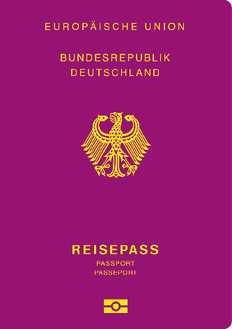

*    *   Reisepass (48 Seiten)

    *   Vorsatz und Passkartentitelseite

*    *   Reisepass (48 Seiten)

    *   Passkartendatenseite und Passbuchinnenseite 1

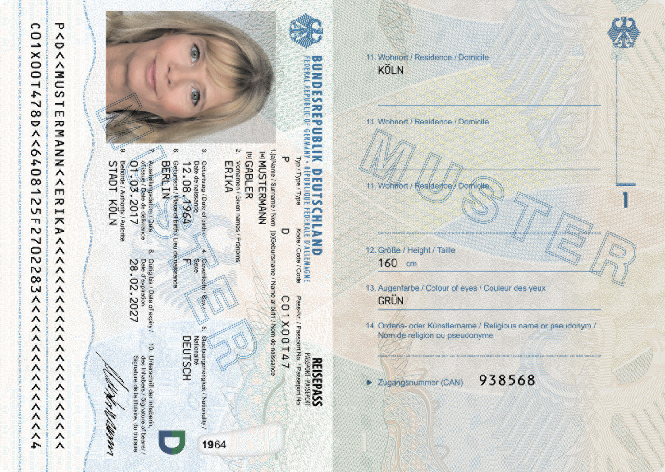
Die Seiten 1 bis 48 sowie der hintere Einband
werden am unteren Rand mit der Seriennummer perforiert.

*    *   Reisepass (48 Seiten)

    *   Passbuchinnenseiten 2 und 3

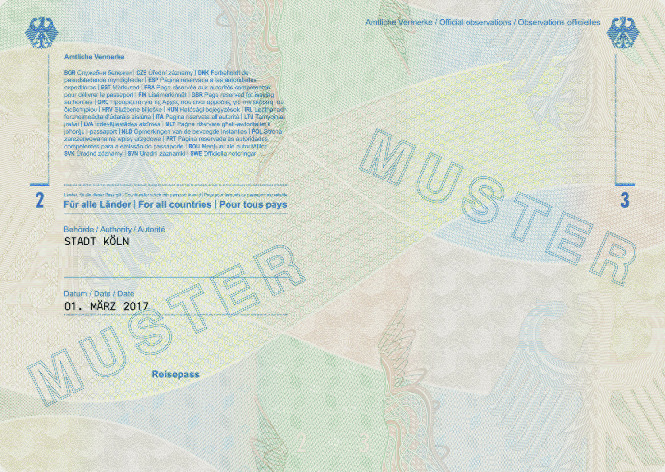

*    *   Reisepass (48 Seiten)

    *   Passbuchinnenseiten 4 und 5

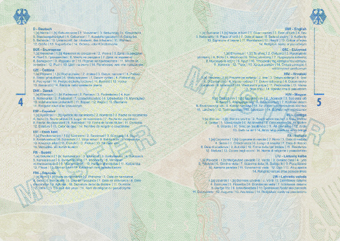

*    *   Reisepass (48 Seiten)

    *   Passbuchinnenseiten 6 und 7

*    *   Reisepass (48 Seiten)

    *   Passbuchinnenseiten 8 und 9

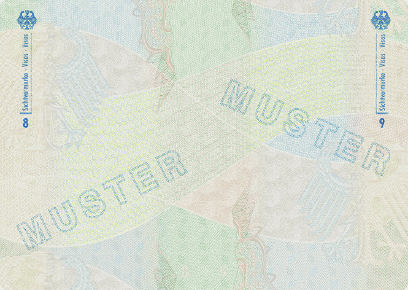

*    *   Reisepass (48 Seiten)

    *   Passbuchinnenseiten 10 und 11

*    *   Reisepass (48 Seiten)

    *   Passbuchinnenseiten 12 und 13

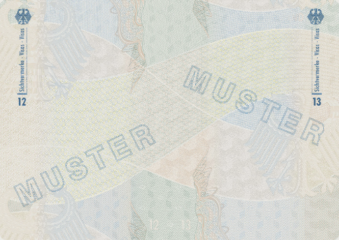

*    *   Reisepass (48 Seiten)

    *   Passbuchinnenseiten 14 und 15

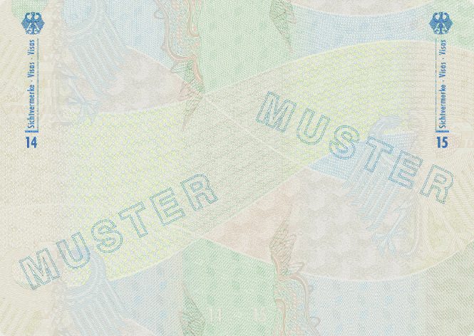

*    *   Reisepass (48 Seiten)

    *   Passbuchinnenseiten 16 und 17

*    *   Reisepass (48 Seiten)

    *   Passbuchinnenseiten 18 und 19

*    *   Reisepass (48 Seiten)

    *   Passbuchinnenseiten 20 und 21

*    *   Reisepass (48 Seiten)

    *   Passbuchinnenseiten 22 und 23

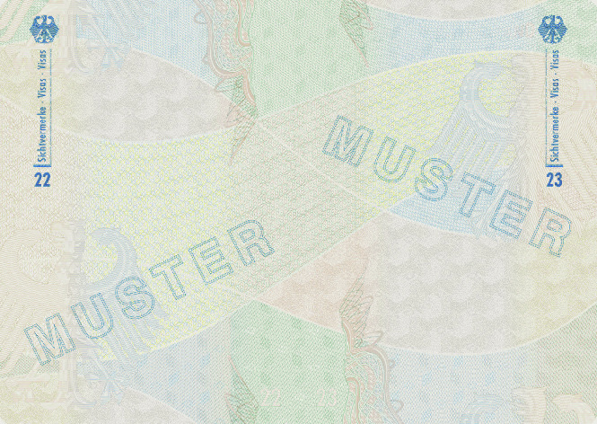

*    *   Reisepass (48 Seiten)

    *   Passbuchinnenseiten 24 und 25

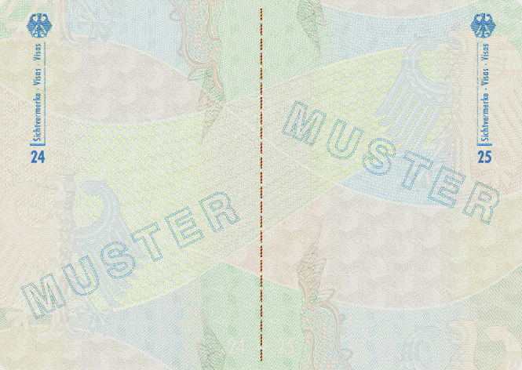

*    *   Reisepass (48 Seiten)

    *   Passbuchinnenseiten 26 und 27

*    *   Reisepass (48 Seiten)

    *   Passbuchinnenseiten 28 und 29

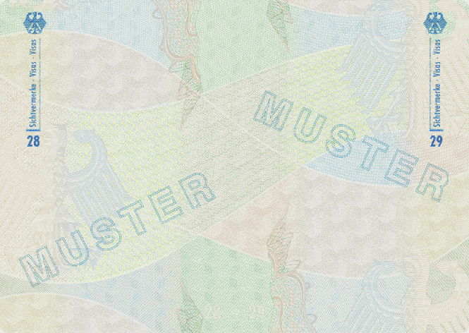

*    *   Reisepass (48 Seiten)

    *   Passbuchinnenseiten 30 und 31

*    *   Reisepass (48 Seiten)

    *   Passbuchinnenseiten 32 und 33

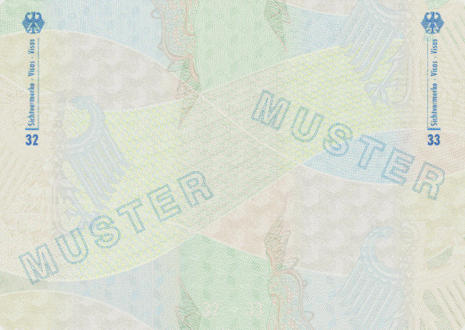

*    *   Reisepass (48 Seiten)

    *   Passbuchinnenseiten 34 und 35

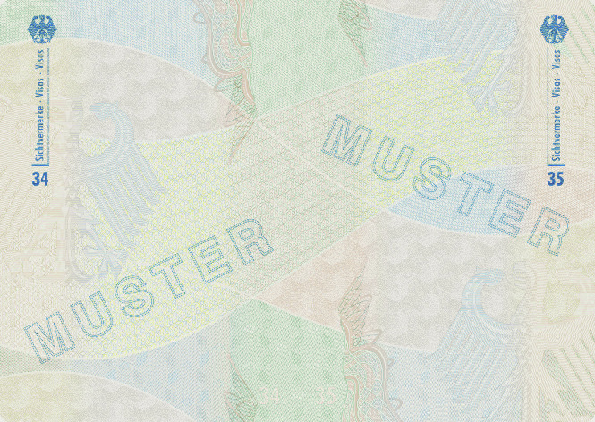

*    *   Reisepass (48 Seiten)

    *   Passbuchinnenseiten 36 und 37

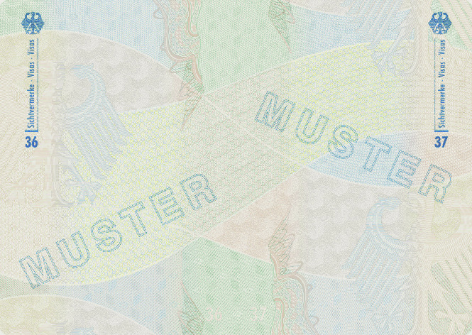

*    *   Reisepass (48 Seiten)

    *   Passbuchinnenseiten 38 und 39

*    *   Reisepass (48 Seiten)

    *   Passbuchinnenseiten 40 und 41

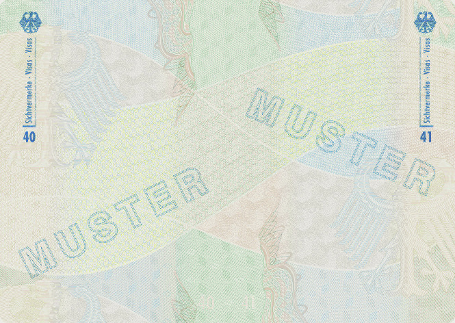

*    *   Reisepass (48 Seiten)

    *   Passbuchinnenseiten 42 und 43

*    *   Reisepass (48 Seiten)

    *   Passbuchinnenseiten 44 und 45

*    *   Reisepass (48 Seiten)

    *   Passbuchinnenseiten 46 und 47

*    *   Reisepass (48 Seiten)

    *   Passbuchinnenseite 48 und Vorsatz des hinteren Einbandes

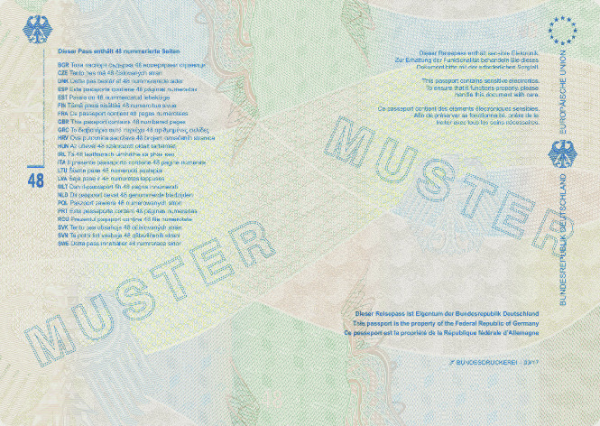

### Anlage 1b Muster des Aufklebers zur Änderung des Wohnortes

(Fundstelle: BGBl. I 2021, 3684)

*    *        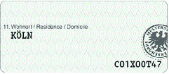

### Anlage 1c Muster des Aufklebers zur Änderung des Wohnortes nach elektronischer Anmeldung nach § 23a des Bundesmeldegesetzes

   (Fundstelle: BGBl. I 2021, 3684)

*    *        

### Anlage 1d Muster des Aufklebers zur Eintragung amtlicher Vermerke

   (Fundstelle: BGBl. I 2021, 3685)

*    *        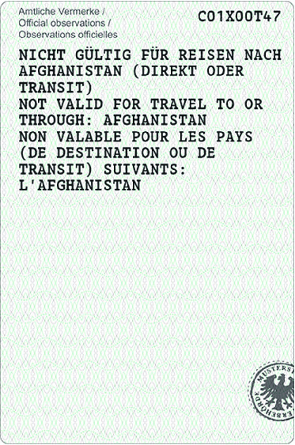

### Anlage 2 Passmuster Kinderreisepass

   (Fundstelle: BGBl. I 2017, 187 — 192)

*    *   Kinderreisepass

    *   Einband

*    *   Kinderreisepass

    *   Vorsatz und Passbuchinnenseite 1

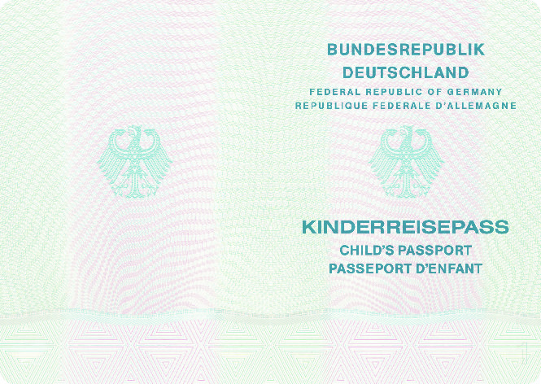
Die Seiten 1 bis 16 sowie der hintere Einband
werden am unteren Rand mit der Dokumentennummer perforiert.

*    *   Kinderreisepass

    *   Passbuchinnenseiten 2 und 3

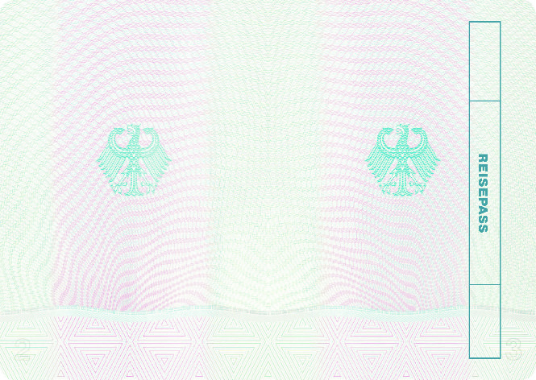

*    *   Kinderreisepass

    *   Passbuchinnenseiten 4 und 5

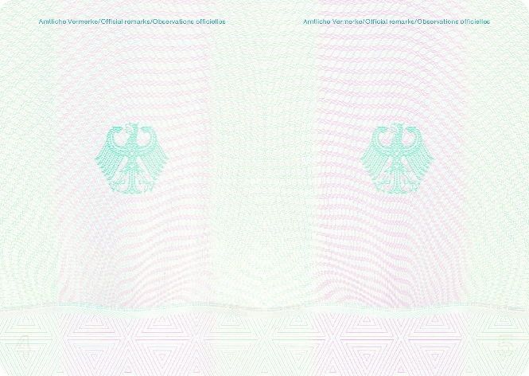

*    *   Kinderreisepass

    *   Passbuchinnenseiten 6 und 7

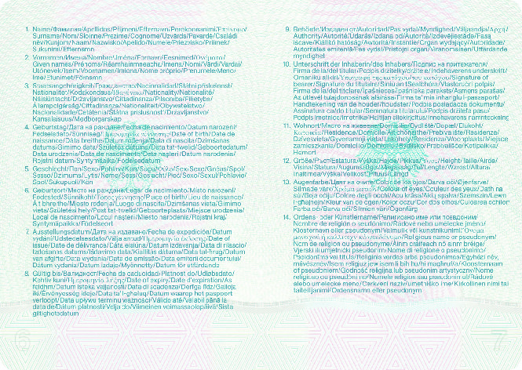

*    *   Kinderreisepass

    *   Passbuchinnenseiten 8 und 9

Seiten 8 bis 15 gleichlautend.

*    *   Kinderreisepass

    *   Passbuchinnenseite 16 und Vorsatz

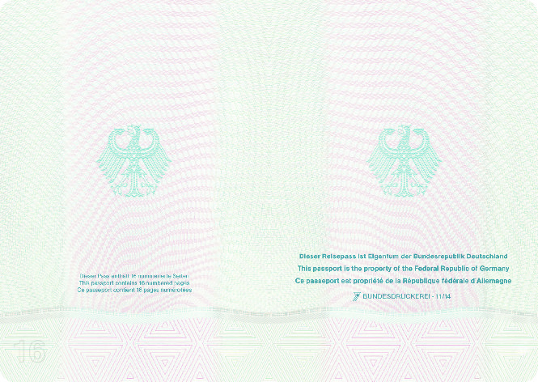

*    *   Kinderreisepass

    *   Aufkleber Personaldaten

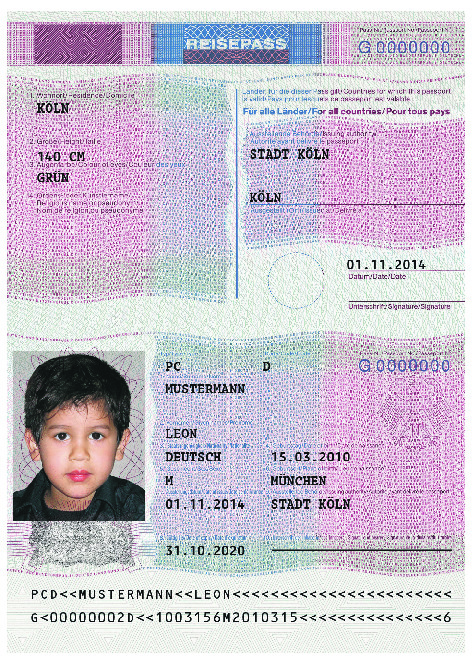

*    *   Kinderreisepass

    *   Aufkleber Verlängerung/Änderung

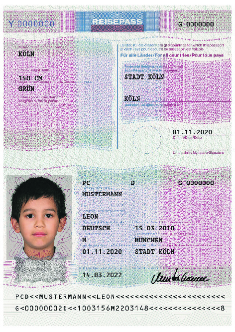

### Anlage 3

(Fundstelle: BGBl. I 2007, 2413 - 2420;
bzgl. der einzelnen Änderungen vgl. Fußnote)

*    *   Vorläufiger Reisepass

    *   Decke

*    *        

*    *   Vorläufiger Reisepass

    *   Vorsatz und Passbuchinnenseite 1

*    *        

*    *   Vorläufiger Reisepass

    *   Passbuchinnenseiten 2 und 3

*    *        

*    *   Die Seiten 1 bis 16 und die hintere Passdecke werden
        am unteren Rand mit der Dokumentennummer versehen

*    *   Vorläufiger Reisepass

    *   Passbuchinnenseiten 4 und 5

*    *        

*    *   Vorläufiger Reisepass

    *   Passbuchinnenseiten 6 und 7

*    *        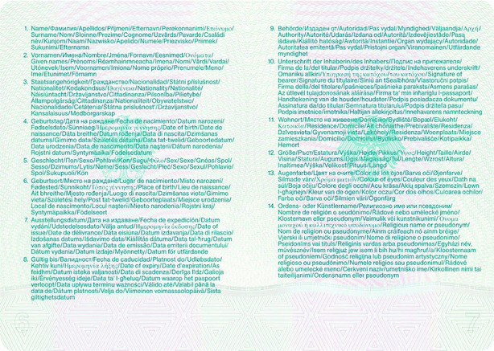

*    *   Vorläufiger Reisepass

    *   Passbuchinnenseiten 8 und 9

*    *        

*    *   Seiten 8 bis 15 gleichlautend

*    *   Vorläufiger Reisepass

    *   Passbuchinnenseite 16 und Vorsatz

*    *        

*    *   Vorläufiger Reisepass

    *   Aufkleber Personaldaten

*    *        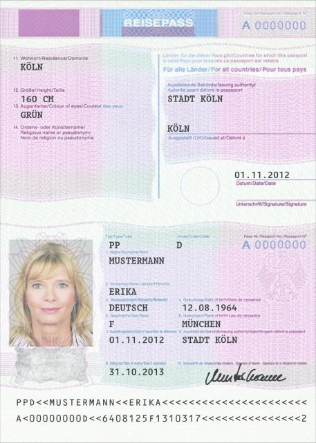

### Anlage 4 Passmuster Dienstpass

   (Fundstelle: BGBl. I 2017, 193 — 206)

*    *   Dienstpass

    *   Einband

*    *        
    *        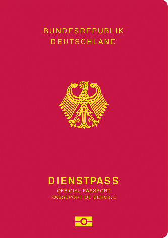

*    *   Dienstpass

    *   Vorsatz und Passkartentitelseite

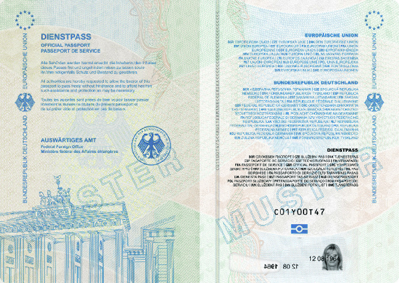

*    *   Dienstpass

    *   Passkartendatenseite und Passbuchinnenseite 1

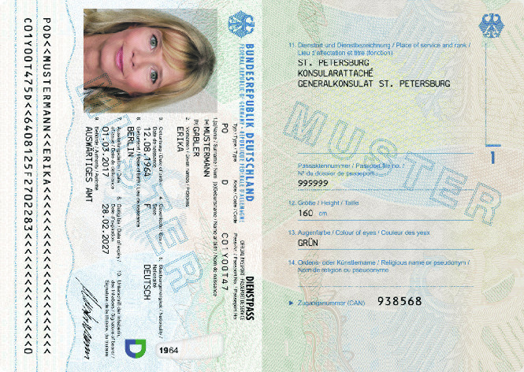
Die Seiten 1 bis 48 sowie der hintere Einband
werden am unteren Rand mit der Seriennummer perforiert.

*    *   Dienstpass

    *   Passbuchinnenseiten 2 und 3

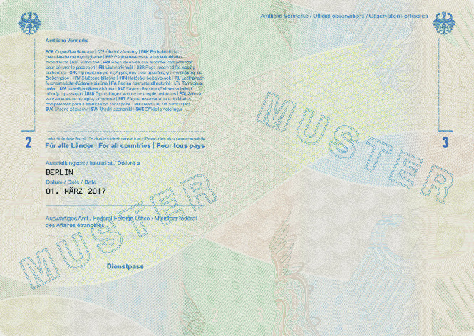

*    *   Dienstpass

    *   Passbuchinnenseiten 4 und 5

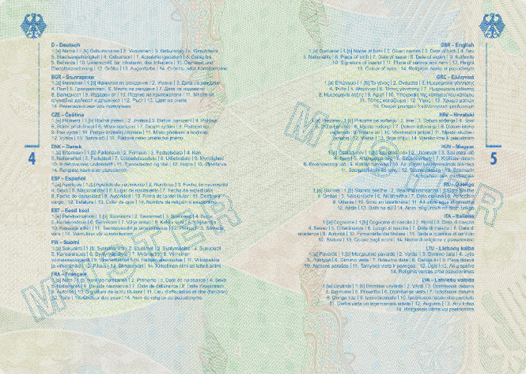

*    *   Dienstpass

    *   Passbuchinnenseiten 6 und 7

*    *   Dienstpass

    *   Passbuchinnenseiten 8 und 9

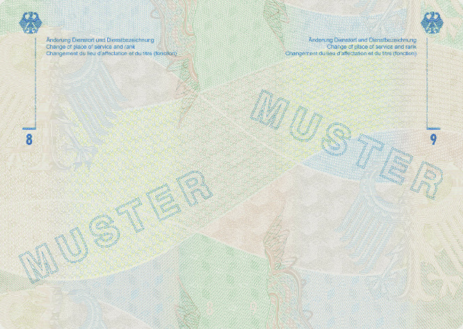

*    *   Dienstpass

    *   Passbuchinnenseiten 10 und 11

*    *   Dienstpass

    *   Passbuchinnenseiten 12 und 13

*    *   Dienstpass

    *   Passbuchinnenseiten 14 und 15

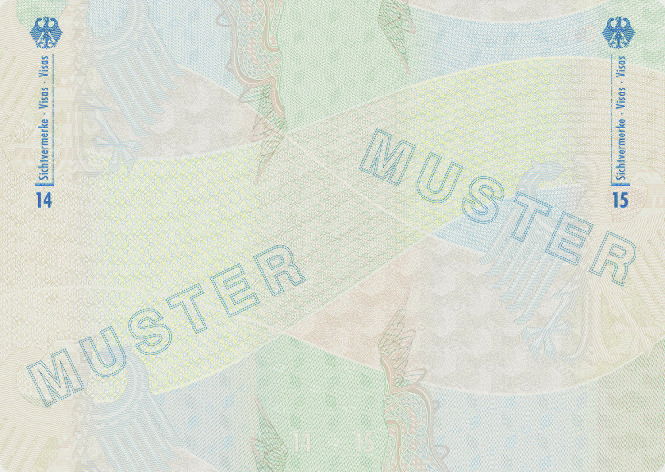

*    *   Dienstpass

    *   Passbuchinnenseiten 16 und 17

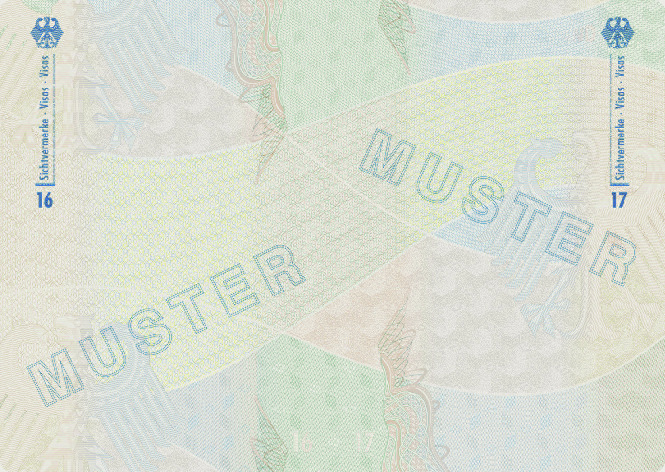

*    *   Dienstpass

    *   Passbuchinnenseiten 18 und 19

*    *   Dienstpass

    *   Passbuchinnenseiten 20 und 21

*    *   Dienstpass

    *   Passbuchinnenseiten 22 und 23

*    *   Dienstpass

    *   Passbuchinnenseiten 24 und 25

*    *   Dienstpass

    *   Passbuchinnenseiten 26 und 27

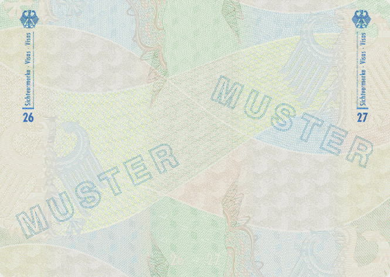

*    *   Dienstpass

    *   Passbuchinnenseiten 28 und 29

*    *   Dienstpass

    *   Passbuchinnenseiten 30 und 31

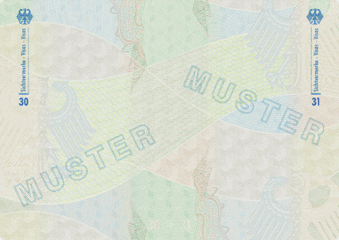

*    *   Dienstpass

    *   Passbuchinnenseiten 32 und 33

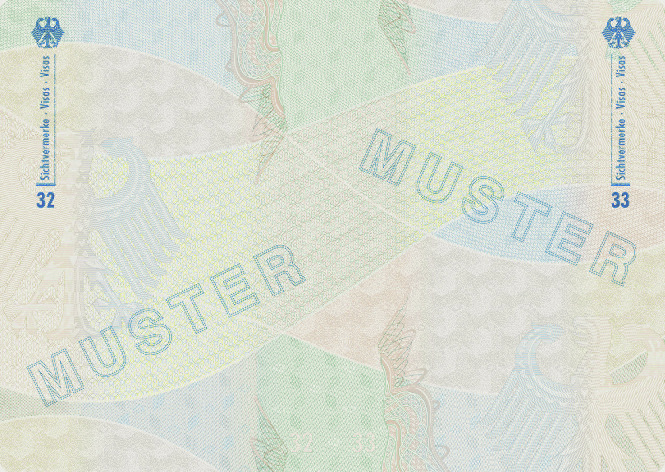

*    *   Dienstpass

    *   Passbuchinnenseiten 34 und 35

*    *   Dienstpass

    *   Passbuchinnenseiten 36 und 37

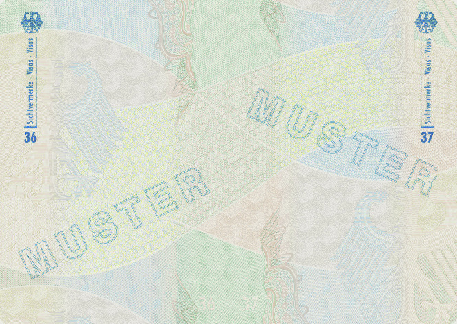

*    *   Dienstpass

    *   Passbuchinnenseiten 38 und 39

*    *   Dienstpass

    *   Passbuchinnenseiten 40 und 41

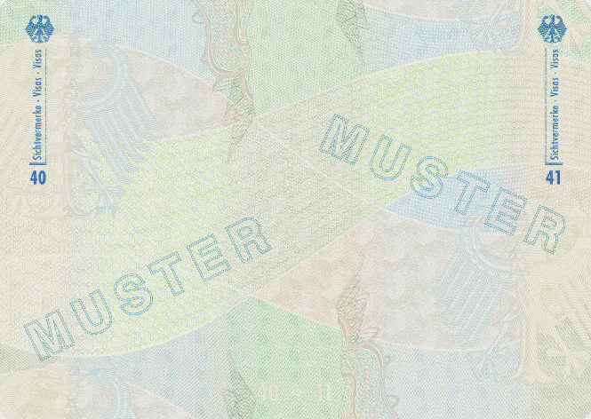

*    *   Dienstpass

    *   Passbuchinnenseiten 42 und 43

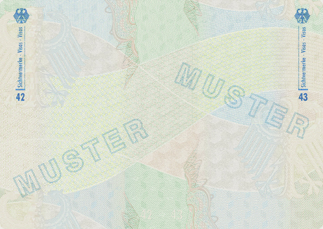

*    *   Dienstpass

    *   Passbuchinnenseiten 44 und 45

*    *   Dienstpass

    *   Passbuchinnenseiten 46 und 47

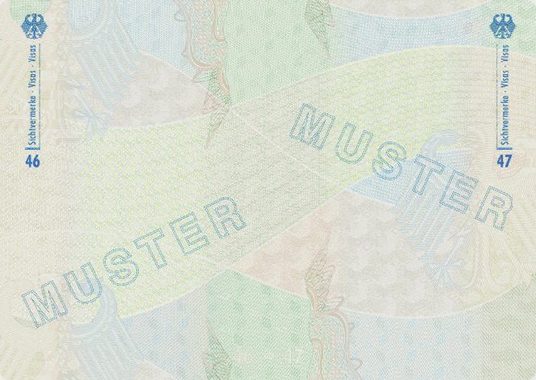

*    *   Dienstpass

    *   Passbuchinnenseite 48 und Vorsatz des hinteren Einbandes

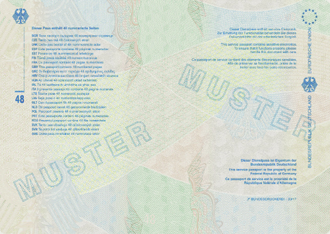

### Anlage 5 Passmuster Diplomatenpass

(Fundstelle: BGBl. I 2017, 207 — 220)

*    *   Diplomatenpass

    *   Einband

*    *        
    *        

*    *   Diplomatenpass

    *   Vorsatz und Passkartentitelseite

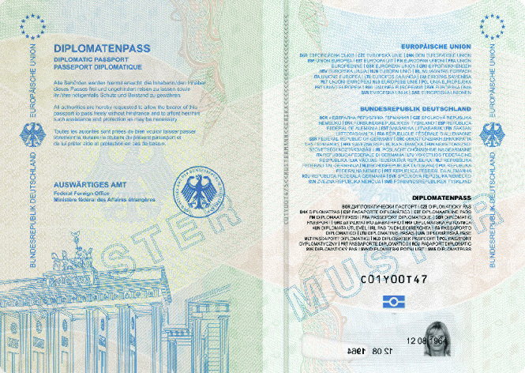

*    *   Diplomatenpass

    *   Passkartendatenseite und Passbuchinnenseite 1

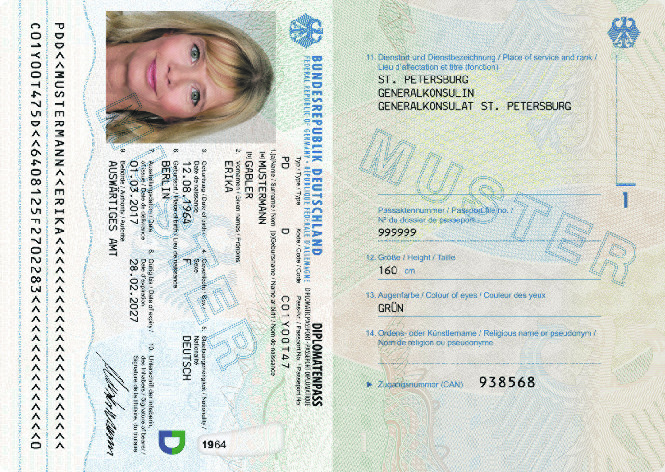
Die Seiten 1 bis 48 sowie der hintere Einband
werden am unteren Rand mit der Seriennummer perforiert.

*    *   Diplomatenpass

    *   Passbuchinnenseiten 2 und 3

*    *   Diplomatenpass

    *   Passbuchinnenseiten 4 und 5

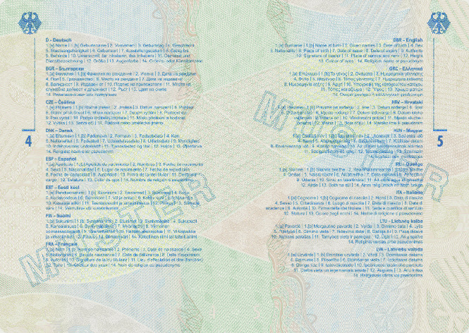

*    *   Diplomatenpass

    *   Passbuchinnenseiten 6 und 7

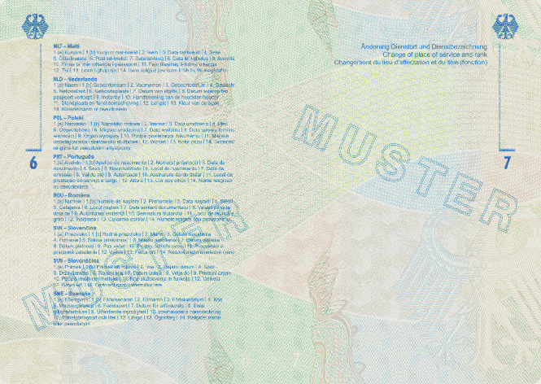

*    *   Diplomatenpass

    *   Passbuchinnenseiten 8 und 9

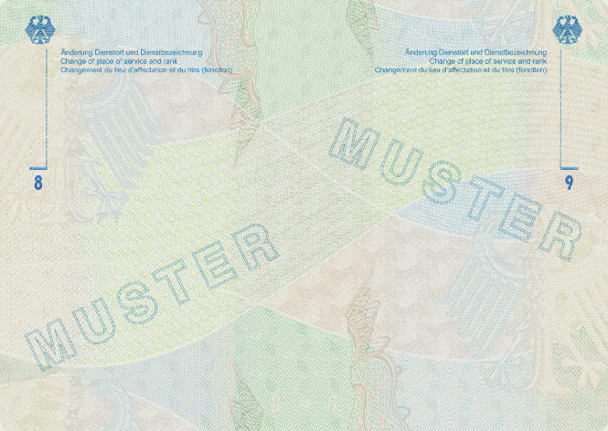

*    *   Diplomatenpass

    *   Passbuchinnenseiten 10 und 11

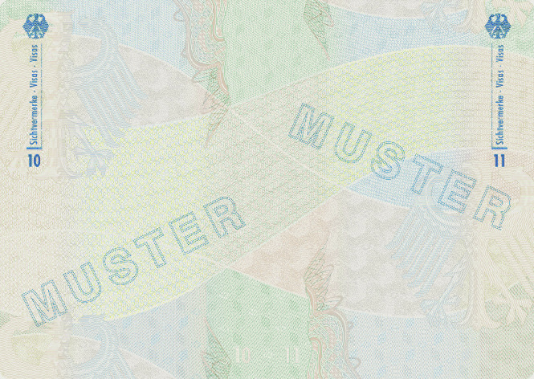

*    *   Diplomatenpass

    *   Passbuchinnenseiten 12 und 13

*    *   Diplomatenpass

    *   Passbuchinnenseiten 14 und 15

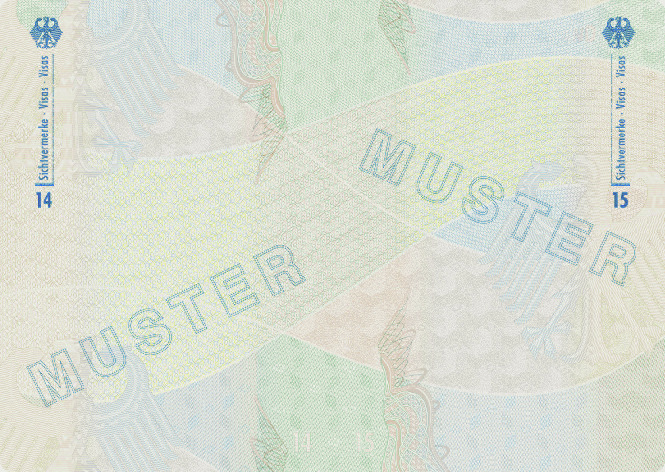

*    *   Diplomatenpass

    *   Passbuchinnenseiten 16 und 17

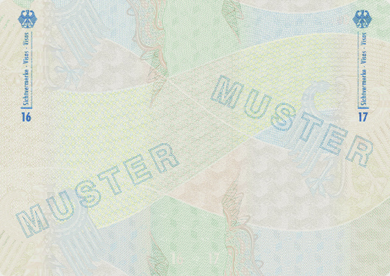

*    *   Diplomatenpass

    *   Passbuchinnenseiten 18 und 19

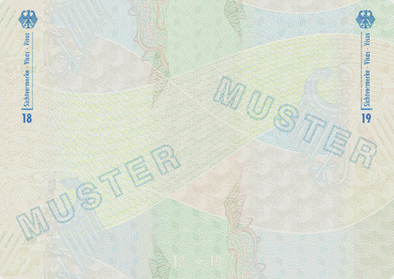

*    *   Diplomatenpass

    *   Passbuchinnenseiten 20 und 21

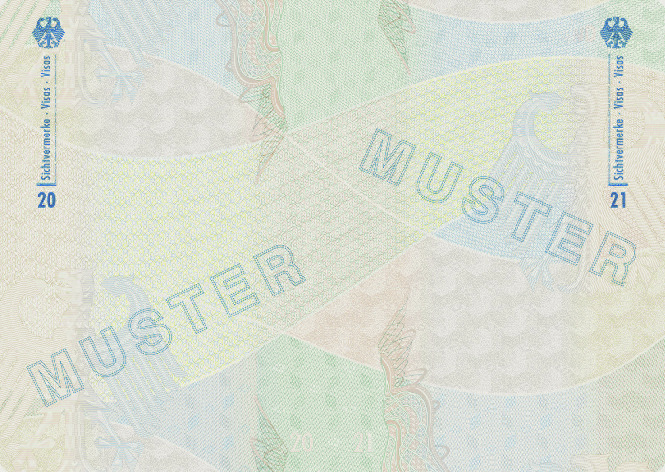

*    *   Diplomatenpass

    *   Passbuchinnenseiten 22 und 23

*    *   Diplomatenpass

    *   Passbuchinnenseiten 24 und 25

*    *   Diplomatenpass

    *   Passbuchinnenseiten 26 und 27

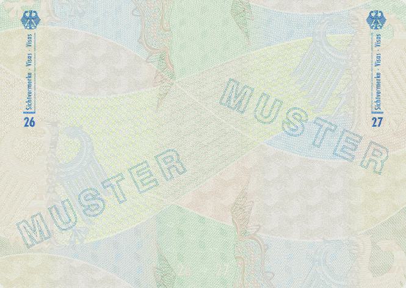

*    *   Diplomatenpass

    *   Passbuchinnenseiten 28 und 29

*    *   Diplomatenpass

    *   Passbuchinnenseiten 30 und 31

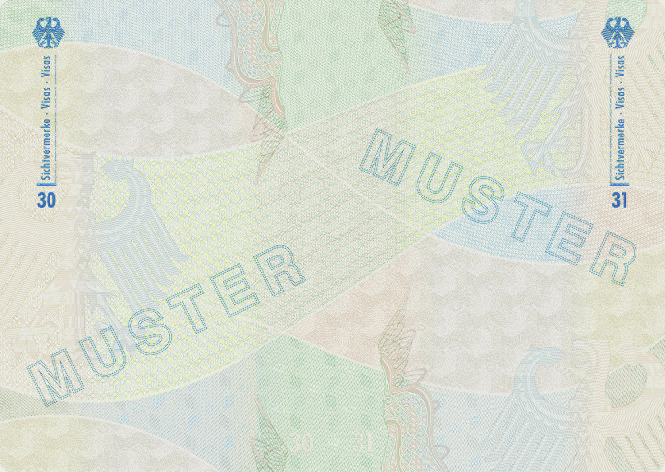

*    *   Diplomatenpass

    *   Passbuchinnenseiten 32 und 33

*    *   Diplomatenpass

    *   Passbuchinnenseiten 34 und 35

*    *   Diplomatenpass

    *   Passbuchinnenseiten 36 und 37

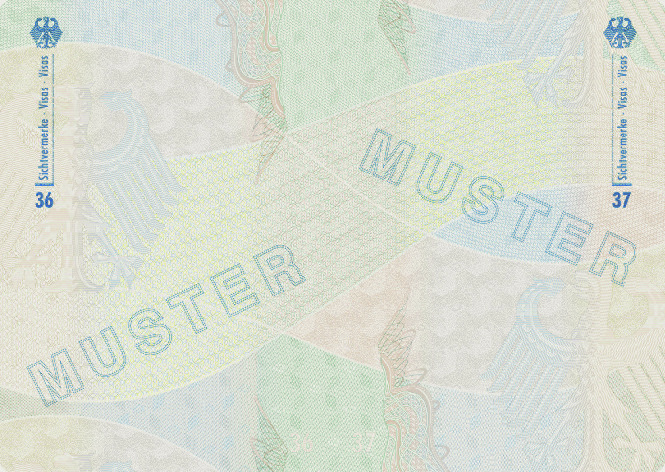

*    *   Diplomatenpass

    *   Passbuchinnenseiten 38 und 39

*    *   Diplomatenpass

    *   Passbuchinnenseiten 40 und 41

*    *   Diplomatenpass

    *   Passbuchinnenseiten 42 und 43

*    *   Diplomatenpass

    *   Passbuchinnenseiten 44 und 45

*    *   Diplomatenpass

    *   Passbuchinnenseiten 46 und 47

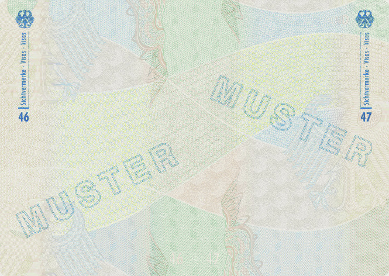

*    *   Diplomatenpass

    *   Passbuchinnenseite 48 und Vorsatz des hinteren Einbandes

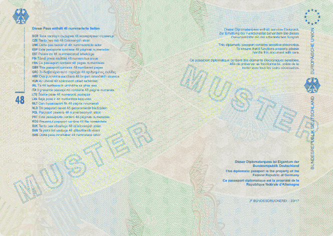

### Anlage 6

(Fundstelle: BGBl. I 2007, 2437 - 2444
bzgl. der einzelnen Änderungen vgl. Fußnote)

*    *   Vorläufiger Dienstpass

    *   Decke

*    *        

*    *   Vorläufiger Dienstpass

    *   Vorsatz und Passbuchinnenseite 1

*    *        

*    *   Vorläufiger Dienstpass

    *   Passbuchinnenseiten 2 und 3

*    *        

*    *   Die Seiten 1 bis 16 und die hintere Passdecke werden
        am unteren Rand mit der Dokumentennummer versehen.

*    *   Vorläufiger Dienstpass

    *   Passbuchinnenseiten 4 und 5

*    *        

*    *   Vorläufiger Dienstpass

    *   Passbuchinnenseiten 6 und 7

*    *        

*    *   Vorläufiger Dienstpass

    *   Passbuchinnenseiten 8 und 9

*    *        

*    *   Seiten 8 bis 15 gleichlautend

*    *   Vorläufiger Dienstpass

    *   Passbuchinnenseite 16 und Vorsatz

*    *        

*    *   Vorläufiger Dienstpass

    *   Aufkleber Personaldaten

*    *        

### Anlage 7

   (Fundstelle: BGBl. I 2007, 2445 - 2452
bzgl. der einzelnen Änderungen vgl. Fußnote)

*    *   Vorläufiger Diplomatenpass

    *   Decke

*    *        

*    *   Vorläufiger Diplomatenpass

    *   Vorsatz und Passbuchinnenseite 1

*    *        

*    *   Vorläufiger Diplomatenpass

    *   Passbuchinnenseiten 2 und 3

*    *        

*    *   Die Seiten 1 bis 16 und die hintere Passdecke werden
        am unteren Rand mit der Dokumentennummer versehen.

*    *   Vorläufiger Diplomatenpass

    *   Passbuchinnenseiten 4 und 5

*    *        

*    *   Vorläufiger Diplomatenpass

    *   Passbuchinnenseiten 6 und 7

*    *        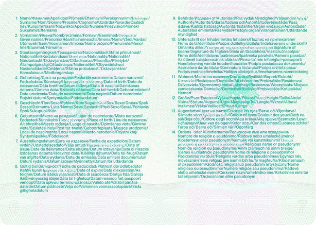

*    *   Vorläufiger Diplomatenpass

    *   Passbuchinnenseiten 8 und 9

*    *        

*    *   Seiten 8 bis 15 gleichlautend

*    *   Vorläufiger Diplomatenpass

    *   Passbuchinnenseite 16 und Vorsatz

*    *        

*    *   Vorläufiger Diplomatenpass

    *   Aufkleber Personaldaten

*    *        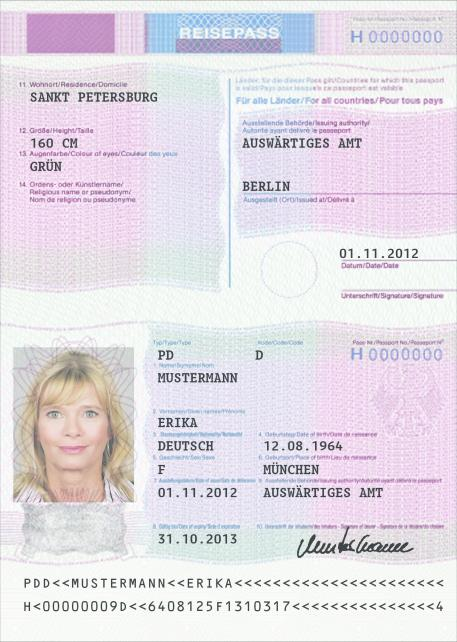

### Anlage 7a Muster des Aufklebers zur Änderung des Dienstortes oder der Dienstbezeichnung

   (Fundstelle: BGBl. I 2021, 3685)

*    *        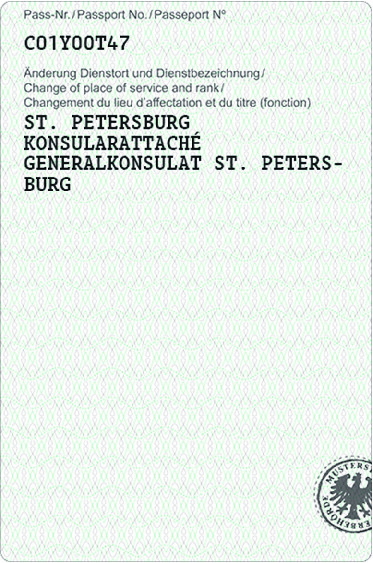

### Anlage 8

   (Fundstelle: BGBl. I 2007, 2453 - 2455)

*    *   **Musterfoto**
        Qualitativ hochwertige Fotos sind die Grundlage einer einwandfreien
        Wiedergabe des Bildes und Voraussetzung für die Anwendung der
        Gesichtsbiometrie in Pässen. Dieser Foto-Mustertafel sind die
        Qualitätsmerkmale zu entnehmen, die die Eignung der Fotos für den
        vorgesehenen Einsatz in Pässen gewährleisten. Es ist dringend
        erforderlich, die hier beschriebenen Anforderungen zu beachten, da
        sonst eine biometrische Erkennung des Antragstellers sowie die
        einwandfreie Wiedergabe des Bildes im Dokument nicht gewährleistet
        sind. Der Passbewerber ist grundsätzlich ohne Kopfbedeckung
        abzubilden. Die Passbehörde kann vom Gebot der fehlenden Kopfbedeckung
        insbesondere aus religiösen Gründen, von den übrigen Anforderungen aus
        medizinischen Gründen, die nicht nur vorübergehender Art sind,
        Ausnahmen zulassen. Auf den Fotos sind keine Uniformteile abzubilden.

    *        

*    *   **Format**
        Das Foto muss die Gesichtszüge der Person von der Kinnspitze bis zum
        oberen Kopfende, sowie die linke und rechte Gesichtshälfte deutlich
        zeigen. Die Gesichtshöhe muss 70 - 80 % des Fotos einnehmen. Dies
        entspricht einer Höhe von 32 - 36 mm von der Kinnspitze bis zum oberen
        Kopfende. Dabei ist das obere Kopfende unter Vernachlässigung der
        Frisur anzunehmen. Wegen des häufig nicht eindeutig zu bestimmenden
        oberen Kopfendes sind Passfotos jedoch erst dann abzulehnen, wenn die
        Gesichtshöhe 27 mm unterschreitet oder 40 mm überschreitet. Bei
        volumenreichem Haar sollte darauf geachtet werden, dass der Kopf
        (einschl. Frisur) möglichst vollständig abgebildet ist, ohne aber die
        Gesichtsgröße zu verkleinern. Das Gesicht muss zentriert auf dem Foto
        platziert sein.

    *        

*    *   **Schärfe und Kontrast**
        Das Gesicht muss in allen Bereichen scharf abgebildet, kontrastreich
        und klar sein.

    *        

*    *   **Ausleuchtung**
        Das Gesicht muss gleichmäßig ausgeleuchtet werden. Reflexionen oder
        Schatten im Gesicht sowie rote Augen sind zu vermeiden.

    *        

*    *   **Hintergrund**
        Der Hintergrund muss einfarbig hell sein (idealerweise neutral grau)
        und einen Kontrast zum Gesicht und zu den Haaren aufweisen. Bei hellen
        Haaren eignet sich ein mittelgrauer Hintergrund, bei dunklen Haaren
        ein hellgrauer. Der Hintergrund darf kein Muster aufweisen. Das Foto
        darf ausschließlich die zu fotografierende Person zeigen (keine
        weiteren Personen oder Gegenstände im Bild). Auf dem Hintergrund
        dürfen keine Schatten entstehen.

    *        

*    *   **Fotoqualität**
        Das Foto sollte (insbesondere bei der Aufnahme mit einer
        Digitalkamera) auf hochwertigem Papier mit einer Druckauflösung von
        mindestens 600 dpi vorliegen. Das Foto muss farbneutral sein und die
        Hauttöne natürlich wiedergeben. Das Foto darf keine Knicke oder
        Verunreinigungen aufweisen. Das Foto kann in Schwarzweiß oder Farbe
        vorliegen.

    *        

*    *   **Kopfposition und Gesichtsausdruck**
        Eine Darstellung der Person mit geneigtem oder gedrehtem Kopf (z. B.
        Halbprofil) ist nicht zulässig. Die Person muss mit neutralem
        Gesichtsausdruck und geschlossenem Mund gerade in die Kamera blicken.

    *        

*    *   **Augen und Blickrichtung**
        Die Person muss auf dem Foto direkt in die Kamera blicken. Die Augen
        müssen geöffnet und deutlich sichtbar sein und dürfen nicht durch
        Haare oder Brillengestelle verdeckt werden.

    *        

*    *   **Brillenträger**
        Die Augen müssen klar und deutlich erkennbar sein (Reflexionen auf den
        Brillengläsern, getönte Gläser oder Sonnenbrillen sind nicht
        zulässig). Der Rand der Gläser oder das Gestell dürfen nicht die Augen
        verdecken.

    *        

*    *   **Kopfbedeckung**
        Kopfbedeckungen sind grundsätzlich nicht erlaubt. Ausnahmen sind
        insbesondere aus religiösen Gründen zulässig. In diesem Fall gilt: das
        Gesicht muss von der unteren Kinnkante bis zur Stirn erkennbar sein.
        Es dürfen keine Schatten auf dem Gesicht entstehen.

    *        

*    *   **Kinder**
        Bei Kindern bis zum vollendeten 10. Lebensjahr sind folgende
        Abweichungen bei der Gesichtshöhe und im Augenbereich zulässig: Die
        Gesichtshöhe bei Kindern muss 50 - 80 % des Fotos einnehmen. Dies
        entspricht einer Höhe von 22 - 36 mm von der Kinnspitze bis zum oberen
        Kopfende. Dabei ist das obere Kopfende unter Vernachlässigung der
        Frisur anzunehmen. Wegen des häufig nicht eindeutig zu bestimmenden
        oberen Kopfendes sind Passfotos jedoch erst dann abzulehnen, wenn die
        Gesichtshöhe 17 mm unterschreitet oder 40 mm überschreitet. Bei
        Säuglingen und Kleinkindern gelten zusätzlich die nachfolgend
        beschriebenen Abweichungen.

    *        

*    *   **Säuglinge und Kleinkinder**
        Bei Säuglingen und Kleinkindern bis zum vollendeten 6. Lebensjahr sind
        zusätzlich zu den unter der Überschrift „Kinder“ dargestellten
        Ausnahmen Abweichungen in der Kopfhaltung (nicht von der
        Frontalaufnahme!), im Gesichtsausdruck, hinsichtlich Augen und
        Blickrichtung sowie hinsichtlich der Zentrierung auf dem Foto
        zulässig.

    *        

### Anlage 9

   ( Fundstelle: BGBl. I 2007, 2456 - 2457 )

*    *   Reiseausweis als Passersatz

    *   Außenseiten

*    *        

*    *   Reiseausweis als Passersatz

    *   Innenseiten

*    *        

### Anlage 10

   ( Fundstelle: BGBl. I 2007, 2458 - 2459 )

*    *   Reiseausweis als Passersatz
        zur Einreise in die Bundesrepublik Deutschland

    *   Außenseiten

*    *        

*    *   Reiseausweis als Passersatz
        zur Einreise in die Bundesrepublik Deutschland

    *   Innenseiten

*    *        

### Anlage 11 Formale Anforderungen an die Einträge in Pässe im Sinne des § 1 Absatz 2 des Passgesetzes

   (Fundstelle: BGBl. I 2017, 221 — 225)

**Vorbemerkung:**

1.  Für den Reisepass sowie für den Dienst- und Diplomatenpass gelten die
    in der nachstehenden Tabelle 1 beschriebenen Anforderungen an die
    Einträge. Die in der nachstehenden Tabelle 2 beschriebenen
    Anforderungen an die Einträge gelten für den Kinderreisepass,
    vorläufigen Reisepass und für den vorläufigen Dienst- und
    Diplomatenpass. Für den Aufkleber zur Änderung des Wohnortes gelten
    die in der Tabelle 3 beschriebenen Anforderungen an Einträge, für den
    Aufkleber zur Eintragung amtlicher Vermerke die in der Tabelle 4
    beschriebenen Anforderungen. Die in der Tabelle 5 beschriebenen
    Anforderungen an Einträge gelten für den Aufkleber zur Änderung des
    Dienstortes und der Dienstbezeichnung.

2.  Die Passbehörden verwenden zur Personalisierung der Aufkleber
    Personaldaten der Kinderreisepässe, der vorläufigen Reisepässe, der
    vorläufigen Dienst- und Diplomatenpässe, der Aufkleber Verlängerung/
    Änderung der Kinderreisepässe sowie der Aufkleber Dienstort- und
    Dienstbezeichnungsänderung, Wohnortänderung und Eintragung amtlicher
    Vermerke den Schriftfont „UnicodeDoc“. Hierfür sind
    Tintenstrahldrucker einzusetzen. Die Tinte hat die nach der ISO 1831
    geforderten Eigenschaften hinsichtlich maschineller Lesbarkeit im
    B900-Band zu erfüllen. Es ist ausschließlich solches Schreibmaterial
    zu verwenden, das nach DIN 16554 urkunden- und kopierecht ist.

3.  Als Zeichensatz ist der in der jeweils gültigen Fassung der
    Technischen Richtlinie
    des Bundesamtes                    für Sicherheit in der
    Informationstechnik, BSI: Technische Richtlinie TR-03123, XML-
    Datenaustauschformat für hoheitliche Dokumente (TR XhD),
    veröffentlichte Zeichensatz „String.Latin“ zu verwenden.

4.  Der maschinenlesbare Bereich in den Pässen sowie die Zugangsnummer
    (CAN) sind im Schriftfont OCR-B zu beschriften.

5.  In den Datenfeldern „Name“ (Familienname und Geburtsname) sowie
    „Vornamen“ sind alle Namensbestandteile komplett darzustellen, soweit
    dies technisch entsprechend den Vorgaben der nachstehenden Tabellen
    umsetzbar ist.

6.  Grundsätzlich sind alle Einträge in der Schriftgröße 1 gemäß den
    Vorgaben der nachstehenden Tabellen vorzunehmen:

    a)  Für den Reisepass sowie den Dienst- und Diplomatenpass gilt:

        Wird in einem Datenfeld die zur Verfügung stehende Zeichenzahl in der
        Schriftgröße 1 überschritten, sind sämtliche Zeichen des
        entsprechenden Datenfeldes in Schriftgröße 2 einzutragen. Sollte auch
        unter Ausnutzung der Schriftgröße 2 die nach Maßgabe der nachstehenden
        Tabelle 1 maximal zur Verfügung stehende Zeichenzahl nicht ausreichen,
        sind die Einträge des Datenfeldes (z. B. Vornamen) entsprechend
        gekürzt vorzunehmen.

    b)  Für den Kinderreisepass, den vorläufigen Reisepass sowie den
        vorläufigen Dienst- und Diplomatenpass gilt:

        Grundsätzlich sind alle Einträge in der Schriftgröße 1 im Fettsatz
        gemäß den Vorgaben der nachstehenden Tabelle 2 vorzunehmen. Einträge
        im Datenfeld „Name“ sind gemäß den Vorgaben der nachstehenden Tabelle
        2 in den Schriftgrößen 1 und 2 im Fettsatz zulässig. Einträge in den
        sonstigen Datenfeldern sind nur in der Schriftgröße 1 zulässig. Sollte
        unter Ausnutzung dieser Schriftgrößen die zur Verfügung stehende
        Zeichenzahl nicht ausreichen, sind die Einträge des Datenfeldes (zum
        Beispiel Vornamen) entsprechend gekürzt vorzunehmen.

    Unterschiedliche Schriftgrößen innerhalb eines Datenfeldes sind
    unzulässig.
    Bei der Personalisierung der Aufkleber zur Änderung der Dienstort- und
    Dienstbezeichnung sowie des Wohnortes und zur Eintragung amtlicher
    Vermerke sind die Eintragungen in der Schriftgröße 1 im Fettsatz
    vorzunehmen.

7.  Sofern neben dem Familiennamen auch ein Geburtsname vorhanden ist,
    gilt für den Reisepass sowie den Dienst- und Diplomatenpass:

    Der Geburtsname ist in das Feld „Geburtsname“ einzutragen.

    Für den Kinderreisepass, den vorläufigen Reisepass sowie den
    vorläufigen Dienst- und Diplomatenpass gilt:

    Der Geburtsname ist im Feld „Name“ in einer eigenen Zeile einzutragen.
    Ihm ist die Zeichenfolge „GEB.“ bzw. „geb. “ unter Hinzufügung eines
    Leerzeichens voranzustellen.

8.  Soweit ein oder mehrere Doktorgrade vorhanden sind, wird dieser bzw.
    werden diese im Datenfeld „Name“ eingetragen. Entsprechend der für die
    Eintragung des Doktorgrades bzw. der Doktorgrade benötigten
    Zeichenzahl verringert sich die Anzahl der verbleibenden Zeichen für
    den Namenseintrag.

9.  Die alphanumerische Seriennummer des Reisepasses, Dienstpasses und
    Diplomatenpasses wird ausschließlich aus den Buchstaben C, F, G, H, J,
    K, L, M, N, P, R, T, V, W, X, Y, Z und den Ziffern 1, 2, 3, 4, 5, 6,
    7, 8, 9 gebildet.

    Beim Kinderreisepass, vorläufigen Reisepass, vorläufigen Dienstpass
    und vorläufigen Diplomatenpass besteht die Seriennummer aus einem
    Serienbuchstaben und sieben Ziffern.

10. Das Lichtbild, das von der antragstellenden Person in den Abmaßen 35 x
    45 mm vorzulegen ist, ist bei der Personalisierung im vorläufigen
    Reisepass, im Dienstpass, im Diplomatenpass sowie im Kinderreisepass
    in den Abmessungen 32 x 41 mm verkleinert darzustellen.

11. Die Schriftgröße ist am Großbuchstaben E auszurichten.

12. Die Eintragung zur Staatsangehörigkeit im Reisepass, Kinderreisepass
    und vorläufigen Reisepass lautet „DEUTSCH“.

    Für Dienstpass und Diplomatenpass sowie für vorläufigen Dienstpass und
    vorläufigen Diplomatenpass gilt:

    Ist die Staatsbürgerschaft deutsch, lautet der Eintrag „DEUTSCH“. In
    allen anderen Fällen ist die Eintragung in Form des 3-Letter-Codes
    gemäß ICAO Doc 9303 (3 Zeichen) vorzunehmen.

**Tabelle 1: Reisepass, Dienst- und Diplomatenpass**

*    *   Datenfelder

    *   Anzahl der zur Verfügung stehenden Zeichen

*    *   Feld Nr.

    *   Feldbezeichnung

    *   Schriftgröße 1
        Schriftfont des Passherstellers
        Schriftgröße 2,0 mm

    *   Schriftgröße 2
        Schriftfont des Passherstellers
        Schriftgröße 1,3 mm

*    *   ohne

    *   Typ

    *   2 Zeichen pro Zeile; 1 Zeile
        (insgesamt 2 Zeichen)

    *   Nicht zulässig

*    *   ohne

    *   Kode

    *   1 Zeichen pro Zeile; 1 Zeile
        (insgesamt 1 Zeichen)

    *   Nicht zulässig

*    *   ohne

    *   Pass-Nr.

    *   9 Zeichen pro Zeile; 1 Zeile
        (insgesamt 9 Zeichen)

    *   Nicht zulässig

*    *   1

    *   [a]

    *[^F797417_01_BJNR238610007BJNE003604116]
   Name

    *   40 Zeichen pro Zeile; 2 Zeilen
        (insgesamt 80 Zeichen)

    *   62 Zeichen pro Zeile, 3 Zeilen
        (insgesamt 186 Zeichen)

*    *   [a]

    *[^F797417_02_BJNR238610007BJNE003604116]
   Name

    *   [a]

    *   40 Zeichen pro Zeile; 1 Zeile

    *   [a]

    *   62 Zeichen pro Zeile, 2 Zeilen

*    *
    *   [b]

    *   40 Zeichen pro Zeile; 1 Zeile

    *   [b]

    *   62 Zeichen pro Zeile, 1 Zeile

*    *   [b]

    *   Geburtsname

    *
    *

*    *
    *   (insgesamt 80 Zeichen)

    *   ODER

*    *
    *
    *   [a]

    *   62 Zeichen pro Zeile, 1 Zeile

*    *
    *
    *   [b]

    *   62 Zeichen pro Zeile, 2 Zeilen

*    *
    *
    *   (insgesamt 186 Zeichen)

*    *   2

    *   Vornamen

    *   40 Zeichen pro Zeile; 2 Zeilen
        (insgesamt 80 Zeichen)

    *   62 Zeichen pro Zeile, 3 Zeilen
        (insgesamt 186 Zeichen)

*    *   3

    *   Geburtstag

    *   10 Zeichen pro Zeile; 1 Zeile
        (insgesamt 10 Zeichen)

    *   Nicht zulässig

*    *   4

    *   Geschlecht

    *   1 Zeichen pro Zeile, 1 Zeile
        (insgesamt 1 Zeichen)

    *   Nicht zulässig

*    *   5

    *   Staatsangehörigkeit

    *   7 Zeichen pro Zeile, 1 Zeile
        (insgesamt 7 Zeichen)

    *   Nicht zulässig

*    *   6

    *   Geburtsort

    *   40 Zeichen pro Zeile; 1 Zeile
        (insgesamt 40 Zeichen)

    *   62 Zeichen pro Zeile, 2 Zeilen
        (insgesamt 124 Zeichen)

*    *   7

    *   Ausstellungsdatum

    *   10 Zeichen pro Zeile; 1 Zeile
        (insgesamt 10 Zeichen)

    *   Nicht zulässig

*    *   8

    *   Gültig bis

    *   10 Zeichen pro Zeile; 1 Zeile
        (insgesamt 10 Zeichen)

    *   Nicht zulässig

*    *   9

    *   Behörde

    *   28 Zeichen pro Zeile; 2 Zeilen
        (insgesamt 56 Zeichen)

    *   35 Zeichen pro Zeile; 3 Zeilen
        (insgesamt 105 Zeichen)

*    *   11

    *   Wohnort (Seite 1)

    *   35 Zeichen pro Zeile; 3 Zeilen
        (insgesamt 105 Zeichen)

    *   Nicht zulässig

*    *   12

    *   Größe (Seite 1)

    *   3 Zeichen pro Zeile; 1 Zeile
        (insgesamt 3 Zeichen)

    *   Nicht zulässig

*    *   13

    *   Augenfarbe (Seite 1)

    *   35 Zeichen pro Zeile; 1 Zeile
        (insgesamt 35 Zeichen)

    *   Nicht zulässig

*    *   14

    *   Ordens- oder Künstlername
        (Seite 1)

    *   35 Zeichen pro Zeile; 1 Zeile
        (insgesamt 35 Zeichen)

    *   Nicht zulässig

*    *   11

    *[^F797417_03_BJNR238610007BJNE003604116]
   Dienstort und Dienstbezeichnung
        (Seite 1)

    *   35 Zeichen pro Zeile; 9 Zeilen
        (insgesamt 315 Zeichen)

    *   Nicht zulässig

*    *   ohne

    *[^F797417_04_BJNR238610007BJNE003604116]
   Passaktennummer
        (Seite 1)

    *   35 Zeichen pro Zeile; 1 Zeile
        (insgesamt 35 Zeichen)

    *   Nicht zulässig

*    *   ohne

    *   Behörde bzw. Ausstellungsort
        (Seite 2)

    *   35 Zeichen pro Zeile; 3 Zeilen
        (insgesamt 105 Zeichen)

    *   Nicht zulässig

*    *   ohne

    *   Datum (Seite 2)

    *   18 Zeichen pro Zeile; 1 Zeile
        (insgesamt 18 Zeichen)

    *   Nicht zulässig

**Tabelle 2: Kinderreisepass, vorläufiger Reisepass, vorläufiger
Dienst- und Diplomatenpass**

*    *   Datenfelder

    *   Anzahl der zur Verfügung stehenden Zeichen

*    *   Feld Nr.

    *   Feldbezeichnung

    *   Schriftgröße 1
        UnicodeDoc, Fettdruck
        Schriftgröße 2,4 mm

    *   Schriftgröße 2
        UnicodeDoc, Fettdruck
        Schriftgröße 2,0 mm

*    *   ohne

    *   Typ

    *   2 Zeichen pro Zeile; 1 Zeile
        (insgesamt 2 Zeichen)

    *   Nicht zulässig

*    *   ohne

    *   Kode

    *   1 Zeichen pro Zeile; 1 Zeile
        (insgesamt 1 Zeichen)

    *   Nicht zulässig

*    *   ohne

    *   Pass-Nr.

    *   9 Zeichen pro Zeile, 1 Zeile

    *   Nicht zulässig

*    *   1

    *   Name

    *   36 Zeichen pro Zeile; 2 Zeilen
        (insgesamt 72 Zeichen)

    *   44 Zeichen pro Zeile; 3 Zeilen
        (insgesamt 132 Zeichen)

*    *   2

    *   Vornamen

    *   36 Zeichen pro Zeile; 1 Zeile
        (insgesamt 36 Zeichen)

    *   Nicht zulässig

*    *   3

    *   Staatsangehörigkeit

    *   7 Zeichen pro Zeile, 1 Zeile
        (insgesamt 7 Zeichen)

    *   Nicht zulässig

*    *   4

    *   Geburtstag

    *   10 Zeichen pro Zeile; 1 Zeile
        (insgesamt 10 Zeichen)

    *   Nicht zulässig

*    *   5

    *   Geschlecht

    *   1 Zeichen pro Zeile, 1 Zeile
        (insgesamt 1 Zeichen)

    *   Nicht zulässig

*    *   6

    *   Geburtsort

    *   23 Zeichen pro Zeile, 1 Zeile
        (insgesamt 23 Zeichen)

    *   Nicht zulässig

*    *   7

    *   Ausstellungsdatum

    *   10 Zeichen pro Zeile; 1 Zeile
        (insgesamt 10 Zeichen)

    *   Nicht zulässig

*    *   8

    *   Gültig bis

    *   10 Zeichen pro Zeile, 1 Zeile
        (insgesamt 10 Zeichen)

    *   Nicht zulässig

*    *   9

    *   Ausstellende Behörde

    *   23 Zeichen pro Zeile, 2 Zeilen
        (insgesamt 46 Zeichen)

    *   Nicht zulässig

*    *   11

    *   Wohnort

    *   24 Zeichen pro Zeile, 2 Zeilen
        (insgesamt 48 Zeichen)

    *   Nicht zulässig

*    *   12

    *[^F797417_05_BJNR238610007BJNE003604116]
   Größe

    *   6 Zeichen pro Zeile, 1 Zeile
        (insgesamt 6 Zeichen)

    *   Nicht zulässig

*    *   13

    *   Augenfarbe

    *   24 Zeichen pro Zeile, 1 Zeile
        (insgesamt 24 Zeichen)

    *   Nicht zulässig

*    *   14

    *   Ordens- oder Künstlername

    *   24 Zeichen pro Zeile, 1 Zeile
        (insgesamt 24 Zeichen)

    *   Nicht zulässig

*    *   ohne

    *   Ausstellende Behörde

    *   24 Zeichen pro Zeile, 2 Zeilen
        (insgesamt 48 Zeichen)

    *   Nicht zulässig

*    *   ohne

    *   Ausgestellt (Ort)

    *   25 Zeichen pro Zeile, 1 Zeile
        (insgesamt 25 Zeichen)

    *   Nicht zulässig

*    *   ohne

    *   Datum

    *   10 Zeichen pro Zeile, 1 Zeile
        (insgesamt 10 Zeichen)

    *   Nicht zulässig

**Tabelle 3: Aufkleber für Änderungen des Wohnortes**

*    *   Datenfelder des Aufklebers
        für Änderungen des Wohnortes

    *   Anzahl der zur Verfügung stehenden Zeichen

*    *   Schriftgröße 1
        UnicodeDoc, Fettdruck
        Schriftgröße 2,4 mm

*    *   Wohnort

    *   3 Zeilen à 23 Zeichen (insgesamt 69 Zeichen)

*    *   Seriennummer

    *   9 Zeichen pro Zeile;
        1 Zeile (insgesamt 9 Zeichen)

**Tabelle 4: Aufkleber für Änderungen des Wohnortes nach
elektronischer Anmeldung nach § 23a des Bundesmeldegesetzes**

*    *   Datenfelder des Aufklebers
        für Änderungen des Wohnortes
        nach elektronischer Anmeldung

    *   Anzahl der zur Verfügung stehenden Zeichen

*    *   Schriftgröße 1
        UnicodeDoc, Fettdruck
        Schriftgröße 2,4 mm

*    *   Wohnort

    *   3 Zeilen à 20 Zeichen (insgesamt 60 Zeichen)

*    *   Seriennummer

    *   9 Zeichen pro Zeile;
        1 Zeile (insgesamt 9 Zeichen)

**Tabelle 5: Aufkleber für Eintragungen amtlicher Vermerke**

*    *   Datenfelder des Aufklebers
        für Eintragungen amtlicher Vermerke

    *   Anzahl der zur Verfügung stehenden Zeichen

*    *   Schriftgröße 1
        UnicodeDoc, Fettdruck
        Schriftgröße 2,4 mm

*    *   Amtliche Vermerke

    *   18 Zeilen à 26 Zeichen und 5 Zeilen à 22 Zeichen (insgesamt 578
        Zeichen)

*    *   Seriennummer

    *   9 Zeichen pro Zeile;
        1 Zeile (insgesamt 9 Zeichen)

**Tabelle 6: Aufkleber für Änderungen des Dienstortes und der
Dienstbezeichnung bei amtlichen Pässen**

*    *   Datenfelder des Aufklebers
        für Änderungen des Dienstortes und der Dienstbezeichnung

    *   Anzahl der zur Verfügung stehenden Zeichen

*    *   Schriftgröße 1
        UnicodeDoc, Fettdruck
        Schriftgröße 2,4 mm

*    *   Dienstort/Dienstbezeichnung

    *   16 Zeilen à 26 Zeichen und 4 Zeilen à 22 Zeichen (insgesamt 504
        Zeichen)

*    *   Seriennummer

    *   9 Zeichen pro Zeile;
        1 Zeile (insgesamt 9 Zeichen)

    Fall: Es gibt keinen Geburtsnamen.
[^F797417_01_BJNR238610007BJNE003604116]:     Fall: Es gibt einen Geburtsnamen.
[^F797417_02_BJNR238610007BJNE003604116]:     Gilt nur für amtliche Pässe.
[^F797417_03_BJNR238610007BJNE003604116]:     Gilt nur für amtliche Pässe.
[^F797417_04_BJNR238610007BJNE003604116]:     Größenangabe im Format „123 CM“.
[^F797417_05_BJNR238610007BJNE003604116]: 
