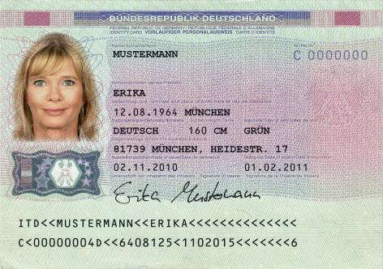

# Verordnung über Personalausweise und den elektronischen Identitätsnachweis (PAuswV)

Ausfertigungsdatum
:   2010-11-01

Fundstelle
:   BGBl I: 2010, 1460

Geändert durch
:   Art. 2 Abs. 7 G v. 22.12.2011 I 3044

## Eingangsformel

Auf Grund des § 34 des Personalausweisgesetzes vom 18. Juni 2009
(BGBl. I S. 1346) in Verbindung mit dem 2. Abschnitt des
Verwaltungskostengesetzes vom 23. Juni 1970 (BGBl. I S. 821) verordnet
das Bundesministerium des Innern im Benehmen mit dem Auswärtigen Amt:

## Kapitel 1 - Allgemeine Vorschriften

### § 1 Begriffsbestimmungen

(1) Eine Sperrsumme ist ein eindeutiges Merkmal, das aus dem
Sperrkennwort nach § 2 Absatz 6 des Personalausweisgesetzes, dem
Familiennamen, den Vornamen und dem Tag der Geburt eines
Ausweisinhabers errechnet wird. Es dient der Übermittlung einer
Sperrung vom Sperrnotruf oder einer Personalausweisbehörde an den
Sperrlistenbetreiber. Mit Hilfe der Sperrsumme ermittelt der
Sperrlistenbetreiber anhand der Referenzliste den Sperrschlüssel eines
zu sperrenden elektronischen Identitätsnachweises.

(2) Ein Sperrschlüssel ist ein eindeutiges kartenspezifisches Merkmal,
das der Errechnung eines allgemeinen Sperrmerkmals eines zu sperrenden
elektronischen Identitätsnachweises dient. Er wird vom
Ausweishersteller erzeugt, dem Sperrlistenbetreiber übermittelt und
dauerhaft in der Referenzliste gespeichert.

(3) Berechtigungszertifikateanbieter im Sinne dieser Verordnung ist
eine natürliche oder juristische Person, die Berechtigungszertifikate
im Sinne des § 2 Absatz 4 Satz 1 des Personalausweisgesetzes
ausstellt.

(4) Ein allgemeines Sperrmerkmal ist ein eindeutiges
kartenspezifisches Merkmal, das einen gesperrten elektronischen
Identitätsnachweis in der allgemeinen Sperrliste repräsentiert. Es
wird Berechtigungszertifikateanbietern übermittelt, die es zu
Sperrmerkmalen nach § 2 Absatz 7 des Personalausweisgesetzes
umrechnen.

(5) Der Sperrnotruf ist eine Einrichtung, über die der Ausweisinhaber
seinen elektronischen Identitätsnachweis unter Angabe von
Sperrkennwort, Familienname, Vornamen und Tag der Geburt in die
allgemeine Sperrliste aufnehmen lassen kann.

(6) Extensible Markup Language für hoheitliche Dokumtente (XhD) ist
ein in erweiterbarer Seitenbeschreibungssprache (XML) verfasstes
Datenaustauschformat für hoheitliche Dokumente.

(7) OSCI-Transport ist der vom Kooperationsausschuss Automatisierte
Datenverarbeitung Bund/Länder/Kommunaler Bereich festgelegte jeweils
geltende Standard für ein Datenübermittlungsprotokoll. Der Standard
OSCI-Transport ist in der vom Bundesamt für Sicherheit in der
Informationstechnik festgelegten Fassung, die im Bundesanzeiger
bekannt gemacht ist, zu verwenden.

### § 2 Technische Richtlinien des Bundesamtes für Sicherheit in der Informationstechnik

Nach dem Stand der Technik sind zu erfüllen

1.  die technischen Anforderungen an

    a)  die Speicherung des Lichtbildes und der Fingerabdrücke und

    b)  den Zugriffsschutz auf die im elektronischen Speicher- und
        Verarbeitungsmedium abgelegten Daten sowie

2.  die technischen und organisatorischen Anforderungen an

    a)  die Erfassung und Qualitätssicherung des Lichtbildes und der
        Fingerabdrücke,

    b)  die Übermittlung sämtlicher Ausweisantragsdaten von den
        Personalausweisbehörden an den Ausweishersteller,

    c)  den elektronischen Identitätsnachweis und

    d)  die Geheimnummer, die Sperrung und Entsperrung des elektronischen
        Identitätsnachweises durch den Ausweisinhaber und die Speicherung und
        Löschung der Sperrmerkmale und des Sperrkennwortes, insbesondere an
        die dabei einzusetzenden technischen Systeme und Kommunikationswege.

Der Stand der Technik ist als niedergelegt zu vermuten in den
Technischen Richtlinien des Bundesamtes für Sicherheit in der
Informationstechnik. Diese sind in Anhang 4 aufgeführt und gelten in
der jeweils im Bundesanzeiger veröffentlichten Fassung.

### § 3 Zertifizierung

(1) Die Systemkomponenten der Personalausweisbehörden, des
Ausweisherstellers, der Diensteanbieter und ihrer Auftragnehmer nach §
11 des Bundesdatenschutzgesetzes, deren Zertifizierung verpflichtend
oder optional ist, ergeben sich aus dem Anhang 5. Die Art und die
Einzelheiten der Zertifizierung sind den Technischen Richtlinien des
Bundesamtes für Sicherheit in der Informationstechnik zu entnehmen.

(2) Für die Zertifizierung gilt § 9 des BSI-Gesetzes vom 14. August
2009 (BGBl. I S. 2821) sowie die BSI-Zertifizierungsverordnung vom 7.
Juli 1992 (BGBl. I S. 1230) in der jeweils geltenden Fassung.

(3) Die Kosten der Zertifizierung trägt der Antragsteller. Die BSI-
Kostenverordnung vom 3. März 2005 (BGBl. I S. 519) in der jeweils
geltenden Fassung findet Anwendung.

### § 4 Dokumentationspflichten

(1) Die Personalausweisbehörde dokumentiert für die Zwecke des
elektronischen Identitätsnachweises:

1.  Erklärungen des Ausweisinhabers, die im Rahmen der Antragstellung und
    Ausweisverwaltung erfolgt sind;

2.  das Datum und die Uhrzeit der Ausgabe des Personalausweises;

3.  das Datum und die Uhrzeit der Übergabe des Briefes mit der
    Geheimnummer, der Entsperrnummer und dem Sperrkennwort, falls die
    Personalausweisbehörde den Brief übergibt;

4.  die Ausschaltung des elektronischen Identitätsnachweises mit Datum und
    Uhrzeit der Ausschaltung sowie die Personalausweisbehörde, die den
    elektronischen Identitätsnachweis ausgeschaltet hat;

5.  die Einschaltung des elektronischen Identitätsnachweises mit Datum und
    Uhrzeit der Einschaltung sowie die Personalausweisbehörde, die den
    elektronischen Identitätsnachweis eingeschaltet hat;

6.  den Sperrantrag durch den Ausweisinhaber, die Übermittlung der
    Sperrsumme an den Sperrlistenbetreiber sowie das Datum und die Uhrzeit
    von Antrag und Übermittlung;

7.  den Entsperrantrag des Ausweisinhabers, die Übermittlung der
    Sperrsumme an den Sperrlistenbetreiber sowie das Datum und die Uhrzeit
    von Antrag und Übermittlung.

(2) Der Sperrnotruf dokumentiert für die Zwecke des elektronischen
Identitätsnachweises den Sperrantrag durch den Ausweisinhaber, die
Übermittlung der Sperrsumme an den Sperrlistenbetreiber sowie das
Datum und die Uhrzeit von Antrag und Übermittlung.

(3) Der Sperrlistenbetreiber dokumentiert

1.  im Zusammenhang mit der Sperrung des elektronischen
    Identitätsnachweises

    a)  den Eingang des Sperrantrages mit der Sperrsumme sowie das Datum und
        die Uhrzeit des Eingangs,

    b)  die Aufnahme des allgemeinen Sperrmerkmals in die Sperrliste sowie das
        Datum und die Uhrzeit der Sperrung,

    c)  die Anfrage zur Erzeugung der Sperrliste sowie das Datum und die
        Uhrzeit der Erzeugung und

    d)  den tatsächlichen Abruf sowie das Datum und die Uhrzeit des
        tatsächlichen Abrufs sowie

2.  im Zusammenhang mit der Entsperrung des elektronischen
    Identitätsnachweises

    a)  den Eingang des Entsperrantrages mit der Sperrsumme sowie das Datum
        und die Uhrzeit des Eingangs,

    b)  die Entfernung des allgemeinen Sperrmerkmals aus der Sperrliste sowie
        das Datum und die Uhrzeit der Entfernung,

    c)  die Bereitstellung der Sperrliste zum Abruf sowie das Datum und die
        Uhrzeit der Bereitstellung sowie

    d)  den tatsächlichen Abruf sowie das Datum und die Uhrzeit des
        tatsächlichen Abrufs.

### § 5 Speicherung und Löschung

(1) Für die Speicherung personenbezogener Daten nach dieser Verordnung
bei den Personalausweisbehörden gilt § 23 Absatz 4 des
Personalausweisgesetzes entsprechend.

(2) Personenbezogene Daten beim Sperrnotruf sind ein Jahr nach ihrer
Erhebung zu löschen.

(3) Für die Speicherung beim Sperrlistenbetreiber gelten folgende
Fristen:

1.  Sperrschlüssel und Sperrsumme sind zehn Jahre nach deren Eintragung
    aus der Referenzliste zu löschen.

2.  Aktualisierungen der Sperrliste werden gespeichert, damit eine
    Sperrung oder Entsperrung von elektronischen Identitätsnachweisen
    nachgewiesen werden kann. Sie werden zehn Jahre nach ihrer Speicherung
    gelöscht.

3.  Ein allgemeines Sperrmerkmal wird aus der Sperrliste entfernt zehn
    Jahre, nachdem der Sperrschlüssel beim Sperrlistenbetreiber
    gespeichert worden ist, oder wenn die Personalausweisbehörde eine
    Entsperrung vorgenommen hat.

(4) Der Ausweishersteller speichert die Daten, die im Rahmen des
Produktionsverfahrens erlangt oder erzeugt worden sind und der
antragstellenden Person zugeordnet werden können, höchstens so lange,
bis der Sperrlistenbetreiber den Empfang der Sperrsumme und des
Sperrschlüssels und die Personalausweisbehörde den Eingang des
Sperrkennworts bestätigt haben. Im Übrigen sind die Daten sicher zu
löschen. Der Ausweishersteller führt zur Vermeidung von Doppelungen
eine Liste mit Sperrsummen von hergestellten Personalausweisen. Die
Sperrsummen in dieser Liste sind zehn Jahre nach ihrer Eintragung zu
löschen. § 26 Absatz 3 Satz 1 des Personalausweisgesetzes bleibt
unberührt.

## Kapitel 2 - Übermittlung der Ausweisantragsdaten

### § 6 Erfassung der Anschrift

Der Wohnort in der Anschrift nach § 5 Absatz 2 Nummer 9 Alternative 1
des Personalausweisgesetzes ist mit der amtlichen Bezeichnung und mit
dem im amtlichen Gemeindeverzeichnis verwendeten eindeutigen
Gemeindeschlüssel zu erfassen. Zusätze zum Namen des Wohnortes sind
einheitlich aufzunehmen, wenn dies für die Eindeutigkeit des Wohnortes
oder des Straßennamens erforderlich ist. Darüber hinaus wird auch die
Postleitzahl erfasst.

### § 7 Qualitätssicherung des Lichtbildes und der Fingerabdrücke

(1) Bei der Beantragung eines Personalausweises ist von der
antragstellenden Person ein aktuelles Lichtbild ohne Rand vorzulegen,
das 45 Millimeter hoch und 35 Millimeter breit ist. Wenn die
Personalausweisbehörde die technischen Voraussetzungen geschaffen hat,
kann das Lichtbild auch

1.  von Dritten elektronisch verschlüsselt und signiert an die
    Personalausweisbehörde übermittelt werden, soweit diese Form der
    Übermittlung durch eine Technische Richtlinie des Bundesamtes für
    Sicherheit in der Informationstechnik vorgesehen ist, oder

2.  durch die Personalausweisbehörde gefertigt werden.

(2) Die Personalausweisbehörde stellt durch geeignete technische und
organisatorische Maßnahmen die erforderliche Qualität der Erfassung
des Lichtbildes und der Fingerabdruckbilder sicher. Dazu hat sie die
Fingerabdruckbilder und das Lichtbild mit einer zertifizierten
Qualitätssicherungssoftware zu prüfen und in dem für den Ausweis
verwendeten Format zu speichern. Darüber hinaus hat auch die Erfassung
der Fingerabdruckbilder mit zertifizierter Hardware zu erfolgen.

(3) Das Lichtbild muss die Person in einer Frontalaufnahme, ohne
Kopfbedeckung und ohne Bedeckung der Augen zeigen. Im Übrigen muss das
Lichtbild den Vorgaben des Anhangs 3 Abschnitt 2 entsprechen. Die
Personalausweisbehörde kann von diesen Vorgaben aus medizinischen
Gründen, die nicht nur vorübergehender Art sind, Ausnahmen zulassen.
Vom Verbot der Kopfbedeckung kann sie auch aus religiösen Gründen
Ausnahmen zulassen.

### § 8 Übermittlung

(1) Nachdem die Personalausweisbehörde alle Antragsdaten erfasst hat,
führt sie diese zu einem digitalen Datensatz zusammen und übermittelt
sie dem Ausweishersteller. Die Datenübermittlung umfasst auch

1.  die Qualitätswerte zu den Fingerabdrücken, soweit diese abgenommen
    wurden,

2.  die Qualitätswerte zu den Lichtbildern,

3.  die Versionsnummern der Qualitätssicherungssoftware,

4.  die Sollwerte der Qualitätssicherungssoftware,

5.  die technischen Eigenschaften der gespeicherten biometrischen Daten
    gemäß ISO-Standard 19794,

6.  die Behördenkennzahl sowie

7.  den Zeitstempel des Ausweisantrages.

Die Datenübermittlung erfolgt entweder durch Datenübertragung über die
informationstechnischen Netze von Bund und Ländern oder über allgemein
zugängliche Netze. Soweit die Datenübermittlung zwischen
informationstechnischen Netzen von Bund und Ländern stattfindet, ist
dafür spätestens ab dem 1. Januar 2015 nach § 3 des Gesetzes über die
Verbindung der informationstechnischen Netze des Bundes und der Länder
vom 10. August 2009 (BGBl. I S. 2706) das Verbindungsnetz zu nutzen.
Die zu übermittelnden Daten sind nach dem Stand der Technik
fortgeschritten elektronisch zu signieren und zu verschlüsseln.

(2) Zum Signieren und Verschlüsseln der nach Absatz 1 zu
übermittelnden Daten sind geeignete gültige Zertifikate aus der
untergeordneten Zertifizierungsinstanz „Hoheitliche Dokumente“ der
DeutschlandOnline-Infrastruktur zu verwenden.

(3) Für die Übermittlung der Daten an den Ausweishersteller nach
Absatz 1 Satz 3 wird das Datenformat XhD auf der Basis des
Datenübermittlungsprotokolls OSCI-Transport verwendet. Die
Datenübermittlung kann auch über Vermittlungsstellen erfolgen. Die
beteiligten Stellen haben dem jeweiligen Stand der Technik
entsprechende Maßnahmen zur Sicherstellung von Datenschutz und
Datensicherheit zu treffen, die insbesondere die Vertraulichkeit und
Unversehrtheit der Daten sowie die Feststellbarkeit der übermittelnden
Stelle gewährleisten; insofern sind dem jeweiligen Stand der Technik
entsprechende Verschlüsselungsverfahren – auch im Fall der Nutzung
allgemein zugänglicher Netze – anzuwenden. Das Auswärtige Amt kann für
die Datenübermittlung an den Ausweishersteller ein abweichendes
Übermittlungsprotokoll verwenden. Die Datenübermittlung zwischen dem
Auswärtigen Amt und seinen Auslandsvertretungen muss hinsichtlich
Datensicherheit und Datenschutz ein den Anforderungen dieser
Verordnung entsprechendes Niveau aufweisen.

(4) Vor der Übermittlung der Ausweisdaten hinterlegen
Personalausweisbehörden, Ausweishersteller und Vermittlungsstellen
alle für eine elektronische und automatisierte Kommunikation
benötigten technischen Verbindungsparameter im Deutschen
Verwaltungsdiensteverzeichnis (DVDV), insbesondere die dafür
erforderlichen Zertifikate. Der Ausweishersteller nutzt eine
Funktionalität des DVDV, um die Personalausweisbehörde als eine solche
zu verifizieren. Das Auswärtige Amt kann die benötigten technischen
Verbindungsparameter und die damit verbundenen erforderlichen
Zertifikate technisch unabhängig vom Deutschen
Verwaltungsdiensteverzeichnis (DVDV) lösen. Die Lösung muss
hinsichtlich Datensicherheit und Datenschutz ein den Anforderungen
dieser Verordnung entsprechendes Niveau aufweisen.

### § 9 Qualitätsstatistik

(1) Der Ausweishersteller erstellt eine Qualitätsstatistik. Sie
enthält anonymisierte Qualitätswerte zu Lichtbildern und
Fingerabdrücken, die sowohl in der Personalausweisbehörde als auch
beim Ausweishersteller ermittelt und vom Ausweishersteller in der
Qualitätsstatistik ausgewertet und zusammengefasst werden.

(2) Der Ausweishersteller stellt die Ergebnisse der Auswertung und auf
Verlangen die in der Statistik erfassten anonymisierten Einzeldaten
dem Bundesministerium des Innern, dem Bundesamt für Sicherheit in der
Informationstechnik und dem Bundeskriminalamt zur Verfügung.

## Kapitel 3 - Produktion

### § 10 Eingang der Antragsdaten

Der Ausweishersteller prüft, ob die Antragsdaten vollständig und
unversehrt eingegangen sind, und bestätigt der Personalausweisbehörde
unverzüglich den Eingang in elektronischer Form. Er hat technische und
organisatorische Maßnahmen zu treffen, die ausschließen, dass ungültig
oder falsch signierte oder anderweitig fehlerhafte Antragsdaten
weiterverarbeitet werden. Der Ausweishersteller prüft die Identität
der übermittelnden Personalausweisbehörde.

### § 11 Muster für den Personalausweis

Der Personalausweis ist nach dem in Anhang 1 abgedruckten Muster
herzustellen. Für die einzutragenden Daten gelten die formalen
Anforderungen des Anhangs 3 Abschnitt 1.

### § 12 Muster für den vorläufigen Personalausweis

Der vorläufige Personalausweis ist nach dem in Anhang 2 abgedruckten
Muster herzustellen. Für die einzutragenden Daten gelten die formalen
Anforderungen des Anhangs 3 Abschnitt 1.

### § 13 Schnittstelle des elektronischen Speicher- und Verarbeitungsmediums

Das elektronische Speicher- und Verarbeitungsmedium des
Personalausweises ist mit einer kontaktlosen Schnittstelle
ausgestattet und benötigt für die Datenübertragung die
Energieversorgung durch Lesegeräte.

### § 14 Speicherung von personenbezogenen Daten; Zugriffsschutz

(1) Alle im elektronischen Speicher- und Verarbeitungsmedium des
Personalausweises gespeicherten personenbezogenen Daten sind gegen
unbefugten Zugriff zu schützen. Es ist insbesondere sicherzustellen,
dass

1.  vor der Übermittlung personenbezogener Daten die Geheimnummer, die
    Zugangsnummer oder die Daten der maschinenlesbaren Zone (MRZ)
    eingegeben werden müssen,

2.  Zugriffsrechte über Berechtigungszertifikate nachgewiesen werden
    müssen und

3.  alle personenbezogenen Daten zwischen dem elektronischen Speicher- und
    Verarbeitungsmedium und Inhabern von Berechtigungszertifikaten
    verschlüsselt übermittelt werden.

(2) Der Personalausweis ist so herzustellen, dass personenbezogene
Daten ausschließlich ausgelesen werden können durch

1.  Behörden, die zur Identitätsfeststellung berechtigt sind und ein
    hoheitliches Berechtigungszertifikat nutzen, oder

2.  berechtigte Diensteanbieter, die ein Berechtigungszertifikat nutzen,
    nach Eingabe der Geheimnummer durch den Ausweisinhaber.

### § 15 Übermittlung und Übersendung des Sperrkennworts an die Personalausweisbehörde

(1) Der Ausweishersteller übermittelt der Personalausweisbehörde im
Datenübertragungsformat XhD auf sicherem elektronischem Weg
verschlüsselt und signiert das Sperrkennwort zur Speicherung im
Personalausweisregister.

(2) Die Personalausweisbehörde bestätigt dem Ausweishersteller den
Eingang des Sperrkennworts unverzüglich. Hat der Ausweishersteller
drei Werktage, nachdem er das Sperrkennwort übermittelt hatte, keine
Bestätigung erhalten, fragt er bei der Personalausweisbehörde nach.

### § 16 Übermittlung der Sperrsumme und des Sperrschlüssels an den Sperrlistenbetreiber

Der Ausweishersteller übermittelt dem Sperrlistenbetreiber auf
sicherem elektronischem Weg verschlüsselt und signiert die Sperrsumme
und den Sperrschlüssel eines Personalausweises, bevor er diesen an die
Personalausweisbehörde sendet. § 8 Absatz 1 Satz 3 bis 5 gilt
entsprechend. Der Sperrlistenbetreiber bestätigt dem Ausweishersteller
unverzüglich den Eingang dieser Daten. Hat der Ausweishersteller zwei
Werktage, nachdem er die Sperrsumme und den Sperrschlüssel übermittelt
hat, keine Bestätigung erhalten, fragt er bei dem Sperrlistenbetreiber
nach.

### § 17 Übersendung der Geheimnummer, der Entsperrnummer und des Sperrkennworts

(1) Der Ausweishersteller übersendet der antragstellenden Person die
Geheimnummer, die Entsperrnummer und das Sperrkennwort des
Personalausweises in einem Brief. Als Absenderanschrift ist die
postalische Anschrift der ausstellenden Personalausweisbehörde
anzugeben.

(2) Personalausweis und Geheimnummer dürfen zu keinem Zeitpunkt mit
gleicher Post versandt werden.

(3) In den Fällen des § 13 Satz 3 des Personalausweisgesetzes soll bis
zur persönlichen Übergabe an die antragstellende Person der Schutz
gegen Kenntnisnahme der Geheimnummer und der Entsperrnummer durch
Dritte gewährleistet sein.

(4) Der Ausweishersteller versendet den Brief nach Absatz 1 an die im
Personalausweis angegebene Anschrift. Hat die antragstellende Person
keine alleinige Wohnung in Deutschland wird der Brief vom
Ausweishersteller nach Weisung des Auswärtigen Amtes, die mit dem
Bundesministerium des Innern abgestimmt ist, an die ausstellende
Personalausweisbehörde oder aber an die antragstellende Person
persönlich versandt. Bei als unzustellbar zurückgesandten Briefen
übergibt die Personalausweisbehörde den Brief an die antragstellende
Person. Absatz 3 gilt entsprechend.

(5) Der Ausweishersteller erstellt und versendet einen Brief nur dann,
wenn die antragstellende Person zum Antragszeitpunkt mindestens 15
Jahre und neun Monate alt ist.

(6) Hat die antragstellende Person den Brief nicht erhalten, kann sie
einen neuen Personalausweis beantragen. In diesem Fall wird der zum
neuen Personalausweis gehörende Brief an die Personalausweisbehörde
versandt, die ihn der antragstellenden Person übergibt. Absatz 3 gilt
entsprechend.

(7) Die antragstellende Person muss, bevor ihr der Personalausweis
ausgehändigt wird, schriftlich bestätigen, dass sie den Brief auf
postalischem Weg oder durch Übergabe empfangen hat. Satz 1 gilt nicht
für antragstellende Personen, die keine alleinige Wohnung in
Deutschland haben, wenn diesen der Personalausweis nicht persönlich
durch die Personalausweisbehörde übergeben wird.

## Kapitel 4 - Aushändigung

### § 18 Aushändigung des Personalausweises

(1) Erklärt die antragstellende Person, den elektronischen
Identitätsnachweis nicht nutzen zu wollen, schaltet die
Personalausweisbehörde den elektronischen Identitätsnachweis aus.

(2) Bestätigt die antragstellende Person den Empfang des Briefes nach
§ 17 Absatz 7 nicht, darf der Personalausweis nur mit ausgeschaltetem
elektronischem Identitätsnachweis übergeben werden.

(3) Der Ausweisinhaber kann sich die auslesbaren personenbezogenen
Daten, die auf seinem Personalausweis gespeichert sind, jederzeit bei
einer Personalausweisbehörde anzeigen lassen.

(4) Für das Lesen der Daten nach den Absätzen 1 und 3 sind
zertifizierte Lesegeräte mit hoheitlichem Berechtigungszertifikat zu
verwenden.

(5) Die Personalausweisbehörde im Ausland darf Personalausweise im
Ausland auf dem Postweg an die antragstellende Person versenden,
sofern die Abholung des Personalausweises für die antragstellende
Person nur unter unzumutbaren Zuständen möglich wäre.

## Kapitel 5 - Änderung von Daten

### § 19 Änderung der Anschrift

(1) Die Personalausweisbehörde ändert die Anschrift auf dem
Personalausweis, indem sie einen Aufkleber mit der neuen Anschrift und
der Personalausweisnummer nach dem Muster in Anhang 1 anfertigt.

(2) Die Personalausweisbehörde ändert die auf dem elektronischen
Speicher- und Verarbeitungsmedium gespeicherte Anschrift.

(3) Für die Änderung der Daten nach Absatz 2 sind zertifizierte Geräte
mit hoheitlichem Berechtigungszertifikat zu verwenden.

### § 20 Neusetzung und Änderung der Geheimnummer

(1) Kennt der Ausweisinhaber die ursprüngliche Geheimnummer nicht,
kann die Personalausweisbehörde die Neusetzung der Geheimnummer durch
den Ausweisinhaber einleiten. Die Personalausweisbehörde hat zuvor die
Identität des Ausweisinhabers zu überprüfen. Durch technische und
organisatorische Maßnahmen hat die Personalausweisbehörde
sicherzustellen, dass niemand außer dem Ausweisinhaber Kenntnis von
der Geheimnummer erlangt.

(2) Der Ausweisinhaber kann die Geheimnummer durch Eingabe der
bisherigen Geheimnummer und zweimalige Eingabe der neuen Geheimnummer
ändern.

(3) Für die Änderung der Daten nach Absatz 1 Satz 1 sind zertifizierte
Geräte mit hoheitlichem Berechtigungszertifikat zu verwenden.

### § 21 Mehrfache Fehleingabe der Geheimnummer

(1) Wurde die Geheimnummer zwei Mal falsch eingegeben, kann durch
vorherige Eingabe der Zugangsnummer ein dritter Eingabeversuch
freigegeben werden.

(2) Wurde die Geheimnummer drei Mal falsch eingegeben, kann der
elektronische Identitätsnachweis nur genutzt werden, wenn die
Entsperrnummer eingegeben wird und diese nicht bereits zehn Mal
benutzt wurde. Eine Verwendung der Entsperrnummer ist nach zehnmaliger
Nutzung nicht mehr möglich. Sofern die Geheimnummer nach dreimaliger
Falscheingabe gesperrt wurde, kann die Neusetzung der Geheimnummer
ausschließlich in der Personalausweisbehörde erfolgen.

## Kapitel 6 - Nutzung des elektronischen Identitätsnachweises

### § 22 Nachträgliches Aus- und Einschalten

(1) Bevor die ausstellende oder zuständige Personalausweisbehörde
einen eingeschalteten elektronischen Identitätsnachweis nach § 10
Absatz 3 Satz 2 des Personalausweisgesetzes ausschaltet, prüft sie die
Identität des Ausweisinhabers. Die Personalausweisbehörde speichert
die Tatsache der Ausschaltung im Personalausweisregister. Handelt die
zuständige Personalausweisbehörde, informiert sie die ausstellende
Personalausweisbehörde über die Ausschaltung. In diesem Fall speichert
die ausstellende Personalausweisbehörde die Tatsache der Ausschaltung
im Personalausweisregister.

(2) Bevor die ausstellende oder zuständige Personalausweisbehörde
einen ausgeschalteten elektronischen Identitätsnachweis nach § 10
Absatz 3 Satz 1 des Personalausweisgesetzes einschaltet, prüft sie die
Identität des Ausweisinhabers. Die Personalausweisbehörde löscht die
Tatsache der Ausschaltung im Personalausweisregister. Handelt die
zuständige Personalausweisbehörde, findet Absatz 1 Satz 3 und 4
entsprechende Anwendung. Die Personalausweisbehörde initiiert bei
jeder nachträglichen Einschaltung die Neusetzung der Geheimnummer
durch den Ausweisinhaber und teilt ihm auf Wunsch das Sperrkennwort
aus dem Personalausweisregister mit.

(3) Für das nachträgliche Ein- und Ausschalten des elektronischen
Identitätsnachweises nach den Absätzen 1 und 2 sind zertifizierte
Geräte mit hoheitlichem Berechtigungszertifikat zu verwenden.

### § 23 Voraussetzungen für die Nutzung bei dem Ausweisinhaber

(1) Vor erstmaliger Nutzung des elektronischen Identitätsnachweises
soll der Ausweisinhaber die Geheimnummer einmalig durch Eingabe der im
Brief übersandten ursprünglichen Geheimnummer neu setzen.

(2) Der Ausweisinhaber soll sicherstellen, dass insbesondere folgende
Komponenten bei der Nutzung des elektronischen Identitätsnachweises
eingesetzt werden:

1.  informationstechnische Systeme mit geeigneten Abwehrmaßnahmen gegen
    Sicherheitslücken nach dem Stand der Technik;

2.  Lesegeräte, die durch das Bundesamt für Sicherheit in der
    Informationstechnik zertifiziert worden sind;

3.  Software zur Nutzung des elektronischen Identitätsnachweises, die
    durch das Bundesamt für Sicherheit in der Informationstechnik
    zertifiziert worden ist.

## Kapitel 7 - Sperrung und Entsperrung des elektronischen Identitätsnachweises

### § 24 Referenzliste; allgemeine Sperrliste

(1) Der Sperrlistenbetreiber führt eine Referenzliste der Sperrsummen,
der Sperrschlüssel und des Datums der Übermittlung dieser Daten vom
Ausweishersteller. Die Referenzliste enthält die in Satz 1 genannten
Daten aller Personalausweise. Sie darf ausschließlich für die
Ermittlung des Sperrschlüssels zu einer übermittelten Sperrsumme
verwendet werden.

(2) Der Sperrlistenbetreiber führt eine allgemeine Sperrliste. Sie
enthält allgemeine Sperrmerkmale gesperrter elektronischer
Identitätsnachweise und wird Berechtigungszertifikateanbietern auf
Anfrage zur Umrechnung in dienstespezifische Sperrlisten
bereitgestellt.

### § 25 Sperrung des elektronischen Identitätsnachweises

(1) Kommt ein Personalausweis abhanden, hat der Ausweisinhaber den
elektronischen Identitätsnachweis über die zuständige oder
ausstellende Personalausweisbehörde oder den Sperrnotruf, der auch vom
Ausland aus erreichbar ist, unverzüglich sperren zu lassen. Die
Stelle, über die der Ausweisinhaber den elektronischen
Identitätsnachweis nach Satz 1 sperren lässt, hat den Ausweisinhaber
vor der Sperrung zu identifizieren. Die Sperrung kann unter Angabe des
Sperrkennworts, des Familiennamens, der Vornamen und des Tages der
Geburt gegenüber der zuständigen oder ausstellenden
Personalausweisbehörde auch ohne Angabe des Sperrkennworts geschehen.

(2) Die Stelle, über die der Ausweisinhaber den elektronischen
Identitätsnachweis nach Absatz 1 Satz 1 sperren lässt, erzeugt
unverzüglich die Sperrsumme und übermittelt sie unverzüglich dem
Sperrlistenbetreiber. Handelt die zuständige Personalausweisbehörde,
informiert diese die ausstellende Personalausweisbehörde über den
Sperrantrag. Die ausstellende Personalausweisbehörde dokumentiert die
Tatsache der Sperrung im Personalausweisregister.

(3) Der Sperrlistenbetreiber hat den Eintrag des allgemeinen
Sperrmerkmals in die Sperrliste unverzüglich zu bestätigen und an den
Ausweisinhaber weiterzuleiten. Lässt der Ausweisinhaber den
elektronischen Identitätsnachweis über die zuständige oder
ausstellende Personalausweisbehörde sperren, hat die Bestätigung
gegenüber der ausstellenden Personalausweisbehörde zu erfolgen. Lässt
der Ausweisinhaber den elektronischen Identitätsnachweis über den
Sperrnotruf sperren, hat die Bestätigung gegenüber dem Sperrnotruf zu
erfolgen.

### § 26 Entsperrung des elektronischen Identitätsnachweises

(1) Der Ausweisinhaber kann die Entsperrung eines gesperrten
elektronischen Identitätsnachweises bei der ausstellenden oder
zuständigen Personalausweisbehörde beantragen. Die Entsperrung erfolgt
nach der Identifizierung des Ausweisinhabers. Der Ausweisinhaber muss
hierzu persönlich erscheinen.

(2) Handelt die zuständige Personalausweisbehörde, informiert sie die
ausstellende Personalausweisbehörde über den Entsperrantrag. Diese
übermittelt dem Sperrlistenbetreiber die Sperrsumme und löscht im
Personalausweisregister die Eintragung des Personalausweises in die
Sperrliste.

(3) Die Löschung des allgemeinen Sperrmerkmals aus der Sperrliste ist
der ausstellenden Personalausweisbehörde vom Sperrlistenbetreiber zu
bestätigen. Die ausstellende Personalausweisbehörde leitet die
Bestätigung an den Ausweisinhaber weiter.

### § 27 Auskunft über Sperrung

Der Sperrlistenbetreiber hat die technischen und organisatorischen
Vorkehrungen dafür zu treffen, dass der Ausweisinhaber Auskunft
darüber erhält, ob der elektronische Identitätsnachweis in der
allgemeinen Sperrliste eingetragen ist. Die gleiche Auskunft ist der
Personalausweisbehörde über elektronische Identitätsnachweise von
Personalausweisen zu erteilen, die von ihr ausgestellt worden sind.

## Kapitel 8 - Beantragung von Berechtigungen

### § 28 Antrag

(1) Um das Vorliegen der Voraussetzungen des § 21 Absatz 2 Satz 1 des
Personalausweisgesetzes überprüfen zu können, muss ein Antrag nach §
21 Absatz 1 Satz 1 des Personalausweisgesetzes enthalten:

1.  Angaben zur Identitätsfeststellung von juristischen und natürlichen
    Personen; bei natürlichen Personen sind dies insbesondere der
    Familienname, die Vornamen, der Tag und der Ort der Geburt sowie die
    Anschrift der Hauptwohnung; bei juristischen Personen sind diese
    insbesondere der Name, die Anschrift des Sitzes, die Rechtsform und
    die Bevollmächtigten; außerdem ist in diesem Fall eine Kopie des
    Handelsregisterauszugs oder der Errichtungsurkunde beizulegen;

2.  Kontaktdaten, insbesondere die Telefon- und Faxnummer sowie die E
    -Mail-Adresse;

3.  Angaben zu antragstellenden Personen mit Wohnung oder Sitz außerhalb
    Deutschlands, soweit zur eindeutigen länderspezifischen
    Identifizierung erforderlich, einschließlich einer ladungsfähigen
    Anschrift; soweit eine Niederlassung in Deutschland besteht, sind auch
    deren Angaben nach den Nummern 1 und 2 aufzunehmen;

4.  eine Beschreibung des Diensteanbieters und seiner Tätigkeitsfelder
    sowie die Angabe der Unternehmenswebsite, soweit vorhanden;

5.  eine Beschreibung des Diensteangebots für das das
    Berechtigungszertifikat gelten soll, einschließlich einer Angabe der
    Internetseite, auf der das Berechtigungszertifikat genutzt wird, oder
    des Standortes bei Automaten und eines Verweises auf die für das
    Angebot geltende Datenschutzerklärung;

6.  eine hinreichende Beschreibung des Zwecks der Datenerhebung, für den
    die Berechtigung ausgestellt werden soll;

7.  eine Angabe der Datenkategorien nach § 18 Absatz 3 des
    Personalausweisgesetzes, auf die die antragstellende Person zugreifen
    möchte; hierbei ist für jede Datenkategorie zu begründen, warum es für
    den dargelegten Zweck erforderlich ist, die Daten zu erheben;

8.  Angaben zum oder zur betrieblichen oder behördlichen
    Datenschutzbeauftragten nach § 4f des Bundesdatenschutzgesetzes (Name,
    Anschrift, Telefonnummer, E-Mail-Adresse) und zur zuständigen
    Datenschutzaufsichtsbehörde (Name, Sitz, Anschrift, Telefonnummer, E
    -Mail-Adresse);

9.  die Angabe, ob die antragstellende Person sich eines Auftragnehmers
    nach § 11 des Bundesdatenschutzgesetzes zur Durchführung des
    elektronischen Identitätsnachweises bedienen wird und gegebenenfalls
    die Angaben nach Nummer 1 für diesen Auftragnehmer; ist diese Angabe
    zum Zeitpunkt des Antrages noch nicht bekannt, so ist sie sobald
    bekannt unverzüglich nachzuliefern.

(2) Der Antrag ist von der antragstellenden Person zu unterschreiben
oder mit einer qualifizierten elektronischen Signatur zu versehen. Die
antragstellende Person ist zu identifizieren durch:

1.  persönliches Erscheinen und Vorlage eines amtlichen Lichtbildausweises
    der antragstellenden Person, bei juristischen Personen einer
    vertretungsberechtigten Person bei der Vergabestelle für
    Berechtigungszertifikate oder geeigneten Dritten,

2.  eine qualifizierte elektronische Signatur oder

3.  den elektronischen Identitätsnachweis.

Die Vergabestelle für Berechtigungszertifikate bestimmt, welche der
genannten Arten des Identitätsnachweises genutzt werden können.

### § 29 Anforderungen an Datenschutz und -sicherheit

(1) Anforderungen im Sinne des § 21 Absatz 2 Satz 1 Nummer 4 des
Personalausweisgesetzes liegen insbesondere nicht vor, wenn

1.  der Zweck der Datenerhebung ausschließlich in der Auslesung oder
    Bereitstellung personenbezogener Daten aus dem Personalausweis für den
    Ausweisinhaber oder Dritte besteht,

2.  der Staat des Wohnsitzes oder des Sitzes der antragstellenden Person
    kein angemessenes Datenschutzniveau gewährleistet entsprechend der
    Richtlinie 95/46/EG des Europäischen Parlaments und des Rates vom 24.
    Oktober 1995 zum Schutz natürlicher Personen bei der Verarbeitung
    personenbezogener Daten und zum freien Datenverkehr (ABl. L 281 vom
    23\.11.1995, S. 31),

3.  der elektronische Identitätsnachweis für den Diensteanbieter durch
    einen Auftragnehmer nach § 11 des Bundesdatenschutzgesetzes
    durchgeführt wird und hierbei kein wirksames Auftragsverhältnis nach §
    11 des Bundesdatenschutzgesetzes zwischen dem Diensteanbieter und dem
    Auftragnehmer besteht,

4.  der Diensteanbieter einen Auftragnehmer nach § 11 des
    Bundesdatenschutzgesetzes gewählt hat, der die technischen und
    organisatorischen Anforderungen des Bundesamtes für Sicherheit in der
    Informationstechnik für die sichere Bereitstellung des elektronischen
    Identitätsnachweises nicht erfüllt.

(2) Die Anforderungen an die Datensicherheit im Sinne des § 21 Absatz
2 Satz 1 Nummer 4 des Personalausweisgesetzes sind durch die
Diensteanbieter nach dem Stand der Technik zu erfüllen. Art und Umfang
der einzusetzenden Systemkomponenten legt die Vergabestelle für
Berechtigungszertifikate in der Berechtigung fest. Die Vergabestelle
für Berechtigungszertifikate legt in Richtlinien die weiteren
technischen und organisatorischen Anforderungen fest, die ein
Diensteanbieter zu erfüllen hat, um für die Nutzung von
Berechtigungszertifikaten zugelassen zu werden. Die Richtlinien gelten
in der jeweils im Bundesanzeiger veröffentlichten Fassung.

(3) Vor Erteilung einer Berechtigung für einen nicht-öffentlichen
Diensteanbieter kann die Vergabestelle für Berechtigungszertifikate
eine Stellungnahme der zuständigen Datenschutzaufsichtsbehörde
einholen, ob dort Umstände bekannt sind, aus denen sich Anhaltspunkte
für eine missbräuchliche Verwendung der Berechtigung ergeben.

### § 30 Öffentliche Liste der Berechtigungen

Die Vergabestelle für Berechtigungszertifikate veröffentlicht eine
Liste aller erteilten gültigen Berechtigungen. Dabei sind die Angaben
nach § 18 Absatz 4 Satz 2 Nummer 1 bis 4 des Personalausweisgesetzes
und die Gültigkeitsdauer der Berechtigung zu veröffentlichen. Die
Daten dürfen ausschließlich für Zwecke des elektronischen
Identitätsnachweises verwendet werden.

## Kapitel 9 - Ausgabe von Berechtigungszertifikaten

### § 31 Anzeige der Ausgabe von Berechtigungszertifikaten

Berechtigungszertifikateanbieter dürfen Berechtigungszertifikate für
den elektronischen Identitätsnachweis bereitstellen, wenn sie vor
Aufnahme dieser Tätigkeit

1.  der zuständigen Behörde nach § 3 des Signaturgesetzes die Aufnahme des
    Betriebs eines Zertifizierungsdienstes nach § 4 Absatz 3 des
    Signaturgesetzes angezeigt haben oder nach § 15 des Signaturgesetzes
    akkreditiert worden sind,

2.  der Vergabestelle für Berechtigungszertifikate die Anzeige nach Nummer
    1 vorgelegt und ihr gegenüber die in § 28 Absatz 1 Nummer 1 bis 3, 8
    und 9 sowie Absatz 2 aufgeführten Angaben gemacht haben.

### § 32 Beachtung der Anforderungen des Inhabers der Wurzelzertifikate

Das Bundesamt für Sicherheit in der Informationstechnik ist Inhaber
der Wurzelzertifikate für Berechtigungszertifikate zum elektronischen
Identitätsnachweis. Die Zertifikatsrichtlinien des Bundesamtes für
Sicherheit in der Informationstechnik für die technischen und
organisatorischen Voraussetzungen für die Ausstellung von
Berechtigungszertifikaten sind vom Berechtigungszertifikateanbieter
einzuhalten. Die Richtlinien gelten in der jeweils im Bundesanzeiger
veröffentlichten Fassung.

### § 33 Beachtung der Berechtigung durch den Berechtigungszertifikateanbieter

Vor der Ausgabe von Berechtigungszertifikaten hat der
Berechtigungszertifikateanbieter zu überprüfen, ob eine Berechtigung
der Vergabestelle für Berechtigungszertifikate vorliegt. Er hat
Auflagen, Beschränkungen und Nebenbestimmungen der Berechtigung zu
beachten. Bei Zweifeln über den Inhaber, die Gültigkeit oder den
Umfang einer Berechtigung hat er vor der Ausstellung von
Berechtigungszertifikaten die Vergabestelle für
Berechtigungszertifikate zu informieren. Wird ein
Berechtigungszertifikat widerrufen oder zurückgenommen, informiert die
Vergabestelle für Berechtigungszertifikate den vom Diensteanbieter
beauftragten Berechtigungszertifikateanbieter.

### § 34 Gültigkeitsdauer von Berechtigungszertifikaten

Die Vergabestelle für Berechtigungszertifikate legt mit Erteilung der
Berechtigung die Gültigkeitsdauer der Berechtigungszertifikate fest.
Das Bundesamt für Sicherheit in der Informationstechnik legt
angemessene Höchstgrenzen für die Gültigkeitsdauer von
Berechtigungszertifikaten fest. Es hat sich dabei am Risiko des
Einsatzumfeldes und an den beantragten Datenkategorien zu orientieren.

### § 35 Speicherung, Abruf und Verwendung von Daten durch Berechtigungszertifikateanbieter

(1) Berechtigungszertifikateanbieter sind verpflichtet, sich zur
Erzeugung von Listen, die Sperrmerkmale im Sinne des § 2 Absatz 7 des
Personalausweisgesetzes enthalten, der jeweils aktuellen Liste der
allgemeinen Sperrmerkmale nach § 1 Absatz 4 zu bedienen. Dazu rufen
sie regelmäßig die Liste der allgemeinen Sperrmerkmale ab, rechnen die
allgemeinen Sperrmerkmale in Sperrmerkmale um und stellen sie für die
Diensteanbieter bereit.

(2) Berechtigungszertifikateanbieter dürfen die allgemeinen
Sperrlisten, die vom Sperrlistenbetreiber bereitgestellt worden sind,
nur bis zum Abruf einer neueren Sperrliste speichern und verwenden.

(3) Die Daten aus der allgemeinen Sperrliste dürfen nur dazu verwendet
werden, dienstespezifische Sperrlisten mit Sperrmerkmalen zu
erstellen.

### § 36 Ausgabe von hoheitlichen Berechtigungszertifikaten

(1) Hoheitliche Berechtigungszertifikate nach § 2 Absatz 4 Satz 3 des
Personalausweisgesetzes dürfen ausschließlich an die zur
Identitätsfeststellung berechtigten Behörden ausgegeben werden.

(2) Das Bundesministerium des Innern bestimmt, welche Stellen
hoheitliche Berechtigungszertifikate an welche zur
Identitätsfeststellung berechtigten Behörden ausgeben dürfen, und
veröffentlicht dies im Bundesanzeiger.

(3) Die Gültigkeitsdauer hoheitlicher Berechtigungszertifikate wird
nach den Vorgaben des § 34 Satz 3 vom Bundesamt für Sicherheit in der
Informationstechnik festgelegt.

(4) Zur Ausgabe berechtigte Stellen dokumentieren Empfänger, zugrunde
liegende Berechtigung sowie das Datum und die Uhrzeit der Ausgabe von
Berechtigungszertifikaten.

## Kapitel 10 - Schlussvorschriften

### § 37 Übergangsregelungen

(1) Vordrucke für vorläufige Personalausweise, die der Anlage 2 der
bis zum 31. Oktober 2010 geltenden Verordnung zur Bestimmung der
Muster der Personalausweise der Bundesrepublik Deutschland
entsprechen, können bis zum 31. Oktober 2011 weiterverwendet werden.

(2) Signaturkarten, die der Ausweishersteller zur Absicherung des
elektronischen Antragsprozesses der Ausweisbehörde vor dem 1. November
2010 ausgestellt hat, behalten bis zum Ablauf der Gültigkeitsdauer
ihre Geltung.

### § 38 Inkrafttreten

Diese Verordnung tritt mit Wirkung vom 1. November 2010 in Kraft.

### Schlussformel

Der Bundesrat hat zugestimmt.

### Anhang 1 Muster des Personalausweises

(Fundstelle: BGBl. I 2010, 1469)

Vorderseite

Rückseite

Muster des Aufklebers zur Anschriftenänderung

### Anhang 2 Muster des vorläufigen Personalausweises

(Fundstelle: BGBl. I 2010, 1470)

Vorderseite

Rückseite

### Anhang 3 Formale Anforderungen an die Einträge im Personalausweis

(Fundstelle: BGBl. I 2010, 1471 - 1474)

Abschnitt 1

*    *   Datenfelder

    *   Anzahl der zur Verfügung stehenden Zeichen

*    *[^F774673_01_BJNR146000010BJNE004400000]
   Schriftgröße 1 (2 mm)

    *   Schriftgröße 2 (1,3 mm)

*    *   Familienname und
[^F774673_02_BJNR146000010BJNE004400000]
        Geburtsname

    *   26 Zeichen pro Zeile;
        2 Zeilen (insgesamt 52 Zeichen)

    *   40 Zeichen pro Zeile;
        3 Zeilen (insgesamt 120 Zeichen)

*    *   Vornamen

    *   26 Zeichen pro Zeile;
        1 Zeile (insgesamt 26 Zeichen)

    *   40 Zeichen pro Zeile;
        2 Zeilen (insgesamt 80 Zeichen)

*    *   Tag der Geburt

    *   10 Zeichen pro Zeile;
        1 Zeile (insgesamt 10 Zeichen)

    *[^F774673_03_BJNR146000010BJNE004400000]
   –

*    *   Ort der Geburt

    *   26 Zeichen pro Zeile;
        1 Zeile (insgesamt 26 Zeichen)

    *   40 Zeichen pro Zeile;
        2 Zeilen (insgesamt 80 Zeichen)

*    *   Staatsangehörigkeit

    *   7 Zeichen pro Zeile;
        1 Zeile (insgesamt 7 Zeichen)

    *   –

*    *   Letzter Tag der
        Gültigkeitsdauer

    *   10 Zeichen pro Zeile;
        1 Zeile (insgesamt 10 Zeichen)

    *   –

*    *   Anschrift

    *   25 Zeichen pro Zeile;
        2 Zeilen (insgesamt 50 Zeichen)

    *   –

*    *   Straße und Hausnummer

    *   25 Zeichen pro Zeile;
        2 Zeilen (insgesamt 50 Zeichen)

    *   –

*    *   Größe

    *   3 Zeichen pro Zeile;
        1 Zeile (insgesamt 3 Zeichen)

    *   –

*    *   Datenfelder

    *   Anzahl der zur Verfügung stehenden Zeichen

*    *[^F774673_04_BJNR146000010BJNE004400000]
   Schriftgröße 1 (2 mm)

    *   Schriftgröße 2 (1,3 mm)

*    *   Farbe der Augen

    *   19 Zeichen pro Zeile;
        1 Zeile (insgesamt 19 Zeichen)

    *   –

*    *   Ordens- und Künstlername

    *   20 Zeichen pro Zeile;
        1 Zeile (insgesamt 20 Zeichen)

    *   30 Zeichen pro Zeile;
        2 Zeilen (insgesamt 60 Zeichen)

*    *   Ausstellende Behörde

    *   19 Zeichen pro Zeile;
        2 Zeilen (insgesamt 38 Zeichen)

    *   28 Zeichen pro Zeile;
        3 Zeilen (insgesamt 84 Zeichen)

*    *   Tag der Ausstellung

    *   8 Zeichen pro Zeile;
        1 Zeile (insgesamt 8 Zeichen)

    *   –

*    *   Datenfelder
        – der Aufkleber für
        Anschriftänderungen

    *   Anzahl der zur Verfügung stehenden Zeichen

*    *[^F774673_05_BJNR146000010BJNE004400000]
   Schriftgröße 3 (1,5 mm)

*    *   Anschrift

    *   25 Zeichen pro Zeile; 4 Zeilen (insgesamt 100 Zeichen)

*    *   Seriennummer

    *   9 Zeichen pro Zeile; 1 Zeile (insgesamt 9 Zeichen)

Abschnitt 2

*    *   **Musterfoto**

    *        

*    *   Qualitativ hochwertige Fotos sind die Grundlage einer einwandfreien
        Wiedergabe des Bildes und Voraussetzung für die Anwendung der
        Gesichtsbiometrie in Personalausweisen. Dieser Foto-Mustertafel sind
        die Qualitätsmerkmale zu entnehmen, die die Eignung der Fotos für den
        vorgesehenen Einsatz in Personalausweisen gewährleisten. Es ist
        dringend erforderlich, die hier beschriebenen Anforderungen zu
        beachten, da sonst eine biometrische Erkennung der antragstellenden
        Person sowie die einwandfreie Wiedergabe des Bildes im Dokument nicht
        gewährleistet sind. Die antragstellende Person ist grundsätzlich ohne
        Kopfbedeckung abzubilden. Die Ausweisbehörde kann vom Gebot der
        fehlenden Kopfbedeckung insbesondere aus religiösen Gründen, von den
        übrigen Anforderungen aus medizinischen Gründen, die nicht nur
        vorübergehender Art sind, Ausnahmen zulassen. Auf den Fotos sind keine
        Uniformteile abzubilden.

*    *   **Format**

    *        

*    *   Das Foto muss die Gesichtszüge der Person von der Kinnspitze bis zum
        oberen Kopfende sowie die linke und rechte Gesichtshälfte deutlich
        zeigen. Die Gesichtshöhe muss 70 bis 80 Prozent des Fotos einnehmen.
        Dies entspricht einer Höhe von 32 bis 36 Millimeter von der Kinnspitze
        bis zum oberen Kopfende. Dabei ist das obere Kopfende unter
        Vernachlässigung der Frisur anzunehmen. Wegen des häufig nicht
        eindeutig zu bestimmenden oberen Kopfendes sind Lichtbilder jedoch
        erst dann abzulehnen, wenn die Gesichtshöhe 27 Millimeter
        unterschreitet oder 40 Millimeter überschreitet. Bei volumenreichem
        Haar sollte darauf geachtet werden, dass der Kopf (einschließlich
        Frisur) möglichst vollständig abgebildet ist, ohne aber die
        Gesichtsgröße zu verkleinern. Das Gesicht muss zentriert auf dem Foto
        platziert sein.

*    *   **Schärfe und Kontrast**

    *        

*    *   Das Gesicht muss in allen Bereichen scharf abgebildet, kontrastreich
        und klar sein.

*    *   **Ausleuchtung**

    *        

*    *   Das Gesicht muss gleichmäßig ausgeleuchtet werden. Reflexionen oder
        Schatten im Gesicht sowie rote Augen sind zu vermeiden.

*    *   **Hintergrund**

    *        

*    *   Der Hintergrund muss einfarbig hell sein (idealerweise neutral grau)
        und einen Kontrast zum Gesicht und zu den Haaren aufweisen. Bei hellen
        Haaren eignet sich ein mittelgrauer Hintergrund, bei dunklen Haaren
        ein hellgrauer. Der Hintergrund darf kein Muster aufweisen. Das Foto
        darf ausschließlich die zu fotografierende Person zeigen (keine
        weiteren Personen oder Gegenstände im Bild). Auf dem Hintergrund
        dürfen keine Schatten entstehen.

*    *   **Fotoqualität**

    *        

*    *   Das Foto sollte (insbesondere bei der Aufnahme mit einer
        Digitalkamera) auf hochwertigem Papier mit einer Druckauflösung von
        mindestens 236 Punkten pro Zentimeter (600 dots per inch) vorliegen.
        Das Foto muss farbneutral sein und die Hauttöne natürlich wiedergeben.
        Das Foto darf keine Knicke oder Verunreinigungen aufweisen. Das Foto
        kann in Schwarzweiß oder Farbe vorliegen.

*    *   **Kopfposition und Gesichtsausdruck**

    *        

*    *   Eine Darstellung der Person mit geneigtem oder gedrehtem Kopf (zum
        Beispiel Halbprofil) ist nicht zulässig. Die Person muss mit neutralem
        Gesichtsausdruck und geschlossenem Mund gerade in die Kamera blicken.

*    *   **Augen und Blickrichtung**

    *        

*    *   Die Person muss auf dem Foto direkt in die Kamera blicken. Die Augen
        müssen geöffnet und deutlich sichtbar sein und dürfen nicht durch
        Haare oder Brillengestelle verdeckt werden.

*    *   **Brillenträger**

    *        

*    *   Die Augen müssen klar und deutlich erkennbar sein (Reflexionen auf den
        Brillengläsern, getönte Gläser oder Sonnenbrillen sind nicht
        zulässig). Der Rand der Gläser oder das Gestell dürfen nicht die Augen
        verdecken.

*    *   **Kopfbedeckung**

    *        

*    *   Kopfbedeckungen sind grundsätzlich nicht erlaubt. Ausnahmen sind
        insbesondere aus religiösen Gründen zulässig. In diesem Fall gilt: das
        Gesicht muss von der unteren Kinnkante bis zur Stirn erkennbar sein.
        Es dürfen keine Schatten auf dem Gesicht entstehen.

*    *   **Kinder**

    *        

*    *   Bei Kindern bis zum vollendeten zehnten Lebensjahr sind folgende
        Abweichungen bei der Gesichtshöhe und im Augenbereich zulässig: Die
        Gesichtshöhe bei Kindern muss 50 bis 80 Prozent des Fotos einnehmen.
        Dies entspricht einer Höhe von 22 bis 36 Millimeter von der Kinnspitze
        bis zum oberen Kopfende. Dabei ist das obere Kopfende unter
        Vernachlässigung der Frisur anzunehmen. Wegen des häufig nicht
        eindeutig zu bestimmenden oberen Kopfendes sind Fotos jedoch erst dann
        abzulehnen, wenn die Gesichtshöhe 17 Millimeter unterschreitet oder 40
        Millimeter überschreitet. Bei Säuglingen und Kleinkindern gelten
        zusätzlich die nachfolgend beschriebenen Abweichungen.

*    *   **Säuglinge und Kleinkinder**

    *        

*    *   Bei Säuglingen und Kleinkindern bis zum vollendeten sechsten
        Lebensjahr sind zusätzlich zu den unter der Überschrift „Kinder“
        dargestellten Ausnahmen Abweichungen in der Kopfhaltung (nicht von der
        Frontalaufnahme!), im Gesichtsausdruck, hinsichtlich Augen und
        Blickrichtung sowie hinsichtlich der Zentrierung auf dem Foto
        zulässig.

    Soweit nicht die maximale Anzahl der zur Verfügung stehenden Zeichen
    ausgenutzt wird, werden die Daten in der Schriftgröße 1 und in einer
    Zeile eingetragen. Die Datenfelder „Familienname und Geburtsname“,
    „Wohnort“, „Straße“, „Ordens- und Künstlername“ und „ausstellende
    Behörde“ können auch in der Schriftgröße 1 zweizeilig dargestellt
    werden. Falls erforderlich, können die Daten in den Feldern
    „Familienname und Geburtsname“, „Vornamen“, „Ort der Geburt“ und
    „ausstellende Behörde“ auch in der Schriftgröße 2 mit jeweils einer
    zusätzlichen Zeile eingetragen werden.
[^F774673_01_BJNR146000010BJNE004400000]:     Wenn der Familienname vom Geburtsnamen abweicht, kommt diesem
    mindestens eine vollständige Zeile zu. Am Beginn dieser Zeile werden
    fünf Zeichen durch die Zeichenfolge „GEB.“ belegt.
[^F774673_02_BJNR146000010BJNE004400000]:     Für bestimmte Datenfelder ist die Schriftgröße 2 nicht vorgesehen.
[^F774673_03_BJNR146000010BJNE004400000]:     Soweit nicht die maximale Anzahl der zur Verfügung stehenden Zeichen
    ausgenutzt wird, werden die Daten in der Schriftgröße 1 und in einer
    Zeile eingetragen. Die Datenfelder „Familienname und Geburtsname“,
    „Wohnort“, „Straße“, „Ordens- und Künstlername“ und „ausstellende
    Behörde“ können auch in der Schriftgröße 1 zweizeilig dargestellt
    werden. Falls erforderlich, können die Daten in den Feldern
    „Familienname und Geburtsname“, „Vorname“, „Ort der Geburt“ und
    „ausstellende Behörde“ auch in der Schriftgröße 2 mit jeweils einer
    zusätzlichen Zeile dargestellt werden.
[^F774673_04_BJNR146000010BJNE004400000]:     Für die Tintenstrahldrucker in den Personalausweisbehörden sind
    folgende Einstellungen erforderlich: Für die Anschrift ist die
    Schriftart Arial Fett im Schriftgrad 6 Punkt zu verwenden und für die
    Seriennummer die Schriftart Arial im Schriftgrad 6 Punkt.
[^F774673_05_BJNR146000010BJNE004400000]: 

### Anhang 4 Übersicht über die Technischen Richtlinien des Bundesamtes für Sicherheit in der Informationstechnik

(Fundstelle: BGBl. I 2010, 1475)

1.  BSI: Technische Richtlinie TR-02102, Kryptographische Verfahren:
    Empfehlungen und Schlüssellängen

2.  BSI: Technische Richtlinie TR-03104, Technische Richtlinie zur
    Produktionsdatenerfassung, -qualitätsprüfung und -übermittlung für
    hoheitliche Dokumente (TR PDÜ hD)

3.  BSI: Technische Richtlinie TR-03110, Advanced Security Mechanisms for
    Machine Readable Travel Documents – Extended Access Control (EAC),
    Password Authenticated Connection Establishment (PACE) and Restricted
    Identification (RI) [Fortgeschrittene Sicherheitsmechanismen für
    maschinenlesbare Reisedokumente]

4.  BSI: Technische Richtlinie TR-03111, Elliptic Curve Cryptography (ECC)
    [Elliptische-Kurven-Kryptographie]

5.  BSI: Technische Richtlinie TR-03112, eCard-API-Framework

6.  BSI: Technische Richtlinie TR-03116-2, eCard-Projekte der
    Bundesregierung – Hoheitliche Ausweisdokumente

7.  BSI: Technische Richtlinie TR-03117, eCards mit kontaktloser
    Schnittstelle als sichere Signaturerstellungseinheit

8.  BSI: Technische Richtlinie TR-03119, Anforderungen an Kartenleser mit
    Unterstützung des Personalausweises

9.  BSI: Technische Richtlinie TR-03121, Biometrics for Public Sector
    Applications [Technische Richtlinie für Biometrie in hoheitlichen
    Anwendungen]

10. BSI: Technische Richtlinie TR-03123, XML-Datenaustauschformat für
    hoheitliche Dokumente (TR XhD)

11. BSI: Technische Richtlinie TR-03127, Architektur Elektronischer
    Personalausweis

12. BSI: Technische Richtlinie TR-03128, Public Key Infrastrukturen für
    den elektronischen Personalausweis

13. BSI: Technische Richtlinie TR-03129, Communication Protocols for
    Extended Access Control [Kommunikationsprotokolle für die erweiterte
    Zugriffskontrolle]

14. BSI: Technische Richtlinie TR-03130, eID-Server

15. BSI: Technische Richtlinie TR-03131, EAC-Box Architecture and
    Interfaces [EAC-Box Architektur und Schnittstellen]

16. BSI: Technische Richtlinie TR-03132, Sichere Szenarien für
    Kommunikationsprozesse im Bereich hoheitlicher Dokumente (TR SiSKo hD)

17. BSI: Common Criteria Protection Profile Electronic Identity Card, BSI-
    CC-PP-0061 [Gemeinsame Kriterien – Schutzprofil Elektronische
    Identitätskarte]

18. BSI: Common Criteria Protection Profile for Inspection Systems (IS),
    BSI-CC-PP-0064 [Gemeinsame Kriterien – Schutzprofil für
    Inspektionssysteme]

### Anhang 5 Übersicht über die zu zertifizierenden Systemkomponenten

(Fundstelle: BGBl. I 2010, 1476)

*    *   Nr.

    *   Bezeichnung der Systemkomponente

    *   Verpflichtung/Option

*    *   1

    *   Elektronisches Speicher- und Verarbeitungsmedium auf der Ausweiskarte
        (Hard- und Software)

    *   Verpflichtung für den Ausweishersteller

*    *   2

    *   Fingerabdruckleser

    *   Verpflichtung für die Anbieter dieser Geräte
        Verpflichtung für den Ausweishersteller
        Verpflichtung für die Personalausweisbehörden

*    *   3

    *   Software zur Erfassung und Qualitätssicherung des Lichtbildes und der
        Fingerabdrücke

    *   Verpflichtung für den Ausweishersteller
        Verpflichtung für die Personalausweisbehörden

*    *   4

    *   System zur sicheren Übermittlung des Lichtbildes von Dritten an die
        Personalausweisbehörde

    *   Verpflichtung für die Personalausweisbehörden, welche das Lichtbild
        gemäß § 7 Absatz 1 Satz 2 Nummer 1 von Dritten erhalten

*    *   5

    *   Erfassungsstation zur Fertigung des Lichtbildes

    *   Verpflichtung für die Personalausweisbehörden, die das Lichtbild gemäß
        § 7 Absatz 1 Satz 2 Nummer 2 selbst fertigen

*    *   6

    *   Modul für die Datenübermittlung von den Personalausweisbehörden an den
        Ausweishersteller

    *   Verpflichtung für den Ausweishersteller
        Verpflichtung für die Personalausweisbehörden

*    *   7

    *   Modul zur Sicherung der Authentizität und Vertraulichkeit der
        Antragsdaten

    *   Verpflichtung für den Ausweishersteller
        Verpflichtung für die Personalausweisbehörden

*    *   8

    *   Änderungs- und Visualisierungmodul für den Änderungs- und
        Visualisierungsdienst in den Personalausweisbehörden

    *   Verpflichtung für den Ausweishersteller
        Verpflichtung für die Personalausweisbehörden

*    *   9

    *   Kartenlesegeräte für die Nutzung im Rahmen des § 18 des
        Personalausweisgesetzes

    *   Optionale Durchführung durch den Anbieter dieser Geräte. Empfehlung
        des Einsatzes zertifizierter Geräte an den Ausweisinhaber

*    *   10

    *   Bürgerclient

    *   Optionale Durchführung durch den Anbieter dieser Software. Empfehlung
        des Einsatzes zertifizierter Software an den Ausweisinhaber

*    *   11

    *   Hard- und Software zur Durchführung des elektronischen
        Identitätsnachweises bei den Diensteanbietern oder ihrer Auftragnehmer
        (eID-Server)

    *   Verpflichtung für den Diensteanbieter oder dessen Auftragnehmer

