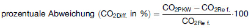

# Verordnung über Verbraucherinformationen zu Kraftstoffverbrauch, CO 2 -Emissionen und Stromverbrauch neuer Personenkraftwagen (Pkw-EnVKV)

Ausfertigungsdatum
:   2004-05-28

Fundstelle
:   BGBl I: 2004, 1037

Zuletzt geändert durch
:   Art. 3 G v. 10.5.2012 I 1070

Diese Verordnung dient der Umsetzung der Richtlinie 1999/94/EG des
Europäischen Parlaments und des Rates vom 13. Dezember 1999 über die
Bereitstellung von Verbraucherinformationen über den
Kraftstoffverbrauch und CO
2               -Emissionen beim Marketing für neue Personenkraftwagen
(ABl. EG 2000 Nr. L 12 S. 16), zuletzt geändert durch die Verordnung
(EG) Nr. 1882/2003 des Europäischen Parlaments und des Rates vom 29.
September 2003 (ABl. EU Nr. L 284 S. 1).

## Eingangsformel

Auf Grund des § 1 Abs. 1 Nr. 1 in Verbindung mit § 1 Abs. 2 und 3 Nr.
1 und 3 bis 5 des Energieverbrauchskennzeichnungsgesetzes vom 30.
Januar 2002 (BGBl. I S. 570), von denen § 1 Abs. 1 und 2 durch Artikel
135 der Verordnung vom 25. November 2003 (BGBl. I S. 2304) geändert
worden ist, verordnet das Bundesministerium für Wirtschaft und Arbeit
im Einvernehmen mit dem Bundesministerium für Umwelt, Naturschutz und
Reaktorsicherheit:

## § 1 Kennzeichnungspflicht

(1) Hersteller und Händler, die neue Personenkraftwagen ausstellen,
zum Kauf oder Leasing anbieten oder für diese werben, haben dabei
Angaben über den Kraftstoffverbrauch, die CO
2             -Emissionen und gegebenenfalls den Stromverbrauch nach
Maßgabe der §§ 3 bis 5 sowie der Anlagen 1 bis 4 zu machen.

(2) Bei den Angaben sind zu verwenden als Einheit

1.  für

    a)  den Kraftstoffverbrauch Liter je 100 Kilometer (l/100 km),

    b)  den Verbrauch von Erdgas- oder Biogas als Kraftstoff abweichend von a)
        Kilogramm je 100 Kilometer (kg/100 km), wobei der aus der EG-
        Übereinstimmungsbescheinigung (Certificate of Conformity – CoC)
        stammende und in Kubikmeter je 100 Kilometer (m
        3                         /100 km) angegebene Wert vom Hersteller in
        Kilogramm je 100 Kilometer (kg/100 km) gemäß dem in Anhang XII Absatz
        2\.3 der Verordnung (EG) Nr. 715/2007 des Europäischen Parlaments und
        des Rates vom 20. Juni 2007 über die Typgenehmigung von
        Kraftfahrzeugen (Euro 5 und Euro 6) und über den Zugang zu Reparatur-
        und Wartungsinformationen für Fahrzeuge (ABl. L 171 vom 29.6.2007, S.
        1) in Verbindung mit der Verordnung (EG) Nr. 692/2008 des Europäischen
        Parlaments und des Rates vom 18. Juli 2008 zur Durchführung und
        Änderung der Verordnung (EG) Nr. 715/2007 des Europäischen Parlaments
        und des Rates über die Typgenehmigung von Kraftfahrzeugen (Euro 5 und
        Euro 6) und über den Zugang zu Reparatur- und Wartungsinformationen
        für Fahrzeuge (ABl. L 199 vom 28.7.2008, S. 1) festgelegten
        Bezugsdichtewert für Erdgas umzurechnen ist,

    c)  den Stromverbrauch für rein elektrisch betriebene Fahrzeuge,
        Brennstoffzellenfahrzeuge und für extern aufladbare
        Hybridelektrofahrzeuge Kilowattstunden je 100 Kilometer (kWh/100 km),
        wobei der aus der EG-Übereinstimmungsbescheinigung (Certificate of
        Conformity – CoC) stammende und in Wattstunden je Kilometer (Wh/km)
        angegebene Wert vom Hersteller in Kilowattstunden je 100 Kilometer
        (kWh/100 km)                          umzurechnen ist.

    Der Verbrauch ist jeweils bis zur ersten Dezimalstelle nach
    kaufmännischen Rundungsregeln auf- oder abgerundet anzugeben.

2.  für die CO
    2                   -Emissionen Gramm je Kilometer (g/km), jeweils auf
    eine ganze Zahl nach kaufmännischen Rundungsregeln auf- oder
    abgerundet.

## § 2 Begriffsbestimmungen

Im Sinne dieser Verordnung

1.  sind "neue Personenkraftwagen" Kraftfahrzeuge nach Artikel 2 Nr. 1 der
    Richtlinie 1999/94/EG des Europäischen Parlaments und des Rates vom
    13\. Dezember 1999 über die Bereitstellung von Verbraucherinformationen
    über den Kraftstoffverbrauch und CO
    2                   -Emissionen beim Marketing für neue
    Personenkraftwagen (ABl. L 12 vom 18.1.2000, S. 16), zuletzt geändert
    durch die Verordnung (EG) Nr. 1137/2008 des Europäischen Parlaments
    und des Rates vom 22. Oktober 2008 (ABl. L 311 vom 21.11.2008, S. 1),
    die noch nicht zu einem anderen Zweck als dem des Weiterverkaufs oder
    der Auslieferung verkauft wurden;

2.  ist "Hersteller" der in der Zulassungsbescheinigung Teil I genannte
    Hersteller oder, wenn dieser nicht in Deutschland ansässig ist, dessen
    bevollmächtigter Vertreter in Deutschland;

3.  ist "Händler" jeder, der in Deutschland neue Personenkraftwagen
    ausstellt oder zum Kauf oder Leasing anbietet;

4.  ist "Verkaufsort" ein Ort, an dem neue Personenkraftwagen ausgestellt
    oder zum Kauf oder Leasing angeboten werden, insbesondere ein
    Ausstellungsraum oder ein Vorhof; als Verkaufsorte gelten auch
    Handelsmessen, auf denen neue Personenkraftwagen der Öffentlichkeit
    vorgestellt werden;

5.  ist "offizieller Kraftstoffverbrauch" der Verbrauch eines neuen
    Personenkraftwagens nach Artikel 2 Nr. 5 der Richtlinie 1999/94/EG;

6.  sind "offizielle spezifische CO
    2                   -Emissionen" die Emissionen eines neuen
    Personenkraftwagens nach Artikel 2 Nr. 6 der Richtlinie 1999/94/EG;

6a. ist der „offizielle Stromverbrauch“ der auf der Grundlage der
    Verordnung (EG) Nr. 715/2007 des Europäischen Parlaments und des Rates
    vom 20. Juni 2007 über die Typgenehmigung von Kraftfahrzeugen (Euro 5
    und Euro 6) und über den Zugang zu Reparatur- und
    Wartungsinformationen für Fahrzeuge (ABl. L 171 vom 29.6.2007, S. 1)
    in Verbindung mit der Verordnung (EG) Nr. 692/2008 des Europäischen
    Parlaments und des Rates vom 18. Juli 2008 zur Durchführung und
    Änderung der Verordnung (EG) Nr. 715/2007 des Europäischen Parlaments
    und des Rates über die Typgenehmigung von Kraftfahrzeugen (Euro 5 und
    6) und über den Zugang zu Reparatur- und Wartungsinformationen für
    Fahrzeuge (ABl. L 199 vom 28.7.2008, S. 1) ermittelte Verbrauch an
    elektrischer Energie;

6b. ist „anderer Energieträger“ elektrischer Strom;

6c. ist „Masse des fahrbereiten Fahrzeugs“ die in Anhang IX Teil 1 der
    Verordnung (EG) Nr. 385/2009 der Kommission vom 7. Mai 2009 zur
    Ersetzung des Anhangs IX der Richtlinie 2007/46/EG des Europäischen
    Parlaments und des Rates zur Schaffung eines Rahmens für die
    Genehmigung von Kraftfahrzeugen und Kraftfahrzeuganhängern sowie von
    Systemen, Bauteilen und selbstständigen technischen Einheiten für
    diese Fahrzeuge („Rahmenrichtlinie“) (ABl. L 118 vom 13.5.2009, S. 13)
    definierte Masse, sofern in dieser Verordnung nichts Abweichendes
    geregelt ist; bei Fahrzeugen, die nicht über eine EG-
    Übereinstimmungsbescheinigung (Certificate of Conformity – CoC) im
    Sinne der Verordnung (EG) Nr. 385/2009 verfügen, ist zur Bestimmung
    der „Masse des fahrbereiten Fahrzeugs“ die in Anhang I Nummer 2.6 der
    Richtlinie 2007/46/EG des Europäischen Parlaments und des Rates zur
    Schaffung eines Rahmens für die Genehmigung von Kraftfahrzeugen und
    Kraftfahrzeuganhängern sowie von Systemen, Bauteilen und
    selbstständigen technischen Einheiten für diese Fahrzeuge (ABl. L 263
    vom 9.10.2007, S. 1) definierte Masse zugrunde zu legen und bei Angabe
    eines Bereichs für die Masse im Rahmen dieser Verordnung der höhere
    Wert heranzuziehen;

6d. ist unter dem Begriff „Kraftstoff“ im Sinne dieser Verordnung der vom
    Hersteller empfohlene Kraftstoff mit derjenigen Bezeichnung anzugeben,
    die zur Bekanntmachung der Kraftstoffqualität für den Betrieb von
    Kraftfahrzeugen nach der Verordnung über die Beschaffenheit und die
    Auszeichnung der Qualitäten von Kraft- und Brennstoffen in der jeweils
    geltenden Fassung verwendet werden muss; wobei bei Ottokraftstoffen
    und Dieselkraftstoffen auf den Zusatz „schwefelfrei“ im Rahmen dieser
    Verordnung verzichtet werden kann;

7.  ist "Hinweis auf den Kraftstoffverbrauch, die CO
    2                   -Emissionen und den Stromverbrauch" eine Angabe
    zur Information des Verbrauchers über den offiziellen
    Kraftstoffverbrauch, die offiziellen spezifischen CO
    2                   -Emissionen und den offiziellen Stromverbrauch des
    Personenkraftwagens;

8.  ist "Leitfaden über den Kraftstoffverbrauch, die CO
    2                   -Emissionen und den Stromverbrauch" eine
    Zusammenstellung der Werte des offiziellen Kraftstoffverbrauchs, der
    offiziellen spezifischen CO
    2                   -Emissionen und des offiziellen Stromverbrauchs
    aller Modelle, die am Neuwagenmarkt in Deutschland angeboten werden;

9.  sind "Werbeschriften" alle Druckschriften, die für die Vermarktung von
    Fahrzeugen und zur Werbung in der Öffentlichkeit verwendet werden,
    insbesondere technische Anleitungen, Broschüren, Anzeigen in
    Zeitungen, Magazinen und Fachzeitschriften sowie Plakate;

10. ist "Verbreitung in elektronischer Form" die Verbreitung von
    Informationen, die mittels Geräten für die elektronische Verarbeitung
    und Speicherung (einschließlich digitaler Kompression) von Daten am
    Ausgangspunkt gesendet und am Endpunkt empfangen und vollständig über
    Draht, über Funk, auf optischem oder anderem elektromagnetischen Wege
    gesendet, weitergeleitet und empfangen werden;

11. ist "Werbematerial" jede Form von Informationen, die für Vermarktung
    und Werbung für Verkauf und Leasing neuer Personenkraftwagen in der
    Öffentlichkeit verwendet werden; dies umfasst auch Texte und Bilder
    auf Internetseiten, soweit für den Inhalt der Angaben nach anderen
    Rechtsvorschriften Fahrzeughersteller oder Unternehmen, Organisationen
    und Personen verantwortlich sind, die neue Personenkraftwagen zum Kauf
    oder Leasing anbieten, sowie Darstellungen auf Internetseiten von
    Handelsmessen, auf denen neue Fahrzeuge öffentlich vorgestellt werden;

12. ist "Werbeempfänger", wer Werbematerial, insbesondere zu
    Informationszwecken, zur Kenntnis nimmt;

13. sind "elektronische, magnetische oder optische Speichermedien" alle
    physikalischen Materialien, auf denen Informationen in elektronischer
    Form aufgezeichnet werden und die zur Information der Öffentlichkeit
    genutzt werden können;

14. ist "Fabrikmarke" der Handelsname des Herstellers nach Artikel 2 Nr.
    10 der Richtlinie 1999/94/EG;

15. ist "Modell" die Handelsbezeichnung eines Fahrzeugs, bestehend aus
    Fabrikmarke, Typ sowie gegebenenfalls Variante und Version eines
    Personenkraftwagens;

16. sind "Typ", "Variante" und "Version" die Unterteilungen einer
    bestimmten Fabrikmarke nach Artikel 2 Nr. 12 der Richtlinie
    1999/94/EG.

## § 3 Hinweis auf Kraftstoffverbrauch, CO 2 -Emissionen und Stromverbrauch sowie Aushang am Verkaufsort

(1) Wer einen neuen Personenkraftwagen ausstellt oder zum Kauf oder
Leasing anbietet, hat dafür Sorge zu tragen, dass

1.  ein Hinweis auf den offiziellen Kraftstoffverbrauch, die offiziellen
    spezifischen CO
    2                   -Emissionen und gegebenenfalls den offiziellen
    Stromverbrauch am Fahrzeug oder in dessen unmittelbarer Nähe so
    angebracht ist, dass dieser deutlich sichtbar ist und eindeutig
    zugeordnet werden kann. Der Hinweis muss die CO
    2                   -Effizienzklasse nach § 3a Absatz 2 enthalten
    sowie den Anforderungen der Anlage 1 entsprechen, die zum Zeitpunkt
    des Erstellens des Hinweises aktuell sind. Das Datum der Erstellung
    des Hinweises ist in dem vorgesehenem Feld im Sinne der Anlage 1
    Nummer 7 anzugeben,

2.  ein Aushang am Verkaufsort deutlich sichtbar angebracht wird, der die
    CO
    2                   -Effizienzklassen, die Werte des offiziellen
    Kraftstoffverbrauchs, der offiziellen spezifischen CO
    2                   -Emissionen und gegebenenfalls des offiziellen
    Stromverbrauchs aller Modelle neuer Personenkraftwagen enthält, die am
    Verkaufsort ausgestellt oder an diesem oder über diesen Verkaufsort
    zum Kauf oder Leasing angeboten werden; der Aushang muss den
    Anforderungen der Anlage 2 entsprechen.

(2) Der Hinweis und der Aushang nach Absatz 1 können auch elektronisch
durch Bildschirmanzeige dargestellt werden, soweit die übrigen in
Absatz 1 sowie in den Anlagen 1 und 2 angeführten Voraussetzungen
eingehalten werden.

(3) Die Hersteller haben den Händlern, denen sie neue
Personenkraftwagen liefern, auf Anforderung unverzüglich und
unentgeltlich die Angaben zu übermitteln, die erforderlich sind, um
den Hinweis und den Aushang nach Absatz 1 zu erstellen.

## § 3a CO 2 -Effizienzklassen

(1) Der Hersteller hat die CO
2             -Effizienz des Fahrzeugs durch Angabe einer CO
2             -Effizienzklasse auszuweisen. Er hat dazu die Abweichung
der offiziellen spezifischen CO
2             -Emissionen des Fahrzeugs von einem fahrzeugspezifischen
Referenzwert zu ermitteln. Der Referenzwert ist wie folgt zu
bestimmen:

Referenzwert (in g CO
2             /km) = 36,59079 + a × M

Dabei ist:

    M
=   Masse des fahrbereiten Fahrzeugs in Kilogramm (kg),

    a
=   0,08987.

Der Referenzwert ist als ganze Zahl nach kaufmännischen Rundungsregeln
auf- oder abzurunden. Die Abweichung der offiziellen spezifischen CO
2             -Emissionen des Fahrzeugs vom Referenzwert ist durch die
Differenz der beiden Angaben auszudrücken und wie folgt zu berechnen:

Dabei ist:

    CO
2Ref= fahrzeugspezifischer Referenzwert der CO
    2                   -Emissionen,

    CO
2PKW= offizielle spezifische CO
    2                   -Emissionen des Fahrzeugs.

Der Prozentwert ist auf zwei Dezimalstellen nach dem Komma nach
kaufmännischen Rundungsregeln auf- oder abzurunden.

(2) Entsprechend der Abweichung vom Referenzwert wird das Fahrzeug
einer der nachfolgend bestimmten CO
2             -Effizienzklassen zugewiesen.

*    *   CO
        2                       -Effizienzklasse

    *   Bandbreite der Klassen Abweichung vom Referenzwert

*    *   A +

    *   *                        -37 %

*    *   A

    *   -36,99 % bis -28 %

*    *   B

    *   -27,99 % bis -19 %

*    *   C

    *   -18,99 % bis -10 %

*    *   D

    *   -9,99 % bis -1 %

*    *   E

    *   -0,99 % bis +8 %

*    *   F

    *   +8,01 % bis +17 %

*    *   G

    *   > +17,01 %

(3) Erfüllt fünf vom Hundert der zugelassenen Fahrzeuge in einem
Kalenderjahr die Anforderungen der nächst effizienteren Klassen A ++
oder
A +++,              werden diese Klassen entsprechend den nachfolgend
bestimmten CO
2             -Effizienzklassen eingeführt, gegebenenfalls auch
gleichzeitig. Das Bundesministerium für Wirtschaft und Technologie
überprüft jährlich das Erreichen des Fünf-vom-Hundert-Kriteriums für
die Einführung der nächst höheren CO
2             -Effizienzklasse. Diese Überprüfung erfolgt auf der
Basis der Zulassungszahlen und Typdaten des Kraftfahrt-Bundesamtes und
unter Zugrundelegung der offiziellen spezifischen CO
2             -Emissionen und der Masse des fahrbereiten Fahrzeugs im
Sinne der Richtlinie 2007/46/EG des Europäischen Parlaments und des
Rates vom 5. September 2007 zur Schaffung eines Rahmens für die
Genehmigung von Kraftfahrzeugen und Kraftfahrzeuganhängern sowie von
Systemen, Bauteilen und selbstständigen technischen Einheiten für
diese Fahrzeuge (ABl. L 263 vom 9.10.2007, S. 1) sowie optionaler,
ergänzender versions- oder fahrzeugspezifischer Meldungen der
Hersteller an das Kraftfahrt-Bundesamt, wobei in den Fällen, in denen
in den Typgenehmigungsdokumenten ein Bereich für die Masse angegeben
ist, für die Berechnung im Sinne des § 3a Absatz 3 dieser Verordnung
der höhere Wert heranzuziehen ist. Das Bundesministerium für
Wirtschaft und Technologie veröffentlicht das Ergebnis der Prüfung und
gegebenenfalls die Notwendigkeit, die Klassen
A ++              beziehungsweise
A +++              einzuführen bis spätestens 30. Juni eines jeden
Jahres im Bundesanzeiger. Die neue Klasse ist nach drei Monaten ab dem
Datum der Veröffentlichung im Bundesanzeiger anzuwenden.

*    *   CO
        2                       -Effizienzklasse

    *   Bandbreite der Klassen Abweichung vom Referenzwert

*    *   A ++

    *   *                        -46 %

*    *   A +

    *   -45,99 % bis -37 %

*    *   CO
        2                       -Effizienzklasse

    *   Bandbreite der Klassen Abweichung vom Referenzwert

*    *   A +++

    *   *                        -55 %

*    *   A ++

    *   -54,99 % bis -46 %

Spätestens drei Jahre nach Inkrafttreten dieser Verordnung wird das
Bundesministerium für Wirtschaft und Technologie die
Berechnungsgrundlagen für den Referenzwert, insbesondere Alternativen
zur Bezugsgröße Masse, und den Anteil der zugelassenen Fahrzeuge in
den Klassen insgesamt überprüfen und gegebenenfalls die
Energieverbrauchskennzeichnung für Personenkraftwagen durch Änderung
dieser Verordnung anpassen.

## § 4 Leitfaden zu Kraftstoffverbrauch, CO 2 -Emissionen und Stromverbrauch

(1) Die Hersteller bestimmen eine Stelle, die in ihrem Auftrag einen
einheitlichen Leitfaden über den Kraftstoffverbrauch, die CO
2             -Emissionen und den Stromverbrauch in gedruckter Form
erstellt und an Händler, Verbraucher und sonstige Interessenten
verteilt. Der Leitfaden ist mindestens einmal jährlich zu
aktualisieren. Die Hersteller teilen die nach Satz 1 bestimmte Stelle
dem Bundesministerium für Wirtschaft und Technologie mit; dieses gibt
die Stelle im Bundesanzeiger bekannt. Der Leitfaden ist von den
Herstellern auch im Internet zur Verfügung zu stellen.

(2) Der Leitfaden muss den Anforderungen der Anlage 3 entsprechen. Der
Entwurf des Teils I des Leitfadens bedarf der Genehmigung des
Bundesministeriums für Wirtschaft und Technologie im Einvernehmen mit
dem Bundesministerium für Umwelt, Naturschutz und Reaktorsicherheit
sowie dem Bundesministerium für Verkehr, Bau und Stadtentwicklung. Die
Genehmigung gilt als erteilt, wenn das Bundesministerium für
Wirtschaft und Technologie nicht innerhalb von zwei Monaten nach
Zugang des Entwurfs die Genehmigung abgelehnt hat. Der Zugang des
Entwurfs ist dem Antragsteller unverzüglich schriftlich zu bestätigen.

(3) Händler und Hersteller haben den Leitfaden am Verkaufsort an am
Kauf oder Leasing Interessierte (Kunden) auf Anfrage unverzüglich und
unentgeltlich auszuhändigen. Der Leitfaden kann mit Einverständnis des
Kunden diesem auch auf elektronischen, magnetischen oder optischen
Speichermedien übergeben oder in elektronischer Form übermittelt
werden. Ist am Verkaufsort aus Gründen, die der Händler oder
Hersteller nicht zu vertreten hat, ein gedrucktes Exemplar des
Leitfadens nicht verfügbar, kann die Verpflichtung nach Satz 1 auch
dadurch erfüllt werden, dass dem Kunden ein Ausdruck des im Internet
zur Verfügung gestellten Leitfadens unentgeltlich ausgehändigt wird.

(4) Die Hersteller müssen sicherstellen, dass

1.  für Verbraucher auf Anfrage ein Leitfaden kostenlos bei der nach
    Absatz 1 Satz 1 bestimmten Stelle erhältlich ist;

2.  durch die nach Absatz 1 Satz 1 bestimmte Stelle Händlern unverzüglich
    und unentgeltlich jeweils die Anzahl von Exemplaren des Leitfadens zur
    Verfügung gestellt wird, die notwendig ist, damit diese Händler ihre
    Verpflichtungen nach Absatz 3 Satz 1 erfüllen können; für die
    Zusendung können die Versandkosten in Rechnung gestellt werden.

(5) Hersteller und diejenigen, die im eigenen Namen neue
Personenkraftwagen zum Verkauf einführen, ohne Hersteller nach § 2 Nr.
2 zu sein, haben an die von den Herstellern nach Absatz 1 Satz 1
bestimmte Stelle jeweils unverzüglich, spätestens zum Beginn eines
jeden Quartals, die folgenden Angaben zu übermitteln:

1.  Bezeichnungen der Modelle jeder Fabrikmarke, die sie in Deutschland
    zum Zeitpunkt der Veröffentlichung im Handel haben und - soweit
    bereits bekannt - im Restjahr sowie im folgenden Kalenderjahr in den
    Handel bringen werden,

2.  zu den unter Nummer 1 genannten Modellen zusätzlich jeweils den
    Hubraum, die Leistung, die Getriebeart, die Masse des Fahrzeugs, die
    Kraftstoffart, gegebenenfalls den anderen Energieträger, den
    offiziellen Kraftstoffverbrauch, die offiziellen spezifischen CO
    2                   -Emissionen und gegebenenfalls den offiziellen
    Stromverbrauch.

## § 5 Werbung

(1) Hersteller und Händler, die Werbeschriften erstellen, erstellen
lassen, weitergeben oder auf andere Weise verwenden, haben
sicherzustellen, dass in den Werbeschriften Angaben über den
offiziellen Kraftstoffverbrauch und die offiziellen spezifischen CO
2             -Emissionen der betreffenden Modelle neuer
Personenkraftwagen nach Maßgabe von Abschnitt I der Anlage 4 gemacht
werden.

(2) Absatz 1 Satz 1 gilt entsprechend für

1.  in elektronischer Form verbreitetes Werbematerial,

2.  Werbung durch elektronische, magnetische oder optische Speichermedien;

hiervon ausgenommen sind Hörfunkdienste und audiovisuelle
Mediendienste nach Artikel 1 Buchstabe a der Richtlinie 2010/13/EU des
Europäischen Parlaments und des Rates vom 10. März 2010 zur
Koordinierung bestimmter Rechts- und Verwaltungsvorschriften der
Mitgliedstaaten über die Bereitstellung audiovisueller Mediendienste
(Richtlinie über audiovisuelle Mediendienste), (ABl. L 95 vom
15\.4.2010, S. 1). Die Angaben müssen nach Maßgabe der Abschnitte II
und III der Anlage 4 erfolgen.

(3) Die Verpflichtungen der Hersteller nach § 3 Abs. 3 gelten
entsprechend für Angaben, die erforderlich sind, um Werbeschriften,
zur Verbreitung in elektronischer Form bestimmtes Werbematerial und
elektronische, magnetische oder optische Speichermedien nach den
Absätzen 1 und 2 zu erstellen.

## § 6 Missbräuchliche Verwendung von Bezeichnungen

Es ist verboten, in nach § 3 Abs. 1, § 3a Absatz 1 und 2, § 4 Abs. 2
Satz 1 und § 5 Abs. 1 und 2 bereitzustellenden Informationen zum
offiziellen Kraftstoffverbrauch, zu den offiziellen spezifischen CO
2             -Emissionen, zum offiziellen Stromverbrauch und zu den
CO
2             -Effizienzklassen andere den Vorschriften dieser
Verordnung nicht entsprechende Zeichen, Symbole oder Angaben zu
verwenden, sofern diese geeignet sind, beim Verbraucher zu
Verwechslungen zu führen.

## § 7 Ordnungswidrigkeiten

Ordnungswidrig im Sinne des § 15 Absatz 1 Nummer 1 des
Energieverbrauchskennzeichnungsgesetzes handelt, wer vorsätzlich oder
fahrlässig

1.  entgegen § 3 Abs. 1 Nr. 1 in Verbindung mit Anlage 1 Teil A Abschnitt
    I Nummer 1, Nummer 2 Satz 1, Nummern 3, 4, 6, 7 bis 8 Satz 1 bis 4
    oder Satz 7 oder Nummer 9 oder Anlage 1 Teil B Abschnitt I Nummern 1
    oder 2 oder § 3 Abs. 1 Nr. 2 in Verbindung mit Anlage 2 Abschnitt I
    Nr. 1 bis 6, 8 oder 9 nicht dafür sorgt, dass ein Hinweis oder ein
    Aushang angebracht wird,

2.  entgegen § 3 Abs. 3, auch in Verbindung mit § 5 Abs. 3, oder § 4 Abs.
    5 eine Angabe nicht, nicht richtig, nicht vollständig oder nicht
    rechtzeitig übermittelt,

3.  entgegen § 4 Abs. 3 Satz 1 den Leitfaden nicht, nicht richtig, nicht
    vollständig, nicht in der vorgeschriebenen Weise oder nicht
    rechtzeitig aushändigt,

4.  entgegen § 5 Abs. 1, auch in Verbindung mit Abs. 2, nicht
    sicherstellt, dass eine dort genannte Angabe gemacht wird oder

5.  entgegen § 6 ein dort genanntes Zeichen oder Symbol oder eine dort
    genannte Angabe verwendet.

## § 8 Weiterverwendung von Werbematerial

Werbeschriften und elektronische, magnetische oder optische
Speichermedien, die vor Inkrafttreten dieser Verordnung erstellt
wurden und die nach dieser Verordnung erforderlichen Angaben nicht
oder nicht in der erforderlichen Form enthalten, können noch drei
Monate nach Inkrafttreten dieser Verordnung verwendet werden.

## § 8a Übergangsregelungen

(1) Der Leitfaden im Sinne des § 4 muss spätestens am 2. Januar 2012
den Anforderungen dieser Verordnung entsprechen.

(2) Die Anforderungen dieser Verordnung an den Aushang im Sinne des §
3 Absatz 1 Nummer 2 gelten für jede Aktualisierung, die nach
Inkrafttreten dieser Verordnung vorgenommen wird.

## § 9 Inkrafttreten

Diese Verordnung tritt am ersten Tag des fünften auf die Verkündung
folgenden Kalendermonats in Kraft.

## Schlussformel

Der Bundesrat hat zugestimmt.

## Anlage 1 (zu § 3 Abs. 1 Nr. 1) Hinweis auf Kraftstoffverbrauch und CO 2 -Emissionen und Stromverbrauch

(Fundstelle: BGBl. I 2011, 1760 - 1765)

**A.**
**Anforderungen an den Hinweis gemäß § 3 Absatz 1 Nummer 1**
##

**Abschnitt I**
Inhalt und Gestaltung des Hinweises
auf den Kraftstoffverbrauch, die CO
## 2 **-Emissionen und den Stromverbrauch**

1.  Die Größe des Hinweises beträgt 297 mm x 210 mm (DIN A4).

2.  Der Hinweis ist einheitlich nach dem Formblatt in Abschnitt II dieser
    Anlage zu erstellen. Die Anwendung einer vom Formblatt abweichenden
    Schriftart auf dem Hinweis ist zulässig, soweit Schrifthöhe und
    Schriftgrad unverändert bleiben und die gewählte Schriftart auch für
    die anderen zum Fahrzeug am Verkaufsort gemachten Angaben verwendet
    wird.

3.  Nach der Überschrift „Information über Kraftstoffverbrauch, CO
    2                   -Emissionen und Stromverbrauch i.S.d. Pkw-EnVKV“
    sind folgende Angaben zum Fahrzeug zu machen: Marke, Modell,
    konkretisiert durch Typ, Variante und Version, Leistung, Kraftstoff,
    andere Energieträger und Masse des Fahrzeugs.

4.  Anschließend sind die zum jeweiligen Fahrzeug gehörigen und in der EG-
    Übereinstimmungsbescheinigung (Certificate of Conformity – CoC) im
    Sinne der Verordnung (EG) Nr. 385/2009 der Kommission vom 7. Mai 2009
    zur Ersetzung des Anhangs IX der Richtlinie 2007/46/EG des
    Europäischen Parlaments und des Rates zur Schaffung eines Rahmens für
    die Genehmigung von Kraftfahrzeugen und Kraftfahrzeuganhängern sowie
    von Systemen, Bauteilen und selbstständigen technischen Einheiten für
    diese Fahrzeuge („Rahmenrichtlinie“) (ABl. L 118 vom 13.5.2009, S. 13)
    ausgewiesenen Werte des offiziellen Kraftstoffverbrauchs (Testzyklen
    innerorts und außerorts sowie kombiniert), der offiziellen
    spezifischen CO
    2                   -Emissionen im kombinierten Testzyklus und
    gegebenenfalls der offizielle Stromverbrauch im kombinierten
    Testzyklus anzugeben. Bei Fahrzeugen, die nicht über eine EG-
    Übereinstimmungsbescheinigung (Certificate of Conformity – CoC) im
    Sinne der Verordnung (EG) Nr. 385/2009 verfügen, sind abweichend von
    Satz 1 die in den Genehmigungsdokumenten im Sinne der Richtlinie
    2007/46/EG des Europäischen Parlaments und des Rates zur Schaffung
    eines Rahmens für die Genehmigung von Kraftfahrzeugen und
    Kraftfahrzeuganhängern sowie von Systemen, Bauteilen und
    selbstständigen technischen Einheiten für diese Fahrzeuge (ABl. L 263
    vom 9.10.2007, S. 1) ausgewiesenen Werte des offiziellen
    Kraftstoffverbrauchs (Testzyklen innerorts und außerorts sowie
    kombiniert), der offiziellen spezifischen CO
    2                   -Emissionen im kombinierten Testzyklus und
    gegebenenfalls der offizielle Stromverbrauch im kombinierten
    Testzyklus anzugeben. Bei Fahrzeugen mit mehr als einem flüssigen oder
    gasförmigen Energieträger sind unter „Kraftstoff“ sämtliche
    Kraftstoffe getrennt durch einen Schrägstrich aufzuführen [z. B.
    Super/Super Plus/E85], wobei derjenige Kraftstoff kursiv hervorzuheben
    ist, auf den sich die Angaben zum offiziellen Kraftstoffverbrauch und
    den offiziellen spezifischen CO
    2                   -Emissionen beziehen. Als Werte für den
    offiziellen Kraftstoffverbrauch und die offiziellen spezifischen CO
    2                   -Emissionen werden die Werte desjenigen
    Kraftstoffs mit den geringsten offiziellen spezifischen CO
    2                   -Emissionen eingetragen, wobei die Zahlenwerte für
    den offiziellen Kraftstoffverbrauch und für die offiziellen
    spezifischen CO
    2                   -Emissionen dieses Kraftstoffs kursiv
    hervorzuheben sind. Bei rein elektrisch betriebenen Fahrzeugen wird
    bei der Angabe der offiziellen spezifischen CO
    2                   -Emissionen eine „0“ eingetragen. Bei extern
    aufladbaren Hybridelektrofahrzeugen und Brennstoffzellenfahrzeugen
    sind nur die Werte des offiziellen Kraftstoffverbrauchs, der
    offiziellen spezifischen CO
    2                   -Emissionen und des offiziellen Stromverbrauchs im
    kombinierten Testzyklus nach Maßgabe des Satzes 1 anzugeben; eine
    Angabe zum offiziellen Kraftstoffverbrauch für die Testzyklen
    innerorts und außerorts ist nicht vorzunehmen und durch die Eintragung
    „entfällt“ im Formblatt nach Abschnitt II zu kennzeichnen. Die Werte
    der kombinierten Testzyklen für den offiziellen Kraftstoffverbrauch,
    für die offiziellen spezifischen CO
    2                   -Emissionen und den offiziellen Stromverbrauch des
    Fahrzeugs müssen sich in allen Fällen der Nummer 4 durch einen
    größeren Schriftgrad aus dem gesamten Text herausheben.

5.  Den Angaben nach Nummer 4 können folgende Hinweise hinzugefügt werden:

    a)  Die angegebenen Werte wurden nach dem vorgeschriebenen Messverfahren
        (§ 2 Nrn. 5, 6, 6a Pkw-EnVKV in der jeweils geltenden Fassung)
        ermittelt.

    b)  CO
        2                         -Emissionen, die durch die Produktion und
        Bereitstellung des Kraftstoffes bzw. anderer Energieträger entstehen,
        werden bei Ermittlung der CO
        2                         -Emissionen gemäß der Richtlinie 1999/94/EG
        nicht berücksichtigt.

    c)  Die Angaben beziehen sich nicht auf ein einzelnes Fahrzeug und sind
        nicht Bestandteil des Angebots, sondern dienen allein
        Vergleichszwecken zwischen den verschiedenen Fahrzeugtypen.

6.  Darunter sind unter der Überschrift „Hinweis nach Richtlinie
    1999/94/EG“ folgende Informationen aufzunehmen:

    „Der Kraftstoffverbrauch und die CO
    2                   -Emissionen eines Fahrzeugs hängen nicht nur von
    der effizienten Ausnutzung des Kraftstoffs durch das Fahrzeug ab,
    sondern werden auch vom Fahrverhalten und anderen nichttechnischen
    Faktoren beeinflusst. CO
    2                    ist das für die Erderwärmung hauptsächlich
    verantwortliche Treibhausgas. Ein Leitfaden über den
    Kraftstoffverbrauch und die CO
    2                   -Emissionen aller in Deutschland angebotenen neuen
    Personenkraftfahrzeugmodelle ist unentgeltlich an jedem Verkaufsort in
    Deutschland erhältlich, an dem neue Personenkraftfahrzeuge ausgestellt
    oder angeboten werden.“

7.  Nach Nummer 6 ist unter der Überschrift „CO
    2                   -Effizienz“ und dem in fett hervorgehobenen
    Hinweis „Auf der Grundlage der gemessenen CO
    2                   -Emissionen unter Berücksichtigung der Masse des
    Fahrzeugs ermittelt“ eine grafische Darstellung unter Verwendung der
    in § 3a Absatz 2 festgelegten CO
    2                   -Effizienzklassen für das jeweilige Fahrzeug
    anzufügen. Die grafische Darstellung muss dem in Teil A Abschnitt II
    beschriebenen Formblatt entsprechen. Dabei sind folgende
    Farbzusammensetzungen zur Darstellung der CO
    2                   -Effizienzklassen zu verwenden:

    A +, A 100 % Cyan, 100 % Gelb

    B   70 % Cyan, 100 % Gelb

    C   30 % Cyan, 100 % Gelb

    D   100 % Gelb

    E   30 % Magenta, 100 % Gelb

    F   70 % Magenta, 100 % Gelb

    G   100 % Magenta, 100 % Gelb.

    Die CO
    2                   -Effizienz des Fahrzeugs wird mittels eines in
    schwarz-weiß dargestellten Pfeils ausgedrückt, der in weißer
    Schriftfarbe auch den Kennzeichnungsbuchstaben der entsprechenden CO
    2                   -Effizienzklasse trägt. Die Spitze dieses Pfeils
    muss der Spitze des Pfeils der CO
    2                   -Effizienzklasse genau gegenüberstehen. Der Pfeil
    mit dem Kennzeichnungsbuchstaben darf nicht kleiner sein als der Pfeil
    mit Angabe der CO
    2                   -Effizienzklasse, darf aber auch nicht mehr als
    doppelt so groß sein.

8.  Anschließend sind die Jahressteuer für das jeweilige Fahrzeug,
    ausgenommen Elektrofahrzeuge, sowie die jährlichen Energieträgerkosten
    bei einer Laufleistung von 20 000 Kilometern, unterteilt in
    Kraftstoffkosten und gegebenenfalls Stromkosten anzugeben. Hinter dem
    Begriff Kraftstoffkosten ist in Klammern derjenige Kraftstoff
    anzugeben, auf den sich die Angaben zum offiziellen
    Kraftstoffverbrauch und zu den offiziellen spezifischen CO
    2                   -Emissionen im Sinne der Anlage 1 Abschnitt I
    Nummer 4 beziehen. Sofern es sich um ein Fahrzeug mit mehr als einem
    flüssigen oder gasförmigen Energieträger handelt, ist der in Klammern
    anzugebende Kraftstoff in Übereinstimmung zur Darstellung im Sinne der
    Anlage 1 Abschnitt 1 Nummer 4 kursiv hervorzuheben. Für die Angabe der
    Kraftstoff- und gegebenenfalls Stromkosten sind diejenigen
    Preisangaben zugrunde zu legen, die das Bundesministerium für
    Wirtschaft und Technologie jährlich im Bundesanzeiger veröffentlicht.
    Die erste Preisliste wird mit Verkündung dieser Verordnung im
    Bundesanzeiger veröffentlicht. In den Folgejahren aktualisiert das
    Bundesministerium für Wirtschaft und Technologie die Preisangaben
    jährlich durch Veröffentlichung im Bundesanzeiger zum 30. Juni eines
    Jahres. Die jeweils zum 30. Juni eines Jahres im Bundesanzeiger
    aktualisierten Preise sind für neue Personenkraftwagen, die nach dem
    30\. Juni eines Jahres ausgestellt oder zum Kauf oder Leasing angeboten
    werden, spätestens nach drei Monaten ab dem Datum der Veröffentlichung
    im Bundesanzeiger anzuwenden. Die Preisliste erfasst Kraftstoffe im
    Sinne der Verordnung über die Beschaffenheit und die Auszeichnung der
    Qualitäten von Kraft- und Brennstoffen in der jeweils geltenden
    Fassung und Strom, sofern für den jeweiligen Kraftstoff
    beziehungsweise für den Strom ein marktgängiger Preis feststellbar
    ist.

9.  Darunter ist die Angabe „Erstellt am:“ einzufügen und das Datum der
    Erstellung des Hinweises mit Tages-, Monats- und Jahreszahlangabe
    einzutragen.

**Abschnitt II**
Formblatt für den Hinweis auf den Kraftstoffverbrauch,
die CO
[^F775581_02_BJNR103700004BJNE001201140]
2 **-Emissionen und den Stromverbrauch**
##

**B.**
Anforderungen an den Hinweis
## **gemäß § 3 Absatz 1 Nummer 1 mit weiteren Effizienzklassen**

**Abschnitt I**
Inhalt und Gestaltung des Hinweises
auf den Kraftstoffverbrauch, die CO
## 2 **-Emissionen und den Stromverbrauch**

1.  Es gelten die Anforderungen des Teils A, Abschnitt I dieser Anlage,
    soweit nachfolgend nichts anderes bestimmt ist.

2.  Unter der Überschrift „CO
    2                   -Effizienz“ und dem in fett hervorgehobenen
    Hinweis „Auf der Grundlage der gemessenen CO
    2                   -Emissionen unter Berücksichtigung der Masse des
    Fahrzeugs ermittelt“ ist eine grafische Darstellung unter Verwendung
    der in § 3a Absatz 3 festgelegten CO
    2                   -Effizienzklassen für das jeweilige Fahrzeug
    anzufügen. Sie muss dem in Teil B Abschnitt II beziehungsweise
    Abschnitt III beschriebenen Formblatt entsprechen. Bei Einführung der
    Klasse A ++ sind folgende Farbzusammensetzungen zur Darstellung der CO
    2                   -Effizienzklassen zu verwenden:

    A ++, A + 100 % Cyan, 100 % Gelb

    A   70 % Cyan, 100 % Gelb

    B, C 30 % Cyan, 100 % Gelb

    D   100 % Gelb

    E   70 % Magenta, 100 % Gelb

    F, G 100 % Magenta, 100 % Gelb.

    Bei Einführung der Klasse A +++ oder bei gleichzeitiger Einführung der
    Klassen A ++ und A +++ sind die folgenden Farbzusammensetzungen zur
    Darstellung der CO
    2                   -Effizienzklassen zu verwenden:

    A +++, A ++ 100 % Cyan, 100 % Gelb

    A + 70 % Cyan, 100 % Gelb

    A, B 30 % Cyan, 100 % Gelb

    C   100 % Gelb

    D   70 % Magenta, 100 % Gelb

    E, F, G 100 % Magenta, 100 % Gelb.

**Abschnitt II**
Formblatt für den Hinweis auf den Kraftstoffverbrauch,
die CO
2 **-Emissionen und den Stromverbrauch bei Einführung der
Effizienzklasse A ++**
##

**Abschnitt III**
Formblatt für den Hinweis auf den Kraftstoffverbrauch,
die CO
2 **-Emissionen und den Stromverbrauch bei Einführung der
Effizienzklasse A +++**
##

    Das Bundesministerium für Wirtschaft und Technologie kann im
    Bundesanzeiger die Bezugsquelle bekannt geben, über die das Formblatt
    unentgeltlich elektronisch bezogen werden kann.
[^F775581_02_BJNR103700004BJNE001201140]: 

## Anlage 2 (zu § 3 Abs. 1 Nr. 2) Aushang am Verkaufsort über Kraftstoffverbrauch, CO 2 -Emissionen und den Stromverbrauch

(Fundstelle: BGBl. I 2004, 1042;
bezüglich der einzelnen Änderungen vgl. Fußnote)

*    *   Abschnitt I

*    *   Aushang

1.  Der Aushang muss mindestens 70 cm x 50 cm groß sein.

2.  Die Angaben müssen gut lesbar sein.

3.  Vertreibt ein Händler Personenkraftfahrzeuge mehrerer Fabrikmarken und
    bringt er nicht für jede Fabrikmarke einen eigenen Aushang an, sind
    die Fabrikmarken in alphabetischer Reihenfolge aufzulisten.

4.  Der Aushang ist mit "Aushang nach Richtlinie 1999/94/EG" und folgendem
    Hinweis zu überschreiben:

*    *   "Kraftstoffverbrauch, CO
        2                       -Emissionswerte und Stromverbrauch
        aller an diesem Verkaufsort ausgestellten oder
        bestellbaren Personenkraftwagen der Marke (N. N.)".

5.  Die Personenkraftwagenmodelle sind in Gruppen getrennt nach
    Kraftstoffart beziehungsweise anderen Energieträgern aufzulisten,
    wobei bezüglich der Kraftstoffart verschiedene Qualitäten von
    Kraftstoffen zusammengefasst werden können (z. B. Super und Super Plus
    zu Ottokraftstoff). Bei jeder Kraftstoffart beziehungsweise bei
    anderen Energieträgern sind die einzelnen Modelle in aufsteigender
    Reihenfolge nach den offiziellen spezifischen CO
    2                   -Emissionen im kombinierten Testzyklus anzuführen,
    wobei das Modell mit der günstigsten CO
    2                   -Effizienzklasse und dem geringsten offiziellen
    Kraftstoffverbrauch beziehungsweise dem geringsten offiziellen
    Stromverbrauch im kombinierten Testzyklus an oberster Stelle steht.

6.  Für jedes Personenkraftwagenmodell auf der Liste sind anzugeben:

    –   das Modell, konkretisiert durch Hubraum, Leistung, Getriebe und Masse,

    –   die CO
        2                         -Effizienzklasse,

    –   der offizielle Kraftstoffverbrauch im kombinierten Testzyklus,

    –   die offiziellen spezifischen CO
        2                         -Emissionen im kombinierten Testzyklus,

    –   gegebenenfalls der offizielle Stromverbrauch im kombinierten
        Testzyklus.

    Bei Personenkraftwagenmodellen mit mehr als einem flüssigen oder
    gasförmigen Energieträger sind die in Satz 1 genannten Angaben für
    alle Kraftstoffe einzutragen. Gleiches gilt für extern aufladbare
    Hybridelektrofahrzeuge und Brennstoffzellenfahrzeuge, bei denen die in
    Satz 1 genannten Angaben sowohl für den Kraftstoff als auch für den
    anderen Energieträger (Strom) einzutragen sind. Sofern unter einem
    Modell mehrere Varianten und/oder Versionen zusammengefasst werden, so
    sind die Werte des offiziellen Kraftstoffverbrauchs, der offiziellen
    spezifischen CO
    2                   -Emissionen und des offiziellen Stromverbrauchs im
    kombinierten Testzyklus jedenfalls auf der Grundlage der Variante oder
    Version mit dem jeweils höchsten offiziellen Wert anzugeben.
    Entsprechendes gilt für die CO
    2                   -Effizienzklasse, bei welcher jedenfalls die
    schlechteste Effizienzklasse der jeweiligen Variante oder Version
    anzugeben ist. Bei der Angabe der Masse ist jedenfalls der höchste
    Massewert der jeweiligen Variante oder Version anzugeben.

7.  Die in Anlage 1 Abschnitt I Nr. 5 aufgeführten Hinweise können
    angegeben werden.

8.  Die in Anlage 1 Abschnitt I Nr. 6 aufgeführten Hinweise sind auch auf
    dem Aushang in deutlich lesbarer Schriftgröße aufzunehmen.

9.  Der Aushang ist mindestens alle sechs Monate zu aktualisieren.

*    *   Abschnitt II

*    *   Elektronische Anzeige durch Bildschirm

1.  Der Aushang kann durch eine elektronische Anzeige auf einem Bildschirm
    ersetzt werden. Der verwendete Bildschirm muss so angebracht sein,
    dass der die Aufmerksamkeit der Verbraucher ebenso stark erweckt wie
    ein Aushang.

2.  Der Bildschirm muss mindestens 25 cm x 32 cm (17 Zoll) groß sein. Die
    Informationen können unter Verwendung von Rolltechniken (Scrolling)
    gezeigt werden.

3.  Die unter Abschnitt I Nr. 2 bis 9 für den Aushang gestellten
    Anforderungen gelten bei Verwendung eines Bildschirms entsprechend mit
    folgenden Maßgaben:

    a)  Es ist sicherzustellen, dass die in Anlage 1 Abschnitt I Nr. 6
        aufgeführten Hinweise ständig sichtbar sind.

    b)  Die Angaben sind mindestens alle drei Monate zu aktualisieren.

## Anlage 3 (zu § 4 Abs. 2 Satz 1) Leitfaden über Kraftstoffverbrauch, CO 2 -Emissionen und Stromverbrauch

(Fundstelle: BGBl. I 2004, 1043;
bezüglich der einzelnen Änderungen vgl. Fußnote)

Der Leitfaden über den Kraftstoffverbrauch, die CO
2             -Emissionen und den Stromverbrauch enthält zumindest
folgende Angaben:

*    *   Teil I

1.  Einen Hinweis an den Kraftfahrer, dass Kraftstoffverbrauch und CO
    2                   -Emissionen sich durch eine regelmäßige Wartung
    des Fahrzeugs, dessen richtige Benutzung und eine entsprechende
    Fahrweise vermindern lassen, insbesondere durch einen defensiven
    Fahrstil, niedrige Reisegeschwindigkeiten, vorausschauendes
    Bremsverhalten, richtigen Reifendruck, keinen unnötigen Leerlauf des
    Motors und keinen überflüssigen Ballast;

2.  sowohl eine Erläuterung der Auswirkungen von Treibhausgasemissionen,
    einer möglichen Klimaänderung und der Bedeutung von Kraftfahrzeugen
    hierbei als auch einen Hinweis auf die Möglichkeiten, die der
    Verbraucher bei der Wahl der zur Verfügung stehenden Kraftstoffe hat
    und deren Umweltauswirkungen, gegründet auf aktuelle wissenschaftliche
    Nachweise und geltende Rechtsvorschriften;

3.  einen Hinweis auf das aktuelle Ziel der Europäischen Gemeinschaften
    für die durchschnittlichen CO
    2                   -Emissionen neuer Personenkraftwagen sowie auf die
    Frist zur Erreichung dieses Ziels;

4.  einen Hinweis auf den Leitfaden der Kommission über den
    Kraftstoffverbrauch und die CO
    2                   -Emissionen in Internet, falls vorhanden.

*    *   Teil II

1.  einen Hinweis, dass die tatsächlich die Umwelt belastenden CO
    2                   -Emissionen auch von der Produktion und
    Bereitstellung des Kraftstoffs bzw. der anderen Energieträger abhängen
    und dass der Fahrzeugnutzer durch die Verwendung von möglichst CO
    2                   -arm erzeugtem Kraftstoff bzw. erzeugter Energie
    den CO
    2                   -Ausstoß insgesamt verringern kann;

2.  Eine Auflistung aller Modelle neuer Personenkraftwagen, die in
    Deutschland angeboten oder ausgestellt werden, auf Jahresbasis und
    aufgeschlüsselt nach Fabrikmarken in alphabetischer Reihenfolge; der
    Leitfaden wird mindestens einmal jährlich aktualisiert, so dass er
    eine Auflistung aller Modelle enthält, die zum Zeitpunkt der
    Veröffentlichung dieser Aktualisierung angeboten oder ausgestellt
    werden;

3.  für jedes im Leitfaden aufgeführte Modell – im Einzelnen konkretisiert
    durch Hubraum, Leistung, Getriebe und Masse des Fahrzeugs – die
    Kraftstoffart beziehungsweise den anderen Energieträger, wobei
    bezüglich der Kraftstoffart, verschiedene Qualitäten eines Kraftstoffs
    zusammengefasst werden können (z. B. Super und Super Plus zu
    Ottokraftstoff), die CO
    2                   -Effizienzklasse, den offiziellen
    Kraftstoffverbrauch (Werte des Testzyklus innerorts und außerorts
    sowie kombiniert), die offiziellen spezifischen CO
    2                   -Emissionen im kombinierten Testzyklus und
    gegebenenfalls den offiziellen Stromverbrauch im kombinierten
    Testzyklus. Bei Personenkraftwagenmodellen mit mehr als einem
    flüssigen oder gasförmigen Energieträger sind die in Satz 1 genannten
    Angaben für alle Kraftstoffe einzutragen. Gleiches gilt für extern
    aufladbare Hybridelektrofahrzeuge und Brennstoffzellenfahrzeuge, bei
    denen die in Satz 1 genannten Angaben sowohl für den Kraftstoff als
    auch für den anderen Energieträger (Strom) einzutragen sind. Sofern
    unter einem Modell mehrere Varianten und/oder Versionen
    zusammengefasst werden, so sind die Werte des offiziellen
    Kraftstoffverbrauchs, der offiziellen spezifischen CO
    2                   -Emissionen und des offiziellen Stromverbrauchs im
    kombinierten Testzyklus jedenfalls auf der Grundlage der Variante oder
    Version mit dem jeweils höchsten offiziellen Wert anzugeben.
    Entsprechendes gilt für die CO
    2                   -Effizienzklasse, bei welcher jedenfalls die
    schlechteste Effizienzklasse der jeweiligen Variante oder Version
    anzugeben ist. Bei der Angabe der Masse ist jedenfalls der höchste
    Massewert der jeweiligen Variante oder Version anzugeben;

4.  für jede Kraftstoffart eine hervorgehobene Auflistung der zehn
    sparsamsten neuen Personenkraftwagenmodelle unter Angabe der CO
    2                   -Effizienzklasse, des offiziellen
    Kraftstoffverbrauchs im kombinierten Testzyklus, der offiziellen
    spezifischen CO
    2                   -Emissionen im kombinierten Testzyklus und
    gegebenenfalls des offiziellen Stromverbrauchs im kombinierten
    Testzyklus, beginnend jeweils mit dem Modell mit den niedrigsten CO
    2                   -Emissionswerten.

Der Leitfaden soll das Format DIN A4 nicht überschreiten.

## Anlage 4 (zu § 5) Angaben über Kraftstoffverbrauch und CO 2 -Emissionen in der Werbung

(Fundstelle: BGBl. I 2004, 1044;
bezüglich der einzelnen Änderungen vgl. Fußnote)

*    *   Abschnitt I

*    *   Werbeschriften

1.  Für das in der Werbeschrift genannte Fahrzeugmodell sind Angaben über
    den offiziellen Kraftstoffverbrauch (Werte des Testzyklus innerorts
    und außerorts sowie kombiniert) und die offiziellen spezifischen CO
    2                   -Emissionen im kombinierten Testzyklus zu machen.
    Wird für mehrere Modelle geworben, sind entweder die in Satz 1
    genannten Werte für jedes einzelne der aufgeführten Modelle anzuführen
    oder die Spannbreite zwischen ungünstigstem und günstigstem
    offiziellen Kraftstoffverbrauch im kombinierten Testzyklus sowie den
    offiziellen spezifischen CO
    2                   -Emissionen im kombinierten Testzyklus anzugeben.

2.  Die Angaben müssen auch bei flüchtigem Lesen leicht verständlich, gut
    lesbar und nicht weniger hervorgehoben sein als der Hauptteil der
    Werbebotschaft.

3.  Wird lediglich für die Fabrikmarke und nicht für ein bestimmtes Modell
    geworben, so ist eine Angabe der Kraftstoffverbrauchs- und CO
    2                   -Werte nicht erforderlich.

4.  Werden Fahrzeugmodelle in Katalogen oder auf einem anderen Weg in
    gedruckter Form zum Kauf oder Leasing angeboten, bei dem Interessenten
    die Fahrzeuge nicht ausgestellt sehen, so sind die in Abschnitt I
    Nummer 1 Satz 1 aufgeführten Angaben und zusätzlich die CO
    2                   -Effizienzklasse anzugeben. Bei der Angabe der
    Effizienzklasse ist sowohl das Wort „Effizienzklasse“ als auch der
    entsprechende Buchstabe der jeweiligen CO
    2                   -Effizienzklasse zu nennen. Abschnitt I Nummer 2
    gilt entsprechend. Abschnitt I Nummer 3 gilt entsprechend mit der
    Maßgabe, dass bei Vorliegen der Voraussetzungen der Nummer 3 auch eine
    Angabe der CO
    2                   -Effizienzklasse entbehrlich ist.

*    *   Abschnitt II

*    *   In elektronischer Form verbreitetes Werbematerial

1.  In Werbematerial, das in elektronischer Form verbreitetet wird, muss
    der folgende Hinweis enthalten sein:

    "Weitere Informationen zum offiziellen Kraftstoffverbrauch und den
    offiziellen spezifischen CO
    2                   -Emissionen neuer Personenkraftwagen können dem
    'Leitfaden über den Kraftstoffverbrauch, die CO
    2                   -Emissionen und den Stromverbrauch neuer
    Personenkraftwagen' entnommen werden, der an allen Verkaufsstellen und
    bei (... Verweis auf die benannte deutsche Stelle oder direkte
    Verknüpfung zu der Organisation, die mit der Verbreitung der
    Informationen in elektronischer Form beauftragt ist ...) unentgeltlich
    erhältlich ist."

2.  Bezieht sich das Werbematerial auf ein bestimmtes neues Fahrzeugmodell
    oder auf eine bestimmte Version oder Variante davon, sind zumindest
    der offizielle Kraftstoffverbrauch im kombinierten Testzyklus und die
    offiziellen spezifischen CO
    2                   -Emissionen im kombinierten Testzyklus dieses
    Fahrzeugs so anzugeben wie auf dem Hinweis auf den Kraftstoffverbrauch
    (Anlage 1). Abschnitt I Nr. 3 gilt entsprechend.

3.  Die Angaben müssen auch bei flüchtigem Lesen leicht verständlich, gut
    lesbar und nicht weniger hervorgehoben sein als der Hauptteil der
    Werbebotschaft. Es ist sicherzustellen, dass dem Empfänger des
    Werbematerials die Informationen im Sinne von Abschnitt II Nummer 2
    Satz 1 automatisch in dem Augenblick zur Kenntnis gelangen, in dem
    erstmalig Angaben zur Motorisierung, zum Beispiel zu Motorleistung,
    Hubraum oder Beschleunigung, auf der Internetseite angezeigt werden.

4.  Wer als Hersteller oder Händler Fahrzeugmodelle im Internet ausstellt
    oder zum Kauf oder Leasing anbietet (virtueller Verkaufsraum), hat die
    Angaben nach Abschnitt II Nummer 2 Satz 1 sowie zusätzlich die CO
    2                   -Effizienzklasse einschließlich der grafischen
    Darstellung gemäß Anlage 1 zu § 3 Absatz 1 Nummer 1 bei der
    Beschreibung des Fahrzeugmodells anzugeben und einen Hinweis auf die
    Internetadresse beizufügen, unter welcher der Leitfaden über den
    Kraftstoffverbrauch, die CO
    2                   -Emissionen und den Stromverbrauch abgerufen
    werden kann; der Händler kann in Bezug auf die grafische Darstellung
    auf die entsprechenden Internetseiten des Herstellers hinweisen. Die
    Angaben müssen auch bei flüchtigem Lesen leicht verständlich sein. Es
    ist sicherzustellen, dass die Angaben nach Abschnitt II Nummer 2 Satz
    1 sowie die CO
    2                   -Effizienzklassen einschließlich der grafischen
    Darstellungen dem Benutzer spätestens in dem Augenblick zur Kenntnis
    gelangen, in welchem er ein Fahrzeugmodell ausgewählt oder eine
    Konfiguration abgeschlossen hat.

*    *   Abschnitt III

*    *   Elektronische, magnetische oder optische Speichermedien

1.  Erfolgt Marketing oder Werbung durch elektronische, magnetische oder
    optische Speichermedien, muss der nach Abschnitt II Nr. 1
    erforderliche Hinweis ebenfalls gegeben werden. Der Hinweis kann dabei
    in gesprochener oder visueller Form erfolgen.

2.  Abschnitt II Nr. 2 und 3 Satz 1 gilt entsprechend.

