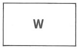
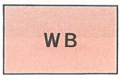
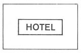

# Verordnung über die Ausarbeitung der Bauleitpläne und die Darstellung des Planinhalts (PlanzV 90)

Ausfertigungsdatum
:   1990-12-18

Fundstelle
:   BGBl I: 1991, 58

Zuletzt geändert durch
:   Art. 3 G v. 4.5.2017 I 1057

Änderung durch
:   Art. 3 G v. 14.6.2021 I 1802 (Nr. 33) textlich nachgewiesen, dokumentarisch noch nicht abschließend bearbeitet

## Eingangsformel

Auf Grund des § 2 Abs. 5 Nr. 4 des Baugesetzbuchs in der Fassung der
Bekanntmachung vom 8. Dezember 1986 (BGBl. I S. 2253) verordnet der
Bundesminister für Raumordnung, Bauwesen und Städtebau:

## § 1 Planunterlagen

(1) Als Unterlagen für Bauleitpläne sind Karten zu verwenden, die in
Genauigkeit und Vollständigkeit den Zustand des Plangebiets in einem
für den Planinhalt ausreichenden Grade erkennen lassen
(Planunterlagen). Die Maßstäbe sind so zu wählen, daß der Inhalt der
Bauleitpläne eindeutig dargestellt oder festgesetzt werden kann.

(2) Aus den Planunterlagen für Bebauungspläne sollen sich die
Flurstücke mit ihren Grenzen und Bezeichnungen in Übereinstimmung mit
dem Liegenschaftskataster, die vorhandenen baulichen Anlagen, die
Straßen, Wege und Plätze sowie die Geländehöhe ergeben. Von diesen
Angaben kann insoweit abgesehen werden, als sie für die Festsetzungen
nicht erforderlich sind. Der Stand der Planunterlagen (Monat, Jahr)
soll angegeben werden.

## § 2 Planzeichen

(1) Als Planzeichen in den Bauleitplänen sollen die in der Anlage zu
dieser Verordnung enthaltenen Planzeichen verwendet werden. Dies gilt
auch insbesondere für Kennzeichnungen, nachrichtliche Übernahmen und
Vermerke. Die Darstellungsarten können miteinander verbunden werden.
Linien können auch in Farbe ausgeführt werden. Kennzeichnungen,
nachrichtliche Übernahmen und Vermerke sollen zusätzlich zu den
Planzeichen als solche bezeichnet werden.

(2) Die in der Anlage enthaltenen Planzeichen können ergänzt werden,
soweit dies zur eindeutigen Darstellung des Planinhalts erforderlich
ist. Soweit Darstellungen des Planinhalts erforderlich sind, für die
in der Anlage keine oder keine ausreichenden Planzeichen enthalten
sind, können Planzeichen verwendet werden, die sinngemäß aus den
angegebenen Planzeichen entwickelt worden sind.

(3) Die Planzeichen sollen in Farbton, Strichstärke und Dichte den
Planunterlagen so angepaßt werden, daß deren Inhalt erkennbar bleibt.

(4) Die verwendeten Planzeichen sollen im Bauleitplan erklärt werden.

(5) Eine Verletzung von Vorschriften der Absätze 1 bis 4 ist
unbeachtlich, wenn die Darstellung, Festsetzung, Kennzeichnung,
nachrichtliche Übernahme oder der Vermerk hinreichend deutlich
erkennbar ist.

## § 3 Überleitungsvorschrift

Die bis zum 31. Oktober 1981 sowie die bis zum Inkrafttreten dieser
Verordnung geltenden Planzeichen können weiterhin verwendet werden

1.  für Änderungen oder Ergänzungen von Bauleitplänen, die bis zu diesen
    Zeitpunkten rechtswirksam geworden sind,

2.  für Bauleitpläne, deren Aufstellung die Gemeinde bis zu diesen
    Zeitpunkten eingeleitet hat, wenn mit der Beteiligung der Träger
    öffentlicher Belange nach § 4 des Baugesetzbuchs oder vor
    Inkrafttreten des Baugesetzbuchs nach § 2 Abs. 5 des Bundesbaugesetzes
    begonnen worden ist sowie für Änderungen oder Ergänzungen dieser
    Bauleitpläne.

## § 4 Inkrafttreten

(1) Diese Verordnung tritt am ersten Tage des auf die Verkündung
folgenden dritten Kalendermonats in Kraft.

(2) Gleichzeitig tritt die Planzeichenverordnung 1981 vom 30. Juli
1981 (BGBl. I S. 833) außer Kraft.

## Schlußformel

Der Bundesrat hat zugestimmt.

## Anlage

(Fundstelle: BGBl. I 1991, 58 [Anlagenband])

Anlage zur
## **Planzeichenverordnung 1990**

## **Planzeichen für Bauleitpläne**

*    *   **1.**

    *   **Art der baulichen Nutzung**
        (§ 5 Abs. 2 Nr. 1, § 9 Abs. 1 Nr. 1 des Baugesetzbuchs - BauGB -,
        §§ 1 bis 11 der
        Baunutzungsverordnung                        - BauNVO -)

    *
    *

*    *
    *
    *
    *
    *
    *

*    *
    *
    *
    *
    *
    *

*    *
    *
    *
    *   schwarz/weiß

    *   farbig

*    *   1.1.

    *   Wohnbauflächen
        (§ 1 Abs. 1 Nr. 1 BauNVO)

    *
    *        
    *        
    *           Rot mittel

*    *
    *
    *
    *
    *
    *

*    *
    *
    *
    *
    *
    *

*    *   1.1.1.

    *   Kleinsiedlungsgebiete
        (§ 2 BauNVO)

    *
    *        
    *        
    *           Rot mittel

*    *
    *
    *
    *
    *
    *

*    *
    *
    *
    *
    *
    *

*    *   1.1.2.

    *   Reine Wohngebiete
        (§ 3 BauNVO)

    *
    *        
    *        
    *           Rot mittel

*    *
    *
    *
    *
    *
    *

*    *
    *
    *
    *
    *
    *

*    *   1.1.3.

    *   Allgemeine Wohngebiete
        (§ 4 BauNVO)

    *
    *        
    *        
    *           Rot mittel

*    *
    *
    *
    *
    *
    *

*    *
    *
    *
    *
    *
    *

*    *   1.1.4.

    *   Besondere Wohngebiete
        (§ 4a BauNVO)

    *
    *        
    *        
    *           Rot mittel

*    *
    *
    *
    *
    *
    *

*    *
    *
    *
    *
    *
    *

*    *
    *
    *
    *
    *
    *

*    *   1.2.

    *   Gemischte Bauflächen
        (§ 1 Abs. 1 Nr. 2 BauNVO)

    *
    *        
    *        
    *           Braun mittel

*    *
    *
    *
    *
    *
    *

*    *
    *
    *
    *
    *
    *

*    *   1.2.1.

    *   Dorfgebiete
        (§ 5 BauNVO)

    *
    *        
    *        
    *           Braun mittel

*    *
    *
    *
    *
    *
    *

*    *
    *
    *
    *
    *
    *

*    *   1.2.2.

    *   Dörfliche
        Wohngebiete
        (§ 5a BauNVO)

    *
    *        
    *        
    *           Braun mittel

*    *
    *
    *
    *
    *
    *

*    *
    *
    *
    *
    *
    *

*    *   1.2.3.

    *   Mischgebiete
        (§ 6 BauNVO)

    *
    *        
    *        
    *           Braun mittel

*    *
    *
    *
    *
    *
    *

*    *
    *
    *
    *
    *
    *

*    *   1.2.4.

    *   Urbane Gebiete
        (§ 6a BauNVO)

    *
    *        
    *        
    *           Braun mittel

*    *
    *
    *
    *
    *
    *

*    *
    *
    *
    *
    *
    *

*    *   1.2.5.

    *   Kerngebiete
        (§ 7 BauNVO)

    *
    *        
    *        
    *           Braun mittel

*    *
    *
    *
    *
    *
    *

*    *
    *
    *
    *
    *
    *

*    *
    *
    *
    *
    *
    *

*    *   1.3.

    *   Gewerbliche Bauflächen
        (§ 1 Abs. 1 Nr. 3 BauNVO)

    *
    *        
    *        
    *           Grau mittel

*    *
    *
    *
    *
    *
    *

*    *
    *
    *
    *
    *
    *

*    *   1.3.1.

    *   Gewerbegebiete
        (§ 8 BauNVO)

    *
    *        
    *        
    *           Grau mittel

*    *
    *
    *
    *
    *
    *

*    *
    *
    *
    *
    *
    *

*    *   1.3.2.

    *   Industriegebiete
        (§ 9 BauNVO)

    *
    *        
    *        
    *           Grau mittel

*    *
    *
    *
    *
    *
    *

*    *
    *
    *
    *
    *
    *

*    *
    *
    *
    *
    *
    *

*    *   1.4.

    *   Sonderbauflächen
        (§ 1 Abs. 1 Nr. 4 BauNVO)

    *
    *        
    *        
    *           Orange mittel

*    *
    *
    *
    *
    *
    *

*    *
    *
    *
    *
    *
    *

*    *   1.4.1.

    *   Sondergebiete, die der
        Erholung dienen
        (§ 10 BauNVO)
        z. B.: Wochenendhaus-
        gebiete

    *
    *        
    *        
    *           Orange mittel

*    *
    *
    *
    *
    *
    *

*    *
    *
    *
    *
    *
    *

*    *   1.4.2.

    *   Sonstige Sondergebiete
        (§ 11 BauNVO)
        z. B.: Klinikgebiete

    *
    *        
    *        
    *           Orange mittel

*    *
    *
    *
    *
    *
    *

*    *
    *
    *
    *
    *
    *

*    *
    *
    *   Zur weiteren Unterscheidung der Baugebiete sind Farbab-
        stufungen zulässig.

    *

*    *
    *
    *   Im Bebauungsplan können die farbigen Flächensignaturen
        auch als Randsignaturen verwendet werden.

    *

*    *
    *
    *   Im Flächennutzungsplan kann bei den Planzeichen für
        die Bauflächen der Nummern 1.1. bis 1.4. bei farbiger
        Darstellung der Buchstabe entfallen.

    *

*    *
    *
    *
    *
    *
    *

*    *   1.5.

    *   Beschränkung der Zahl
        der Wohnungen
        (§ 9 Abs. 1 Nr. 6 BauGB)

    *   Aus besonderen städebaulichen Gründen kann die höchst-
        zulässige Zahl der Wohnungen in Wohngebäuden durch
        Ergänzungen der Planzeichen festgesetzt werden.

    *

*    *
    *
    *

*    *
    *
    *   z.B.

    *        
    *        
    *

*    *
    *
    *
    *
    *
    *

*    *
    *
    *
    *
    *
    *

*    *   **2.**

    *   **Maß der baulichen Nutzung**
        (§ 5 Abs. 2 Nr. 1, § 9 Abs. 1 Nr. 1 BauGB, § 16 BauNVO)

    *
    *
    *

*    *
    *
    *
    *
    *
    *

*    *
    *
    *
    *
    *
    *

*    *   2.1.

    *   Geschoßflächenzahl

    *   Dezimalzahl im Kreis, als Höchstmaß

    *   z.B.

    *        

*    *
    *
    *   als Mindest- und Höchstmaß

    *   z.B.

    *        

*    *
    *
    *   oder **GFZ**                      mit Dezimalzahl, als Höchstmaß

    *   z.B.

    *   **GFZ 0,7**

*    *
    *
    *
    *
    *
    *

*    *
    *
    *   als Mindest- und Höchstmaß

    *   z.B.

    *   **GFZ 0,5 bis 0,7**

*    *
    *
    *
    *
    *
    *

*    *
    *
    *
    *
    *
    *

*    *   2.2.

    *   Geschoßflache

    *   **GF**                      mit Flächenangabe, als Höchstmaß

    *   z.B.

    *   GF 500 m
        2 ****

*    *
    *
    *
    *
    *
    *

*    *
    *
    *   als Mindest- und Höchstmaß

    *   z.B.

    *   GF 400 m
        2                        bis 500 m
        2 ****

*    *
    *
    *
    *
    *
    *

*    *
    *
    *
    *
    *
    *

*    *   2.3.

    *   Baumassenzahl

    *   Dezimalzahl im Rechteck

    *   z.B.

    *        

*    *
    *
    *   oder **BMZ**                      mit Dezimalzahl,

    *   z.B.

    *   **BMZ 3,0**

*    *
    *
    *
    *
    *
    *

*    *
    *
    *
    *
    *
    *

*    *   2.4.

    *   Baumasse

    *   **BM**                      mit Volumenangabe

    *   z.B.

    *   BM 4000 m
        3 ****

*    *
    *
    *
    *
    *
    *

*    *
    *
    *
    *
    *
    *

*    *   2.5.

    *   Grundflächenzahl

    *   Dezimalzahl

    *   z.B.

    *   **0,4**

*    *
    *
    *
    *
    *
    *

*    *
    *
    *   oder **GRZ**                      mit Dezimalzahl,

    *   z.B.

    *   **GRZ 0,4**

*    *
    *
    *
    *
    *
    *

*    *
    *
    *
    *
    *
    *

*    *   2.6.

    *   Grundfläche

    *   **GR**                      mit Flächenangabe

    *   z.B.

    *   GR 100 m
        2 ****

*    *
    *
    *
    *
    *
    *

*    *
    *
    *
    *
    *
    *

*    *   2.7.

    *   Zahl der Vollgeschosse

    *
    *
    *
    *

*    *
    *   als Höchstmaß

    *   römische Ziffer,

    *   z.B.

    *   III

*    *
    *
    *
    *
    *
    *

*    *
    *   als Mindest- und
        Höchstmaß

    *   römische Ziffer,

    *   z.B.

    *   III-V

*    *
    *   zwingend

    *   römische Ziffer in einem Kreis,

    *   z.B.

    *        

*    *
    *
    *
    *
    *
    *

*    *
    *
    *
    *
    *
    *

*    *   2.8.

    *   Höhe baulicher Anlagen

    *   in ................. m über einem Bezugspunkt

    *

*    *
    *   als Höchstmaß

    *
    *
    *
    *

*    *
    *
    *   Traufhöhe **TH**

    *   z.B.

    *   **TH**                      12,4 m über Gehweg

*    *
    *
    *   Firsthöhe **FH**

    *   z.B.

    *   **FH**                      53,5 m über NN

*    *
    *
    *   Oberkante **OK**

    *   z.B.

    *   **OK**                      124,5 m über NN

*    *
    *
    *
    *
    *
    *

*    *
    *   als Mindest- und
        Höchstmaß

    *
    *
    *   z.B.

    *   **OK**                      116,0 m bis 124,5 m
        über NN

*    *
    *   zwingend

    *
    *
    *   z.B.

    *           124,5m über NN

*    *
    *
    *
    *
    *
    *

*    *
    *
    *
    *
    *
    *

*    *   **3.**

    *   **Bauweise, Baulinien, Baugrenzen**
        (§ 9 Abs. 1 Nr. 2 BauGB, §§ 22 und 23 BauNVO)

    *
    *
    *

*    *
    *
    *
    *
    *
    *

*    *
    *
    *
    *
    *
    *

*    *   3.1.

    *   Offene Bauweise

    *
    *
    *        
    *

*    *
    *
    *
    *
    *
    *

*    *   3.1.1.

    *   nur Einzelhäuser zulässig

    *
    *
    *        
    *

*    *
    *
    *
    *
    *
    *

*    *   3.1.2.

    *   nur Doppelhäuser zulässig

    *
    *
    *        
    *

*    *
    *
    *
    *
    *
    *

*    *   3.1.3.

    *   nur Hausgruppen zulässig

    *
    *
    *        
    *

*    *
    *
    *
    *
    *
    *

*    *   3.1.4.

    *   nur Einzel- und Doppelhäuser zulässig

    *
    *        
    *

*    *
    *
    *
    *
    *
    *

*    *
    *
    *
    *
    *
    *

*    *   3.2.

    *   Geschlossene Bauweise

    *
    *
    *   **ɡ**

    *

*    *
    *
    *
    *
    *
    *

*    *
    *
    *
    *
    *
    *

*    *   3.3.

    *   Abweichende Bauweise

    *   Im Bebauungsplan ist die von 3.1. oder 3.2. abweichende
        Bauweise näher zu bestimmen.

    *

*    *
    *
    *
    *
    *
    *

*    *
    *
    *
    *
    *
    *

*    *
    *
    *
    *   schwarz/weiß

    *
    *   farbig

*    *   3.4.

    *   Baulinie

    *
    *        
    *
    *           Rot

*    *
    *
    *
    *
    *
    *

*    *
    *
    *
    *
    *
    *

*    *   3.5.

    *   Baugrenze

    *
    *        
    *
    *           Blau

*    *
    *
    *
    *
    *
    *

*    *
    *
    *
    *
    *
    *

*    *
    *
    *   Die Bestimmungslinien der Nummern 3.4. und 3.5. können
        bei farbiger Darstellung auch in durchgezogenen Linien
        ausgeführt werden.

    *

*    *
    *
    *
    *
    *
    *

*    *
    *
    *
    *
    *
    *

*    *   **4.**

    *   Einrichtungen und Anlagen zur Versorgung mit Gütern und
        Dienstleistungen
        des öffentlichen und privaten Bereichs, Flächen für den Gemeinbedarf,
        **Flächen für Sport- und Spielanlagen**
        (§ 5 Absatz 2 Nummer 2 Buchstabe a und Absatz 4, § 9 Absatz 1 Nummer 5
        und Absatz 6 BauGB)

    *

*    *
    *
    *
    *
    *
    *

*    *
    *
    *
    *
    *
    *

*    *
    *
    *
    *   schwarz/weiß

    *
    *   farbig

*    *   4.1.

    *   Flächen für den Gemeinbedarf

    *        
    *
    *           Karminrot mittel

*    *
    *
    *
    *
    *
    *

*    *
    *
    *
    *
    *
    *

*    *
    *
    *   Im Bebauungsplan kann die farbige Flächensignatur auch
        als Randsignatur verwendet werden.

    *

*    *
    *
    *
    *
    *
    *

*    *
    *   Einrichtungen und Anlagen:

    *
    *
    *

*    *
    *
    *
    *
    *
    *

*    *
    *
    *   Öffentliche Verwaltungen

    *        
    *   Sportlichen Zwecken
        dienende Gebäude
        und Einrichtungen

    *        

*    *
    *
    *
    *
    *
    *

*    *
    *
    *   Schule

    *        
    *   Post

    *        

*    *
    *
    *
    *
    *
    *

*    *
    *
    *   Kirchen und kirchlichen
        Zwecken dienende Gebäude
        und Einrichtungen

    *        
    *   Schutzbauwerk

    *        

*    *
    *
    *
    *
    *
    *

*    *
    *
    *   Sozialen Zwecken
        dienende Gebäude
        und Einrichtungen

    *        
    *   Feuerwehr

    *        

*    *
    *
    *
    *
    *
    *

*    *
    *
    *   Gesundheitlichen Zwecken
        dienende Gebäude
        und Einrichtungen

    *        
    *
    *

*    *
    *
    *
    *
    *
    *

*    *
    *
    *   Kulturellen Zwecken
        dienende Gebäude
        und Einrichtungen

    *        
    *
    *

*    *
    *
    *
    *
    *
    *

*    *
    *
    *   Die vorstehenden Zeichen können bei Bedarf durch Buchstaben
        ergänzt werden.

    *

*    *
    *
    *   Im Flächennutzungsplan können die vorstehenden Zeichen zur
        Kennzeichnung der Lage auch ohne Flächendarstellung
        verwendet werden.

    *

*    *
    *
    *
    *
    *
    *

*    *   4.2.

    *   Flächen für Sport- und Spielanlagen

    *        
    *

*    *
    *
    *
    *
    *
    *

*    *
    *
    *   Sportanlagen

    *        
    *   Spielanlagen

    *        

*    *
    *
    *
    *
    *
    *

*    *
    *
    *   Die vorstehenden Zeichen können bei Bedarf durch Buchstaben
        ergänzt werden.

    *

*    *
    *
    *   Im Flächennutzungsplan können die vorstehenden Zeichen zur
        Kennzeichnung der Lage auch ohne Flächendarstellung verwendet
        werden.

    *

*    *
    *
    *
    *
    *
    *

*    *
    *
    *
    *
    *
    *

*    *   **5.**

    *   **Flächen für den überörtlichen Verkehr und für die örtlichen
        Hauptverkehrszüge**
        (§ 5 Abs. 2 Nr. 3 und Abs. 4 BauGB)

    *

*    *
    *
    *
    *
    *
    *

*    *
    *
    *
    *
    *
    *

*    *   5.1.

    *   Straßenverkehr

    *
    *
    *
    *

*    *
    *
    *
    *   schwarz/weiß

    *
    *   farbig

*    *   5.1.1.

    *   Autobahnen und autobahn-
        ähnliche Straßen

    *        
    *
    *           Goldocker

*    *
    *
    *
    *
    *
    *

*    *
    *
    *
    *
    *
    *

*    *   5.1.2.

    *   Sonstige überörtliche und
        örtliche Hauptverkehrsstraßen

    *        
    *
    *           Goldocker

*    *
    *
    *
    *
    *
    *

*    *
    *
    *
    *
    *
    *

*    *   5.1.3.

    *   Ruhender Verkehr

    *
    *
    *        
    *

*    *
    *
    *
    *
    *
    *

*    *   5.2.

    *   Bahnen

    *
    *
    *
    *

*    *
    *
    *
    *
    *
    *

*    *   5.2.1.

    *   Bahnanlagen

    *
    *        
    *
    *           Violett mittel

*    *
    *
    *
    *
    *
    *

*    *
    *
    *
    *
    *
    *

*    *   5.2.2.

    *   Straßenbahnen

    *
    *        
    *
    *           Violett dunkel

*    *
    *
    *
    *
    *
    *

*    *
    *
    *
    *
    *
    *

*    *   5.2.3.

    *   Seilbahnen

    *
    *        
    *
    *           Violett dunkel

*    *
    *
    *
    *
    *
    *

*    *
    *
    *
    *
    *
    *

*    *   5.3.

    *   Überörtliche Wege und örtliche
        Hauptwege

    *
    *
    *

*    *
    *
    *   z. B. Hauptwanderweg

    *        

*    *
    *
    *
    *
    *
    *

*    *   5.4.

    *   Umgrenzung der Flächen
        für den Luftverkehr

    *        
    *
    *           Violett dunkel

*    *
    *
    *
    *
    *
    *

*    *
    *
    *
    *
    *
    *

*    *
    *   Zweckbestimmung:

    *
    *
    *

*    *
    *
    *
    *
    *
    *

*    *
    *
    *   Flughafen

    *        
    *   Landeplatz

    *        

*    *
    *
    *
    *
    *
    *

*    *
    *
    *   Segelfluggelände

    *        
    *   Hubschrauber-
        landeplatz

    *        

*    *
    *
    *
    *
    *
    *

*    *
    *
    *
    *
    *
    *

*    *   **6.**

    *   **Verkehrsflächen**
        (§ 9 Abs. 1 Nr. 11 und Abs. 6 BauGB)

    *
    *
    *

*    *
    *
    *
    *
    *
    *

*    *
    *
    *
    *
    *
    *

*    *
    *
    *
    *   schwarz/weiß

    *   farbig

*    *
    *
    *
    *
    *
    *

*    *   6.1.

    *   Straßenverkehrsflächen

    *
    *        
    *        
    *           Goldocker

*    *
    *
    *
    *
    *
    *

*    *
    *
    *
    *
    *
    *

*    *   6.2.

    *   Straßenbegrenzungslinie
        auch gegenüber Verkehrsflächen
        besonderer Zweckbestimmung

    *        
    *           Permanentgrün hell

*    *
    *
    *
    *
    *
    *

*    *
    *
    *
    *
    *
    *

*    *
    *
    *   Die Straßenbegrenzungslinie entfällt, wenn sie mit einer
        Baulinie oder Baugrenze zusammenfällt.

    *

*    *
    *
    *
    *
    *
    *

*    *   6.3.

    *   Verkehrsflächen beson-
        derer Zweckbestimmung

    *
    *        
    *        
    *           Goldocker

*    *
    *
    *
    *
    *
    *

*    *
    *
    *
    *
    *
    *

*    *
    *   Zweckbestimmung:

    *
    *
    *

*    *
    *
    *
    *
    *
    *

*    *
    *
    *   Öffentliche Parkfläche

    *
    *        
    *

*    *
    *
    *
    *
    *
    *

*    *
    *
    *   Fußgängerbereich

    *
    *        
    *

*    *
    *
    *
    *
    *
    *

*    *
    *
    *   Verkehrsberuhigter Bereich

    *        
    *

*    *
    *
    *
    *
    *
    *

*    *   6.4.

    *   Ein bzw. Ausfahrten und Anschluß
        anderer Flächen an die Verkehrsflächen
        (§ 9 Abs. 1 Nr. 4, 11 und Abs. 6 BauGB)

    *
    *
    *

*    *
    *
    *
    *
    *
    *

*    *
    *
    *   z.B. Einfahrt

    *
    *        
    *

*    *
    *
    *
    *
    *
    *

*    *
    *
    *   z.B. Einfahrtbereich

    *
    *        
    *

*    *
    *
    *
    *
    *
    *

*    *
    *
    *   z.B. Bereich ohne
        Ein- und Ausfahrt

    *
    *        
    *

*    *
    *
    *
    *
    *
    *

*    *   6.5.

    *   Bahnen

    *   Planzeichen vgl. Abschnitt 5.2.

    *
    *

*    *
    *
    *
    *
    *
    *

*    *   6.6.

    *   Luftverkehr

    *   Planzeichen vgl. Abschnitt 5.4.

    *
    *

*    *
    *
    *
    *
    *
    *

*    *
    *
    *
    *
    *
    *

*    *   **7.**

    *   **Flächen für Versorgungsanlagen, für die Abfallentsorgung und
        Abwasserbeseitigung sowie für Ablagerungen; Anlagen, Einrichtungen und
        sonstige Maßnahmen, die dem Klimawandel entgegenwirken**
        (§ 5 Absatz 2 Nummer 2 Buchstabe b, Nummer 4 und Absatz 4, § 9 Absatz
        1 Nummer 12, 14 und Absatz 6 BauGB)

    *

*    *
    *
    *
    *
    *
    *

*    *
    *
    *
    *   schwarz/weiß

    *
    *   farbig

*    *
    *
    *
    *        
    *
    *           Gelb hell

*    *
    *
    *
    *
    *
    *

*    *
    *
    *
    *
    *
    *

*    *
    *
    *   Im Bebauungsplan kann die farbige Flächensignatur auch
        als Randsignatur verwendet werden.

    *

*    *
    *
    *
    *
    *
    *

*    *
    *   Zweckbestimmung bzw. Anlagen und Einrichtungen:

    *
    *
    *

*    *
    *
    *
    *
    *
    *

*    *
    *
    *   Elektrizität

    *        
    *   Abwasser

    *        

*    *
    *
    *
    *
    *
    *

*    *
    *
    *   Gas

    *        
    *   Abfall

    *        

*    *
    *
    *
    *
    *
    *

*    *
    *
    *   Fernwärme

    *        
    *   Ablagerung

    *        

*    *
    *
    *
    *
    *
    *

*    *
    *
    *   Wasser

    *        
    *
    *

*    *
    *
    *
    *
    *
    *

*    *
    *
    *   Erneuerbare Energien

    *        
    *
    *

*    *
    *
    *
    *
    *
    *

*    *
    *
    *   Kraft-Wärme-Kopplung

    *        
    *
    *

*    *
    *
    *
    *
    *
    *

*    *
    *
    *
    *
    *
    *

*    *
    *
    *   Die vorstehenden Zeichen können bei Bedarf durch Buchstaben
        ergänzt werden.

    *

*    *
    *
    *   Im Flächennutzungsplan können die vorstehenden Zeichen
        zur Kennzeichnung der Lage auch ohne Flächendarstellung
        verwendet werden.

    *

*    *
    *
    *
    *
    *
    *

*    *
    *
    *
    *
    *
    *

*    *   **8.**

    *   **Hauptversorgungs- und Hauptabwasserleitungen**
        (§ 5 Abs. 2 Nr. 4 und Abs. 4, § 9 Abs. 1 Nr. 13 und Abs. 6 BauGB)

    *
    *

*    *
    *
    *
    *
    *
    *

*    *
    *
    *   oberirdisch

    *        

*    *
    *
    *
    *
    *
    *

*    *
    *
    *   unterirdisch

    *        

*    *
    *
    *
    *
    *
    *

*    *
    *
    *   Die Art der Leitungen soll näher bezeichnet werden.

    *

*    *
    *
    *
    *
    *
    *

*    *
    *
    *
    *
    *
    *

*    *   **9.**

    *   **Grünflächen**
        (§ 5 Abs. 2 Nr. 5 und Abs. 4, § 9 Abs. 1 Nr. 15 und Abs. 6 BauGB)

    *
    *

*    *
    *
    *
    *
    *
    *

*    *
    *
    *
    *
    *
    *

*    *
    *
    *
    *   Schwarz/weiß

    *
    *   farbig

*    *
    *
    *
    *        
    *
    *           Grün mittel

*    *
    *
    *
    *
    *
    *

*    *
    *
    *
    *
    *
    *

*    *
    *
    *   Im Bebauungsplan sind Grünflächen als öffentliche oder
        private Grünflächen besonders zu bezeichnen.

    *

*    *
    *
    *   Im Bebauungsplan kann die Flächensignatur auch als
        Randsignatur verwendet werden.

    *

*    *
    *
    *
    *
    *
    *

*    *
    *   Zweckbestimmung:

    *
    *
    *

*    *
    *
    *
    *
    *
    *

*    *
    *
    *   Parkanlage

    *        
    *   Zeltplatz

    *        

*    *
    *
    *
    *
    *
    *

*    *
    *
    *   Dauerkleingärten

    *        
    *   Badeplatz,
        Freibad

    *        

*    *
    *
    *
    *
    *
    *

*    *
    *
    *   Sportplatz

    *        
    *   Friedhof

    *        

*    *
    *
    *
    *
    *
    *

*    *
    *
    *   Spielplatz

    *        
    *
    *

*    *
    *
    *
    *
    *
    *

*    *
    *
    *   Im Flächennutzungsplan können die vorstehenden Zeichen
        zur Kennzeichnung der Lage auch ohne Flächendarstellung
        verwendet werden.

    *

*    *
    *
    *
    *
    *
    *

*    *
    *
    *
    *
    *
    *

*    *   **10.**

    *   **Wasserflächen und Flächen für die Wasserwirtschaft, den
        Hochwasserschutz und die Regelung des Wasserabflusses**
        (§ 5 Abs. 2 Nr. 7 und Abs. 4, § 9 Abs. 1 Nr. 16 und Abs. 6 BauGB)

    *

*    *
    *
    *
    *
    *
    *

*    *
    *
    *
    *
    *
    *

*    *
    *
    *
    *   schwarz/weiß

    *
    *   farbig

*    *   10.1.

    *   Wasserflächen

    *
    *        
    *
    *           Blau mittel

*    *
    *
    *
    *
    *
    *

*    *
    *
    *
    *
    *
    *

*    *
    *
    *   Die Flächensignatur kann auch als Randsignatur verwendet werden.

    *

*    *
    *
    *
    *
    *
    *

*    *
    *   Zweckbestimmung z. B.:

    *
    *
    *

*    *
    *
    *
    *
    *
    *

*    *
    *
    *   Hafen

    *        
    *
    *           Blau mittel

*    *
    *
    *
    *
    *
    *

*    *
    *
    *
    *
    *
    *

*    *   10.2.

    *   Umgrenzung von Flächen für die
        Wasserwirtschaft, den Hoch-
        wasserschutz und die Regelung
        des Wasserabflusses

    *        
    *
    *           Blau dunkel

*    *
    *
    *
    *
    *
    *

*    *
    *
    *
    *
    *
    *

*    *
    *   Zweckbestimmung z. B.:

    *
    *
    *

*    *
    *
    *
    *
    *
    *

*    *
    *
    *   Hochwasser-
        rückhaltebecken

    *        
    *
    *           Blau dunkel

*    *
    *
    *
    *
    *
    *

*    *
    *
    *
    *
    *
    *

*    *
    *
    *   Überschwemmungs-
        gebiet

    *        
    *
    *        

*    *
    *
    *
    *
    *
    *   Blau dunkel

*    *
    *
    *
    *
    *
    *

*    *   10.3.

    *   Umgrenzung der Flächen mit wasser-
        rechtlichen Festsetzungen

    *        
    *
    *           Blau dunkel

*    *
    *
    *
    *
    *
    *

*    *
    *
    *
    *
    *
    *

*    *
    *   Zweckbestimmung z. B.:

    *
    *
    *

*    *
    *
    *
    *
    *
    *

*    *
    *
    *   Schutzgebiet für
        Grund- und Quell-
        wassergewinnung

    *        
    *
    *           Blau dunkel

*    *
    *
    *
    *
    *
    *

*    *
    *
    *
    *
    *
    *

*    *
    *
    *   Schutzgebiet für
        Oberflächen-
        gewässer

    *        
    *
    *           Blau dunkel

*    *
    *
    *
    *
    *
    *

*    *
    *
    *
    *
    *
    *

*    *
    *
    *
    *
    *
    *

*    *   **11.**

    *   **Flächen für Aufschüttungen, Abgrabungen oder für die Gewinnung von
        Bodenschätzen**
        (§ 5 Abs. 2 Nr. 8 und Abs. 4, § 9 Abs. 1 Nr. 17 und Abs. 6 BauGB)

    *

*    *
    *
    *
    *
    *
    *

*    *
    *
    *
    *
    *
    *

*    *   11.1.

    *   Flächen für Aufschüttungen

    *        

*    *
    *
    *
    *
    *
    *

*    *   11.2.

    *   Flächen für Abgrabungen oder für
        die Gewinnung von Bodenschätzen

    *        

*    *
    *
    *
    *
    *
    *

*    *
    *
    *   Bei kleinen Flächen kann die Randsignatur im Flächennutzungsplan
        entfallen.

    *

*    *
    *
    *
    *
    *
    *

*    *
    *
    *
    *
    *
    *

*    *   **12.**

    *   **Flächen für die Landwirtschaft und Wald**
        (§ 5 Abs. 2 Nr. 9 und Abs. 4, § 9 Abs. 1 Nr. 18 und Abs. 6 BauGB)

    *
    *

*    *
    *
    *
    *
    *
    *

*    *
    *
    *
    *
    *
    *

*    *
    *
    *
    *   schwarz/weiß

    *
    *   farbig

*    *   12.1.

    *   Flächen für die Landwirtschaft

    *        
    *
    *           Gelbgrün

*    *
    *
    *
    *
    *
    *

*    *
    *
    *
    *
    *
    *

*    *   12.2.

    *   Flächen für Wald

    *
    *        
    *
    *           Blaugrün

*    *
    *
    *
    *
    *
    *

*    *
    *
    *
    *
    *
    *

*    *
    *
    *   Die Flächensignaturen können auch als Randsignaturen verwendet werden.

    *

*    *
    *
    *
    *
    *
    *

*    *
    *   Zweckbestimmung z. B.:

    *
    *
    *

*    *
    *
    *
    *
    *
    *

*    *
    *
    *   Erholungswald

    *        

*    *
    *
    *
    *
    *
    *

*    *
    *
    *
    *
    *
    *

*    *   **13.**

    *   **Planungen, Nutzungsregelungen, Maßnahmen und Flächen für Maßnahmen
        zum Schutz, zur Pflege und zur Entwicklung von Natur und Landschaft**
        (§ 5 Abs. 2 Nr. 10 und Abs. 4, § 9 Abs. 1 Nr. 20, 25 und Abs. 6 BauGB)

    *

*    *
    *
    *
    *
    *
    *

*    *
    *
    *
    *
    *
    *

*    *
    *
    *
    *   schwarz/weiß

    *
    *   farbig

*    *   13.1.

    *   Umgrenzung von Flächen für Maßnah-
        men zum Schutz, zur Pflege und zur
        Entwicklung von Natur und Landschaft
        (§ 5 Abs. 2 Nr. 10 und Abs. 4,
        § 9 Abs. 1 Nr. 20 und Abs. 6 BauGB)

    *        
    *
    *           Grün dunkel

*    *
    *
    *
    *
    *
    *

*    *
    *
    *
    *
    *
    *

*    *
    *   Maßnahmen zur Schutz, zur Pflege
        und zur Entwicklung von Natur und
        Landschaft, soweit solche Fest-
        setzungen nicht nach anderen
        Vorschriften getroffen werden können
        (§ 9 Abs. 1 Nr. 20 und Abs. 6 BauGB)

    *
    *
    *

*    *
    *
    *
    *
    *
    *

*    *
    *
    *   Im Bebauungsplan sind die Maßnahmen näher zu bestimmen.

    *

*    *
    *
    *
    *
    *
    *

*    *   13.2.

    *   Anpflanzungen von Bäumen, Sträuchern
        und sonstigen Bepflanzungen
        sowie Bindungen für Bepflanzungen
        und für die Erhaltung von Bäumen,
        Sträuchern und sonstigen Bepflanzungen
        sowie von Gewässern
        (§ 9 Abs. 1 Nr. 25 und Abs. 6 BauGB)

    *
    *
    *

*    *
    *
    *
    *
    *
    *

*    *
    *   Anpflanzen:

    *   Bäume

    *        
    *
    *        

*    *
    *
    *
    *
    *
    *

*    *
    *
    *   Sträucher

    *        
    *
    *        

*    *
    *
    *
    *
    *
    *

*    *
    *
    *   Sonstige
        Bepflanzungen

    *        
    *
    *           Grün dunkel

*    *
    *
    *
    *
    *
    *

*    *
    *
    *
    *
    *
    *

*    *
    *   Erhaltung:

    *   Bäume

    *        
    *
    *        

*    *
    *
    *
    *
    *
    *

*    *
    *
    *   Sträucher

    *        
    *
    *        

*    *
    *
    *
    *
    *
    *

*    *
    *
    *   Sonstige
        Bepflanzungen

    *        
    *
    *           Grün dunkel

*    *
    *
    *
    *
    *
    *

*    *
    *
    *
    *
    *
    *

*    *
    *
    *   Festsetzungen für Teile baulicher Anlagen
        sind im Bebauungsplan näher zu bestimmen.

    *

*    *
    *
    *
    *
    *
    *

*    *   13.2.1.

    *   Umgrenzung von Flächen zum
        Anpflanzen von Bäumen, Sträuchern
        und sonstigen Bepflanzungen
        (§ 9 Abs. 1 Nr. 25 Buchstabe a) und Abs. 6 BauGB)

    *        

*    *
    *   Anpflanzen:

    *   Bäume

    *        
    *
    *        

*    *
    *
    *
    *
    *
    *

*    *
    *
    *   Sträucher

    *        
    *
    *        

*    *
    *
    *
    *
    *
    *

*    *
    *
    *   Sonstige
        Bepflanzungen

    *        
    *
    *           Grün dunkel

*    *
    *
    *
    *
    *
    *

*    *
    *
    *
    *
    *
    *

*    *   13.2.2.

    *   Umgrenzung von Flächen mit
        Bindungen für Bepflanzungen und für
        die Erhaltung von Bäumen, Sträuchern
        und sonstigen Bepflanzungen sowie
        von Gewässern
        (§ 9 Abs. 1 Nr. 25 Buchstabe b) und Abs. 6 BauGB)

    *        

*    *
    *
    *
    *
    *
    *

*    *
    *   Erhaltung:

    *   Bäume

    *        
    *
    *        

*    *
    *
    *
    *
    *
    *

*    *
    *
    *   Sträucher

    *        
    *
    *        

*    *
    *
    *
    *
    *
    *

*    *
    *
    *   Sonstige
        Bepflanzungen

    *        
    *
    *        

*    *
    *
    *
    *
    *
    *

*    *
    *
    *
    *   schwarz/weiß

    *
    *   farbig

*    *   13.3.

    *   Umgrenzung von Schutzgebieten und
        Schutzobjekten im Sinne des Natur-
        schutzrechts
        (§ 5 Abs.4, § 9 Abs. 6 BauGB)

    *        
    *
    *           Grün dunkel

*    *
    *
    *
    *
    *
    *

*    *
    *
    *
    *
    *
    *

*    *
    *
    *   Bei Bedarf sind zur weiteren Unterscheidung der Schutzgebiete und
        Schutzobjekte Differenzierungen in der Umgrenzungssignatur zulässig.

    *

*    *
    *
    *
    *
    *
    *

*    *
    *   Schutzgebiete und Schutzobjekte:

    *
    *
    *

*    *
    *
    *
    *
    *
    *

*    *
    *
    *   Naturschutzgebiet

    *        
    *   Naturpark

    *        

*    *
    *
    *
    *
    *
    *

*    *
    *
    *   Nationalpark

    *        
    *   Naturdenkmal

    *        

*    *
    *
    *
    *
    *
    *

*    *
    *
    *   Landschaftsschutz-
        gebiet

    *        
    *   Geschützter
        Landschafts-
        bestandteil

    *        

*    *
    *
    *
    *
    *
    *

*    *
    *
    *
    *
    *
    *

*    *   **14.**

    *   **Regelungen für die Stadterhaltung und für den Denkmalschutz**
        (§ 5 Abs. 4, § 9 Abs. 6, § 172 Abs. 1 BauGB)

    *
    *

*    *
    *
    *
    *
    *
    *

*    *
    *
    *
    *   schwarz/weiß

    *
    *   farbig

*    *   14.1.

    *   Umgrenzung von Erhaltungsbe-
        reichen, wenn im Bebauungs-
        plan bezeichnet
        (§ 172 Abs. 1 BauGB)

    *        
    *
    *           Rot

*    *
    *
    *
    *
    *
    *

*    *
    *
    *
    *
    *
    *

*    *   14.2.

    *   Umgrenzung von Gesamtanlagen
        (Ensembles), die dem Denk-
        malschutz unterliegen
        (§ 5 Abs. 4, § 9 Abs. 6 BauGB)

    *        
    *
    *           Rot

*    *
    *
    *
    *
    *
    *

*    *
    *
    *
    *
    *
    *

*    *   14.3.

    *   Einzelanlagen (unbewegliche
        Kulturdenkmale), die dem
        Denkmalschutz unterliegen
        (§ 5 Abs. 4, § 9 Abs. 6 BauGB)

    *        
    *
    *

*    *
    *
    *
    *
    *
    *

*    *
    *
    *
    *
    *
    *

*    *   **15.**

    *   **Sonstige Planzeichen**

    *
    *
    *

*    *
    *
    *
    *
    *
    *

*    *
    *
    *
    *
    *
    *

*    *
    *
    *
    *   schwarz/weiß

    *
    *   farbig

*    *   15.1.

    *   Umgrenzung der Bauflächen, für
        die eine zentrale Abwasserbe-
        seitigung nicht vorgesehen ist
        (§ 5 Abs. 2 Nr. 1 und Abs. 4 BauGB)

    *        
    *
    *           Gelb hell

*    *
    *
    *
    *
    *
    *

*    *
    *
    *
    *
    *
    *

*    *   15.2.

    *   Mindestmaße für die Größe, Breite
        und Tiefe von Baugrundstücken
        und Höchstmaße für
        Wohnbaugrundstücke
        (§ 9 Abs. 1 Nr. 3 BauGB)

    *
    *
    *

*    *
    *
    *
    *
    *
    *

*    *
    *
    *   Mindest-/Höchstgröße

    *   **F   mind./höchst.**

    *   z.B.

    *   F   mind./höchst. 1000 m
        2 ****

*    *
    *
    *
    *
    *
    *

*    *
    *
    *   Mindest-/Höchstbreite

    *   **b   mind./höchst.**

    *   z.B.

    *   **b   mind./höchst. 20 m**

*    *
    *
    *
    *
    *
    *

*    *
    *
    *   Mindest-/Höchsttiefe

    *   **t    mind./höchst.**

    *   z.B.

    *   **t    mind./höchst. 60 m**

*    *
    *
    *
    *
    *
    *

*    *   15.3.

    *   Umgrenzung von Flächen für
        Nebenanlagen, Stellplätze,
        Garagen und Gemeinschafts-
        anlagen
        (§ 9 Abs. 1 Nr. 4 und 22 BauGB)

    *        
    *
    *           Rot

*    *
    *
    *
    *
    *
    *

*    *
    *
    *
    *
    *
    *

*    *
    *   Zweckbestimmung:

    *
    *
    *

*    *
    *
    *
    *
    *
    *

*    *
    *
    *   Stellplätze

    *   **St**

    *   Gemeinschafts-
        stellplätze

    *   **GSt**

*    *
    *
    *
    *
    *
    *

*    *
    *
    *   Garagen

    *   **Ga**

    *   Gemeinschafts-
        garagen

    *   **GGa**

*    *
    *
    *
    *
    *
    *

*    *
    *
    *   Spielplatz

    *        
    *
    *

*    *
    *
    *
    *
    *
    *

*    *   15.4.

    *   Besonderer Nutzungszweck von
        Flächen, der durch besondere
        städtebauliche Gründe erfor-
        derlich wird
        (§ 9 Abs. 1 Nr. 9 BauGB)

    *   z.B.

    *        
    *

*    *
    *
    *
    *
    *
    *

*    *   15.5.

    *   Mit Geh-, Fahr- und Leitungs-
        rechten zu belastende Flächen
        (§ 9 Abs. 1 Nr. 21 und Abs. 6 BauGB)

    *
    *        
    *

*    *
    *
    *
    *
    *
    *

*    *
    *
    *   bei schmalen Flächen

    *        
    *

*    *
    *
    *
    *
    *
    *

*    *   15.6.

    *   Umgrenzung der Flächen für Nutzungs-
        beschränkungen oder für Vorkehrungen
        zum Schutz gegen schädliche Umwelt-
        einwirkungen im Sinne des Bundes-
        Immissionsschutzgesetzes
        (§ 5 Abs. 2 Nr. 6 und Abs. 4 BauGB)

    *        

*    *
    *
    *
    *
    *
    *

*    *
    *   Umgrenzungen der Flächen für besondere
        Anlagen und Vorkehrungen zum Schutz
        vor schädlichen Umwelteinwirkungen im
        Sinne des Bundes-Immissionsschutzgesetzes
        (§ 9 Abs. 1 Nr. 24 und Abs. 6 BauGB)

    *
    *
    *

*    *
    *
    *
    *

*    *
    *
    *   Im Bebauungsplan sind die Maßnahmen innerhalb der Flächen
        näher zu bestimmen.

    *

*    *
    *
    *
    *
    *
    *

*    *   15.7.

    *   Umgrenzung der Gebiete, in denen
        bestimmte, die Luft erheblich ver-
        unreinigende Stoffe nicht oder nur
        beschränkt verwendet werden dürfen
        (§ 9 Abs. 1 Nr. 23 und Abs. 6 BauGB)

    *        

*    *
    *
    *
    *
    *
    *

*    *
    *
    *   Im Bebauungsplan sind die Maßnahmen innerhalb der Gebiete
        näher zu bestimmen.

    *

*    *
    *
    *
    *
    *
    *

*    *   15.8.

    *   Umgrenzung der Flächen, die von der
        Bebauung freizuhalten sind
        (§ 9 Abs. 1 Nr. 10 und Abs. 6 BauGB)

    *        

*    *
    *
    *
    *
    *
    *

*    *
    *   Umgrenzung der von der Bebauung
        freizuhaltenden Schutzflächen
        (§ 9 Abs. 1 Nr. 24 und Abs. 6 BauGB)

    *
    *
    *

*    *
    *
    *
    *
    *
    *

*    *
    *
    *   Im Bebauungsplan sind die Maßnahmen innerhalb der Flächen
        näher zu bestimmen.

    *

*    *
    *
    *
    *
    *
    *

*    *   15.9.

    *   Flächen für Aufschüttungen, Abgra-
        bungen und Stützmauern, soweit sie
        zur Herstellung des Straßenkörpers
        erforderlich sind
        (§ 9 Abs. 1 Nr. 26 und Abs. 6 BauGB)

    *
    *
    *

*    *
    *
    *
    *
    *
    *

*    *
    *
    *   Aufschüttung

    *        

*    *
    *
    *
    *
    *
    *

*    *
    *
    *   Abgrabung

    *        

*    *
    *
    *
    *
    *
    *

*    *
    *
    *   Stützmauer

    *        

*    *
    *
    *
    *
    *
    *

*    *   15.10.

    *   Höhenlage bei Festsetzungen
        (§ 9 Abs. 2 und 6 BauGB)

    *   z.B.

    *        
    *   **Ok**
        (Oberkante) **Gehweg**                               124,5 m ü. NN

*    *
    *
    *   z.B.

    *        
    *   **Uk**
        (Unterkante) **Brücke**                                 116,0 m ü. NN

*    *
    *
    *
    *
    *
    *

*    *
    *
    *
    *   schwarz/weiß

    *
    *   farbig

*    *   15.11.

    *   Umgrenzung der Flächen, bei deren
        Bebauung besondere bauliche Vor-
        kehrungen gegen äußere Einwirkungen
        oder bei denen besondere bauliche
        Sicherungsmaßnahmen gegen
        Naturgewalten erforderlich sind
        (§ 5 Abs. 3 Nr. 1 und Abs. 4, § 9 Abs. 5 Nr. 1 und Abs. 6 BauGB)

    *        
    *
    *           Grau dunkel

*    *
    *
    *
    *
    *
    *

*    *
    *
    *
    *
    *
    *

*    *
    *   Umgrenzung der Flächen, unter
        denen der Bergbau umgeht oder
        die für den Abbau von Mineralien
        bestimmt sind
        (§ 5 Abs 3 Nr. 2 und Abs. 4, § 9 Abs. 5 Nr. 2 und Abs. 6 BauGB)

    *
    *
    *

*    *
    *
    *
    *
    *
    *

*    *
    *
    *
    *   schwarz/weiß

*    *   15.12.

    *   Umgrenzung der für bauliche
        Nutzungen vorgesehenen Flächen,
        deren Böden erheblich mit
        umweltgefährdenden Stoffen
        belastet sind
        (§ 5 Abs. 3 Nr. 3 und Abs. 4 BauGB)

    *        

*    *
    *
    *
    *
    *
    *

*    *
    *   Umgrenzung der Flächen, deren Böden
        erheblich mit umweltgefährdenden
        Stoffen belastet sind
        (§ 9 Abs. 5 Nr. 3 und Abs. 6 BauGB)

    *
    *
    *

*    *
    *
    *
    *
    *
    *

*    *
    *
    *   Im Flächennutzungsplan kann nachstehendes Zeichen
        zur Kennzeichnung der Lage ohne Flächendarstellung verwendet werden.

    *

*    *
    *
    *
    *
    *
    *

*    *
    *
    *
    *        
    *
    *

*    *
    *
    *
    *
    *
    *

*    *   15.13.

    *   Grenze des räumlichen Geltungs-
        bereichs des Bebauungsplans
        (§ 9 Abs. 7 BauGB)

    *        
    *
    *           Grau dunkel

*    *
    *
    *
    *
    *
    *

*    *
    *
    *
    *
    *
    *

*    *   15.14.

    *   Abgrenzung unterschiedlicher
        Nutzung, z. B. von Baugebieten,
        oder Abgrenzung des Maßes der
        Nutzung innerhalb eines Baugebiets
        (z. B. § 1 Abs. 4 § 16 Abs. 5 BauNVO)

    *        

*    *
    *
    *
    *
    *
    *

*    *
    *
    *
    *
    *
    *

