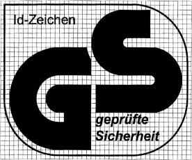

# Gesetz über die Bereitstellung von Produkten auf dem Markt (ProdSG 2011)

Ausfertigungsdatum
:   2011-11-08

Fundstelle
:   BGBl I: 2011, 2178, 2179 (2012 I 131)

Geändert durch
:   Art. 435 V v. 31.8.2015 I 1474

[^BJNR217900011_01]:     Dieses Gesetz dient der Umsetzung 1.der Richtlinie 2001/95/EG des
    Europäischen Parlaments und des Rates vom 3. Dezember 2001 über die
    allgemeine Produktsicherheit (ABl. L 11 vom 15.1.2002, S. 4), die
    zuletzt durch die Verordnung (EG) Nr. 596/2009 (ABl. L 188 vom
    18\.7.2009, S. 14) geändert worden ist,

    2\.der Richtlinie 2006/95/EG des Europäischen Parlaments und des Rates
    vom 12. Dezember 2006 zur Angleichung der Rechtsvorschriften der
    Mitgliedstaaten betreffend elektrische Betriebsmittel zur Verwendung
    innerhalb bestimmter Spannungsgrenzen (ABl. L 374 vom 27.12.2006, S.
    10),

    3\.der Richtlinie 94/9/EG des Europäischen Parlaments und des Rates vom
    23\. März 1994 zur Angleichung der Rechtsvorschriften der
    Mitgliedstaaten für Geräte und Schutzsysteme zur bestimmungsgemäßen
    Verwendung in explosionsgefährdeten Bereichen (ABl. L 100 vom
    19\.4.1994, S. 1, L 257 vom 10.10.1996, S. 44, L 21 vom 26.1.2000, S.
    42), die durch die Verordnung (EG) Nr. 1882/2003 (ABl. L 284 vom
    31\.10.2003, S. 1) geändert worden ist,

    4\.der Richtlinie 2009/105/EG des Europäischen Parlaments und des Rates
    vom 16. September 2009 über einfache Druckbehälter (ABl. L 264 vom
    8\.10.2009, S. 12),

    5\.der Richtlinie 75/324/EWG des Rates vom 20. Mai 1975 zur Angleichung
    der Rechtsvorschriften der Mitgliedstaaten über Aerosolpackungen (ABl.
    L 147 vom 9.6.1975, S. 40, L 220 vom 8.8.1987, S. 22), die zuletzt
    durch die Verordnung (EG) Nr. 219/2009 (ABl. L 87 vom 31.3.2009, S.
    109) geändert worden ist,

    6\.der Richtlinie 97/23/EG des Europäischen Parlaments und des Rates
    vom 29. Mai 1997 zur Angleichung der Rechtsvorschriften der
    Mitgliedstaaten über Druckgeräte (ABl. L 181 vom 9.7.1997, S. 1, L 265
    vom 9.10.2009, S. 110), die durch die Verordnung (EG) Nr. 1882/2003
    (ABl. L 284 vom 31.10.2003, S. 1) geändert worden ist,

    7\.der Richtlinie 2006/42/EG des Europäischen Parlaments und des Rates
    vom 17. Mai 2006 über Maschinen und zur Änderung der Richtlinie
    95/16/EG (ABl. L 157 vom 9.6.2006, S. 24, L 76 vom 16.3.2007, S. 35),
    die zuletzt durch die Richtlinie 2009/127/EG (ABl. L 310 vom
    25\.11.2009, S. 29) geändert worden ist,

    8\.der Richtlinie 95/16/EG des Europäischen Parlaments und des Rates
    vom 29. Juni 1995 zur Angleichung der Rechtsvorschriften der
    Mitgliedstaaten über Aufzüge (ABl. L 213 vom 7.9.1995, S. 1), die
    zuletzt durch die Richtlinie 2006/42/EG (ABl. L 157 vom 9.6.2006, S.
    24) geändert worden ist,

    9\.der Richtlinie 2000/14/EG des Europäischen Parlaments und des Rates
    vom 8. Mai 2000 zur Angleichung der Rechtsvorschriften der
    Mitgliedstaaten über umweltbelastende Geräuschemissionen von zur
    Verwendung im Freien vorgesehenen Geräten und Maschinen (ABl. L 162
    vom 3.7.2000, S. 1, L 311 vom 28.11.2001, S. 50), die zuletzt durch
    die Verordnung (EG) Nr. 219/2009 (ABl. L 87 vom 31.3.2009, S. 109)
    geändert worden ist,

    10\.der Richtlinie 2009/142/EG des Europäischen Parlaments und des
    Rates vom 30. November 2009 über Gasverbrauchseinrichtungen (ABl. L
    330 vom 16.12.2009, S. 10),

    11\.der Richtlinie 89/686/EWG des Rates vom 21. Dezember 1989 zur
    Angleichung der Rechtsvorschriften der Mitgliedstaaten für persönliche
    Schutzausrüstungen (ABl. L 399 vom 30.12.1989, S. 18), die zuletzt
    durch die Verordnung (EG) Nr. 1882/2003 (ABl. L 284 vom 31.10.2003, S.
    1) geändert worden ist,

    12\.der Richtlinie 2009/48/EG des Europäischen Parlaments und des Rates
    vom 18. Juni 2009 über die Sicherheit von Spielzeug (ABl. L 170 vom
    30\.6.2009, S. 1),

    13\.der Richtlinie 94/25/EG des Europäischen Parlaments und des Rates
    vom 16. Juni 1994 zur Angleichung der Rechts- und
    Verwaltungsvorschriften der Mitgliedstaaten über Sportboote (ABl. L
    164 vom 30.6.1994, S. 15, L 127 vom 10.6.1995, S. 27, L 41 vom
    15\.2.2000, S. 20), die zuletzt durch die Verordnung (EG) Nr. 1137/2008
    (ABl. L 311 vom 21.11.2008, S. 1) geändert worden ist,

    14\.des Beschlusses Nr. 768/2008/EG des Europäischen Parlaments und des
    Rates vom 9. Juli 2008 über einen gemeinsamen Rechtsrahmen für die
    Vermarktung von Produkten und zur Aufhebung des Beschlusses 93/465/EWG
    des Rates (ABl. L 218 vom 13.8.2008, S. 82).

## Abschnitt 1 - Allgemeine Vorschriften

### § 1 Anwendungsbereich

(1) Dieses Gesetz gilt, wenn im Rahmen einer Geschäftstätigkeit
Produkte auf dem Markt bereitgestellt, ausgestellt oder erstmals
verwendet werden.

(2) Dieses Gesetz gilt auch für die Errichtung und den Betrieb
überwachungsbedürftiger Anlagen, die gewerblichen oder
wirtschaftlichen Zwecken dienen oder durch die Beschäftigte gefährdet
werden können, mit Ausnahme der überwachungsbedürftigen Anlagen

1.  der Fahrzeuge von Magnetschwebebahnen, soweit diese Fahrzeuge den
    Bestimmungen des Bundes zum Bau und Betrieb solcher Bahnen
    unterliegen,

2.  des rollenden Materials von Eisenbahnen, ausgenommen Ladegutbehälter,
    soweit dieses Material den Bestimmungen der Bau- und Betriebsordnungen
    des Bundes und der Länder unterliegt,

3.  in Unternehmen des Bergwesens, ausgenommen in deren Tagesanlagen.

(3) Dieses Gesetz gilt nicht für

1.  Antiquitäten,

2.  gebrauchte Produkte, die vor ihrer Verwendung instand gesetzt oder
    wiederaufgearbeitet werden müssen, sofern der Wirtschaftsakteur
    denjenigen, an den sie abgegeben werden, darüber ausreichend
    unterrichtet,

3.  Produkte, die ihrer Bauart nach ausschließlich zur Verwendung für
    militärische Zwecke bestimmt sind,

4.  Lebensmittel, Futtermittel, lebende Pflanzen und Tiere, Erzeugnisse
    menschlichen Ursprungs und Erzeugnisse von Pflanzen und Tieren, die
    unmittelbar mit ihrer künftigen Reproduktion zusammenhängen,

5.  Medizinprodukte im Sinne des § 3 des Medizinproduktegesetzes, soweit
    im Medizinproduktegesetz nichts anderes bestimmt ist,

6.  Umschließungen (wie ortsbewegliche Druckgeräte, Verpackungen und
    Tanks) für die Beförderung gefährlicher Güter, soweit diese
    verkehrsrechtlichen Vorschriften unterliegen, und

7.  Pflanzenschutzmittel im Sinne des § 2 Nummer 9 des
    Pflanzenschutzgesetzes oder des Artikels 2 Absatz 1 der Verordnung
    (EG) Nr. 1107/2009 des Europäischen Parlaments und des Rates vom 21.
    Oktober 2009 über das Inverkehrbringen von Pflanzenschutzmitteln und
    zur Aufhebung der Richtlinien 79/117/EWG und 91/414/EWG des Rates
    (ABl. L 309 vom 24.11.2009, S. 1).

Satz 1 Nummer 2 und 5 gilt nicht für die Vorschriften in Abschnitt 9
dieses Gesetzes.

(4) Die Vorschriften dieses Gesetzes gelten nicht, soweit in anderen
Rechtsvorschriften entsprechende oder weitergehende Vorschriften
vorgesehen sind. Satz 1 gilt nicht für die Vorschriften in Abschnitt 9
dieses Gesetzes.

### § 2 Begriffsbestimmungen

Im Sinne dieses Gesetzes

1.  ist Akkreditierung die Bestätigung durch eine nationale
    Akkreditierungsstelle, dass eine Konformitätsbewertungsstelle die in
    harmonisierten Normen festgelegten Anforderungen und gegebenenfalls
    zusätzliche Anforderungen, einschließlich solcher in relevanten
    sektoralen Akkreditierungssystemen, erfüllt, um eine spezielle
    Konformitätsbewertungstätigkeit durchzuführen,

2.  ist Ausstellen das Anbieten, Aufstellen oder Vorführen von Produkten
    zu Zwecken der Werbung oder der Bereitstellung auf dem Markt,

3.  ist Aussteller jede natürliche oder juristische Person, die ein
    Produkt ausstellt,

4.  ist Bereitstellung auf dem Markt jede entgeltliche oder unentgeltliche
    Abgabe eines Produkts zum Vertrieb, Verbrauch oder zur Verwendung auf
    dem Markt der Europäischen Union im Rahmen einer Geschäftstätigkeit,

5.  ist bestimmungsgemäße Verwendung

    a)  die Verwendung, für die ein Produkt nach den Angaben derjenigen
        Person, die es in den Verkehr bringt, vorgesehen ist oder

    b)  die übliche Verwendung, die sich aus der Bauart und Ausführung des
        Produkts ergibt,

6.  ist Bevollmächtigter jede im Europäischen Wirtschaftsraum ansässige
    natürliche oder juristische Person, die der Hersteller schriftlich
    beauftragt hat, in seinem Namen bestimmte Aufgaben wahrzunehmen, um
    seine Verpflichtungen nach der einschlägigen Gesetzgebung der
    Europäischen Union zu erfüllen,

7.  ist CE-Kennzeichnung die Kennzeichnung, durch die der Hersteller
    erklärt, dass das Produkt den geltenden Anforderungen genügt, die in
    den Harmonisierungsrechtsvorschriften der Europäischen Union, die ihre
    Anbringung vorschreiben, festgelegt sind,

8.  ist Einführer jede im Europäischen Wirtschaftsraum ansässige
    natürliche oder juristische Person, die ein Produkt aus einem Staat,
    der nicht dem Europäischen Wirtschaftsraum angehört, in den Verkehr
    bringt,

9.  ist ernstes Risiko jedes Risiko, das ein rasches Eingreifen der
    Marktüberwachungsbehörden erfordert, auch wenn das Risiko keine
    unmittelbare Auswirkung hat,

10. ist Gefahr die mögliche Ursache eines Schadens,

11. ist GS-Stelle eine Konformitätsbewertungsstelle, der von der Befugnis
    erteilenden Behörde die Befugnis erteilt wurde, das GS-Zeichen
    zuzuerkennen,

12. ist Händler jede natürliche oder juristische Person in der
    Lieferkette, die ein Produkt auf dem Markt bereitstellt, mit Ausnahme
    des Herstellers und des Einführers,

13. ist harmonisierte Norm eine Norm, die von einem der in Anhang I der
    Richtlinie 98/34/EG des Europäischen Parlaments und des Rates vom 22.
    Juni 1998 über ein Informationsverfahren auf dem Gebiet der Normen und
    technischen Vorschriften und der Vorschriften für die Dienste der
    Informationsgesellschaft (ABl. L 204 vom 21.7.1998, S. 37), die
    zuletzt durch die Richtlinie 2006/96/EG (ABl. L 363 vom 20.12.2006, S.
    81) geändert worden ist, anerkannten europäischen Normungsgremien auf
    der Grundlage eines Ersuchens der Europäischen Kommission nach Artikel
    6 jener Richtlinie erstellt wurde,

14. ist Hersteller jede natürliche oder juristische Person, die ein
    Produkt herstellt oder entwickeln oder herstellen lässt und dieses
    Produkt unter ihrem eigenen Namen oder ihrer eigenen Marke vermarktet;
    als Hersteller gilt auch jeder, der

    a)  geschäftsmäßig seinen Namen, seine Marke oder ein anderes
        unterscheidungskräftiges Kennzeichen an einem Produkt anbringt und
        sich dadurch als Hersteller ausgibt oder

    b)  ein Produkt wiederaufarbeitet oder die Sicherheitseigenschaften eines
        Verbraucherprodukts beeinflusst und dieses anschließend auf dem Markt
        bereitstellt,

15. ist Inverkehrbringen die erstmalige Bereitstellung eines Produkts auf
    dem Markt; die Einfuhr in den Europäischen Wirtschaftsraum steht dem
    Inverkehrbringen eines neuen Produkts gleich,

16. ist Konformitätsbewertung das Verfahren zur Bewertung, ob spezifische
    Anforderungen an ein Produkt, ein Verfahren, eine Dienstleistung, ein
    System, eine Person oder eine Stelle erfüllt worden sind,

17. ist Konformitätsbewertungsstelle eine Stelle, die
    Konformitätsbewertungstätigkeiten einschließlich Kalibrierungen,
    Prüfungen, Zertifizierungen und Inspektionen durchführt,

18. ist Marktüberwachung jede von den zuständigen Behörden durchgeführte
    Tätigkeit und von ihnen getroffene Maßnahme, durch die sichergestellt
    werden soll, dass die Produkte mit den Anforderungen dieses Gesetzes
    übereinstimmen und die Sicherheit und Gesundheit von Personen oder
    andere im öffentlichen Interesse schützenswerte Bereiche nicht
    gefährden,

19. ist Marktüberwachungsbehörde jede Behörde, die für die Durchführung
    der Marktüberwachung zuständig ist,

20. ist notifizierte Stelle eine Konformitätsbewertungsstelle,

    a)  der die Befugnis erteilende Behörde die Befugnis erteilt hat,
        Konformitätsbewertungsaufgaben nach den Rechtsverordnungen nach § 8
        Absatz 1, die erlassen wurden, um Rechtsvorschriften der Europäischen
        Union umzusetzen oder durchzuführen, wahrzunehmen, und die von der
        Befugnis erteilenden Behörde der Europäischen Kommission und den
        übrigen Mitgliedstaaten notifiziert worden ist oder

    b)  die der Europäischen Kommission und den übrigen Mitgliedstaaten von
        einem Mitgliedstaat der Europäischen Union oder einem anderen
        Vertragsstaat des Abkommens über den Europäischen Wirtschaftsraum auf
        Grund eines europäischen Rechtsaktes als notifizierte Stelle
        mitgeteilt worden ist,

21. ist Notifizierung die Mitteilung der Befugnis erteilenden Behörde an
    die Europäische Kommission und die übrigen Mitgliedstaaten, dass eine
    Konformitätsbewertungsstelle Konformitätsbewertungsaufgaben gemäß den
    nach § 8 Absatz 1 zur Umsetzung oder Durchführung von
    Rechtsvorschriften der Europäischen Union erlassenen
    Rechtsverordnungen wahrnehmen kann,

22. sind Produkte Waren, Stoffe oder Zubereitungen, die durch einen
    Fertigungsprozess hergestellt worden sind,

23. ist Risiko die Kombination aus der Eintrittswahrscheinlichkeit einer
    Gefahr und der Schwere des möglichen Schadens,

24. ist Rücknahme jede Maßnahme, mit der verhindert werden soll, dass ein
    Produkt, das sich in der Lieferkette befindet, auf dem Markt
    bereitgestellt wird,

25. ist Rückruf jede Maßnahme, die darauf abzielt, die Rückgabe eines dem
    Endverbraucher bereitgestellten Produkts zu erwirken,

26. sind Verbraucherprodukte neue, gebrauchte oder wiederaufgearbeitete
    Produkte, die für Verbraucher bestimmt sind oder unter Bedingungen,
    die nach vernünftigem Ermessen vorhersehbar sind, von Verbrauchern
    benutzt werden könnten, selbst wenn sie nicht für diese bestimmt sind;
    als Verbraucherprodukte gelten auch Produkte, die dem Verbraucher im
    Rahmen einer Dienstleistung zur Verfügung gestellt werden,

27. sind Produkte verwendungsfertig, wenn sie bestimmungsgemäß verwendet
    werden können, ohne dass weitere Teile eingefügt zu werden brauchen;
    verwendungsfertig sind Produkte auch, wenn

    a)  alle Teile, aus denen sie zusammengesetzt werden sollen, zusammen von
        einer Person in den Verkehr gebracht werden,

    b)  sie nur noch aufgestellt oder angeschlossen zu werden brauchen oder

    c)  sie ohne die Teile in den Verkehr gebracht werden, die üblicherweise
        gesondert beschafft und bei der bestimmungsgemäßen Verwendung
        eingefügt werden,

28. ist vorhersehbare Verwendung die Verwendung eines Produkts in einer
    Weise, die von derjenigen Person, die es in den Verkehr bringt, nicht
    vorgesehen, jedoch nach vernünftigem Ermessen vorhersehbar ist,

29. sind Wirtschaftsakteure Hersteller, Bevollmächtigte, Einführer und
    Händler,

30. sind überwachungsbedürftige Anlagen

    a)  Dampfkesselanlagen mit Ausnahme von Dampfkesselanlagen auf
        Seeschiffen,

    b)  Druckbehälteranlagen außer Dampfkesseln,

    c)  Anlagen zur Abfüllung von verdichteten, verflüssigten oder unter Druck
        gelösten Gasen,

    d)  Leitungen unter innerem Überdruck für brennbare, ätzende oder giftige
        Gase, Dämpfe oder Flüssigkeiten,

    e)  Aufzugsanlagen,

    f)  Anlagen in explosionsgefährdeten Bereichen,

    g)  Getränkeschankanlagen und Anlagen zur Herstellung kohlensaurer
        Getränke,

    h)  Acetylenanlagen und Calciumcarbidlager,

    i)  Anlagen zur Lagerung, Abfüllung und Beförderung von brennbaren
        Flüssigkeiten.

    Zu den überwachungsbedürftigen Anlagen gehören auch Mess-, Steuer- und
    Regeleinrichtungen, die dem sicheren Betrieb dieser
    überwachungsbedürftigen Anlagen dienen; zu den in den Buchstaben b, c
    und d bezeichneten überwachungsbedürftigen Anlagen gehören nicht die
    Energieanlagen im Sinne des Energiewirtschaftsgesetzes.
    Überwachungsbedürftige Anlagen stehen den Produkten im Sinne von
    Nummer 22 gleich, soweit sie nicht schon von Nummer 22 erfasst werden,

31. sind die für die Kontrolle der Außengrenzen zuständigen Behörden die
    Zollbehörden.

## Abschnitt 2 - Voraussetzungen für die Bereitstellung von Produkten auf dem Markt sowie für das Ausstellen von Produkten

### § 3 Allgemeine Anforderungen an die Bereitstellung von Produkten auf dem Markt

(1) Soweit ein Produkt einer oder mehreren Rechtsverordnungen nach § 8
Absatz 1 unterliegt, darf es nur auf dem Markt bereitgestellt werden,
wenn es

1.  die darin vorgesehenen Anforderungen erfüllt und

2.  die Sicherheit und Gesundheit von Personen oder sonstige in den
    Rechtsverordnungen nach § 8 Absatz 1 aufgeführte Rechtsgüter bei
    bestimmungsgemäßer oder vorhersehbarer Verwendung nicht gefährdet.

(2) Ein Produkt darf, soweit es nicht Absatz 1 unterliegt, nur auf dem
Markt bereitgestellt werden, wenn es bei bestimmungsgemäßer oder
vorhersehbarer Verwendung die Sicherheit und Gesundheit von Personen
nicht gefährdet. Bei der Beurteilung, ob ein Produkt der Anforderung
nach Satz 1 entspricht, sind insbesondere zu berücksichtigen:

1.  die Eigenschaften des Produkts einschließlich seiner Zusammensetzung,
    seine Verpackung, die Anleitungen für seinen Zusammenbau, die
    Installation, die Wartung und die Gebrauchsdauer,

2.  die Einwirkungen des Produkts auf andere Produkte, soweit zu erwarten
    ist, dass es zusammen mit anderen Produkten verwendet wird,

3.  die Aufmachung des Produkts, seine Kennzeichnung, die Warnhinweise,
    die Gebrauchs- und Bedienungsanleitung, die Angaben zu seiner
    Beseitigung sowie alle sonstigen produktbezogenen Angaben oder
    Informationen,

4.  die Gruppen von Verwendern, die bei der Verwendung des Produkts
    stärker gefährdet sind als andere.

Die Möglichkeit, einen höheren Sicherheitsgrad zu erreichen, oder die
Verfügbarkeit anderer Produkte, die ein geringeres Risiko darstellen,
ist kein ausreichender Grund, ein Produkt als gefährlich anzusehen.

(3) Wenn der Schutz von Sicherheit und Gesundheit erst durch die Art
der Aufstellung eines Produkts gewährleistet werden, ist hierauf bei
der Bereitstellung auf dem Markt ausreichend hinzuweisen, sofern in
den Rechtsverordnungen nach § 8 keine anderen Regelungen vorgesehen
sind.

(4) Sind bei der Verwendung, Ergänzung oder Instandhaltung eines
Produkts bestimmte Regeln zu beachten, um den Schutz von Sicherheit
und Gesundheit zu gewährleisten, ist bei der Bereitstellung auf dem
Markt hierfür eine Gebrauchsanleitung in deutscher Sprache
mitzuliefern, sofern in den Rechtsverordnungen nach § 8 keine anderen
Regelungen vorgesehen sind.

(5) Ein Produkt, das die Anforderungen nach Absatz 1 oder Absatz 2
nicht erfüllt, darf ausgestellt werden, wenn der Aussteller deutlich
darauf hinweist, dass es diese Anforderungen nicht erfüllt und erst
erworben werden kann, wenn die entsprechende Übereinstimmung
hergestellt ist. Bei einer Vorführung sind die erforderlichen
Vorkehrungen zum Schutz der Sicherheit und Gesundheit von Personen zu
treffen.

### § 4 Harmonisierte Normen

(1) Bei der Beurteilung, ob ein Produkt den Anforderungen nach § 3
Absatz 1 oder Absatz 2 entspricht, können harmonisierte Normen
zugrunde gelegt werden.

(2) Bei einem Produkt, das harmonisierten Normen oder Teilen dieser
Normen entspricht, deren Fundstellen im Amtsblatt der Europäischen
Union veröffentlicht worden sind, wird vermutet, dass es den
Anforderungen nach § 3 Absatz 1 oder Absatz 2 genügt, soweit diese von
den betreffenden Normen oder von Teilen dieser Normen abgedeckt sind.

(3) Ist die Marktüberwachungsbehörde der Auffassung, dass eine
harmonisierte Norm den von ihr abgedeckten Anforderungen nach § 3
Absatz 1 oder Absatz 2 nicht vollständig entspricht, so unterrichtet
sie hiervon unter Angabe der Gründe die Bundesanstalt für
Arbeitsschutz und Arbeitsmedizin. Die Bundesanstalt für Arbeitsschutz
und Arbeitsmedizin überprüft die eingegangenen Meldungen auf
Vollständigkeit und Schlüssigkeit; sie beteiligt den Ausschuss für
Produktsicherheit. Sie leitet die Meldungen dem zuständigen
Bundesressort zu.

### § 5 Normen und andere technische Spezifikationen

(1) Bei der Beurteilung, ob ein Produkt den Anforderungen nach § 3
Absatz 2 entspricht, können Normen und andere technische
Spezifikationen zugrunde gelegt werden.

(2) Bei einem Produkt, das Normen oder anderen technischen
Spezifikationen oder Teilen von diesen entspricht, die vom Ausschuss
für Produktsicherheit ermittelt und deren Fundstellen von der
Bundesanstalt für Arbeitsschutz und Arbeitsmedizin im Gemeinsamen
Ministerialblatt bekannt gegeben worden sind, wird vermutet, dass es
den Anforderungen nach § 3 Absatz 2 genügt, soweit diese von den
betreffenden Normen oder anderen technischen Spezifikationen oder
deren Teilen abgedeckt sind.

(3) Ist die Marktüberwachungsbehörde der Auffassung, dass eine Norm
oder andere technische Spezifikation den von ihr abgedeckten
Anforderungen nach § 3 Absatz 2 nicht vollständig entspricht, so
unterrichtet sie hiervon unter Angabe der Gründe die Bundesanstalt für
Arbeitsschutz und Arbeitsmedizin. Diese informiert den Ausschuss für
Produktsicherheit.

### § 6 Zusätzliche Anforderungen an die Bereitstellung von Verbraucherprodukten auf dem Markt

(1) Der Hersteller, sein Bevollmächtigter und der Einführer haben
jeweils im Rahmen ihrer Geschäftstätigkeit bei der Bereitstellung
eines Verbraucherprodukts auf dem Markt

1.  sicherzustellen, dass der Verwender die Informationen erhält, die er
    benötigt, um die Risiken, die mit dem Verbraucherprodukt während der
    üblichen oder vernünftigerweise vorhersehbaren Gebrauchsdauer
    verbunden sind und die ohne entsprechende Hinweise nicht unmittelbar
    erkennbar sind, beurteilen und sich gegen sie schützen zu können,

2.  den Namen und die Kontaktanschrift des Herstellers oder, sofern dieser
    nicht im Europäischen Wirtschaftsraum ansässig ist, den Namen und die
    Kontaktanschrift des Bevollmächtigten oder des Einführers anzubringen,

3.  eindeutige Kennzeichnungen zur Identifikation des Verbraucherprodukts
    anzubringen.

Die Angaben nach Satz 1 Nummer 2 und 3 sind auf dem Verbraucherprodukt
oder, wenn dies nicht möglich ist, auf dessen Verpackung anzubringen.
Ausnahmen von den Verpflichtungen nach Satz 1 Nummer 2 und 3 sind
zulässig, wenn es vertretbar ist, diese Angaben wegzulassen,
insbesondere weil sie dem Verwender bereits bekannt sind oder weil es
mit einem unverhältnismäßigen Aufwand verbunden wäre, sie anzubringen.

(2) Der Hersteller, sein Bevollmächtigter und der Einführer haben
jeweils im Rahmen ihrer Geschäftstätigkeit Vorkehrungen für geeignete
Maßnahmen zur Vermeidung von Risiken zu treffen, die mit dem
Verbraucherprodukt verbunden sein können, das sie auf dem Markt
bereitgestellt haben; die Maßnahmen müssen den Produkteigenschaften
angemessen sein und reichen bis zur Rücknahme, zu angemessenen und
wirksamen Warnungen und zum Rückruf.

(3) Der Hersteller, sein Bevollmächtigter und der Einführer haben
jeweils im Rahmen ihrer Geschäftstätigkeit bei den auf dem Markt
bereitgestellten Verbraucherprodukten

1.  Stichproben durchzuführen,

2.  Beschwerden zu prüfen und, falls erforderlich, ein Beschwerdebuch zu
    führen sowie

3.  die Händler über weitere das Verbraucherprodukt betreffende Maßnahmen
    zu unterrichten.

Welche Stichproben geboten sind, hängt vom Grad des Risikos ab, das
mit den Produkten verbunden ist, und von den Möglichkeiten, das Risiko
zu vermeiden.

(4) Der Hersteller, sein Bevollmächtigter und der Einführer haben nach
Maßgabe von Anhang I der Richtlinie 2001/95/EG des Europäischen
Parlaments und des Rates vom 3. Dezember 2001 über die allgemeine
Produktsicherheit (ABl. L 11 vom 15.1.2002, S. 4) jeweils unverzüglich
die an ihrem Geschäftssitz zuständige Marktüberwachungsbehörde zu
unterrichten, wenn sie wissen oder auf Grund der ihnen vorliegenden
Informationen oder ihrer Erfahrung wissen müssen, dass ein
Verbraucherprodukt, das sie auf dem Markt bereitgestellt haben, ein
Risiko für die Sicherheit und Gesundheit von Personen darstellt;
insbesondere haben sie die Marktüberwachungsbehörde über die Maßnahmen
zu unterrichten, die sie zur Vermeidung dieses Risikos getroffen
haben. Die Marktüberwachungsbehörde unterrichtet unverzüglich die
Bundesanstalt für Arbeitsschutz und Arbeitsmedizin über den
Sachverhalt, insbesondere bei Rückrufen. Eine Unterrichtung nach Satz
1 darf nicht zur strafrechtlichen Verfolgung des Unterrichtenden oder
für ein Verfahren nach dem Gesetz über Ordnungswidrigkeiten gegen den
Unterrichtenden verwendet werden.

(5) Der Händler hat dazu beizutragen, dass nur sichere
Verbraucherprodukte auf dem Markt bereitgestellt werden. Er darf
insbesondere kein Verbraucherprodukt auf dem Markt bereitstellen, von
dem er weiß oder auf Grund der ihm vorliegenden Informationen oder
seiner Erfahrung wissen muss, dass es nicht den Anforderungen nach § 3
entspricht. Absatz 4 gilt für den Händler entsprechend.

### § 7 CE-Kennzeichnung

(1) Für die CE-Kennzeichnung gelten die allgemeinen Grundsätze nach
Artikel 30 der Verordnung (EG) Nr. 765/2008 des Europäischen
Parlaments und des Rates vom 9. Juli 2008 über die Vorschriften für
die Akkreditierung und Marktüberwachung im Zusammenhang mit der
Vermarktung von Produkten und zur Aufhebung der Verordnung (EWG) Nr.
339/93 des Rates (ABl. L 218 vom 13.8.2008, S. 30).

(2) Es ist verboten, ein Produkt auf dem Markt bereitzustellen,

1.  wenn das Produkt, seine Verpackung oder ihm beigefügte Unterlagen mit
    der CE-Kennzeichnung versehen sind, ohne dass die Rechtsverordnungen
    nach § 8 Absatz 1 oder andere Rechtsvorschriften dies vorsehen oder
    ohne dass die Anforderungen der Absätze 3 bis 5 erfüllt sind, oder

2.  das nicht mit der CE-Kennzeichnung versehen ist, obwohl eine
    Rechtsverordnung nach § 8 Absatz 1 oder eine andere Rechtsvorschrift
    ihre Anbringung vorschreibt.

(3) Sofern eine Rechtsverordnung nach § 8 Absatz 1 oder eine andere
Rechtsvorschrift nichts anderes vorsieht, muss die CE-Kennzeichnung
sichtbar, lesbar und dauerhaft auf dem Produkt oder seinem Typenschild
angebracht sein. Falls die Art des Produkts dies nicht zulässt oder
nicht rechtfertigt, wird die CE-Kennzeichnung auf der Verpackung
angebracht sowie auf den Begleitunterlagen, sofern entsprechende
Unterlagen vorgeschrieben sind.

(4) Nach der CE-Kennzeichnung steht die Kennnummer der notifizierten
Stelle nach § 2 Nummer 20, soweit diese Stelle in der Phase der
Fertigungskontrolle tätig war. Die Kennnummer ist entweder von der
notifizierten Stelle selbst anzubringen oder vom Hersteller oder
seinem Bevollmächtigten nach den Anweisungen der Stelle.

(5) Die CE-Kennzeichnung muss angebracht werden, bevor das Produkt in
den Verkehr gebracht wird. Nach der CE-Kennzeichnung und
gegebenenfalls nach der Kennnummer kann ein Piktogramm oder ein
anderes Zeichen stehen, das auf ein besonderes Risiko oder eine
besondere Verwendung hinweist.

### § 8 Ermächtigung zum Erlass von Rechtsverordnungen

(1) Die Bundesministerien für Arbeit und Soziales, für Wirtschaft und
Energie, für Ernährung und Landwirtschaft, für Umwelt, Naturschutz,
Bau und Reaktorsicherheit, für Verkehr und digitale Infrastruktur und
der Verteidigung werden ermächtigt, jeweils für ihren
Zuständigkeitsbereich im Einvernehmen mit den anderen zuvor genannten
Bundesministerien für Produkte nach Anhörung des Ausschusses für
Produktsicherheit und mit Zustimmung des Bundesrates
Rechtsverordnungen zum Schutz der Sicherheit und Gesundheit von
Personen, zum Schutz der Umwelt sowie sonstiger Rechtsgüter vor
Risiken, die von Produkten ausgehen, zu erlassen, auch um
Verpflichtungen aus zwischenstaatlichen Vereinbarungen zu erfüllen
oder um die von der Europäischen Union erlassenen Rechtsvorschriften
umzusetzen oder durchzuführen. Durch diese Rechtsverordnungen können
geregelt werden:

1.  Anforderungen an

    a)  die Beschaffenheit von Produkten,

    b)  die Bereitstellung von Produkten auf dem Markt,

    c)  das Ausstellen von Produkten,

    d)  die erstmalige Verwendung von Produkten,

    e)  die Kennzeichnung von Produkten,

    f)  Konformitätsbewertungsstellen,

2.  produktbezogene Aufbewahrungs- und Mitteilungspflichten,

3.  Handlungspflichten von Konformitätsbewertungsstellen

sowie behördliche Maßnahmen und Zuständigkeiten, die sich auf die
Anforderungen nach Nummer 1 und die Pflichten nach den Nummern 2 und 3
beziehen und die erforderlich sind, um die von der Europäischen Union
erlassenen Rechtsakte umzusetzen oder durchzuführen.

(2) Die Bundesregierung wird ermächtigt, mit Zustimmung des
Bundesrates durch Rechtsverordnung für einzelne Produktbereiche zu
bestimmen, dass eine Stelle, die Aufgaben der Konformitätsbewertung
oder der Bewertung und Überprüfung der Leistungsbeständigkeit von
Produkten wahrnimmt, für den Nachweis der an sie gestellten
rechtlichen Anforderungen eine von einer nationalen
Akkreditierungsstelle ausgestellte Akkreditierungsurkunde vorlegen
muss. In einer Rechtsverordnung nach Satz 1 kann auch vorgesehen
werden, die Überwachung der Tätigkeit der Stellen für einzelne
Produktbereiche der Deutschen Akkreditierungsstelle zu übertragen.
Soweit die Bundesregierung keine Rechtsverordnung nach Satz 1 erlassen
hat, werden die Landesregierungen ermächtigt, eine solche
Rechtsverordnung zu erlassen.

(3) Rechtsverordnungen nach Absatz 1 oder Absatz 2 können in
dringenden Fällen, insbesondere wenn es zur unverzüglichen Umsetzung
oder Durchführung von Rechtsakten der Europäischen Union erforderlich
ist, ohne Zustimmung des Bundesrates erlassen werden; sie treten
spätestens sechs Monate nach ihrem Inkrafttreten außer Kraft. Ihre
Geltungsdauer kann nur mit Zustimmung des Bundesrates verlängert
werden.

## Abschnitt 3 - Bestimmungen über die Befugnis erteilende Behörde

### § 9 Aufgaben der Befugnis erteilenden Behörde

(1) Die Befugnis erteilende Behörde erteilt
Konformitätsbewertungsstellen auf Antrag die Befugnis, bestimmte
Konformitätsbewertungstätigkeiten durchzuführen. Sie ist zuständig für
die Einrichtung und Durchführung der dazu erforderlichen Verfahren.
Sie ist auch zuständig für die Einrichtung und Durchführung der
Verfahren, die zur Überwachung der Konformitätsbewertungsstellen
erforderlich sind, denen sie die Befugnis zur Durchführung bestimmter
Konformitätsbewertungstätigkeiten erteilt hat.

(2) Die Befugnis erteilende Behörde führt die Notifizierung von
Konformitätsbewertungsstellen durch.

(3) Die Befugnis erteilende Behörde überwacht, ob die
Konformitätsbewertungsstellen, denen sie die Befugnis zur Durchführung
bestimmter Konformitätsbewertungstätigkeiten erteilt hat, die
Anforderungen erfüllen und ihren gesetzlichen Verpflichtungen
nachkommen. Sie trifft die notwendigen Anordnungen zur Beseitigung
festgestellter Mängel oder zur Verhütung künftiger Verstöße.

(4) Die Befugnis erteilende Behörde übermittelt der zuständigen
Marktüberwachungsbehörde auf Anforderung die Informationen, die für
deren Aufgabenerfüllung erforderlich sind.

### § 10 Anforderungen an die Befugnis erteilende Behörde

(1) Die Länder haben die Befugnis erteilende Behörde so einzurichten,
dass es zu keinerlei Interessenkonflikt mit den
Konformitätsbewertungsstellen kommt; insbesondere darf die Befugnis
erteilende Behörde weder Tätigkeiten, die
Konformitätsbewertungsstellen durchführen, noch Beratungsleistungen
auf einer gewerblichen oder wettbewerblichen Basis anbieten oder
erbringen.

(2) Bedienstete der Befugnis erteilenden Behörde, die die Begutachtung
einer Konformitätsbewertungsstelle durchgeführt haben, dürfen nicht
mit der Entscheidung über die Erteilung der Befugnis, als
Konformitätsbewertungsstelle tätig werden zu dürfen, betraut werden.

(3) Der Befugnis erteilenden Behörde müssen kompetente Mitarbeiter in
ausreichender Zahl zur Verfügung stehen, so dass sie ihre Aufgaben
ordnungsgemäß wahrnehmen kann.

### § 11 Befugnisse der Befugnis erteilenden Behörde

(1) Die Befugnis erteilende Behörde kann von den
Konformitätsbewertungsstellen, denen sie die Befugnis zur Durchführung
bestimmter Konformitätsbewertungstätigkeiten erteilt hat, die zur
Erfüllung ihrer Überwachungsaufgaben erforderlichen Auskünfte und
sonstige Unterstützung verlangen sowie die dazu erforderlichen
Anordnungen treffen. Die Befugnis erteilende Behörde ist insbesondere
befugt zu verlangen, dass ihr die Unterlagen vorgelegt werden, die der
Konformitätsbewertung zugrunde liegen. Sie und die von ihr
beauftragten Personen sind befugt, zu den Betriebs- und
Geschäftszeiten Betriebsgrundstücke und Geschäftsräume sowie
Prüflaboratorien zu betreten und zu besichtigen, soweit dies zur
Erfüllung ihrer Überwachungsaufgaben erforderlich ist.

(2) Die Auskunftspflichtigen haben die Maßnahmen nach Absatz 1 zu
dulden. Sie können die Auskunft auf Fragen verweigern, sofern die
Beantwortung sie selbst oder einen der in § 383 Absatz 1 Nummer 1 bis
3 der Zivilprozessordnung bezeichneten Angehörigen der Gefahr
strafrechtlicher Verfolgung oder eines Verfahrens nach dem Gesetz über
Ordnungswidrigkeiten aussetzen würde. Sie sind über ihr Recht zur
Auskunftsverweigerung zu belehren.

## Abschnitt 4 - Notifizierung von Konformitätsbewertungsstellen

### § 12 Anträge auf Notifizierung

(1) Eine Konformitätsbewertungsstelle kann bei der Befugnis
erteilenden Behörde die Befugnis beantragen, als notifizierte Stelle
tätig werden zu dürfen.

(2) Dem Antrag nach Absatz 1 legt die Konformitätsbewertungsstelle
eine Beschreibung der Konformitätsbewertungstätigkeiten, der
Konformitätsbewertungsverfahren und der Produkte bei, für die sie
Kompetenz beansprucht, sowie, wenn vorhanden, eine
Akkreditierungsurkunde, die von einer nationalen Akkreditierungsstelle
ausgestellt wurde und in der diese bescheinigt, dass die
Konformitätsbewertungsstelle die Anforderungen des § 13 erfüllt.

(3) Kann die Konformitätsbewertungsstelle keine Akkreditierungsurkunde
vorweisen, legt sie der Befugnis erteilenden Behörde als Nachweis alle
Unterlagen vor, die erforderlich sind, um überprüfen, feststellen und
regelmäßig überwachen zu können, ob sie die Anforderungen des § 13
erfüllt.

### § 13 Anforderungen an die Konformitätsbewertungsstelle für ihre Notifizierung

(1) Die Konformitätsbewertungsstelle muss Rechtspersönlichkeit
besitzen. Sie muss selbstständig Verträge abschließen, unbewegliches
Vermögen erwerben und darüber verfügen können sowie vor Gericht klagen
und verklagt werden können.

(2) Bei der Konformitätsbewertungsstelle muss es sich um einen
unabhängigen Dritten handeln, der mit der Einrichtung oder dem
Produkt, die oder das er bewertet, in keinerlei Verbindung steht. Die
Anforderung nach Satz 1 kann auch von einer
Konformitätsbewertungsstelle erfüllt werden, die einem
Wirtschaftsverband oder einem Fachverband angehört und die Produkte
bewertet, an deren Entwurf, Herstellung, Bereitstellung, Montage,
Gebrauch oder Wartung Unternehmen beteiligt sind, die von diesem
Verband vertreten werden, wenn die Konformitätsbewertungsstelle
nachweist, dass sich aus dieser Verbandsmitgliedschaft keine
Interessenkonflikte im Hinblick auf ihre
Konformitätsbewertungstätigkeiten ergeben.

(3) Die Konformitätsbewertungsstelle, ihre oberste Leitungsebene und
die für die Konformitätsbewertungstätigkeiten zuständigen Mitarbeiter
dürfen weder Konstrukteur, Hersteller, Lieferant, Installateur,
Käufer, Eigentümer, Verwender oder Wartungsbetrieb der zu bewertenden
Produkte noch Bevollmächtigter einer dieser Parteien sein. Dies
schließt weder die Verwendung von bereits einer Konformitätsbewertung
unterzogenen Produkten, die für die Tätigkeit der
Konformitätsbewertungsstelle erforderlich sind, noch die Verwendung
solcher Produkte zum persönlichen Gebrauch aus. Die
Konformitätsbewertungsstelle, ihre oberste Leitungsebene und die für
die Konformitätsbewertungstätigkeiten zuständigen Mitarbeiter dürfen
weder direkt an Entwurf, Herstellung oder Bau, Vermarktung,
Installation, Verwendung oder Wartung dieser Produkte beteiligt sein
noch dürfen sie die an diesen Tätigkeiten beteiligten Parteien
vertreten. Sie dürfen sich nicht mit Tätigkeiten befassen, die ihre
Unabhängigkeit bei der Beurteilung oder ihre Integrität im
Zusammenhang mit den Konformitätsbewertungstätigkeiten beeinträchtigen
können. Dies gilt insbesondere für Beratungsdienstleistungen. Die
Konformitätsbewertungsstelle gewährleistet, dass Tätigkeiten ihrer
Zweigunternehmen oder Unterauftragnehmer die Vertraulichkeit,
Objektivität und Unparteilichkeit ihrer
Konformitätsbewertungstätigkeiten nicht beeinträchtigen.

(4) Die Konformitätsbewertungsstelle und ihre Mitarbeiter haben die
Konformitätsbewertungstätigkeiten mit der größtmöglichen
Professionalität und der erforderlichen fachlichen Kompetenz in dem
betreffenden Bereich durchzuführen; sie dürfen keinerlei
Einflussnahme, insbesondere finanzieller Art, durch Dritte ausgesetzt
sein, die sich auf ihre Beurteilung oder die Ergebnisse ihrer
Konformitätsbewertung auswirken könnte und speziell von Personen oder
Personengruppen ausgeht, die ein Interesse am Ergebnis dieser
Konformitätsbewertung haben.

(5) Die Konformitätsbewertungsstelle muss in der Lage sein, alle
Konformitätsbewertungsaufgaben zu bewältigen, für die sie gemäß ihrem
Antrag nach § 12 Absatz 2 die Kompetenz beansprucht, gleichgültig, ob
diese Aufgaben von ihr selbst, in ihrem Auftrag oder unter ihrer
Verantwortung erfüllt werden. Die Konformitätsbewertungsstelle muss
für jedes Konformitätsbewertungsverfahren und für jede Art und
Kategorie von Produkten, für die sie einen Antrag nach § 12 Absatz 2
gestellt hat, über Folgendes verfügen:

1.  die erforderliche Anzahl von Mitarbeitern mit Fachkenntnis und
    ausreichender einschlägiger Erfahrung, um die bei der
    Konformitätsbewertung anfallenden Aufgaben zu erfüllen,

2.  Beschreibungen von Verfahren, nach denen die Konformitätsbewertung
    durchgeführt wird, um die Transparenz und die Wiederholbarkeit dieser
    Verfahren sicherzustellen, sowie über eine angemessene Politik und
    geeignete Verfahren, bei denen zwischen den Aufgaben, die sie als
    notifizierte Stelle wahrnimmt, und anderen Tätigkeiten unterschieden
    wird, und

3.  Verfahren zur Durchführung von Tätigkeiten unter gebührender
    Berücksichtigung der Größe eines Unternehmens, der Branche, in der es
    tätig ist, seiner Struktur, des Grades an Komplexität der jeweiligen
    Produkttechnologie und der Tatsache, dass es sich bei dem
    Produktionsprozess um eine Massenfertigung oder Serienproduktion
    handelt.

Die Konformitätsbewertungsstelle muss über die erforderlichen Mittel
zur angemessenen Erledigung der technischen und administrativen
Aufgaben, die mit der Konformitätsbewertung verbunden sind, verfügen
und sie hat Zugang zu allen benötigten Ausrüstungen oder
Einrichtungen.

(6) Die Konformitätsbewertungsstelle stellt sicher, dass die
Mitarbeiter, die für die Durchführung der
Konformitätsbewertungstätigkeiten zuständig sind,

1.  eine Fach- und Berufsausbildung besitzen, die sie für alle
    Konformitätsbewertungstätigkeiten qualifiziert, für die die
    Konformitätsbewertungsstelle einen Antrag nach § 12 gestellt hat,

2.  über eine ausreichende Kenntnis der Produkte und der
    Konformitätsbewertungsverfahren verfügen und die entsprechende
    Befugnis besitzen, solche Konformitätsbewertungen durchzuführen,

3.  angemessene Kenntnisse und Verständnis der wesentlichen Anforderungen,
    der geltenden harmonisierten Normen und der betreffenden Bestimmungen
    der Harmonisierungsrechtsvorschriften der Europäischen Union und ihrer
    Durchführungsvorschriften besitzen und

4.  die Fähigkeit zur Erstellung von Bescheinigungen, Protokollen und
    Berichten als Nachweis für durchgeführte Konformitätsbewertungen
    haben.

(7) Die Konformitätsbewertungsstelle hat ihre Unparteilichkeit, die
ihrer obersten Leitungsebene und die ihres
Konformitätsbewertungspersonals sicherzustellen. Die Vergütung der
obersten Leitungsebene und des Konformitätsbewertungspersonals darf
sich nicht nach der Anzahl der durchgeführten Konformitätsbewertungen
oder deren Ergebnissen richten.

(8) Die Konformitätsbewertungsstelle hat eine Haftpflichtversicherung
abzuschließen, die die mit ihrer Tätigkeit verbundenen Risiken
angemessen abdeckt.

(9) Die Mitarbeiter der Konformitätsbewertungsstelle dürfen die ihnen
im Rahmen einer Konformitätsbewertung bekannt gewordenen Tatsachen,
deren Geheimhaltung im Interesse der Konformitätsbewertungsstelle oder
eines Dritten liegt, nicht unbefugt offenbaren oder verwerten, auch
wenn ihre Tätigkeit beendet ist. Die von der
Konformitätsbewertungsstelle zu beachtenden Bestimmungen zum Schutz
personenbezogener Daten bleiben unberührt.

### § 14 Konformitätsvermutung

(1) Weist eine Konformitätsbewertungsstelle durch eine Akkreditierung
nach, dass sie die Kriterien der einschlägigen harmonisierten Normen
oder von Teilen dieser Normen erfüllt, deren Fundstellen im Amtsblatt
der Europäischen Union veröffentlicht worden sind, wird vermutet, dass
sie die Anforderungen nach § 13 in dem Umfang erfüllt, in dem die
anwendbaren harmonisierten Normen diese Anforderungen abdecken.

(2) Ist die Befugnis erteilende Behörde der Auffassung, dass eine
harmonisierte Norm den von ihr abgedeckten Anforderungen nach § 13
nicht voll entspricht, so unterrichtet sie hiervon unter Angabe der
Gründe die Bundesanstalt für Arbeitsschutz und Arbeitsmedizin. Die
Bundesanstalt für Arbeitsschutz und Arbeitsmedizin überprüft die
eingegangenen Meldungen auf Vollständigkeit und Schlüssigkeit; sie
beteiligt den Ausschuss für Produktsicherheit. Sie leitet die
Meldungen dem Bundesministerium für Arbeit und Soziales zu.

### § 15 Notifizierungsverfahren, Erteilung der Befugnis

(1) Hat die Befugnis erteilende Behörde festgestellt, dass eine
Konformitätsbewertungsstelle die Anforderungen nach § 13 erfüllt, so
erteilt sie dieser die Befugnis, Konformitätsbewertungsaufgaben nach
den Rechtsverordnungen nach § 8 Absatz 1, die erlassen wurden, um
Rechtsvorschriften der Europäischen Union umzusetzen oder
durchzuführen, wahrzunehmen, und notifiziert diese anschließend mit
Hilfe des elektronischen Notifizierungsinstruments, das von der
Europäischen Kommission entwickelt und verwaltet wird. Die Befugnis
ist unter der aufschiebenden Bedingung zu erteilen, dass nach der
Notifizierung

1.  innerhalb von zwei Wochen, sofern eine Akkreditierungsurkunde nach §
    12 Absatz 2 vorliegt, oder

2.  innerhalb von zwei Monaten, sofern keine Akkreditierungsurkunde nach §
    12 Absatz 2 vorliegt,

weder die Europäische Kommission noch die übrigen Mitgliedstaaten
Einwände erhoben haben. Die Befugnis kann unter weiteren Bedingungen
erteilt und mit Auflagen verbunden werden. Sie kann befristet und mit
dem Vorbehalt des Widerrufs sowie nachträglicher Auflagen erteilt
werden.

(2) Beruht die Bestätigung der Kompetenz nicht auf einer
Akkreditierungsurkunde gemäß § 12 Absatz 2, legt die Befugnis
erteilende Behörde der Europäischen Kommission und den übrigen
Mitgliedstaaten die Unterlagen, die die Kompetenz der
Konformitätsbewertungsstelle bestätigen, als Nachweis vor. Sie legt
ferner die Vereinbarungen vor, die getroffen wurden, um
sicherzustellen, dass die Konformitätsbewertungsstelle regelmäßig
überwacht wird und stets den Anforderungen nach § 13 genügt.

(3) Die Befugnis erteilende Behörde meldet der Europäischen Kommission
und den übrigen Mitgliedstaaten jede später eintretende Änderung der
Notifizierung.

(4) Die Befugnis erteilende Behörde erteilt der Europäischen
Kommission auf Verlangen sämtliche Auskünfte über die Grundlage für
die Notifizierung oder die Erhaltung der Kompetenz der betreffenden
Stelle.

### § 16 Verpflichtungen der notifizierten Stelle

(1) Die notifizierte Stelle führt die Konformitätsbewertung im
Einklang mit den Konformitätsbewertungsverfahren gemäß den
Rechtsverordnungen nach § 8 Absatz 1 und unter Wahrung der
Verhältnismäßigkeit durch.

(2) Stellt die notifizierte Stelle fest, dass ein Hersteller die
Anforderungen nicht erfüllt hat, die in den Rechtsverordnungen nach §
8 Absatz 1 festgelegt sind, fordert sie den Hersteller auf,
angemessene Korrekturmaßnahmen zu ergreifen und stellt keine
Konformitätsbescheinigung aus.

(3) Hat die notifizierte Stelle bereits eine Konformitätsbescheinigung
ausgestellt und stellt sie im Rahmen der Überwachung der Konformität
fest, dass das Produkt die Anforderungen nicht mehr erfüllt, fordert
sie den Hersteller auf, angemessene Korrekturmaßnahmen zu ergreifen;
falls nötig, setzt sie die Bescheinigung aus oder zieht sie zurück.

(4) Werden keine Korrekturmaßnahmen ergriffen oder genügen diese
nicht, um die Erfüllung der Anforderungen sicherzustellen, schränkt
die notifizierte Stelle alle betreffenden Konformitätsbescheinigungen
ein, setzt sie aus oder zieht sie zurück.

(5) Die notifizierte Stelle hat an den einschlägigen
Normungsaktivitäten und den Aktivitäten der Koordinierungsgruppe
notifizierter Stellen, die im Rahmen der jeweiligen
Harmonisierungsrechtsvorschriften der Europäischen Union geschaffen
wurde, mitzuwirken oder dafür zu sorgen, dass ihr
Konformitätsbewertungspersonal darüber informiert wird. Sie hat die
von dieser Gruppe erarbeiteten Verwaltungsentscheidungen und Dokumente
als allgemeine Leitlinie anzuwenden.

### § 17 Meldepflichten der notifizierten Stelle

(1) Die notifizierte Stelle meldet der Befugnis erteilenden Behörde

1.  jede Verweigerung, Einschränkung, Aussetzung oder Rücknahme einer
    Konformitätsbescheinigung,

2.  alle Umstände, die Folgen für die der notifizierten Stelle nach § 15
    Absatz 1 erteilten Befugnis haben,

3.  jedes Auskunftsersuchen über Konformitätsbewertungstätigkeiten, das
    sie von den Marktüberwachungsbehörden erhalten hat,

4.  auf Verlangen, welchen Konformitätsbewertungstätigkeiten sie
    nachgegangen ist und welche anderen Tätigkeiten, einschließlich
    grenzüberschreitender Tätigkeiten und der Vergabe von Unteraufträgen,
    sie ausgeführt hat.

(2) Die notifizierte Stelle übermittelt den anderen notifizierten
Stellen, die unter der jeweiligen Harmonisierungsrechtsvorschrift der
Europäischen Union notifiziert sind, ähnlichen
Konformitätsbewertungstätigkeiten nachgehen und gleichartige Produkte
abdecken, einschlägige Informationen über die negativen und auf
Verlangen auch über die positiven Ergebnisse von
Konformitätsbewertungen.

### § 18 Zweigunternehmen einer notifizierten Stelle und Vergabe von Unteraufträgen

(1) Vergibt die notifizierte Stelle bestimmte mit der
Konformitätsbewertung verbundene Aufgaben an Unterauftragnehmer oder
überträgt sie diese Aufgaben einem Zweigunternehmen, stellt sie
sicher, dass der Unterauftragnehmer oder das Zweigunternehmen die
Anforderungen des § 13 erfüllt und unterrichtet die Befugnis
erteilende Behörde entsprechend.

(2) Die notifizierte Stelle trägt die volle Verantwortung für die
Arbeiten, die von Unterauftragnehmern oder Zweigunternehmen ausgeführt
werden, unabhängig davon, wo diese niedergelassen sind.

(3) Arbeiten dürfen nur dann an einen Unterauftragnehmer vergeben oder
einem Zweigunternehmen übertragen werden, wenn der Auftraggeber dem
zustimmt.

(4) Die notifizierte Stelle hält die einschlägigen Unterlagen über die
Begutachtung der Qualifikation des Unterauftragnehmers oder des
Zweigunternehmens und über die von ihm gemäß den Rechtsverordnungen
nach § 8 Absatz 1 ausgeführten Arbeiten für die Befugnis erteilende
Behörde bereit.

### § 19 Widerruf der erteilten Befugnis

(1) Falls die Befugnis erteilende Behörde feststellt oder darüber
unterrichtet wird, dass eine notifizierte Stelle die in § 13 genannten
Anforderungen nicht mehr erfüllt oder dass sie ihren Verpflichtungen
nicht nachkommt, widerruft sie ganz oder teilweise die erteilte
Befugnis. Sie unterrichtet unverzüglich die Europäische Kommission und
die übrigen Mitgliedstaaten darüber.

(2) Im Falle des Widerrufs nach Absatz 1 oder wenn die notifizierte
Stelle ihre Tätigkeit einstellt, ergreift die Befugnis erteilende
Behörde die geeigneten Maßnahmen, um zu gewährleisten, dass die Akten
dieser Stelle von einer anderen notifizierten Stelle weiterbearbeitet
und für die Befugnis erteilende Behörde und die
Marktüberwachungsbehörden auf deren Verlangen bereitgehalten werden.

## Abschnitt 5 - GS-Zeichen

### § 20 Zuerkennung des GS-Zeichens

(1) Ein verwendungsfertiges Produkt darf mit dem GS-Zeichen gemäß
Anlage versehen werden, wenn das Zeichen von einer GS-Stelle auf
Antrag des Herstellers oder seines Bevollmächtigten zuerkannt worden
ist.

(2) Dies gilt nicht, wenn das verwendungsfertige Produkt mit der CE-
Kennzeichnung versehen ist und die Anforderungen an diese CE-
Kennzeichnung mit denen nach § 21 Absatz 1 mindestens gleichwertig
sind.

### § 21 Pflichten der GS-Stelle

(1) Die GS-Stelle darf das GS-Zeichen nur zuerkennen, wenn

1.  das geprüfte Baumuster den Anforderungen nach § 3 entspricht und, wenn
    es sich um ein Verbraucherprodukt handelt, zusätzlich den
    Anforderungen nach § 6 entspricht,

2.  das geprüfte Baumuster den Anforderungen anderer Rechtsvorschriften
    hinsichtlich der Gewährleistung des Schutzes von Sicherheit und
    Gesundheit von Personen entspricht,

3.  bei der Prüfung des Baumusters die vom Ausschuss für Produktsicherheit
    für die Zuerkennung des GS-Zeichens ermittelten Spezifikationen
    angewendet worden sind,

4.  Vorkehrungen getroffen wurden, die gewährleisten, dass die
    verwendungsfertigen Produkte mit dem geprüften Baumuster
    übereinstimmen.

Die GS-Stelle hat zu dokumentieren, dass diese Anforderungen erfüllt
sind.

(2) Die GS-Stelle hat eine Bescheinigung über die Zuerkennung des GS-
Zeichens auszustellen. Die Zuerkennung ist auf höchstens fünf Jahre zu
befristen oder auf ein bestimmtes Fertigungskontingent oder -los zu
beschränken. Die GS-Stelle hat eine Liste der ausgestellten
Bescheinigungen zu veröffentlichen.

(3) Die GS-Stelle trifft die erforderlichen Maßnahmen, wenn sie
Kenntnis davon erhält, dass ein Produkt ihr GS-Zeichen ohne gültige
Zuerkennung trägt. Sie unterrichtet die anderen GS-Stellen und die
Befugnis erteilende Behörde unverzüglich über den Missbrauch des GS-
Zeichens.

(4) Die GS-Stelle stellt Informationen, die ihr zu Fällen des
Missbrauchs des GS-Zeichens vorliegen, der Öffentlichkeit auf
elektronischem Weg zur Verfügung.

(5) Die GS-Stelle hat die Herstellung der verwendungsfertigen Produkte
und die rechtmäßige Verwendung des GS-Zeichens mit geeigneten
Maßnahmen zu überwachen. Sind die Anforderungen für die Zuerkennung
des GS-Zeichens nachweislich nicht mehr erfüllt, hat die GS-Stelle die
Zuerkennung zu entziehen. Sie unterrichtet die anderen GS-Stellen und
die Befugnis erteilende Behörde vom Entzug der Zuerkennung. Die GS-
Stelle kann die Zuerkennung aussetzen, sofern begründete Zweifel an
der rechtmäßigen Zuerkennung des GS-Zeichens bestehen.

### § 22 Pflichten des Herstellers und des Einführers

(1) Der Hersteller hat dafür Sorge zu tragen, dass die von ihm
hergestellten verwendungsfertigen Produkte mit dem geprüften Baumuster
übereinstimmen. Er hat die Maßnahmen nach § 21 Absatz 5 zu dulden.

(2) Der Hersteller darf das GS-Zeichen nur verwenden und mit ihm
werben, wenn ihm von der GS-Stelle eine Bescheinigung nach § 21 Absatz
2 ausgestellt wurde und solange die Anforderungen nach § 21 Absatz 1
erfüllt sind. Er darf das GS-Zeichen nicht verwenden oder mit ihm
werben, wenn ihm eine Bescheinigung nach § 21 Absatz 2 nicht
ausgestellt wurde oder wenn die GS-Stelle die Zuerkennung nach § 21
Absatz 5 Satz 2 entzogen oder nach § 21 Absatz 5 Satz 4 ausgesetzt
hat.

(3) Der Hersteller hat bei der Gestaltung des GS-Zeichens die Vorgaben
der Anlage zu beachten.

(4) Der Hersteller darf kein Zeichen verwenden oder mit keinem Zeichen
werben, das mit dem GS-Zeichen verwechselt werden kann.

(5) Der Einführer darf ein Produkt, das das GS-Zeichen trägt, nur in
den Verkehr bringen, wenn er zuvor geprüft hat, dass für das Produkt
eine Bescheinigung nach § 21 Absatz 2 vorliegt. Er hat die Prüfung
nach Satz 1 zu dokumentieren, bevor er das Produkt in den Verkehr
bringt; die Dokumentation muss mindestens das Datum der Prüfung nach
Satz 1, den Namen der GS-Stelle, die die Bescheinigung nach § 21
Absatz 2 ausgestellt hat, sowie die Nummer der Bescheinigung über die
Zuerkennung des GS-Zeichens enthalten.

### § 23 GS-Stellen

(1) Eine Konformitätsbewertungsstelle kann bei der Befugnis
erteilenden Behörde beantragen, als GS-Stelle für einen bestimmten
Aufgabenbereich tätig werden zu dürfen. Das Verfahren zur Prüfung des
Antrags kann nach den Vorschriften des Verwaltungsverfahrensgesetzes
über eine einheitliche Stelle abgewickelt werden und muss innerhalb
von sechs Monaten abgeschlossen sein. Die Frist beginnt mit Eingang
der vollständigen Unterlagen. Die Befugnis erteilende Behörde kann
diese Frist einmalig um höchstens drei Monate verlängern. Die
Fristverlängerung ist ausreichend zu begründen und dem Antragsteller
rechtzeitig mitzuteilen.

(2) Die Befugnis erteilende Behörde darf nur solchen
Konformitätsbewertungsstellen die Befugnis erteilen, als GS-Stelle
tätig zu werden, die die Anforderungen der §§ 13 und 18 erfüllen. § 14
Absatz 1 und § 19 Absatz 1 Satz 1 und Absatz 2 gelten entsprechend.

(3) Die Befugnis kann unter Bedingungen erteilt und mit Auflagen
verbunden werden. Sie kann befristet und mit dem Vorbehalt des
Widerrufs sowie nachträglicher Auflagen erteilt werden.

(4) Die Befugnis erteilende Behörde benennt der Bundesanstalt für
Arbeitsschutz und Arbeitsmedizin die GS-Stellen. Die Bundesanstalt für
Arbeitsschutz und Arbeitsmedizin gibt die GS-Stellen der
Öffentlichkeit auf elektronischem Weg bekannt.

(5) Eine Konformitätsbewertungsstelle, die in einem anderen
Mitgliedstaat der Europäischen Union oder der Europäischen
Freihandelszone ansässig ist, kann der Bundesanstalt für Arbeitsschutz
und Arbeitsmedizin von der Befugnis erteilenden Behörde als GS-Stelle
für einen bestimmten Aufgabenbereich benannt werden. Voraussetzung für
die Benennung ist, dass

1.  ein Verwaltungsabkommen zwischen dem Bundesministerium für Arbeit und
    Soziales und dem jeweiligen Mitgliedstaat der Europäischen Union oder
    der Europäischen Freihandelszone abgeschlossen wurde und

2.  in einem Verfahren zur Erteilung einer Befugnis festgestellt wurde,
    dass die Anforderungen des Verwaltungsabkommens nach Nummer 1 erfüllt
    sind.

In dem Verwaltungsabkommen nach Satz 2 müssen geregelt sein:

1.  die Anforderungen an die GS-Stelle entsprechend Absatz 2 sowie § 21
    Absatz 2 bis 5,

2.  die Beteiligung der Befugnis erteilenden Behörde an dem Verfahren zur
    Erteilung einer Befugnis, das im jeweiligen Mitgliedstaat durchgeführt
    wird, und

3.  eine den Grundsätzen des § 9 entsprechende Überwachung der GS-Stelle.

## Abschnitt 6 - Marktüberwachung

### § 24 Zuständigkeiten und Zusammenarbeit

(1) Vorbehaltlich der Sätze 2 und 3 obliegt die Marktüberwachung den
nach Landesrecht zuständigen Behörden. Zuständigkeiten zur
Durchführung dieses Gesetzes, die durch andere Rechtsvorschriften
zugewiesen sind, bleiben unberührt. Werden die Bestimmungen dieses
Gesetzes nach Maßgabe des § 1 Absatz 4 ergänzend zu Bestimmungen in
anderen Rechtsvorschriften angewendet, sind die für die Durchführung
der anderen Rechtsvorschriften zuständigen Behörden auch für die
Durchführung der Bestimmungen dieses Gesetzes zuständig, sofern nichts
anderes vorgesehen ist. Im Geschäftsbereich des Bundesministeriums der
Verteidigung obliegt die Marktüberwachung dem Bundesministerium der
Verteidigung und den von ihm bestimmten Stellen.

(2) Die in Absatz 1 genannten Marktüberwachungsbehörden arbeiten mit
den für die Kontrolle der Außengrenzen zuständigen Behörden gemäß
Kapitel III Abschnitt 3 der Verordnung (EG) Nr. 765/2008 zusammen. Im
Rahmen dieser Zusammenarbeit können die für die Kontrolle der
Außengrenzen zuständigen Behörden auf Ersuchen den
Marktüberwachungsbehörden die Informationen, die sie bei der
Überführung von Produkten in den zollrechtlich freien Verkehr erlangt
haben und die für die Aufgabenerfüllung der Marktüberwachungsbehörden
erforderlich sind, übermitteln.

(3) Die für die Kontrolle der Außengrenzen zuständigen Behörden und
die Marktüberwachungsbehörden schützen im Rahmen des geltenden Rechts
Betriebsgeheimnisse und personenbezogene Daten.

### § 25 Aufgaben der Marktüberwachungsbehörden

(1) Die Marktüberwachungsbehörden haben eine wirksame Marktüberwachung
auf der Grundlage eines Überwachungskonzepts zu gewährleisten. Das
Überwachungskonzept soll insbesondere umfassen:

1.  die Erhebung und Auswertung von Informationen zur Ermittlung von
    Mängelschwerpunkten und Warenströmen,

2.  die Aufstellung und Durchführung von Marktüberwachungsprogrammen, auf
    deren Grundlage die Produkte überprüft werden; die
    Marktüberwachungsprogramme sind regelmäßig zu aktualisieren.

Die Marktüberwachungsbehörden überprüfen und bewerten regelmäßig,
mindestens alle vier Jahre, die Wirksamkeit des Überwachungskonzepts.

(2) Die Marktüberwachungsbehörden stellen die
Marktüberwachungsprogramme nach Absatz 1 Nummer 2 der Öffentlichkeit
auf elektronischem Weg und gegebenenfalls in anderer Form zur
Verfügung.

(3) Die Länder stellen sicher, dass ihre Marktüberwachungsbehörden
ihre Aufgaben ordnungsgemäß wahrnehmen können. Dafür statten sie sie
mit den notwendigen Ressourcen aus. Sie stellen eine effiziente
Zusammenarbeit und einen wirksamen Informationsaustausch ihrer
Marktüberwachungsbehörden untereinander sowie zwischen ihren
Marktüberwachungsbehörden und denjenigen der anderen Mitgliedstaaten
der Europäischen Union sicher. Sie sorgen dafür, dass das
Überwachungskonzept entwickelt und fortgeschrieben wird und dass
länderübergreifende Maßnahmen zur Vermeidung ernster Risiken
vorbereitet werden.

(4) Die Marktüberwachungsbehörden leisten den
Marktüberwachungsbehörden anderer Mitgliedstaaten im für deren
Aufgabenerfüllung erforderlichen Umfang Amtshilfe. Dafür stellen sie
hierfür erforderliche Informationen und Unterlagen bereit, führen
geeignete Untersuchungen oder andere angemessene Maßnahmen durch und
beteiligen sich an Untersuchungen, die in anderen Mitgliedstaaten
eingeleitet wurden.

### § 26 Marktüberwachungsmaßnahmen

(1) Die Marktüberwachungsbehörden kontrollieren anhand angemessener
Stichproben auf geeignete Art und Weise und in angemessenem Umfang, ob
die Produkte die Anforderungen nach Abschnitt 2 oder nach anderen
Rechtsvorschriften, bei denen nach § 1 Absatz 4 die Vorschriften
dieses Gesetzes ergänzend zur Anwendung kommen, erfüllen. Dazu
überprüfen sie die Unterlagen oder führen, wenn dies angezeigt ist,
physische Kontrollen und Laborprüfungen durch. Sie gehen bei den
Stichproben nach Satz 1 je Land von einem Richtwert von 0,5
Stichproben pro 1 000 Einwohner und Jahr aus; dies gilt nicht für
Produkte, bei denen nach § 1 Absatz 4 die Vorschriften dieses Gesetzes
ergänzend zur Anwendung kommen. Die Marktüberwachungsbehörden
berücksichtigen die geltenden Grundsätze der Risikobewertung,
eingegangene Beschwerden und sonstige Informationen.

(2) Die Marktüberwachungsbehörden treffen die erforderlichen
Maßnahmen, wenn sie den begründeten Verdacht haben, dass ein Produkt
nicht die Anforderungen nach Abschnitt 2 oder nach anderen
Rechtsvorschriften, bei denen nach § 1 Absatz 4 die Vorschriften
dieses Gesetzes ergänzend zur Anwendung kommen, erfüllt. Sie sind
insbesondere befugt,

1.  das Ausstellen eines Produkts zu untersagen, wenn die Anforderungen
    des § 3 Absatz 5 nicht erfüllt sind,

2.  Maßnahmen anzuordnen, die gewährleisten, dass ein Produkt erst dann
    auf dem Markt bereitgestellt wird, wenn es die Anforderungen nach § 3
    Absatz 1 oder Absatz 2 erfüllt,

3.  anzuordnen, dass ein Produkt von einer notifizierten Stelle, einer GS-
    Stelle oder einer in gleicher Weise geeigneten Stelle überprüft wird,

4.  die Bereitstellung eines Produkts auf dem Markt oder das Ausstellen
    eines Produkts für den Zeitraum zu verbieten, der für die Prüfung
    zwingend erforderlich ist,

5.  anzuordnen, dass geeignete, klare und leicht verständliche Hinweise zu
    Risiken, die mit dem Produkt verbunden sind, in deutscher Sprache
    angebracht werden,

6.  zu verbieten, dass ein Produkt auf dem Markt bereitgestellt wird,

7.  die Rücknahme oder den Rückruf eines auf dem Markt bereitgestellten
    Produkts anzuordnen,

8.  ein Produkt sicherzustellen, dieses Produkt zu vernichten, vernichten
    zu lassen oder auf andere Weise unbrauchbar zu machen,

9.  anzuordnen, dass die Öffentlichkeit vor den Risiken gewarnt wird, die
    mit einem auf dem Markt bereitgestellten Produkt verbunden sind; die
    Marktüberwachungsbehörde kann selbst die Öffentlichkeit warnen, wenn
    der Wirtschaftsakteur nicht oder nicht rechtzeitig warnt oder eine
    andere ebenso wirksame Maßnahme nicht oder nicht rechtzeitig trifft.

(3) Die Marktüberwachungsbehörde widerruft oder ändert eine Maßnahme
nach Absatz 2 umgehend, sobald der Wirtschaftsakteur nachweist, dass
er wirksame Maßnahmen getroffen hat.

(4) Die Marktüberwachungsbehörden haben den Rückruf oder die Rücknahme
von Produkten anzuordnen oder die Bereitstellung von Produkten auf dem
Markt zu untersagen, wenn diese ein ernstes Risiko insbesondere für
die Sicherheit und Gesundheit von Personen darstellen. Die
Entscheidung, ob ein Produkt ein ernstes Risiko darstellt, wird auf
der Grundlage einer angemessenen Risikobewertung unter
Berücksichtigung der Art der Gefahr und der Wahrscheinlichkeit ihres
Eintritts getroffen; die Möglichkeit, einen höheren Sicherheitsgrad zu
erreichen, oder die Verfügbarkeit anderer Produkte, die ein geringeres
Risiko darstellen, ist kein ausreichender Grund, um anzunehmen, dass
ein Produkt ein ernstes Risiko darstellt.

(5) Beschließt die Marktüberwachungsbehörde, ein Produkt vom Markt zu
nehmen, das in einem anderen Mitgliedstaat der Europäischen Union oder
einem anderen Vertragsstaat des Abkommens über den Europäischen
Wirtschaftsraum hergestellt wurde, setzt sie den betroffenen
Wirtschaftsakteur nach Maßgabe des Artikels 19 Absatz 3 der Verordnung
(EG) Nr. 765/2008 davon in Kenntnis.

### § 27 Adressaten der Marktüberwachungsmaßnahmen

(1) Die Maßnahmen der Marktüberwachungsbehörde sind gegen den jeweils
betroffenen Wirtschaftsakteur oder Aussteller gerichtet. Maßnahmen
gegen jede andere Person sind nur zulässig, solange ein gegenwärtiges
ernstes Risiko nicht auf andere Weise abgewehrt werden kann. Entsteht
der anderen Person durch die Maßnahme ein Schaden, so ist dieser zu
ersetzen, es sei denn, die Person kann auf andere Weise Ersatz
erlangen oder ihr Vermögen wird durch die Maßnahme geschützt.

(2) Die nach Absatz 1 betroffene Person ist vor Erlass der Maßnahme
nach § 28 des Verwaltungsverfahrensgesetzes anzuhören mit der Maßgabe,
dass die Anhörungsfrist nicht kürzer als zehn Tage sein darf. Wurde
eine Maßnahme getroffen, ohne dass die betroffene Person angehört
wurde, wird ihr so schnell wie möglich Gelegenheit gegeben, sich zu
äußern. Die Maßnahme wird daraufhin umgehend überprüft.

### § 28 Betretensrechte und Befugnisse

(1) Die Marktüberwachungsbehörden und die von ihnen beauftragten
Personen sind befugt, zu den Betriebs- und Geschäftszeiten
Geschäftsräume und Betriebsgrundstücke zu betreten, in oder auf denen
im Rahmen einer Geschäftstätigkeit Produkte

1.  hergestellt werden,

2.  erstmals verwendet werden,

3.  zum Zweck der Bereitstellung auf dem Markt lagern oder

4.  ausgestellt sind,

soweit dies zur Erfüllung ihrer Überwachungsaufgaben erforderlich ist.
Sie sind befugt, diese Produkte zu besichtigen, zu prüfen oder prüfen
zu lassen sowie insbesondere zu diesem Zweck in Betrieb nehmen zu
lassen. Diese Besichtigungs- und Prüfbefugnis haben die
Marktüberwachungsbehörden und ihre Beauftragten auch dann, wenn die
Produkte in Seehäfen zum weiteren Transport bereitgestellt sind. Hat
die Kontrolle ergeben, dass das Produkt die Anforderungen nach
Abschnitt 2 nicht erfüllt, erheben die Marktüberwachungsbehörden die
Kosten für Besichtigungen und Prüfungen nach den Sätzen 2 und 3 von
den Personen, die das Produkt herstellen oder zum Zweck der
Bereitstellung auf dem Markt einführen, lagern oder ausstellen.

(2) Die Marktüberwachungsbehörden und die von ihnen beauftragten
Personen können Proben entnehmen, Muster verlangen und die für ihre
Aufgabenerfüllung erforderlichen Unterlagen und Informationen
anfordern. Die Proben, Muster, Unterlagen und Informationen sind ihnen
unentgeltlich zur Verfügung zu stellen.

(3) Die Marktüberwachungsbehörden können von den notifizierten Stellen
und den GS-Stellen sowie deren mit der Leitung und der Durchführung
der Fachaufgaben beauftragtem Personal die zur Erfüllung ihrer
Aufgaben erforderlichen Auskünfte und Unterlagen verlangen. Sie haben
im Falle ihres Tätigwerdens nach Satz 1 die Befugnis erteilende
Behörde zu unterrichten.

(4) Die Wirtschaftsakteure und Aussteller haben jeweils Maßnahmen nach
den Absätzen 1 und 2 zu dulden sowie die Marktüberwachungsbehörden und
deren Beauftragte zu unterstützen. Die Wirtschaftsakteure, Aussteller
und das in Absatz 3 Satz 1 genannte Personal sind verpflichtet, der
Marktüberwachungsbehörde auf Verlangen die Auskünfte zu erteilen, die
für deren Aufgabenerfüllung erforderlich sind. Die
Auskunftspflichtigen können die Auskunft auf Fragen verweigern, wenn
die Beantwortung sie selbst oder einen der in § 383 Absatz 1 Nummer 1
bis 3 der Zivilprozessordnung bezeichneten Angehörigen der Gefahr
strafrechtlicher Verfolgung oder eines Verfahrens nach dem Gesetz über
Ordnungswidrigkeiten aussetzen würde. Sie sind über ihr Recht zur
Auskunftsverweigerung zu belehren.

## Abschnitt 7 - Informations- und Meldepflichten

### § 29 Unterstützungsverpflichtung, Meldeverfahren

(1) Die Marktüberwachungsbehörden und die Bundesanstalt für
Arbeitsschutz und Arbeitsmedizin haben einander zu unterstützen und
sich gegenseitig über Maßnahmen nach diesem Gesetz zu informieren.

(2) Trifft die Marktüberwachungsbehörde eine Maßnahme nach § 26 Absatz
2, durch die die Bereitstellung eines Produkts auf dem Markt untersagt
oder eingeschränkt oder seine Rücknahme oder sein Rückruf angeordnet
wird, so unterrichtet sie hiervon die Bundesanstalt für Arbeitsschutz
und Arbeitsmedizin und begründet die Maßnahme. Dabei gibt sie auch an,
ob der Anlass für die Maßnahme außerhalb des Geltungsbereichs dieses
Gesetzes liegt oder ob die Auswirkungen dieser Maßnahme über den
Geltungsbereich dieses Gesetzes hinausreichen. Ist das Produkt mit der
CE-Kennzeichnung versehen und folgt dieser die Kennnummer der
notifizierten Stelle, so unterrichtet die Marktüberwachungsbehörde die
notifizierte Stelle sowie die Befugnis erteilende Behörde über die von
ihr getroffene Maßnahme. Ist das Produkt mit dem GS-Zeichen versehen,
so unterrichtet die Marktüberwachungsbehörde die GS-Stelle, die das
GS-Zeichen zuerkannt hat, sowie die Befugnis erteilende Behörde über
die von ihr getroffene Maßnahme.

(3) Die Bundesanstalt für Arbeitsschutz und Arbeitsmedizin überprüft
die eingegangenen Meldungen nach Absatz 2 Satz 1 auf Vollständigkeit
und Schlüssigkeit. Sie leitet diese Meldungen der Europäischen
Kommission und den übrigen Mitgliedstaaten der Europäischen Union zu,
wenn die Marktüberwachungsbehörde angegeben hat, dass der Anlass für
die Maßnahme außerhalb des Geltungsbereichs dieses Gesetzes liegt oder
dass die Auswirkungen dieser Maßnahme über den Geltungsbereich dieses
Gesetzes hinausreichen.

(4) Die Bundesanstalt für Arbeitsschutz und Arbeitsmedizin
unterrichtet die Marktüberwachungsbehörden sowie die zuständigen
Bundesressorts über Meldungen der Europäischen Kommission oder eines
anderen Mitgliedstaates der Europäischen Union.

### § 30 Schnellinformationssystem RAPEX

(1) Trifft die Marktüberwachungsbehörde eine Maßnahme nach § 26 Absatz
4 oder beabsichtigt sie dies, so unterrichtet sie die Bundesanstalt
für Arbeitsschutz und Arbeitsmedizin unverzüglich über diese Maßnahme.
Dabei gibt sie auch an, ob der Anlass für die Maßnahme außerhalb des
Geltungsbereichs dieses Gesetzes liegt oder ob die Auswirkungen dieser
Maßnahme über den Geltungsbereich dieses Gesetzes hinausreichen.
Außerdem informiert sie die Bundesanstalt für Arbeitsschutz und
Arbeitsmedizin unverzüglich über Änderungen einer solchen Maßnahme
oder ihre Rücknahme.

(2) Ist ein Produkt auf dem Markt bereitgestellt worden, das ein
ernstes Risiko darstellt, so unterrichtet die Marktüberwachungsbehörde
die Bundesanstalt für Arbeitsschutz und Arbeitsmedizin ferner über
alle Maßnahmen, die ein Wirtschaftsakteur freiwillig getroffen und der
Marktüberwachungsbehörde mitgeteilt hat.

(3) Bei der Unterrichtung nach den Absätzen 1 und 2 werden alle
verfügbaren Informationen übermittelt, insbesondere die erforderlichen
Daten für die Identifizierung des Produkts, zur Herkunft und
Lieferkette des Produkts, zu den mit dem Produkt verbundenen Gefahren,
zur Art und Dauer der getroffenen Maßnahme sowie zu den von den
Wirtschaftsakteuren freiwillig getroffenen Maßnahmen.

(4) Die Bundesanstalt für Arbeitsschutz und Arbeitsmedizin überprüft
die eingegangenen Meldungen auf Vollständigkeit und Schlüssigkeit. Sie
leitet diese Meldungen unverzüglich der Europäischen Kommission und
den übrigen Mitgliedstaaten der Europäischen Union zu, wenn die
Marktüberwachungsbehörde angegeben hat, dass der Anlass für die
Maßnahme außerhalb des Geltungsbereichs dieses Gesetzes liegt oder
dass die Auswirkungen dieser Maßnahme über den Geltungsbereich dieses
Gesetzes hinausreichen. Für die Meldungen wird das System für
Marktüberwachung und Informationsaustausch nach Artikel 12 der
Richtlinie 2001/95/EG angewendet. Die Bundesanstalt für Arbeitsschutz
und Arbeitsmedizin unterrichtet die Marktüberwachungsbehörden sowie
die zuständigen Bundesressorts über Meldungen, die ihr über das System
zugehen.

### § 31 Veröffentlichung von Informationen

(1) Die Bundesanstalt für Arbeitsschutz und Arbeitsmedizin macht
Anordnungen nach § 26 Absatz 2 Satz 2 Nummer 6, 7, 8 und 9 und Absatz
4, die unanfechtbar geworden sind oder deren sofortiger Vollzug
angeordnet worden ist, öffentlich bekannt. Personenbezogene Daten
dürfen nur veröffentlicht werden, wenn sie zur Identifizierung des
Produkts erforderlich sind. Liegen die Voraussetzungen für die
Veröffentlichung personenbezogener Daten nicht mehr vor, hat die
Veröffentlichung zu unterbleiben. Bereits elektronisch veröffentlichte
Daten sind unverzüglich zu entfernen, soweit dies technisch möglich
ist.

(2) Die Marktüberwachungsbehörden und die Bundesanstalt für
Arbeitsschutz und Arbeitsmedizin haben die Öffentlichkeit,
vorzugsweise auf elektronischem Weg, über sonstige ihnen zur Verfügung
stehende Erkenntnisse zu Produkten, die mit Risiken für die Sicherheit
und Gesundheit von Personen verbunden sind, zu informieren. Dies
betrifft insbesondere Informationen zur Identifizierung der Produkte,
über die Art der Risiken und die getroffenen Maßnahmen. Würden durch
die Veröffentlichung der Informationen Betriebs- oder
Geschäftsgeheimnisse oder wettbewerbsrelevante Informationen, die dem
Wesen nach Betriebsgeheimnissen gleichkommen, offenbart, so sind vor
der Veröffentlichung die Betroffenen anzuhören. Die Veröffentlichung
personenbezogener Daten ist nur zulässig, soweit

1.  der Betroffene eingewilligt hat oder

2.  sie zur Abwehr von Gefahren für die Sicherheit und Gesundheit von
    Personen unverzichtbar ist und schutzwürdige Interessen des
    Betroffenen nicht entgegenstehen.

Vor der Veröffentlichung ist der Betroffene anzuhören. Liegen die
Voraussetzungen für die Veröffentlichung personenbezogener Daten nicht
mehr vor, hat die Veröffentlichung zu unterbleiben. Bereits
elektronisch veröffentlichte Daten sind unverzüglich zu entfernen,
soweit dies technisch möglich ist.

(3) Informationen nach Absatz 2 dürfen nicht veröffentlicht werden,
soweit

1.  dadurch die Vertraulichkeit der Beratung von Behörden berührt oder
    eine erhebliche Gefahr für die öffentliche Sicherheit verursacht
    werden kann,

2.  es sich um Daten handelt, die Gegenstand eines laufenden
    Gerichtsverfahrens, strafrechtlichen Ermittlungsverfahrens,
    Disziplinarverfahrens oder ordnungswidrigkeitsrechtlichen Verfahrens
    sind, oder

3.  der Schutz geistigen Eigentums, insbesondere der Urheberrechte, den
    Informationsanspruch überwiegt.

(4) Die Bundesanstalt für Arbeitsschutz und Arbeitsmedizin kann die
Öffentlichkeit auf eine bereits durch den Betroffenen selbst erfolgte
Information der Öffentlichkeit über eine von ihm veranlasste Rücknahme
oder Rückrufaktion hinweisen.

(5) Stellt sich im Nachhinein heraus, dass die Informationen, die die
Marktüberwachungsbehörden und die Bundesanstalt für Arbeitsschutz und
Arbeitsmedizin an die Öffentlichkeit gegeben haben, falsch sind oder
dass die zugrunde liegenden Umstände unrichtig wiedergegeben wurden,
informieren sie darüber unverzüglich die Öffentlichkeit in der
gleichen Art und Weise, in der sie die betreffenden Informationen
zuvor bekannt gegeben haben, sofern

1.  dies zur Wahrung erheblicher Belange des Gemeinwohls erforderlich ist
    oder

2.  der Betroffene dies beantragt.

## Abschnitt 8 - Besondere Vorschriften

### § 32 Aufgaben der Bundesanstalt für Arbeitsschutz und Arbeitsmedizin

(1) Die Bundesanstalt für Arbeitsschutz und Arbeitsmedizin ermittelt
und bewertet im Rahmen ihres allgemeinen Forschungsauftrags präventiv
Sicherheitsrisiken und gesundheitliche Risiken, die mit der Verwendung
von Produkten verbunden sind und macht Vorschläge zu ihrer
Verringerung.

(2) In Einzelfällen nimmt die Bundesanstalt für Arbeitsschutz und
Arbeitsmedizin in Abstimmung mit den Marktüberwachungsbehörden
Risikobewertungen von Produkten vor, wenn hinreichende Anhaltspunkte
dafür vorliegen, dass von ihnen eine unmittelbare Gefahr für die
Sicherheit und Gesundheit von Personen ausgeht oder mit ihnen ein
ernstes Risiko verbunden ist. Über das Ergebnis der Bewertung
unterrichtet sie unverzüglich die zuständige Marktüberwachungsbehörde
und in Abstimmung mit dieser den betroffenen Wirtschaftsakteur.

(3) In Einzelfällen nimmt die Bundesanstalt für Arbeitsschutz und
Arbeitsmedizin in eigener Zuständigkeit Risikobewertungen von
Produkten vor, soweit ein pflichtgemäßes Handeln gegenüber den Organen
der Europäischen Union dies erfordert.

(4) Die Bundesanstalt für Arbeitsschutz und Arbeitsmedizin unterstützt
die Marktüberwachungsbehörden bei der Entwicklung und Durchführung des
Überwachungskonzepts nach § 25 Absatz 1, insbesondere indem sie
festgestellte Mängel in der Beschaffenheit von Produkten
wissenschaftlich auswertet. Sie unterrichtet die
Marktüberwachungsbehörden sowie den Ausschuss für Produktsicherheit
regelmäßig über den Stand der Erkenntnisse und veröffentlicht die
gewonnenen Erkenntnisse regelmäßig in dem von ihr betriebenen
zentralen Produktsicherheitsportal. Die Vorschriften über die
Erhebung, Verarbeitung und Nutzung personenbezogener Daten für Zwecke
der wissenschaftlichen Forschung bleiben unberührt.

### § 33 Ausschuss für Produktsicherheit

(1) Beim Bundesministerium für Arbeit und Soziales wird ein Ausschuss
für Produktsicherheit eingesetzt.

(2) Der Ausschuss hat die Aufgaben,

1.  die Bundesregierung in Fragen der Produktsicherheit zu beraten,

2.  Normen und andere technische Spezifikationen zu ermitteln, soweit es
    für ein Produkt keine harmonisierte Norm gibt,

3.  die in § 21 Absatz 1 Satz 1 Nummer 3 bezeichneten Spezifikationen zu
    ermitteln und

4.  Empfehlungen hinsichtlich der Eignung eines Produkts für die
    Zuerkennung des GS-Zeichens auszusprechen.

(3) Dem Ausschuss sollen sachverständige Personen aus dem Kreis der
Marktüberwachungsbehörden, der Konformitätsbewertungsstellen, der
Träger der gesetzlichen Unfallversicherung, des Deutschen Instituts
für Normung e. V., der Kommission Arbeitsschutz und Normung, der
Arbeitgebervereinigungen, der Gewerkschaften und der beteiligten
Verbände, insbesondere der Hersteller, der Händler und der
Verbraucher, angehören. Die Mitgliedschaft ist ehrenamtlich.

(4) Das Bundesministerium für Arbeit und Soziales beruft im
Einvernehmen mit dem Bundesministerium für Ernährung und
Landwirtschaft und dem Bundesministerium für Wirtschaft und Energie
die Mitglieder des Ausschusses und für jedes Mitglied einen
Stellvertreter oder eine Stellvertreterin. Der Ausschuss gibt sich
eine Geschäftsordnung und wählt den Vorsitzenden oder die Vorsitzende
aus seiner Mitte. Die Zahl der Mitglieder soll 21 nicht überschreiten.
Die Geschäftsordnung und die Wahl des oder der Vorsitzenden bedürfen
der Zustimmung des Bundesministeriums für Arbeit und Soziales.

(5) Die Bundesministerien sowie die für Sicherheit, Gesundheit und
Umwelt zuständigen obersten Landesbehörden und Bundesoberbehörden
haben das Recht, in Sitzungen des Ausschusses vertreten zu sein und
gehört zu werden.

(6) Die Geschäfte des Ausschusses führt die Bundesanstalt für
Arbeitsschutz und Arbeitsmedizin.

## Abschnitt 9 - Überwachungsbedürftige Anlagen

### § 34 Ermächtigung zum Erlass von Rechtsverordnungen

(1) Zum Schutz der Beschäftigten und Dritter vor Gefahren durch
Anlagen, die mit Rücksicht auf ihre Gefährlichkeit einer besonderen
Überwachung bedürfen (überwachungsbedürftige Anlagen), wird die
Bundesregierung ermächtigt, nach Anhörung der beteiligten Kreise mit
Zustimmung des Bundesrates durch Rechtsverordnung zu bestimmen,

1.  dass die Errichtung solcher Anlagen, ihre Inbetriebnahme, die Vornahme
    von Änderungen an bestehenden Anlagen und sonstige die Anlagen
    betreffenden Umstände angezeigt und der Anzeige bestimmte Unterlagen
    beigefügt werden müssen;

2.  dass die Errichtung solcher Anlagen, ihr Betrieb sowie die Vornahme
    von Änderungen an bestehenden Anlagen der Erlaubnis einer in der
    Rechtsverordnung bezeichneten oder nach Bundes- oder Landesrecht
    zuständigen Behörde bedürfen;

3.  dass solche Anlagen oder Teile von solchen Anlagen nach einer
    Bauartprüfung allgemein zugelassen und mit der allgemeinen Zulassung
    Auflagen zum Betrieb und zur Wartung verbunden werden können;

4.  dass solche Anlagen, insbesondere die Errichtung, die Herstellung, die
    Bauart, die Werkstoffe, die Ausrüstung und die Unterhaltung sowie ihr
    Betrieb, bestimmten, dem Stand der Technik entsprechenden
    Anforderungen genügen müssen;

5.  dass solche Anlagen einer Prüfung vor Inbetriebnahme, regelmäßig
    wiederkehrenden Prüfungen und Prüfungen auf Grund behördlicher
    Anordnungen unterliegen.

(2) In den Rechtsverordnungen nach Absatz 1 können Vorschriften über
die Einsetzung technischer Ausschüsse erlassen werden. Die Ausschüsse
sollen die Bundesregierung oder das zuständige Bundesministerium in
technischen Fragen beraten. Sie schlagen dem Stand der Technik
entsprechende Regeln (technische Regeln) unter Berücksichtigung der
für andere Schutzziele vorhandenen Regeln und, soweit dessen
Zuständigkeiten berührt sind, in Abstimmung mit der Kommission für
Anlagensicherheit nach § 51a Absatz 1 des Bundes-
Immissionsschutzgesetzes vor. In die Ausschüsse sind neben Vertretern
der beteiligten Bundesbehörden und oberster Landesbehörden, der
Wissenschaft und der zugelassenen Überwachungsstellen im Sinne des §
37 insbesondere Vertreter der Arbeitgeber, der Gewerkschaften und der
Träger der gesetzlichen Unfallversicherung zu berufen.

(3) Technische Regeln können vom Bundesministerium für Arbeit und
Soziales im Gemeinsamen Ministerialblatt veröffentlicht werden.

(4) Eine Erlaubnis nach einer Rechtsverordnung nach Absatz 1 Nummer 2
erlischt, wenn der Inhaber innerhalb von zwei Jahren nach ihrer
Erteilung nicht mit der Errichtung der Anlage begonnen, die
Bauausführung zwei Jahre unterbrochen oder die Anlage während eines
Zeitraumes von drei Jahren nicht betrieben hat. Die Fristen können aus
wichtigem Grund von der Erlaubnisbehörde auf Antrag verlängert werden.

### § 35 Befugnisse der zuständigen Behörde

(1) Die zuständige Behörde kann im Einzelfall die erforderlichen
Maßnahmen zur Erfüllung der durch Rechtsverordnung nach § 34
auferlegten Pflichten anordnen. Sie kann darüber hinaus die Maßnahmen
anordnen, die im Einzelfall erforderlich sind, um Gefahren für
Beschäftigte oder Dritte abzuwenden.

(2) Die zuständige Behörde kann die Stilllegung oder Beseitigung einer
Anlage anordnen, die ohne die auf Grund einer Rechtsverordnung nach §
34 Absatz 1 Nummer 2 erforderliche Erlaubnis oder ohne die auf Grund
einer Rechtsverordnung nach § 34 Absatz 1 Nummer 5 erforderliche
Prüfung durch eine zugelassene Überwachungsstelle errichtet, betrieben
oder geändert wird.

(3) Im Falle von Anordnungen nach Absatz 1 kann die zuständige Behörde
den Betrieb der betreffenden Anlage untersagen, bis der Zustand
hergestellt ist, der den Anordnungen entspricht. Das Gleiche gilt,
wenn eine Anordnung nach anderen, die Einrichtung oder die
Arbeitsstätte, in der die Anlage betrieben wird, betreffenden
Vorschriften getroffen wird.

### § 36 Zutrittsrecht des Beauftragten der zugelassenen Überwachungsstelle

Eigentümer von überwachungsbedürftigen Anlagen und Personen, die
solche Anlagen herstellen oder betreiben, sind verpflichtet, den
Beauftragten zugelassener Überwachungsstellen, denen die Prüfung der
Anlagen obliegt, auf Verlangen die Anlagen zugänglich zu machen, die
vorgeschriebene oder behördlich angeordnete Prüfung zu gestatten, die
hierfür benötigten Arbeitskräfte und Hilfsmittel bereitzustellen sowie
die Angaben zu machen und die Unterlagen vorzulegen, die zur Erfüllung
ihrer Aufgaben erforderlich sind. Das Grundrecht des Artikels 13 des
Grundgesetzes wird insoweit eingeschränkt.

### § 37 Durchführung der Prüfung und Überwachung, Verordnungsermächtigung

(1) Die Prüfungen der überwachungsbedürftigen Anlagen werden, soweit
in den nach § 34 Absatz 1 erlassenen Rechtsverordnungen nichts anderes
bestimmt ist, von zugelassenen Überwachungsstellen vorgenommen.

(2) Für überwachungsbedürftige Anlagen

1.  der Bundespolizei kann das Bundesministerium des Innern,

2.  im Geschäftsbereich des Bundesministeriums der Verteidigung kann
    dieses Ministerium,

3.  der Eisenbahnen des Bundes, soweit die Anlagen dem Eisenbahnbetrieb
    dienen, kann das Bundesministerium für Verkehr und digitale
    Infrastruktur

bestimmen, welche Stellen die Prüfung und Überwachung vornehmen.

(3) Die Bundesregierung kann in den Rechtsverordnungen nach § 34
Absatz 1 mit Zustimmung des Bundesrates die Anforderungen bestimmen,
denen die zugelassenen Überwachungsstellen nach Absatz 1 über die in
Absatz 5 genannten allgemeinen Anforderungen für eine
Befugniserteilung hinaus genügen müssen.

(4) Die Landesregierungen können durch Rechtsverordnungen

1.  Einzelheiten des Verfahrens zur Erteilung einer Befugnis nach Absatz 5
    regeln,

2.  sonstige Voraussetzungen für die Erteilung der Befugnis an eine
    zugelassene Überwachungsstelle nach Absatz 1 festlegen, soweit dies
    zur Gewährleistung der Sicherheit der Anlagen geboten ist, und

3.  die Erfassung überwachungsbedürftiger Anlagen durch Datei führende
    Stellen regeln.

In den Rechtsverordnungen nach Satz 1 können auch Verpflichtungen der
zugelassenen Überwachungsstellen

1.  zur Kontrolle der fristgemäßen Veranlassung der in einer
    Rechtsverordnung nach § 34 Absatz 1 vorgesehenen wiederkehrenden
    Prüfungen einschließlich der Nachprüfungen zur Beseitigung von Mängeln
    und zur Unterrichtung der zuständigen Behörde bei Nichtbeachtung,

2.  zur Gewährleistung eines für die Prüfung der überwachungsbedürftigen
    Anlagen erforderlichen flächendeckenden Angebots von Prüfleistungen,

3.  zur Erstellung und Führung von Anlagendateien,

4.  zur Übermittlung der zur Erfüllung ihrer Aufgaben erforderlichen
    Auskünfte an die zuständige Behörde,

5.  zur Beteiligung an den Kosten Datei führender Stellen für die
    Erstellung und Führung von Anlagendateien und

6.  zur Übermittlung der zur Erfüllung ihrer Aufgaben erforderlichen
    Auskünfte an Datei führende Stellen

begründet werden.

(5) Zugelassene Überwachungsstelle ist jede von der zuständigen
Landesbehörde als Prüfstelle für einen bestimmten Aufgabenbereich dem
Bundesministerium für Arbeit und Soziales benannte und von ihm im
Gemeinsamen Ministerialblatt bekannt gemachte Überwachungsstelle. Die
Überwachungsstelle kann benannt werden, wenn die Befugnis erteilende
Behörde in einem Verfahren festgestellt hat, dass die Einhaltung der
folgenden allgemeinen Anforderungen sowie der in einer
Rechtsverordnung nach § 34 Absatz 1 enthaltenen besonderen
Anforderungen gewährleistet ist:

1.  Unabhängigkeit der Überwachungsstelle sowie ihres mit der Leitung oder
    der Durchführung der Fachaufgaben beauftragten Personals von Personen,
    die an der Planung oder Herstellung, dem Vertrieb, dem Betrieb oder
    der Instandhaltung der überwachungsbedürftigen Anlagen beteiligt oder
    in anderer Weise von den Ergebnissen der Prüfung oder Bescheinigung
    abhängig sind;

2.  Verfügbarkeit der für die angemessene unabhängige Erfüllung der
    Aufgaben erforderlichen Organisationsstrukturen, des erforderlichen
    Personals und der notwendigen Mittel und Ausrüstungen;

3.  ausreichende technische Kompetenz, berufliche Integrität und Erfahrung
    sowie fachliche Unabhängigkeit des beauftragten Personals;

4.  Bestehen einer Haftpflichtversicherung;

5.  Wahrung der im Zusammenhang mit der Tätigkeit der zugelassenen
    Überwachungsstelle bekannt gewordenen Betriebs- und
    Geschäftsgeheimnisse vor unbefugter Offenbarung;

6.  Einhaltung der für die Durchführung von Prüfungen und die Erteilung
    von Bescheinigungen festgelegten Verfahren;

7.  Sammlung und Auswertung der bei den Prüfungen gewonnenen Erkenntnisse
    sowie Unterrichtung des Personals in einem regelmäßigen
    Erfahrungsaustausch;

8.  Zusammenarbeit mit anderen zugelassenen Überwachungsstellen zum
    Austausch der im Rahmen der Tätigkeit gewonnenen Erkenntnisse, soweit
    dies der Verhinderung von Schadensfällen dienen kann.

Als zugelassene Überwachungsstellen können, insbesondere zur
Durchführung von Rechtsakten des Rates oder der Kommission der
Europäischen Union, die Sachbereiche dieses Gesetzes betreffen, auch
Prüfstellen von Unternehmen oder Unternehmensgruppen ohne Erfüllung
der Anforderungen nach Satz 2 Nummer 1 benannt werden, wenn dies in
einer Rechtsverordnung nach § 34 Absatz 1 vorgesehen ist und die darin
festgelegten Anforderungen erfüllt sind.

(6) Die Befugnis kann unter Bedingungen erteilt und mit Auflagen
verbunden werden. Sie ist zu befristen und kann mit dem Vorbehalt des
Widerrufs sowie nachträglicher Auflagen erteilt werden. Erteilung,
Ablauf, Rücknahme, Widerruf und Erlöschen sind dem Bundesministerium
für Arbeit und Soziales unverzüglich anzuzeigen.

(7) Die Befugnis erteilende Behörde überwacht die Erfüllung der in
Absatz 5 Satz 2 genannten allgemeinen Anforderungen sowie der in einer
Rechtsverordnung nach § 34 Absatz 1 enthaltenen besonderen
Anforderungen. Sie kann von der zugelassenen Überwachungsstelle und
deren mit der Leitung und der Durchführung der Fachaufgaben
beauftragtem Personal die zur Erfüllung ihrer Überwachungsaufgaben
erforderlichen Auskünfte und sonstige Unterstützung verlangen sowie
die dazu erforderlichen Anordnungen treffen. Ihre Beauftragten sind
befugt, zu den Betriebs- und Geschäftszeiten Grundstücke und
Geschäftsräume zu betreten und zu besichtigen sowie die Vorlage von
Unterlagen für die Erteilung der Bescheinigungen zu verlangen. Die
Auskunftspflichtigen haben die Maßnahmen nach Satz 3 zu dulden.

(8) Die für die Durchführung der nach § 34 Absatz 1 erlassenen
Rechtsverordnungen zuständigen Behörden können von der zugelassenen
Überwachungsstelle und deren mit der Leitung und der Durchführung der
Fachaufgaben beauftragtem Personal die zur Erfüllung ihrer Aufgaben
erforderlichen Auskünfte und sonstige Unterstützung verlangen sowie
die dazu erforderlichen Anordnungen treffen. Ihre Beauftragten sind
befugt, zu den Betriebs- und Geschäftszeiten Grundstücke und
Geschäftsräume zu betreten und zu besichtigen sowie die Vorlage und
Übersendung von Unterlagen für die Erteilung der Bescheinigungen zu
verlangen. Wenn sie nach den Sätzen 1 und 2 tätig werden, haben sie
die Befugnis erteilende Behörde zu unterrichten.

### § 38 Aufsichtsbehörden

(1) Die Aufsicht über die Ausführung der nach § 34 Absatz 1 erlassenen
Rechtsverordnungen obliegt den nach Landesrecht zuständigen Behörden.
Hierbei finden § 22 Absatz 1 und 2 sowie § 23 Absatz 2 des
Arbeitsschutzgesetzes entsprechende Anwendung.

(2) Für Anlagen, die der Überwachung durch die Bundesverwaltung
unterstehen, kann in Rechtsverordnungen nach § 34 Absatz 1 die
Aufsicht dem Bundesministerium des Innern oder einem anderen
Bundesministerium für mehrere Geschäftsbereiche der Bundesverwaltung
übertragen werden; das Bundesministerium kann die Aufsicht einer von
ihm bestimmten Stelle übertragen. § 48 des Bundeswasserstraßengesetzes
und § 4 des Bundesfernstraßengesetzes bleiben unberührt.

## Abschnitt 10 - Straf- und Bußgeldvorschriften

### § 39 Bußgeldvorschriften

(1) Ordnungswidrig handelt, wer vorsätzlich oder fahrlässig

1.  entgegen § 3 Absatz 3 einen Hinweis nicht, nicht richtig, nicht
    vollständig oder nicht rechtzeitig gibt,

2.  entgegen § 3 Absatz 4 eine Gebrauchsanleitung nicht, nicht richtig,
    nicht vollständig, nicht in der vorgeschriebenen Weise oder nicht
    rechtzeitig mitliefert,

3.  entgegen § 6 Absatz 1 Satz 1 Nummer 2 einen Namen oder eine
    Kontaktanschrift nicht, nicht richtig, nicht vollständig oder nicht
    rechtzeitig anbringt,

4.  entgegen § 6 Absatz 4 Satz 1 die zuständige Marktüberwachungsbehörde
    nicht, nicht richtig, nicht vollständig oder nicht rechtzeitig
    unterrichtet,

5.  entgegen § 7 Absatz 1 in Verbindung mit Artikel 30 Absatz 5 Satz 1 der
    Verordnung (EG) Nr. 765/2008 des Europäischen Parlaments und des Rates
    vom 9. Juli 2008 über die Vorschriften für die Akkreditierung und
    Marktüberwachung im Zusammenhang mit der Vermarktung von Produkten und
    zur Aufhebung der Verordnung (EWG) Nr. 339/93 des Rates (ABl. L 218
    vom 13.8.2008, S. 30) eine Kennzeichnung, ein Zeichen oder eine
    Aufschrift auf einem Produkt anbringt,

6.  entgegen § 7 Absatz 2 ein Produkt auf dem Markt bereitstellt,

7.  einer Rechtsverordnung nach

    a)  § 8 Absatz 1 Satz 2 Nummer 1 oder Nummer 3 oder § 34 Absatz 1 Nummer
        2, 4 oder Nummer 5 oder

    b)  § 8 Absatz 1 Satz 2 Nummer 2 oder § 34 Absatz 1 Nummer 1

    oder einer vollziehbaren Anordnung auf Grund einer solchen
    Rechtsverordnung zuwiderhandelt, soweit die Rechtsverordnung für einen
    bestimmten Tatbestand auf diese Bußgeldvorschrift verweist,

8.  einer vollziehbaren Anordnung nach

    a)  § 11 Absatz 1 Satz 1 oder Satz 2, § 26 Absatz 2 Satz 2 Nummer 1 oder
        Nummer 3 oder § 37 Absatz 7 Satz 2 zuwiderhandelt oder

    b)  § 26 Absatz 2 Satz 2 Nummer 2, 4, 6 bis 8 oder Nummer 9 oder Absatz 4
        Satz 1 zuwiderhandelt,

9.  entgegen § 22 Absatz 2 Satz 2 oder Absatz 4 ein dort genanntes Zeichen
    verwendet oder mit ihm wirbt,

10. entgegen § 22 Absatz 3 eine Vorgabe der Anlage Nummer 1, 2, 3, 4, 7, 8
    Satz 1, Nummer 9 Satz 2 oder Satz 3 oder Nummer 10 nicht beachtet,

11. entgegen § 22 Absatz 5 Satz 2 eine Prüfung nicht, nicht richtig, nicht
    vollständig oder nicht rechtzeitig dokumentiert,

12. entgegen § 28 Absatz 4 Satz 1 eine Maßnahme nicht duldet oder eine
    Marktüberwachungsbehörde oder einen Beauftragten nicht unterstützt,

13. entgegen § 28 Absatz 4 Satz 2 eine Auskunft nicht, nicht richtig,
    nicht vollständig oder nicht rechtzeitig erteilt,

14. entgegen § 36 Satz 1 eine Anlage nicht oder nicht rechtzeitig
    zugänglich macht, eine Prüfung nicht gestattet, eine Arbeitskraft oder
    ein Hilfsmittel nicht oder nicht rechtzeitig bereitstellt, eine Angabe
    nicht, nicht richtig, nicht vollständig oder nicht rechtzeitig macht
    oder eine Unterlage nicht oder nicht rechtzeitig vorlegt,

15. entgegen § 38 Absatz 1 Satz 2 in Verbindung mit § 22 Absatz 2 Satz 6
    des Arbeitsschutzgesetzes eine Maßnahme nicht duldet,

16. einer unmittelbar geltenden Vorschrift in Rechtsakten der Europäischen
    Gemeinschaft oder der Europäischen Union zuwiderhandelt, die
    inhaltlich einem in

    a)  Nummer 8 Buchstabe b oder

    b)  den Nummern 1 bis 6, 8 Buchstabe a oder den Nummern 11 bis 13

    bezeichneten Gebot oder Verbot entspricht, soweit eine
    Rechtsverordnung nach Absatz 3 für einen bestimmten Tatbestand auf
    diese Bußgeldvorschrift verweist, oder

17. einer unmittelbar geltenden Vorschrift in Rechtsakten der Europäischen
    Gemeinschaft oder der Europäischen Union oder einer vollziehbaren
    Anordnung auf Grund einer solchen Vorschrift zuwiderhandelt, die
    inhaltlich einer Regelung entspricht, zu der die in

    a)  Nummer 7 Buchstabe a oder

    b)  Nummer 7 Buchstabe b

    genannten Vorschriften ermächtigen, soweit eine Rechtsverordnung nach
    Absatz 3 für einen bestimmten Bußgeldtatbestand auf diese
    Bußgeldvorschrift verweist.

(2) Die Ordnungswidrigkeit kann in den Fällen des Absatzes 1 Nummer 7
Buchstabe a, Nummer 8 Buchstabe b, Nummer 9, 16 Buchstabe a und Nummer
17 Buchstabe a mit einer Geldbuße bis zu hunderttausend Euro, in den
übrigen Fällen mit einer Geldbuße bis zu zehntausend Euro geahndet
werden.

(3) Die Bundesregierung wird ermächtigt, soweit es zur Durchsetzung
von Rechtsakten der Europäischen Gemeinschaft oder der Europäischen
Union erforderlich ist, durch Rechtsverordnung ohne Zustimmung des
Bundesrates die Tatbestände zu bezeichnen, die als Ordnungswidrigkeit
nach Absatz 1 Nummer 16 und 17 geahndet werden können.

### § 40 Strafvorschriften

Mit Freiheitsstrafe bis zu einem Jahr oder mit Geldstrafe wird
bestraft, wer eine in § 39 Absatz 1 Nummer 7 Buchstabe a, Nummer 8
Buchstabe b, Nummer 9, 16 Buchstabe a oder Nummer 17 Buchstabe a
bezeichnete vorsätzliche Handlung beharrlich wiederholt oder durch
eine solche vorsätzliche Handlung Leben oder Gesundheit eines anderen
oder fremde Sachen von bedeutendem Wert gefährdet.

### Anlage Gestaltung des GS-Zeichens

(Fundstelle: BGBl. I 2011, 2196)

1.  Das GS-Zeichen besteht aus der Beschriftung und der Umrandung.

2.  Die Dicke der Umrandung beträgt ein Drittel des Rasterabstands.

3.  Die Wörter „geprüfte Sicherheit“ sind in der Schriftart Arial zu
    setzen sowie fett und kursiv zu formatieren bei einem Rasterabstand
    von 0,3 cm in der Schriftgröße 25 pt.

    

4.  Bei Verkleinerung oder Vergrößerung des GS-Zeichens müssen die
    Proportionen des oben abgebildeten Rasters eingehalten werden.

5.  Das Raster dient ausschließlich zur Festlegung der Proportionen; es
    ist nicht Bestandteil des GS-Zeichens.

6.  Für die Darstellung des GS-Zeichens ist sowohl dunkle Schrift auf
    hellem Grund als auch helle Schrift auf dunklem Grund zulässig.

7.  Mit dem GS-Zeichen ist das Symbol der GS-Stelle zu kombinieren. Das
    Symbol der GS-Stelle ersetzt das Wort „Id-Zeichen“ in der obigen
    Darstellung. Es muss einen eindeutigen Rückschluss auf die GS-Stelle
    zulassen und darf zu keinerlei Verwechslung mit anderen GS-Stellen
    führen.

8.  Das Symbol der GS-Stelle ist in der linken oberen Ecke des GS-Zeichens
    anzubringen. Es kann geringfügig über den äußeren Rand des GS-Zeichens
    hinausreichen, wenn dies aus Platzgründen erforderlich ist und sofern
    das Gesamtbild des GS-Zeichens nicht verfälscht wird.

9.  Wird das GS-Zeichen mit einer Höhe von 2 cm oder weniger abgebildet,
    ist es zulässig, das Symbol der GS-Stelle links neben dem GS-Zeichen
    abzubilden. In diesem Fall muss jedoch das Symbol der GS-Stelle das
    GS-Zeichen berühren, damit die Einheit des Sicherheitszeichens
    erhalten bleibt. Außerdem darf das Symbol der GS-Stelle nicht größer
    sein als das GS-Zeichen, damit es dieses nicht dominiert.

10. Andere grafische Darstellungen und Beschriftungen dürfen nicht mit dem
    GS-Zeichen verknüpft werden, wenn dadurch der Charakter und die
    Aussage des GS-Zeichens beeinträchtigt werden.

