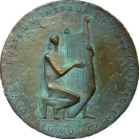
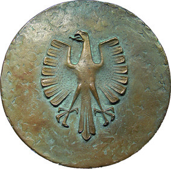

# Richtlinien für die Verleihung der PRO MUSICA-Plakette (ProMusPlRL)

Ausfertigungsdatum
:   1968-03-07

Fundstelle
:   BGBl I: 1968, 222

Geändert durch
:   Erlass v. 12.8.2016 I 1978

## (XXXX)

1.  Die PRO MUSICA-Plakette ist als Auszeichnung für Vereinigungen von
    Musikliebhabern bestimmt, die sich in langjährigem Wirken besondere
    Verdienste um die Pflege des instrumentalen Musizierens und damit um
    die Förderung des kulturellen Lebens erworben haben.
    Die Auszeichnung besteht aus einer Urkunde und einer Plakette, die auf
    der Vorderseite „Musizierende“ mit Lyra und die Inschrift „Für
    Verdienste um instrumentales Musizieren – PRO MUSICA“, und auf der
    Rückseite den Bundesadler zeigt. Form und Größe der Plakette sind auf
    einer Mustertafel festgelegt.

2.  Die PRO MUSICA-Plakette wird durch den Bundespräsidenten aus Anlass
    des mindestens einhundertjährigen Bestehens einer Musikvereinigung auf
    deren Antrag verliehen. Voraussetzung für die Verleihung ist der
    Nachweis, dass sich die Musikvereinigung in ernster und erfolgreicher
    musikalischer Arbeit der Pflege der instrumentalen Musik gewidmet und
    im Rahmen der örtlich gegebenen Verhältnisse künstlerische Verdienste
    oder Verdienste um die musikalische Bildung erworben hat.

3.  Der Antrag auf Verleihung der PRO MUSICA-Plakette kann frühestens im
    Vorjahr des Jubiläumsjahres gestellt werden. Die Antragsformulare sind
    bei der Geschäftsstelle des Empfehlungsausschusses zur Verleihung der
    PRO-MUSICA-Plakette und den Musikverbänden erhältlich.
    Musikvereinigungen, die durch einen Musikverband vertreten werden,
    richten ihren Antrag bis zum 30. Juni des Jahres der Antragsstellung
    an ihren Musikverband. Der Musikverband prüft den Antrag formal und
    bescheinigt die Vollständigkeit des Antrags und die Plausibilität der
    in dem Antrag gemachten Angaben. Der Musikverband leitet den Antrag
    nebst den eingereichten Ergänzungsunterlagen bis zum 30. September des
    Jahres der Antragsstellung an die Geschäftsstelle des
    Empfehlungsausschusses weiter.
    Musikvereinigungen, die durch keinen Musikverband vertreten werden,
    richten den Antrag bis zum 30. Juni des Jahres der Antragsstellung an
    das jeweils zuständige Landesministerium. Das Landesministerium prüft
    den Antrag formal und bescheinigt die Vollständigkeit des Antrags und
    die Plausibilität der in dem Antrag gemachten Angaben. Das
    Landesministerium leitet den Antrag nebst den eingereichten
    Ergänzungsunterlagen bis zum 30. September des Jahres der
    Antragsstellung an die Geschäftsstelle des Empfehlungsausschusses
    weiter.
    Musikvereinigungen mit Sitz im Ausland richten den Antrag bis zum 30.
    Juni des Jahres der Antragsstellung über die jeweilige diplomatische
    oder konsularische Vertretung der Bundesrepublik Deutschland an das
    Auswärtige Amt. Das Auswärtige Amt prüft den Antrag formal und
    bescheinigt die Vollständigkeit des Antrags und die Plausibilität der
    in dem Antrag gemachten Angaben. Das Auswärtige Amt leitet den Antrag
    nebst den eingereichten Ergänzungsunterlagen bis zum 30. September des
    Jahres der Antragsstellung an die Geschäftsstelle des
    Empfehlungsausschusses weiter.

4.  Der Antrag ist in dreifacher Ausfertigung einzureichen. Dem Antrag
    sind folgende Unterlagen in einfacher Ausfertigung beizufügen:

    a)  Ein geschichtlicher Abriss der Musikvereinigung mit Daten in
        Zeitabständen von 5 bis 10 Jahren unter Hinweis auf die hierfür
        beigefügten Belege.

    b)  Ein Nachweis über die Gründungszeit (Gründungsprotokoll, Satzung oder
        authentische Belege, die auf die Gründungszeit hinweisen). Die
        Dokumente sind in beglaubigter Kopie vorzulegen.

    c)  Ein Tätigkeitsbericht der Musikvereinigung über ihre musikalischen
        Aktivitäten der letzten fünf Jahre, hierzu Konzertprogramme sowie
        einschlägige, mit Datum versehene Presseberichte, ferner
        Konzertprogramme und Festbücher von Jubiläumsfeiern sowie Unterlagen
        über besondere Leistungen in früherer Zeit, die zur Begründung des
        Antrags wesentlich erscheinen.

    d)  Eine Bescheinigung der Stadt oder der Gemeinde im Original über die
        kulturelle Betätigung der Musikvereinigung und ihre Verdienste um das
        instrumentale Musizieren.

    e)  Bei eingetragenen Vereinen: ein aktueller Auszug aus dem
        Vereinsregister.

5.  Die Geschäftsstelle des Empfehlungsausschusses ist bei einem
    bundesweit tätigen Dachverband des instrumentalen Laienmusizierens
    angesiedelt, der durch gesonderte Vereinbarung zwischen dem
    Bundespräsidialamt und der für Kultur und Medien zuständigen obersten
    Bundesbehörde und den bundesweit tätigen Dachverbänden des
    instrumentalen Laienmusizierens zu bestimmen ist. Die Geschäftsstelle
    verantwortet die organisatorische und inhaltliche Vorbereitung der
    Sitzung des Empfehlungsausschusses.

6.  Der Empfehlungssauschuss besteht aus drei institutionellen Mitgliedern
    und gegebenenfalls einem Vertreter des Auswärtigen Amtes entsprechend
    Ziffer 6 Absatz 3 der Richtlinien.
    Der Empfehlungsausschuss tagt jährlich.
    Zu den institutionellen Mitgliedern gehören ein Vertreter der für
    Kultur und Medien zuständigen obersten Bundesbehörde, ein Vertreter
    der Ständigen Konferenz der Kultusminister der Länder und ein
    Vertreter des Dachverbandes an, bei dem die Geschäftsstelle des
    Empfehlungsausschusses angesiedelt ist.
    Wenn der Empfehlungsausschuss über einen Antrag einer Musikvereinigung
    mit Sitz im Ausland zu entscheiden hat, tritt ein Vertreter des
    Auswärtigen Amtes hinzu, der für die Dauer der gesamten Sitzung an der
    Beratung und Entscheidung des Empfehlungsausschusses teilnimmt.
    Beschlussfassungen des Empfehlungsausschusses durch
    Fernkommunikationsmittel sind zulässig, wenn kein Mitglied diesem
    Verfahren widerspricht. Diese Beschlüsse sind schriftlich festzuhalten
    und der Niederschrift über die nächste Ausschusssitzung als Anlage
    beizufügen.

7.  Der Empfehlungsausschuss prüft die von seiner Geschäftsstelle
    vorbereiteten Anträge und empfiehlt dem jeweils zuständigen
    Landesministerium, dem Bundespräsidenten den Vorschlag zur Verleihung
    der PRO MUSICA-Plakette zu unterbreiten. Der Vorschlag wird dem
    Bundespräsidenten nach Gegenzeichnung durch den Bundeskanzler oder
    einen zuständigen Bundesminister durch die für Kultur und Medien
    zuständige oberste Bundesbehörde vorgelegt.
    Bei Anträgen von Musikvereinigungen mit Sitz im Ausland empfiehlt der
    Empfehlungsausschuss dem Auswärtigen Amt, dem Bundespräsidenten den
    Vorschlag zur Verleihung der PRO MUSICA-Plakette zu unterbreiten. Der
    Vorschlag wird dem Bundespräsidenten nach Gegenzeichnung durch den
    Bundesminister des Auswärtigen durch das Auswärtige Amt vorgelegt.

8.  Die Urkunden über die Verleihung der Plakette werden vom
    Bundespräsidenten unterzeichnet.
    Urkunden und Plaketten können den Musikvereinigungen erst nach der
    zentralen Verleihungsveranstaltung auf Bundesebene ausgehändigt
    werden.
    Bei Musikvereinigungen mit Sitz im Ausland erfolgt die Aushändigung
    von Urkunden und Plaketten durch die diplomatische oder konsularische
    Vertretung der Bundesrepublik Deutschland in dem betreffenden Land.

9.  Bundesweit tätiger Dachverband des instrumentalen Laienmusizierens im
    Sinne dieser Richtlinie ist eine Musikorganisation, der mehrere, nicht
    nur einer bestimmten Region zugehörige Musikverbände aus verschiedenen
    instrumentalen Sparten als Mitglieder angehören. Musikverband im Sinne
    dieser Richtlinie ist ein Zusammenschluss von einzelnen
    Musikvereinigungen.

*    *   Vorderseite

    *   Rückseite

*    *        
    *        

*    *
        Plakette: rund, Bronze

        Originalgröße: 16 cm

## Schlußformel

Der Bundespräsident
Der Bundeskanzler
Der Bundesminister des Innern

