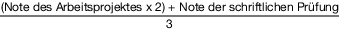

# Verordnung über die Meisterprüfung zum anerkannten Fortbildungsabschluss Revierjagdmeister und Revierjagdmeisterin (RevierjagdMeisterPrV)

Ausfertigungsdatum
:   2019-04-09

Fundstelle
:   BGBl I: 2019, 499

Stand: Ersetzt V 806-21-13-2 v. 28.12.1982, 1983 I 3 (RevierjMeistPrV)

## Eingangsformel

Auf Grund des § 53 Absatz 3 in Verbindung mit Absatz 2 des
Berufsbildungsgesetzes, dessen Absatz 3 zuletzt durch Artikel 436
Nummer 4 Buchstabe b der Verordnung vom 31. August 2015 (BGBl. I S.
1474) geändert worden ist, verordnet das Bundesministerium für
Ernährung und Landwirtschaft im Einvernehmen mit dem Bundesministerium
für Bildung und Forschung nach Anhörung des Hauptausschusses des
Bundesinstituts für Berufsbildung:

## Abschnitt 1 - Allgemeines

### § 1 Ziel der Meisterprüfung und Bezeichnung des Fortbildungsabschlusses

(1) Mit der Prüfung zum anerkannten Fortbildungsabschluss
Revierjagdmeister und Revierjagdmeisterin soll die auf einen
beruflichen Aufstieg abzielende Erweiterung der beruflichen
Handlungsfähigkeit nachgewiesen werden.

(2) Die Prüfung wird von den nach § 71 Absatz 3 und 8 des
Berufsbildungsgesetzes zuständigen Stellen durchgeführt.

(3) Durch die Erweiterung der beruflichen Handlungsfähigkeit soll der
Revierjagdmeister oder die Revierjagdmeisterin in der Lage sein, die
in den nachfolgenden drei Bereichen Jagd, Betriebswirtschaft sowie
Personal und Qualifizierung genannten Aufgaben (Absatz 4 Nummer 1 bis
3) in unterschiedlich strukturierten Unternehmen der
Wildbewirtschaftung, der Land- und Forstwirtschaft und in der
Jagdverwaltung sowie in Behörden und in Einrichtungen des
Naturschutzes, in der
Lebensraumgestaltung und              in der Landschaftspflege
wahrzunehmen. Der Revierjagdmeister oder die Revierjagdmeisterin soll
dabei diese Unternehmen, Behörden und Einrichtungen oder Teile von
ihnen eigenverantwortlich führen und Leitungsaufgaben ausüben können
sowie auf sich verändernde Anforderungen und Rahmenbedingungen
reagieren können.

(4) Zur erweiterten beruflichen Handlungsfähigkeit gehören die
folgenden drei Bereiche mit den jeweils genannten Aufgaben:

1.  Bereich Jagd:

    a)  Planen, Kalkulieren und Organisieren

        aa) der Bewirtschaftung von Wildbeständen und -besätzen,

        bb) des Jagdbetriebes,

        cc) der Reviergestaltung,

        dd) der nachhaltigen Nutzung natürlicher Ressourcen,

        ee) der Lebensraumgestaltung,

        ff) der Landschaftspflege,

        gg) des Personal- und des Technikeinsatzes,

        hh) der Öffentlichkeitsarbeit,

        ii) der Wildtier- und Naturpädagogik,

        jj) der Qualitätssicherung,

        kk) des Angebots von Dienstleistungen und

        ll) von Maßnahmen für die Vermarktung von Produkten und Dienstleistungen,

        jeweils unter Beachtung der Betriebsverhältnisse und der Anforderungen
        des Marktes,

    b)  Entwickeln und Umsetzen von betrieblichen Qualitäts- und
        Quantitätsvorgaben,

    c)  Nutzen der Möglichkeiten der Digitalisierung,

    d)  Beachten von Vorschriften zum Datenschutz und zur Datensicherheit,

    e)  Entscheiden über Art, Umfang, Zielsetzung und Zeitpunkt betrieblicher
        Maßnahmen und Abläufe,

    f)  Durchführen, Kontrollieren und Bewerten der Maßnahmen und Arbeiten
        unter Beachtung von Nachhaltigkeitsaspekten sowie der Belange der
        Land-, Forst- und Fischereiwirtschaft, des Natur-, Tier-, Arten-,
        Umwelt- und Verbraucherschutzes, der Anforderungen des Marktes und der
        Anforderungen des Gesundheitsschutzes, der Unfallverhütung und der
        Qualitätssicherung,

    g)  Vermarkten von Produkten und Dienstleistungen und

    h)  Vorbereiten und Durchführen der erforderlichen Maßnahmen des Arbeits-
        und Gesundheitsschutzes in Zusammenarbeit mit den mit der
        Arbeitssicherheit befassten Stellen;

2.  Bereich Betriebswirtschaft:

    a)  Entwickeln von Zielen, Konzepten und Maßnahmen für

        aa) den Jagdbetrieb und die Reviergestaltung,

        bb) die nachhaltige Nutzung natürlicher Ressourcen,

        cc) die Lebensraumgestaltung und Landschaftspflege sowie

        dd) das Vermarkten von Produkten und Dienstleistungen,

        jeweils unter Beachtung der Betriebsverhältnisse und der Anforderungen
        des Marktes,

    b)  Analysieren und Planen der betrieblichen Abläufe und der
        Betriebsorganisation nach wirtschaftlichen Gesichtspunkten unter
        Beachtung rechtlicher Erfordernisse sowie der Prinzipien der
        Nachhaltigkeit,

    c)  kaufmännische Disposition beim Beschaffen von Betriebsmitteln und
        Dienstleistungen, beim Arbeits-, Material- und Maschineneinsatz sowie
        bei der Vermarktung von Produkten und Dienstleistungen,

    d)  ökonomische Kontrolle der Betriebsteile und des Gesamtbetriebes,

    e)  Planen, Kalkulieren und Beurteilen von Investitionen,

    f)  Zusammenarbeiten mit Verbänden, Behörden und Institutionen sowie mit
        Marktteilnehmern und anderen Betrieben,

    g)  Nutzen der Möglichkeiten von Information, Beratung und Förderung und

    h)  Beachten von Vorschriften zum Datenschutz und zur Datensicherheit;

3.  Bereich Personal und Qualifizierung:

    a)  Prüfen der betrieblichen und der persönlichen
        Ausbildungsvoraussetzungen,

    b)  Planen der Ausbildung unter inhaltlichen, methodischen und zeitlichen
        Aspekten entsprechend den Vorgaben der Ausbildungsordnung,

    c)  Auswählen und Einstellen von Auszubildenden,

    d)  Durchführen der Ausbildung unter Anwendung geeigneter Methoden bei der
        Vermittlung von Ausbildungsinhalten,

    e)  Hinführen der Auszubildenden zu selbständigem Handeln,

    f)  Vorbereiten auf Prüfungen,

    g)  Informieren und Beraten über Fortbildungsmöglichkeiten,

    h)  Auswählen und Einstellen von Mitarbeitern und Mitarbeiterinnen,

    i)  Übertragen von Aufgaben auf Mitarbeiter und Mitarbeiterinnen
        entsprechend ihrer Leistungsfähigkeit, Qualifikation und Eignung,

    j)  Anleiten und Kontrollieren von Mitarbeitern und Mitarbeiterinnen in
        Arbeitsprozessen,

    k)  kooperatives Führen sowie Fördern und Motivieren von Mitarbeitern und
        Mitarbeiterinnen,

    l)  Unterstützen der beruflichen Weiterbildung von Mitarbeitern und
        Mitarbeiterinnen und

    m)  Beachten von Vorschriften zum Datenschutz und zur Datensicherheit.

(5) Die erfolgreich abgelegte Prüfung führt zum anerkannten
Fortbildungsabschluss Revierjagdmeister oder Revierjagdmeisterin.

### § 2 Voraussetzungen für die Zulassung zur Prüfung

(1) Zur Meisterprüfung ist zuzulassen, wer Folgendes nachweist:

1.  eine erfolgreich abgelegte Abschlussprüfung im anerkannten
    Ausbildungsberuf Revierjäger oder Revierjägerin und eine auf die
    Berufsausbildung folgende, mindestens zweijährige Berufspraxis,

2.  eine erfolgreich abgelegte Abschlussprüfung in einem anderen
    anerkannten landwirtschaftlichen Ausbildungsberuf und eine auf die
    Berufsausbildung folgende, mindestens dreijährige Berufspraxis oder

3.  eine mindestens fünfjährige Berufspraxis.

(2) Die Berufspraxis nach Absatz 1 muss im Bereich des
Berufsjagdwesens nachgewiesen werden.

(3) Abweichend von den in den Absätzen 1 und 2 genannten
Voraussetzungen ist zur Prüfung auch zuzulassen, wer durch Vorlage von
Zeugnissen oder auf andere Weise glaubhaft macht, eine berufliche
Handlungsfähigkeit erworben zu haben, die die Zulassung zur Prüfung
rechtfertigt.

### § 3 Gliederung der Meisterprüfung

Die Meisterprüfung umfasst die folgenden Prüfungsteile:

1.  Jagdbetrieb, Jagd- und Wildtiermanagement und Dienstleistungen,

2.  Betriebs- und Unternehmensführung sowie

3.  Berufsausbildung und Mitarbeiterführung.

## Abschnitt 2 - Prüfungsteil Jagdbetrieb, Jagd- und Wildtiermanagement und Dienstleistungen

### § 4 Anforderungen und Prüfungsinhalte

(1) Im Prüfungsteil Jagdbetrieb, Jagd- und Wildtiermanagement und
Dienstleistungen soll der Prüfling nachweisen, dass er in der Lage
ist,

1.  Jagdreviere und deren Wildbestände nachhaltig zu bewirtschaften,

2.  Wildbestände zu hegen,

3.  natürliche Ressourcen nachhaltig zu gewinnen und zu nutzen,

4.  Lebensräume zu gestalten,

5.  Dienstleistungen anzubieten,

6.  Öffentlichkeitsarbeit zu leisten und

7.  Maßnahmen der Land- und Forstwirtschaft sowie des Natur-, Tier- und
    Artenschutzes anzuwenden

und dabei den Einsatz von Arbeitskräften, Maschinen, Geräten, Waffen,
Optik, Munition und Betriebseinrichtungen sowie von Betriebs- und
Arbeitsstoffen zu planen, zu organisieren, durchzuführen, zu
kontrollieren und zu beurteilen.

(2) Bei der Prüfung soll der Prüfling auch zeigen, dass er die
entsprechenden Maßnahmen unter Beachtung von Wirtschaftlichkeit, der
Anforderungen des Marktes, der Land- und Forstwirtschaft,
berufsbezogener Rechtsvorschriften, der Erfordernisse des Tier- und
Artenschutzes, des Umwelt- und Naturschutzes, der Arbeitssicherheit,
der Nachhaltigkeit, des Verbraucher- und Gesundheitsschutzes sowie der
Qualitätssicherung als Führungskraft durchführen kann.

(3) Die Prüfung erstreckt sich auf folgende Inhalte:

1.  Planen, Organisieren und Beurteilen des Jagdbetriebes, des Jagd- und
    Wildtiermanagements und der Dienstleistungen, jeweils unter Beachtung
    der Betriebs- und Marktverhältnisse,

2.  Entscheiden über Art und Zeitpunkt von Maßnahmen und Arbeiten im
    Jagdbetrieb, im Jagd- und Wildtiermanagement und bei Dienstleistungen,
    jeweils unter Berücksichtigung vor- und nachgelagerter Arbeiten und
    Prozesse,

3.  Durchführen, Kontrollieren und Bewerten von Maßnahmen und Arbeiten im
    Jagdbetrieb, im Jagd- und Wildtiermanagement und bei Dienstleistungen,
    jeweils unter Beachtung von Nachhaltigkeitsaspekten, der Betriebs- und
    Marktverhältnisse, der Belange des Arbeits- und Gesundheitsschutzes
    und der Unfallverhütung,

4.  Vermarkten von Produkten und Dienstleistungen,

5.  Entwickeln von Qualitäts- und Nachhaltigkeitsstandards,

6.  Durchführen von Maßnahmen zur Qualitätssicherung,

7.  Kontrollieren, Beurteilen und Optimieren von betrieblichen Abläufen,

8.  Sicherstellen des Arbeits- und Gesundheitsschutzes,

9.  Berücksichtigen der für den Tätigkeitsbereich relevanten rechtlichen
    Bestimmungen sowie

10. Sicherstellen der erforderlichen Dokumentationen und Aufzeichnungen.

### § 5 Struktur der Prüfung

Die Prüfung besteht aus

1.  einem Arbeitsprojekt nach § 6 sowie

2.  einer schriftlichen Prüfung nach § 7.

### § 6 Arbeitsprojekt

(1) Mit der Durchführung des Arbeitsprojektes soll der Prüfling
nachweisen, dass er in der Lage ist, ausgehend von konkreten
betrieblichen Situationen die komplexen Zusammenhänge des
Jagdbetriebes, des Jagd- und Wildtiermanagements und der
Dienstleistungen zu erfassen und zu analysieren sowie
Lösungsvorschläge für betriebliche Probleme zu erstellen und
umzusetzen.

(2) Die Aufgabe für das Arbeitsprojekt soll sich auf den laufenden
Betrieb eines Jagdbetriebes, eines jagdlichen Dienstleisters oder
eines vergleichbaren Unternehmens beziehen und für dessen weitere
Entwicklung von Bedeutung sein. Bei der Wahl der Aufgabe für das
Projekt sollen Vorschläge des Prüflings berücksichtigt werden.

(3) Stellt der Prüfungsausschuss fest, dass das geplante
Arbeitsprojekt in dem gewählten Unternehmen nicht durchgeführt werden
kann, so hat er in Abstimmung mit dem Prüfling eine gleichwertige
Aufgabe für ein Arbeitsprojekt in einem geeigneten Unternehmen zu
stellen.

(4) Der Prüfling hat das Arbeitsprojekt schriftlich zu planen, den
Verlauf der Bearbeitung sowie die Ergebnisse zu dokumentieren und in
einem Fachgespräch zu erläutern. Das Fachgespräch erstreckt sich auf
den Verlauf und die Ergebnisse des Arbeitsprojekts sowie auf die
hierfür relevanten Prüfungsinhalte nach § 4 Absatz 3.

(5) Für die Durchführung des Arbeitsprojekts steht dem Prüfling ein
Zeitraum von zwölf Monaten zur
Verfügung.              Das Fachgespräch soll nicht länger als 120
Minuten dauern.

### § 7 Schriftliche Prüfung

(1) Die schriftliche Prüfung besteht aus einer unter Aufsicht
anzufertigenden Arbeit mit komplexen praxisbezogenen Aufgaben aus den
Prüfungsinhalten nach § 4 Absatz 3.

(2) Die Bearbeitungszeit für die schriftliche Prüfung beträgt 180
Minuten.

## Abschnitt 3 - Prüfungsteil Betriebs- und Unternehmensführung

### § 8 Anforderungen und Prüfungsinhalte

(1) Im Prüfungsteil Betriebs- und Unternehmensführung soll der
Prüfling nachweisen, dass er wirtschaftliche, rechtliche und soziale
Zusammenhänge im Betrieb erkennen, analysieren und beurteilen sowie
Entwicklungsmöglichkeiten aufzeigen kann.

(2) Die Prüfung erstreckt sich auf folgende Inhalte:

1.  Einordnen und Beurteilen der Rahmenbedingungen und der Strukturen von
    Jagdbetrieben,

2.  Kontrollieren und Bewerten von Prozessen, Produkten und
    Dienstleistungen,

3.  Erfassen, Analysieren und Bewerten von Betriebsergebnissen,

4.  Planen der Betriebsentwicklung, insbesondere unter Beachtung von
    Investition und Finanzierung sowie der Einflüsse von Liquidität,
    Rentabilität und Stabilität,

5.  Bewerten von Betriebs- und Arbeitsorganisation,

6.  Beobachten und Bewerten von Märkten,

7.  Beurteilen und Anwenden von Maßnahmen der Vermarktung, der
    Kommunikation und der Öffentlichkeitsarbeit,

8.  Anwenden berufsbezogener Rechtsvorschriften sowie

9.  Anwenden der Grundsätze betriebswirtschaftlicher Buchführung und der
    steuerlichen Buchführung unter Beachtung von Steuerarten und
    -verfahren.

### § 9 Struktur der Prüfung

Die Prüfung besteht aus

1.  einem Arbeitsprojekt nach § 10 sowie

2.  einer schriftlichen Prüfung nach § 11.

### § 10 Arbeitsprojekt

(1) Im Arbeitsprojekt soll der Prüfling eine komplexe
betriebswirtschaftliche Aufgabe in einem Jagdbetrieb oder in einem
Betrieb mit jagdlichen Dienstleistungen bearbeiten. Das Projekt soll
für die weitere Entwicklung des Gesamtbetriebes oder eines
wesentlichen Teils des Betriebes von Bedeutung sein. Bei der Wahl der
Aufgabe sollen Vorschläge des Prüflings berücksichtigt werden.

(2) Stellt der Prüfungsausschuss fest, dass das geplante
Arbeitsprojekt in dem gewählten Betrieb nicht durchgeführt werden
kann, so hat er in Abstimmung mit dem Prüfling eine gleichwertige
Aufgabe für ein Arbeitsprojekt in einem geeigneten Betrieb zu stellen.

(3) Das Arbeitsprojekt soll auf betriebswirtschaftlichen
Aufzeichnungen eines Betriebes aufbauen; diese sind nicht Gegenstand
der Bewertung.

(4) Der Prüfling hat das Arbeitsprojekt schriftlich zu planen, die
Bearbeitung des Projekts sowie die Ergebnisse zu dokumentieren und in
einem Fachgespräch zu erläutern. Das Fachgespräch erstreckt sich auf
den Verlauf und die Ergebnisse des Arbeitsprojekts sowie auf die
hierfür relevanten Prüfungsinhalte nach § 8 Absatz 2.

(5) Für die Durchführung des Arbeitsprojekts steht dem Prüfling ein
Zeitraum von sechs Monaten zur Verfügung. Das Fachgespräch soll nicht
länger als 60 Minuten dauern.

### § 11 Schriftliche Prüfung

(1) Die schriftliche Prüfung besteht aus einer unter Aufsicht
anzufertigenden Arbeit mit komplexen praxisbezogenen Aufgaben aus den
Prüfungsinhalten nach § 8 Absatz 2.

(2) Die Bearbeitungszeit für die schriftliche Prüfung beträgt 180
Minuten.

## Abschnitt 4 - Prüfungsteil Berufsausbildung und Mitarbeiterführung

### § 12 Anforderungen und Handlungsfelder

(1) Im Prüfungsteil Berufsausbildung und Mitarbeiterführung soll der
Prüfling nachweisen, dass er Zusammenhänge der Berufsbildung und
Mitarbeiterführung erkennen, Auszubildende ausbilden und Mitarbeiter
und Mitarbeiterinnen führen kann sowie dass er über entsprechende
fachliche, methodische und didaktische Fähigkeiten verfügt.

(2) Der Nachweis der Qualifikation nach Absatz 1 ist in folgenden
Handlungsfeldern zu führen:

1.  Ausbildungsvoraussetzungen prüfen und Ausbildung planen,

2.  Ausbildung vorbereiten und Auszubildende einstellen,

3.  Ausbildung durchführen,

4.  Ausbildung abschließen,

5.  Personalbedarf ermitteln, Mitarbeiter und Mitarbeiterinnen auswählen,
    einstellen und Aufgaben auf diese übertragen sowie

6.  Mitarbeiter und Mitarbeiterinnen anleiten, führen, fördern und
    motivieren sowie deren berufliche Weiterbildung unterstützen.

(3) Das Handlungsfeld „Ausbildungsvoraussetzungen prüfen und
Ausbildung planen“ nach Absatz 2 Nummer 1 umfasst folgende
Kompetenzen:

1.  die Vorteile und den Nutzen betrieblicher Ausbildung darstellen und
    begründen,

2.  Planungen hinsichtlich des betrieblichen Ausbildungsbedarfs auf der
    Grundlage der rechtlichen, tarifvertraglichen und betrieblichen
    Rahmenbedingungen durchführen und Entscheidungen treffen,

3.  die Strukturen des Berufsbildungssystems und seine Schnittstellen
    darstellen,

4.  Ausbildungsberufe für den Betrieb auswählen und die Auswahl begründen,

5.  die Eignung des Betriebes für die ausgewählten Ausbildungsberufe
    prüfen sowie prüfen, ob und inwieweit Ausbildungsinhalte durch
    Maßnahmen außerhalb der Ausbildungsstätte, insbesondere durch
    Ausbildung im Verbund sowie durch überbetriebliche und
    außerbetriebliche Ausbildung, vermittelt werden müssen,

6.  die Möglichkeiten des Einsatzes von auf die Berufsausbildung
    vorbereitenden Maßnahmen einschätzen sowie

7.  die Aufgaben der an der Ausbildung Mitwirkenden unter Berücksichtigung
    ihrer Funktionen und Qualifikationen im Betrieb abstimmen.

(4) Das Handlungsfeld „Ausbildung vorbereiten und Auszubildende
einstellen“ nach Absatz 2 Nummer 2 umfasst folgende Kompetenzen:

1.  auf der Grundlage einer Ausbildungsordnung einen betrieblichen
    Ausbildungsplan erstellen, der sich insbesondere an berufstypischen
    Arbeits- und Geschäftsprozessen orientiert,

2.  die Möglichkeiten der Mitwirkung und Mitbestimmung der betrieblichen
    Interessenvertretungen in der Berufsbildung berücksichtigen,

3.  den Kooperationsbedarf ermitteln und sich inhaltlich sowie
    organisatorisch mit den Kooperationspartnern, insbesondere mit der
    Berufsschule, abstimmen,

4.  Kriterien und Verfahren zur Auswahl von Auszubildenden, auch unter
    Berücksichtigung ihrer Verschiedenartigkeit, anwenden,

5.  den Berufsausbildungsvertrag vorbereiten und die Eintragung des
    Vertrags bei der zuständigen Stelle veranlassen sowie

6.  die Möglichkeit prüfen, ob Teile der Berufsausbildung im Ausland
    durchgeführt werden können.

(5) Das Handlungsfeld „Ausbildung durchführen“ nach Absatz 2 Nummer 3
umfasst folgende Kompetenzen:

1.  lernförderliche Bedingungen und eine motivierende Lernkultur schaffen,
    Rückmeldungen geben und empfangen,

2.  die Probezeit organisieren, gestalten und bewerten,

3.  aus dem betrieblichen Ausbildungsplan und den berufstypischen Arbeits-
    und Geschäftsprozessen betriebliche Lern- und Arbeitsaufgaben
    entwickeln und gestalten,

4.  Ausbildungsmethoden und -medien zielgruppengerecht auswählen und
    situationsspezifisch einsetzen,

5.  Auszubildende bei Lernschwierigkeiten durch individuelle Gestaltung
    der Ausbildung und Lernberatung unterstützen, bei Bedarf
    ausbildungsunterstützende Hilfen einsetzen und die Möglichkeit zur
    Verlängerung der Ausbildungszeit prüfen,

6.  Auszubildenden zusätzliche Ausbildungsangebote, insbesondere in Form
    von Zusatzqualifikationen, machen und die Möglichkeit der Verkürzung
    der Ausbildungsdauer und die der vorzeitigen Zulassung zur
    Abschlussprüfung prüfen,

7.  die soziale und persönliche Entwicklung von Auszubildenden fördern,
    Probleme und Konflikte rechtzeitig erkennen und gegebenenfalls auf
    Lösungen hinwirken,

8.  Leistungen feststellen und bewerten, Leistungsbeurteilungen Dritter
    und Prüfungsergebnisse auswerten, Beurteilungsgespräche führen und
    Rückschlüsse für den weiteren Ausbildungsverlauf ziehen sowie

9.  interkulturelle Kompetenzen fördern.

(6) Das Handlungsfeld „Ausbildung abschließen“ nach Absatz 2 Nummer 4
umfasst folgende Kompetenzen:

1.  Auszubildende auf die Abschlussprüfung unter Berücksichtigung der
    Prüfungstermine vorbereiten und die Ausbildung zu einem erfolgreichen
    Abschluss führen,

2.  für die Anmeldung der Auszubildenden zu Prüfungen bei der zuständigen
    Stelle sorgen und die zuständige Stelle auf Besonderheiten hinweisen,
    die für die Durchführung der Prüfung relevant sind,

3.  an der Erstellung eines schriftlichen Zeugnisses auf der Grundlage von
    Leistungsbeurteilungen mitwirken sowie

4.  Auszubildende über betriebliche Entwicklungswege und berufliche
    Weiterbildungsmöglichkeiten informieren und beraten.

(7) Das Handlungsfeld „Personalbedarf ermitteln, Mitarbeiter und
Mitarbeiterinnen auswählen, einstellen und Aufgaben auf diese
übertragen“ nach Absatz 2 Nummer 5 umfasst folgende Kompetenzen:

1.  rechtliche Grundlagen des Arbeits-, Tarif- und Sozialrechts im Betrieb
    umsetzen,

2.  Vorschriften zum Datenschutz und zur Datensicherheit beachten,

3.  Konzepte der Personalplanung anwenden,

4.  Mitarbeiter und Mitarbeiterinnen auswählen, einstellen und
    einarbeiten,

5.  Leistungsfähigkeit, Qualifikation und Eignung von Mitarbeitern und
    Mitarbeiterinnen beurteilen und Aufgaben auf diese entsprechend der
    Beurteilung übertragen,

6.  zur Krankheitsprävention anleiten und Maßnahmen der
    Krankheitsprävention organisieren sowie

7.  die Beendigung von Arbeitsverhältnissen durchführen.

(8) Das Handlungsfeld „Mitarbeiter und Mitarbeiterinnen anleiten,
führen, fördern und motivieren sowie deren berufliche Weiterbildung
unterstützen“ nach Absatz 2 Nummer 6 umfasst folgende Kompetenzen:

1.  Mitarbeiter und Mitarbeiterinnen anleiten, Leistungen und Verhalten
    gegebenenfalls unter Hinzuziehung von Leistungsbeurteilungen Dritter
    feststellen und bewerten,

2.  Mitarbeiter- und Beurteilungsgespräche führen und
    Entwicklungsmöglichkeiten aufzeigen,

3.  Mitarbeiter und Mitarbeiterinnen motivieren und fördern,

4.  Mitarbeiter und Mitarbeiterinnen qualifizieren und bei der
    Weiterbildung unterstützen,

5.  soziale Zusammenhänge und Konflikte erkennen,

6.  Maßnahmen zur Konfliktbewältigung anwenden, Teamarbeit organisieren
    und unterstützen sowie

7.  Führungsstile kennen und das eigene Führungsverhalten kritisch
    beurteilen.

### § 13 Struktur der Prüfung

(1) Der Prüfungsteil Berufsausbildung und Mitarbeiterführung gliedert
sich in folgende Abschnitte:

1.  Berufsausbildung und

2.  Mitarbeiterführung.

(2) Die Prüfung im Abschnitt Berufsausbildung beinhaltet

1.  einen praktischen Teil nach § 14 und

2.  einen schriftlichen Teil nach § 15.

(3) Die Prüfung im Abschnitt Mitarbeiterführung besteht aus einer
Fallstudie nach § 16.

### § 14 Praktischer Teil

(1) Der praktische Teil besteht aus der Durchführung einer
Ausbildungssituation und einem Fachgespräch.

(2) Die Ausbildungssituation ist vom Prüfling in Abstimmung mit dem
Prüfungsausschuss zu wählen. Sie ist schriftlich zu planen und
praktisch durchzuführen. Wahl, Gestaltung und Durchführung der
Ausbildungssituation sind im Fachgespräch zu erläutern.

(3) Für die schriftliche Planung der Ausbildungssituation steht ein
Zeitraum von sieben Tagen zur Verfügung. Für die praktische
Durchführung der Ausbildungssituation stehen 60 Minuten zur Verfügung.
Das Fachgespräch soll nicht länger als 30 Minuten dauern.

### § 15 Schriftlicher Teil

(1) Im schriftlichen Teil soll der Prüfling fallbezogene Aufgaben
unter Aufsicht bearbeiten. Die Aufgaben sollen sich auf die in § 12
Absatz 3 bis 6 beschriebenen Kompetenzen beziehen.

(2) Die Bearbeitungszeit für den schriftlichen Teil beträgt 150
Minuten.

### § 16 Fallstudie

(1) In der Fallstudie soll der Prüfling eine Situation der
Mitarbeiterführung bearbeiten. Die Situation wird vom
Prüfungsausschuss vorgegeben und muss sich auf die in § 12 Absatz 7
und 8 beschriebenen Kompetenzen beziehen.

(2) Der Prüfling soll die vorgegebene Situation analysieren,
Handlungsoptionen entwickeln, diese schriftlich darlegen und in einem
Fachgespräch erläutern.

(3) Für die Bearbeitung der Fallstudie stehen
120 Minuten zur              Verfügung. Das Fachgespräch soll nicht
länger als 30 Minuten dauern.

## Abschnitt 5 - Befreiung von Prüfungsleistungen, Bewertungen in den Prüfungen, Bestehens- und Zeugnisregelungen

### § 17 Befreiung von Prüfungsleistungen

Für die Befreiung von einzelnen Prüfungsteilen nach § 3 oder von
Prüfungen nach den §§ 6 und 7, den §§ 10 und 11 sowie den §§ 14 bis 16
ist § 56 Absatz 2 des Berufsbildungsgesetzes anzuwenden.

### § 18 Bewertungen in den Prüfungen

(1) Die drei Prüfungsteile nach § 3 sind gesondert zu bewerten.

(2) Für die Bewertung des Prüfungsteils „Jagdbetrieb, Jagd- und
Wildtiermanagement und Dienstleistungen“ ist eine Note aus der
Bewertung des Arbeitsprojektes (§ 6) und der Bewertung der
schriftlichen Prüfung (§ 7) nach folgender Formel zu bilden:

*    *
    *   Note des Prüfungsteils =
                .

(3) Für die Bewertung des Prüfungsteils „Betriebs- und
Unternehmensführung“ ist eine Note aus der Bewertung des
Arbeitsprojektes (§ 10) und der Bewertung der schriftlichen Prüfung (§
11) nach folgender Formel zu bilden:

*    *
    *   Note des Prüfungsteils =
                .

(4) Im Prüfungsteil „Berufsausbildung und Mitarbeiterführung“ ist
zunächst eine Note für die Bewertung des Abschnitts „Berufsausbildung“
aus der Bewertung des praktischen Teils (§ 14) und der Bewertung des
schriftlichen Teils (§ 15) nach folgender Formel zu bilden:

*    *
    *   Note des Abschnitts Berufsausbildung =
                .

Anschließend ist für die Bewertung des Prüfungsteils „Berufsausbildung
und Mitarbeiterführung“ eine Note aus der Bewertung der Leistung im
Abschnitt „Berufsausbildung“ nach Satz 1 und der Bewertung der
Fallstudie (§ 16) nach folgender Formel zu bilden:

*    *
    *   Note des Prüfungsteils =
                .

(5) Über die Gesamtleistung in der Prüfung ist eine Note zu bilden;
sie wird als arithmetisches Mittel aus den Noten für die einzelnen
Prüfungsteile errechnet. Im Fall der Befreiung von einzelnen
Prüfungsbestandteilen nach § 17 entfällt diese Verpflichtung.

### § 19 Bestehen der Meisterprüfung; Zeugnis

(1) Die Prüfung ist bestanden, wenn der Prüfling in jedem Prüfungsteil
(§ 3) mindestens die Note „ausreichend“ erzielt hat.

(2) Die Prüfung ist nicht bestanden, wenn

1.  eine der Leistungen in den Prüfungen nach den §§ 6 und 7, den §§ 10
    und 11 sowie den §§ 14 bis 16 mit „ungenügend“ bewertet worden ist
    oder

2.  mehr als eine der in Nummer 1 genannten Leistungen mit „mangelhaft“
    bewertet worden ist.

(3) Ist die Meisterprüfung bestanden, stellt die zuständige Stelle
darüber ein Zeugnis aus.

(4) Im Fall des Bestehens stellt die zuständige Stelle für jeden
Prüfling ein weiteres Zeugnis aus, in dem mindestens anzugeben sind:

1.  die Ergebnisse der Leistungen aus den einzelnen Prüfungen nach den §§
    6 und 7, den §§ 10 und 11 sowie den §§ 14 bis 16, die Ergebnisse der
    Prüfungsteile nach § 18 Absatz 2 bis 4 sowie die Gesamtnote nach § 18
    Absatz 5 und

2.  Befreiungen nach § 17, wobei jede Befreiung mit Ort, Datum und der
    Bezeichnung des Prüfungsgremiums der anderweitig abgelegten Prüfung
    anzugeben ist.

## Abschnitt 6 - Ergänzungs- und Wiederholungsprüfung

### § 20 Mündliche Ergänzungsprüfung

(1) Wurden eine oder zwei der Prüfungen nach den §§ 7, 11 und 15
schlechter als mit „ausreichend“ bewertet, ist auf Antrag des
Prüflings eine dieser Prüfungen durch eine mündliche Prüfung zu
ergänzen, wenn dies den Ausschlag für das Bestehen der Prüfung
insgesamt geben kann.

(2) Die mündliche Ergänzungsprüfung soll nicht länger als 30 Minuten
dauern.

(3) Für die Ermittlung des Ergebnisses der ergänzten Prüfung ist die
bisherige Note der Prüfung und die Note der mündlichen
Ergänzungsprüfung im Verhältnis 2:1 zu gewichten.

### § 21 Wiederholung der Meisterprüfung

(1) Eine Meisterprüfung, die nicht bestanden wurde, kann zweimal
wiederholt werden.

(2) In der Wiederholungsprüfung ist der Prüfling auf Antrag von der
Prüfung in einzelnen Prüfungsteilen nach § 3 und in einzelnen
Prüfungen nach den §§ 6 und 7, den §§ 10 und 11 sowie den §§ 14 bis 16
zu befreien, wenn

1.  die entsprechenden Leistungen in einer vorangegangenen Prüfung
    mindestens mit „ausreichend“ bewertet worden sind und

2.  der Prüfling sich innerhalb von zwei Jahren, gerechnet vom Tag der
    Feststellung des Ergebnisses der nicht bestandenen Prüfung an, zur
    Wiederholungsprüfung anmeldet.

## Abschnitt 7 - Schlussvorschriften

### § 22 Übergangsvorschriften

(1) Die bis zum Ablauf des 29. April 2019 begonnenen Prüfungsverfahren
können nach den bis dahin geltenden Vorschriften zu Ende geführt
werden.

(2) Prüflinge, die die Prüfung nach den bis zum Ablauf des 29. April
2019 geltenden Vorschriften nicht bestanden
haben und              die sich innerhalb von zwei Jahren ab dem 30.
April 2019 zu einer Wiederholungsprüfung anmelden, können die
Wiederholungsprüfung nach den bis zum Ablauf des 29. April 2019
geltenden Vorschriften ablegen.

### § 23 Inkrafttreten, Außerkrafttreten

Diese Verordnung tritt am 30. April 2019 in Kraft. Gleichzeitig tritt
die Verordnung über die Anforderungen in der Meisterprüfung für den
Beruf Revierjäger/Revierjägerin vom 28. Dezember 1982 (BGBl. 1983 I S.
3), die zuletzt durch Artikel 10 der Verordnung vom 21. Mai 2014
(BGBl. I S. 548) geändert worden ist, außer Kraft.

