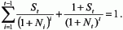
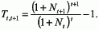
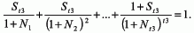
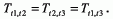
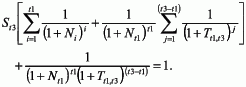
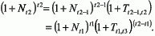
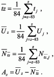
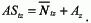

# Verordnung über die Ermittlung und Bekanntgabe der Sätze zur Abzinsung von Rückstellungen (RückAbzinsV)

Ausfertigungsdatum
:   2009-11-18

Fundstelle
:   BGBl I: 2009, 3790

Zuletzt geändert durch
:   Art. 9 G v. 11.3.2016 I 396

## Eingangsformel

Auf Grund des § 253 Absatz 2 Satz 4 und 5 des Handelsgesetzbuchs in
der im Bundesgesetzblatt Teil III, Gliederungsnummer 4100-1,
veröffentlichten bereinigten Fassung, der durch Artikel 1 Nummer 10
des Gesetzes vom 25. Mai 2009 (BGBl. I S. 1102) neu gefasst worden
ist, verordnet das Bundesministerium der Justiz im Benehmen mit der
Deutschen Bundesbank:

## § 1 Abzinsung von Rückstellungen

Rückstellungen für Verpflichtungen gemäß § 253 Absatz 2 Satz 1 und 2
des Handelsgesetzbuchs werden auf der Grundlage der
Abzinsungszinssätze abgezinst, die von der Deutschen Bundesbank nach
Maßgabe dieser Verordnung mit zwei Nachkommastellen ermittelt und
bekannt gemacht werden. Die Zinssätze werden aus einer um einen
Aufschlag erhöhten Null-Kupon-Euro-Zinsswapkurve ermittelt.

## § 2 Datengrundlage

Die Null-Kupon-Euro-Zinsswapkurve wird auf der Grundlage von Euro-
Festzins-Swapsätzen mit den Laufzeiten ein bis zehn Jahre, zwölf, 15,
20, 25, 30, 40 und 50 Jahre berechnet. Die verwendeten Zeitreihen sind
veröffentlichte Vortagsendstände für aus einer Reihe von Swap-
Anbietern zusammengesetzte beste Geldkurse mit Verzinsung auf der
Basis von 30 zu 360 Zinsberechnungstagen. Die Swapsätze für die
ganzjährigen Laufzeiten zwischen den genannten Laufzeiten werden
interpoliert. Die Berechnung des Aufschlags erfolgt anhand eines
breiten Rendite-Indexes für auf Euro lautende Unternehmensanleihen
aller Laufzeiten mit einer hochklassigen Bonitätseinstufung. Die Daten
können von internationalen Finanzdatenanbietern bezogen werden. Es ist
ausreichend, die Daten nur eines Finanzdatenanbieters heranzuziehen.

## § 3 Berechnungsgrundlagen und deren Abkürzungen

Die Zins-Swapsätze mit jährlicher Verzinsung werden wie folgt
bezeichnet:

*    *   S
        t                        =

    *   Festzins-Swapsatz mit Laufzeit
        t                        in Jahren,

*    *   N
        t                        =

    *   Null-Kupon-Swapsatz mit Laufzeit
        t                        und Zinszahlung erst am Laufzeitende,

*    *   T
        t 1,t 2                        =

    *   impliziter Null-Kupon-Termin-Swapsatz mit Laufzeit von
        t                       1 bis
        t                       2.

## § 4 Umrechnung von Festzins-Swapsätzen in Null-Kupon-Swapsätze

Die Null-Kupon-Swapsätze werden aus den Festzins-Swapsätzen mit Hilfe
der Null-Kupon-Anleihen-Entbündelung (Bootstrapping) abgeleitet, und
sind dadurch charakterisiert, dass die Fälligkeitstermine im
Jahresabstand aufeinanderfolgen und mit den Kuponterminen
zusammenfallen. Für den Gegenwartswert eines Festzins-Swaps mit
Laufzeit
t              gilt:

*    *        

   Der Festzins-Swapsatz mit einer Laufzeit von einem Jahr entspricht dem
Null-Kupon-Swapsatz mit einer einjährigen Laufzeit;
S
1              =
N
1             . Die weiteren ganzjährigen Null-Kupon-Swapsätze werden
wie folgt schrittweise berechnet:

*    *        

## § 5 Interpolation fehlender Laufzeiten

   (1) Der implizite Termin-Swapsatz aus Null-Kupon-Swapsätzen mit
Laufzeitbeginn
t              über eine Laufzeit von einem Jahr (der Termin-Swapsatz
zwischen
t              und
t              +1) wird wie folgt berechnet:

*    *        

   (2) Für Laufzeiten über zehn Jahre werden nicht alle jährlichen
Festzins-Swapsätze verwendet. Die dazwischenliegenden ganzjährigen
Laufzeiten werden aus den verwendeten Laufzeiten zwölf, 15, 20, 25,
30, 40 und 50 Jahre abgeleitet. Für die Interpolation wird die Annahme
getroffen, dass die Termin-Swapsätze für die dazwischenliegenden
Laufzeiten konstant sind. Die fehlenden Null-Kupon-Swapsätze mit
Laufzeit
t              2 werden dann mit der nachstehenden Methode ermittelt.
Der Gegenwartswert eines Festzins-Swaps mit Laufzeit
t              3 stellt sich wie folgt dar, wobei S
1             , S
2             ,…, S
t 1              und S
t 3              sowie N
1             , N
2             ,…, N
t 1              bekannt sind,
t             1<
t             2<
t             3 und
t              2 –
t              1*              1 sind:

*    *        

   Annahmegemäß gilt:

*    *        

*    *        

   Der Termin-Swapsatz (
T
t 1,t 3             ) wird in der letzten Gleichung, da der Swapsatz
mit Laufzeit
t              3 (
S
t 3             ) und die Null-Kupon-Swapsätze
N
1              bis
N
t 1              bekannt sind, mittels eines numerischen Verfahrens
(Newton-Verfahren) berechnet. Danach wird der Null-Kupon-Swapsatz mit
Laufzeit
t              2 (
N
t 2             ) durch das Einsetzen des Termin-Swapsatzes
T
t 1,t 3              in die folgende Gleichung bestimmt:

*    *        

## § 6 Berechnung des Aufschlags

   Zur Berechnung des Aufschlags wird die Rendite des
Unternehmensanleihenindexes über die vergangenen 84 Monatsendstände
arithmetisch gemittelt. Weiterhin wird die durchschnittliche Laufzeit
der im Index enthaltenen Anleihen über den gleichen Zeitraum
berechnet. Für diese durchschnittliche Laufzeit wird der Null-Kupon-
Swapsatz ermittelt (bei nicht ganzjährigen Laufzeiten durch lineare
Interpolation), auch dieser aus dem arithmetischen Mittel der letzten
84 Monatsendstände der Swapsätze. Dann wird der Abstand zwischen der
gemittelten Unternehmensanleihenrendite und dem laufzeitgleichen
gemittelten Null-Kupon-Swapsatz berechnet. Dieser Abstand erhöht als
Aufschlag die gemittelte Null-Kupon-Euro-Zinsswapkurve über deren
gesamte Laufzeit. Dabei sind
U
z              die Rendite des Unternehmensanleihenindexes,
tz              die durchschnittliche Laufzeit der Anleihen des
Indexes und
N
tz              der Null-Kupon-Swapsatz mit Laufzeit
t              zum Zeitpunkt
z             .Der Aufschlag (
A
z             ) ergibt sich wie folgt:

*    *        

   Der Abzinsungszinssatz mit Laufzeit
t              zum Zeitpunkt
z              (
AS
tz             ) ergibt sich dann als Summe vom jeweiligen gemittelten
Null-Kupon-Swapsatz und dem für diesen Zeitpunkt einheitlichen
Aufschlag:

*    *        

## § 6a Berechnung des Aufschlags bei Rückstellungen für Altersversorgungsverpflichtungen

   Für die Berechnung des Aufschlags bei Rückstellungen für
Altersversorgungsverpflichtungen nach § 253 Absatz 2 Satz 1 und 2 des
Handelsgesetzbuchs treten bei der Anwendung des § 6 an die Stelle von
84 Monatsendständen 120 Monatsendstände.

## § 7 Bekanntgabe

Auf Basis der Daten des letzten Handelstages des Monats veröffentlicht
die Deutsche Bundesbank monatlich die Null-Kupon-Euro-Zinsswapsätze
und die Abzinsungszinssätze für die ganzjährigen Laufzeiten von einem
Jahr bis 50 Jahre auf ihrer Internetseite www.bundesbank.de.

## § 8 Inkrafttreten

Diese Verordnung tritt am Tag nach der Verkündung in Kraft.

## § 8 Übergangsvorschrift zum Gesetz zur Umsetzung der Wohnimmobilienkreditrichtlinie und zur Änderung handelsrechtlicher Vorschriften

§ 6a in der Fassung des Gesetzes zur Umsetzung der
Wohnimmobilienkreditrichtlinie und zur Änderung handelsrechtlicher
Vorschriften vom 11. März 2016 (BGBl. I S. 396) ist erstmals auf die
Berechnung des Aufschlags zum 17. März 2016 anzuwenden. Die Deutsche
Bundesbank berechnet die Abzinsungszinssätze für Rückstellungen für
Altersversorgungsverpflichtungen nach Maßgabe des § 6a in der ab dem
17\. März 2016 geltenden Fassung auch rückwirkend auf Basis der Daten
des jeweils letzten Handelstages des Monats ab einschließlich Januar
2015 und veröffentlicht die so berechneten Abzinsungszinssätze
zusätzlich auf ihrer Internetseite.

